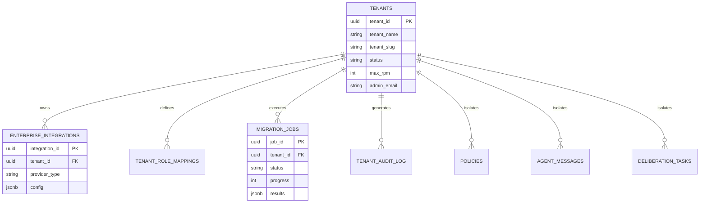

# Database Schema

This is the database schema implementation for the spec detailed in @.agent-os/specs/2026-01-07-enterprise-integration/spec.md

> Created: 2026-01-07
> Version: 1.0.0
> Constitutional Hash: cdd01ef066bc6cf2

## Entity Relationship Diagram



## Schema Changes Overview

This spec introduces multi-tenant support and enterprise integration configuration storage. All new tables include `tenant_id` for isolation, and Row-Level Security (RLS) policies ensure cross-tenant data protection.

## New Tables

### 1. tenants

Stores tenant metadata and configuration.

```sql
CREATE TABLE tenants (
    tenant_id UUID PRIMARY KEY DEFAULT gen_random_uuid(),
    tenant_name VARCHAR(255) NOT NULL UNIQUE,
    tenant_slug VARCHAR(100) NOT NULL UNIQUE,
    status VARCHAR(50) NOT NULL DEFAULT 'active' CHECK (status IN ('active', 'suspended', 'deactivated')),

    -- Resource quotas
    max_requests_per_minute INT NOT NULL DEFAULT 1000,
    max_storage_gb INT NOT NULL DEFAULT 10,
    max_concurrent_connections INT NOT NULL DEFAULT 100,

    -- Metadata
    constitutional_hash VARCHAR(16) NOT NULL DEFAULT 'cdd01ef066bc6cf2',
    created_at TIMESTAMPTZ NOT NULL DEFAULT NOW(),
    updated_at TIMESTAMPTZ NOT NULL DEFAULT NOW(),
    deactivated_at TIMESTAMPTZ,

    -- Contact and billing
    admin_email VARCHAR(255) NOT NULL,
    billing_plan VARCHAR(50) NOT NULL DEFAULT 'standard',

    -- Indexes
    CONSTRAINT valid_tenant_name CHECK (LENGTH(tenant_name) >= 3),
    CONSTRAINT valid_tenant_slug CHECK (tenant_slug ~ '^[a-z0-9-]+$')
);

CREATE INDEX idx_tenants_status ON tenants(status);
CREATE INDEX idx_tenants_slug ON tenants(tenant_slug);
```

**Rationale:** Central registry for all tenants. `tenant_slug` provides URL-safe identifier for API endpoints. Resource quotas prevent single tenant from consuming excessive resources.

### 2. enterprise_integrations

Stores enterprise integration configurations per tenant.

```sql
CREATE TABLE enterprise_integrations (
    integration_id UUID PRIMARY KEY DEFAULT gen_random_uuid(),
    tenant_id UUID NOT NULL REFERENCES tenants(tenant_id) ON DELETE CASCADE,

    integration_type VARCHAR(50) NOT NULL CHECK (integration_type IN (
        'ldap', 'saml', 'oauth', 'oidc', 'kafka', 'siem', 'data_warehouse'
    )),
    integration_name VARCHAR(255) NOT NULL,

    -- Configuration (encrypted JSON)
    config_encrypted TEXT NOT NULL,
    config_encryption_key_id VARCHAR(255) NOT NULL,

    -- Status
    enabled BOOLEAN NOT NULL DEFAULT true,
    health_status VARCHAR(50) NOT NULL DEFAULT 'unknown' CHECK (health_status IN (
        'healthy', 'degraded', 'unhealthy', 'unknown'
    )),
    last_health_check TIMESTAMPTZ,

    -- Metadata
    constitutional_hash VARCHAR(16) NOT NULL DEFAULT 'cdd01ef066bc6cf2',
    created_at TIMESTAMPTZ NOT NULL DEFAULT NOW(),
    updated_at TIMESTAMPTZ NOT NULL DEFAULT NOW(),
    created_by VARCHAR(255),

    -- Constraints
    UNIQUE(tenant_id, integration_type, integration_name)
);

CREATE INDEX idx_enterprise_integrations_tenant ON enterprise_integrations(tenant_id);
CREATE INDEX idx_enterprise_integrations_type ON enterprise_integrations(tenant_id, integration_type);
CREATE INDEX idx_enterprise_integrations_health ON enterprise_integrations(health_status);
```

**Rationale:** Stores sensitive integration configurations (LDAP credentials, SAML certs, API keys) with encryption. `config_encryption_key_id` references Vault key for decryption. Health status tracking enables monitoring.

### 3. tenant_role_mappings

Maps enterprise groups/attributes to MACI roles per tenant.

```sql
CREATE TABLE tenant_role_mappings (
    mapping_id UUID PRIMARY KEY DEFAULT gen_random_uuid(),
    tenant_id UUID NOT NULL REFERENCES tenants(tenant_id) ON DELETE CASCADE,
    integration_id UUID NOT NULL REFERENCES enterprise_integrations(integration_id) ON DELETE CASCADE,

    -- Source (LDAP group, SAML attribute, OAuth scope)
    source_type VARCHAR(50) NOT NULL CHECK (source_type IN (
        'ldap_group', 'saml_attribute', 'oauth_scope', 'oidc_claim'
    )),
    source_value VARCHAR(500) NOT NULL,

    -- Target MACI role
    maci_role VARCHAR(50) NOT NULL CHECK (maci_role IN (
        'EXECUTIVE', 'LEGISLATIVE', 'JUDICIAL', 'MONITOR', 'AUDITOR', 'CONTROLLER', 'IMPLEMENTER'
    )),

    -- Metadata
    constitutional_hash VARCHAR(16) NOT NULL DEFAULT 'cdd01ef066bc6cf2',
    created_at TIMESTAMPTZ NOT NULL DEFAULT NOW(),
    priority INT NOT NULL DEFAULT 100,

    -- Constraints
    UNIQUE(tenant_id, integration_id, source_type, source_value)
);

CREATE INDEX idx_tenant_role_mappings_tenant ON tenant_role_mappings(tenant_id);
CREATE INDEX idx_tenant_role_mappings_integration ON tenant_role_mappings(integration_id);
CREATE INDEX idx_tenant_role_mappings_priority ON tenant_role_mappings(tenant_id, priority DESC);
```

**Rationale:** Flexible role mapping supporting multiple source types (LDAP groups, SAML attributes, OAuth scopes). Priority field handles conflicts when user has multiple mappings.

### 4. migration_jobs

Tracks legacy system migration progress.

```sql
CREATE TABLE migration_jobs (
    job_id UUID PRIMARY KEY DEFAULT gen_random_uuid(),
    tenant_id UUID NOT NULL REFERENCES tenants(tenant_id) ON DELETE CASCADE,

    -- Job details
    job_type VARCHAR(50) NOT NULL CHECK (job_type IN (
        'policy_conversion', 'decision_log_import', 'shadow_mode', 'gap_analysis'
    )),
    job_status VARCHAR(50) NOT NULL DEFAULT 'pending' CHECK (job_status IN (
        'pending', 'running', 'completed', 'failed', 'cancelled'
    )),

    -- Source configuration
    source_system VARCHAR(255) NOT NULL,
    source_config JSONB NOT NULL,

    -- Progress tracking
    total_items INT,
    processed_items INT NOT NULL DEFAULT 0,
    successful_items INT NOT NULL DEFAULT 0,
    failed_items INT NOT NULL DEFAULT 0,

    -- Results
    result_summary JSONB,
    error_details TEXT,

    -- Timing
    started_at TIMESTAMPTZ,
    completed_at TIMESTAMPTZ,
    estimated_completion TIMESTAMPTZ,

    -- Metadata
    constitutional_hash VARCHAR(16) NOT NULL DEFAULT 'cdd01ef066bc6cf2',
    created_at TIMESTAMPTZ NOT NULL DEFAULT NOW(),
    created_by VARCHAR(255) NOT NULL
);

CREATE INDEX idx_migration_jobs_tenant ON migration_jobs(tenant_id);
CREATE INDEX idx_migration_jobs_status ON migration_jobs(tenant_id, job_status);
CREATE INDEX idx_migration_jobs_type ON migration_jobs(job_type);
CREATE INDEX idx_migration_jobs_created ON migration_jobs(created_at DESC);
```

**Rationale:** Centralized tracking for all migration activities. Progress counters enable UI progress bars. `result_summary` JSON stores conversion reports and gap analysis results.

### 5. tenant_audit_log

Per-tenant audit log with RLS for isolation.

```sql
CREATE TABLE tenant_audit_log (
    audit_id UUID PRIMARY KEY DEFAULT gen_random_uuid(),
    tenant_id UUID NOT NULL REFERENCES tenants(tenant_id) ON DELETE CASCADE,

    -- Event details
    event_type VARCHAR(100) NOT NULL,
    event_category VARCHAR(50) NOT NULL CHECK (event_category IN (
        'authentication', 'authorization', 'governance', 'integration', 'migration', 'admin'
    )),

    -- Actor
    actor_id VARCHAR(255),
    actor_type VARCHAR(50) CHECK (actor_type IN ('user', 'agent', 'system')),

    -- Target
    target_resource VARCHAR(500),
    target_id VARCHAR(255),

    -- Action result
    action VARCHAR(100) NOT NULL,
    result VARCHAR(50) NOT NULL CHECK (result IN ('success', 'failure', 'denied')),

    -- Details
    details JSONB,
    error_message TEXT,

    -- Context
    ip_address INET,
    user_agent TEXT,
    session_id VARCHAR(255),

    -- Compliance
    constitutional_hash VARCHAR(16) NOT NULL DEFAULT 'cdd01ef066bc6cf2',
    constitutional_validation_passed BOOLEAN NOT NULL DEFAULT true,

    -- Timestamp
    timestamp TIMESTAMPTZ NOT NULL DEFAULT NOW()
);

CREATE INDEX idx_tenant_audit_tenant ON tenant_audit_log(tenant_id);
CREATE INDEX idx_tenant_audit_timestamp ON tenant_audit_log(tenant_id, timestamp DESC);
CREATE INDEX idx_tenant_audit_category ON tenant_audit_log(event_category);
CREATE INDEX idx_tenant_audit_actor ON tenant_audit_log(actor_id);
CREATE INDEX idx_tenant_audit_result ON tenant_audit_log(result);

-- Partition by month for performance
CREATE TABLE tenant_audit_log_y2026m01 PARTITION OF tenant_audit_log
    FOR VALUES FROM ('2026-01-01') TO ('2026-02-01');
```

**Rationale:** Dedicated audit log per tenant with partitioning for performance at scale. Includes constitutional validation tracking for compliance reporting.

## Modified Tables

### policies

Add multi-tenant support to existing policies table.

```sql
-- Add tenant_id column (nullable for backward compatibility)
ALTER TABLE policies
ADD COLUMN tenant_id UUID REFERENCES tenants(tenant_id) ON DELETE CASCADE;

-- Create index for tenant queries
CREATE INDEX idx_policies_tenant ON policies(tenant_id);

-- Add constraint for new policies (must have tenant_id)
ALTER TABLE policies
ADD CONSTRAINT policies_tenant_required
CHECK (created_at < '2026-01-07' OR tenant_id IS NOT NULL);
```

**Rationale:** Existing policies without `tenant_id` are system-wide policies. New policies must specify tenant. Check constraint allows graceful migration.

### agent_messages

Add tenant context to agent messages.

```sql
ALTER TABLE agent_messages
ADD COLUMN tenant_id UUID REFERENCES tenants(tenant_id) ON DELETE CASCADE;

CREATE INDEX idx_agent_messages_tenant ON agent_messages(tenant_id);
```

**Rationale:** Agent messages must be scoped to tenant for proper isolation. Enables per-tenant message routing and audit trails.

### deliberation_tasks

Add tenant isolation to deliberation tasks.

```sql
ALTER TABLE deliberation_tasks
ADD COLUMN tenant_id UUID NOT NULL DEFAULT '00000000-0000-0000-0000-000000000000';

-- Create default "system" tenant for existing records
INSERT INTO tenants (tenant_id, tenant_name, tenant_slug, admin_email)
VALUES ('00000000-0000-0000-0000-000000000000', 'System', 'system', 'admin@acgs2.local')
ON CONFLICT DO NOTHING;

CREATE INDEX idx_deliberation_tasks_tenant ON deliberation_tasks(tenant_id);
```

**Rationale:** All deliberation tasks must belong to a tenant. Default system tenant holds legacy records.

## Row-Level Security (RLS) Policies

Enable RLS on multi-tenant tables to enforce isolation.

```sql
-- Enable RLS
ALTER TABLE tenants ENABLE ROW LEVEL SECURITY;
ALTER TABLE enterprise_integrations ENABLE ROW LEVEL SECURITY;
ALTER TABLE tenant_role_mappings ENABLE ROW LEVEL SECURITY;
ALTER TABLE migration_jobs ENABLE ROW LEVEL SECURITY;
ALTER TABLE tenant_audit_log ENABLE ROW LEVEL SECURITY;
ALTER TABLE policies ENABLE ROW LEVEL SECURITY;
ALTER TABLE agent_messages ENABLE ROW LEVEL SECURITY;
ALTER TABLE deliberation_tasks ENABLE ROW LEVEL SECURITY;

-- Create RLS policies (example for tenants table)
CREATE POLICY tenant_isolation_policy ON tenants
    USING (tenant_id = current_setting('app.current_tenant_id')::UUID);

CREATE POLICY tenant_isolation_policy ON enterprise_integrations
    USING (tenant_id = current_setting('app.current_tenant_id')::UUID);

-- Similar policies for other tables...

-- Admin bypass policy (for system operations)
CREATE POLICY admin_full_access ON tenants
    TO acgs2_admin
    USING (true);
```

**Rationale:** RLS ensures tenant isolation at database level. Application sets `app.current_tenant_id` session variable on each connection. Admin role can bypass for cross-tenant operations.

## Migrations

### Migration 001: Create Tenants and Enterprise Integration Tables

```sql
-- File: migrations/001_create_tenants.sql
BEGIN;

-- Create tenants table
CREATE TABLE tenants (...);  -- Full DDL from above

-- Create enterprise_integrations table
CREATE TABLE enterprise_integrations (...);

-- Create tenant_role_mappings table
CREATE TABLE tenant_role_mappings (...);

-- Create migration_jobs table
CREATE TABLE migration_jobs (...);

-- Create tenant_audit_log table with partitioning
CREATE TABLE tenant_audit_log (...);

COMMIT;
```

### Migration 002: Add Multi-Tenant Support to Existing Tables

```sql
-- File: migrations/002_add_multitenancy.sql
BEGIN;

-- Add tenant_id to policies
ALTER TABLE policies ADD COLUMN tenant_id UUID REFERENCES tenants(tenant_id);
CREATE INDEX idx_policies_tenant ON policies(tenant_id);

-- Add tenant_id to agent_messages
ALTER TABLE agent_messages ADD COLUMN tenant_id UUID REFERENCES tenants(tenant_id);
CREATE INDEX idx_agent_messages_tenant ON agent_messages(tenant_id);

-- Add tenant_id to deliberation_tasks with default system tenant
INSERT INTO tenants (tenant_id, tenant_name, tenant_slug, admin_email)
VALUES ('00000000-0000-0000-0000-000000000000', 'System', 'system', 'admin@acgs2.local')
ON CONFLICT DO NOTHING;

ALTER TABLE deliberation_tasks
ADD COLUMN tenant_id UUID NOT NULL DEFAULT '00000000-0000-0000-0000-000000000000'
REFERENCES tenants(tenant_id);

CREATE INDEX idx_deliberation_tasks_tenant ON deliberation_tasks(tenant_id);

COMMIT;
```

### Migration 003: Enable Row-Level Security

```sql
-- File: migrations/003_enable_rls.sql
BEGIN;

-- Enable RLS on all multi-tenant tables
ALTER TABLE tenants ENABLE ROW LEVEL SECURITY;
ALTER TABLE enterprise_integrations ENABLE ROW LEVEL SECURITY;
ALTER TABLE tenant_role_mappings ENABLE ROW LEVEL SECURITY;
ALTER TABLE migration_jobs ENABLE ROW LEVEL SECURITY;
ALTER TABLE tenant_audit_log ENABLE ROW LEVEL SECURITY;
ALTER TABLE policies ENABLE ROW LEVEL SECURITY;
ALTER TABLE agent_messages ENABLE ROW LEVEL SECURITY;
ALTER TABLE deliberation_tasks ENABLE ROW LEVEL SECURITY;

-- Create isolation policies
CREATE POLICY tenant_isolation_policy ON tenants
    USING (tenant_id = current_setting('app.current_tenant_id')::UUID);

-- (Repeat for all tables...)

COMMIT;
```

## Performance Considerations

- **Partitioning:** `tenant_audit_log` partitioned by month to handle high volume
- **Indexing:** All foreign keys and frequently queried columns indexed
- **RLS Overhead:** Session variable lookup cached by PostgreSQL query planner
- **Connection Pooling:** Each tenant gets dedicated connection pool to set session variable
- **Vacuum:** Automated vacuum scheduled for audit log partitions

## Data Retention

- **Tenant Audit Logs:** 90-day retention (configurable per tenant plan)
- **Migration Jobs:** Kept indefinitely for audit purposes
- **Deactivated Tenants:** 30-day grace period before data deletion
- **Integration Configs:** Archived on deletion, purged after 1 year
