# Claude-ACGS Integration Guide

<!-- Constitutional Hash: cdd01ef066bc6cf2 -->

## 🎯 Overview

This guide documents the comprehensive integration between Claude Code workflows and the ACGS-2 constitutional governance platform. The integration provides seamless agent coordination, constitutional compliance validation, and enterprise-grade workflow automation.

## 📂 File Structure

- **`.claude`**: Contains the core configuration, agent definitions, and integration guides for the Claude environment.
- **`.claude-flow`**: Stores runtime configurations and agent states for the `claude-flow` CLI tool.
- **`.claudedocs`**: Holds documentation, reports, and validation outputs generated by the system.


## 🏗️ Architecture Integration

### Current Integration Components

#### 1. **Constitutional Compliance Layer**
- **Constitutional Validator**: Pre-tool validation against ACGS constitutional framework
- **Compliance Monitoring**: Real-time constitutional compliance tracking
- **Audit Trail Generation**: Comprehensive logging of all constitutional validations

#### 2. **Enhanced Workflow Integration**
- **Agent Communication Bus**: Integration with ACGS Enhanced Agent Communication Bus
- **Message Routing**: Intelligent message routing between Claude and ACGS agents
- **Performance Monitoring**: Real-time performance metrics collection

#### 3. **Agent Orchestration System**
- **ACGS Integration Orchestrator**: Specialized agent for ACGS system integration
- **Multi-Agent Coordination**: Seamless coordination between Claude and ACGS agents
- **Task Delegation**: Intelligent task distribution across agent ecosystem

## 🔧 Implementation Details

### Hook System Enhancement

The integration extends the existing Claude hook system with ACGS-specific functionality:

```json
{
  "PreToolUse": [
    "pre_tool_use.py",           // Original safety validation
    "constitutional_validator.py" // ACGS constitutional compliance
  ],
  "PostToolUse": [
    "post_tool_use.py",                    // Original logging
    "enhanced_workflow_integration.py"     // ACGS integration
  ]
}
```

### Constitutional Compliance Integration

#### Validation Framework
- **Constitutional Hash**: `cdd01ef066bc6cf2` validation for all operations
- **Compliance Levels**: Critical, High, Medium, Low classification
- **Violation Detection**: Pattern-based detection of constitutional violations
- **Recommendation Engine**: Automated recommendations for compliance improvement

#### Safety Constraints
```python
# Example constitutional validation
violation_patterns = {
    "data_access": [r"\.env(?!\.sample)", r"secrets?/", r"private_key"],
    "destructive_operations": [r"rm\s+.*-[rf]", r"DROP\s+TABLE"],
    "unauthorized_access": [r"/etc/passwd", r"/root/", r"sudo\s+"]
}
```

### Agent Communication Integration

#### Message Format
```python
@dataclass
class AgentMessage:
    message_id: str
    sender_id: str
    recipient_id: str
    message_type: str
    priority: MessagePriority
    constitutional_hash: str
    payload: Dict[str, Any]
    timestamp: datetime
```

#### Communication Patterns
- **Direct Delegation**: Claude → ACGS agent task delegation
- **Event Broadcasting**: Workflow events to ACGS monitoring systems
- **Response Handling**: Asynchronous response processing from ACGS agents

## 🚀 Usage Patterns

### 1. Constitutional Compliance Validation

Every tool execution is automatically validated against constitutional framework:

```bash
# Automatic validation on tool use
Tool: Bash
Input: {"command": "rm -rf /tmp/safe_directory"}
Result: ✅ Constitutional compliance validated (hash: cdd01ef066bc6cf2)
```

### 2. Agent Delegation

Claude agents can delegate tasks to ACGS specialized agents:

```python
# Example delegation to ACGS Constitutional AI
await integrator.delegate_to_acgs_agent(
    agent_type="constitutional-ai",
    task_data={
        "analysis_type": "policy_compliance",
        "content": policy_document,
        "validation_level": "high"
    }
)
```

### 3. Performance Monitoring

Real-time integration metrics:

```json
{
  "messages_sent": 1247,
  "messages_received": 1198,
  "average_latency": 0.85,
  "error_count": 3,
  "constitutional_compliance_rate": 99.7
}
```

## 📊 Performance Targets

### Integration Performance Requirements
- **Message Latency**: <1.08ms P99 for critical operations
- **Throughput**: Support >200 RPS message routing
- **Availability**: 99.99% uptime for integration services
- **Constitutional Compliance**: 100% validation coverage

### Monitoring Metrics
- **Integration Health**: Real-time health monitoring
- **Performance Tracking**: Latency and throughput metrics
- **Error Monitoring**: Comprehensive error tracking and alerting
- **Compliance Metrics**: Constitutional compliance rate tracking

## 🔒 Security Framework

### Multi-Tenant Security
- **Tenant Isolation**: Message-level tenant isolation
- **Access Control**: Role-based access control for agent communication
- **Encryption**: End-to-end encryption for sensitive communications
- **Audit Logging**: Comprehensive security audit trails

### Constitutional Safety
- **Pre-execution Validation**: All operations validated before execution
- **Real-time Monitoring**: Continuous constitutional compliance monitoring
- **Violation Response**: Automatic blocking of constitutional violations
- **Transparency**: Full transparency in constitutional decision-making

## 🛠️ Configuration

### Environment Setup

```bash
# Required environment variables
CONSTITUTIONAL_HASH=cdd01ef066bc6cf2
REDIS_HOST=localhost
REDIS_PORT=6379
ACGS_AGENT_ID=claude-workflow-agent
```

### Integration Configuration

```json
{
  "integration": {
    "enabled": true,
    "constitutional_validation": true,
    "performance_monitoring": true,
    "agent_delegation": true
  },
  "performance": {
    "target_latency_ms": 1.08,
    "target_throughput_rps": 200,
    "cache_ttl_seconds": 300
  }
}
```

## 📈 Monitoring & Observability

### Metrics Collection
- **Prometheus Integration**: Native Prometheus metrics export
- **Grafana Dashboards**: Pre-built dashboards for integration monitoring
- **Alerting**: Intelligent alerting for integration issues
- **Log Aggregation**: Centralized logging with structured log format

### Health Checks
- **Integration Health**: Continuous health monitoring
- **Constitutional Compliance**: Real-time compliance status
- **Performance Metrics**: Latency and throughput monitoring
- **Error Tracking**: Comprehensive error monitoring and analysis

## 🔄 Workflow Examples

### Example 1: Code Analysis with Constitutional Validation

```mermaid
sequenceDiagram
    participant Claude
    participant ConstitutionalValidator
    participant ACGSAgent
    participant Redis

    Claude->>ConstitutionalValidator: Validate code analysis request
    ConstitutionalValidator-->>Claude: ✅ Compliant (hash: cdd01ef066bc6cf2)
    Claude->>Redis: Send analysis request to ACGS
    Redis->>ACGSAgent: Route message to Constitutional AI
    ACGSAgent-->>Redis: Analysis results
    Redis-->>Claude: Constitutional analysis complete
```



### Example 2: Multi-Agent Task Coordination


## 🎯 Success Metrics

### Integration Success Indicators
- **Constitutional Compliance**: 100% validation coverage
- **Performance**: Meeting <1.08ms P99 latency targets
- **Reliability**: 99.99% integration uptime
- **Security**: Zero constitutional violations in production
- **User Experience**: Seamless workflow integration

### Operational Excellence
- **Monitoring Coverage**: 100% observability
- **Error Handling**: Graceful degradation and recovery
- **Documentation**: Comprehensive operational documentation
- **Testing**: Automated testing for all integration points

---

*This integration guide provides comprehensive documentation for the Claude-ACGS integration, ensuring constitutional compliance, enterprise performance, and operational excellence.*
