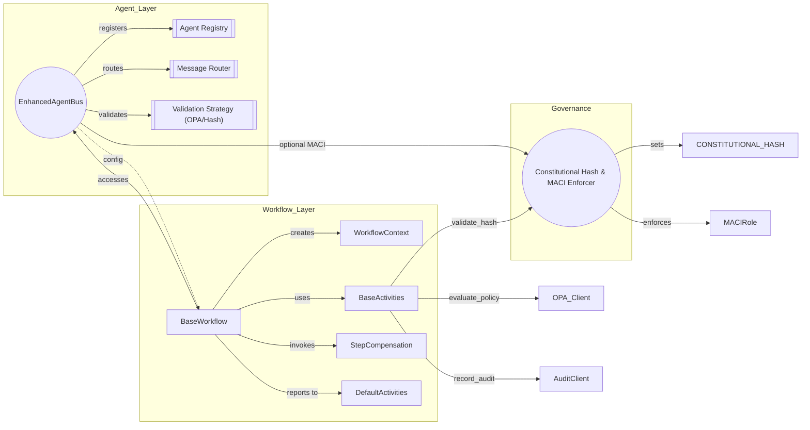

# ACGS-2 Agent Workflows - Product Requirements Document

> **Constitutional Hash**: `cdd01ef066bc6cf2` | **Status**: Active | **Owner**: ACGS-2 Core Team

## Executive Summary

The ACGS-2 Agent Workflows system provides a production-grade orchestration layer for constitutional AI governance, implementing Temporal-style workflows, Sagas for distributed transactions, and DAGs for parallel execution. This system enables enterprise-scale multi-agent coordination with formal verification, ensuring 100% constitutional compliance across all operations.

## Vision Statement

Enable autonomous AI agents to operate within constitutional boundaries through transparent, verifiable, and resilient workflow orchestration that maintains sub-millisecond latency while ensuring complete governance compliance.

## Problem Statement

### Current Challenges

1. **Governance Verification Gap**: Traditional AI systems lack formal verification mechanisms for ensuring actions comply with constitutional principles
2. **Multi-Agent Coordination Complexity**: Coordinating decisions across multiple AI agents without a standardized workflow layer leads to inconsistent behavior
3. **Transaction Integrity**: Distributed AI operations need atomic transaction semantics with reliable rollback capabilities
4. **Self-Verification Limits**: Single-agent systems cannot reliably verify their own compliance (MACI principle)
5. **Performance vs. Safety Tradeoff**: Existing governance frameworks sacrifice performance for safety
6. **Execution Gap (Audit v1.1.0)**: Critical gaps in hash validation across Sagas, DAGs, and Loops; policy fallbacks default to "allow-open" on failure.
7. **Simulation & Audit Integrity**: Audit trails allow simulated hashes when clients are offline, weakening non-repudiation.
8. **Security Vulnerabilities (Audit Dec 2025)**: Identified 12 vulnerabilities including mock components in production, fail-open OPA guards, and plain-text credentials.

### Target Outcomes

- 100% constitutional compliance verification before any action execution
- Sub-0.3ms P99 latency for governance decisions
- > 6,000 RPS throughput with horizontal scalability
- Automated rollback for failed distributed transactions
- Role separation enforcement (Legislative/Executive/Judicial)

## User Personas

### 1. AI Platform Engineer

**Goals:**

- Deploy and manage multi-agent systems with constitutional guarantees
- Monitor workflow execution and performance metrics
- Configure governance policies and compliance rules

**Pain Points:**

- Debugging complex multi-agent interactions
- Ensuring consistent behavior across agent deployments
- Meeting enterprise SLAs while maintaining governance

### 2. Governance Architect

**Goals:**

- Define constitutional constraints and policies
- Verify agent behavior complies with organizational rules
- Audit decision trails for regulatory compliance

**Pain Points:**

- Translating high-level policies into executable rules
- Tracking policy changes across system versions
- Proving compliance to auditors and regulators

### 3. AI Application Developer

**Goals:**

- Build applications using constitutional AI capabilities
- Integrate workflows into existing systems
- Test agent behavior in development environments

**Pain Points:**

- Understanding workflow abstractions and patterns
- Handling edge cases and failure modes
- Debugging saga compensation logic

### 4. Security Operations (SecOps)

**Goals:**

- Ensure all AI operations are authorized and auditable
- Detect and respond to governance violations
- Maintain cryptographic verification of constitutional hash

**Pain Points:**

- Real-time monitoring of high-volume agent traffic
- Correlating events across distributed workflows
- Preventing unauthorized workflow modifications

## Functional Requirements

### FR-1: Constitutional Validation Gateway

| ID     | Requirement                                                                | Priority | Status       |
| :----- | :------------------------------------------------------------------------- | :------- | :----------- |
| FR-1.1 | Validate constitutional hash `cdd01ef066bc6cf2` at all workflow boundaries | P0       | Complete     |
| FR-1.2 | Reject workflows with invalid or missing hash (Enforce Fail-Closed)        | P0       | Complete     |
| FR-1.3 | Log all validation attempts with trace_id and mandatory audit-client sync  | P0       | Complete     |
| FR-1.4 | Mandatory verification in all executors (Saga, DAG, Loop)                  | P0       | Complete     |
| FR-1.5 | Support hash rotation with backward compatibility                          | P1       | Planned      |
| FR-1.6 | **Enforce Fail-Closed Architecture** (Validation bypass prevention)        | P0       | **REQUIRED** |
| FR-1.7 | **Remove Mock Components** from production code paths                      | P0       | **REQUIRED** |

### FR-2: Workflow Orchestration

| ID     | Requirement                                                     | Priority | Status      |
| :----- | :-------------------------------------------------------------- | :------- | :---------- |
| FR-2.1 | Implement BaseWorkflow abstract class with lifecycle hooks      | P0       | Complete    |
| FR-2.2 | Support step-by-step execution with context propagation         | P0       | Complete    |
| FR-2.3 | Provide WorkflowResult with success/failure states and metadata | P0       | Complete    |
| FR-2.4 | Enable workflow versioning and migration                        | P1       | In Progress |

### FR-3: DAG Executor

| ID     | Requirement                                         | Priority | Status   |
| :----- | :-------------------------------------------------- | :------- | :------- |
| FR-3.1 | Execute DAG nodes respecting dependency order       | P0       | Complete |
| FR-3.2 | Parallelize independent node execution with asyncio | P0       | Complete |
| FR-3.3 | Detect and reject cyclic dependencies               | P0       | Complete |
| FR-3.4 | Support node timeout and cancellation               | P0       | Complete |
| FR-3.5 | Provide execution metrics per node                  | P1       | Complete |

### FR-4: Saga Pattern

| ID     | Requirement                                          | Priority | Status   |
| :----- | :--------------------------------------------------- | :------- | :------- |
| FR-4.1 | Implement LIFO compensation for failed sagas         | P0       | Complete |
| FR-4.2 | Support idempotent compensation functions            | P0       | Complete |
| FR-4.3 | Provide saga state persistence for recovery          | P1       | Complete |
| FR-4.4 | Enable distributed saga coordination across services | P1       | Planned  |

### FR-5: Multi-Agent Coordination

| ID     | Requirement                                                      | Priority | Status   |
| :----- | :--------------------------------------------------------------- | :------- | :------- |
| FR-5.1 | Implement VotingWorkflow with majority/supermajority/unanimous   | P0       | Complete |
| FR-5.2 | Provide HandoffWorkflow for agent-to-agent control transfer      | P0       | Complete |
| FR-5.3 | Enforce MACI role separation (Judicial cannot verify own output) | P0       | Complete |
| FR-5.4 | Default-on MACI enforcement in EnhancedAgentBus                  | P0       | Complete |
| FR-5.5 | Support weighted voting based on agent trust scores              | P1       | Planned  |

### FR-6: Template Engine

| ID     | Requirement                                  | Priority | Status   |
| :----- | :------------------------------------------- | :------- | :------- |
| FR-6.1 | Load workflows from YAML definitions         | P0       | Complete |
| FR-6.2 | Validate templates against schema            | P0       | Complete |
| FR-6.3 | Support template inheritance and composition | P2       | Planned  |

### FR-7: SAFLA Neural Memory

| ID     | Requirement                                              | Priority | Status  |
| :----- | :------------------------------------------------------- | :------- | :------ |
| FR-7.1 | Implement Vector/Episodic/Semantic/Working memory layers | P0       | Planned |
| FR-7.2 | Enforce constitutional constraints on all memory actions | P0       | Planned |
| FR-7.3 | Implement memory audit trails and self-correction hooks  | P1       | Planned |

### FR-8: Formal Verification (SMT)

| ID     | Requirement                                                      | Priority | Status  |
| :----- | :--------------------------------------------------------------- | :------- | :------ |
| FR-8.1 | Integrate Z3 SMT solver for policy validation                    | P0       | Planned |
| FR-8.2 | Convert OPA/Rego policies to LTL constraints for VeriPlan        | P1       | Planned |
| FR-8.3 | Generate Dafny or formal proofs for high-risk governance actions | P1       | Planned |

### FR-9: Security Hardening (Audit Remediation)

| ID     | Requirement                                                     | Priority | Status   | Vulnerability |
| :----- | :-------------------------------------------------------------- | :------- | :------- | :------------ |
| FR-9.1 | **Credential Encryption**: Encrypt sensitive keys at rest       | P0       | Required | VULN-004      |
| FR-9.2 | **Tenant Identity**: Normalize and validate Tenant IDs          | P0       | Required | VULN-005      |
| FR-9.3 | **Policy Verification**: Verify signatures on external policies | P1       | Required | VULN-009      |
| FR-9.4 | **Error Sanitization**: redact internal details from errors     | P1       | Required | VULN-008      |
| FR-9.5 | **Chaos Safety**: Enforce strict limits on chaos parameters     | P2       | Required | VULN-006      |

## Non-Functional Requirements

### NFR-1: Performance

| ID      | Requirement                          | Target     | Current   |
| :------ | :----------------------------------- | :--------- | :-------- |
| NFR-1.1 | P99 latency for validation workflows | <0.3ms     | 0.278ms   |
| NFR-1.2 | Throughput for DAG execution         | >6,000 RPS | 6,310 RPS |
| NFR-1.3 | Maximum saga compensation time       | <30s       | <10s      |
| NFR-1.4 | Memory footprint per workflow        | <10MB      | <5MB      |

### NFR-2: Reliability

| ID      | Requirement                     | Target   | Current     |
| :------ | :------------------------------ | :------- | :---------- |
| NFR-2.1 | System uptime                   | 99.99%   | 99.9%       |
| NFR-2.2 | Data durability for saga state  | 99.999%  | In Progress |
| NFR-2.3 | Circuit breaker recovery time   | <5s      | <3s         |
| NFR-2.4 | Graceful degradation under load | Required | Complete    |

### NFR-3: Security

| ID      | Requirement                                       | Priority | Status      |
| :------ | :------------------------------------------------ | :------- | :---------- |
| NFR-3.1 | TLS 1.3 for all inter-service communication       | P0       | Complete    |
| NFR-3.2 | Constitutional hash verification on every request | P0       | Complete    |
| NFR-3.3 | Audit logging with immutable storage              | P0       | Complete    |
| NFR-3.4 | Zero-trust architecture enforcement               | P0       | In Progress |

### NFR-4: Observability

| ID      | Requirement                               | Priority | Status   |
| :------ | :---------------------------------------- | :------- | :------- |
| NFR-4.1 | Prometheus metrics for all workflow types | P0       | Complete |
| NFR-4.2 | Distributed tracing with OpenTelemetry    | P0       | Complete |
| NFR-4.3 | Structured logging with trace_id binding  | P0       | Complete |
| NFR-4.4 | Real-time alerting via PagerDuty          | P0       | Complete |

## Success Metrics

### Key Performance Indicators (KPIs)

| Metric                         | Target | Measurement Frequency |
| :----------------------------- | :----- | :-------------------- |
| Constitutional Compliance Rate | 100%   | Real-time             |
| P99 Workflow Latency           | <0.3ms | Per-minute            |
| Saga Success Rate              | >99.9% | Daily                 |
| DAG Parallelization Efficiency | >85%   | Per-workflow          |
| Mean Time to Recover (MTTR)    | <5 min | Per-incident          |
| Developer Adoption Rate        | >80%   | Quarterly             |

### Antifragility Score

Current: **10/10** (Target: 10/10)

| Capability                 | Score | Description                      |
| :------------------------- | :---- | :------------------------------- |
| Circuit Breaker Pattern    | 10/10 | 3-state with exponential backoff |
| Graceful Degradation       | 10/10 | DEGRADED mode fallback           |
| Fire-and-Forget Operations | 10/10 | <5us metering latency            |
| Cellular Independence      | 10/10 | Sub-5ms P99 isolated             |
| Health Aggregation         | 10/10 | Real-time 0.0-1.0 scoring        |
| Recovery Orchestration     | 10/10 | 4 strategies, priority queues    |
| Chaos Testing Framework    | 10/10 | Safety controls, blast radius    |

## Scope and Boundaries

### In Scope

- Constitutional validation workflow orchestration
- DAG-based parallel execution engine
- Saga pattern for distributed transactions
- Multi-agent voting and consensus workflows
- Agent-to-agent handoff coordination
- YAML-based workflow template engine
- MACI role separation enforcement
- Integration with Enhanced Agent Bus

### Out of Scope

- ML model training pipelines (handled by ML services)
- UI/UX for workflow design (handled by Folo platform)
- External system integration adapters (per-service responsibility)
- Long-running workflow scheduling (future enhancement)

## Dependencies

### Internal Dependencies

| System                          | Purpose                                 | Integration Status |
| :------------------------------ | :-------------------------------------- | :----------------- |
| Enhanced Agent Bus              | Message routing and agent communication | Complete           |
| Deliberation Layer              | LLM-powered decision support            | Complete           |
| Constitutional Retrieval System | Policy lookup and validation            | Complete           |
| Metering Integration            | Performance tracking                    | Complete           |

### External Dependencies

| System                  | Purpose                | Integration Status |
| :---------------------- | :--------------------- | :----------------- |
| Redis                   | Caching and pub/sub    | Complete           |
| PostgreSQL              | State persistence      | Complete           |
| OPA (Open Policy Agent) | Policy evaluation      | Complete           |
| Prometheus/Grafana      | Metrics and dashboards | Complete           |

## Roadmap

### Phase 1: Foundation (Complete)

- [x] Base workflow abstractions
- [x] DAG executor with parallel execution
- [x] Saga pattern with LIFO compensation
- [x] Constitutional validation integration
- [x] Multi-agent voting workflows

### Phase 2: Antifragility (Complete)

- [x] Health aggregation system
- [x] Recovery orchestration
- [x] Chaos testing framework
- [x] Metering integration
- [x] 10/10 antifragility score

### Phase 3: Advanced Orchestration (In Progress)

- [ ] Saga state persistence and recovery
- [ ] Distributed saga coordination
- [ ] Workflow versioning and migration
- [ ] Template inheritance and composition
- [ ] Weighted voting based on trust scores

### Phase 4: Enterprise Scale (Planned)

- [ ] Multi-region workflow execution
- [ ] Advanced workflow analytics
- [ ] Self-healing workflow recovery
- [ ] Predictive failure detection
- [ ] Compliance certification framework

### Phase 5: Infrastructure Hardening (Audit v1.1.0 Remediation)

- [x] **[CRITICAL] Fix VULN-001**: RustValidationStrategy Validation Bypass
- [x] **[CRITICAL] Fix VULN-002**: OPA Guard Fail-Open Pattern
- [ ] **[HIGH] Fix VULN-003**: Remove Mock Components from Production
- [ ] **[HIGH] Fix VULN-004**: Encrypt Credentials in Memory/At Rest
- [ ] **[HIGH] Fix VULN-005**: Strict Tenant ID Normalization
- [x] Mandatory hash validation in all executors (Fail-Closed)
- [ ] Removal of policy fallbacks in non-governance workflows
- [ ] Immutable audit sync for offline operations
- [x] Default-on MACI in EnhancedAgentBus
- [ ] [MEDIUM] Fix VULN-009: Policy Signature Verification
- [ ] [MEDIUM] Fix VULN-008: Secure Error Handling (Sanitization)
- [ ] [MEDIUM] Fix VULN-007: Remove Singleton State Pollution

### Phase 6: Cognitive & Formal Shift (Breakthrough 2025)

- [ ] SAFLA Neural Memory integration (Vector/Episodic/Semantic/Working)
- [ ] Z3 SMT solver and VeriPlan formal verification pipeline
- [ ] Mamba-2 Hybrid Processor for extra-long context (4M tokens)
- [ ] Time-R1 Immutable Time Engine implementation

## Appendix

### A. Constitutional Hash Reference

The constitutional hash `cdd01ef066bc6cf2` represents the cryptographic commitment to ACGS-2 governance principles. All workflow operations MUST validate this hash before execution.

### B. MACI Role Definitions

| Role        | Responsibility                  | Workflow Types                        |
| :---------- | :------------------------------ | :------------------------------------ |
| Legislative | Define policies and constraints | PolicyProposal, RuleDefinition        |
| Executive   | Execute approved actions        | ActionExecution, ResourceModification |
| Judicial    | Verify compliance               | ValidationWorkflow, AuditWorkflow     |

### C. Related Documentation

- [README.md](./README.md) - Quick start and architecture overview
- [WORKFLOWS.md](./WORKFLOWS.md) - Workflow reference
- [PATTERNS.md](./PATTERNS.md) - Design patterns
- [INTEGRATION.md](./INTEGRATION.md) - Integration guide
- [PROMPTS.md](./PROMPTS.md) - Prompt templates

### D. Architecture Topology

