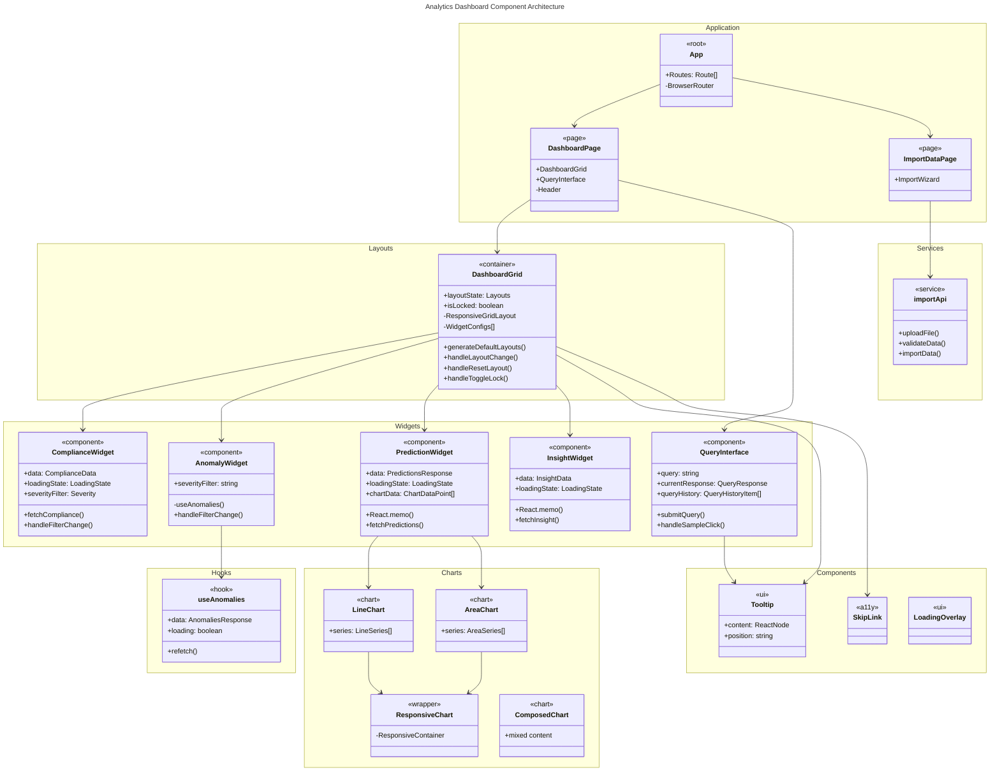
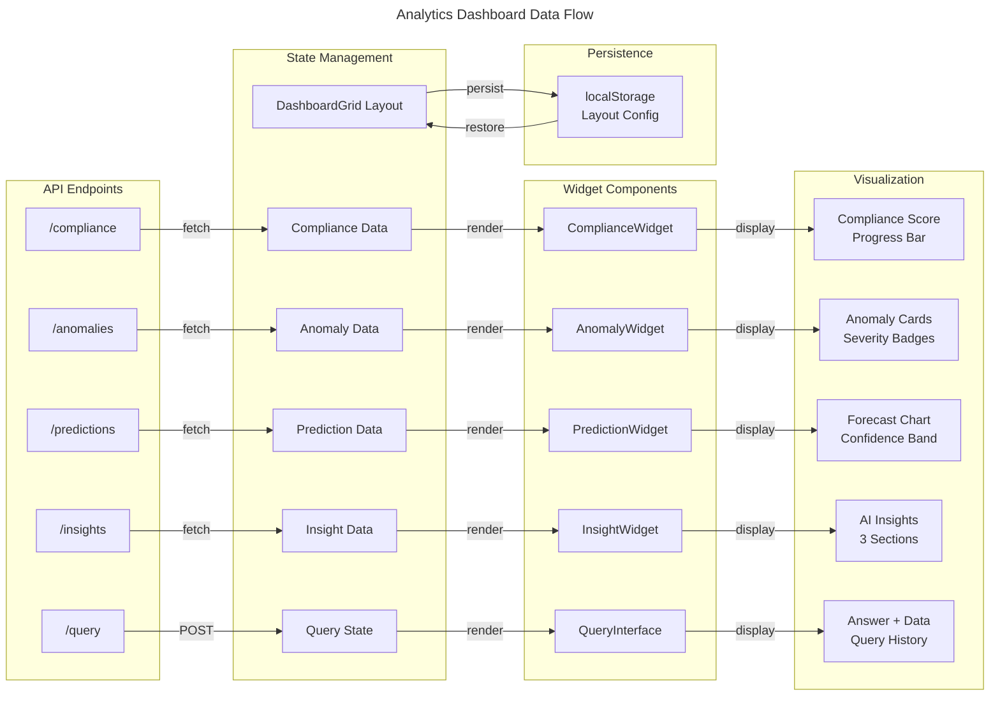
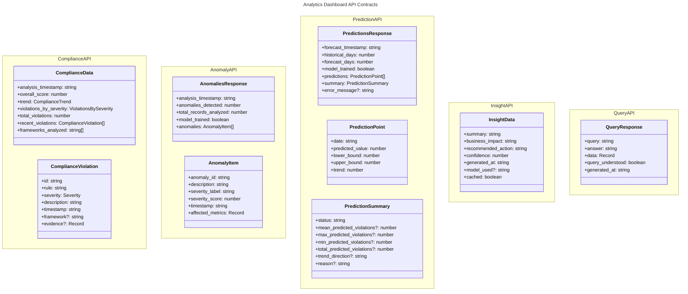
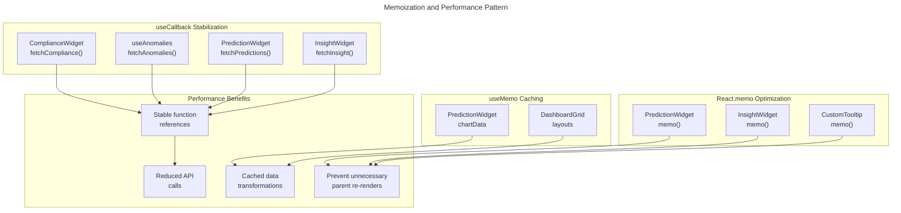

# C4 Code Level: Analytics Dashboard

## Overview

- **Name**: ACGS-2 Analytics Dashboard
- **Description**: TypeScript/React dashboard for real-time governance metrics and visualizations
- **Location**: `/home/dislove/document/acgs2/src/frontend/analytics-dashboard`
- **Language**: TypeScript with React 18+
- **Purpose**: Real-time governance monitoring, constitutional compliance visualization, predictive analytics, and multi-metric performance dashboards with drag-and-drop customizable layouts

## Code Elements

### Root Application Components

#### `App()`
- **File**: `src/App.tsx`
- **Type**: Root React functional component
- **Signature**: `function App(): JSX.Element`
- **Description**: Root application component providing routing with React Router. Renders the main dashboard page and import data page with browser-based routing.
- **Props**: None
- **Returns**: JSX element containing router and routes
- **Dependencies**: React Router, DashboardPage, ImportDataPage

#### `DashboardPage()`
- **File**: `src/App.tsx`
- **Type**: React functional component
- **Signature**: `function DashboardPage(): JSX.Element`
- **Description**: Main dashboard view displaying header, query interface, and draggable grid layout. Serves as the primary UI container for governance analytics.
- **Props**: None
- **Returns**: JSX element with dashboard layout
- **Dependencies**: DashboardGrid, QueryInterface

### Layout Components

#### `DashboardGrid()`
- **File**: `src/layouts/DashboardGrid.tsx`
- **Type**: React functional component with state management
- **Signature**: `export function DashboardGrid(): JSX.Element`
- **Description**: Customizable dashboard layout using react-grid-layout. Implements drag-and-drop widget repositioning, responsive layouts for multiple screen sizes, and localStorage persistence for user-defined layouts.
- **State**:
  - `mounted: boolean` - Hydration state for SSR safety
  - `layouts: Layouts` - Current widget positions and sizes for all breakpoints
  - `isLocked: boolean` - Layout editing mode (locked/unlocked)
- **Key Functions**:
  - `generateDefaultLayouts(): Layouts` - Creates responsive layout configurations for breakpoints (lg, md, sm, xs, xxs)
  - `loadLayoutsFromStorage(): Layouts | null` - Retrieves persisted layouts with validation
  - `saveLayoutsToStorage(layouts: Layouts): void` - Persists layouts to localStorage with error handling
  - `handleLayoutChange(currentLayout: Layout[], allLayouts: Layouts): void` - Updates layout on widget movement
  - `handleResetLayout(): void` - Resets to default layout configuration
  - `handleToggleLock(): void` - Toggles layout editing state
- **Props**: None
- **Returns**: JSX element with responsive grid layout and 4 widgets
- **Features**:
  - Responsive grid with 5 breakpoints (lg: 1200px, md: 996px, sm: 768px, xs: 480px, xxs: 0px)
  - 12-column grid for desktop, reduced columns for mobile
  - localStorage persistence with key: "acgs-analytics-dashboard-layout"
  - Layout lock/unlock toggle with visual indicators
  - Reset to default layout functionality
  - Drag handles visible only when unlocked
  - Custom CSS for grid animations and styling
- **Dependencies**: react-grid-layout, react-resizable, Lucide icons, widget components

### Widget Components

#### `ComplianceWidget()`
- **File**: `src/components/widgets/ComplianceWidget.tsx`
- **Type**: React functional component with async data fetching
- **Signature**: `export function ComplianceWidget(): JSX.Element`
- **Description**: Displays real-time constitutional compliance status with progress indicators, trend analysis, violations grouped by severity, and detailed violation list.
- **State**:
  - `data: ComplianceData | null` - Compliance metrics from API
  - `loadingState: LoadingState` - Data fetching state (idle, loading, success, error)
  - `error: string | null` - Error message if fetch fails
  - `severityFilter: Severity | null` - Filter for violation severity (critical, high, medium, low, null for all)
- **Key Functions**:
  - `fetchCompliance(): Promise<void>` - Fetches compliance data from `/compliance` endpoint
  - `handleRefresh(): void` - Manually triggers compliance data refresh
  - `handleFilterChange(severity: Severity | null): void` - Updates severity filter and refetches data
  - `getSeverityIcon(severity: Severity): JSX.Element` - Returns icon component for severity level
  - `getSeverityColors(severity: Severity): ColorSet` - Returns Tailwind color classes for severity
  - `getTrendIcon(trend: ComplianceTrend): JSX.Element` - Returns icon for trend direction (improving/stable/declining)
  - `getTrendColor(trend: ComplianceTrend): string` - Returns color class for trend
  - `formatTimestamp(timestamp: string): string` - Formats ISO timestamp to locale string
- **Props**: None
- **Returns**: JSX element with compliance status, violations list, and metadata
- **Data Interface**:
  ```typescript
  interface ComplianceData {
    analysis_timestamp: string;
    overall_score: number;
    trend: ComplianceTrend;
    violations_by_severity: ViolationsBySeverity;
    total_violations: number;
    recent_violations: ComplianceViolation[];
    frameworks_analyzed: string[];
  }
  ```
- **Features**:
  - Real-time compliance score with progress bar
  - Trend indicator (improving/stable/declining)
  - Violation counts by severity (critical, high, medium, low)
  - Severity-based filtering with dynamic refetch
  - Recent violations list with framework tags
  - 100% compliance state with success message
  - Error state with retry functionality
  - Loading skeleton with pulse animation
- **API Endpoints**: GET `/compliance?severity={optional}`
- **Dependencies**: React hooks, Lucide icons, API_BASE_URL

#### `AnomalyWidget()`
- **File**: `src/components/widgets/AnomalyWidget.tsx`
- **Type**: React functional component with custom hook integration
- **Signature**: `export function AnomalyWidget(): JSX.Element`
- **Description**: Detects and displays anomalies in governance metrics including unusual patterns in violations, user activity, and policy changes with severity scores.
- **State**:
  - `severityFilter: string | null` - Filter for anomaly severity (critical, high, medium, low, null for all)
- **Data** (from `useAnomalies` hook):
  - `data: AnomaliesResponse | null` - Anomaly detection results
  - `loading: boolean` - Data fetching state
  - `error: Error | null` - Error object if fetch fails
  - `refetch: () => Promise<void>` - Manual refresh function
- **Key Functions**:
  - `handleRefresh(): void` - Triggers anomaly data refresh
  - `handleFilterChange(severity: string | null): void` - Updates severity filter
  - `getSeverityIcon(severity: string): JSX.Element` - Returns icon for severity level
  - `getSeverityColors(severity: string): ColorSet` - Returns Tailwind color classes
  - `formatTimestamp(timestamp: string): string` - Formats ISO timestamp
  - `formatAffectedMetrics(metrics: Record<string, number | string>): string[]` - Formats metric display
- **Props**: None
- **Returns**: JSX element with anomaly list and metadata
- **Data Interface**:
  ```typescript
  interface AnomalyItem {
    anomaly_id: string;
    description: string;
    severity_label: "critical" | "high" | "medium" | "low";
    severity_score: number;
    timestamp: string;
    affected_metrics: Record<string, number | string>;
  }
  ```
- **Features**:
  - Real-time anomaly detection with severity levels
  - Affected metrics visualization for each anomaly
  - Severity-based filtering with dynamic refetch
  - Severity score progress bar (0-100%)
  - No anomalies success state with record count
  - Error state with retry functionality
  - Loading skeleton with pulse animation
  - Model training status indicator
- **Custom Hook**: `useAnomalies(severityFilter?: string | null)`
- **Dependencies**: React hooks, Lucide icons, useAnomalies hook

#### `PredictionWidget()`
- **File**: `src/components/widgets/PredictionWidget.tsx`
- **Type**: React functional component with memoization (wrapped with React.memo)
- **Signature**: `export const PredictionWidget = memo(function PredictionWidget(): JSX.Element)`
- **Description**: Displays 30-day violation forecast with confidence intervals, trend analysis, and summary statistics using Prophet-style time-series predictions.
- **State**:
  - `data: PredictionsResponse | null` - Prediction data from API
  - `loadingState: LoadingState` - Data fetching state
  - `error: string | null` - Error message if fetch fails
- **Key Functions**:
  - `fetchPredictions(): Promise<void>` - Fetches predictions from `/predictions` endpoint (wrapped with useCallback)
  - `handleRefresh(): void` - Manually triggers prediction refresh
  - `getTrendIcon(direction: string | null): JSX.Element` - Returns icon for trend direction
  - `getTrendColor(direction: string | null): string` - Returns color class for trend
  - `formatTimestamp(timestamp: string): string` - Formats ISO timestamp
  - `formatChartDate(dateString: string): string` - Formats date for chart display (MM/DD)
  - `CustomTooltip(props)` - Memoized tooltip component for chart hover interactions
- **Memoized Values**:
  - `chartData: ChartDataPoint[]` - Transformed prediction points for Recharts (useMemo)
- **Props**: None
- **Returns**: JSX element with line chart and summary statistics
- **Data Interface**:
  ```typescript
  interface PredictionsResponse {
    forecast_timestamp: string;
    historical_days: number;
    forecast_days: number;
    model_trained: boolean;
    predictions: PredictionPoint[];
    summary: PredictionSummary;
    error_message: string | null;
  }
  ```
- **Features**:
  - Interactive composed chart with confidence intervals
  - Area fill for confidence band (lower/upper bounds)
  - Dashed lines for confidence interval bounds
  - Solid line for predicted values
  - Custom tooltip on hover with formatted values
  - Trend direction badge (increasing/decreasing/stable)
  - Summary statistics grid (mean, max, min, total)
  - Insufficient data state with error message
  - Error state with retry functionality
  - Loading state with spinner animation
- **Chart Library**: Recharts (ComposedChart, Line, Area, XAxis, YAxis, Tooltip, ResponsiveContainer)
- **Performance Optimizations**:
  - React.memo prevents re-renders from parent dashboard
  - useCallback stabilizes fetchPredictions reference
  - useMemo caches chartData transformation (~30 points)
  - CustomTooltip memoized to prevent Recharts re-renders on mouse move
- **API Endpoints**: GET `/predictions`
- **Dependencies**: React hooks (memo, useCallback, useEffect, useMemo, useState), Recharts, Lucide icons

#### `InsightWidget()`
- **File**: `src/components/widgets/InsightWidget.tsx`
- **Type**: React functional component with memoization (wrapped with React.memo)
- **Signature**: `export const InsightWidget = memo(function InsightWidget(): JSX.Element)`
- **Description**: Displays AI-generated governance insights including executive summary, business impact analysis, and recommended actions for compliance improvement.
- **State**:
  - `insight: InsightData | null` - Insight data from API
  - `loadingState: LoadingState` - Data fetching state
  - `error: string | null` - Error message if fetch fails
- **Key Functions**:
  - `fetchInsight(forceRefresh?: boolean): Promise<void>` - Fetches insights from `/insights` endpoint (wrapped with useCallback, supports cache bypass)
  - `handleRefresh(): void` - Manually triggers insight refresh with cache bypass
  - `getConfidenceDisplay(confidence: number)` - Returns formatted confidence percentage with color coding
  - `formatTimestamp(timestamp: string): string` - Formats ISO timestamp
- **Props**: None
- **Returns**: JSX element with three insight sections and metadata
- **Data Interface**:
  ```typescript
  interface InsightData {
    summary: string;
    business_impact: string;
    recommended_action: string;
    confidence: number;
    generated_at: string;
    model_used: string | null;
    cached: boolean;
  }
  ```
- **Features**:
  - AI-generated summary with lightbulb icon
  - Business impact analysis with trending icon
  - Recommended action with checkmark icon
  - Confidence score with color coding (green ≥80%, yellow ≥60%, red <60%)
  - Model name and generation timestamp metadata
  - Cache indicator badge
  - Error state with retry functionality
  - Loading skeleton with pulse animation
  - Cache bypass on manual refresh
- **Performance Optimizations**:
  - React.memo prevents re-renders from parent dashboard
  - useCallback stabilizes fetchInsight reference
  - Cache support for expensive LLM processing
- **API Endpoints**: GET `/insights?refresh={optional}`
- **Dependencies**: React hooks (memo, useCallback, useEffect, useState), Lucide icons

### Common Components

#### `QueryInterface()`
- **File**: `src/components/QueryInterface.tsx`
- **Type**: React functional component with state management
- **Signature**: `export function QueryInterface(): JSX.Element`
- **Description**: Natural language query interface for governance analytics. Allows users to ask questions about governance data and displays answers with supporting data.
- **State**:
  - `query: string` - Current query text input
  - `loadingState: LoadingState` - API call state
  - `error: string | null` - Error message
  - `currentResponse: QueryResponse | null` - Last query response
  - `queryHistory: QueryHistoryItem[]` - Recent query history (max 5)
  - `showHistory: boolean` - Query history visibility
  - `showSamples: boolean` - Sample queries visibility
- **Key Functions**:
  - `submitQuery(queryText: string): Promise<void>` - Submits query to `/query` endpoint (POST)
  - `handleSubmit(e: React.FormEvent): void` - Form submission handler
  - `handleSampleClick(sampleQuery: string): void` - Executes sample query
  - `handleHistoryClick(item: QueryHistoryItem): void` - Restores history query
  - `handleClear(): void` - Clears query and resets UI
  - `formatTimestamp(date: Date): string` - Formats date for display
  - `formatDataValue(value: unknown): string` - Formats data values for display
- **Props**: None
- **Returns**: JSX element with query input, history, samples, and results
- **Constants**:
  - `MAX_HISTORY_ITEMS`: 5 - Maximum queries kept in history
  - `SAMPLE_QUERIES`: Array of 5 predefined sample questions
- **Data Interface**:
  ```typescript
  interface QueryResponse {
    query: string;
    answer: string;
    data: Record<string, unknown>;
    query_understood: boolean;
    generated_at: string;
  }
  ```
- **Features**:
  - Natural language query input with 500 character limit
  - Sample queries for user guidance
  - Recent query history with timestamps (max 5)
  - Query result display with answer and related data
  - Query understanding indicator (yellow warning if not fully understood)
  - Array value display as badge chips
  - Object/JSON value display with formatting
  - Error state with retry button
  - Loading state with spinner
  - Clear/reset functionality
  - Query timestamp tracking
- **API Endpoints**: POST `/query` with body `{ question: string }`
- **Dependencies**: React hooks, Lucide icons, API_BASE_URL

#### `Tooltip()`
- **File**: `src/components/common/Tooltip.tsx`
- **Type**: React functional component wrapper
- **Signature**: `export function Tooltip(props: TooltipProps): JSX.Element`
- **Description**: Reusable tooltip component that displays helper text on hover or focus. Used in dashboard control buttons.
- **Props**:
  - `content: React.ReactNode` - Tooltip content (HTML or text)
  - `position: "top" | "bottom"` - Tooltip position relative to trigger element
  - `children: React.ReactNode` - Element that triggers tooltip
- **Returns**: JSX element with tooltip on hover
- **Features**:
  - Position-aware tooltip (top/bottom)
  - Hover and focus trigger support
  - Smooth fade animation
  - Responsive positioning
- **Dependencies**: React, Tailwind CSS

#### `LoadingOverlay()`
- **File**: `src/components/LoadingOverlay.tsx`
- **Type**: React functional component
- **Signature**: `export function LoadingOverlay(): JSX.Element`
- **Description**: Full-screen loading overlay with spinner animation used during data initialization.
- **Props**: None
- **Returns**: JSX element with centered spinner and message
- **Features**:
  - Centered spinner animation
  - Overlay background with transparency
  - Optional loading message

#### `SkipLink()`
- **File**: `src/components/SkipLink.tsx`
- **Type**: React functional component
- **Signature**: `export function SkipLink(): JSX.Element`
- **Description**: Accessibility component for keyboard navigation skip links. Allows screen reader users and keyboard navigators to jump to main content.
- **Props**: None
- **Returns**: JSX element with skip links
- **Features**:
  - Skip to main content link
  - Skip to navigation link
  - Hidden until focused
  - Keyboard accessible

### Custom Hooks

#### `useAnomalies(severityFilter?)`
- **File**: `src/hooks/useAnomalies.ts`
- **Type**: Custom React hook
- **Signature**: `export function useAnomalies(severityFilter?: string | null): UseDataResult<AnomaliesResponse>`
- **Description**: Custom hook for fetching and managing anomaly detection data from the analytics API. Implements standard data-fetching pattern with refetch capability.
- **Parameters**:
  - `severityFilter?: string | null` - Optional severity filter (critical, high, medium, low)
- **Returns**:
  ```typescript
  interface UseDataResult<T> {
    data: T | null;
    loading: boolean;
    error: Error | null;
    refetch: () => Promise<void>;
  }
  ```
- **State**:
  - `data: AnomaliesResponse | null` - Fetched anomaly data
  - `loading: boolean` - Loading state (true initially)
  - `error: Error | null` - Error object or null
- **Key Functions**:
  - `fetchAnomalies(): Promise<void>` - Fetches from `/anomalies` endpoint (wrapped with useCallback)
- **Features**:
  - Automatic fetch on mount
  - Automatic refetch when severityFilter changes
  - Error handling with Error objects
  - Manual refetch capability
  - URL query parameter support for filtering
- **API Endpoints**: GET `/anomalies?severity={optional}`
- **Dependencies**: React hooks (useState, useEffect, useCallback), ANALYTICS_API_URL

### Chart Components

#### `ResponsiveChart()`
- **File**: `src/components/charts/ResponsiveChart.tsx`
- **Type**: React functional component wrapper
- **Signature**: `export function ResponsiveChart(props: ResponsiveChartProps): JSX.Element`
- **Description**: Responsive wrapper component for Recharts charts. Ensures charts scale appropriately across different screen sizes.
- **Props**:
  - `data: DataPoint[]` - Chart data points
  - `children: React.ReactNode` - Recharts chart components
- **Returns**: JSX element with ResponsiveContainer

#### `LineChart()`
- **File**: `src/components/charts/LineChart.tsx`
- **Type**: React functional component
- **Signature**: `export function LineChart(props: LineChartProps): JSX.Element`
- **Description**: Configurable line chart component for time-series data visualization.
- **Props**:
  - `data: DataPoint[]` - Chart data points
  - `series: LineSeries[]` - Series configurations
  - `xAxis?: AxisConfig` - X-axis configuration
  - `yAxis?: AxisConfig` - Y-axis configuration
  - `margin?: ChartMargin` - Chart margins
- **Returns**: JSX element with line chart

#### `AreaChart()`
- **File**: `src/components/charts/AreaChart.tsx`
- **Type**: React functional component
- **Signature**: `export function AreaChart(props: AreaChartProps): JSX.Element`
- **Description**: Configurable area chart component for stacked area visualizations.
- **Props**:
  - `data: DataPoint[]` - Chart data points
  - `series: AreaSeries[]` - Series configurations
  - `xAxis?: AxisConfig` - X-axis configuration
  - `yAxis?: AxisConfig` - Y-axis configuration
  - `margin?: ChartMargin` - Chart margins
- **Returns**: JSX element with area chart

#### `ComposedChart()`
- **File**: `src/components/charts/ComposedChart.tsx`
- **Type**: React functional component
- **Signature**: `export function ComposedChart(props: ComposedChartProps): JSX.Element`
- **Description**: Composed chart component combining multiple chart types (lines, areas, bars) in single visualization.
- **Props**: Combined chart configuration
- **Returns**: JSX element with composed chart

### Type Definitions

#### Core Types
- **File**: `src/lib/types.ts`

```typescript
export type LoadingState = "idle" | "loading" | "success" | "error";
```

#### Chart Types
- **File**: `src/components/charts/types.ts`

```typescript
export type DataPoint = Record<string, unknown>;

export interface ChartMargin {
  top: number;
  right: number;
  bottom: number;
  left: number;
}

export interface AxisConfig {
  show?: boolean;
  stroke?: string;
  tickStroke?: string;
  tickFontSize?: number;
  tickColor?: string;
  tickFormatter?: (value: number | Date | string) => string;
  interval?: number | 'preserveStartEnd';
  domain?: [number | 'auto' | 'dataMin' | 'dataMax', number | 'auto' | 'dataMin' | 'dataMax'];
}

export interface LineSeries<T = DataPoint> {
  dataKey: keyof T | string;
  stroke: string;
  strokeWidth?: number;
  strokeDasharray?: string;
  dot?: boolean;
  activeDot?: { r: number; fill?: string; stroke?: string; strokeWidth?: number };
  type?: 'monotone' | 'linear' | 'step';
  label?: string;
}

export interface AreaSeries<T = DataPoint> {
  dataKeyY0: keyof T | string;
  dataKeyY1: keyof T | string;
  fill: string;
  stroke?: string;
  strokeWidth?: number;
  type?: 'monotone' | 'linear' | 'step';
  label?: string;
}

export interface TooltipData<T = DataPoint> {
  data: T;
  x: number;
  y: number;
}

export type TimeScale = ScaleTime<number, number>;
export type LinearScale = ScaleLinear<number, number>;
export type Scale = TimeScale | LinearScale;
```

#### Anomaly Types
- **File**: `src/types/anomalies.ts`

```typescript
export interface AnomalyItem {
  anomaly_id: string;
  description: string;
  severity_label: "critical" | "high" | "medium" | "low";
  severity_score: number;
  timestamp: string;
  affected_metrics: Record<string, number | string>;
}

export interface AnomaliesResponse {
  analysis_timestamp: string;
  anomalies_detected: number;
  total_records_analyzed: number;
  model_trained: boolean;
  anomalies: AnomalyItem[];
}
```

#### Hook Types
- **File**: `src/hooks/types.ts`

```typescript
export interface UseDataResult<T> {
  data: T | null;
  loading: boolean;
  error: Error | null;
  refetch: () => Promise<void>;
}
```

### Pages

#### `ImportDataPage()`
- **File**: `src/pages/ImportDataPage.tsx`
- **Type**: React functional component page
- **Signature**: `export function ImportDataPage(): JSX.Element`
- **Description**: Multi-step data import wizard for importing governance data from external sources.
- **Props**: None
- **Returns**: JSX element with import wizard UI
- **Features**:
  - Multi-step wizard interface
  - Source selection
  - Configuration
  - Preview
  - Progress tracking
  - Help panel

### Services

#### Import API Service
- **File**: `src/services/importApi.ts`
- **Type**: API utility functions
- **Description**: Functions for communicating with the import/integration API.
- **Key Functions**:
  - `uploadFile(file: File): Promise<UploadResponse>`
  - `validateData(data: unknown): Promise<ValidationResult>`
  - `importData(config: ImportConfig): Promise<ImportResult>`

## Dependencies

### Internal Dependencies

#### Component Dependencies
- **DashboardGrid** → InsightWidget, AnomalyWidget, PredictionWidget, ComplianceWidget, Tooltip
- **ComplianceWidget** → None (direct API calls)
- **AnomalyWidget** → useAnomalies hook
- **PredictionWidget** → None (direct API calls)
- **InsightWidget** → None (direct API calls)
- **QueryInterface** → None (direct API calls)
- **ImportDataPage** → ImportWizard components, importApi service

#### Hook Dependencies
- **useAnomalies** → ANALYTICS_API_URL

#### Shared Constants
- **lib/config.ts** → ANALYTICS_API_URL, INTEGRATION_API_URL

### External Dependencies

#### Core React Ecosystem
- **react** (18.x) - React library
- **react-dom** (18.x) - React DOM rendering
- **react-router-dom** (6.x) - Routing and navigation

#### Layout and Grid
- **react-grid-layout** (1.x) - Draggable/resizable grid layouts
- **react-resizable** (3.x) - Resizable component wrapper

#### Data Visualization
- **recharts** (2.x) - Composable charting library
- **@visx/scale** - D3 scale utilities (type imports)
- **@visx/coordinates** - Coordinate utilities (type imports)

#### UI Icons and Styling
- **lucide-react** (0.x) - SVG icon library
- **tailwindcss** (3.x+) - Utility-first CSS framework

#### Build and Development
- **typescript** (5.x) - TypeScript compiler
- **vite** (5.x+) - Frontend build tool and dev server
- **vitest** - Unit testing framework
- **react-dom/test-utils** - React testing utilities
- **msw** (2.x) - Mock Service Worker for API mocking in tests

#### Testing
- **@testing-library/react** - React component testing utilities
- **@testing-library/jest-dom** - DOM matchers for tests
- **@testing-library/user-event** - User interaction simulation

#### Development Tools
- **@vitejs/plugin-react** - Vite React plugin
- **@typescript-eslint/eslint-plugin** - TypeScript linting
- **eslint** - Code linting
- **prettier** - Code formatting

## Relationships

### Component Hierarchy Diagram



### Data Flow Diagram



### API Integration Map



### Performance Optimization Strategy



## Notes

### Architecture Patterns

1. **Container/Presenter Pattern**: Dashboard Grid acts as container orchestrating widget renders
2. **Custom Hook Pattern**: useAnomalies follows standard React data-fetching hook pattern
3. **Memoization Strategy**: Strategic use of React.memo, useCallback, and useMemo for performance
4. **Responsive Grid Layout**: react-grid-layout provides drag-and-drop with persistence
5. **State Management**: Local component state with localStorage persistence for layout
6. **Error Handling**: Consistent error states across all API-dependent widgets
7. **Loading States**: Four-state pattern (idle, loading, success, error) throughout

### Key Technologies

- **React 18+**: Modern React with hooks and concurrent features
- **TypeScript**: Full type safety with comprehensive interface definitions
- **Tailwind CSS**: Utility-first styling with responsive breakpoints
- **Recharts**: Simple, composable charting for time-series visualization
- **react-grid-layout**: Professional draggable/resizable grid system
- **Lucide Icons**: Clean, consistent icon set via React components

### API Integration Points

All API calls use environment variables for base URLs:
- `VITE_ANALYTICS_API_URL` (default: `http://localhost:8080`)
- `VITE_INTEGRATION_API_URL` (default: `http://localhost:8100`)

### Responsive Design

5 breakpoints with adaptive layouts:
- `lg`: 1200px+ (12 columns) - 2-column widget layout
- `md`: 996px+ (10 columns) - Condensed layout
- `sm`: 768px+ (6 columns) - Stacked single column
- `xs`: 480px+ (4 columns) - Compact mobile
- `xxs`: <480px (2 columns) - Minimal mobile

### State Persistence

Dashboard layout saved to localStorage with key `acgs-analytics-dashboard-layout`. Layout includes all widget positions and sizes for each breakpoint.

### Testing Coverage

Includes test files for:
- Components: DashboardGrid, QueryInterface, Tooltip, widgets
- Hooks: useAnomalies
- Integration: Dashboard API integration tests
- E2E: Dashboard integration verification
- Mocks: MSW server and handlers for API simulation

### Accessibility Features

- Skip links for keyboard navigation
- ARIA labels on interactive elements
- Semantic HTML structure
- Keyboard-accessible forms and buttons
- Focus states and visual indicators
- Screen reader friendly tooltips
