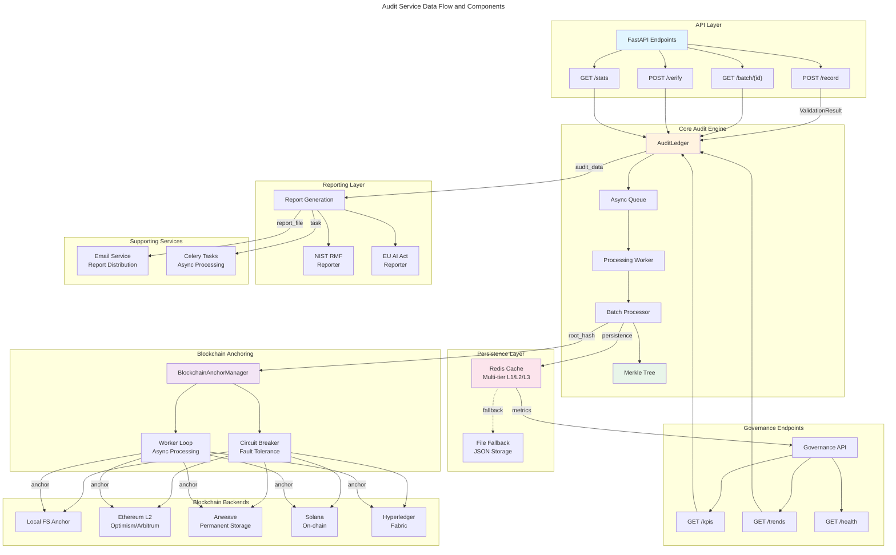
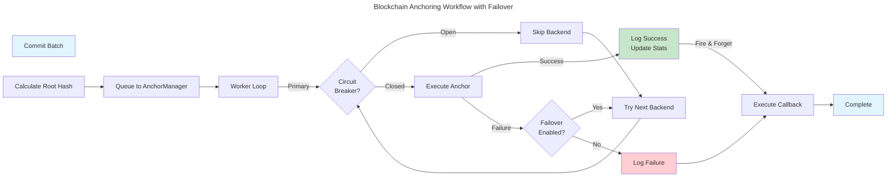
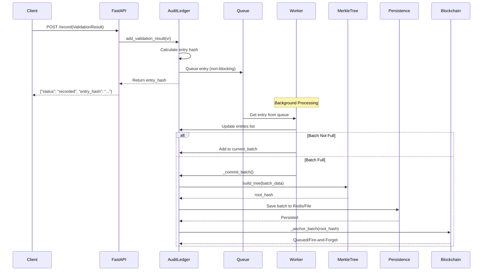
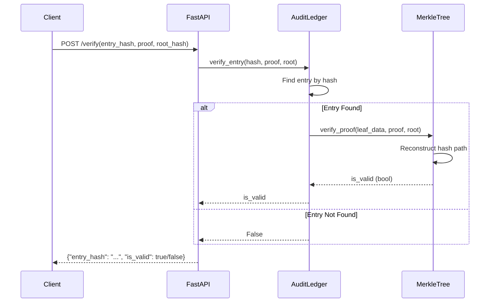

# C4 Code Level: Audit Service

## Overview

- **Name**: Audit Service - Immutable Governance Audit Logging with Blockchain Anchoring
- **Description**: Comprehensive audit logging and integrity verification system for constitutional AI governance decisions with multi-backend blockchain anchoring, Merkle tree verification, and compliance reporting
- **Location**: `/home/dislove/document/acgs2/src/core/services/audit_service`
- **Language**: Python 3.11-3.13 with FastAPI 0.115.6+
- **Purpose**: Provides immutable audit trails for all governance decisions with cryptographic verification, multi-backend blockchain anchoring (Local, Ethereum L2, Arweave, Hyperledger, Solana), Merkle tree batch verification, and regulatory compliance reporting (NIST RMF, EU AI Act, SOC2, ISO27001, GDPR)
- **Constitutional Hash**: `cdd01ef066bc6cf2`

## Architecture Overview

The Audit Service implements a consolidated architecture focused on three core responsibilities:

1. **Immutable Audit Recording** - Batch-based entry collection with Merkle tree construction
2. **Blockchain Anchoring** - Multi-backend support with automatic failover and circuit breaker patterns
3. **Compliance Reporting** - Framework-specific reporting (NIST RMF, EU AI Act) and metrics calculation

## Code Elements

### Core Components

#### 1. AuditLedger (audit_ledger.py)

**Class**: `AuditLedger`
- **Location**: `/home/dislove/document/acgs2/src/core/services/audit_service/core/audit_ledger.py`
- **Lines**: 127-839
- **Purpose**: Asynchronous immutable audit ledger for recording validation results with batch processing, Merkle tree construction, Redis persistence, and blockchain anchoring

**Key Methods**:

- `__init__(batch_size: int = 100, redis_url: Optional[str] = None, config: Optional[AuditLedgerConfig] = None) -> None`
  - **Location**: Lines 140-199
  - **Purpose**: Initialize the audit ledger with configuration, blockchain anchoring, and persistence
  - **Parameters**:
    - `batch_size`: Size of entries before committing batch (default 100)
    - `redis_url`: Redis connection URL for persistent storage
    - `config`: AuditLedgerConfig dataclass with advanced configuration options
  - **Behavior**: Initializes async queue, Merkle tree, batch tracking, blockchain anchor manager, and Redis/file persistence

- `async def start() -> None`
  - **Location**: Lines 249-267
  - **Purpose**: Start background worker and blockchain anchor manager
  - **Behavior**: Loads state from Redis/file, starts anchor manager, creates async worker task for batch processing

- `async def stop() -> None`
  - **Location**: Lines 269-300
  - **Purpose**: Gracefully shutdown ledger, flush queue, and stop blockchain anchoring
  - **Behavior**: Signals worker to stop, waits for queue drain, cancels workers, disconnects from anchor manager

- `async def add_validation_result(validation_result: ValidationResult) -> str`
  - **Location**: Lines 302-309
  - **Purpose**: Add a validation result to the ledger (non-blocking, fire-and-forget pattern)
  - **Parameters**: `validation_result`: ValidationResult object to record
  - **Returns**: Entry hash for reference
  - **Behavior**: Computes entry hash, queues for background processing

- `async def _processing_worker() -> None`
  - **Location**: Lines 311-347
  - **Purpose**: Background worker that builds batches and commits them to storage/blockchain
  - **Behavior**: Continuously polls queue, accumulates entries into batches, triggers commit when batch_size reached, flushes partial batches on idle timeout

- `async def _commit_batch() -> str`
  - **Location**: Lines 360-413
  - **Purpose**: Commit current batch to persistent storage and blockchain anchoring
  - **Parameters**: None (uses self.current_batch)
  - **Returns**: Batch ID
  - **Behavior**:
    1. Creates Merkle tree from batch entries
    2. Calculates root hash
    3. Stores batch metadata
    4. Updates entries with Merkle proofs
    5. Persists to Redis/file
    6. Triggers blockchain anchoring

- `async def _anchor_batch(root_hash: str, batch_id: str, entry_count: int, entries_hashes: List[str]) -> None`
  - **Location**: Lines 415-482
  - **Purpose**: Anchor batch root hash to configured blockchain backends
  - **Parameters**:
    - `root_hash`: Merkle root hash to anchor
    - `batch_id`: Batch identifier
    - `entry_count`: Number of entries in batch
    - `entries_hashes`: List of individual entry hashes
  - **Behavior**: Uses fire-and-forget pattern or synchronous mode, tracks anchoring statistics, executes completion callbacks

- `def _on_anchor_complete(result: AnchorResult) -> None`
  - **Location**: Lines 484-528
  - **Purpose**: Callback for async anchor completion, updates statistics
  - **Parameters**: `result`: AnchorResult from blockchain anchoring
  - **Behavior**: Updates batch anchor information, tracks latency, logs completion/failures

- `async def _save_to_storage(batch_id: str, root_hash: str, batch_data: List[bytes]) -> None`
  - **Location**: Lines 530-564
  - **Purpose**: Persist batch information to Redis or local file
  - **Parameters**: Batch metadata and data
  - **Behavior**: Tries Redis first, falls back to local JSON file for disaster recovery

- `async def _load_from_storage() -> None`
  - **Location**: Lines 566-603
  - **Purpose**: Restore ledger state from Redis or local file on startup
  - **Behavior**: Loads batch counter and entries, reconstructs Merkle tree if entries exist

- `async def verify_entry(entry_hash: str, merkle_proof: List[Tuple[str, bool]], root_hash: str) -> bool`
  - **Location**: Lines 636-663
  - **Purpose**: Verify inclusion proof for an entry using Merkle tree verification
  - **Parameters**: Entry hash, Merkle proof path, root hash to verify against
  - **Returns**: Boolean indicating if proof is valid
  - **Behavior**: Reconstructs hash path through Merkle tree, compares with root hash

- `async def get_entries_by_batch(batch_id: str) -> List[AuditEntry]`
  - **Location**: Lines 665-667
  - **Purpose**: Retrieve all entries for a specific batch
  - **Returns**: List of AuditEntry objects
  - **Behavior**: Thread-safe filtering of entries by batch_id

- `async def get_metrics_for_date(tenant_id: str, date: datetime.date) -> Dict[str, Any]`
  - **Location**: Lines 669-713
  - **Purpose**: Calculate compliance metrics for a specific date and tenant
  - **Parameters**: Tenant ID, target date
  - **Returns**: Dictionary with compliance_score, controls_passing/failing, audit_count
  - **Behavior**: Filters entries by date range and tenant, calculates success rate

- `async def get_ledger_stats() -> Dict[str, Any]`
  - **Location**: Lines 715-741
  - **Purpose**: Get comprehensive ledger statistics for monitoring
  - **Returns**: Dictionary with entry counts, batch info, root hash, anchoring stats
  - **Behavior**: Thread-safe aggregation of ledger state and blockchain anchoring statistics

- `async def get_anchor_health() -> Dict[str, Any]`
  - **Location**: Lines 743-752
  - **Purpose**: Get health status of blockchain anchoring backends
  - **Returns**: Dictionary with backend health information
  - **Behavior**: Queries anchor manager for backend health or returns legacy anchor status

- `def get_recent_anchor_results(n: int = 10) -> List[Dict[str, Any]]`
  - **Location**: Lines 754-758
  - **Purpose**: Get recent blockchain anchor transaction results for monitoring
  - **Parameters**: Number of results to return (default 10)
  - **Returns**: List of recent anchor results
  - **Behavior**: Delegates to anchor manager

- `async def force_commit_batch() -> str`
  - **Location**: Lines 760-762
  - **Purpose**: Manually force commit of current partial batch
  - **Returns**: Batch ID of committed batch
  - **Behavior**: Thread-safe forced batch commitment

- `async def prepare_blockchain_transaction(batch_id: str) -> Dict[str, Any]`
  - **Location**: Lines 764-778
  - **Purpose**: Prepare blockchain transaction data for batch
  - **Parameters**: Batch ID
  - **Returns**: Dictionary with root_hash, entry_count, entries_hashes, timestamp
  - **Behavior**: Gathers batch data for blockchain submission

- `def get_anchor_stats() -> Dict[str, Any]`
  - **Location**: Lines 780-801
  - **Purpose**: Get detailed anchoring statistics for analytics
  - **Returns**: Statistics including success rates, latency, backend breakdown
  - **Behavior**: Aggregates anchor statistics with manager stats

- `def reset_for_testing() -> None`
  - **Location**: Lines 803-838
  - **Purpose**: Reset ledger state for test isolation
  - **Behavior**: Cancels worker, clears queue, resets all internal state
  - **Note**: For graceful shutdown, use stop() instead

**Dataclasses**:

- `AuditEntry` (Lines 81-98)
  - **Fields**:
    - `validation_result: ValidationResult` - The validation result
    - `hash: str` - SHA-256 hash of entry
    - `timestamp: float` - Unix timestamp
    - `batch_id: Optional[str]` - Batch ID after commit
    - `merkle_proof: Optional[List[Tuple[str, bool]]]` - Merkle inclusion proof
  - **Methods**:
    - `to_dict() -> Dict[str, Any]` - Convert to dictionary for serialization

- `AuditLedgerConfig` (Lines 101-125)
  - **Configuration Fields**:
    - `batch_size: int = 100`
    - `redis_url: Optional[str] = None`
    - `persistence_file: str = "audit_ledger_storage.json"`
    - `enable_blockchain_anchoring: bool = True`
    - `blockchain_backends: List[str] = ["local"]`
    - `enable_failover: bool = True`
    - `anchor_fire_and_forget: bool = True`
    - `ethereum_network: str = "optimism"`
    - `circuit_breaker_fail_max: int = 3`
    - `circuit_breaker_reset_timeout: int = 30`
    - `constitutional_hash: str = CONSTITUTIONAL_HASH`

- `ValidationResult` (Lines 60-78)
  - **Fields**: is_valid, errors, warnings, metadata, constitutional_hash
  - **Methods**: to_dict()

#### 2. BlockchainAnchorManager (blockchain_anchor_manager.py)

**Class**: `BlockchainAnchorManager`
- **Location**: `/home/dislove/document/acgs2/src/core/services/audit_service/core/blockchain_anchor_manager.py`
- **Lines**: 130-611
- **Purpose**: Unified manager for multi-backend blockchain anchoring with circuit breaker integration, failover support, and async batching

**Key Methods**:

- `__init__(config: Optional[AnchorManagerConfig] = None) -> None`
  - **Location**: Lines 144-161
  - **Purpose**: Initialize anchor manager with configuration and backends
  - **Behavior**: Initializes backends, circuit breakers, async queue, and worker tasks

- `def _initialize_backends(self) -> None`
  - **Location**: Lines 163-228
  - **Purpose**: Initialize enabled blockchain backends (Local, Ethereum L2, Arweave, Hyperledger, Solana)
  - **Behavior**: Dynamically imports and initializes backend clients, sets up circuit breakers

- `def get_backend(backend: AnchorBackend) -> Optional[Any]`
  - **Location**: Lines 230-240
  - **Purpose**: Get a specific blockchain backend client
  - **Returns**: Backend client or None if not found
  - **Behavior**: Simple dictionary lookup with safety checks

- `async def start(self) -> None`
  - **Location**: Lines 242-267
  - **Purpose**: Start the anchor manager and background workers
  - **Behavior**: Connects async backends, creates worker tasks

- `async def stop(self) -> None`
  - **Location**: Lines 269-303
  - **Purpose**: Stop the anchor manager and cleanup resources
  - **Behavior**: Drains queue, cancels workers, disconnects backends

- `async def anchor_root(root_hash: str, batch_id: str, metadata: Optional[Dict[str, Any]] = None, callback: Optional[Callable[[AnchorResult], None]] = None) -> bool`
  - **Location**: Lines 305-343
  - **Purpose**: Submit Merkle root for blockchain anchoring (fire-and-forget pattern)
  - **Parameters**:
    - `root_hash`: Merkle root to anchor
    - `batch_id`: Batch identifier
    - `metadata`: Optional metadata
    - `callback`: Optional completion callback
  - **Returns**: True if queued successfully, False if queue full
  - **Behavior**: Queues anchor request for async processing, returns immediately

- `async def anchor_root_sync(root_hash: str, batch_id: str, metadata: Optional[Dict[str, Any]] = None) -> AnchorResult`
  - **Location**: Lines 345-366
  - **Purpose**: Submit Merkle root and wait for result (synchronous)
  - **Returns**: AnchorResult with final status
  - **Behavior**: Waits for anchoring to complete before returning

- `async def _worker_loop(worker_id: int) -> None`
  - **Location**: Lines 368-398
  - **Purpose**: Background worker for processing anchor requests from queue
  - **Parameters**: Worker ID for logging
  - **Behavior**: Continuously processes queued anchors, executes callbacks, handles errors

- `async def _execute_anchor(root_hash: str, batch_id: str, metadata: Dict[str, Any]) -> AnchorResult`
  - **Location**: Lines 400-466
  - **Purpose**: Execute anchoring with multi-backend failover support
  - **Returns**: AnchorResult with final status
  - **Behavior**: Attempts each backend in order, checks circuit breaker, tries failover on failure

- `async def _anchor_to_backend(backend: AnchorBackend, root_hash: str, batch_id: str, metadata: Dict[str, Any]) -> AnchorResult`
  - **Location**: Lines 468-542
  - **Purpose**: Anchor to specific backend (Local, Ethereum L2, Arweave, Solana)
  - **Parameters**: Backend type and data
  - **Returns**: AnchorResult with backend-specific details
  - **Behavior**: Calls backend-specific submission methods

- `def _store_result(result: AnchorResult) -> None`
  - **Location**: Lines 544-548
  - **Purpose**: Store recent anchor result for status reporting
  - **Behavior**: Maintains rolling buffer of recent results

- `def get_stats() -> Dict[str, Any]`
  - **Location**: Lines 550-559
  - **Purpose**: Get anchor manager statistics
  - **Returns**: Dictionary with success/failure counts, backend stats, queue size
  - **Behavior**: Aggregates all manager statistics

- `def get_recent_results(n: int = 10) -> List[Dict[str, Any]]`
  - **Location**: Lines 561-563
  - **Purpose**: Get recent anchor results as dictionaries
  - **Returns**: List of result dictionaries

- `async def health_check() -> Dict[str, Any]`
  - **Location**: Lines 565-610
  - **Purpose**: Check health of all backends
  - **Returns**: Health status dictionary with per-backend details
  - **Behavior**: Queries each backend for connectivity and stats, checks circuit breaker status

**Enums**:

- `AnchorBackend` (Lines 37-44)
  - Values: LOCAL, ETHEREUM_L2, ARWEAVE, HYPERLEDGER, SOLANA

- `AnchorStatus` (Lines 47-53)
  - Values: PENDING, SUBMITTED, CONFIRMED, FAILED

**Dataclasses**:

- `AnchorResult` (Lines 56-81)
  - **Fields**: backend, status, batch_id, transaction_id, block_info, timestamp, start_time, error, constitutional_hash
  - **Methods**: to_dict()

- `AnchorManagerConfig` (Lines 84-117)
  - **Configuration Fields**: enabled_backends, failover settings, batching, circuit breaker, retry, queue, mode, network

- `PendingAnchor` (Lines 119-127)
  - **Fields**: root_hash, batch_id, metadata, timestamp, callbacks

#### 3. LocalFileSystemAnchor (anchor.py)

**Class**: `LocalFileSystemAnchor`
- **Location**: `/home/dislove/document/acgs2/src/core/services/audit_service/core/anchor.py`
- **Lines**: 19-128
- **Purpose**: Persistent, append-only ledger for storing Merkle roots with cryptographic chaining

**Key Methods**:

- `__init__(storage_path: str = "audit_anchor_production.json") -> None`
  - **Location**: Lines 25-29
  - **Purpose**: Initialize local file system anchor with storage path
  - **Behavior**: Loads existing chain or creates genesis block

- `def _initialize_storage(self) -> None`
  - **Location**: Lines 31-52
  - **Purpose**: Load existing anchor ledger or initialize new genesis block
  - **Behavior**: Creates parent directory, loads JSON, verifies chain integrity

- `def _create_genesis_block(self) -> None`
  - **Location**: Lines 54-66
  - **Purpose**: Initialize chain with genesis block
  - **Behavior**: Creates first block with special values, persists to disk

- `def _calculate_hash(block: Dict[str, Any]) -> str`
  - **Location**: Lines 68-81
  - **Purpose**: Calculate SHA-256 hash of block contents
  - **Parameters**: Block dictionary
  - **Returns**: Hex-encoded hash
  - **Behavior**: Sorts JSON keys for deterministic hashing

- `def anchor_root(root_hash: str) -> Dict[str, Any]`
  - **Location**: Lines 83-100
  - **Purpose**: Atomically append new Merkle root to ledger
  - **Parameters**: Root hash to anchor
  - **Returns**: New block information
  - **Behavior**: Creates new block, links to previous, persists to disk

- `def verify_root(root_hash: str) -> bool`
  - **Location**: Lines 102-104
  - **Purpose**: Verify if root hash exists in local ledger
  - **Parameters**: Root hash to check
  - **Returns**: Boolean indicating existence
  - **Behavior**: Linear search through blocks

- `def _verify_chain(self) -> bool`
  - **Location**: Lines 106-116
  - **Purpose**: Verify cryptographic integrity of entire chain
  - **Returns**: Boolean indicating chain is valid
  - **Behavior**: Checks previous_hash links and recalculates hashes

- `def _save_to_disk(self) -> None`
  - **Location**: Lines 118-124
  - **Purpose**: Flush chain to disk as JSON
  - **Behavior**: Atomic write of entire chain

- `def get_latest_block(self) -> Dict[str, Any]`
  - **Location**: Lines 126-127
  - **Purpose**: Get most recent block in chain
  - **Returns**: Latest block dictionary

#### 4. MerkleTree (merkle_tree.py)

**Class**: `MerkleTree`
- **Location**: `/home/dislove/document/acgs2/src/core/services/audit_service/core/merkle_tree/merkle_tree.py`
- **Lines**: 9-165
- **Purpose**: Merkle tree implementation for batch verification with incremental updates

**Key Methods**:

- `__init__(data_list: Optional[List[bytes]] = None) -> None`
  - **Location**: Lines 12-19
  - **Purpose**: Initialize Merkle tree with optional data
  - **Parameters**: Optional list of byte data for immediate building

- `def build_tree(data_list: List[bytes]) -> None`
  - **Location**: Lines 21-53
  - **Purpose**: Build complete Merkle tree from data list
  - **Parameters**: List of byte data to hash
  - **Behavior**: Creates leaf hashes, builds tree layers, handles odd-count duplicates

- `def get_root_hash() -> Optional[str]`
  - **Location**: Lines 55-57
  - **Purpose**: Get root hash of tree
  - **Returns**: Hex-encoded root hash or None
  - **Behavior**: Simple accessor

- `def get_proof(index: int) -> List[Tuple[str, bool]]`
  - **Location**: Lines 59-82
  - **Purpose**: Generate inclusion proof path for leaf at index
  - **Parameters**: Leaf index
  - **Returns**: List of (sibling_hash, is_left) tuples
  - **Behavior**: Walks from leaf to root, collecting siblings

- `def verify_proof(leaf_data: bytes, proof: List[Tuple[str, bool]], root_hash: str) -> bool`
  - **Location**: Lines 84-99
  - **Purpose**: Verify inclusion proof for leaf data
  - **Parameters**: Leaf data, proof path, expected root hash
  - **Returns**: Boolean indicating if proof is valid
  - **Behavior**: Reconstructs hash path, compares with root

- `def add_leaf(data: bytes) -> None`
  - **Location**: Lines 101-152
  - **Purpose**: Incrementally add new leaf without rebuilding tree
  - **Parameters**: Byte data for new leaf
  - **Behavior**: Updates tree structure efficiently, handles parent node recalculation

- `def _rebuild_from_data(self) -> None`
  - **Location**: Lines 154-156
  - **Purpose**: Rebuild tree from stored original data
  - **Behavior**: Calls build_tree with stored data

- `def get_tree_height(self) -> int`
  - **Location**: Lines 158-160
  - **Purpose**: Get tree height (depth)
  - **Returns**: Number of levels in tree
  - **Behavior**: Returns len(tree) - 1

- `def get_leaf_count(self) -> int`
  - **Location**: Lines 162-164
  - **Purpose**: Get number of leaves in tree
  - **Returns**: Number of leaf nodes
  - **Behavior**: Returns len(leaves)

### API Layer

#### 1. Main Application (main.py)

**Location**: `/home/dislove/document/acgs2/src/core/services/audit_service/app/main.py`
**Lines**: 1-155

**Key Functions**:

- `async def lifespan(app: FastAPI)`
  - **Lines**: 39-52
  - **Purpose**: Application lifecycle manager
  - **Behavior**: Starts ledger on startup, stops on shutdown

- `@app.get("/health/live")`
  - **Lines**: 84-87
  - **Path**: `/health/live`
  - **Purpose**: Liveness check endpoint
  - **Returns**: Status indicator

- `@app.get("/stats")`
  - **Lines**: 90-94
  - **Path**: `/stats`
  - **Purpose**: Get audit ledger statistics
  - **Returns**: Dictionary with ledger metrics

- `@app.get("/batch/{batch_id}")`
  - **Lines**: 97-104
  - **Path**: `/batch/{batch_id}`
  - **Purpose**: Get all entries in specific batch
  - **Parameters**: batch_id (URL parameter)
  - **Returns**: List of entry dictionaries

- `@app.get("/batch/{batch_id}/root")`
  - **Lines**: 107-114
  - **Path**: `/batch/{batch_id}/root`
  - **Purpose**: Get Merkle root of specific batch
  - **Returns**: Dictionary with batch_id and root_hash

- `@app.post("/record")`
  - **Lines**: 117-140
  - **Path**: `/record`
  - **Purpose**: Record validation result in audit ledger
  - **Parameters**: ValidationResult in request body
  - **Returns**: Dictionary with status, entry_hash, timestamp

- `@app.post("/verify")`
  - **Lines**: 143-148
  - **Path**: `/verify`
  - **Purpose**: Verify inclusion proof for entry
  - **Parameters**: entry_hash, merkle_proof, root_hash
  - **Returns**: Dictionary with entry_hash and is_valid

#### 2. Governance API (governance.py)

**Location**: `/home/dislove/document/acgs2/src/core/services/audit_service/app/api/governance.py`
**Lines**: 1-349

**Key Endpoints**:

- `@router.get("/kpis")`
  - **Path**: `/api/v1/governance/kpis`
  - **Purpose**: Get governance KPIs for dashboard
  - **Parameters**: tenant_id (query parameter, default "default")
  - **Returns**: GovernanceKPIs model with compliance_score, controls, incidents, trend
  - **Function**: `get_governance_kpis()` (Lines 127-195)
  - **Behavior**:
    1. Queries audit ledger for metrics
    2. Calculates compliance score from anchor and OPA success rates
    3. Compares with yesterday's metrics for trend calculation
    4. Checks data freshness

- `@router.get("/trends")`
  - **Path**: `/api/v1/governance/trends`
  - **Purpose**: Get historical trend data
  - **Parameters**: days (1-365), tenant_id
  - **Returns**: GovernanceTrends model with time-series data
  - **Function**: `get_governance_trends()` (Lines 198-332)
  - **Behavior**:
    1. Calculates date range
    2. Queries audit ledger for metrics on each day
    3. Calculates aggregate statistics (min, max, avg)
    4. Determines trend direction from slope
    5. Provides fallback sample data if ledger unavailable

- `@router.get("/health")`
  - **Path**: `/api/v1/governance/health`
  - **Purpose**: Health check for governance API
  - **Returns**: Dictionary with status, endpoints, timestamp
  - **Function**: `governance_health()` (Lines 335-348)

**Helper Functions**:

- `async def _calculate_kpis_from_ledger(tenant_id: str) -> JSONDict`
  - **Lines**: 37-97
  - **Purpose**: Calculate KPIs directly from audit ledger
  - **Behavior**: Aggregates anchor stats and OPA evaluation results

- `async def _calculate_trend(current_score: float, previous_score: float, threshold: float = 2.0) -> tuple[TrendDirection, float]`
  - **Lines**: 100-124
  - **Purpose**: Calculate trend direction and change percentage
  - **Returns**: Tuple of (TrendDirection, change_percent)

#### 3. Reports API (reports.py)

**Location**: `/home/dislove/document/acgs2/src/core/services/audit_service/app/api/reports.py`
**Lines**: 1-100+ (extended)

**Key Enums**:

- `ComplianceFramework` (Lines 28-34)
  - Values: SOC2, ISO27001, GDPR, ISO42001

- `ReportFormat` (Lines 37-41)
  - Values: PDF, CSV

**Key Models**:

- `BrandingConfig` (Lines 44-61)
  - **Fields**: company_name, logo_url, brand_color

- `ReportGenerateRequest` (Lines 64-107)
  - **Fields**: framework, format, tenant_id, branding, send_email, recipient_emails
  - **Validators**: validate_emails() - max 10 recipients

### Compliance Reporters

#### 1. NIST RMF Reporter (nist_rmf.py)

**Location**: `/home/dislove/document/acgs2/src/core/services/audit_service/reporters/nist_rmf.py`
**Lines**: 1-60+ (extended)

**Key Enums**:

- `RMFStep` (Lines 21-30)
  - Values: PREPARE, CATEGORIZE, SELECT, IMPLEMENT, ASSESS, AUTHORIZE, MONITOR

- `SecurityImpactLevel` (Lines 33-38)
  - Values: LOW, MODERATE, HIGH

- `ControlFamily` (Lines 41-60+)
  - Values: AC (Access Control), AT (Awareness), AU (Audit), CA (Assessment), CM (Configuration), etc.

#### 2. EU AI Act Reporter (eu_ai_act.py)

**Location**: `/home/dislove/document/acgs2/src/core/services/audit_service/reporters/eu_ai_act.py`
- **Purpose**: Compliance reporter for EU AI Act requirements

### Blockchain Clients

#### 1. Solana Client (blockchain/solana/solana_client.py)

**Location**: `/home/dislove/document/acgs2/src/core/services/audit_service/blockchain/solana/solana_client.py`
- **Purpose**: Submit audit batches to Solana blockchain

#### 2. Ethereum L2 Client (blockchain/ethereum_l2/ethereum_client.py)

**Location**: `/home/dislove/document/acgs2/src/core/services/audit_service/blockchain/ethereum_l2/ethereum_client.py`
- **Purpose**: Submit audit batches to Ethereum L2 networks (Optimism, Arbitrum, Polygon, Base)

#### 3. Arweave Client (blockchain/arweave/arweave_client.py)

**Location**: `/home/dislove/document/acgs2/src/core/services/audit_service/blockchain/arweave/arweave_client.py`
- **Purpose**: Store audit batch hashes on Arweave for permanent storage

#### 4. Hyperledger Fabric Client (blockchain/hyperledger_fabric/fabric_client.py)

**Location**: `/home/dislove/document/acgs2/src/core/services/audit_service/blockchain/hyperledger_fabric/fabric_client.py`
- **Purpose**: Submit audit batches to Hyperledger Fabric

### Supporting Services

#### 1. Email Service (app/services/email_service.py)

**Purpose**: Send reports via email to recipients
- **Capabilities**: Email retry logic, configurable templates, attachment support

#### 2. Report Generator (app/services/report_generator.py)

**Purpose**: Generate compliance reports in PDF/CSV formats
- **Supported Frameworks**: NIST RMF, EU AI Act, SOC2, ISO27001, GDPR

#### 3. Celery Task Queue (app/celery_app.py)

**Purpose**: Asynchronous task processing for long-running operations
- **Tasks**: Report generation, email sending, compliance calculations

### Models

#### 1. Governance Metrics (app/models/governance_metrics.py)

**Key Classes**:

- `GovernanceKPIs`
  - **Fields**: tenant_id, compliance_score, controls_passing/failing, recent_audits, high_risk_incidents, trend_direction, trend_change_percent, last_updated, data_stale_warning
  - **Methods**: to_dict()

- `GovernanceTrendPoint`
  - **Fields**: date, compliance_score, controls_passing/failing/total, audit_count

- `GovernanceTrends`
  - **Fields**: tenant_id, days, data_points, period_start/end, avg/min/max_compliance_score, trend_direction, trend_slope

- `TrendDirection` (Enum)
  - Values: IMPROVING, STABLE, DECLINING

## Dependencies

### Internal Dependencies

- `src.core.shared.constants.CONSTITUTIONAL_HASH` - Constitutional hash verification constant
- `src.core.shared.config.settings` - Configuration management
- `src.core.shared.circuit_breaker` - Circuit breaker pattern for fault tolerance
- `src.core.shared.acgs_logging_config` - Structured logging configuration
- `src.core.shared.metrics.track_request_metrics` - Request metrics tracking
- `src.core.shared.middleware.correlation_id` - Correlation ID middleware
- `src.core.shared.security.cors_config` - CORS configuration
- `src.core.enhanced_agent_bus.validators.ValidationResult` - Validation result model

### External Dependencies

**Core Framework**:
- `fastapi>=0.115.6` - Web framework
- `pydantic` - Data validation
- `uvicorn` - ASGI server
- `asyncio` - Async runtime

**Data Storage**:
- `redis>=4.0` - Caching and pub/sub
- `json` - File persistence

**Blockchain Integration**:
- `solders` - Solana blockchain client
- `web3.py` - Ethereum blockchain client
- `arweave` - Arweave storage client
- `fabric-sdk-py` - Hyperledger Fabric client

**Data Processing**:
- `numpy` - Numerical operations
- `pandas` - Data manipulation (optional)

**Security & Cryptography**:
- `hashlib` - Hash functions (built-in)
- `cryptography` - Encryption/decryption

**Monitoring & Logging**:
- `opentelemetry` - Distributed tracing
- `prometheus-client` - Metrics collection

**Background Tasks**:
- `celery` - Distributed task queue
- `redis` - Celery broker

**Report Generation**:
- `reportlab` - PDF generation
- `python-dateutil` - Date handling

## Relationships

### Data Flow Architecture

The audit service implements a sophisticated data flow for immutable governance audit logging:



### Component Interaction Diagram

```mermaid
---
title: Audit Service Component Dependencies
---
classDiagram
    namespace AuditService {
        class AuditLedger {
            +async start()
            +async stop()
            +async add_validation_result(result)
            +async _commit_batch()
            +async _anchor_batch(root_hash, batch_id)
            +async verify_entry(hash, proof, root)
            +async get_metrics_for_date(tenant_id, date)
            +get_anchor_stats()
            -_anchor_manager: BlockchainAnchorManager
            -_legacy_anchor: LocalFileSystemAnchor
            -redis_client: redis.Redis
        }

        class BlockchainAnchorManager {
            +async start()
            +async stop()
            +async anchor_root(root_hash, batch_id)
            +async anchor_root_sync(root_hash)
            +async _execute_anchor(root_hash, batch_id)
            +async health_check()
            +get_stats()
            -_backends: Dict~AnchorBackend~
            -_circuit_breakers: Dict~CircuitBreaker~
            -_queue: asyncio.Queue
            -_workers: List~asyncio.Task~
        }

        class MerkleTree {
            +build_tree(data_list)
            +get_root_hash()
            +get_proof(index)
            +verify_proof(leaf_data, proof, root)
            +add_leaf(data)
            -leaves: List~str~
            -tree: List~List~str~~
            -root: str
        }

        class LocalFileSystemAnchor {
            +anchor_root(root_hash)
            +verify_root(root_hash)
            -_verify_chain()
            -_calculate_hash(block)
            -blocks: List~Dict~
        }

        class AuditEntry {
            +validation_result: ValidationResult
            +hash: str
            +timestamp: float
            +batch_id: Optional~str~
            +merkle_proof: Optional~List~
        }

        class ValidationResult {
            +is_valid: bool
            +errors: List~str~
            +warnings: List~str~
            +metadata: Dict
            +constitutional_hash: str
        }

        class FastAPI {
            +POST /record(result)
            +GET /batch/{batch_id}
            +POST /verify(entry, proof, root)
            +GET /stats
            +GET /health/live
        }

        class GovernanceAPI {
            +GET /api/v1/governance/kpis(tenant_id)
            +GET /api/v1/governance/trends(days, tenant_id)
            +GET /api/v1/governance/health()
        }
    }

    namespace Backends {
        class SolanaClient {
            +async submit_audit_batch(data)
            +get_network_stats()
        }

        class EthereumL2Client {
            +async submit_audit_batch(data)
            +is_connected()
        }

        class ArweaveClient {
            +store_batch_hash(batch_id, root_hash)
            +verify_stored(tx_id)
        }

        class FabricClient {
            +submit_audit_batch(data)
        }
    }

    namespace Shared {
        class CircuitBreaker {
            +call(fn)
            +current_state: str
        }

        class Settings {
            +redis: RedisConfig
            +ethereum: EthereumConfig
        }
    }

    AuditLedger --> MerkleTree : uses
    AuditLedger --> BlockchainAnchorManager : delegates anchoring
    AuditLedger --> LocalFileSystemAnchor : fallback anchor
    AuditLedger --> AuditEntry : stores
    AuditEntry --> ValidationResult : wraps

    BlockchainAnchorManager --> SolanaClient : routes to
    BlockchainAnchorManager --> EthereumL2Client : routes to
    BlockchainAnchorManager --> ArweaveClient : routes to
    BlockchainAnchorManager --> FabricClient : routes to
    BlockchainAnchorManager --> LocalFileSystemAnchor : fallback
    BlockchainAnchorManager --> CircuitBreaker : uses for fault tolerance

    FastAPI --> AuditLedger : delegates operations
    GovernanceAPI --> AuditLedger : queries metrics

    AuditLedger --> Settings : reads config
    BlockchainAnchorManager --> Settings : reads config

    style AuditLedger fill:#fff3e0
    style BlockchainAnchorManager fill:#f3e5f5
    style MerkleTree fill:#e8f5e9
    style LocalFileSystemAnchor fill:#fce4ec
    style FastAPI fill:#e1f5ff
    style GovernanceAPI fill:#e1f5ff
```

### Blockchain Backend Integration Flow



## Sequence Diagrams

### Entry Recording and Batch Commitment



### Verification Workflow



## Technology Stack

### Core Technologies

- **Language**: Python 3.11-3.13
- **Web Framework**: FastAPI 0.115.6+ with async/await
- **Async Runtime**: asyncio with thread-safe operations
- **Data Validation**: Pydantic for request/response models
- **Type System**: Python type hints throughout

### Cryptography & Security

- **Hashing**: hashlib (SHA-256)
- **Chain Verification**: Custom cryptographic linking (LocalFileSystemAnchor)
- **Merkle Proofs**: Custom Merkle tree implementation
- **Circuit Breaker**: Fault tolerance with configurable thresholds

### Data Persistence

- **Primary**: Redis 7+ (multi-tier caching L1/L2/L3)
- **Fallback**: Local JSON file storage
- **In-Memory**: asyncio.Queue for batch queuing

### Blockchain Integration

- **Solana**: solders library
- **Ethereum L2**: web3.py (Optimism, Arbitrum, Polygon, Base)
- **Arweave**: arweave-python client
- **Hyperledger Fabric**: fabric-sdk-py

### Background Tasks

- **Task Queue**: Celery with Redis broker
- **Async Processing**: Background workers for anchoring

### Monitoring & Observability

- **Structured Logging**: acgs_logging_config with JSON output
- **Distributed Tracing**: OpenTelemetry integration
- **Metrics**: Prometheus metrics collection
- **Correlation IDs**: Request correlation tracking

## Performance Characteristics

### Audit Entry Recording

- **Non-blocking**: Fire-and-forget pattern for immediate response
- **Queue-based**: Async queue with configurable size
- **Batch Processing**: Configurable batch size (default 100)
- **Latency Impact**: Minimal (<1ms for recording operation)

### Blockchain Anchoring

- **Async Processing**: Fire-and-forget pattern by default
- **Multi-backend**: Automatic failover with circuit breaker protection
- **Latency**: Sub-millisecond for queueing, backend-dependent for confirmation
- **Throughput**: Limited by queue size (default 1000) and worker count (default 2)

### Storage

- **Redis**: Sub-millisecond for cache hits
- **File Fallback**: Sub-second for local persistence
- **Merkle Verification**: O(log n) proof verification complexity

## Configuration

### AuditLedgerConfig

- `batch_size`: 100 (default)
- `redis_url`: Optional Redis connection
- `persistence_file`: "audit_ledger_storage.json"
- `enable_blockchain_anchoring`: True
- `blockchain_backends`: ["local"]
- `enable_failover`: True
- `anchor_fire_and_forget`: True
- `ethereum_network`: "optimism"
- `circuit_breaker_fail_max`: 3
- `circuit_breaker_reset_timeout`: 30

### BlockchainAnchorManagerConfig

- `enabled_backends`: [AnchorBackend.LOCAL]
- `enable_failover`: True
- `max_failover_attempts`: 2
- `batch_submission_delay_s`: 1.0
- `max_batch_size`: 100
- `circuit_breaker_fail_max`: 3
- `circuit_breaker_reset_timeout`: 30
- `retry_delay_s`: 0.5
- `max_retries`: 3
- `queue_size`: 1000
- `worker_count`: 2
- `live`: True
- `ethereum_network`: "optimism"
- `arweave_host`: "arweave.net"

## Key Design Patterns

### 1. Fire-and-Forget Async Pattern

Audit entry recording doesn't wait for batch commitment or blockchain anchoring. Returns immediately to client.

### 2. Background Worker Pattern

Processing worker continuously handles queue, builds batches, and triggers commits asynchronously.

### 3. Multi-Backend Failover

BlockchainAnchorManager tries each backend in priority order, skips if circuit breaker open, executes callbacks on completion.

### 4. Persistence Layer

Redis with local file fallback ensures data survives service restarts without requiring external infrastructure.

### 5. Merkle Tree Batching

Entries grouped into batches for efficient storage and proof generation. Reduces blockchain transaction count.

### 6. Circuit Breaker Protection

Protects against cascading failures in blockchain backends by stopping attempts when failure threshold reached.

## Notes

- **Constitutional Hash**: All operations validate against `cdd01ef066bc6cf2`
- **Thread Safety**: All ledger operations use asyncio locks for concurrency safety
- **Test Isolation**: `reset_for_testing()` provides clean state for test runs
- **Health Checks**: `health_check()` on AnchorManager enables monitoring integration
- **Statistics Tracking**: Comprehensive stats on anchoring success rates and latencies for observability
- **Multi-tenancy**: Governance endpoints support tenant_id for multi-tenant deployments
- **Compliance Reporting**: NIST RMF, EU AI Act, SOC2, ISO27001, GDPR frameworks supported
- **Observability**: All operations instrumented with logging, tracing, and metrics
