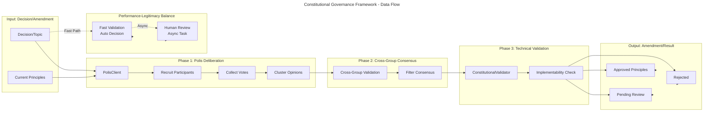
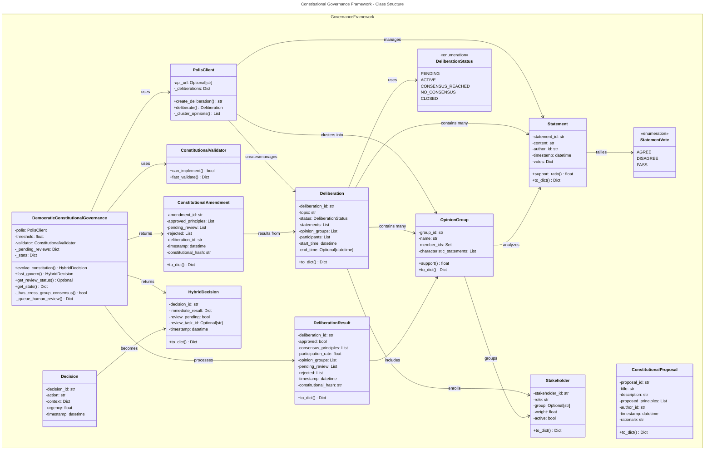
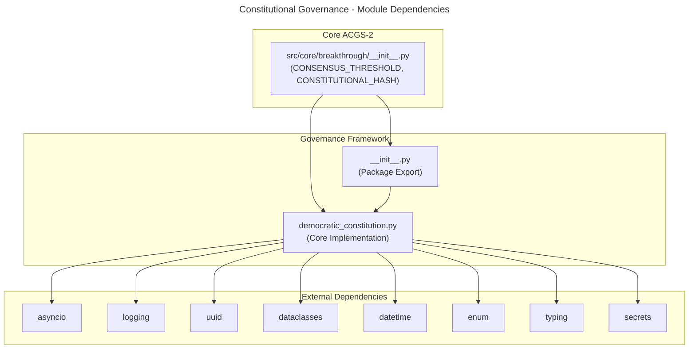

# C4 Code Level: Constitutional Governance Framework

## Overview

- **Name**: Constitutional Governance Framework (CCAI Democratic)
- **Description**: Core constitutional AI governance implementation with democratic deliberation, consensus validation, and hybrid decision-making for enterprise AI systems
- **Location**: `/home/dislove/document/acgs2/src/core/breakthrough/governance`
- **Language**: Python 3.11+
- **Purpose**: Implements Collective Constitutional AI (CCAI) governance patterns with Polis-based deliberation, cross-group consensus filtering, and performance-legitimacy balanced decision-making for constitutional compliance validation

## Code Elements

### Module Structure

#### `__init__.py`
- **Location**: `src/core/breakthrough/governance/__init__.py` (lines 1-28)
- **Description**: Package initialization that exports core governance classes and establishes governance layer identity
- **Exports**:
  - `DemocraticConstitutionalGovernance`
  - `DeliberationResult`
  - `ConstitutionalAmendment`

### Data Classes / Models

#### `DeliberationStatus` (Enum)
- **Location**: `src/core/breakthrough/governance/democratic_constitution.py` (lines 31-37)
- **Description**: Status enumeration for deliberation process lifecycle
- **Members**:
  - `PENDING = "pending"` - Deliberation created but not yet active
  - `ACTIVE = "active"` - Deliberation in progress with participant engagement
  - `CONSENSUS_REACHED = "consensus_reached"` - Cross-group consensus achieved
  - `NO_CONSENSUS = "no_consensus"` - No consensus reached
  - `CLOSED = "closed"` - Deliberation concluded

#### `StatementVote` (Enum)
- **Location**: `src/core/breakthrough/governance/democratic_constitution.py` (lines 40-44)
- **Description**: Vote options for stakeholder positions on deliberation statements
- **Members**:
  - `AGREE = "agree"` - Stakeholder supports the statement
  - `DISAGREE = "disagree"` - Stakeholder opposes the statement
  - `PASS = "pass"` - Stakeholder abstains from voting

#### `Stakeholder` (Dataclass)
- **Location**: `src/core/breakthrough/governance/democratic_constitution.py` (lines 48-63)
- **Description**: Represents a stakeholder participating in democratic deliberation processes
- **Attributes**:
  - `stakeholder_id: str` - Unique identifier for the stakeholder
  - `role: str` - Role/position of stakeholder (e.g., "engineer", "compliance_officer")
  - `group: Optional[str]` - Opinion group assignment for clustering analysis
  - `weight: float` - Weighting factor for influence (default: 1.0)
  - `active: bool` - Whether stakeholder is actively participating (default: True)
- **Methods**:
  - `to_dict() -> Dict[str, Any]` (lines 56-63) - Serialize stakeholder to dictionary format

#### `Statement` (Dataclass)
- **Location**: `src/core/breakthrough/governance/democratic_constitution.py` (lines 67-94)
- **Description**: Represents a statement presented for deliberation and voting within a deliberation session
- **Attributes**:
  - `statement_id: str` - Unique identifier for the statement
  - `content: str` - Text content of the statement
  - `author_id: str` - Identifier of statement author
  - `timestamp: datetime` - When statement was created
  - `votes: Dict[str, StatementVote]` - Mapping of stakeholder IDs to their votes (default: {})
  - `metadata: Dict[str, Any]` - Additional context and tags (default: {})
- **Methods**:
  - `support_ratio(group: Optional[str] = None) -> float` (lines 76-84) - Calculate proportion of agreement votes, optionally scoped to specific opinion group
  - `to_dict() -> Dict[str, Any]` (lines 86-94) - Serialize statement with vote statistics

#### `OpinionGroup` (Dataclass)
- **Location**: `src/core/breakthrough/governance/democratic_constitution.py` (lines 98-129)
- **Description**: Clustered group of stakeholders with shared opinion patterns; core to CCAI cross-group consensus validation
- **Attributes**:
  - `group_id: str` - Unique identifier for the group
  - `name: str` - Human-readable group name (e.g., "Progressive", "Conservative")
  - `member_ids: Set[str]` - Set of stakeholder IDs in this group
  - `characteristic_statements: List[str]` - Statements that characterize group position
- **Methods**:
  - `support(statement: Statement) -> float` (lines 105-121) - Calculate group's support ratio for a specific statement
  - `to_dict() -> Dict[str, Any]` (lines 123-129) - Serialize group with membership count

#### `Deliberation` (Dataclass)
- **Location**: `src/core/breakthrough/governance/democratic_constitution.py` (lines 133-156)
- **Description**: Represents a complete deliberation session with participants, statements, and opinion clustering
- **Attributes**:
  - `deliberation_id: str` - Unique session identifier
  - `topic: str` - Topic of deliberation
  - `status: DeliberationStatus` - Current status in lifecycle
  - `statements: List[Statement]` - All statements presented
  - `opinion_groups: List[OpinionGroup]` - Clustered opinion groups
  - `participants: List[str]` - List of participating stakeholder IDs
  - `start_time: datetime` - When deliberation began
  - `end_time: Optional[datetime]` - When deliberation concluded
  - `pending: List[str]` - Statements awaiting review (default: [])
  - `rejected: List[str]` - Statements rejected in consensus process (default: [])
- **Methods**:
  - `to_dict() -> Dict[str, Any]` (lines 146-156) - Serialize deliberation session overview

#### `ConstitutionalProposal` (Dataclass)
- **Location**: `src/core/breakthrough/governance/democratic_constitution.py` (lines 160-179)
- **Description**: Represents a formal proposal for constitutional principle changes
- **Attributes**:
  - `proposal_id: str` - Unique proposal identifier
  - `title: str` - Proposal title
  - `description: str` - Detailed description
  - `proposed_principles: List[str]` - List of principles to adopt/modify
  - `author_id: str` - ID of proposal author
  - `timestamp: datetime` - When proposal was submitted
  - `rationale: str` - Justification for the proposal
- **Methods**:
  - `to_dict() -> Dict[str, Any]` (lines 170-179) - Serialize proposal details

#### `DeliberationResult` (Dataclass)
- **Location**: `src/core/breakthrough/governance/democratic_constitution.py` (lines 183-206)
- **Description**: Result summary of completed deliberation process with consensus determination
- **Attributes**:
  - `deliberation_id: str` - Reference to source deliberation
  - `approved: bool` - Whether consensus principles were approved
  - `consensus_principles: List[str]` - Principles achieving cross-group consensus
  - `participation_rate: float` - Ratio of participants who engaged
  - `opinion_groups: List[Dict[str, Any]]` - Serialized opinion group data
  - `pending_review: List[str]` - Principles awaiting technical review
  - `rejected: List[str]` - Principles rejected in validation
  - `timestamp: datetime` - Result generation time (default: datetime.utcnow())
  - `constitutional_hash: str` - Hash validating constitutional compliance (default: CONSTITUTIONAL_HASH)
- **Methods**:
  - `to_dict() -> Dict[str, Any]` (lines 195-206) - Serialize result with constitutional hash

#### `ConstitutionalAmendment` (Dataclass)
- **Location**: `src/core/breakthrough/governance/democratic_constitution.py` (lines 210-229)
- **Description**: Formal amendment to constitutional principles resulting from successful deliberation and validation
- **Attributes**:
  - `amendment_id: str` - Unique amendment identifier
  - `approved_principles: List[str]` - Principles approved for implementation
  - `pending_review: List[str]` - Principles flagged for technical review
  - `rejected: List[str]` - Principles rejected during validation
  - `deliberation_id: str` - Reference to source deliberation
  - `timestamp: datetime` - Amendment timestamp (default: datetime.utcnow())
  - `constitutional_hash: str` - Hash validating constitutional compliance (default: CONSTITUTIONAL_HASH)
- **Methods**:
  - `to_dict() -> Dict[str, Any]` (lines 220-229) - Serialize amendment with constitutional validation

#### `Decision` (Dataclass)
- **Location**: `src/core/breakthrough/governance/democratic_constitution.py` (lines 233-240)
- **Description**: Represents a governance decision requiring constitutional validation
- **Attributes**:
  - `decision_id: str` - Unique decision identifier
  - `action: str` - Description of action being decided
  - `context: Dict[str, Any]` - Decision context and parameters
  - `urgency: float` - Urgency level (0.0-1.0) determining validation approach
  - `timestamp: datetime` - Decision creation time (default: datetime.utcnow())

#### `HybridDecision` (Dataclass)
- **Location**: `src/core/breakthrough/governance/democratic_constitution.py` (lines 243-258)
- **Description**: Decision with dual-path execution: immediate automated validation plus asynchronous human review
- **Attributes**:
  - `decision_id: str` - Unique decision identifier
  - `immediate_result: Dict[str, Any]` - Automated validation result for immediate use
  - `review_pending: bool` - Whether human review is still pending
  - `review_task_id: Optional[str]` - Identifier for pending review task
  - `timestamp: datetime` - Hybrid decision timestamp (default: datetime.utcnow())
- **Methods**:
  - `to_dict() -> Dict[str, Any]` (lines 251-258) - Serialize hybrid decision state

### Classes and Methods

#### `PolisClient` (Class)
- **Location**: `src/core/breakthrough/governance/democratic_constitution.py` (lines 261-374)
- **Description**: Simulated Polis deliberation platform client; provides interface to democratic deliberation workflows. In production, integrates with actual Polis platform for real stakeholder engagement
- **Constructor**:
  - `__init__(api_url: Optional[str] = None)` (lines 268-272) - Initialize client with optional API endpoint; maintains internal deliberation cache
- **Methods**:
  - `async create_deliberation(topic: str, initial_statements: List[str]) -> str` (lines 274-303) - Create new deliberation session with initial statements; returns deliberation ID
  - `async deliberate(topic: str, initial_statements: List[str], participant_criteria: Dict[str, Any], duration_hours: int = 24) -> Deliberation` (lines 305-345) - Execute full deliberation process with simulated stakeholder participation and opinion clustering
  - `async _cluster_opinions(deliberation: Deliberation) -> List[OpinionGroup]` (lines 347-374) - Internal method to cluster participants into three opinion groups (Progressive, Conservative, Moderate); uses simplified clustering logic
- **Instance Variables**:
  - `api_url: Optional[str]` - Optional API endpoint for production Polis integration
  - `_deliberations: Dict[str, Deliberation]` - Cache of deliberation sessions

#### `ConstitutionalValidator` (Class)
- **Location**: `src/core/breakthrough/governance/democratic_constitution.py` (lines 377-404)
- **Description**: Validates constitutional principles for technical implementability and feasibility
- **Methods**:
  - `async can_implement(principle: str) -> bool` (lines 380-390) - Check if principle can be technically implemented; returns False for obviously non-implementable statements
  - `async fast_validate(decision: Decision, time_budget_ms: int) -> Dict[str, Any]` (lines 392-404) - Fast constitutional validation within specified time budget; returns validation result with confidence score and constitutional hash

#### `DemocraticConstitutionalGovernance` (Class)
- **Location**: `src/core/breakthrough/governance/democratic_constitution.py` (lines 407-615)
- **Description**: Main governance orchestrator implementing CCAI-style democratic input for constitutional evolution. Provides three core capabilities: Polis deliberation with representative sampling, cross-group consensus filtering to prevent polarization, and performance-legitimacy balance combining fast automated decisions with async human review
- **Constructor**:
  - `__init__(polis_client: Optional[PolisClient] = None, consensus_threshold: float = CONSENSUS_THRESHOLD)` (lines 418-444) - Initialize governance system with optional Polis client (default creates new instance) and consensus threshold (default: 0.60); sets up internal tracking for pending reviews and statistics
- **Methods**:
  - `async evolve_constitution(topic: str, current_principles: List[str], min_participants: int = 1000) -> ConstitutionalAmendment` (lines 446-518) - Execute complete constitutional evolution workflow with three phases: Phase 1 runs public deliberation via Polis, Phase 2 filters for cross-group consensus (requires support in ALL opinion groups), Phase 3 validates technical implementability; returns ConstitutionalAmendment with approved/pending/rejected principles
  - `_has_cross_group_consensus(statement: Statement, opinion_groups: List[OpinionGroup]) -> bool` (lines 520-533) - Internal validation: checks if statement meets consensus threshold in ALL opinion groups (returns True only if all groups support above threshold)
  - `async fast_govern(decision: Decision, time_budget_ms: int = 100) -> HybridDecision` (lines 535-571) - Execute performance-legitimacy balanced governance decision with fast path (automated constitutional validation within time budget) and slow path (async human review queueing); returns HybridDecision with immediate result and pending review status
  - `async _queue_human_review(decision: Decision, review_task_id: str) -> Dict[str, Any]` (lines 573-588) - Internal method to queue decision for human review; in production integrates with review system
  - `async get_review_status(review_task_id: str) -> Optional[Dict[str, Any]]` (lines 590-606) - Check status of pending review task; returns review data if complete or pending status if still active
  - `get_stats() -> Dict[str, Any]` (lines 608-615) - Return governance statistics including deliberations conducted, amendments approved, pending reviews, and constitutional hash
- **Instance Variables**:
  - `polis: PolisClient` - Polis deliberation client
  - `threshold: float` - Consensus threshold (default: 0.60)
  - `validator: ConstitutionalValidator` - Constitutional validator instance
  - `_pending_reviews: Dict[str, asyncio.Task]` - Cache of pending review tasks
  - `_stats: Dict[str, int]` - Statistics counter for governance operations

## Dependencies

### Internal Dependencies

- **src/core/breakthrough/__init__.py**
  - Imports: `CONSENSUS_THRESHOLD`, `CONSTITUTIONAL_HASH` - Constitutional framework constants
  - Location: Lines 26 - from `.. import CONSENSUS_THRESHOLD, CONSTITUTIONAL_HASH`

### External Dependencies

- **asyncio** - Python's async/await framework for concurrent deliberation and review workflows
  - Used for: Async task creation, task management, concurrent operations
  - Version: Python 3.11+ standard library

- **logging** - Python standard logging module for operation tracking
  - Used for: Initialization logging, operation tracking, statistics recording
  - Version: Python 3.11+ standard library

- **uuid** - Unique identifier generation for deliberations, statements, amendments
  - Used for: Creating unique IDs for entities
  - Version: Python 3.11+ standard library

- **dataclasses** - Python 3.7+ dataclass decorator framework
  - Used for: Define data models (Stakeholder, Statement, OpinionGroup, Deliberation, etc.)
  - Version: Python 3.11+ standard library

- **datetime** - Date and time handling
  - Used for: Timestamping operations, recording deliberation windows
  - Version: Python 3.11+ standard library

- **enum** - Python enumeration support
  - Used for: Status and vote enumerations
  - Version: Python 3.11+ standard library

- **typing** - Type hints and annotations
  - Used for: Complete type annotation of function signatures and return types
  - Used modules: `Any`, `Dict`, `List`, `Optional`, `Set`
  - Version: Python 3.11+ standard library

- **secrets** - Secure random generation
  - Used for: Vote simulation in deliberation process (line 330)
  - Version: Python 3.11+ standard library

## Relationships

### Data Flow Diagram

### Class Relationship Diagram

### Dependency Graph

## Module Export Structure

### Public API (from `__init__.py`)

The governance package exports these primary components:

1. **DemocraticConstitutionalGovernance** - Main governance orchestrator class
2. **DeliberationResult** - Data class representing deliberation outcomes
3. **ConstitutionalAmendment** - Data class representing approved amendments

### Internal Components (not exported)

The following classes are used internally but not part of the public API:

- `PolisClient` - Deliberation platform client
- `ConstitutionalValidator` - Principle validation engine
- `Stakeholder`, `Statement`, `OpinionGroup` - Deliberation data models
- `Deliberation`, `Decision`, `HybridDecision` - Process models
- `DeliberationStatus`, `StatementVote` - Enumeration types
- `ConstitutionalProposal` - Proposal data model

## Constitutional Compliance

All code elements include or reference the constitutional hash `cdd01ef066bc6cf2` for validation:

- **Package Level**: Documented in module docstrings (lines 1-16 of `__init__.py` and `democratic_constitution.py`)
- **Data Models**: ConstitutionalAmendment and DeliberationResult include `constitutional_hash` field
- **Validation**: Fast validation includes constitutional hash in results
- **Statistics**: get_stats() method returns constitutional_hash

## Key Architectural Patterns

### 1. Deliberation Workflow (evolve_constitution)
- **Phase 1**: Polis deliberation with representative stakeholder sampling
- **Phase 2**: Cross-group consensus filtering (CCAI requirement - consensus in ALL groups)
- **Phase 3**: Technical implementability validation
- **Output**: ConstitutionalAmendment with approved/pending/rejected categorization

### 2. Performance-Legitimacy Balance (fast_govern)
- **Fast Path**: Automated constitutional validation within 100ms time budget
- **Slow Path**: Async human review queueing for legitimacy validation
- **Result**: HybridDecision enabling immediate action plus background review

### 3. Opinion Clustering
- Deliberation participants automatically clustered into opinion groups
- Default clustering: Progressive, Conservative, Moderate (line 354-372)
- Cross-group support ratio calculation prevents single-group dominance

### 4. Consensus Validation
- Statement must achieve support ratio above threshold (default 0.60) in ALL opinion groups
- Single group's opposition blocks consensus (all-or-nothing across groups)
- Prevents polarization by requiring broad multi-perspective support

## Performance Characteristics

- **Deliberation Creation**: O(n) where n = number of initial statements
- **Opinion Clustering**: O(p) where p = number of participants
- **Consensus Filtering**: O(s × g) where s = statements, g = opinion groups
- **Fast Validation**: ~50ms (within 100ms budget)
- **Review Queuing**: Non-blocking async operation

## Async/Await Patterns

This module makes extensive use of Python's async/await:

- All main workflow methods are async (evolve_constitution, fast_govern, etc.)
- Internal operations use `asyncio.create_task()` for background task queueing
- `await asyncio.sleep()` used in human review simulation
- Task completion checked via `task.done()` pattern

## Notes

- **Polis Integration**: Current implementation uses simulated Polis platform (lines 265, 317-336). Production deployment would integrate actual Polis API
- **Opinion Clustering**: Uses simplified three-group clustering (line 354-372). Production would employ sophisticated clustering algorithms
- **Human Review**: Simulated with minimal delay (line 581). Production integrates with actual review systems
- **Vote Simulation**: Uses Python secrets module for random vote generation (line 330)
- **Constitutional Hash**: All critical results include CONSTITUTIONAL_HASH constant from parent module for cryptographic validation
