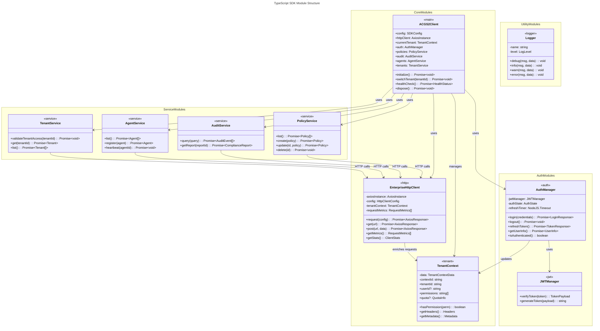
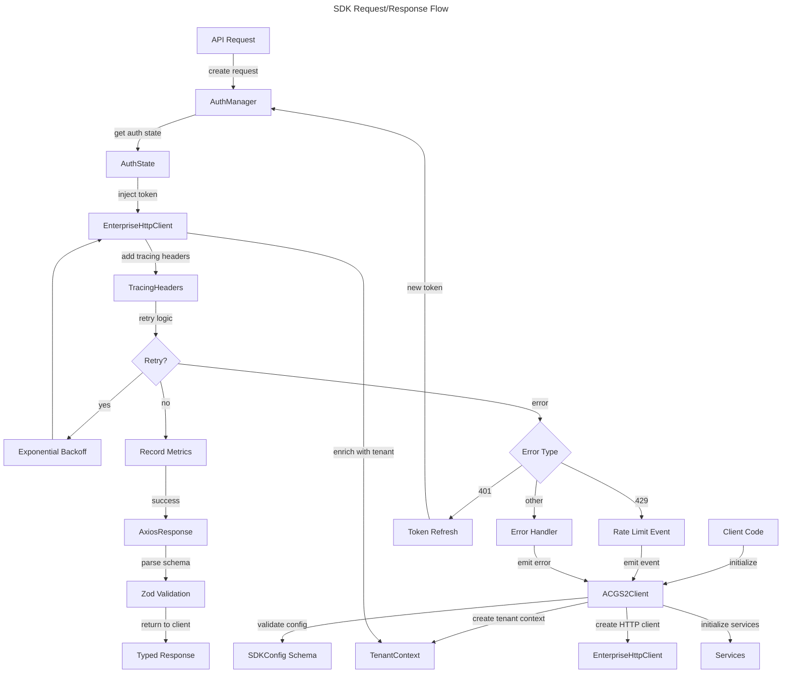
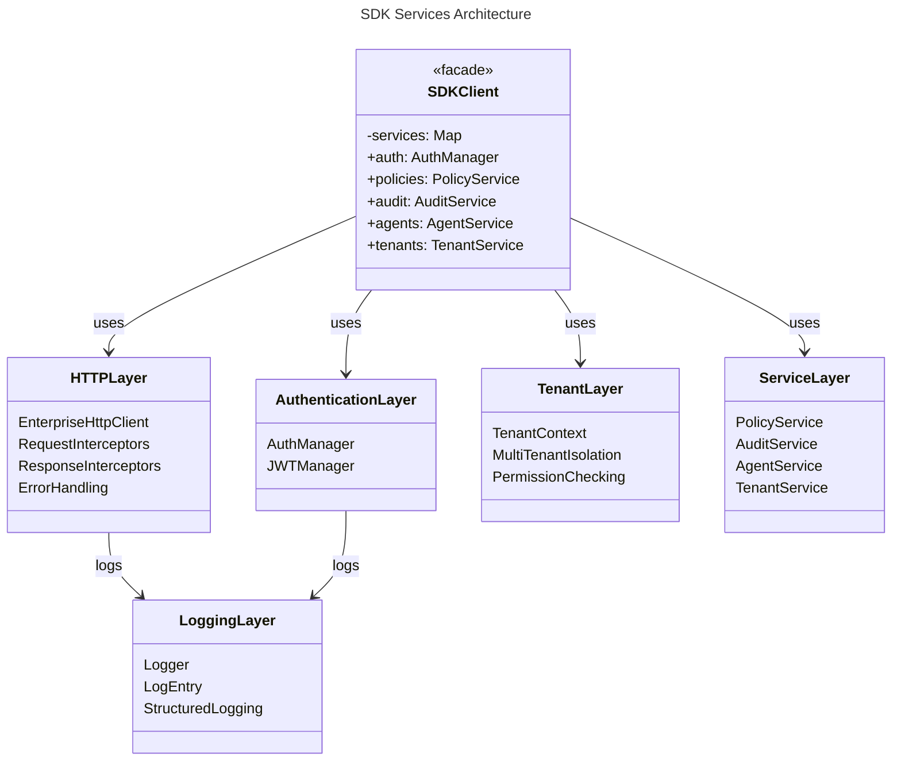

# C4 Code Level: TypeScript SDK

## Overview

- **Name**: ACGS-2 Enterprise TypeScript SDK
- **Description**: Production-ready TypeScript client library for ACGS-2 API integration with multi-tenant support, constitutional compliance validation, enterprise HTTP client with retry logic, JWT token management, and comprehensive event-driven architecture
- **Location**: `/home/dislove/document/acgs2/sdk/typescript/src`
- **Language**: TypeScript 5.3+
- **Purpose**: Provides type-safe, enterprise-grade SDK for consuming ACGS-2 API with support for multi-tenant environments, constitutional governance validation, authentication, policy management, audit services, and agent coordination

## Code Elements

### Core Client Module

#### Class: `ACGS2Client` extends `EventEmitter<SDKEvents>`
- **Description**: Main entry point for ACGS-2 SDK. Manages multi-tenant AI governance platform client with constitutional compliance validation, service orchestration, and lifecycle management.
- **Location**: `/home/dislove/document/acgs2/sdk/typescript/src/core/client.ts:64-292`
- **Properties**:
  - `config: SDKConfig` (private) - Validated SDK configuration
  - `httpClient: AxiosInstance` (private) - HTTP client instance
  - `currentTenant: TenantContext` (private) - Current tenant context
  - `isReady: boolean` (private) - SDK initialization state
  - `auth: AuthManager` (public) - Authentication service
  - `policies: PolicyService` (public) - Policy management service
  - `audit: AuditService` (public) - Audit logging service
  - `agents: AgentService` (public) - Agent management service
  - `tenants: TenantService` (public) - Tenant management service

- **Methods**:
  - `constructor(config: SDKConfig): void` - Initialize SDK client
  - `initialize(): Promise<void>` - Initialize SDK and establish connections
  - `switchTenant(tenantId: string): Promise<void>` - Switch to different tenant context
  - `getCurrentTenant(): TenantContext` - Get current tenant information
  - `isInitialized(): boolean` - Check if SDK is ready
  - `getConfig(): Omit<SDKConfig, ...>` - Get SDK configuration without sensitive data
  - `healthCheck(): Promise<{ status, services, timestamp }>` - Perform health check
  - `getMetrics(): Record<string, any>` - Get metrics if enabled
  - `dispose(): Promise<void>` - Clean up resources
  - `private handleRequestError(error: any): void` - Handle HTTP request errors
  - `private setupEventForwarding(): void` - Set up event forwarding from services

- **Dependencies**:
  - Internal: `createHttpClient`, `TenantContext`, `AuthManager`, `PolicyService`, `AuditService`, `AgentService`, `TenantService`
  - External: `eventemitter3`, `zod`, `axios`

#### Function: `createACGS2Client(config: SDKConfig): ACGS2Client`
- **Description**: Factory function to create ACGS2Client instance
- **Location**: `/home/dislove/document/acgs2/sdk/typescript/src/core/client.ts:297-299`
- **Parameters**:
  - `config: SDKConfig` - SDK configuration
- **Returns**: `ACGS2Client` instance
- **Dependencies**: `ACGS2Client`

#### Function: `createDefaultConfig(baseURL: string, tenantId: string): SDKConfig`
- **Description**: Default SDK configuration factory with production defaults
- **Location**: `/home/dislove/document/acgs2/sdk/typescript/src/core/client.ts:304-316`
- **Parameters**:
  - `baseURL: string` - Base API URL
  - `tenantId: string` - Tenant identifier
- **Returns**: `SDKConfig` with sensible defaults (10s timeout, 3 retries, metrics enabled, production environment)
- **Dependencies**: None

#### Type: `SDKConfig`
- **Description**: SDK configuration object with validation
- **Location**: `/home/dislove/document/acgs2/sdk/typescript/src/core/client.ts:18-30`
- **Properties**:
  - `baseURL: string` - Base API URL (must be valid URL)
  - `tenantId: string` - Tenant identifier (minimum 1 character)
  - `constitutionalHash: 'cdd01ef066bc6cf2'` - Immutable constitutional hash literal
  - `timeout: number` - Request timeout (1000-30000ms, default 10000)
  - `retryAttempts: number` - Retry attempts (0-5, default 3)
  - `retryDelay: number` - Retry delay (100-5000ms, default 1000)
  - `enableMetrics: boolean` - Enable metrics collection (default true)
  - `enableTracing: boolean` - Enable distributed tracing (default true)
  - `environment: 'development' | 'staging' | 'production'` - Environment (default 'production')

#### Type: `TenantConfig`
- **Description**: Tenant-specific configuration
- **Location**: `/home/dislove/document/acgs2/sdk/typescript/src/core/client.ts:32-47`
- **Properties**:
  - `tenantId: string` - Tenant identifier
  - `tenantTier: 'free' | 'professional' | 'enterprise' | 'sovereign'` - Tenant tier
  - `resourceQuota: { users, policies, agents, apiCalls, storage }` - Resource quotas
  - `complianceFrameworks: string[]` - Applicable compliance frameworks
  - `dataResidency: string | optional` - Data residency region
  - `features: string[]` - Available features

#### Interface: `SDKEvents`
- **Description**: SDK event types
- **Location**: `/home/dislove/document/acgs2/sdk/typescript/src/core/client.ts:50-58`
- **Event Signatures**:
  - `ready: () => void` - SDK initialization complete
  - `error: (error: Error) => void` - SDK error occurred
  - `tenantSwitched: (tenantId: string) => void` - Tenant context switched
  - `authenticated: (userId: string) => void` - User authenticated
  - `deauthenticated: () => void` - User deauthenticated
  - `rateLimited: (retryAfter: number) => void` - Rate limit hit
  - `quotaExceeded: (resource: string, limit: number) => void` - Quota exceeded

---

### HTTP Client Module

#### Class: `EnterpriseHttpClient`
- **Description**: Enterprise-grade HTTP client with retry logic, metrics collection, tenant context integration, and request/response interceptors
- **Location**: `/home/dislove/document/acgs2/sdk/typescript/src/core/http.ts:65-416`
- **Properties**:
  - `axiosInstance: AxiosInstance` (private) - Axios HTTP client
  - `config: HttpClientConfig` (private) - HTTP client configuration
  - `tenantContext?: TenantContext` (private) - Current tenant context
  - `requestMetrics: RequestMetrics[]` (private) - Request metrics history
  - `maxMetricsHistory: number` (private) - Maximum metrics to retain (1000)
  - `requestInterceptors: RequestInterceptor[]` (private) - Custom request interceptors
  - `responseInterceptors: ResponseInterceptor[]` (private) - Custom response interceptors
  - `errorInterceptors: ErrorInterceptor[]` (private) - Custom error interceptors

- **Methods**:
  - `constructor(baseURL: string, config: HttpClientConfig, onError?: (error: any) => void): void` - Initialize HTTP client
  - `setTenantContext(context: TenantContext): void` - Set tenant context for requests
  - `addRequestInterceptor(interceptor: RequestInterceptor): void` - Add request interceptor
  - `addResponseInterceptor(interceptor: ResponseInterceptor): void` - Add response interceptor
  - `addErrorInterceptor(interceptor: ErrorInterceptor): void` - Add error interceptor
  - `request<T = any>(config: AxiosRequestConfig): Promise<AxiosResponse<T>>` - Make HTTP request with retry
  - `get<T = any>(url: string, config?: AxiosRequestConfig): Promise<AxiosResponse<T>>` - GET request
  - `post<T = any>(url: string, data?: any, config?: AxiosRequestConfig): Promise<AxiosResponse<T>>` - POST request
  - `put<T = any>(url: string, data?: any, config?: AxiosRequestConfig): Promise<AxiosResponse<T>>` - PUT request
  - `patch<T = any>(url: string, data?: any, config?: AxiosRequestConfig): Promise<AxiosResponse<T>>` - PATCH request
  - `delete<T = any>(url: string, config?: AxiosRequestConfig): Promise<AxiosResponse<T>>` - DELETE request
  - `getMetrics(): RequestMetrics[]` - Get request metrics history
  - `clearMetrics(): void` - Clear metrics history
  - `getStats(): { totalRequests, successRate, averageResponseTime, errorRate, recentErrors }` - Get client statistics
  - `private setupDefaultInterceptors(): void` - Setup default request/response interceptors
  - `private enrichRequestConfig(config: AxiosRequestConfig): AxiosRequestConfig` - Enrich config with tenant/tracing headers
  - `private generateTracingHeaders(): TracingHeaders` - Generate tracing headers for request
  - `private generateId(): string` - Generate random ID
  - `private shouldRetry(error: AxiosError, retryCount: number): boolean` - Determine if request should retry
  - `private calculateRetryDelay(retryCount: number): number` - Calculate retry delay with exponential backoff
  - `private recordMetrics(metrics: RequestMetrics): void` - Record request metrics
  - `private delay(ms: number): Promise<void>` - Delay utility

- **Dependencies**:
  - Internal: `TenantContext`
  - External: `axios`, `zod`

#### Function: `createHttpClient(sdkConfig: SDKConfig, onError?: (error: any) => void): AxiosInstance`
- **Description**: Create HTTP client instance with Axios-compatible interface
- **Location**: `/home/dislove/document/acgs2/sdk/typescript/src/core/http.ts:421-484`
- **Parameters**:
  - `sdkConfig: SDKConfig` - SDK configuration
  - `onError?: (error: any) => void` - Error handler callback
- **Returns**: `AxiosInstance` - Axios-compatible HTTP client with enterprise methods
- **Dependencies**: `EnterpriseHttpClient`

#### Type: `HttpClientConfig`
- **Description**: HTTP client configuration
- **Location**: `/home/dislove/document/acgs2/sdk/typescript/src/core/http.ts:18-28`
- **Properties**:
  - `timeout: number` - Request timeout (1000-30000ms)
  - `retryAttempts: number` - Max retry attempts (0-5)
  - `retryDelay: number` - Base retry delay (100-5000ms)
  - `retryOnStatusCodes: number[]` - Status codes to retry on (default [429, 500, 502, 503, 504])
  - `enableMetrics: boolean` - Enable metrics collection (default true)
  - `enableTracing: boolean` - Enable distributed tracing (default true)
  - `userAgent: string` - User-Agent header (default 'ACGS-2-TypeScript-SDK/3.0.0')

#### Interface: `RequestMetrics`
- **Description**: Request metrics data structure
- **Location**: `/home/dislove/document/acgs2/sdk/typescript/src/core/http.ts:44-54`
- **Properties**:
  - `method: string` - HTTP method
  - `url: string` - Request URL
  - `statusCode?: number` - Response status code
  - `duration: number` - Request duration (ms)
  - `retryCount: number` - Number of retries
  - `timestamp: Date` - Request timestamp
  - `tenantId: string` - Tenant identifier
  - `userId?: string` - User identifier
  - `error?: string` - Error message if failed

#### Interface: `TracingHeaders`
- **Description**: Distributed tracing headers
- **Location**: `/home/dislove/document/acgs2/sdk/typescript/src/core/http.ts:56-60`
- **Properties**:
  - `x-trace-id: string` - Trace identifier
  - `x-span-id: string` - Span identifier
  - `x-parent-span-id?: string` - Parent span identifier (optional)

#### Type: `RequestInterceptor`
- **Description**: Request interceptor function type
- **Location**: `/home/dislove/document/acgs2/sdk/typescript/src/core/http.ts:31-33`
- **Signature**: `(config: InternalAxiosRequestConfig): InternalAxiosRequestConfig | Promise<InternalAxiosRequestConfig>`

#### Type: `ResponseInterceptor`
- **Description**: Response interceptor function type
- **Location**: `/home/dislove/document/acgs2/sdk/typescript/src/core/http.ts:35-37`
- **Signature**: `(response: AxiosResponse): AxiosResponse | Promise<AxiosResponse>`

#### Type: `ErrorInterceptor`
- **Description**: Error interceptor function type
- **Location**: `/home/dislove/document/acgs2/sdk/typescript/src/core/http.ts:39-41`
- **Signature**: `(error: AxiosError): Promise<never>`

---

### Tenant Context Module

#### Class: `TenantContext` extends `EventEmitter<TenantContextEvents>`
- **Description**: Manages multi-tenant isolation, context state, and tenant-specific configuration for API requests
- **Location**: `/home/dislove/document/acgs2/sdk/typescript/src/core/tenant.ts:44-358`
- **Properties**:
  - `data: TenantContextData` (private) - Tenant context data
  - `contextId: string` (private) - Unique context instance identifier
  - `tenantId: string` (getter) - Tenant identifier
  - `constitutionalHash: string` (getter) - Constitutional hash validation
  - `environment: 'development' | 'staging' | 'production'` (getter) - Environment
  - `userId?: string` (getter/setter) - Current user identifier
  - `sessionId?: string` (getter/setter) - Current session identifier
  - `permissions: string[]` (getter/setter) - User permissions
  - `quota?: object` (getter/setter) - Resource quota information
  - `features: string[]` (getter/setter) - Available features
  - `complianceFrameworks: string[]` (getter/setter) - Compliance frameworks
  - `dataResidency?: string` (getter/setter) - Data residency region
  - `createdAt?: Date` (getter) - Creation timestamp
  - `updatedAt?: Date` (getter) - Last update timestamp

- **Methods**:
  - `constructor(initialData: Omit<TenantContextData, 'createdAt' | 'updatedAt'>): void` - Initialize context
  - `setUserId(userId?: string): void` - Set current user ID
  - `setSessionId(sessionId?: string): void` - Set session ID
  - `setPermissions(permissions: string[]): void` - Set user permissions
  - `hasPermission(permission: string): boolean` - Check if user has permission
  - `hasAnyPermission(permissions: string[]): boolean` - Check if user has any permission
  - `hasAllPermissions(permissions: string[]): boolean` - Check if user has all permissions
  - `setQuota(quota?: object): void` - Set resource quota
  - `checkQuota(resource: string, amount?: number): boolean` - Check if quota allows operation
  - `setFeatures(features: string[]): void` - Set available features
  - `hasFeature(feature: string): boolean` - Check if feature is available
  - `setComplianceFrameworks(frameworks: string[]): void` - Set compliance frameworks
  - `setDataResidency(residency?: string): void` - Set data residency
  - `getContextId(): string` - Get unique context identifier
  - `toJSON(): TenantContextData` - Serialize context data
  - `static fromJSON(data: TenantContextData): TenantContext` - Deserialize context
  - `clone(): TenantContext` - Clone context
  - `getHeaders(): Record<string, string>` - Get tenant headers for API requests
  - `getMetadata(): Record<string, any>` - Get metadata for logging
  - `private validate(): void` - Validate context data
  - `private generateContextId(): string` - Generate unique context ID

- **Dependencies**:
  - Internal: None
  - External: `zod`, `eventemitter3`

#### Function: `createTenantContext(data: Omit<TenantContextData, 'createdAt' | 'updatedAt'>): TenantContext`
- **Description**: Factory function to create TenantContext
- **Location**: `/home/dislove/document/acgs2/sdk/typescript/src/core/tenant.ts:364-366`
- **Parameters**:
  - `data: Omit<TenantContextData, ...>` - Initial context data
- **Returns**: `TenantContext` instance
- **Dependencies**: `TenantContext`

#### Function: `createDefaultTenantContext(tenantId: string, environment?: 'development' | 'staging' | 'production'): TenantContext`
- **Description**: Create default tenant context with production defaults
- **Location**: `/home/dislove/document/acgs2/sdk/typescript/src/core/tenant.ts:371-380`
- **Parameters**:
  - `tenantId: string` - Tenant identifier
  - `environment?: string` - Environment (default 'production')
- **Returns**: `TenantContext` instance
- **Dependencies**: `TenantContext`

#### Type: `TenantContextData`
- **Description**: Tenant context data structure
- **Location**: `/home/dislove/document/acgs2/sdk/typescript/src/core/tenant.ts:10-29`
- **Properties**:
  - `tenantId: string` - Tenant identifier
  - `constitutionalHash: 'cdd01ef066bc6cf2'` - Constitutional hash literal
  - `environment: 'development' | 'staging' | 'production'` - Environment
  - `userId?: string` - Current user ID
  - `sessionId?: string` - Session ID
  - `permissions: string[]` - User permissions
  - `quota?: { users, policies, agents, apiCalls, storage }` - Resource quotas
  - `features: string[]` - Feature list
  - `complianceFrameworks: string[]` - Compliance framework list
  - `dataResidency?: string` - Data residency region
  - `createdAt?: Date` - Creation timestamp
  - `updatedAt?: Date` - Last update timestamp

#### Interface: `TenantContextEvents`
- **Description**: Tenant context event types
- **Location**: `/home/dislove/document/acgs2/sdk/typescript/src/core/tenant.ts:34-38`
- **Event Signatures**:
  - `updated: (context: TenantContext) => void` - Context updated
  - `permissionChanged: (permissions: string[]) => void` - Permissions changed
  - `quotaUpdated: (quota?: object) => void` - Quota updated

---

### Authentication Module

#### Class: `AuthManager` extends `EventEmitter<AuthEvents>`
- **Description**: Handles user authentication, JWT token management, automatic token refresh, and session lifecycle
- **Location**: `/home/dislove/document/acgs2/sdk/typescript/src/auth/auth-manager.ts:85-436`
- **Properties**:
  - `jwtManager: JWTManager` (private) - JWT management
  - `authState: AuthState` (private) - Current authentication state
  - `refreshTimer?: NodeJS.Timeout` (private) - Token refresh timer
  - `isRefreshing: boolean` (private) - Token refresh in progress flag
  - `httpClient: AxiosInstance` (private) - HTTP client
  - `tenantContext: TenantContext` (private) - Tenant context

- **Methods**:
  - `constructor(httpClient: AxiosInstance, tenantContext: TenantContext): void` - Initialize auth manager
  - `initialize(): Promise<void>` - Initialize and restore previous authentication if available
  - `switchTenant(newContext: TenantContext): Promise<void>` - Switch to new tenant context
  - `login(credentials: LoginRequest): Promise<LoginResponse>` - User login
  - `logout(): Promise<void>` - User logout
  - `refreshToken(): Promise<TokenRefreshResponse>` - Refresh access token
  - `getUserInfo(): Promise<UserInfo>` - Get current user information
  - `updateProfile(updates: Partial<...>): Promise<UserInfo>` - Update user profile
  - `changePassword(currentPassword: string, newPassword: string): Promise<void>` - Change password
  - `getAuthState(): AuthState` - Get current auth state
  - `isAuthenticated(): boolean` - Check if user is authenticated
  - `getCurrentUser(): UserInfo | undefined` - Get current user
  - `healthCheck(): Promise<boolean>` - Health check
  - `getMetrics(): Record<string, any>` - Get auth metrics
  - `dispose(): void` - Clean up resources
  - `private validateAndSetTokens(accessToken: string, refreshToken: string): Promise<void>` - Validate and store tokens
  - `private clearAuthState(): void` - Clear authentication state
  - `private ensureAuthenticated(): void` - Ensure user is authenticated
  - `private setupAutoRefresh(): void` - Setup automatic token refresh
  - `private clearRefreshTimer(): void` - Clear refresh timer
  - `private storeTokens(accessToken: string, refreshToken: string): void` - Store tokens in localStorage
  - `private getStoredTokens(): { accessToken, refreshToken } | null` - Retrieve stored tokens
  - `private clearStoredTokens(): void` - Clear stored tokens

- **Dependencies**:
  - Internal: `JWTManager`, `TenantContext`
  - External: `eventemitter3`, `zod`, `axios`

#### Type: `LoginRequest`
- **Description**: Login request data
- **Location**: `/home/dislove/document/acgs2/sdk/typescript/src/auth/auth-manager.ts:13-17`
- **Properties**:
  - `username: string` - Username
  - `password: string` - Password
  - `tenantId?: string` - Tenant ID (optional)

#### Type: `LoginResponse`
- **Description**: Login response data
- **Location**: `/home/dislove/document/acgs2/sdk/typescript/src/auth/auth-manager.ts:19-31`
- **Properties**:
  - `accessToken: string` - Access token
  - `refreshToken: string` - Refresh token
  - `tokenType: string` - Token type (default 'Bearer')
  - `expiresIn: number` - Expiration seconds
  - `user: { id, username, email, roles, permissions }` - User information

#### Type: `TokenRefreshRequest`
- **Description**: Token refresh request
- **Location**: `/home/dislove/document/acgs2/sdk/typescript/src/auth/auth-manager.ts:33-35`
- **Properties**:
  - `refreshToken: string` - Refresh token

#### Type: `TokenRefreshResponse`
- **Description**: Token refresh response
- **Location**: `/home/dislove/document/acgs2/sdk/typescript/src/auth/auth-manager.ts:37-42`
- **Properties**:
  - `accessToken: string` - New access token
  - `refreshToken?: string` - New refresh token (optional)
  - `tokenType: string` - Token type (default 'Bearer')
  - `expiresIn: number` - Expiration seconds

#### Type: `UserInfo`
- **Description**: User information
- **Location**: `/home/dislove/document/acgs2/sdk/typescript/src/auth/auth-manager.ts:44-55`
- **Properties**:
  - `id: string` - User ID
  - `username: string` - Username
  - `email: string` - Email address
  - `firstName?: string` - First name (optional)
  - `lastName?: string` - Last name (optional)
  - `roles: string[]` - User roles
  - `permissions: string[]` - User permissions
  - `tenantId: string` - Tenant ID
  - `lastLogin?: Date` - Last login timestamp (optional)
  - `isActive: boolean` - Active status

#### Interface: `AuthState`
- **Description**: Authentication state
- **Location**: `/home/dislove/document/acgs2/sdk/typescript/src/auth/auth-manager.ts:64-70`
- **Properties**:
  - `isAuthenticated: boolean` - Authentication status
  - `user?: UserInfo` - User information (optional)
  - `accessToken?: string` - Access token (optional)
  - `refreshToken?: string` - Refresh token (optional)
  - `expiresAt?: Date` - Token expiration time (optional)

#### Interface: `AuthEvents`
- **Description**: Authentication event types
- **Location**: `/home/dislove/document/acgs2/sdk/typescript/src/auth/auth-manager.ts:73-79`
- **Event Signatures**:
  - `authenticated: (userId: string) => void` - User authenticated
  - `deauthenticated: () => void` - User deauthenticated
  - `tokenRefreshed: (expiresAt: Date) => void` - Token refreshed
  - `tokenExpired: () => void` - Token expired
  - `loginFailed: (error: Error) => void` - Login failed

---

### Logger Utility Module

#### Class: `Logger`
- **Description**: Structured logging utility for SDK with constitutional hash validation
- **Location**: `/home/dislove/document/acgs2/sdk/typescript/src/utils/logger.ts:24-106`
- **Properties**:
  - `name: string` (private) - Logger name
  - `level: LogLevel` (private) - Minimum log level
  - `constitutionalHash: string` (private) - Constitutional hash ('cdd01ef066bc6cf2')

- **Methods**:
  - `constructor(name: string, level?: LogLevel): void` - Initialize logger
  - `debug(message: string, data?: any): void` - Log debug message
  - `info(message: string, data?: any): void` - Log info message
  - `warn(message: string, data?: any): void` - Log warning message
  - `error(message: string, data?: any): void` - Log error message
  - `logSuccess(message: string, data?: any): void` - Log success message
  - `logError(message: string, error?: any): void` - Log error with error object
  - `logResult(result: any): void` - Log operation result
  - `private shouldLog(level: LogLevel): boolean` - Check if message should be logged
  - `private formatMessage(level: string, message: string, data?: any): LogEntry` - Format log entry
  - `private log(level: LogLevel, levelName: string, message: string, data?: any): void` - Internal log method

- **Dependencies**:
  - Internal: None
  - External: None

#### Enum: `LogLevel`
- **Description**: Log level enumeration
- **Location**: `/home/dislove/document/acgs2/sdk/typescript/src/utils/logger.ts:8-13`
- **Values**:
  - `DEBUG = 0` - Debug level
  - `INFO = 1` - Info level
  - `WARN = 2` - Warning level
  - `ERROR = 3` - Error level

#### Interface: `LogEntry`
- **Description**: Structured log entry
- **Location**: `/home/dislove/document/acgs2/sdk/typescript/src/utils/logger.ts:15-22`
- **Properties**:
  - `timestamp: string` - ISO 8601 timestamp
  - `level: string` - Log level name
  - `logger: string` - Logger name
  - `message: string` - Log message
  - `constitutional_hash: string` - Constitutional hash
  - `data?: any` - Additional data (optional)

#### Function: `getLogger(name: string, level?: LogLevel): Logger`
- **Description**: Get or create logger instance with singleton pattern
- **Location**: `/home/dislove/document/acgs2/sdk/typescript/src/utils/logger.ts:111-116`
- **Parameters**:
  - `name: string` - Logger name/identifier
  - `level?: LogLevel` - Minimum log level (optional)
- **Returns**: `Logger` instance
- **Dependencies**: `Logger`, `LogLevel`

#### Constant: `logger`
- **Description**: Default logger instance
- **Location**: `/home/dislove/document/acgs2/sdk/typescript/src/utils/logger.ts:119`
- **Type**: `Logger`
- **Value**: Instance of `getLogger('acgs2-typescript')`

#### Function: `logSuccessResult(logger: Logger, result: any): void`
- **Description**: Log successful operation result
- **Location**: `/home/dislove/document/acgs2/sdk/typescript/src/utils/logger.ts:122-124`
- **Parameters**:
  - `logger: Logger` - Logger instance
  - `result: any` - Operation result
- **Dependencies**: `Logger`

#### Function: `logErrorResult(logger: Logger, error: any): void`
- **Description**: Log error result
- **Location**: `/home/dislove/document/acgs2/sdk/typescript/src/utils/logger.ts:126-128`
- **Parameters**:
  - `logger: Logger` - Logger instance
  - `error: any` - Error object
- **Dependencies**: `Logger`

---

### Package Root Module

#### Module Exports: `index.ts`
- **Description**: Main SDK entry point exporting all public APIs
- **Location**: `/home/dislove/document/acgs2/sdk/typescript/src/index.ts:1-195`

- **Core Exports**:
  - `ACGS2Client` - Main SDK client class
  - `createACGS2Client` - SDK client factory
  - `createDefaultConfig` - Default config factory
  - `SDKConfig` - SDK configuration type
  - `TenantConfig` - Tenant configuration type
  - `SDKEvents` - SDK events interface

- **Tenant Exports**:
  - `TenantContext` - Tenant context class
  - `createTenantContext` - Tenant context factory
  - `createDefaultTenantContext` - Default tenant context factory
  - `TenantContextData` - Tenant context data type
  - `TenantContextEvents` - Tenant context events interface

- **HTTP Exports**:
  - `EnterpriseHttpClient` - HTTP client class
  - `createHttpClient` - HTTP client factory
  - `HttpClientConfig` - HTTP config type
  - `RequestMetrics` - Request metrics type
  - `TracingHeaders` - Tracing headers type
  - `RequestInterceptor` - Request interceptor type
  - `ResponseInterceptor` - Response interceptor type
  - `ErrorInterceptor` - Error interceptor type

- **Auth Exports**:
  - `AuthManager` - Authentication manager class
  - `AuthEvents` - Auth events interface
  - `LoginRequest` - Login request type
  - `LoginResponse` - Login response type
  - `TokenRefreshRequest` - Token refresh request type
  - `TokenRefreshResponse` - Token refresh response type
  - `UserInfo` - User information type
  - `AuthState` - Authentication state type
  - `JWTManager` - JWT manager class (re-exported)
  - `JWTOptions` - JWT options type (re-exported)
  - `TokenPayload` - Token payload type (re-exported)
  - `TokenVerificationResult` - Token verification result type (re-exported)
  - `OktaAuthProvider` - Okta auth provider class (re-exported)
  - `OktaConfig` - Okta config type (re-exported)
  - `OktaAuthState` - Okta auth state type (re-exported)
  - `AzureADAuthProvider` - Azure AD auth provider class (re-exported)
  - `AzureADConfig` - Azure AD config type (re-exported)
  - `AzureADAuthState` - Azure AD auth state type (re-exported)

- **Service Exports** (re-exported):
  - `PolicyService`, `PolicyEvents`, `Policy`, `PolicyRule`, `PolicyValidationResult`
  - `AuditService`, `AuditEvents`, `AuditEvent`, `AuditQuery`, `AuditSummary`, `ComplianceReport`
  - `AgentService`, `AgentEvents`, `Agent`, `AgentStatus`, `AgentCapabilities`, `AgentHeartbeat`
  - `TenantService`, `TenantEvents`, `Tenant`, `TenantStatus`, `TenantTier`, `TenantResourceQuota`

- **Model Exports** (re-exported):
  - Common models from `./models/common`
  - Error models from `./models/errors`
  - Response models from `./models/responses`

- **Utility Exports** (re-exported):
  - Validation utilities from `./utils/validation`
  - Retry utilities from `./utils/retry`
  - Rate limiting utilities from `./utils/rate-limiting`
  - Circuit breaker utilities from `./utils/circuit-breaker`

- **Middleware Exports** (re-exported):
  - Auth middleware from `./middleware/auth-middleware`
  - Tenant middleware from `./middleware/tenant-middleware`
  - Rate limit middleware from `./middleware/rate-limit-middleware`
  - Compliance middleware from `./middleware/compliance-middleware`

- **Type Exports**:
  - `AxiosInstance`, `AxiosRequestConfig`, `AxiosResponse` from axios

- **Constants**:
  - `VERSION = '3.0.0'` - SDK version
  - `CONSTITUTIONAL_HASH = 'cdd01ef066bc6cf2'` - Constitutional hash

- **Dependencies**:
  - Internal: All core modules and services
  - External: `axios`, supporting libraries

---

## Dependencies

### Internal Dependencies

- **Core Module Dependencies**:
  - `client.ts` → `http.ts`, `tenant.ts`, `auth/auth-manager.ts`, service modules
  - `http.ts` → `tenant.ts`
  - `tenant.ts` → (none)
  - `auth/auth-manager.ts` → `core/tenant.ts`, JWT manager
  - `utils/logger.ts` → (none)
  - `index.ts` → All core modules, services, and utilities

### External Dependencies

#### Production Dependencies
- **`axios` ^1.6.0** - HTTP client library for making API requests
- **`jsonwebtoken` ^9.0.2** - JWT token generation and verification
- **`jose` ^4.15.4** - JSON Object Signing and Encryption (JOSE) library
- **`crypto-js` ^4.2.0** - Cryptographic library for encryption/hashing
- **`uuid` ^9.0.1** - UUID generation library
- **`zod` ^3.22.4** - TypeScript-first schema validation
- **`rxjs` ^7.8.1** - Reactive extensions for JavaScript (observable patterns)
- **`eventemitter3` ^5.0.1** - Event emitter implementation

#### Development Dependencies
- **`typescript` ^5.3.0** - TypeScript compiler
- **`@types/node` ^20.10.0** - Node.js type definitions
- **`@types/uuid` ^9.0.7** - UUID type definitions
- **`@types/crypto-js` ^4.2.2** - crypto-js type definitions
- **`@typescript-eslint/parser` ^6.13.1** - TypeScript ESLint parser
- **`@typescript-eslint/eslint-plugin` ^6.13.1** - TypeScript ESLint rules
- **`eslint` ^8.54.0** - Code linting
- **`jest` ^29.7.0** - Testing framework
- **`@types/jest` ^29.5.8** - Jest type definitions
- **`ts-jest` ^29.1.1** - TypeScript support for Jest
- **`tsup` ^7.2.0** - TypeScript bundler
- **`typedoc` ^0.25.4** - TypeScript documentation generator

---

## Relationships

### Module Architecture Diagram

### Data Flow Diagram

### Service Integration Diagram

---

## Notes

- **Constitutional Hash**: All code elements include the constitutional hash `cdd01ef066bc6cf2` for compliance validation
- **Version**: SDK version is 3.0.0 with support for Node.js >=18.0.0
- **TypeScript Support**: Full TypeScript 5.3+ support with comprehensive type definitions
- **Error Handling**: Comprehensive error handling with custom interceptors and retry logic
- **Auto Token Refresh**: Automatic JWT token refresh 5 minutes before expiration
- **Metrics Collection**: Optional request metrics collection for performance monitoring
- **Multi-Tenant**: Full multi-tenant support with tenant context isolation
- **Event-Driven**: EventEmitter3-based event system for async operations
- **Schema Validation**: Zod-based runtime schema validation for all configs and responses
- **Distributed Tracing**: Support for distributed tracing with x-trace-id, x-span-id headers
- **localStorage Integration**: Automatic token persistence in browser localStorage
- **Health Checks**: Built-in health check endpoints for all services
- **Singleton Logger**: Global logger registry with singleton pattern for named loggers
- **Built Distribution**: Uses tsup for dual CommonJS/ESM output with TypeScript declarations
