# C4 Context Level: System Context

> **Constitutional Hash:** cdd01ef066bc6cf2
> **Last Updated:** 2026-01-06
> **Version:** 3.0.0
> **Architecture:** Post-Consolidation (3 Unified Services)
> **Status:** Production Ready

## Introduction

This document provides the highest-level view of ACGS-2 (Advanced Constitutional Governance System), showing the system in its environment from a stakeholder perspective. The focus is on **people (actors, roles, personas) and software systems** rather than technologies, protocols, and low-level details. This documentation is designed to be understandable by both technical and non-technical stakeholders.

According to the [C4 model](https://c4model.com/diagrams/system-context), a System Context diagram shows the system as a box in the center, surrounded by its users and the other systems it interacts with. This is the big picture view that answers the fundamental question: "What is this system and who uses it?"

## System Overview

### Short Description

ACGS-2 is an enterprise-grade AI Constitutional Governance System providing real-time constitutional compliance validation, multi-agent coordination, and ML-powered adaptive governance with cryptographic verification and blockchain-anchored audit trails.

### Long Description

ACGS-2 (Advanced Constitutional Governance System) is a production-ready platform that combines military-grade security, sub-millisecond performance (P99: 0.328ms), and ML-powered adaptive governance to deliver comprehensive AI governance capabilities for enterprise organizations.

The system ensures **perfect constitutional compliance** (100%) through cryptographic hash enforcement (`cdd01ef066bc6cf2`) while maintaining exceptional performance with 2,605 RPS throughput and 95%+ cache hit rates. Built on a consolidated 3-service architecture, ACGS-2 delivers:

**Core Governance Capabilities:**
- **Constitutional AI Validation:** RAG-powered compliance engine combining vector semantic search (384-dimensional embeddings) with LLM reasoning (GPT-4) to ensure all AI decisions align with constitutional principles
- **Multi-Agent Coordination:** Enhanced communication bus enabling collaborative constitutional analysis and real-time conflict resolution across distributed AI agent systems
- **Adaptive Governance:** ML-based impact scoring (93.1% accuracy) with dynamic threshold adjustment that learns from patterns and adapts safety boundaries based on context
- **Immutable Audit Trails:** Blockchain-anchored audit logging with multi-backend support (Ethereum L2, Solana, Arweave, Hyperledger Fabric) ensuring permanent records of governance decisions
- **Policy Management:** Centralized policy lifecycle management with semantic versioning, cryptographic signing (Ed25519), and template marketplace for industry-specific governance policies

**Enterprise Benefits:**
- **Operational Simplicity:** 70% complexity reduction through 3-service consolidated architecture (from 50+ microservices)
- **Cost Efficiency:** 40% infrastructure cost savings with 50% faster deployments
- **Production Performance:** P99 0.328ms latency (96% better than <5ms target), 2,605 RPS throughput (26x target capacity)
- **Perfect Compliance:** 100% constitutional compliance maintained across all operations with cryptographic verification
- **Enterprise Security:** Zero-trust implementation, multi-tenant isolation, SSO integration (OIDC/SAML 2.0), and comprehensive PII protection

ACGS-2 solves the critical challenge of ensuring AI systems operate within constitutional and ethical boundaries at enterprise scale, providing organizations with the confidence, transparency, and auditability required for responsible AI deployment in regulated industries.

## Personas

### Enterprise Compliance Officer

- **Type:** Human User
- **Description:** Enterprise compliance professionals responsible for managing AI governance frameworks, ensuring regulatory adherence, and mitigating AI-related risks across organizational AI deployments
- **Goals:**
  - Ensure all AI systems comply with constitutional principles and regulatory requirements
  - Generate comprehensive audit reports for regulatory bodies and stakeholders
  - Monitor real-time constitutional compliance metrics across all AI operations
  - Manage governance policies and approval workflows
  - Track and remediate policy violations
- **Key Features Used:**
  - Constitutional Compliance Framework (real-time validation, compliance monitoring)
  - Policy Management (policy creation, versioning, templates)
  - Immutable Audit Trails (blockchain-anchored audit logs, compliance reporting)
  - Analytics Dashboard (compliance metrics, violation tracking)

### AI/ML Engineer

- **Type:** Human User
- **Description:** AI and machine learning engineers developing and deploying AI systems that require constitutional compliance validation and governance integration
- **Goals:**
  - Integrate constitutional compliance checks into AI system development workflows
  - Validate AI model outputs against constitutional principles before deployment
  - Access explainable AI capabilities to understand governance decisions
  - Implement multi-agent coordination for complex AI architectures
  - Debug and troubleshoot constitutional compliance issues
- **Key Features Used:**
  - Constitutional Compliance Framework (constitutional validation API, explainable decisions)
  - Multi-Agent Coordination (enhanced communication bus, agent registry)
  - Developer SDKs (TypeScript, Go, Python client libraries)
  - ML-Powered Adaptive Governance (impact scoring, compliance classification)

### Chief AI Officer / Technology Leader

- **Type:** Human User
- **Description:** Executive leadership responsible for establishing enterprise AI governance strategies, managing AI risk, and ensuring organizational AI initiatives align with business values and regulatory requirements
- **Goals:**
  - Establish comprehensive AI governance frameworks aligned with organizational values
  - Monitor enterprise-wide AI governance KPIs and constitutional compliance metrics
  - Ensure AI systems meet regulatory requirements (EU AI Act, GDPR, SOC2, ISO27001)
  - Manage AI risk and ensure ethical AI deployment across the organization
  - Demonstrate AI governance maturity to boards, regulators, and stakeholders
- **Key Features Used:**
  - Analytics Dashboard (governance KPIs, executive reporting)
  - Policy Management (governance strategy implementation, policy templates)
  - Immutable Audit Trails (compliance reporting, regulatory audit support)
  - Constitutional Compliance Framework (organizational compliance monitoring)

### Regulatory Affairs Professional

- **Type:** Human User
- **Description:** Regulatory compliance professionals ensuring AI systems meet industry-specific regulations, legal requirements, and standards (healthcare, finance, government)
- **Goals:**
  - Ensure AI systems comply with industry-specific regulations (HIPAA, GDPR, CCPA, financial regulations)
  - Generate compliance reports for regulatory submissions and audits
  - Track and document AI decision-making processes for regulatory transparency
  - Monitor adherence to evolving AI regulatory frameworks (EU AI Act)
  - Provide audit trails demonstrating governance controls
- **Key Features Used:**
  - Immutable Audit Trails (regulatory compliance reporting, audit proof)
  - Constitutional Compliance Framework (regulatory compliance validation)
  - Policy Management (regulatory policy templates, compliance frameworks)
  - Analytics Dashboard (regulatory compliance metrics, audit preparation)

### Enterprise Security Team

- **Type:** Human User
- **Description:** Security professionals implementing AI safety controls, managing access governance, and ensuring AI systems maintain security and privacy standards
- **Goals:**
  - Implement zero-trust security architecture for AI governance systems
  - Manage role-based access control (RBAC) and multi-tenant isolation
  - Monitor security events and anomalies in AI governance operations
  - Ensure PII protection and data privacy in AI decision-making
  - Manage cryptographic validation and secure audit trails
- **Key Features Used:**
  - Security & Compliance Hardening (PII protection, RBAC, zero-trust)
  - Immutable Audit Trails (security event logging, blockchain anchoring)
  - Enterprise Performance & Monitoring (security metrics, anomaly detection)
  - Policy Management (security policy enforcement, access control)

### DevOps / MLOps Engineer

- **Type:** Human User
- **Description:** Operations engineers deploying and managing ACGS-2 infrastructure, monitoring system performance, and ensuring production reliability
- **Goals:**
  - Deploy ACGS-2 to production environments (Kubernetes, AWS, GCP) with high availability
  - Monitor system health, performance metrics, and resource utilization
  - Manage infrastructure scaling, upgrades, and disaster recovery
  - Integrate ACGS-2 with existing DevOps toolchains (CI/CD, monitoring, logging)
  - Troubleshoot production issues and optimize system performance
- **Key Features Used:**
  - Enterprise Performance & Monitoring (Prometheus metrics, Grafana dashboards, PagerDuty alerts)
  - Production-Ready Deployment (Helm charts, Docker containers, GitOps automation)
  - Developer SDKs (infrastructure automation, programmatic configuration)
  - Analytics Dashboard (operational metrics, system health monitoring)

### AI Agent Application (Programmatic User)

- **Type:** Programmatic User / External System
- **Description:** External AI agent applications that integrate with ACGS-2 to validate decisions against constitutional principles before execution
- **Goals:**
  - Submit AI decisions for constitutional compliance validation before execution
  - Receive real-time governance decisions with confidence scores and reasoning
  - Register agent capabilities and participate in multi-agent coordination
  - Record audit trails for all AI decision-making processes
  - Adapt behavior based on governance feedback and impact scoring
- **Key Features Used:**
  - Constitutional Compliance Framework (constitutional validation API)
  - Multi-Agent Coordination (agent registration, message routing, deliberation)
  - Developer SDKs (type-safe API integration, automatic retry)
  - ML-Powered Adaptive Governance (impact scoring, dynamic thresholds)
- **User Journey:** [AI Agent Integration Journey](#ai-agent-application-integration-journey)

### ML Model Service (Programmatic User)

- **Type:** Programmatic User / External System
- **Description:** External machine learning model services integrating constitutional compliance checks into their inference pipelines
- **Goals:**
  - Validate ML model predictions against constitutional principles before returning results
  - Submit governance requests with model metadata and prediction context
  - Receive explainable AI decisions with constitutional reasoning
  - Track model compliance metrics and governance performance
  - Integrate compliance checks into real-time inference workflows
- **Key Features Used:**
  - Constitutional Compliance Framework (constitutional validation, explainable AI)
  - ML-Powered Adaptive Governance (impact scoring, compliance classification)
  - Developer SDKs (SDK integration into ML pipelines)
  - Immutable Audit Trails (model decision audit logging)
- **User Journey:** [ML Model Service Integration Journey](#ml-model-service-integration-journey)

### Enterprise Application (Programmatic User)

- **Type:** Programmatic User / External System
- **Description:** External enterprise applications consuming ACGS-2 governance capabilities through REST APIs and client SDKs
- **Goals:**
  - Integrate AI governance into existing enterprise workflows
  - Retrieve governance policies and compliance status programmatically
  - Submit audit records for enterprise AI operations
  - Monitor constitutional compliance across enterprise AI systems
  - Manage tenant-specific governance configurations
- **Key Features Used:**
  - Developer SDKs (TypeScript SDK for web apps, Go SDK for backend services)
  - Policy Management (policy retrieval API, policy evaluation)
  - Immutable Audit Trails (audit recording API)
  - Multi-Agent Coordination (message publishing for enterprise workflows)
- **User Journey:** [Enterprise Application Integration Journey](#enterprise-application-integration-journey)

### Monitoring & Observability System (Programmatic User)

- **Type:** Programmatic User / External System
- **Description:** External monitoring systems (Prometheus, Grafana, PagerDuty, Datadog) collecting governance metrics and triggering alerts
- **Goals:**
  - Collect governance metrics (constitutional compliance, performance, security)
  - Aggregate metrics across distributed ACGS-2 services
  - Trigger alerts on governance violations, performance degradation, or security events
  - Visualize governance KPIs in centralized dashboards
  - Track SLOs and SLAs for governance operations
- **Key Features Used:**
  - Enterprise Performance & Monitoring (Prometheus metrics export)
  - Analytics Dashboard (metrics consumption, dashboard integration)
  - Immutable Audit Trails (audit event streaming)
- **User Journey:** [Monitoring System Integration Journey](#monitoring-system-integration-journey)

### Identity Provider (Programmatic User)

- **Type:** Programmatic User / External System
- **Description:** External identity provider systems (Okta, Azure AD, Google OAuth) providing SSO authentication for ACGS-2 users
- **Goals:**
  - Authenticate users through OIDC (OpenID Connect) or SAML 2.0 protocols
  - Provide user identity information and role mappings
  - Support JIT (Just-In-Time) user provisioning
  - Enable single logout across enterprise applications
  - Maintain secure session management with token refresh
- **Key Features Used:**
  - Security & Compliance Hardening (SSO integration, OIDC/SAML 2.0)
  - Developer SDKs (authentication management)
- **User Journey:** [Identity Provider SSO Journey](#identity-provider-sso-journey)

## System Features

### Constitutional Compliance Framework

- **Description:** Real-time constitutional validation with cryptographic hash enforcement (`cdd01ef066bc6cf2`) ensuring all AI operations maintain constitutional alignment
- **Users:** Enterprise Compliance Officers, AI/ML Engineers, Regulatory Affairs Professionals, AI Agent Applications, ML Model Services
- **User Journey:**
  - [Constitutional Compliance Officer Journey](#constitutional-compliance-officer-journey)
  - [AI Agent Integration Journey](#ai-agent-application-integration-journey)

### Multi-Agent Coordination

- **Description:** Enhanced communication bus with deliberation layer enabling complex multi-agent workflows, hierarchical agent management, and real-time coordination
- **Users:** AI/ML Engineers, AI Agent Applications, Enterprise Applications
- **User Journey:**
  - [AI Agent Integration Journey](#ai-agent-application-integration-journey)
  - [AI/ML Engineer Multi-Agent Development Journey](#aiml-engineer-multi-agent-development-journey)

### ML-Powered Adaptive Governance

- **Description:** DistilBERT-based impact scoring (93.1% accuracy) with dynamic threshold adjustment, real-time anomaly detection, and constitutional compliance classification
- **Users:** AI/ML Engineers, Chief AI Officers, AI Agent Applications, ML Model Services
- **User Journey:**
  - [AI Agent Integration Journey](#ai-agent-application-integration-journey)
  - [ML Model Service Integration Journey](#ml-model-service-integration-journey)

### Enterprise Performance & Monitoring

- **Description:** Real-time performance monitoring with Prometheus/Grafana + PagerDuty integration, achieving P99 0.328ms latency and 2,605 RPS throughput
- **Users:** DevOps/MLOps Engineers, Chief AI Officers, Monitoring Systems
- **User Journey:**
  - [DevOps Engineer Production Deployment Journey](#devops-engineer-production-deployment-journey)
  - [Monitoring System Integration Journey](#monitoring-system-integration-journey)

### Security & Compliance Hardening

- **Description:** Enterprise security with PII redaction (15+ patterns), JWT authentication, SSO integration (OIDC/SAML 2.0), and blockchain-anchored audit trails
- **Users:** Enterprise Security Teams, Regulatory Affairs Professionals, Identity Providers
- **User Journey:**
  - [Enterprise Security Team Journey](#enterprise-security-team-journey)
  - [Identity Provider SSO Journey](#identity-provider-sso-journey)

### Policy Management

- **Description:** Centralized policy lifecycle management with semantic versioning, cryptographic signing (Ed25519), OCI distribution, and industry-specific templates
- **Users:** Enterprise Compliance Officers, Chief AI Officers, Regulatory Affairs Professionals
- **User Journey:**
  - [Constitutional Compliance Officer Journey](#constitutional-compliance-officer-journey)
  - [Policy Management Journey](#policy-management-journey)

### Immutable Audit Trails

- **Description:** Blockchain-anchored audit logging with multi-backend support (Ethereum L2, Solana, Arweave, Hyperledger Fabric) and compliance reporting
- **Users:** Enterprise Compliance Officers, Regulatory Affairs Professionals, Chief AI Officers
- **User Journey:**
  - [Regulatory Affairs Professional Journey](#regulatory-affairs-professional-journey)
  - [Audit Trail Generation Journey](#audit-trail-generation-journey)

### Developer SDKs

- **Description:** Multi-language client libraries (TypeScript, Go, Python) with type safety, automatic retry, circuit breaker patterns, and distributed tracing
- **Users:** AI/ML Engineers, DevOps/MLOps Engineers, Enterprise Applications
- **User Journey:**
  - [AI/ML Engineer Integration Journey](#aiml-engineer-integration-journey)
  - [Enterprise Application Integration Journey](#enterprise-application-integration-journey)

### Analytics Dashboard

- **Description:** Real-time governance metrics visualization with drag-and-drop widgets, natural language querying, and AI-powered insights
- **Users:** Enterprise Compliance Officers, Chief AI Officers, DevOps/MLOps Engineers
- **User Journey:**
  - [Chief AI Officer Executive Monitoring Journey](#chief-ai-officer-executive-monitoring-journey)
  - [Analytics Dashboard Usage Journey](#analytics-dashboard-usage-journey)

## User Journeys

### Constitutional Compliance Officer Journey

**Persona:** Enterprise Compliance Officer
**Feature:** Constitutional Compliance Framework + Policy Management
**Goal:** Implement and monitor organization-wide AI governance policy

**Steps:**

1. **Policy Creation:** Compliance officer accesses ACGS-2 Analytics Dashboard and navigates to Policy Management
2. **Template Selection:** Selects industry-specific policy template (e.g., "Healthcare AI Governance - HIPAA Compliant")
3. **Policy Customization:** Customizes constitutional principles, approval thresholds, and compliance requirements
4. **Policy Review:** Reviews policy with legal team using policy preview and impact simulation
5. **Policy Activation:** Cryptographically signs policy with Ed25519 signature and activates for organizational use
6. **Monitoring Setup:** Configures real-time compliance monitoring dashboard with KPI widgets
7. **Alert Configuration:** Sets up PagerDuty alerts for policy violations and constitutional compliance failures
8. **Compliance Validation:** Monitors constitutional compliance metrics (target: 100%, achieved: 100%)
9. **Audit Report Generation:** Generates quarterly compliance report for regulatory submission with blockchain proof
10. **Policy Evolution:** Reviews policy effectiveness metrics and updates policy based on organizational learning

### AI Agent Application Integration Journey

**Persona:** AI Agent Application (Programmatic User)
**Feature:** Constitutional Compliance Framework + Multi-Agent Coordination
**Goal:** Integrate AI agent with ACGS-2 for constitutional validation before decision execution

**Steps:**

1. **SDK Installation:** Developer installs ACGS-2 TypeScript SDK (`npm install @acgs2/typescript-sdk`)
2. **Client Initialization:** Initializes ACGS-2 client with API credentials and constitutional hash validation
3. **Agent Registration:** Registers agent with ACGS-2 Agent Registry, declaring capabilities and metadata
4. **Decision Preparation:** AI agent prepares decision payload with context, reasoning, and metadata
5. **Constitutional Validation Request:** Submits decision to ACGS-2 Constitutional Validation API
6. **Impact Scoring:** ACGS-2 ML-powered impact scorer (DistilBERT) analyzes governance risk
7. **Routing Decision:** If impact score ≥0.8, routes to deliberation layer; if <0.8, fast-lane approval
8. **Deliberation (High-Impact):** Multi-agent voting with quorum requirements for high-impact decisions
9. **Validation Response:** Receives constitutional validation result with confidence score, reasoning, and compliance status
10. **Decision Execution:** If validated (compliance: true), executes AI decision; if rejected, logs violation and seeks alternative
11. **Audit Recording:** ACGS-2 automatically records audit entry with blockchain anchoring (Merkle tree proof)
12. **Feedback Loop:** Agent learns from validation results and adapts behavior using adaptive governance thresholds

### ML Model Service Integration Journey

**Persona:** ML Model Service (Programmatic User)
**Feature:** ML-Powered Adaptive Governance + Constitutional Compliance Framework
**Goal:** Validate ML model predictions against constitutional principles in real-time inference pipeline

**Steps:**

1. **SDK Integration:** Integrates ACGS-2 Go SDK into ML inference service (`go get github.com/acgs2/go-sdk`)
2. **Client Configuration:** Configures ACGS-2 client with service authentication and tenant context
3. **Model Metadata Registration:** Registers ML model metadata (model type, version, training data, accuracy)
4. **Inference Request:** ML service receives inference request from external client
5. **Prediction Generation:** ML model generates prediction with confidence scores
6. **Constitutional Validation:** Submits prediction + context to ACGS-2 constitutional validation API
7. **Compliance Classification:** ACGS-2 ML compliance classifier (93.1% accuracy) evaluates constitutional alignment
8. **Explainable AI:** Receives explainable decision with constitutional reasoning and feature importance (40+ constitutional AI features)
9. **Validation Decision:** If compliant, returns prediction to client; if non-compliant, returns error with explanation
10. **Audit Trail:** ACGS-2 records ML inference audit entry with model metadata and constitutional validation result
11. **Anomaly Detection:** ACGS-2 anomaly detection (100% accuracy) monitors for unusual patterns in ML predictions
12. **Performance Tracking:** ACGS-2 tracks ML model constitutional compliance rate over time (target: >95%)

### Enterprise Application Integration Journey

**Persona:** Enterprise Application (Programmatic User)
**Feature:** Developer SDKs + Policy Management
**Goal:** Integrate AI governance capabilities into existing enterprise web application

**Steps:**

1. **SDK Selection:** Frontend team selects TypeScript SDK for browser integration, backend team uses Go SDK
2. **Package Installation:** Installs SDK packages (`npm install @acgs2/typescript-sdk`, `go get github.com/acgs2/go-sdk`)
3. **Authentication Setup:** Configures JWT authentication with enterprise identity provider (SSO integration)
4. **Tenant Configuration:** Initializes SDK with tenant ID for multi-tenant data isolation
5. **Policy Retrieval:** Application fetches active governance policies from Policy Registry API
6. **User Interface Integration:** Displays constitutional compliance status in application UI with compliance widgets
7. **Governance Request:** User action triggers governance request (e.g., "Approve AI-generated content")
8. **API Call:** Application submits governance request to ACGS-2 via SDK with automatic retry and circuit breaker
9. **Validation Processing:** ACGS-2 validates request against constitutional principles and active policies
10. **Response Handling:** Application receives validation response and updates UI with compliance status
11. **Audit Logging:** SDK automatically records audit entry for governance request with distributed tracing (trace ID)
12. **Error Handling:** If ACGS-2 unavailable, SDK falls back to cached policies with degraded mode notification

### DevOps Engineer Production Deployment Journey

**Persona:** DevOps/MLOps Engineer
**Feature:** Enterprise Performance & Monitoring
**Goal:** Deploy ACGS-2 to production Kubernetes cluster with comprehensive monitoring

**Steps:**

1. **Infrastructure Review:** Reviews ACGS-2 infrastructure requirements (Kubernetes 1.24+, PostgreSQL 14+, Redis 7+)
2. **Helm Repository Setup:** Adds ACGS-2 Helm repository (`helm repo add acgs2 https://charts.acgs2.org`)
3. **Configuration Preparation:** Prepares production Helm values file with consolidated architecture settings
4. **Security Configuration:** Configures zero-trust security (mTLS, network policies, PII redaction)
5. **Database Setup:** Provisions PostgreSQL cluster with Row-Level Security and Redis cluster (3 masters, 3 replicas)
6. **Helm Deployment:** Deploys ACGS-2 using Helm chart (`helm install acgs2 acgs2/acgs2 --values production.yaml`)
7. **Service Verification:** Verifies 3 core services deployed successfully (Core Governance, Enhanced Agent Bus, API Gateway)
8. **Monitoring Setup:** Deploys Prometheus, Grafana, and PagerDuty integration for metrics collection
9. **Dashboard Configuration:** Imports ACGS-2 Grafana dashboards (10+ operational dashboards)
10. **Alert Configuration:** Sets up 15+ alert rules (constitutional compliance failures, high error rates, resource limits)
11. **Performance Validation:** Runs performance benchmarks to validate P99 latency <5ms and throughput >100 RPS
12. **Production Cutover:** Gradually shifts production traffic (10% → 50% → 100%) with health monitoring
13. **Operational Monitoring:** Monitors constitutional compliance (target: 100%), performance metrics, and system health

### Regulatory Affairs Professional Journey

**Persona:** Regulatory Affairs Professional
**Feature:** Immutable Audit Trails
**Goal:** Generate comprehensive audit report for regulatory submission (EU AI Act compliance)

**Steps:**

1. **Dashboard Access:** Logs into ACGS-2 Analytics Dashboard with auditor role credentials
2. **Compliance Framework Selection:** Selects "EU AI Act" compliance framework from dropdown
3. **Report Scope Definition:** Defines report scope (date range, AI systems, governance decisions)
4. **Data Collection:** ACGS-2 queries blockchain-anchored audit trails for immutable governance records
5. **Merkle Proof Verification:** Verifies Merkle tree inclusion proofs for all audit entries
6. **Blockchain Verification:** Validates audit batch roots on multiple blockchains (Ethereum L2, Solana, Arweave)
7. **Compliance Metrics Aggregation:** Aggregates constitutional compliance metrics (100% perfect compliance)
8. **Report Generation:** ACGS-2 generates PDF compliance report with cryptographic proofs
9. **Regulatory Requirements Mapping:** Report maps ACGS-2 governance decisions to EU AI Act requirements
10. **Stakeholder Review:** Shares report with legal team for review and approval
11. **Regulatory Submission:** Submits compliance report to regulatory authority with blockchain proof URLs
12. **Audit Trail Retention:** ACGS-2 maintains permanent audit records on Arweave (infinite retention)

### Identity Provider SSO Journey

**Persona:** Identity Provider (Programmatic User - Azure AD SAML)
**Feature:** Security & Compliance Hardening
**Goal:** Authenticate enterprise users via SAML 2.0 SSO with JIT provisioning

**Steps:**

1. **User Login Initiation:** User clicks "Login with Azure AD" on ACGS-2 Analytics Dashboard
2. **SAML Authentication Request:** ACGS-2 API Gateway generates SAML AuthnRequest (SP-initiated login)
3. **IdP Redirection:** User browser redirected to Azure AD SAML endpoint with AuthnRequest
4. **User Authentication:** User authenticates with Azure AD (MFA, password, biometric)
5. **SAML Response Generation:** Azure AD generates SAML response with signed assertions
6. **Assertion Consumer Service:** ACGS-2 receives SAML response at ACS endpoint (`/sso/saml/acs`)
7. **Signature Validation:** Validates SAML assertion signature using Azure AD public key
8. **Attribute Extraction:** Extracts user attributes (email, name, roles) from SAML assertion
9. **JIT Provisioning:** ACGS-2 creates or updates user in PostgreSQL with role mapping
10. **JWT Token Generation:** Generates JWT access token with user claims (tenant_id, roles, exp)
11. **Session Establishment:** Sets HTTPOnly secure cookie with JWT for session management
12. **Dashboard Redirect:** Redirects user to Analytics Dashboard with authenticated session
13. **Single Logout (Optional):** User initiates logout, ACGS-2 sends SAML LogoutRequest to Azure AD

### Monitoring System Integration Journey

**Persona:** Monitoring & Observability System (Programmatic User - Prometheus)
**Feature:** Enterprise Performance & Monitoring
**Goal:** Collect governance metrics for centralized observability and alerting

**Steps:**

1. **Service Discovery:** Prometheus discovers ACGS-2 services via Kubernetes service discovery
2. **Metrics Scraping:** Prometheus scrapes metrics endpoints every 15 seconds (`/metrics`)
3. **Metric Collection:** Collects 30+ custom ACGS-2 metrics per service (constitutional compliance, latency, throughput)
4. **Time-Series Storage:** Stores metrics in Prometheus time-series database (30-day retention)
5. **Grafana Integration:** Grafana queries Prometheus for ACGS-2 dashboard visualization
6. **Dashboard Rendering:** Renders 10+ operational dashboards (service health, performance, governance KPIs)
7. **Alert Evaluation:** Prometheus evaluates 15+ alert rules every 30 seconds
8. **Alert Firing:** Fires alert if constitutional compliance <100% or P99 latency >5ms
9. **PagerDuty Notification:** Sends alert to PagerDuty with severity, description, and runbook link
10. **Engineer Response:** On-call engineer receives PagerDuty notification and investigates
11. **Distributed Tracing:** Engineer uses Jaeger to trace request flow across ACGS-2 services
12. **Issue Resolution:** Resolves issue (e.g., scaling pods, clearing cache) and validates metrics return to normal

### AI/ML Engineer Integration Journey

**Persona:** AI/ML Engineer
**Feature:** Developer SDKs + Constitutional Compliance Framework
**Goal:** Integrate constitutional validation into AI model development workflow

**Steps:**

1. **SDK Installation:** Installs ACGS-2 Python SDK (`pip install acgs2-python-sdk`)
2. **API Key Generation:** Generates API key from ACGS-2 dashboard with developer permissions
3. **Client Initialization:** Initializes ACGS-2 client in ML training script with API key and constitutional hash
4. **Model Training:** Trains ML model (e.g., sentiment analysis) with training dataset
5. **Validation Integration:** Adds constitutional validation step to model evaluation pipeline
6. **Test Dataset Validation:** Validates model predictions on test dataset against constitutional principles
7. **Compliance Metrics:** Receives constitutional compliance rate (e.g., 96% of predictions compliant)
8. **Violation Analysis:** Analyzes non-compliant predictions to understand constitutional violations
9. **Model Refinement:** Refines model training data or architecture to improve constitutional compliance
10. **Re-validation:** Re-validates refined model achieving 99%+ constitutional compliance
11. **Deployment Preparation:** Integrates ACGS-2 SDK into production inference service
12. **Production Monitoring:** Monitors production model constitutional compliance with ACGS-2 analytics dashboard

### Chief AI Officer Executive Monitoring Journey

**Persona:** Chief AI Officer / Technology Leader
**Feature:** Analytics Dashboard
**Goal:** Monitor enterprise-wide AI governance KPIs and constitutional compliance

**Steps:**

1. **Dashboard Access:** Logs into ACGS-2 Analytics Dashboard with executive role
2. **Executive Overview:** Views executive summary dashboard with key governance metrics
3. **Constitutional Compliance KPI:** Monitors constitutional compliance rate (target: 100%, achieved: 100%)
4. **Performance Metrics:** Reviews P99 latency (0.328ms) and throughput (2,605 RPS) exceeding targets
5. **Policy Effectiveness:** Analyzes policy violation trends and policy effectiveness metrics
6. **Risk Assessment:** Reviews ML-powered risk assessment showing governance risk levels
7. **Regulatory Compliance:** Checks compliance with regulatory frameworks (EU AI Act, GDPR, SOC2)
8. **Audit Trail Verification:** Verifies blockchain-anchored audit trails with cryptographic proof
9. **Team Performance:** Reviews team governance performance and training needs
10. **Board Reporting:** Exports executive summary report for board of directors presentation
11. **Strategic Planning:** Uses governance insights to inform AI strategy and investment decisions
12. **Continuous Improvement:** Sets goals for governance maturity improvement based on metrics

### Enterprise Security Team Journey

**Persona:** Enterprise Security Team
**Feature:** Security & Compliance Hardening
**Goal:** Implement zero-trust security architecture for ACGS-2 deployment

**Steps:**

1. **Security Assessment:** Reviews ACGS-2 security architecture and zero-trust implementation
2. **Network Segmentation:** Configures Kubernetes NetworkPolicies for pod-to-pod isolation
3. **mTLS Configuration:** Enables mutual TLS for internal service-to-service communication
4. **RBAC Setup:** Configures Role-Based Access Control with 6 roles and 23 fine-grained permissions
5. **PII Protection:** Enables PII redaction with 15+ detection patterns (email, phone, SSN, credit card)
6. **SSO Integration:** Integrates with enterprise identity provider (Okta) using OIDC protocol
7. **Multi-Tenant Isolation:** Validates PostgreSQL Row-Level Security for tenant data segregation
8. **Encryption Configuration:** Enables encryption at rest (PostgreSQL) and in transit (TLS 1.2+)
9. **Security Scanning:** Runs vulnerability scanning on ACGS-2 container images (CIS-compliant)
10. **Penetration Testing:** Conducts penetration testing of SSO flows and API endpoints
11. **Security Monitoring:** Configures SIEM integration for security event logging
12. **Incident Response:** Establishes incident response runbooks for security events

### AI/ML Engineer Multi-Agent Development Journey

**Persona:** AI/ML Engineer
**Feature:** Multi-Agent Coordination
**Goal:** Develop multi-agent AI system with constitutional governance

**Steps:**

1. **Agent Design:** Designs multi-agent architecture with specialized agent roles (data collector, analyzer, decision maker)
2. **SDK Integration:** Integrates ACGS-2 TypeScript SDK into each agent service
3. **Agent Registration:** Registers each agent with ACGS-2 Agent Registry, declaring capabilities
4. **Communication Protocol:** Implements agent-to-agent communication via ACGS-2 Enhanced Agent Bus
5. **Constitutional Validation:** Each agent validates decisions with ACGS-2 before execution
6. **Deliberation Setup:** Configures deliberation layer for high-impact multi-agent decisions (impact ≥0.8)
7. **Voting Mechanism:** Implements multi-agent voting with quorum requirements (e.g., 3 of 5 agents)
8. **Conflict Resolution:** Uses ACGS-2 conflict resolution for contradictory agent recommendations
9. **Hierarchical Coordination:** Implements hierarchical agent management with supervisor agents
10. **Testing:** Tests multi-agent workflows with constitutional compliance validation
11. **Performance Optimization:** Optimizes agent communication for <1ms message routing latency
12. **Production Deployment:** Deploys multi-agent system with ACGS-2 governance integration

### Policy Management Journey

**Persona:** Enterprise Compliance Officer
**Feature:** Policy Management
**Goal:** Create and deploy versioned governance policy with cryptographic signing

**Steps:**

1. **Policy Creation:** Creates new governance policy using ACGS-2 Policy Editor
2. **Template Selection:** Selects industry template (e.g., "Financial Services AI Governance")
3. **Policy Authoring:** Authors policy in Rego format with constitutional principles and approval rules
4. **Versioning:** Creates policy version 1.0.0 following semantic versioning
5. **Cryptographic Signing:** Signs policy with Ed25519 private key for integrity verification
6. **Policy Testing:** Tests policy against sample governance requests in staging environment
7. **Stakeholder Review:** Shares policy with legal and compliance teams for review
8. **Policy Approval:** Obtains approvals from required stakeholders (tenant_admin role)
9. **Policy Activation:** Activates policy version for production use
10. **Cache Invalidation:** ACGS-2 invalidates policy cache across all services
11. **Distribution:** Policy distributed via OCI registry to all ACGS-2 instances
12. **Monitoring:** Monitors policy effectiveness with policy evaluation metrics

### Audit Trail Generation Journey

**Persona:** Enterprise Compliance Officer
**Feature:** Immutable Audit Trails
**Goal:** Generate immutable audit trail with blockchain anchoring for governance decision

**Steps:**

1. **Governance Decision:** AI system submits governance decision to ACGS-2
2. **Constitutional Validation:** ACGS-2 validates decision against constitutional principles
3. **Audit Entry Creation:** Creates audit entry with decision metadata, validation result, timestamp
4. **Batch Accumulation:** Adds audit entry to current batch (target: 100 entries per batch)
5. **Merkle Tree Construction:** Constructs Merkle tree from batch entries for cryptographic proof
6. **Merkle Root Calculation:** Calculates Merkle root hash for batch
7. **Blockchain Selection:** Selects blockchain backend based on priority (Ethereum L2, Solana, Arweave)
8. **Blockchain Anchoring:** Anchors Merkle root to selected blockchain (async with circuit breaker)
9. **Transaction Confirmation:** Waits for blockchain transaction confirmation (<3s for Ethereum L2)
10. **Inclusion Proof Storage:** Stores Merkle inclusion proof for audit entry retrieval
11. **Audit Trail Query:** Compliance officer queries audit trail with date range filter
12. **Verification:** Verifies audit entry inclusion using Merkle proof and blockchain transaction

### Analytics Dashboard Usage Journey

**Persona:** Enterprise Compliance Officer
**Feature:** Analytics Dashboard
**Goal:** Create custom governance dashboard with drag-and-drop widgets

**Steps:**

1. **Dashboard Login:** Logs into ACGS-2 Analytics Dashboard with compliance officer role
2. **Dashboard Creation:** Creates new custom dashboard with drag-and-drop grid layout
3. **Widget Selection:** Selects governance widgets (Compliance Widget, Anomaly Widget, Prediction Widget)
4. **Widget Configuration:** Configures each widget with data sources and visualization settings
5. **Compliance Widget:** Adds Compliance Widget showing constitutional compliance rate (100%)
6. **Anomaly Widget:** Adds Anomaly Widget with ML-powered anomaly detection (100% accuracy)
7. **Prediction Widget:** Adds Prediction Widget with 30-day performance forecasting
8. **Natural Language Query:** Uses Query Interface to ask "What is the trend in policy violations?"
9. **AI Insight:** Receives AI-generated insight: "Policy violations decreased 15% this month due to improved training"
10. **Dashboard Customization:** Customizes widget layout, colors, and refresh intervals
11. **Dashboard Sharing:** Shares dashboard with team members and stakeholders
12. **Real-Time Monitoring:** Dashboard auto-refreshes every 30 seconds with live governance data

## External Systems and Dependencies

### PostgreSQL Database

- **Type:** Database (Primary Data Store)
- **Description:** PostgreSQL 14+ cluster providing primary data persistence for policies, audit metadata, and governance state with Row-Level Security for multi-tenant isolation
- **Integration Type:** SQL database connection with asyncpg driver
- **Purpose:** Store governance policies, audit metadata, user data, agent registry, deliberation history, and governance state with ACID guarantees and Row-Level Security for tenant isolation

### Redis Cache & Pub/Sub

- **Type:** Database (Cache & Messaging)
- **Description:** Redis 7+ cluster providing multi-tier distributed caching (L1/L2/L3) achieving 95%+ cache hit rates and pub/sub messaging for real-time agent communication
- **Integration Type:** Redis protocol with connection pooling
- **Purpose:** ACGS-2 depends on Redis for sub-millisecond caching, real-time message routing, agent registry storage, and tenant-scoped pub/sub channels

### Kafka Event Streaming

- **Type:** Message Queue (Event Streaming)
- **Description:** Apache Kafka cluster providing durable event streaming for audit logs and high-throughput asynchronous messaging (10,000+ messages/sec)
- **Integration Type:** Kafka protocol with tenant-based partitioning
- **Purpose:** Asynchronous audit log streaming, high-throughput event messaging, tenant-isolated event partitions, and durable message retention for compliance

### Open Policy Agent (OPA)

- **Type:** Service (Policy Evaluation Engine)
- **Description:** Open Policy Agent providing policy evaluation and RBAC enforcement with Rego policy language
- **Integration Type:** HTTP API with 15-minute authorization cache
- **Purpose:** ACGS-2 depends on OPA for real-time policy evaluation, role-based access control decisions, fine-grained permissions (23 permissions across 6 roles), and fail-closed security enforcement

### Qdrant / Milvus Vector Databases

- **Type:** Database (Vector Search)
- **Description:** Vector databases storing constitutional document embeddings (384-dimensional) for RAG-powered semantic search with sub-100ms query latency
- **Integration Type:** HTTP/gRPC API with COSINE similarity search
- **Purpose:** ACGS-2 uses vector databases for semantic search of constitutional documents, RAG-powered compliance engine, constitutional principle retrieval, and precedent analysis

### Ethereum Layer 2 Networks

- **Type:** Blockchain (Audit Trail Anchoring)
- **Description:** Ethereum L2 networks (Optimism, Arbitrum, Polygon) providing immutable audit trail anchoring with sub-3s confirmation and Merkle proof verification
- **Integration Type:** JSON-RPC API with circuit breaker protection
- **Purpose:** Blockchain anchoring of governance audit batch Merkle roots for immutable proof, long-term audit trail retention (7+ years), and cryptographic verification of governance decisions

### Solana Blockchain

- **Type:** Blockchain (Fast Anchoring)
- **Description:** Solana blockchain providing sub-second confirmation times for time-sensitive audit trail anchoring requirements
- **Integration Type:** JSON-RPC API with automatic failover
- **Purpose:** Fast audit trail anchoring when sub-second confirmation required, high-throughput blockchain anchoring (10,000+ TPS), and cost-effective permanent storage

### Arweave Permanent Storage

- **Type:** Blockchain (Permanent Storage)
- **Description:** Arweave providing permanent decentralized storage for audit trails with infinite retention and pay-once storage model
- **Integration Type:** HTTP API with chunked upload
- **Purpose:** Permanent audit trail storage with infinite retention, immutable governance records for regulatory compliance, and pay-once permanent archival storage

### Hyperledger Fabric

- **Type:** Blockchain (Enterprise Blockchain)
- **Description:** Hyperledger Fabric providing permissioned enterprise blockchain for regulated industries requiring private audit trails
- **Integration Type:** gRPC API with enterprise CA integration
- **Purpose:** Private blockchain anchoring for regulated industries (healthcare, finance), enterprise-grade permissioned audit trails, and compliance with data residency requirements

### OpenAI GPT-4

- **Type:** LLM Service (Constitutional Reasoning)
- **Description:** OpenAI GPT-4 providing LLM-powered constitutional reasoning, decision support, and explainable AI capabilities with LangChain integration
- **Integration Type:** REST API with temperature 0.1 for deterministic reasoning
- **Purpose:** ACGS-2 depends on GPT-4 for enhanced constitutional reasoning, explainable AI decision-making, natural language understanding of governance requests, and AI-generated governance insights

### Prometheus Monitoring

- **Type:** Monitoring (Metrics Collection)
- **Description:** Prometheus monitoring stack collecting 30+ custom ACGS-2 metrics per service with 15-second scrape intervals and 30-day retention
- **Integration Type:** HTTP pull model (Prometheus scrapes `/metrics` endpoints)
- **Purpose:** Collection of governance metrics (constitutional compliance, performance, security), time-series metrics storage, alert evaluation (15+ alert rules), and integration with Grafana dashboards

### Grafana Dashboards

- **Type:** Visualization (Dashboard Platform)
- **Description:** Grafana providing 10+ operational dashboards with real-time governance visualization, auto-refresh (30s intervals), and custom ACGS-2 metrics
- **Integration Type:** Prometheus data source with PromQL queries
- **Purpose:** Visualization of governance KPIs, operational dashboards (service health, performance), business dashboards (constitutional compliance, audit trends), and stakeholder reporting

### PagerDuty Alerting

- **Type:** Alerting (Incident Management)
- **Description:** PagerDuty providing enterprise alerting for critical governance failures with automated escalation and on-call rotation
- **Integration Type:** HTTP API with alert deduplication
- **Purpose:** Critical alert notifications (constitutional compliance failures, high error rates, resource quota limits), on-call engineer paging, incident escalation, and runbook integration

### Identity Providers (OIDC)

- **Type:** Identity Provider (SSO Authentication)
- **Description:** Identity providers supporting OpenID Connect (Google OAuth 2.0, Azure AD, Okta) for enterprise SSO with JIT user provisioning
- **Integration Type:** OAuth 2.0 + OIDC with PKCE flow
- **Purpose:** ACGS-2 depends on identity providers for user authentication via SSO, JIT user provisioning with role mapping, secure session management, and token refresh workflows

### Identity Providers (SAML 2.0)

- **Type:** Identity Provider (SSO Authentication)
- **Description:** Identity providers supporting SAML 2.0 (Azure AD SAML, Okta SAML) for enterprise SSO with SP-initiated and IdP-initiated login flows
- **Integration Type:** SAML 2.0 Web Browser SSO Profile
- **Purpose:** Enterprise SSO authentication for organizations using SAML, JIT provisioning from SAML assertions, single logout support, and federated identity management

### CDN (CloudFront / Cloudflare)

- **Type:** CDN (Content Delivery Network)
- **Description:** Global CDN providing edge caching and delivery of ACGS-2 Analytics Dashboard static assets with 1-year cache expiry
- **Integration Type:** HTTPS with cache-control headers
- **Purpose:** Global distribution of frontend assets, edge caching for optimal performance, DDoS protection, and reduced origin server load

### Monitoring Systems (External)

- **Type:** External System (Metrics Aggregation)
- **Description:** External monitoring systems (Datadog, New Relic, Dynatrace) consuming ACGS-2 Prometheus metrics for centralized observability
- **Integration Type:** Prometheus remote write or metrics scraping
- **Purpose:** Centralized enterprise observability, correlation with other system metrics, long-term metrics retention, and unified alerting across organization

## System Context Diagram

```mermaid
C4Context
    title ACGS-2 System Context Diagram - Enterprise AI Constitutional Governance

    Person(compliance_officer, "Enterprise Compliance Officer", "Manages AI governance, ensures regulatory adherence, monitors constitutional compliance")
    Person(ai_engineer, "AI/ML Engineer", "Develops constitutional AI systems, integrates governance APIs, validates AI models")
    Person(cio, "Chief AI Officer", "Establishes AI governance strategy, monitors enterprise KPIs, ensures regulatory compliance")
    Person(regulatory_affairs, "Regulatory Affairs Professional", "Ensures industry-specific compliance, generates audit reports, manages regulatory submissions")
    Person(security_team, "Enterprise Security Team", "Implements AI safety controls, manages RBAC, ensures zero-trust security")
    Person(devops_engineer, "DevOps/MLOps Engineer", "Deploys ACGS-2 infrastructure, monitors performance, manages production systems")

    System(acgs2, "ACGS-2 Platform", "Enterprise AI Constitutional Governance System providing real-time constitutional compliance validation (100%), multi-agent coordination, ML-powered adaptive governance, and blockchain-anchored audit trails with exceptional performance (P99: 0.328ms, 2,605 RPS)")

    System_Ext(ai_agent_app, "AI Agent Applications", "External AI agents integrating constitutional validation via SDK APIs")
    System_Ext(ml_model_service, "ML Model Services", "ML inference services validating predictions against constitutional principles")
    System_Ext(enterprise_app, "Enterprise Applications", "Enterprise web/backend apps consuming governance APIs via TypeScript/Go SDKs")

    System_Ext(postgres, "PostgreSQL Database", "Primary data store with Row-Level Security for multi-tenant isolation")
    System_Ext(redis, "Redis Cache & Pub/Sub", "Multi-tier caching (95%+ hit rate) and real-time messaging")
    System_Ext(kafka, "Kafka Event Streaming", "Durable event streaming for audit logs (10,000+ msg/sec)")
    System_Ext(opa, "Open Policy Agent", "Policy evaluation and RBAC enforcement with Rego policies")
    System_Ext(vector_db, "Vector Databases", "Qdrant/Milvus for constitutional document embeddings (384-dim)")

    System_Ext(blockchain_eth_l2, "Ethereum Layer 2", "Immutable audit anchoring (Optimism, Arbitrum, Polygon)")
    System_Ext(blockchain_solana, "Solana Blockchain", "Sub-second audit anchoring for time-sensitive operations")
    System_Ext(blockchain_arweave, "Arweave Permanent Storage", "Infinite audit trail retention with pay-once model")
    System_Ext(blockchain_hyperledger, "Hyperledger Fabric", "Enterprise permissioned blockchain for regulated industries")

    System_Ext(llm_gpt4, "OpenAI GPT-4", "LLM-powered constitutional reasoning and explainable AI")

    System_Ext(prometheus, "Prometheus Monitoring", "Metrics collection with 30+ custom governance metrics")
    System_Ext(grafana, "Grafana Dashboards", "10+ operational dashboards with real-time visualization")
    System_Ext(pagerduty, "PagerDuty Alerting", "Critical alerts with automated escalation (15+ alert rules)")

    System_Ext(idp_oidc, "Identity Providers (OIDC)", "Google, Azure AD, Okta OAuth 2.0 for SSO authentication")
    System_Ext(idp_saml, "Identity Providers (SAML)", "Azure AD SAML, Okta SAML for enterprise SSO")

    System_Ext(cdn, "CDN (CloudFront)", "Global edge caching for Analytics Dashboard assets")

    Rel(compliance_officer, acgs2, "Manages governance policies, monitors compliance, generates audit reports", "HTTPS/Analytics Dashboard")
    Rel(ai_engineer, acgs2, "Integrates governance APIs, validates AI decisions, develops multi-agent systems", "REST API/SDK")
    Rel(cio, acgs2, "Monitors governance KPIs, reviews executive metrics, establishes strategy", "HTTPS/Analytics Dashboard")
    Rel(regulatory_affairs, acgs2, "Generates compliance reports, validates audit trails, ensures regulatory compliance", "HTTPS/Analytics Dashboard")
    Rel(security_team, acgs2, "Configures zero-trust security, manages RBAC, monitors security events", "HTTPS/Admin Portal")
    Rel(devops_engineer, acgs2, "Deploys infrastructure, monitors performance, manages production operations", "Kubectl/Helm/Grafana")

    Rel(ai_agent_app, acgs2, "Validates decisions, registers agents, participates in deliberation", "REST API/WebSocket")
    Rel(ml_model_service, acgs2, "Validates ML predictions, receives explainable decisions, tracks compliance", "REST API/gRPC")
    Rel(enterprise_app, acgs2, "Retrieves policies, submits governance requests, records audits", "TypeScript SDK/Go SDK")

    Rel(acgs2, postgres, "Stores policies, audit metadata, user data, governance state", "SQL/asyncpg")
    Rel(acgs2, redis, "Multi-tier caching, pub/sub messaging, agent registry", "Redis Protocol")
    Rel(acgs2, kafka, "Publishes audit events, async messaging, tenant partitions", "Kafka Protocol")
    Rel(acgs2, opa, "Evaluates policies, enforces RBAC, authorization decisions", "HTTP API")
    Rel(acgs2, vector_db, "Semantic search for constitutional documents, RAG retrieval", "HTTP/gRPC COSINE")

    Rel(acgs2, blockchain_eth_l2, "Anchors audit batch Merkle roots (sub-3s confirmation)", "JSON-RPC")
    Rel(acgs2, blockchain_solana, "Fast audit anchoring (sub-second confirmation)", "JSON-RPC")
    Rel(acgs2, blockchain_arweave, "Permanent audit storage (infinite retention)", "HTTP API")
    Rel(acgs2, blockchain_hyperledger, "Private audit anchoring for regulated industries", "gRPC")

    Rel(acgs2, llm_gpt4, "Constitutional reasoning, explainable AI, decision support", "REST API LangChain")

    Rel(acgs2, prometheus, "Exports 30+ custom metrics (constitutional compliance, performance)", "HTTP /metrics")
    Rel(prometheus, grafana, "Queries metrics for dashboard visualization", "PromQL")
    Rel(acgs2, pagerduty, "Sends critical alerts (compliance failures, errors)", "HTTP API")

    Rel(acgs2, idp_oidc, "User authentication via OAuth 2.0 + OIDC, JIT provisioning", "OIDC/PKCE")
    Rel(acgs2, idp_saml, "User authentication via SAML 2.0, JIT provisioning", "SAML SP")

    Rel(acgs2, cdn, "Serves Analytics Dashboard static assets", "HTTPS")

    UpdateLayoutConfig($c4ShapeInRow="3", $c4BoundaryInRow="1")
```

**Key Relationships:**

1. **Human Users → ACGS-2:**
   - Enterprise Compliance Officers manage policies, monitor compliance, generate reports via Analytics Dashboard
   - AI/ML Engineers integrate governance APIs, validate decisions, develop multi-agent systems via SDK
   - Chief AI Officers monitor enterprise KPIs, establish governance strategy via executive dashboards
   - Regulatory Affairs Professionals generate audit reports, verify blockchain proofs for regulatory submissions
   - Security Teams configure zero-trust architecture, manage RBAC, monitor security events
   - DevOps Engineers deploy infrastructure, monitor performance, manage production operations

2. **Programmatic Users → ACGS-2:**
   - AI Agent Applications validate decisions, register with agent registry, participate in multi-agent deliberation
   - ML Model Services validate predictions, receive explainable AI decisions, track compliance metrics
   - Enterprise Applications retrieve policies, submit governance requests, record audit trails via SDKs

3. **ACGS-2 → Data Stores:**
   - PostgreSQL stores policies, audit metadata, user data, governance state with Row-Level Security
   - Redis provides multi-tier caching (95%+ hit rate), pub/sub messaging, agent registry
   - Kafka handles durable event streaming for audit logs (10,000+ messages/sec)
   - Vector Databases enable RAG-powered semantic search for constitutional documents (384-dim embeddings)

4. **ACGS-2 → Blockchain Networks:**
   - Ethereum L2 provides immutable audit anchoring with sub-3s confirmation (Optimism, Arbitrum, Polygon)
   - Solana enables sub-second audit anchoring for time-sensitive operations
   - Arweave provides permanent audit storage with infinite retention
   - Hyperledger Fabric enables private audit anchoring for regulated industries

5. **ACGS-2 → External Services:**
   - OPA evaluates policies and enforces RBAC with Rego policy language
   - OpenAI GPT-4 provides LLM-powered constitutional reasoning and explainable AI
   - Prometheus collects 30+ custom governance metrics with 15-second scrape intervals
   - Grafana visualizes 10+ operational dashboards with real-time governance data
   - PagerDuty sends critical alerts for governance failures and system issues
   - Identity Providers (OIDC/SAML) authenticate users with JIT provisioning
   - CDN delivers Analytics Dashboard assets with global edge caching

## Related Documentation

### Container Documentation
- **[C4 Container Level](./c4-container.md)** - Comprehensive deployment architecture for ACGS-2's 3-service consolidated design with API specifications, security architecture, and infrastructure requirements

### Component Documentation
- **[C4 Component Overview](./c4-component.md)** - System-wide component architecture and relationships
- **[Core Governance Service Components](./c4-component-core-governance.md)** - Constitutional validation, policy registry, and audit ledger
- **[Enhanced Agent Bus Components](./c4-component-enhanced-agent-bus.md)** - Message routing, deliberation, impact scoring, and multi-agent coordination
- **[API Gateway & Frontend Components](./c4-component-api-gateway-frontend.md)** - SSO authentication, request routing, and analytics dashboard
- **[Client SDK Components](./c4-component-client-sdks.md)** - TypeScript and Go SDK architecture

### API Specifications
- **[Constitutional Validation API](./apis/core-governance-constitutional-api.yaml)** - OpenAPI 3.1+ specification for constitutional compliance validation
- **[Policy Management API](./apis/core-governance-policy-api.yaml)** - Policy CRUD, versioning, activation, and signature verification
- **[Audit & Compliance API](./apis/core-governance-audit-api.yaml)** - Audit recording, Merkle verification, and compliance reporting
- **[Agent Bus Messaging API](./apis/agent-bus-messaging-api.yaml)** - Message routing, broadcasting, and governance requests
- **[OIDC Authentication API](./apis/api-gateway-oidc-api.yaml)** - OAuth 2.0 + OIDC SSO flows
- **[SAML Authentication API](./apis/api-gateway-saml-api.yaml)** - SAML 2.0 SSO flows

### System Documentation
- **[README.md](../README.md)** - Project overview, quickstart, and development setup
- **[CLAUDE.md](../CLAUDE.md)** - Development guidelines and Agent OS integration
- **[.agent-os/product/mission.md](../.agent-os/product/mission.md)** - Product vision and mission
- **[.agent-os/product/roadmap.md](../.agent-os/product/roadmap.md)** - Development roadmap and completed phases

---

## Conclusion

ACGS-2 v3.0 represents a production-ready AI Constitutional Governance System serving diverse stakeholders from enterprise compliance officers to programmatic AI agents. The system provides:

✅ **Comprehensive Persona Coverage:** 6 human user personas + 5 programmatic user types
✅ **Complete Feature Set:** 9 high-level features addressing all governance use cases
✅ **Detailed User Journeys:** 14 comprehensive journeys mapping persona interactions
✅ **External System Integration:** 15+ external systems and dependencies documented
✅ **Stakeholder-Friendly Documentation:** Understandable by both technical and non-technical audiences
✅ **Big Picture View:** Clear system context showing ACGS-2's role in the enterprise ecosystem

The C4 Context-level documentation demonstrates how ACGS-2 serves as the central constitutional governance hub for enterprise AI operations, enabling organizations to deploy AI systems responsibly with perfect constitutional compliance (100%), exceptional performance (P99: 0.328ms), and comprehensive auditability through blockchain-anchored trails.

---

**Document Version:** 3.0.0
**Last Updated:** 2026-01-06
**Constitutional Hash:** `cdd01ef066bc6cf2`
**Architecture Status:** Production Ready - Post-Consolidation
**Context Documentation:** Complete with comprehensive persona coverage and user journeys
