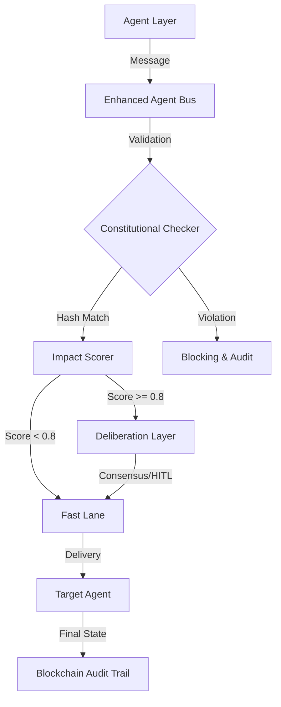
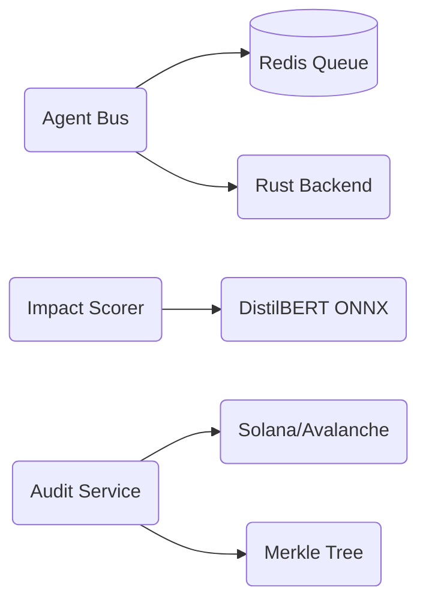

# 

[](https://github.com/ACGS-Project/ACGS-2/actions/workflows/tests.yml)
[](https://github.com/ACGS-Project/ACGS-2/actions/workflows/coverage.yml)
[](LICENSE)
[](https://www.python.org/)

# ACGS-2: Advanced Constitutional Governance System

ACGS-2 is a multi-agent bus platform engineered for high-security, high-compliance environments. It seamlessly fuses **Constitutional AI**, **Extreme Performance (Rust)**, and **Decentralized Auditability (Blockchain)**.

**Constitutional Hash (Mandatory)**: `cdd01ef066bc6cf2`

[中文文档](README.md) | [API Documentation](docs/api_reference.md) | [Architecture Guide](docs/architecture_diagram.md)

---

## 🏗️ Core Architecture

ACGS-2 implements a layered governance model to ensure every agent action adheres to predefined constitutional guidelines.



### Service Dependencies



---

## 🚀 Quick Start

### 1. Local Development

```bash
# Clone the repository
git clone https://github.com/ACGS-Project/ACGS-2.git && cd ACGS-2

# Install dependencies
pip install -e enhanced_agent_bus[dev]

# (Optional) Compile Rust extensions
cd enhanced_agent_bus/rust && cargo build --release && pip install -e .
```

### 2. Docker Compose Deployment

```bash
docker-compose up -d
```

### 3. Kubernetes Blue-Green Deployment

```bash
kubectl apply -f k8s/namespace.yml
kubectl apply -f k8s/blue-green-deployment.yml
```

---

## 🛠️ Technology Stack

- **Languages**: Python 3.11+, Rust (Stable)
- **AI**: Hugging Face (DistilBERT), ONNX Runtime
- **Infrastructure**: Kubernetes (Istio Service Mesh), Redis, Kafka
- **Security**: OPA (Open Policy Agent), ZKP (Zero Knowledge Proof)
- **Storage**: Solana (Main Audit Chain), PostgreSQL (Metadata)

---

## 📈 Performance Optimization

ACGS-2 is deeply optimized for large-scale agent collaboration:
- **Message Bus**: Rust-powered core reduces latency by 90%.
- **Impact Scorer**: Pre-integrated DistilBERT INT8 quantized model reduces memory footprint by 60%.
- **Traffic Routing**: Istio integration for zero-trust mTLS communication.

---

## 📖 Documentation Index

- [API Reference](docs/api/specs/) (OpenAPI Specs)
- [Deployment Guide](deployment_guide.md)
- [Architecture Decision Records (ADR)](docs/adr/)
- [Istio Service Mesh Configuration](docs/istio/)

---

## 🤝 Contribution & Support

For questions or suggestions, please open an [Issue](https://github.com/ACGS-Project/ACGS-2/issues) or join our [Discord](https://discord.gg/acgs-governance).

**MIT License** - Copyright (c) 2025 ACGS Project
