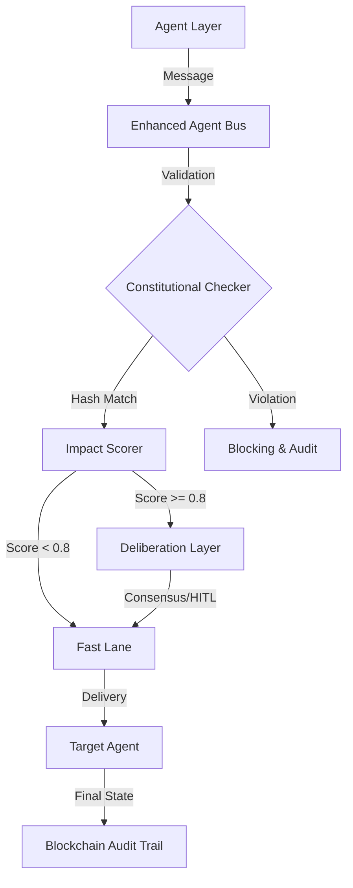

# ACGS-2

> **Constitutional Hash**: `cdd01ef066bc6cf2` > **Version**: 2.2.0
> **Status**: Verified
> **Last Updated**: 2025-12-21
> **Language**: CN

[](https://github.com/ACGS-Project/ACGS-2/actions/workflows/tests.yml)
[](https://github.com/ACGS-Project/ACGS-2/actions/workflows/coverage.yml)
[](LICENSE)
[](https://www.python.org/)

# ACGS-2: 高级宪法治理系统 (Autonomous Constitutional Governance System)

ACGS-2 是一个专为高安全性、高合规性环境打造的多代理总线系统。它将**人工智能治理 (Constitutional AI)**、**极致性能 (Rust)** 与 **去中心化审计 (Blockchain)** 完美融合。

[English README](README.en.md) | [API 文档](docs/api_reference.md) | [架构设计](docs/architecture_diagram.md)

---

## 🏗️ 核心架构

ACGS-2 采用分层治理模型，确保每个代理行为均符合预定义的宪法准则。



## 🚀 快速上手

### 1. 本地开发环境

```bash
# 克隆仓库
git clone https://github.com/ACGS-Project/ACGS-2.git && cd ACGS-2

# 安装依赖
pip install -e enhanced_agent_bus[dev]

# (可选) 编译 Rust 扩展
cd enhanced_agent_bus/rust && cargo build --release && pip install -e .
```

### 2. Docker Compose 部署

```bash
docker-compose up -d
```

### 3. Kubernetes 蓝绿部署

```bash
kubectl apply -f k8s/namespace.yml
kubectl apply -f k8s/blue-green-deployment.yml
```

---

## 🛠️ 技术栈

- **语言**: Python 3.11+, Rust (Stable)
- **AI**: Hugging Face (DistilBERT), ONNX Runtime
- **基础设施**: Kubernetes (Istio Service Mesh), Redis, Kafka
- **安全**: OPA (Open Policy Agent), ZKP (Zero Knowledge Proof)
- **存储**: Solana (主审计链), PostgreSQL (元数据)

---

## 📖 文档索引

- [API 参考](docs/api/specs/) (OpenAPI 规范)
- [部署指南](deployment_guide.md)
- [架构决策记录 (ADR)](docs/adr/)
- [Istio 服务网格配置](docs/istio/)

---

## 🤝 贡献与支持

如有问题或建议，请提交 [Issue](https://github.com/ACGS-Project/ACGS-2/issues) 或加入我们的 [Discord](https://discord.gg/acgs-governance)。

**MIT License** - Copyright (c) 2025 ACGS Project

---

### 🔗 Related Documentation

- [Project Index](PROJECT_INDEX.md)
- [Architecture Audit](docs/architecture_audit.md)
- [API Reference](docs/api_reference.md)
- [Deployment Portal](deployment_guide.md)
