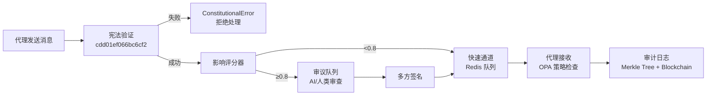

# 

[](https://github.com/ACGS-Project/ACGS-2/actions/workflows/tests.yml)
[](https://github.com/ACGS-Project/ACGS-2/actions/workflows/coverage.yml)
[](https://semgrep.dev/r/ACGS-2)
[](LICENSE)
[](https://www.python.org/)
[](https://www.rust-lang.org/)

# ACGS-2: Advanced Constitutional Governance System 2

**版本 v2.0.0-alpha**

> [!WARNING]  
> 此为**开发预览版**，不建议生产使用，可能存在重大变更。

ACGS-2 是一个增强型代理总线平台，内置宪法合规性、高性能消息传递、多租户隔离，以及 AI 驱动的高风险决策审议机制。

**宪法哈希**：`cdd01ef066bc6cf2` - **所有操作必需**。

[ACGS-1 →](https://github.com/ACGS-Project/ACGS-1) | [English README](README.en.md)

## ✨ 特性

- ✅ **宪法合规**：每条消息自动验证哈希，确保治理一致性
- 🚀 **高性能**：Rust 后端可选，提供 10-100x 吞吐提升
- 🔒 **多租户隔离**：`tenant_id` 严格隔离，GDPR 合规
- 🧠 **智能审议**：影响分数 ≥0.8 自动路由审议队列
- ☁️ **Kubernetes 原生**：蓝绿部署、零停机回滚
- 📊 **完整观测**：Prometheus + ELK 栈集成

## 🏗️ 架构概览



技术栈：Python, Rust, Redis, Kubernetes, OPA, Prometheus。

## 📋 先决条件

- Python 3.11+
- Redis 7+
- (可选) Rust, kubectl, Docker
- Kubernetes 集群 (部署用)

## 🚀 快速上手

### 1. 安装

```bash
git clone https://github.com/ACGS-Project/ACGS-2.git
cd ACGS-2
pip install -e enhanced_agent_bus[dev]
```

### 2. 启用 Rust 性能后端 (推荐)

```bash
cd enhanced_agent_bus/rust
cargo build --release
pip install -e .
```

### 3. 配置环境变量

```bash
export REDIS_URL="redis://localhost:6379"
export CONSTITUTIONAL_HASH="cdd01ef066bc6cf2"
export TENANT_ID="default-tenant"
```

### 4. Python 客户端示例

[`enhanced_agent_bus/examples/client_example.py`](enhanced_agent_bus/examples/client_example.py)

```python
import asyncio
from enhanced_agent_bus.core import get_agent_bus
from enhanced_agent_bus.models import AgentMessage

async def main():
    bus = get_agent_bus()
    await bus.start()
    
    # 注册代理
    await bus.register_agent("agent-001", "assistant", "default-tenant")
    
    # 发送消息
    msg = AgentMessage(
        from_agent="agent-001",
        to_agent="agent-002",
        content={"text": "Hello ACGS-2!"},
        constitutional_hash="cdd01ef066bc6cf2",
        tenant_id="default-tenant"
    )
    result = await bus.send_message(msg)
    print(f"成功: {result.is_valid}")
    
    await bus.stop()

asyncio.run(main())
```

### 5. 运行测试

```bash
pytest --cov=enhanced_agent_bus --cov-report=html
```

## ☁️ 部署

### Kubernetes (推荐)

```bash
kubectl apply -f k8s/namespace.yml
kubectl apply -f k8s/blue-green-deployment.yml
kubectl apply -f k8s/blue-green-service.yml k8s/blue-green-ingress.yml
```

**回滚**：
```bash
kubectl apply -f k8s/blue-green-rollback.yml
```

### 本地 Docker

使用 [`Dockerfile`](enhanced_agent_bus/Dockerfile)

## 🎥 演示


Swagger API 文档：[`docs/api_reference.md`](docs/api_reference.md)

## ⚙️ 配置详解

| 变量 | 默认值 | 描述 |
|------|--------|------|
| `REDIS_URL` | `redis://localhost:6379` | Redis 连接 |
| `CONSTITUTIONAL_HASH` | `cdd01ef066bc6cf2` | 宪法哈希 |
| `TENANT_ID` | `default` | 租户 ID |

完整配置：[`pyproject.toml`](pyproject.toml)

## 📁 项目结构

```
ACGS-2/
├── enhanced_agent_bus/     # 核心总线 (Python/Rust)
├── k8s/                   # Kubernetes 配置
├── docs/                  # 文档 & API
├── services/              # 微服务 (审计/策略)
├── testing/               # 测试套件
├── policies/              # Rego OPA 策略
└── scripts/               # 部署脚本
```

## ❓ 常见问题 (FAQ)

**Q: 宪法哈希不匹配如何处理？**

**A:** 确保**每条消息**包含 `constitutional_hash="cdd01ef066bc6cf2"`。验证失败将抛出 [`ConstitutionalError`](enhanced_agent_bus/exceptions.py)。

**Q: Rust 后端不可用？**

**A:** 自动回退 Python，无需修改代码。

**Q: 高影响消息超时？**

**A:** 默认 5-10 分钟，调整 `DELIBERATION_TIMEOUT`。

详见 [`AGENTS.md`](AGENTS.md)。

## 🗺️ 路线图

- [ ] Solana 区块链审计后端
- [ ] Avalanche 支持
- [ ] WebSocket 实时审议仪表盘
- [ ] v2.1: 动态政策注册

## 🤝 贡献指南

1. 🍴 **Fork** 本仓库
2. 🔀 **创建功能分支** (`git checkout -b feature/awesome`)
3. ✏️ **提交变更** (`git commit -m 'Add awesome feature'`)
4. 🚀 **推送分支** (`git push origin feature/awesome`)
5. 📤 **打开 PR** 并等待审查

参阅 [`CODE_OF_CONDUCT.md`](CODE_OF_CONDUCT.md)

## 🆘 支持与社区

- 🐛 [提交 Issue](https://github.com/ACGS-Project/ACGS-2/issues)
- 📢 [Twitter @ACGS_Project](https://twitter.com/ACGS_Project)
- 💬 [Discord](https://discord.gg/acgs-governance)
- 🔒 [安全报告](https://github.com/ACGS-Project/ACGS-2/security/advisories)
- ☕ [赞助我们](https://github.com/sponsors/acgs-org)

[CHANGELOG.md](CHANGELOG.md) | [用户指南](docs/user_guide.md)

## 👏 致谢

感谢 Redis、Python、Rust 开源社区，以及所有贡献者！

## 📚 引用 (BibTeX)

```
@misc{acgs2_2025,
  author = {ACGS Project},
  title = {ACGS-2: Advanced Constitutional Governance System 2},
  year = {2025},
  publisher = {GitHub},
  howpublished = {\url{https://github.com/ACGS-Project/ACGS-2}},
  note = {v2.0.0-alpha}
}
```

**MIT 许可证** - 详见 [`LICENSE`](LICENSE)