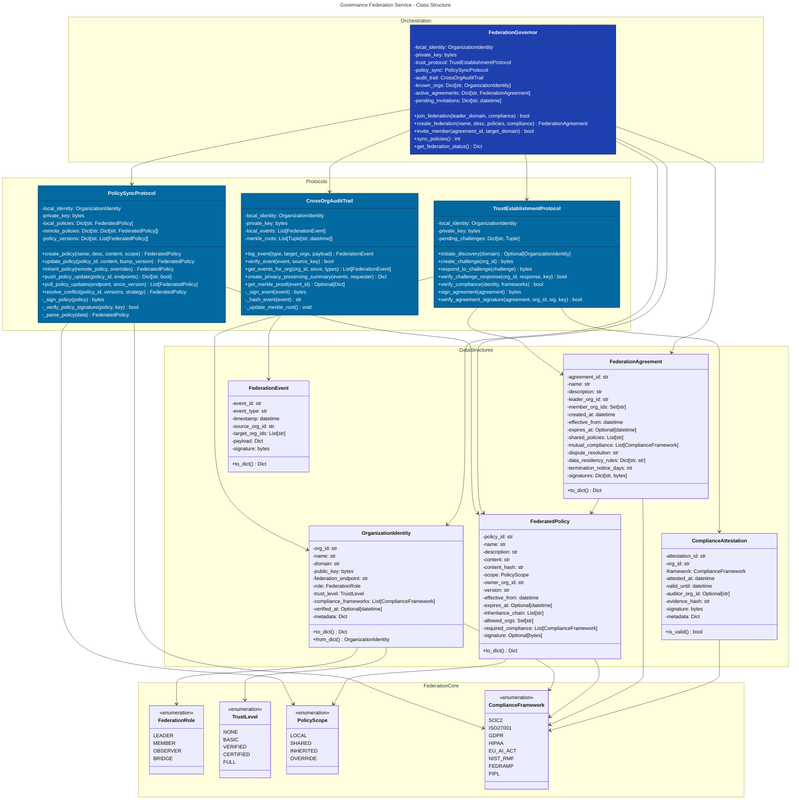
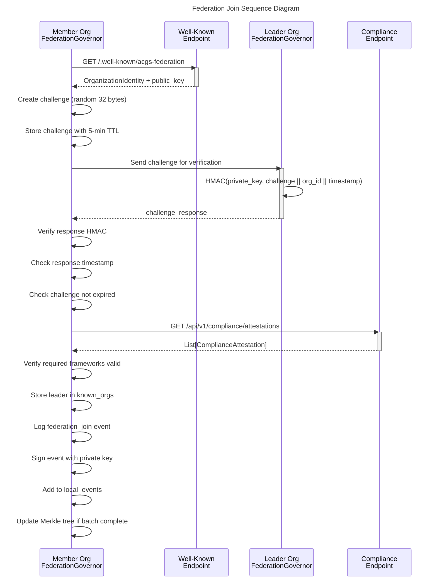
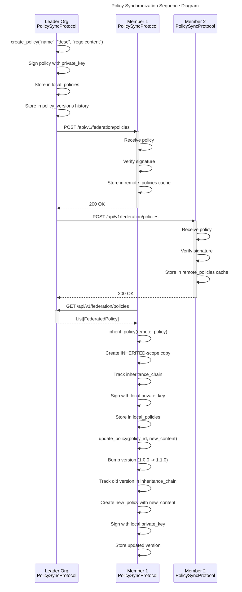

# C4 Code Level: Governance Federation Service

<!-- Constitutional Hash: cdd01ef066bc6cf2 -->

> Version: 1.0.0
> Phase: 5 - Next-Generation Governance
> Last Updated: 2026-01-03

## Overview

- **Name**: Cross-Organization Governance Federation Service
- **Description**: Implements federated governance across organizational boundaries, enabling shared governance policies, mutual compliance recognition, and cross-organization audit trails
- **Location**: `/home/dislove/document/acgs2/acgs2-core/services/governance_federation/`
- **Language**: Python 3.11+
- **Purpose**: Enable trusted federation relationships between organizations with constitutional compliance validation, policy synchronization, and distributed audit logging

## Module Structure

### Exports (__init__.py)

The module exports the following public API classes and enumerations:

```python
# Main Classes
FederationGovernor          # Orchestrator for federation governance
TrustEstablishmentProtocol  # Multi-phase trust establishment
PolicySyncProtocol          # Policy distribution and synchronization
CrossOrgAuditTrail          # Distributed event logging with Merkle verification

# Data Classes
OrganizationIdentity        # Organization metadata and credentials
FederatedPolicy             # Shared governance policy
FederationAgreement         # Bilateral/multilateral federation contract
ComplianceAttestation       # Organization compliance verification
FederationEvent             # Audit trail event

# Enumerations
FederationRole              # Member roles: LEADER, MEMBER, OBSERVER, BRIDGE
TrustLevel                  # Trust progression: NONE, BASIC, VERIFIED, CERTIFIED, FULL
PolicyScope                 # Policy visibility: LOCAL, SHARED, INHERITED, OVERRIDE
ComplianceFramework         # Supported standards: SOC2, ISO27001, GDPR, HIPAA, etc.
```

## Code Elements

### Enumerations

#### `FederationRole` (lines 41-47)
- **Purpose**: Defines roles within federation relationships
- **Members**:
  - `LEADER`: Federation initiator, sets base policies
  - `MEMBER`: Standard federation member
  - `OBSERVER`: Read-only access to shared policies
  - `BRIDGE`: Connects multiple federations

#### `TrustLevel` (lines 50-57)
- **Purpose**: Progressive trust establishment levels
- **Members** (integer values):
  - `NONE` (0): No trust established
  - `BASIC` (1): Basic identity verification
  - `VERIFIED` (2): Organization verified
  - `CERTIFIED` (3): Compliance certified
  - `FULL` (4): Full mutual trust

#### `PolicyScope` (lines 60-66)
- **Purpose**: Scope of policy visibility and applicability
- **Members**:
  - `LOCAL`: Organization-only policies
  - `SHARED`: Shared with federation members
  - `INHERITED`: Inherited from federation leader
  - `OVERRIDE`: Local override of inherited policies

#### `ComplianceFramework` (lines 69-79)
- **Purpose**: Supported compliance and regulatory frameworks
- **Members**:
  - `SOC2`, `ISO27001`, `GDPR`, `HIPAA`, `EU_AI_ACT`, `NIST_RMF`, `FEDRAMP`, `PIPL`

### Data Classes

#### `OrganizationIdentity` (lines 82-125)
- **Purpose**: Represents an organization's identity and credentials in the federation
- **Location**: `federation_protocol.py:82-125`

**Fields**:
- `org_id: str` - Unique organization identifier
- `name: str` - Organization name
- `domain: str` - Primary domain name
- `public_key: bytes` - Cryptographic public key for signature verification
- `federation_endpoint: str` - API endpoint for federation protocol
- `role: FederationRole` - Organization's role in federation
- `trust_level: TrustLevel` - Current trust level with local org
- `compliance_frameworks: List[ComplianceFramework]` - Supported compliance standards
- `verified_at: Optional[datetime]` - Timestamp of last verification
- `metadata: Dict[str, Any]` - Additional organization metadata

**Methods**:
- `to_dict() -> Dict[str, Any]` (lines 97-110)
  - Converts identity to dictionary with hex-encoded keys
  - Returns: Serializable representation with constitutional hash
  - Dependencies: Uses `CONSTITUTIONAL_HASH` constant

- `from_dict(data: Dict[str, Any]) -> OrganizationIdentity` (lines 112-125) [classmethod]
  - Reconstructs identity from dictionary
  - Parameters: Dictionary with hex-encoded public key
  - Returns: OrganizationIdentity instance
  - Dependencies: Reconstructs enumerations and datetime objects

#### `FederatedPolicy` (lines 128-165)
- **Purpose**: Represents a governance policy shared across federation
- **Location**: `federation_protocol.py:128-165`

**Fields**:
- `policy_id: str` - Unique policy identifier
- `name: str` - Human-readable policy name
- `description: str` - Policy description
- `content: str` - OPA Rego policy content
- `content_hash: str` - SHA256 hash of policy content
- `scope: PolicyScope` - Policy visibility scope
- `owner_org_id: str` - Organization that owns/published policy
- `version: str` - Semantic version (major.minor.patch)
- `effective_from: datetime` - When policy becomes effective
- `expires_at: Optional[datetime]` - Optional expiration time
- `inheritance_chain: List[str]` - Version history chain for inheritance tracking
- `allowed_orgs: Set[str]` - Organizations permitted to use policy
- `required_compliance: List[ComplianceFramework]` - Compliance prerequisites
- `signature: Optional[bytes]` - HMAC signature for policy authenticity

**Methods**:
- `to_dict() -> Dict[str, Any]` (lines 147-164)
  - Serializes policy to dictionary format
  - Converts enums to string values and bytes to hex
  - Returns: Dictionary with constitutional hash

#### `FederationAgreement` (lines 167-203)
- **Purpose**: Represents bilateral/multilateral federation contract
- **Location**: `federation_protocol.py:167-203`

**Fields**:
- `agreement_id: str` - Unique agreement identifier
- `name: str` - Agreement name
- `description: str` - Agreement description
- `leader_org_id: str` - Federation leader organization ID
- `member_org_ids: Set[str]` - Member organization IDs
- `created_at: datetime` - Creation timestamp
- `effective_from: datetime` - Effective start date
- `expires_at: Optional[datetime]` - Optional expiration date
- `shared_policies: List[str]` - Policy IDs shared in federation
- `mutual_compliance: List[ComplianceFramework]` - Required compliance frameworks
- `dispute_resolution: str` - Dispute resolution mechanism
- `data_residency_rules: Dict[str, str]` - Data residency constraints by region
- `termination_notice_days: int` - Days notice for termination (default: 30)
- `signatures: Dict[str, bytes]` - Organization signatures keyed by org_id

**Methods**:
- `to_dict() -> Dict[str, Any]` (lines 186-203)
  - Serializes agreement to dictionary
  - Returns: Dictionary with constitutional hash

#### `ComplianceAttestation` (lines 206-221)
- **Purpose**: Verifiable attestation of compliance from federation member
- **Location**: `federation_protocol.py:206-221`

**Fields**:
- `attestation_id: str` - Unique attestation identifier
- `org_id: str` - Organization providing attestation
- `framework: ComplianceFramework` - Compliance framework attested to
- `attested_at: datetime` - Attestation timestamp
- `valid_until: datetime` - Attestation validity period end
- `auditor_org_id: Optional[str]` - Auditor organization if third-party
- `evidence_hash: str` - Hash of supporting evidence
- `signature: bytes` - Cryptographic signature
- `metadata: Dict[str, Any]` - Additional attestation metadata

**Methods**:
- `is_valid() -> bool` (lines 220-221)
  - Checks if attestation is currently valid
  - Returns: `True` if current time < `valid_until`
  - Dependencies: Uses `datetime.now(timezone.utc)`

#### `FederationEvent` (lines 224-246)
- **Purpose**: Represents an event in federation audit trail
- **Location**: `federation_protocol.py:224-246`

**Fields**:
- `event_id: str` - Unique event identifier
- `event_type: str` - Type of event (e.g., "federation_join", "policy_update")
- `timestamp: datetime` - When event occurred
- `source_org_id: str` - Organization that initiated event
- `target_org_ids: List[str]` - Organizations affected by event
- `payload: Dict[str, Any]` - Event-specific data
- `signature: bytes` - HMAC signature for authenticity

**Methods**:
- `to_dict() -> Dict[str, Any]` (lines 236-246)
  - Serializes event to dictionary
  - Returns: Dictionary with constitutional hash

### Protocol Classes

#### `TrustEstablishmentProtocol` (lines 249-427)
- **Purpose**: Multi-phase handshake for establishing trust between organizations
- **Location**: `federation_protocol.py:249-427`

**Trust Establishment Phases**:
1. **Discovery** - Find and verify organization endpoints
2. **Challenge-Response** - Prove identity ownership
3. **Compliance Verification** - Verify required certifications
4. **Agreement Signing** - Sign federation agreement

**Initialization**:
```python
def __init__(self, local_identity: OrganizationIdentity, private_key: bytes)
```
- Parameters:
  - `local_identity`: Local organization's identity
  - `private_key`: Local organization's private key (32 bytes)
- Instance Variables:
  - `local_identity`: Stored identity reference
  - `private_key`: Stored for signing operations
  - `pending_challenges: Dict[str, Tuple[bytes, datetime]]`: Active challenges with timestamps
- Logging: Initializes logger with org_id

**Methods**:

1. `async initiate_discovery(target_domain: str) -> Optional[OrganizationIdentity]` (lines 269-292)
   - **Phase 1**: Discover target organization's identity
   - Uses well-known endpoint: `https://{domain}/.well-known/acgs-federation`
   - Returns: OrganizationIdentity or None if discovery fails
   - Timeout: 30 seconds
   - Dependencies: `aiohttp.ClientSession`, `OrganizationIdentity.from_dict()`
   - Logging: Info on success, warning on failure

2. `def create_challenge(target_org_id: str) -> bytes` (lines 294-304)
   - **Phase 2a**: Create cryptographic challenge for target
   - Generates: 32-byte random challenge via `secrets.token_bytes(32)`
   - Stores: Challenge with timestamp in `pending_challenges`
   - Returns: Challenge bytes
   - Validity: `CHALLENGE_VALIDITY_SECONDS` (300 seconds = 5 minutes)

3. `def respond_to_challenge(challenge: bytes) -> bytes` (lines 306-317)
   - **Phase 2b**: Create response to challenge
   - Creates: HMAC(private_key, challenge || org_id || timestamp)
   - Returns: Response signature + timestamp (40 bytes total: 32 + 8)
   - Algorithm: SHA256 HMAC with local private key

4. `def verify_challenge_response(target_org_id: str, response: bytes, target_public_key: bytes) -> bool` (lines 319-358)
   - **Phase 2c**: Verify challenge response from target
   - Validates: Challenge exists, not expired, signature matches
   - Returns: Boolean success/failure
   - Parameters:
     - `target_org_id`: Organization being verified
     - `response`: Response bytes (40 bytes: 32 signature + 8 timestamp)
     - `target_public_key`: Target's public key for verification
   - Checks:
     - Challenge exists in `pending_challenges`
     - Challenge not older than `CHALLENGE_VALIDITY_SECONDS`
     - Response timestamp within validity range
     - HMAC signature matches expected value
   - Side Effect: Removes verified challenge from pending

5. `async verify_compliance(target_identity: OrganizationIdentity, required_frameworks: List[ComplianceFramework]) -> bool` (lines 360-397)
   - **Phase 3**: Verify target's compliance certifications
   - Endpoint: `{federation_endpoint}/api/v1/compliance/attestations`
   - Parameters:
     - `target_identity`: Organization to verify
     - `required_frameworks`: Required compliance frameworks
   - Returns: True if all required frameworks are valid
   - Algorithm: Fetches attestations, checks validity dates, verifies required set
   - Timeout: 30 seconds

6. `def sign_agreement(agreement: FederationAgreement) -> bytes` (lines 399-410)
   - **Phase 4a**: Sign federation agreement
   - Creates: Canonical JSON representation
   - Signature: HMAC(private_key, agreement_bytes)
   - Returns: 32-byte HMAC signature
   - Side Effect: Logs agreement signature

7. `def verify_agreement_signature(agreement: FederationAgreement, org_id: str, signature: bytes, public_key: bytes) -> bool` (lines 412-426)
   - **Phase 4b**: Verify organization's signature on agreement
   - Reconstructs: Agreement without signatures
   - Algorithm: Compares HMAC against expected value
   - Returns: Boolean match result
   - Security: Uses `hmac.compare_digest()` for timing-safe comparison

#### `PolicySyncProtocol` (lines 429-717)
- **Purpose**: Synchronize governance policies across federation
- **Location**: `federation_protocol.py:429-717`
- **Functionality**:
  - Push-based policy distribution from leader
  - Pull-based policy updates from members
  - Conflict resolution for policy overrides
  - Version control and rollback support

**Initialization**:
```python
def __init__(self, local_identity: OrganizationIdentity, private_key: bytes)
```
- Instance Variables:
  - `local_identity`: Local organization identity
  - `private_key`: For signing policies
  - `local_policies: Dict[str, FederatedPolicy]`: Current policy store
  - `remote_policies: Dict[str, Dict[str, FederatedPolicy]]`: Cache of remote org policies
  - `policy_versions: Dict[str, List[FederatedPolicy]]`: Version history per policy_id

**Methods**:

1. `def create_policy(name: str, description: str, content: str, scope: PolicyScope, allowed_orgs: Set[str] = None, required_compliance: List[ComplianceFramework] = None) -> FederatedPolicy` (lines 449-480)
   - Creates new federated policy
   - Generates: policy_id from `secrets.token_hex(8)`, content_hash from SHA256
   - Returns: New FederatedPolicy with signature
   - Side Effects: Stores in `local_policies` and `policy_versions`
   - Scope: Applies to policy visibility
   - Version: Initialized to "1.0.0"

2. `def update_policy(policy_id: str, content: str, bump_version: str = "patch") -> FederatedPolicy` (lines 482-528)
   - Updates existing policy content
   - Parameters:
     - `policy_id`: Policy to update
     - `content`: New policy content
     - `bump_version`: "major", "minor", or "patch" (default)
   - Algorithm:
     - Bumps semantic version
     - Creates new FederatedPolicy with updated content
     - Tracks previous versions in `inheritance_chain`
   - Returns: New FederatedPolicy version
   - Raises: ValueError if policy not found
   - Side Effects: Updates `local_policies` and `policy_versions`

3. `def inherit_policy(remote_policy: FederatedPolicy, local_overrides: Optional[str] = None) -> FederatedPolicy` (lines 530-570)
   - Inherit policy from another federation member
   - Parameters:
     - `remote_policy`: Policy to inherit
     - `local_overrides`: Optional local content override
   - Returns: FederatedPolicy as local copy
   - Logic:
     - If overrides provided: Creates OVERRIDE-scoped policy with local content
     - If no overrides: Creates INHERITED-scoped policy with remote content
     - Tracks inheritance chain with remote owner:version info
   - Side Effects: Stores in `local_policies` and `policy_versions`

4. `async push_policy_update(policy_id: str, target_endpoints: List[str]) -> Dict[str, bool]` (lines 572-600)
   - Push policy update to federation members
   - Parameters:
     - `policy_id`: Policy to push
     - `target_endpoints`: Federation endpoints to push to
   - Endpoint: `{endpoint}/api/v1/federation/policies` (POST)
   - Returns: Dictionary of endpoint -> success status
   - Side Effects: Logs success count
   - Error Handling: Catches exceptions, returns False for failures
   - Timeout: 30 seconds per endpoint

5. `async pull_policy_updates(source_endpoint: str, since_version: Optional[str] = None) -> List[FederatedPolicy]` (lines 602-636)
   - Pull policy updates from federation member
   - Endpoint: `{source_endpoint}/api/v1/federation/policies` (GET)
   - Query: Optional `since_version` parameter
   - Returns: List of verified FederatedPolicy objects
   - Algorithm:
     - Fetches policies from remote
     - Verifies each policy's signature
     - Stores in `remote_policies` cache
   - Timeout: 30 seconds

6. `def resolve_conflict(policy_id: str, versions: List[FederatedPolicy], resolution_strategy: str = "latest") -> FederatedPolicy` (lines 638-671)
   - Resolve conflicts between policy versions
   - Parameters:
     - `policy_id`: Policy ID (informational)
     - `versions`: List of conflicting versions
     - `resolution_strategy`: "latest", "leader", or "merge" (default: "latest")
   - Returns: Winning FederatedPolicy version
   - Strategies:
     - `latest`: Most recent by effective_from timestamp
     - `leader`: Leader organization's version
     - `merge`: Placeholder for semantic merge (not implemented)
   - Raises: ValueError if no versions provided or strategy invalid

7. `def _sign_policy(policy: FederatedPolicy) -> bytes` (lines 673-679) [private]
   - Signs policy with local private key
   - Algorithm: HMAC(private_key, canonical_json)
   - Excludes: Existing signature from canonical representation
   - Returns: 32-byte HMAC signature

8. `def _verify_policy_signature(policy: FederatedPolicy, owner_public_key: Optional[str]) -> bool` (lines 681-697) [private]
   - Verifies policy's cryptographic signature
   - Parameters:
     - `policy`: Policy object to verify
     - `owner_public_key`: Hex-encoded public key
   - Returns: Boolean verification result
   - Security: Uses `hmac.compare_digest()` for timing-safe comparison

9. `def _parse_policy(data: Dict[str, Any]) -> FederatedPolicy` (lines 699-716) [private]
   - Reconstructs FederatedPolicy from dictionary
   - Parameters: Dictionary from API response
   - Returns: FederatedPolicy instance
   - Dependencies: Reconstructs enumerations, datetime, bytes

#### `CrossOrgAuditTrail` (lines 719-911)
- **Purpose**: Distributed event logging with cryptographic proof
- **Location**: `federation_protocol.py:719-911`
- **Features**:
  - Distributed event logging across organizations
  - Merkle tree verification for proof-of-inclusion
  - Privacy-preserving summaries for other organizations
  - Cross-organization event correlation

**Initialization**:
```python
def __init__(self, local_identity: OrganizationIdentity, private_key: bytes)
```
- Instance Variables:
  - `local_identity`: Local organization identity
  - `private_key`: For signing events
  - `local_events: List[FederationEvent]`: Complete event history
  - `merkle_roots: List[Tuple[str, datetime]]`: Merkle roots at batch boundaries

**Methods**:

1. `def log_event(event_type: str, target_org_ids: List[str], payload: Dict[str, Any]) -> FederationEvent` (lines 738-768)
   - Log federation event to audit trail
   - Parameters:
     - `event_type`: Type of event (e.g., "federation_join")
     - `target_org_ids`: Organizations affected by event
     - `payload`: Event-specific data dictionary
   - Returns: Created FederationEvent
   - Algorithm:
     - Generates event_id from `secrets.token_hex(12)`
     - Signs event with local private key
     - Stores in `local_events`
     - Updates Merkle root every 100 events
   - Side Effects: Appends to `local_events`, may update `merkle_roots`

2. `def verify_event(event: FederationEvent, source_public_key: bytes) -> bool` (lines 770-780)
   - Verify event's cryptographic signature
   - Parameters:
     - `event`: Event to verify
     - `source_public_key`: Source organization's public key
   - Returns: Boolean verification result
   - Algorithm: HMAC signature verification with timing-safe comparison

3. `def get_events_for_org(org_id: str, since: Optional[datetime] = None, event_types: Optional[List[str]] = None) -> List[FederationEvent]` (lines 782-805)
   - Retrieve events relevant to specific organization
   - Parameters:
     - `org_id`: Organization to filter for
     - `since`: Optional time filter (inclusive)
     - `event_types`: Optional event type filter
   - Returns: Filtered list of FederationEvent objects
   - Filtering:
     - Org is source OR in target_org_ids
     - Timestamp >= since
     - event_type in event_types (if specified)

4. `def create_privacy_preserving_summary(events: List[FederationEvent], requesting_org_id: str) -> Dict[str, Any]` (lines 807-831)
   - Create privacy-preserving summary of events for another organization
   - Parameters:
     - `events`: Events to summarize
     - `requesting_org_id`: Organization requesting summary
   - Returns: Dictionary with aggregated data
   - Includes:
     - Period start/end timestamps
     - Total event count
     - Event counts by type
     - Count of events involving requester
     - Constitutional hash
   - Security: Redacts sensitive information, provides only aggregates

5. `def get_merkle_proof(event_id: str) -> Optional[Dict[str, Any]]` (lines 833-866)
   - Get Merkle proof for event's inclusion in audit trail
   - Parameters:
     - `event_id`: Event to get proof for
   - Returns: Dictionary with proof components or None
   - Returns None if:
     - Event not found
     - Event not yet in committed batch
   - Includes:
     - Event ID and hash
     - Merkle root and timestamp
     - Batch index and position
     - Constitutional hash
   - Algorithm: Simplified Merkle proof (real impl would include full path)

6. `def _sign_event(event: FederationEvent) -> bytes` (lines 868-874) [private]
   - Sign event with local private key
   - Algorithm: HMAC(private_key, canonical_json)
   - Returns: 32-byte HMAC signature

7. `def _hash_event(event: FederationEvent) -> str` (lines 876-879) [private]
   - Compute SHA256 hash of event
   - Returns: Hex-encoded SHA256 hash

8. `def _update_merkle_root()` (lines 881-910) [private]
   - Update Merkle root with recent events
   - Called every 100 events
   - Algorithm:
     - Takes events in batch (100 at a time)
     - Computes leaf hashes
     - Pads to power of 2 (128)
     - Builds binary Merkle tree bottom-up
   - Side Effect: Appends (root_hash, timestamp) to `merkle_roots`

### Orchestrator Class

#### `FederationGovernor` (lines 913-1089)
- **Purpose**: Main federation governance coordinator
- **Location**: `federation_protocol.py:913-1089`
- **Role**: Orchestrates trust, policies, and audit trails across federation

**Initialization**:
```python
def __init__(self, local_identity: OrganizationIdentity, private_key: bytes)
```
- Instance Variables:
  - `local_identity`: Local organization identity
  - `private_key`: Local private key
  - `trust_protocol: TrustEstablishmentProtocol`: Trust sub-protocol
  - `policy_sync: PolicySyncProtocol`: Policy sync sub-protocol
  - `audit_trail: CrossOrgAuditTrail`: Audit trail sub-protocol
  - `known_orgs: Dict[str, OrganizationIdentity]`: Discovered organizations
  - `active_agreements: Dict[str, FederationAgreement]`: Active federation agreements
  - `pending_invitations: Dict[str, datetime]`: Pending member invitations

**Methods**:

1. `async join_federation(leader_domain: str, required_compliance: List[ComplianceFramework]) -> bool` (lines 937-972)
   - Join existing federation as member
   - Parameters:
     - `leader_domain`: Federation leader's domain
     - `required_compliance`: Compliance frameworks to verify
   - Returns: Boolean success
   - Algorithm:
     1. Discover leader via `trust_protocol.initiate_discovery()`
     2. Create challenge for identity verification
     3. Verify leader's compliance via `trust_protocol.verify_compliance()`
     4. Store leader in `known_orgs`
     5. Log join event
   - Side Effects: Updates `known_orgs`, logs audit event
   - Logging: Error if discovery or compliance fails

2. `async create_federation(name: str, description: str, initial_policies: List[FederatedPolicy], compliance_requirements: List[ComplianceFramework]) -> FederationAgreement` (lines 974-1017)
   - Create new federation as leader
   - Parameters:
     - `name`: Federation name
     - `description`: Federation description
     - `initial_policies`: Policies to share
     - `compliance_requirements`: Required compliance frameworks
   - Returns: Created FederationAgreement
   - Algorithm:
     1. Generate agreement_id from `secrets.token_hex(8)`
     2. Create FederationAgreement with leader as member
     3. Sign agreement with private key
     4. Store in `active_agreements`
     5. Log creation event
   - Side Effects: Updates `active_agreements`, logs audit event
   - Effective From: Current timestamp
   - Expires At: None (indefinite)

3. `async invite_member(agreement_id: str, target_domain: str) -> bool` (lines 1019-1049)
   - Invite organization to join federation
   - Parameters:
     - `agreement_id`: Agreement to join
     - `target_domain`: Target organization's domain
   - Returns: Boolean success
   - Algorithm:
     1. Validate agreement exists
     2. Discover target via `trust_protocol.initiate_discovery()`
     3. Generate invitation_id
     4. Store invitation with timestamp
     5. Log invitation event
   - Side Effects: Updates `pending_invitations`, logs audit event
   - Raises: ValueError if agreement not found

4. `async sync_policies() -> int` (lines 1051-1071)
   - Synchronize policies with all federation members
   - Returns: Count of synced policies
   - Algorithm:
     - Iterates over `known_orgs` (except local org)
     - Pulls policy updates via `policy_sync.pull_policy_updates()`
     - Accumulates synced count
   - Error Handling: Logs errors per org, continues with others
   - Side Effects: Updates `policy_sync.remote_policies` cache

5. `def get_federation_status() -> Dict[str, Any]` (lines 1073-1088)
   - Get current federation status and metrics
   - Returns: Status dictionary with:
     - Local organization info (id, name)
     - Role and trust level
     - Known organizations count
     - Active agreements count
     - Local policies count
     - Audit events count
     - Merkle roots count
     - Constitutional hash
   - Use Case: Monitoring and diagnostics

## Dependencies

### Internal Dependencies

- **Core ACGS-2 Services**:
  - Constitutional compliance validation via `CONSTITUTIONAL_HASH` constant
  - Integration with other governance services for policy enforcement
  - Audit trail integration for cross-service compliance logging

### External Dependencies

- **Cryptography**:
  - `hashlib`: SHA256 hashing for content and policy hashes
  - `hmac`: HMAC-SHA256 for challenge-response and signatures
  - `secrets`: Cryptographically secure random number generation

- **Async/HTTP**:
  - `aiohttp.ClientSession`: Async HTTP client for federation endpoints
  - Timeouts: 30 seconds for all HTTP operations

- **Data Structures**:
  - `dataclasses`: Pydantic-free data class definitions
  - `enum.Enum`: Enumeration types for roles and scopes
  - `typing`: Type hints for Python 3.11+ compatibility

- **Standard Library**:
  - `datetime`, `timezone`: Time-aware datetime operations
  - `json`: Serialization for canonical representations
  - `logging`: Structured logging throughout
  - `time`: Unix timestamp operations for challenge validity

## Key Architectural Patterns

### Multi-Phase Trust Protocol

The `TrustEstablishmentProtocol` implements a cryptographically secure four-phase handshake:

1. **Discovery**: Fetch organization identity from well-known endpoint
2. **Challenge-Response**: Prove identity ownership via HMAC signing
3. **Compliance Verification**: Verify required compliance certifications
4. **Agreement Signing**: Sign federation contract with private key

**Security Features**:
- Challenge expiration (5 minutes)
- Timing-safe signature comparison with `hmac.compare_digest()`
- Canonical JSON serialization for signature consistency
- Challenge-response prevents replay attacks

### Policy Distribution Model

The `PolicySyncProtocol` supports multiple policy distribution patterns:

- **Push-based**: Leader pushes policies to members
- **Pull-based**: Members pull latest policies from leader
- **Inheritance**: Members inherit and optionally override policies
- **Version Control**: Semantic versioning with full history tracking
- **Conflict Resolution**: Multiple strategies (latest, leader, merge)

**Version Tracking**:
- Policies maintain semantic versions (major.minor.patch)
- Inheritance chain tracks policy ancestry
- Policy versions stored for rollback capability

### Distributed Audit Trail

The `CrossOrgAuditTrail` provides cryptographic proof of federation events:

- **Event Logging**: All federation events signed and timestamped
- **Merkle Trees**: Batches of 100 events committed to Merkle roots
- **Proof-of-Inclusion**: Merkle proofs verify event authenticity
- **Privacy Preservation**: Aggregated summaries for external orgs
- **Correlation**: Events linked to source and target organizations

**Merkle Tree Implementation**:
- Batches of 100 events per root
- Padded to 128 leaves (next power of 2)
- Binary tree structure with SHA256 leaf hashes
- Root updates trigger automatically

## Integration Points

### Federation Endpoints

Each organization exposes federation API endpoints:

**Well-Known Discovery**:
```
GET https://{domain}/.well-known/acgs-federation
Response: OrganizationIdentity JSON with public key
```

**Compliance Attestations**:
```
GET {federation_endpoint}/api/v1/compliance/attestations
Response: List of ComplianceAttestation objects with validity
```

**Policy Distribution**:
```
GET/POST {federation_endpoint}/api/v1/federation/policies
GET: Fetch policies (optionally since version)
POST: Receive policy updates
Request/Response: FederatedPolicy serialized JSON
```

### Constitutional Compliance Integration

- All data structures include `constitutional_hash` field
- Policies can require specific compliance frameworks
- Agreements enforce mutual compliance recognition
- Attestations provide proof of compliance status
- Events logged for governance audit trails

### Event Logging Integration

Federation events integrate with ACGS-2 audit infrastructure:

- **Event Types**: `federation_join`, `federation_create`, `federation_invite`, `policy_update`
- **Cross-Org Correlation**: Events link source and target organizations
- **Merkle Verification**: Cryptographic proof of event inclusion
- **Privacy-Preserving Summaries**: Aggregated data for external parties

## Data Flow Patterns

### Federation Join Flow

```
1. Calling org discovers federation leader
   └─> GET /.well-known/acgs-federation

2. Leader creates challenge for calling org
   └─> Challenge stored with 5-minute validity

3. Calling org responds to challenge
   └─> HMAC(private_key, challenge || org_id || timestamp)

4. Leader verifies challenge response
   └─> Validates timestamp, verifies HMAC signature

5. Leader verifies calling org's compliance
   └─> GET /api/v1/compliance/attestations
       Check required frameworks are valid

6. Federation join event logged
   └─> Signed and Merkle-hashed for audit proof
```

### Policy Synchronization Flow

```
1. Leader creates policy
   └─> PolicySyncProtocol.create_policy()
       Returns signed FederatedPolicy

2. Leader pushes to members
   └─> POST /api/v1/federation/policies
       Async push to all member endpoints

3. Members pull policy updates
   └─> GET /api/v1/federation/policies?since_version=X
       Verify signature, store in remote cache

4. Member inherits policy
   └─> PolicySyncProtocol.inherit_policy()
       Optional local override scope

5. Conflict detected (multiple versions)
   └─> PolicySyncProtocol.resolve_conflict()
       Apply resolution strategy (latest/leader/merge)
```

## Relationship Diagrams

### Class Relationships



### Federation Sequence Diagram



### Policy Synchronization Sequence Diagram



## Security Considerations

### Cryptographic Security

- **HMAC-SHA256**: All signatures use HMAC with SHA256
- **Challenge-Response**: 32-byte random challenges prevent replay attacks
- **Timing-Safe Comparison**: `hmac.compare_digest()` prevents timing attacks
- **Canonical Serialization**: JSON with sorted keys ensures signature consistency

### Trust Establishment

- **Multi-Phase Handshake**: Four-phase process prevents shortcuts
- **Challenge Expiration**: 5-minute TTL on challenges
- **Compliance Verification**: Mandatory compliance attestation checks
- **Public Key Exchange**: via well-known endpoints with TLS

### Policy Integrity

- **Policy Signatures**: All policies signed with owner's private key
- **Version Control**: Full history tracking prevents unauthorized rollback
- **Inheritance Chain**: Transparent ancestry tracking
- **Content Hashing**: SHA256 hashing detects tampering

### Audit Trail Security

- **Event Signing**: All events signed with source org's private key
- **Merkle Tree Verification**: Cryptographic proof of event inclusion
- **Immutable History**: Events append-only with Merkle commitments
- **Privacy Preservation**: Aggregated summaries for external parties

## Notes

- **Async Operations**: All HTTP operations are async (aiohttp) for performance
- **Error Handling**: Comprehensive logging, exceptions only for validation failures
- **Timeout Strategy**: 30-second timeouts on all HTTP operations
- **Constitutional Integration**: All data structures include constitutional hash
- **Backward Compatibility**: Semantic versioning supports policy evolution
- **Extensibility**: ComplianceFramework enum can be extended for new standards
- **Data Residency**: Supports regional data constraints in federation agreements

## File Structure

```
/home/dislove/document/acgs2/acgs2-core/services/governance_federation/
├── __init__.py (42 lines)
│   └── Exports all public classes and enums
└── federation_protocol.py (1,108 lines)
    ├── Enumerations (FederationRole, TrustLevel, PolicyScope, ComplianceFramework)
    ├── Data Classes (OrganizationIdentity, FederatedPolicy, FederationAgreement, etc.)
    ├── Protocol Classes (TrustEstablishmentProtocol, PolicySyncProtocol, CrossOrgAuditTrail)
    └── Orchestrator (FederationGovernor)
```

## Constants

- **CONSTITUTIONAL_HASH**: `"cdd01ef066bc6cf2"` - Constitutional compliance validation hash
- **CHALLENGE_VALIDITY_SECONDS**: 300 (5 minutes) - Challenge expiration time
- **MERKLE_BATCH_SIZE**: 100 - Events per Merkle root commitment
- **MERKLE_TREE_HEIGHT**: 7 - Power of 2 padding (128 leaves)
- **HTTP_TIMEOUT**: 30 seconds - Timeout for all federation endpoint calls

## API Contract

### Well-Known Endpoint
```
GET https://{domain}/.well-known/acgs-federation
Response: OrganizationIdentity.to_dict() as JSON
Status: 200 on success, 404/5xx on failure
```

### Compliance Attestations
```
GET {federation_endpoint}/api/v1/compliance/attestations
Response: {"attestations": [ComplianceAttestation.to_dict()]}
Status: 200 on success
```

### Policy Distribution
```
GET {federation_endpoint}/api/v1/federation/policies?since_version=X
Response: {"policies": [FederatedPolicy.to_dict()]}
Status: 200 on success

POST {federation_endpoint}/api/v1/federation/policies
Request Body: FederatedPolicy.to_dict() as JSON
Response: {"status": "accepted"} or error
Status: 200 on success
```

---

**Documentation Generated**: 2026-01-03
**Constitutional Hash**: cdd01ef066bc6cf2
**Service Phase**: 5 - Next-Generation Governance
