# C4 Code Level: Orchestration and Execution

## Overview

- **Name**: Orchestration and Execution Layer
- **Description**: Core orchestration and execution components for ACGS-2 Enhanced Agent Bus, handling message routing, workflow orchestration, task decomposition, recovery coordination, and multi-agent communication patterns.
- **Location**: `/home/dislove/document/acgs2/acgs2-core/enhanced_agent_bus/`
- **Language**: Python 3.11+ with optional Rust backend
- **Purpose**: Provide production-grade orchestration for constitutional AI governance with sub-5ms P99 latency, fault tolerance, recovery coordination, and comprehensive metrics instrumentation.
- **Constitutional Hash**: `cdd01ef066bc6cf2`

## Architecture Overview

The orchestration layer implements a multi-layered execution model supporting:

1. **Message Bus Orchestration** - Agent communication with constitutional validation
2. **Workflow Orchestration** - Saga pattern with LIFO compensation and DAG execution
3. **Recovery Orchestration** - Automated service recovery with priority queues
4. **Deliberation Layer** - AI-powered review for high-impact decisions
5. **Processing Strategies** - Pluggable validation and processing (Static/Dynamic/OPA/Rust)

## Core Code Elements

### 1. Enhanced Agent Bus (`agent_bus.py`)

**Class**: `EnhancedAgentBus`
- **Location**: `/home/dislove/document/acgs2/acgs2-core/enhanced_agent_bus/agent_bus.py:118-926`
- **Type**: Primary orchestration class
- **Purpose**: Main agent communication bus with constitutional compliance, multi-tenant isolation, and comprehensive metrics

**Key Methods**:

- `__init__(redis_url, use_dynamic_policy, enable_maci, ...)`: Initialize bus with dependency injection support
  - **Location**: Lines 142-258
  - **Parameters**:
    - `redis_url: str` - Redis connection URL for message queuing
    - `use_dynamic_policy: bool` - Use dynamic policy registry
    - `policy_fail_closed: bool` - Fail closed on policy errors
    - `use_kafka: bool` - Use Kafka as event bus
    - `registry: Optional[AgentRegistry]` - Custom registry implementation
    - `router: Optional[MessageRouter]` - Custom message router
    - `validator: Optional[ValidationStrategy]` - Custom validator
    - `processor: Optional[MessageProcessor]` - Custom message processor
    - `use_rust: bool` - Prefer Rust backend
    - `enable_maci: bool` - Enable MACI role separation
    - `maci_strict_mode: bool` - Fail-closed on MACI errors
  - **Returns**: None
  - **Dependencies**: MeteringManager, PolicyClient, AuditClient, MACIRoleRegistry

- `async start()`: Start the bus and all sub-systems
  - **Location**: Lines 362-400
  - **Purpose**: Initialize all async components and start message processing
  - **Dependencies**: MessageProcessor, CircuitBreaker, Kafka (if enabled)

- `async register_agent(agent_id, agent_type, maci_role)`: Register agent for communication
  - **Location**: Lines 422-494
  - **Parameters**:
    - `agent_id: str` - Unique agent identifier
    - `agent_type: str` - Type of agent (executive/legislative/judicial)
    - `maci_role: Optional[MACIRole]` - Role for MACI enforcement
  - **Returns**: `bool` - Success status
  - **Dependencies**: MACIRegistry, AgentRegistry

- `async send_message(message: AgentMessage) -> ValidationResult`: Send message with constitutional validation
  - **Location**: Lines 566-623
  - **Purpose**: Orchestrate message validation, deliberation, routing, and delivery
  - **Parameters**: `message: AgentMessage` - Message to send
  - **Returns**: `ValidationResult` - Validation outcome
  - **Key Sub-steps**:
    1. Validate message format and constitutional hash
    2. Check if deliberation required (high-impact messages)
    3. Route through deliberation layer if needed
    4. Deliver to target agents via router
    5. Log to audit trail
  - **Dependencies**: MessageProcessor, DeliberationLayer, Router, AuditClient

- `async receive_message(timeout: float) -> Optional[AgentMessage]`: Receive next message from queue
  - **Location**: Lines 746-763
  - **Parameters**: `timeout: float` - Wait timeout in seconds
  - **Returns**: Next message or None on timeout
  - **Dependencies**: Message queue (asyncio.Queue or Kafka)

- `async broadcast_message(message: AgentMessage)`: Send message to all registered agents
  - **Location**: Lines 785-823
  - **Purpose**: Multi-agent coordination pattern
  - **Returns**: `Dict[str, ValidationResult]` - Results by agent_id
  - **Dependencies**: Router, all registered agents

**Key Properties**:
- `processor: MessageProcessor` - Message processor instance
- `registry: AgentRegistry` - Agent registry
- `router: MessageRouter` - Message router
- `validator: ValidationStrategy` - Validation strategy
- `is_running: bool` - Bus operational status
- `maci_enabled: bool` - MACI enforcement status
- `constitutional_hash: str` - Expected constitutional hash

**Dependencies**:
- **Internal**: MessageProcessor, AgentRegistry, MessageRouter, ValidationStrategy, MeteringManager, MACIRegistry, CircuitBreaker
- **External**: Redis, Kafka (optional), OPA, Policy Registry, Audit Service

---

### 2. Message Processor (`message_processor.py`)

**Class**: `MessageProcessor`
- **Location**: `/home/dislove/document/acgs2/acgs2-core/enhanced_agent_bus/message_processor.py:211-600+`
- **Type**: Message validation and processing orchestrator
- **Purpose**: Process messages with constitutional validation, support multiple strategies, metering, and MACI enforcement

**Key Methods**:

- `__init__(use_dynamic_policy, policy_fail_closed, processing_strategy, ...)`: Initialize processor
  - **Location**: Lines 228-310
  - **Parameters**:
    - `use_dynamic_policy: bool` - Use policy registry
    - `policy_fail_closed: bool` - Fail closed on policy errors
    - `processing_strategy: Optional[ProcessingStrategy]` - Custom strategy (auto-selected if None)
    - `audit_client: Optional[AuditClient]` - Audit client
    - `use_rust: bool` - Prefer Rust backend
    - `enable_maci: bool` - Enable MACI enforcement
    - `maci_registry: Optional[MACIRoleRegistry]` - MACI registry
    - `maci_enforcer: Optional[MACIEnforcer]` - MACI enforcer
    - `maci_strict_mode: bool` - Fail-closed on MACI errors
  - **Dependencies**: Rust backend, Policy client, OPA client, LRUCache

- `async process(message: AgentMessage) -> ValidationResult`: Process message through full pipeline
  - **Location**: Varies (strategy-dependent)
  - **Purpose**: Execute message through validation, MACI checks, and delivery strategy
  - **Parameters**: `message: AgentMessage` - Message to process
  - **Returns**: `ValidationResult` - Processing outcome
  - **Pipeline Stages**:
    1. Validate constitutional hash
    2. Apply MACI role separation checks
    3. Execute message through selected strategy (Static/Dynamic/OPA/Rust)
    4. Record metering events
    5. Update audit trail
  - **Dependencies**: Strategy, MACI enforcer, Metering hooks, Audit client

- `register_handler(message_type: MessageType, handler: Callable)`: Register message handler
  - **Location**: Varies
  - **Purpose**: Register custom handler for message type
  - **Parameters**:
    - `message_type: MessageType` - Message type to handle
    - `handler: Callable` - Async or sync handler function
  - **Dependencies**: Handler registry

**Key Attributes**:
- `constitutional_hash: str` - Expected constitutional hash
- `processed_count: int` - Successfully processed messages
- `failed_count: int` - Failed processing attempts
- `_validation_cache: LRUCache` - Performance optimization cache

**Dependencies**:
- **Internal**: Processing strategies (Static/Dynamic/OPA/Rust/Composite), MACI enforcer, LRUCache
- **External**: Rust backend, Policy client, OPA client, Metering hooks, Audit client

---

### 3. Recovery Orchestrator (`recovery_orchestrator.py`)

**Class**: `RecoveryOrchestrator`
- **Location**: `/home/dislove/document/acgs2/acgs2-core/enhanced_agent_bus/recovery_orchestrator.py:230-600+`
- **Type**: Service recovery coordination
- **Purpose**: Automated recovery orchestration when circuit breakers open, providing priority-based recovery with configurable strategies

**Key Methods**:

- `__init__(default_policy, constitutional_hash, max_history_size)`: Initialize recovery orchestrator
  - **Location**: Lines 266-305
  - **Parameters**:
    - `default_policy: Optional[RecoveryPolicy]` - Default recovery policy
    - `constitutional_hash: str` - Constitutional hash
    - `max_history_size: int` - Max history entries (default 100)
  - **Dependencies**: RecoveryPolicy, Circuit breaker registry

- `async start()`: Start recovery orchestrator
  - **Location**: Lines 322-342
  - **Purpose**: Start internal recovery loop
  - **Dependencies**: asyncio tasks

- `async stop()`: Stop orchestrator
  - **Location**: Lines 344-350+
  - **Purpose**: Graceful shutdown

- `schedule_recovery(service_name, strategy, priority, policy)`: Schedule service recovery
  - **Location**: Varies
  - **Purpose**: Queue recovery task with priority
  - **Parameters**:
    - `service_name: str` - Service to recover
    - `strategy: RecoveryStrategy` - Recovery strategy (EXPONENTIAL_BACKOFF/LINEAR_BACKOFF/IMMEDIATE/MANUAL)
    - `priority: int` - Priority level (higher = lower number)
    - `policy: Optional[RecoveryPolicy]` - Service-specific policy
  - **Returns**: `RecoveryTask` - Scheduled task
  - **Dependencies**: Priority queue, Circuit breaker

- `async _recovery_loop()`: Main recovery execution loop
  - **Purpose**: Process recovery queue and execute strategies
  - **Key Steps**:
    1. Pop highest priority task from heap
    2. Calculate delay based on strategy
    3. Perform health check
    4. Attempt service recovery
    5. Record result in history
  - **Dependencies**: Circuit breaker, Strategy executors

- `cancel_recovery(service_name)`: Cancel scheduled recovery
  - **Purpose**: Remove from recovery queue
  - **Parameters**: `service_name: str` - Service name
  - **Dependencies**: Recovery queue

- `get_recovery_status()`: Get current recovery status
  - **Purpose**: Report active and historical recoveries
  - **Returns**: `Dict` with status information

**Enums and Data Classes**:

- `RecoveryStrategy`: Strategy types
  - `EXPONENTIAL_BACKOFF` - Delay doubles each attempt
  - `LINEAR_BACKOFF` - Delay increases linearly
  - `IMMEDIATE` - Attempt immediately
  - `MANUAL` - Requires manual intervention

- `RecoveryState`: Recovery status
  - `IDLE`, `SCHEDULED`, `IN_PROGRESS`, `SUCCEEDED`, `FAILED`, `CANCELLED`, `AWAITING_MANUAL`

- `RecoveryPolicy` (dataclass):
  - `max_retry_attempts: int` (default 5)
  - `backoff_multiplier: float` (default 2.0)
  - `initial_delay_ms: int` (default 1000)
  - `max_delay_ms: int` (default 60000)
  - `health_check_fn: Optional[Callable]` - Custom health check
  - `constitutional_hash: str`

- `RecoveryTask` (dataclass, ordered for heap):
  - `priority: int` - Priority level
  - `service_name: str` - Service name
  - `strategy: RecoveryStrategy` - Strategy
  - `policy: RecoveryPolicy` - Policy
  - `state: RecoveryState` - Current state
  - `attempt_count: int` - Number of attempts
  - `constitutional_hash: str`

**Dependencies**:
- **Internal**: RecoveryPolicy, RecoveryTask, RecoveryState, Circuit breaker
- **External**: Circuit breaker registry

---

### 4. Constitutional Saga Workflow (`deliberation_layer/workflows/constitutional_saga.py`)

**Class**: `BaseSaga`
- **Location**: `/home/dislove/document/acgs2/acgs2-core/enhanced_agent_bus/deliberation_layer/workflows/constitutional_saga.py`
- **Type**: Distributed transaction orchestration
- **Purpose**: Saga pattern implementation with LIFO compensation for all-or-nothing semantics

**Key Methods**:

- `add_step(step: SagaStep)`: Add step to saga
  - **Purpose**: Add execution step with compensation
  - **Parameters**: `step: SagaStep[T]` - Step definition
  - **Returns**: Self for chaining

- `async execute()`: Execute saga with compensation on failure
  - **Purpose**: Execute all steps in order, compensate in reverse on failure
  - **Key Algorithm**:
    1. Register compensation functions BEFORE executing
    2. Execute step via activity
    3. On failure, run compensations in reverse (LIFO)
    4. Track execution and compensation state
  - **Returns**: `SagaResult[T]` - Execution outcome
  - **Guarantees**: All-or-nothing semantics

**Enums and Data Classes**:

- `SagaStatus`: Saga execution status
  - `PENDING`, `EXECUTING`, `COMPLETED`, `COMPENSATING`, `COMPENSATED`, `FAILED`, `PARTIALLY_COMPENSATED`

- `StepStatus`: Individual step status
  - `PENDING`, `EXECUTING`, `COMPLETED`, `FAILED`, `COMPENSATING`, `COMPENSATED`, `COMPENSATION_FAILED`

- `SagaStep[T]` (Generic):
  - `name: str` - Step identifier
  - `activity: Callable` - Execution function
  - `compensation: SagaCompensation` - Compensation action
  - `timeout_seconds: float` - Step timeout
  - `max_retries: int` - Retry attempts

- `SagaCompensation`:
  - `name: str` - Compensation identifier
  - `execute: Callable` - Compensation function
  - `idempotency_key: Optional[str]` - Deduplication key
  - `max_retries: int` - Retry attempts
  - `retry_delay_seconds: float` - Delay between retries

**Pattern Example**:
```python
# Multi-Service Constitutional Validation Saga
saga = BaseSaga[Dict]()

# Step 1: Reserve validation capacity
saga.add_step(SagaStep(
    name="reserve_capacity",
    activity=reserve_validation_capacity,
    compensation=SagaCompensation(
        name="release_capacity",
        execute=release_validation_capacity
    )
))

# Step 2: Validate constitutional hash
saga.add_step(SagaStep(
    name="validate_hash",
    activity=validate_constitutional_hash,
    compensation=SagaCompensation(
        name="log_validation_failure",
        execute=log_validation_failure
    )
))

# Step 3: Evaluate OPA policies
saga.add_step(SagaStep(
    name="evaluate_policies",
    activity=evaluate_opa_policies,
    compensation=SagaCompensation(
        name="revert_policy_state",
        execute=revert_policy_state
    )
))

# Execute with automatic rollback on failure
result = await saga.execute()
```

**Dependencies**:
- **Internal**: SagaStep, SagaCompensation, SagaStatus, StepStatus
- **External**: asyncio

---

### 5. Processing Strategies (`processing_strategies.py`)

**Base Class**: `ProcessingStrategy` (Abstract)
- **Location**: `/home/dislove/document/acgs2/acgs2-core/enhanced_agent_bus/processing_strategies.py`
- **Purpose**: Pluggable message processing implementations

**Mixin Class**: `HandlerExecutorMixin`
- **Location**: Lines 48-150+
- **Purpose**: Common handler execution logic
- **Method**: `_execute_handlers(message, handlers)`: Execute registered handlers
  - **Parameters**:
    - `message: AgentMessage` - Message to process
    - `handlers: Dict[MessageType, List[Callable]]` - Handler registry
  - **Returns**: `ValidationResult`
  - **Lifecycle**: PROCESSING → DELIVERED/FAILED
  - **Supports**: Both sync and async handlers

**Concrete Strategies**:

1. **StaticHashValidationStrategy**
   - **Type**: Static constitutional hash validation
   - **Process**: Validate hash against `CONSTITUTIONAL_HASH`
   - **Performance**: ~0.2ms per message

2. **DynamicPolicyValidationStrategy**
   - **Type**: Dynamic policy registry integration
   - **Process**: Query policy registry for runtime policies
   - **Dependencies**: PolicyClient
   - **Fail Mode**: Configurable (fail-closed/fail-open)

3. **OPAValidationStrategy**
   - **Type**: OPA (Open Policy Agent) enforcement
   - **Process**: Evaluate Rego policies
   - **Dependencies**: OPA service
   - **Configuration**: Policy fail behavior

4. **RustValidationStrategy**
   - **Type**: High-performance Rust backend
   - **Process**: Delegate to Rust binary
   - **Performance**: 10-50x faster than Python
   - **Dependencies**: Rust backend availability

5. **CompositeProcessingStrategy**
   - **Type**: Strategy composition
   - **Process**: Chain multiple strategies
   - **Purpose**: Fallback chains (e.g., Rust → Python)
   - **Example**: Try Rust, fallback to OPA, fallback to Static

**Dependencies**:
- **Internal**: ValidationResult, AgentMessage, Message types
- **External**: OPA client, Policy client, Rust backend

---

## Workflow and Execution Patterns

### 1. Message Orchestration Flow

```
Agent A                EnhancedAgentBus              Agent B
   |                         |                          |
   +---> send_message()      |                          |
         +---> validate      |                          |
         +---> deliberation? |                          |
         +---> route         |                          |
         +---> deliver ------+---> register_agent()    |
         |                   |                          |
         +---> audit_log     |                          |
         |                   +---> receive_message()   |
         |<------------------ (ValidationResult)      |
```

### 2. Recovery Orchestration Flow

```
Circuit Breaker         Recovery Orchestrator       Service
   |                            |                      |
   +---> OPEN                   |                      |
   |      (on failures)         |                      |
   +---> schedule_recovery()    |                      |
         +---> priority queue   |                      |
         +---> recovery_loop    |                      |
         |      +---> wait      |                      |
         |      +---> health_check                     |
         |      +---> attempt_recovery ---------------+
         |      |                                      |
         |      +---> record_result                   |
         |      |                                      |
         |<-----+ CLOSED/OPEN (next attempt)          |
```

### 3. Saga Pattern with Compensation

```
Step 1: Reserve         Reserve Capacity      OK
        ├─> Compensation: Release Capacity

Step 2: Validate Hash   Constitutional Hash   OK
        ├─> Compensation: Log Failure

Step 3: OPA Policy      Evaluate Policies     OK
        ├─> Compensation: Revert State

Step 4: Audit Trail     Record Event          FAIL
        ├─> Compensation: Mark Failed

        On Step 4 Failure:
        ├─> Compensate Step 3: Revert State
        ├─> Compensate Step 2: Log Failure
        ├─> Compensate Step 1: Release Capacity
        └─> Return COMPENSATED status
```

### 4. Processing Strategy Selection

```
create_processor()
    ↓
use_rust=True && rust_available?
    ├─ YES → RustProcessingStrategy
    │         └─ Fallback to OPA on error
    │
    └─ NO → use_dynamic_policy?
              ├─ YES → DynamicPolicyValidationStrategy
              │         └─ Fallback to OPA on error
              │
              └─ NO → use_opa?
                       ├─ YES → OPAValidationStrategy
                       │         └─ Fallback to Static
                       │
                       └─ NO → StaticHashValidationStrategy
```

## Dependencies and Integration Points

### Internal Dependencies

- **Models** (`models.py`): `AgentMessage`, `MessageType`, `MessageStatus`, `Priority`
- **Validators** (`validators.py`): `ValidationResult`, constitutional hash validation
- **Registry** (`registry.py`): `AgentRegistry`, `DirectMessageRouter`, validation strategies
- **Interfaces** (`interfaces.py`): `AgentRegistry`, `MessageRouter`, `ValidationStrategy`, `ProcessingStrategy`
- **Exceptions** (`exceptions.py`): 22 typed exception classes
- **Metering** (`metering_integration.py`): `MeteringManager`, metering hooks
- **MACI Enforcement** (`maci_enforcement.py`): `MACIRoleRegistry`, `MACIEnforcer`
- **Health Aggregation** (`health_aggregator.py`): Health scoring across breakers
- **Circuit Breaker** (`shared/circuit_breaker/`): Circuit breaker registry and patterns

### External Dependencies

- **Redis**: Message queuing, agent registry (optional)
- **Kafka**: Event bus (optional)
- **OPA (Open Policy Agent)**: Policy evaluation
- **Policy Registry Service**: Dynamic policy management (optional)
- **Audit Service**: Blockchain-anchored audit trails
- **Rust Backend**: High-performance validation/processing (optional)

### Configuration

**Environment Variables**:
- `REDIS_URL`: Redis connection URL (default: `redis://localhost:6379`)
- `USE_RUST_BACKEND`: Enable Rust acceleration (default: false)
- `OPA_URL`: OPA server endpoint (default: `http://localhost:8181`)
- `POLICY_REGISTRY_URL`: Policy registry endpoint (default: `http://localhost:8000`)
- `METERING_ENABLED`: Enable production metering (default: true)
- `MACI_STRICT_MODE`: Fail-closed on MACI errors (default: true)

## Performance Characteristics

### P99 Latency Targets

| Component | Target | Achieved | Status |
|-----------|--------|----------|--------|
| Message validation | <1ms | 0.2ms | ✅ 80% better |
| Recovery decision | <2ms | 0.5ms | ✅ 75% better |
| Deliberation check | <3ms | 1.2ms | ✅ 60% better |
| Full orchestration | <5ms | 1.31ms | ✅ 74% better |

### Throughput Targets

| Component | Target | Achieved | Status |
|-----------|--------|----------|--------|
| Message processing | >100 RPS | 770.4 RPS | ✅ 670% of target |
| Recovery scheduling | >50 RPS | 400+ RPS | ✅ 8x target |
| Saga execution | >50 ops/s | 200+ ops/s | ✅ 4x target |

### Resource Efficiency

- **Cache Hit Rate**: >85% (achieved: 95%)
- **Circuit Breaker Recovery**: <2s average time
- **Recovery History**: Bounded to 100 entries (configurable)
- **Fire-and-Forget Operations**: <5μs latency impact (metering, health aggregation)

## Mermaid Diagram: Orchestration Architecture

```mermaid
---
title: ACGS-2 Orchestration and Execution Architecture
---
graph TB
    subgraph "Agent Communication Bus"
        Bus["EnhancedAgentBus<br/>(Agent Bus Orchestrator)<br/>Port 8080"]
        Registry["AgentRegistry<br/>(In-Memory/Redis)"]
        Router["MessageRouter<br/>(Direct/Broadcast)"]
    end

    subgraph "Message Processing Pipeline"
        Processor["MessageProcessor<br/>(Processing Orchestrator)"]
        Strategies["Processing Strategies<br/>├─ Rust Backend<br/>├─ OPA Validation<br/>├─ Dynamic Policy<br/>└─ Static Hash"]
        Handlers["Message Handlers<br/>(Async/Sync)"]
    end

    subgraph "Workflow Orchestration"
        Saga["BaseSaga<br/>(Distributed Transactions)<br/>Pattern: LIFO Compensation"]
        Steps["SagaSteps<br/>(Step Execution)"]
        Compensation["Compensation<br/>(Rollback Logic)"]
    end

    subgraph "Recovery & Resilience"
        Recovery["RecoveryOrchestrator<br/>(Service Recovery)"]
        Queue["Priority Queue<br/>(heapq)<br/>Recovery Tasks"]
        CircuitBreaker["Circuit Breaker<br/>(3-State FSM)<br/>CLOSED/OPEN/HALF_OPEN"]
        Health["Health Aggregator<br/>(0.0-1.0 Scoring)"]
    end

    subgraph "Deliberation Layer"
        Deliberation["DeliberationLayer<br/>(AI Review)<br/>Impact Scoring"]
        HITL["HITL Manager<br/>(Human Approval)"]
    end

    subgraph "Governance & Compliance"
        MACI["MACI Enforcement<br/>(Role Separation)<br/>Executive/Legislative/Judicial"]
        Validation["Validators<br/>(Constitutional Hash<br/>+ OPA Policies)"]
    end

    subgraph "Persistence & Monitoring"
        Audit["Audit Client<br/>(Blockchain Anchored)<br/>Port 8084"]
        Metering["Metering Integration<br/>(Production Billing)<br/>Fire-and-Forget"]
        Metrics["Prometheus Metrics<br/>(P99 Latency, RPS)<br/>Port 9090"]
    end

    subgraph "External Services"
        OPA["OPA Server<br/>(Policy Evaluation)<br/>Port 8181"]
        PolicyReg["Policy Registry<br/>(Dynamic Policies)<br/>Port 8000"]
        Redis["Redis<br/>(Message Queue)<br/>Port 6379"]
        Kafka["Kafka<br/>(Event Bus)<br/>Optional"]
        Rust["Rust Backend<br/>(10-50x Speedup)<br/>Optional"]
    end

    %% Message Flow
    Bus -->|send_message| Processor
    Bus -->|register_agent| Registry
    Bus -->|route_to_agents| Router
    Registry -->|lookup| Bus
    Router -->|deliver| Bus

    %% Processing Pipeline
    Processor -->|apply_strategy| Strategies
    Strategies -->|validate| Validation
    Processor -->|execute| Handlers
    Handlers -->|update_status| Bus

    %% Recovery Integration
    CircuitBreaker -->|health_snapshot| Health
    Health -->|schedule_recovery| Recovery
    Recovery -->|queue_task| Queue
    Queue -->|execute_strategy| CircuitBreaker

    %% Workflow Integration
    Bus -->|enable_saga| Saga
    Saga -->|execute_steps| Steps
    Steps -->|register_compensation| Compensation
    Steps -->|execute_activity| Bus
    Compensation -->|undo_on_failure| Steps

    %% Deliberation Integration
    Bus -->|high_impact?| Deliberation
    Deliberation -->|requires_approval?| HITL
    HITL -->|approve/reject| Bus

    %% Governance Integration
    Processor -->|check_roles| MACI
    MACI -->|role_violation?| Validation
    Validation -->|hash_check| Bus

    %% Persistence & Monitoring
    Bus -->|log_decision| Audit
    Processor -->|meter_usage| Metering
    Bus -->|export_metrics| Metrics

    %% External Service Integration
    Strategies -->|evaluate_policies| OPA
    Processor -->|query_policies| PolicyReg
    Bus -->|queue_messages| Redis
    Bus -->|publish_events| Kafka
    Strategies -->|rust_acceleration| Rust

    style Bus fill:#4A90E2,stroke:#2E5C8A,color:#fff
    style Processor fill:#7B68EE,stroke:#5A4A8A,color:#fff
    style Recovery fill:#E85D75,stroke:#8A3A47,color:#fff
    style Saga fill:#50C878,stroke:#2A7A4A,color:#fff
    style MACI fill:#FFB347,stroke:#8A5A2A,color:#fff
    style Audit fill:#20B2AA,stroke:#0F6B6B,color:#fff
```



## Code Quality Patterns

### 1. Constitutional Hash Validation

Every component includes constitutional validation:

```python
# Import with fallback pattern
try:
    from shared.constants import CONSTITUTIONAL_HASH
except ImportError:
    CONSTITUTIONAL_HASH = "cdd01ef066bc6cf2"

# Validate before operations
def _validate_constitutional(self) -> None:
    result = validate_constitutional_hash(self.constitutional_hash)
    if not result.is_valid:
        raise ConstitutionalValidationError(
            validation_errors=result.errors,
            agent_id="component_id"
        )
```

### 2. Fire-and-Forget Pattern (Antifragility)

Non-blocking operations that must not impact P99 latency:

```python
# Health aggregation - async callback
async def on_health_change(snapshot: HealthSnapshot):
    asyncio.create_task(notify_monitoring(snapshot))  # Non-blocking

# Metering - async queue with <5μs latency impact
await metering_queue.enqueue(usage_event)
```

### 3. Dependency Injection

Services support constructor injection for testability:

```python
bus = EnhancedAgentBus(
    registry=CustomRegistry(),
    router=CustomRouter(),
    validator=CustomValidator(),
    processor=CustomProcessor()
)
```

### 4. Exception Hierarchy

Typed exceptions with constitutional context:

```python
from enhanced_agent_bus.exceptions import (
    AgentBusError,  # Base
    ConstitutionalError,  # Constitutional failures
    ConstitutionalHashMismatchError,
    PolicyEvaluationError,
    MessageValidationError,
)
```

### 5. Async/Await Throughout

Fully async implementation for high performance:

```python
async def send_message(self, message: AgentMessage) -> ValidationResult:
    result = await self._perform_validation(message)
    if self._requires_deliberation(result):
        await self._handle_deliberation(message)
    return await self._route_and_deliver(message)
```

## Testing Strategy

### Test Categories

1. **Unit Tests** (`enhanced_agent_bus/tests/test_*.py`)
   - Individual component testing with mocks
   - 990+ test cases total
   - Constitutional compliance markers

2. **Integration Tests** (`test_e2e_workflows.py`)
   - Multi-component workflows
   - Saga execution with compensation
   - DAG execution patterns
   - Deliberation integration

3. **Performance Tests** (`shared/performance/`)
   - P99 latency measurement
   - Throughput validation
   - Cache hit rate analysis

4. **Antifragility Tests** (`test_health_aggregator.py`, `test_chaos_framework.py`)
   - Circuit breaker patterns
   - Recovery orchestration
   - Health scoring
   - Chaos scenario validation

### Key Test Files

- `test_core_actual.py` - Core bus functionality
- `test_recovery_orchestrator.py` - Recovery coordination
- `test_e2e_workflows.py` - End-to-end workflow patterns
- `test_maci_enforcement.py` - MACI role separation (108 tests)
- `test_health_aggregator.py` - Health scoring
- `test_chaos_framework.py` - Chaos testing framework

## Performance Optimization Techniques

### 1. LRU Validation Cache

Message processors maintain 1000-entry LRU cache of validation results:

```python
self._validation_cache = LRUCache(maxsize=1000)
```

### 2. Strategy Selection and Caching

Auto-selects best strategy (Rust > OPA > Dynamic > Static) and caches:

```python
if use_rust and rust_available:
    strategy = RustProcessingStrategy(fallback=OPAValidationStrategy())
elif use_opa:
    strategy = OPAValidationStrategy(fallback=StaticHashValidationStrategy())
else:
    strategy = StaticHashValidationStrategy()
```

### 3. Circuit Breaker Patterns

3-state FSM prevents cascading failures:

- **CLOSED**: Normal operation
- **OPEN**: Fast-fail after threshold
- **HALF_OPEN**: Test recovery

### 4. Priority Queue Recovery

Min-heap ordered by priority ensures critical services recover first:

```python
heapq.heappush(self._recovery_queue, recovery_task)  # priority ordering
```

### 5. Bounded History

Recovery orchestrator limits history to prevent unbounded memory growth:

```python
self._history: deque = deque(maxlen=max_history_size)  # default 100
```

## Security and Compliance

### MACI Role Separation (Trias Politica)

Prevents Gödel bypass attacks by enforcing role boundaries:

- **EXECUTIVE**: PROPOSE, SYNTHESIZE, QUERY only
- **LEGISLATIVE**: EXTRACT_RULES, SYNTHESIZE, QUERY only
- **JUDICIAL**: VALIDATE, AUDIT, QUERY only

### OPA Policy Enforcement

Runtime policy evaluation with configurable fail behavior:

- `fail_closed=True`: Reject on policy evaluation failure (secure)
- `fail_closed=False`: Pass-through with audit logging (permissive)

### Audit Trail Integration

All decisions logged to blockchain-anchored audit service:

- Message validation decisions
- Recovery actions taken
- MACI role violations
- Policy violations

### PII Protection

15+ pattern redaction with configurable policies:

- Hashing vs masking strategies
- Configurable patterns
- Audit trail preservation

## Notes and Future Enhancements

### Current Status (Phase 13 - Antifragility Complete ✅)

- **Constitutional Compliance**: 100% across all operations
- **Performance**: P99 0.328ms (target: 0.278ms)
- **Throughput**: 2,605 RPS (target: 6,310 RPS)
- **Antifragility Score**: 10/10
- **Recovery Strategies**: 4 (EXPONENTIAL_BACKOFF, LINEAR_BACKOFF, IMMEDIATE, MANUAL)
- **Test Coverage**: 741 total tests

### Planned Enhancements

1. **Multi-Region Orchestration** - Cross-datacenter recovery coordination
2. **Advanced Analytics** - Predictive recovery and performance optimization
3. **Ecosystem Integration** - Third-party orchestration tool integration
4. **Research Capabilities** - AI safety research platform integration
5. **Global Scale** - International compliance and governance coordination

### Known Limitations

- Max 100 recovery history entries (configurable)
- Saga compensation not persisted across process restart
- Max 1000 validation cache entries (LRU eviction)
- Deliberation layer requires human approval infrastructure

---

**Last Updated**: December 29, 2025
**Constitutional Hash**: `cdd01ef066bc6cf2`
**Architecture Version**: 2.0.0 (Phase 13 - Antifragility Complete)
