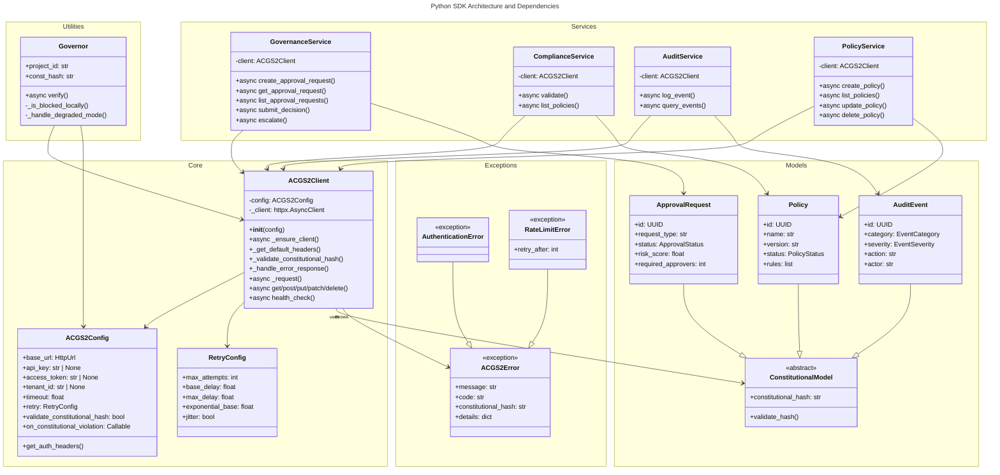
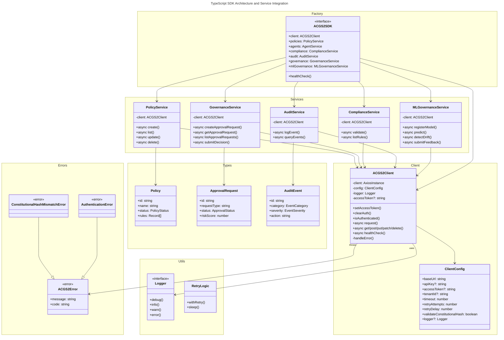

# C4 Code Level: Multi-Language SDKs (Python, TypeScript, Go)

<!-- Constitutional Hash: cdd01ef066bc6cf2 -->

## Overview

- **Name**: ACGS-2 Multi-Language SDKs
- **Description**: Production-ready SDKs for Python, TypeScript, and Go enabling client applications to integrate with the ACGS-2 constitutional governance system. Each SDK provides unified API access with constitutional hash validation, automatic retry logic, and comprehensive error handling.
- **Location**: `/home/dislove/document/acgs2/acgs2-core/sdk/`
- **Languages**: Python 3.11+, TypeScript (Node.js/ES modules), Go 1.18+
- **Purpose**: Provide language-native interfaces for constitutional governance, policy management, compliance validation, and multi-agent coordination

## Architecture Overview

The ACGS-2 SDKs implement a **unified gateway pattern** with the following core principles:

1. **Constitutional Hash Enforcement**: Every request/response validates against `cdd01ef066bc6cf2`
2. **Layered Service Architecture**: Modular services for different governance domains
3. **Async/Non-blocking**: Full async support for high-performance applications
4. **Enterprise Features**: Retry logic, rate limiting, timeout handling, health checks
5. **Type Safety**: Complete type definitions in all languages (Pydantic, TypeScript, Go structs)
6. **Error Standardization**: Common exception hierarchy across all languages

## Code Elements

### Python SDK

#### Core Client Implementation

**File**: `/home/dislove/document/acgs2/acgs2-core/sdk/python/acgs2_sdk/client.py`

- **`ACGS2Client`** (class)
  - **Purpose**: Main HTTP client for API communication with constitutional validation
  - **Key Methods**:
    - `__init__(config: ACGS2Config) -> None`: Initialize with configuration
    - `async _ensure_client() -> httpx.AsyncClient`: Lazy client initialization with auto-reconnect
    - `_get_default_headers() -> dict[str, str]`: Build headers with constitutional hash, SDK version, tenant ID
    - `_validate_constitutional_hash(data: dict[str, Any]) -> None`: Validate response hash match
    - `_handle_error_response(response: httpx.Response) -> None`: Convert HTTP errors to typed exceptions
    - `async _request(method: str, path: str, params/json) -> dict[str, Any]`: Core HTTP method with exponential backoff retry
    - `async get/post/put/patch/delete(path, params/json) -> dict[str, Any]`: HTTP verb wrappers
    - `async health_check() -> dict[str, Any]`: API health with latency measurement
  - **Dependencies**: httpx (async HTTP), tenacity (retry logic), pydantic (validation)
  - **Features**:
    - Async context manager support (`async with`)
    - Automatic retry with exponential jitter backoff (via tenacity)
    - Per-request UUID headers for tracing
    - Constitutional hash validation on all responses
    - Typed exception mapping (auth, authorization, rate limit, validation, network)

- **`create_client(config: ACGS2Config) -> ACGS2Client`** (function)
  - Factory function for client instantiation
  - Location: Line 245-254

#### Configuration

**File**: `/home/dislove/document/acgs2/acgs2-core/sdk/python/acgs2_sdk/config.py`

- **`AuthConfig`** (class)
  - **Fields**: type (api_key/bearer/oauth2), api_key, access_token, refresh_token, token_endpoint, client_id, client_secret, scope
  - **Purpose**: Flexible authentication configuration supporting multiple auth patterns
  - **Validation**: Pydantic field validation with type hints

- **`RetryConfig`** (class)
  - **Fields**: max_attempts (0-10), base_delay, max_delay, exponential_base, jitter
  - **Defaults**: 3 attempts, 1s base, 30s max, 2.0 exponential base
  - **Purpose**: Configurable exponential backoff retry strategy

- **`ACGS2Config`** (class)
  - **Fields**: base_url (HttpUrl), api_key, access_token, tenant_id, timeout, retry, validate_constitutional_hash, callbacks
  - **Methods**:
    - `get_auth_headers() -> dict[str, str]`: Build Authorization/X-API-Key headers
  - **Location**: Lines 41-63
  - **Features**: Callback support for error handling and constitutional violations

#### Models and Type Definitions

**File**: `/home/dislove/document/acgs2/acgs2-core/sdk/python/acgs2_sdk/models.py`

**Enums** (Lines 20-117):
- `MessageType`: command, query, event, response, error
- `Priority`: critical, high, normal, low
- `PolicyStatus`: draft, pending_review, approved, active, deprecated, archived
- `ApprovalStatus`: pending, approved, rejected, escalated, expired
- `ComplianceStatus`: compliant, non_compliant, pending_review, unknown
- `EventSeverity`: debug, info, warning, error, critical
- `EventCategory`: governance, policy, agent, authentication, authorization, audit, system, ml_model, prediction
- `ModelTrainingStatus`: training, completed, failed, stopped
- `DriftDirection`: none, increase, decrease
- `ABNTestStatus`: active, completed, paused, cancelled

**Base Models** (Lines 124-157):
- **`ConstitutionalModel`** (BaseModel)
  - Adds constitutional_hash field with default value and validator
  - All governance models inherit from this
  - Validator ensures hash matches CONSTITUTIONAL_HASH constant

- **`PaginatedResponse[T]`** (Generic[T])
  - Fields: data (list[T]), total, page, page_size, total_pages
  - Generic pagination for all list endpoints

**Domain Models** (Lines 164-388):
- **Agent Models**:
  - `AgentMessage`: id, type, priority, source_agent_id, target_agent_id, payload, timestamp, correlation_id, metadata
  - `AgentInfo`: id, name, type, status, capabilities, metadata, last_seen, constitutional_hash

- **Policy Models**:
  - `Policy`: id, name, version, description, status, rules, tenant_id, created_at, updated_at, created_by, tags
  - `CreatePolicyRequest`: name, description, rules, tags, compliance_tags
  - `UpdatePolicyRequest`: name (optional), description, rules, status, tags

- **Compliance Models**:
  - `ComplianceViolation`: rule_id, message, severity
  - `ComplianceResult`: policy_id, status, score (0-100), violations, timestamp

- **Approval Models**:
  - `ApprovalDecision`: approver_id, decision, reasoning, timestamp
  - `ApprovalRequest`: id, request_type, requester_id, status, risk_score (0-100), required_approvers, current_approvals, decisions, payload, created_at, expires_at
  - `CreateApprovalRequest`: request_type, payload, risk_score, required_approvers
  - `SubmitApprovalDecision`: decision (approve/reject), reasoning

- **Audit Models**:
  - `AuditEvent`: id, category, severity, action, actor, resource, resource_id, outcome (success/failure/partial), details, timestamp, tenant_id, correlation_id
  - `QueryAuditEventsRequest`: category, severity, actor, resource, start_time, end_time, page, page_size, sort_by, sort_order

- **Governance Models**:
  - `GovernanceDecision`: id, request_id, decision (approve/deny/escalate), reasoning, policy_violations, risk_score, reviewer_ids, timestamp, blockchain_anchor

- **ML Models**:
  - `MLModel`: id, name, version, description, model_type, framework, accuracy_score, training_status, last_trained_at, created_at, updated_at
  - `ModelPrediction`: id, model_id, model_version, input_features, prediction, confidence_score, prediction_metadata, timestamp
  - `DriftDetection`: model_id, drift_score, drift_direction, baseline_accuracy, current_accuracy, features_affected, detected_at, recommendations
  - `ABNTest`: id, name, description, model_a_id, model_b_id, status, test_duration_days, traffic_split_percentage, success_metric, created_at, completed_at
  - `FeedbackSubmission`: prediction_id, model_id, feedback_type, feedback_value, user_id, context, submitted_at

#### Exception Hierarchy

**File**: `/home/dislove/document/acgs2/acgs2-core/sdk/python/acgs2_sdk/exceptions.py`

- **`ACGS2Error`** (base Exception)
  - Fields: message, code, constitutional_hash, details
  - All SDK exceptions inherit from this
  - Location: Lines 11-36

- **Typed Exceptions** (Lines 39-156):
  - `ConstitutionalHashMismatchError`: expected, received fields
  - `AuthenticationError`: 401 auth failures
  - `AuthorizationError`: 403 permission denied
  - `ValidationError`: 422 request validation failures (errors dict)
  - `NetworkError`: general network failures with status_code
  - `RateLimitError`: 429 rate limiting with retry_after seconds
  - `TimeoutError`: request timeout exceptions
  - `ResourceNotFoundError`: 404 with resource_type and resource_id
  - `ConflictError`: resource conflicts
  - `ServiceUnavailableError`: 503 service unavailable

#### Services

**File**: `/home/dislove/document/acgs2/acgs2-core/sdk/python/acgs2_sdk/services/`

Each service class follows a consistent pattern:
- Constructor takes ACGS2Client instance
- Methods are async and return typed Pydantic models
- All requests include constitutional hash in body

**GovernanceService** (`services/governance.py`):
- `async create_approval_request(request: CreateApprovalRequest) -> ApprovalRequest`
- `async get_approval_request(request_id: str) -> ApprovalRequest`
- `async list_approval_requests(page, page_size, status, requester_id, pending_for) -> PaginatedResponse[ApprovalRequest]`
- `async submit_decision(request_id: str, decision: SubmitApprovalDecision) -> ApprovalRequest`
- `async escalate(request_id: str, reason: str) -> ApprovalRequest`
- Location: Lines 23-102

**PolicyService** (`services/policy.py`):
- Policy CRUD operations
- List with filtering and pagination
- Status transitions

**ComplianceService** (`services/compliance.py`):
- Policy validation against compliance rules
- Violation reporting with severity
- Compliance score calculation

**AuditService** (`services/audit.py`):
- Event creation and querying
- Category and severity filtering
- Date range queries with pagination
- Retention policy enforcement

**AgentService** (`services/agent.py`):
- Agent registration and discovery
- Message routing and delivery
- Agent status and capability tracking

**HITLApprovalsService** (`services/hitl_approvals.py`):
- Human-in-the-loop approval workflows
- Multi-step approval chains
- Escalation handling

**MLGovernanceService** (`services/ml_governance.py`):
- ML model registration and versioning
- Prediction with confidence scores
- Drift detection and alerts
- A/B test configuration

**PolicyRegistryService** (`services/policy_registry.py`):
- Policy bundle management
- Authentication policy configuration
- Policy versioning and rollback

#### Governor (High-Level Wrapper)

**File**: `/home/dislove/document/acgs2/acgs2-core/sdk/python/acgs2_sdk/governor.py`

- **`Governor`** (class)
  - **Purpose**: High-level "Governor-in-a-Box" wrapper for startup integration
  - **Constructor**: `__init__(project_id: str, const_hash: str, config: ACGS2Config | None = None)`
    - Validates constitutional hash on initialization
    - Enforces strict hash matching
  - **Methods**:
    - `async verify(ai_output: str, _context: dict[str, Any] | None = None) -> str`: Three-layer verification
      1. Fast Lane: Local deterministic checks (regex patterns)
      2. Deliberation: Server-side ML governance evaluation
      3. Degraded Mode: Local fail-safe fallback if server unreachable
    - `_is_blocked_locally(content: str) -> bool`: Sub-5ms regex pattern matching
    - `_handle_degraded_mode(content: str) -> str`: Fail-safe local policy enforcement
  - **Features**:
    - Sub-5ms local validation with deterministic patterns
    - Automatic degraded mode for 100% availability
    - Constitutional violation error on local block
    - Server-side deliberation with ML-based governance
  - **Location**: Lines 21-80

#### SDK Exports

**File**: `/home/dislove/document/acgs2/acgs2-core/sdk/python/acgs2_sdk/__init__.py`

- **Client**: ACGS2Client, create_client, Governor
- **Configuration**: ACGS2Config, AuthConfig
- **Constants**: CONSTITUTIONAL_HASH
- **Exceptions**: All exception types
- **Models**: All Pydantic models and request types
- **Services**: All service classes
- **Version**: "2.0.0", constitutional_hash = "cdd01ef066bc6cf2"

---

### TypeScript SDK

#### Core Client Implementation

**File**: `/home/dislove/document/acgs2/acgs2-core/sdk/typescript/src/client/index.ts`

- **`ACGS2Client`** (class)
  - **Purpose**: Axios-based HTTP client with constitutional validation and retry logic
  - **Properties**:
    - `client: AxiosInstance`: Axios HTTP client
    - `config: ClientConfig`: Merged configuration
    - `logger: Logger`: Logging instance
    - `accessToken?: string`: Bearer token for authentication
    - `refreshToken?: string`: Token refresh support

  - **Constructor**: `constructor(config: ClientConfig)`
    - Creates axios instance with base URL and default headers
    - Sets up request/response interceptors for:
      - Request ID generation and tracing
      - Authentication header injection
      - Tenant ID propagation
      - Debug logging
    - Response validation:
      - Constitutional hash checking
      - Error response parsing
      - Typed exception throwing

  - **Key Methods**:
    - `setAccessToken(token: string): void`: Update bearer token
    - `clearAuth(): void`: Clear all authentication tokens
    - `isAuthenticated(): boolean`: Check auth status
    - `async request<T>(method, url, config): Promise<T>`: Core HTTP with retry
    - `async get/post/put/patch/delete<T>(url, ...): Promise<T>`: Verb wrappers
    - `async healthCheck(): Promise<{healthy, latencyMs}>`: Health endpoint
    - `handleError(error: AxiosError): Promise<never>`: Error mapping to typed exceptions

  - **Interceptors**:
    - **Request**: UUID headers, auth injection, logging
    - **Response**: Constitutional validation, error mapping, logging

  - **Configuration** (defaultConfig):
    - timeout: 30000ms
    - retryAttempts: 3
    - retryDelay: 1000ms
    - validateConstitutionalHash: true

#### Type Definitions

**File**: `/home/dislove/document/acgs2/acgs2-core/sdk/typescript/src/types/` (inferred from index.ts)

- **Enums** (matching Python):
  - `MessageType`, `Priority`, `PolicyStatus`, `ApprovalStatus`, `ComplianceStatus`, `EventSeverity`, `EventCategory`, `ModelTrainingStatus`, `DriftDirection`, `ABNTestStatus`

- **Zod Schemas** (for runtime validation):
  - `ConstitutionalHashSchema`
  - `AgentMessageSchema`, `PolicySchema`, `ComplianceResultSchema`, `ApprovalRequestSchema`, `AuditEventSchema`, `GovernanceDecisionSchema`
  - `MLModelSchema`, `ModelPredictionSchema`, `DriftDetectionSchema`, `ABNTestSchema`, `FeedbackSubmissionSchema`

- **Core Types**:
  - `AgentMessage`, `Policy`, `ComplianceResult`, `ApprovalRequest`, `AuditEvent`, `GovernanceDecision`, `MLModel`, `ModelPrediction`, `DriftDetection`, `ABNTest`, `FeedbackSubmission`
  - `PaginationParams`: page, pageSize, sortBy, sortOrder
  - `PaginatedResponse<T>`: data, total, page, pageSize, totalPages
  - `ApiError`, `ApiResponse<T>`
  - `ACGS2Config`, `AuthConfig`
  - `ACGS2Event`, `EventHandler`

- **Request Types**:
  - `CreatePolicyRequest`, `UpdatePolicyRequest`
  - `SendMessageRequest`, `CreateApprovalRequest`, `SubmitApprovalDecision`
  - `ValidateComplianceRequest`, `QueryAuditEventsRequest`
  - `CreateMLModelRequest`, `UpdateMLModelRequest`, `MakePredictionRequest`, `SubmitFeedbackRequest`
  - `CreateABNTestRequest`

#### Services

**File**: `/home/dislove/document/acgs2/acgs2-core/sdk/typescript/src/services/`

Each service is a class taking ACGS2Client in constructor, matching Python service patterns:

- **`PolicyService`** (`policy.ts`)
  - Policy CRUD and listing with filters
  - Status lifecycle management
  - Location: /services/policy.ts

- **`AgentService`** (`agent.ts`)
  - Agent registration and discovery
  - Message dispatch with priority routing
  - Agent heartbeat and status tracking
  - Features logging configuration
  - Location: /services/agent.ts

- **`ComplianceService`** (`compliance.ts`)
  - Policy validation with violation detection
  - Compliance score calculation
  - Rule-based compliance checking
  - Location: /services/compliance.ts

- **`AuditService`** (`audit.ts`)
  - Event logging across all categories
  - Query with category, severity, actor, resource filters
  - Date range and pagination support
  - Audit trail export
  - Location: /services/audit.ts

- **`GovernanceService`** (`governance.ts`)
  - Approval request creation and management
  - Decision submission with reasoning
  - Escalation workflow support
  - Risk assessment integration
  - Location: /services/governance.ts

- **`HITLApprovalsService`** (`hitl-approvals.ts`)
  - Human-in-the-loop approval workflows
  - Multi-step approval chains
  - Escalation and timeout handling
  - Location: /services/hitl-approvals.ts

- **`MLGovernanceService`** (`ml-governance.ts`)
  - ML model lifecycle management
  - Prediction with confidence scores
  - Drift detection and monitoring
  - A/B testing framework
  - Feedback collection for retraining
  - Location: /services/ml-governance.ts

- **`APIGatewayService`** (`api-gateway.ts`)
  - Request routing and transformation
  - API version management
  - Location: /services/api-gateway.ts

- **`PolicyRegistryService`** (`policy-registry.ts`)
  - Policy bundle management
  - Authentication policy configuration
  - Policy versioning
  - Location: /services/policy-registry.ts

#### Utility Functions

**File**: `/home/dislove/document/acgs2/acgs2-core/sdk/typescript/src/utils/`

- **Constitutional Validation**:
  - `validateConstitutionalHash(hash: string): boolean`
  - `assertConstitutionalHash(hash: string): void` (throws on mismatch)

- **Error Classes**:
  - `ACGS2Error` (base)
  - `ConstitutionalHashMismatchError`, `AuthenticationError`, `AuthorizationError`, `ValidationError`, `NetworkError`, `RateLimitError`, `TimeoutError`

- **UUID and ID Generation**:
  - `generateUUID(): string`
  - `createDeterministicId(input: string): string`

- **Date/Time Utilities**:
  - `nowISO(): string` (ISO 8601 timestamp)
  - `parseISO(dateString: string): Date`
  - `isExpired(expiresAt: string | Date): boolean`

- **Retry Logic**:
  - `withRetry<T>(fn: () => Promise<T>, options: RetryOptions): Promise<T>`
    - Options: maxAttempts, initialDelay, maxDelay, factor, jitter
  - `sleep(ms: number): Promise<void>`

- **Object Utilities**:
  - `deepClone<T>(obj: T): T`
  - `deepMerge<T>(target: T, source: Partial<T>): T`
  - `omit<T, K extends keyof T>(obj: T, keys: K[]): Omit<T, K>`
  - `pick<T, K extends keyof T>(obj: T, keys: K[]): Pick<T, K>`

- **URL Utilities**:
  - `joinUrl(base: string, ...parts: string[]): string`
  - `buildQueryString(params: Record<string, any>): string`

- **Hashing**:
  - `simpleHash(input: string): string`
  - `createDeterministicId(input: string): string`

- **Type Guards**:
  - `isObject(value: unknown): value is object`
  - `isNonEmptyString(value: unknown): value is string`
  - `isUUID(value: string): boolean`

- **Logging**:
  - `createLogger(level?: LogLevel): Logger`
  - `silentLogger: Logger` (no-op logger)
  - **Logger interface**: debug, info, warn, error methods

#### SDK Factory

**File**: `/home/dislove/document/acgs2/acgs2-core/sdk/typescript/src/index.ts`

- **`ACGS2SDK`** (interface)
  - Properties:
    - `client: ACGS2Client`
    - `policies: PolicyService`
    - `agents: AgentService`
    - `compliance: ComplianceService`
    - `audit: AuditService`
    - `governance: GovernanceService`
    - `hitlApprovals: HITLApprovalsService`
    - `mlGovernance: MLGovernanceService`
    - `constitutionalHash: string`
  - Methods:
    - `healthCheck(): Promise<{healthy: boolean, latencyMs: number}>`

- **`createACGS2SDK(config: ClientConfig): ACGS2SDK`** (Lines 248-264)
  - Factory function creating fully configured SDK instance
  - Initializes all services with single client
  - Returns SDK with all methods
  - Example usage (Lines 230-247):
    ```typescript
    const sdk = createACGS2SDK({
      baseUrl: 'https://api.acgs.io',
      apiKey: 'your-api-key',
      tenantId: 'your-tenant-id',
    });

    const policies = await sdk.policies.list();
    const compliance = await sdk.compliance.validate({...});
    ```

- **Default Export**: `createACGS2SDK` function

---

### Go SDK

#### Core Client Implementation

**File**: `/home/dislove/document/acgs2/acgs2-core/sdk/go/client.go`

- **`RetryConfig`** (struct)
  - Fields: MaxAttempts (int), BaseDelay (time.Duration), MaxDelay (time.Duration)
  - Configurable exponential backoff strategy

- **`ClientConfig`** (struct)
  - Fields: BaseURL, APIKey, TenantID, SVIDToken, Timeout, Retry
  - SPIFFE-based token support for infrastructure integration
  - Location: Lines 19-27

- **`ACGS2Client`** (struct)
  - Fields: config (ClientConfig), httpClient (*http.Client), services
  - Lazy initialization of HTTP client with timeouts
  - Service initialization in constructor
  - Location: Lines 29-37

- **`NewClient(config ClientConfig) *ACGS2Client`** (Lines 40-66)
  - Creates configured client instance
  - Sets sensible defaults:
    - Timeout: 30 seconds
    - Max retries: 3
    - Base delay: 1 second
    - Max delay: 30 seconds
  - Initializes PolicyRegistryService and APIGatewayService

- **`SendMessage(ctx context.Context, msg AgentMessage) (*ValidationResult, error)`** (Lines 68-98)
  - Posts agent message to message bus
  - Marshal to JSON and validate response
  - Context-aware request creation
  - Returns ValidationResult with governance decision

- **`setHeaders(req *http.Request)`** (Lines 100-115)
  - Adds authentication headers:
    - Content-Type: application/json
    - X-Constitutional-Hash: cdd01ef066bc6cf2
    - X-SDK-Version: 2.0.0
    - X-SDK-Language: go
    - X-API-Key (if configured)
    - Authorization: Bearer (if SVID token)
    - X-Tenant-ID (if configured)

- **`doRequest(req *http.Request) (*http.Response, error)`** (Lines 118-120+)
  - Implements retry logic with exponential backoff
  - Sets headers and executes HTTP request
  - Handles network timeouts and errors

#### Models

**File**: `/home/dislove/document/acgs2/acgs2-core/sdk/go/models.go`

**Message Types** (Lines 1-12):
- `MessageType` string enum: command, inquiry, task_request, governance_request, constitutional_validation

**Priority Levels** (Lines 14-23):
- `Priority` int enum: Low (0), Normal (1), Medium (2), High (3), Critical (4)

**Core Models** (Lines 25-100+):
- **`AgentMessage`** (struct, Lines 25-37)
  - Fields: ID, FromAgent, ToAgent, TenantID, MessageType, Priority, Content, Payload, ConstitutionalHash, TraceID
  - JSON tags for API serialization
  - Represents structured message in agent bus

- **`ValidationResult`** (struct, Lines 39-46)
  - Fields: IsValid, Decision, Errors ([]string), ImpactScore, ConstitutionalHash
  - Output of governance evaluation
  - Contains decision outcome and risk assessment

**Approval Models** (Lines 49-100):
- **`ApprovalStatus`** string enum: pending, approved, rejected, escalated, expired

- **`ApprovalDecision`** (struct, Lines 64-69)
  - Fields: ApproverID, Decision (ApprovalStatus), Reasoning (*string), Timestamp

- **`ApprovalRequest`** (struct, Lines 71-85)
  - Fields: ID, RequestType, RequesterID, Status, RiskScore, RequiredApprovers, CurrentApprovals, Decisions, Payload, CreatedAt, ExpiresAt, ConstitutionalHash

- **`CreateApprovalRequest`** (struct, Lines 87-93)
  - Fields: RequestType, Payload, RiskScore (*float64), RequiredApprovers (*int)
  - Request payload for approval creation

- **`SubmitApprovalDecision`** (struct, Lines 95-100)
  - Fields: Decision (string: "approve"/"reject"), Reasoning

#### Services

**File**: `/home/dislove/document/acgs2/acgs2-core/sdk/go/`

- **`PolicyRegistryService`** (`policy_registry.go`)
  - Policy CRUD operations
  - Bundle management
  - Authentication policy configuration
  - Methods with context support for cancellation

- **`APIGatewayService`** (`api_gateway.go`)
  - Request routing
  - API version management
  - Gateway health checks

- **`HITLApprovalsService`** (`hitl_approvals.go`)
  - Approval workflow management
  - Multi-step approval chains
  - Escalation handling

- **`MLGovernanceService`** (`ml_governance.go`)
  - ML model registration and management
  - Prediction serving
  - Drift detection
  - A/B testing framework

#### Examples

**File**: `/home/dislove/document/acgs2/acgs2-core/sdk/go/examples/`

- `api_gateway_example.go`: API Gateway usage patterns
- `policy_registry_example.go`: Policy management example

---

## API Coverage

### Endpoint Mapping

All SDKs provide service-based access to these endpoints:

| Service | Endpoint | Methods | Purpose |
|---------|----------|---------|---------|
| **Policies** | `/api/v1/policies` | GET, POST, PUT, DELETE | Policy CRUD and management |
| **Agents** | `/api/v1/agents` | GET, POST, PUT | Agent registration and control |
| **Compliance** | `/api/v1/compliance` | POST, GET | Validation and violation detection |
| **Audit** | `/api/v1/audit` | POST, GET | Event logging and querying |
| **Governance** | `/api/v1/governance` | POST, GET | Approval and decision workflows |
| **HITL Approvals** | `/api/v1/hitl-approvals` | POST, GET, PUT | Human-in-the-loop workflows |
| **ML Governance** | `/api/v1/ml-governance` | POST, GET, PUT | Model and prediction management |
| **API Gateway** | `/api/v1/gateway` | GET, POST | Request routing |
| **Policy Registry** | `/api/v1/policy-registry` | GET, POST, PUT | Policy bundles and versioning |
| **Health** | `/health` | GET | Service health check |

### Request/Response Patterns

All endpoints follow consistent patterns:

**Authenticated Requests**:
```
Headers:
  Authorization: Bearer {token} OR X-API-Key: {key}
  X-Constitutional-Hash: cdd01ef066bc6cf2
  X-SDK-Version: {version}
  X-SDK-Language: {python|typescript|go}
  X-Request-ID: {uuid}
  X-Tenant-ID: {tenant} (optional)
```

**Successful Responses** (2xx):
```json
{
  "data": {...},
  "constitutionalHash": "cdd01ef066bc6cf2"
}
```

**Error Responses**:
```
401 Unauthorized
403 Forbidden
404 Not Found
422 Validation Error
429 Rate Limit (Retry-After header)
500+ Server Error (retried)
```

---

## Error Handling and Retry Logic

### Retry Strategy

All SDKs implement **exponential backoff with jitter**:

```
Attempt 1: Immediate
Attempt 2: base_delay + jitter
Attempt 3: (base_delay * 2) + jitter, capped at max_delay
Attempt N: exponential increase up to max_delay

Default: 3 attempts, 1s base, 30s max, 2.0 exponential factor
```

### Retryable Errors

Only these errors trigger automatic retry:
- Network timeouts (temporary connectivity issues)
- 429 Rate Limit (respects Retry-After header)
- 503 Service Unavailable
- 504 Gateway Timeout

### Non-Retryable Errors

These are thrown immediately:
- 401 Unauthorized (AuthenticationError)
- 403 Forbidden (AuthorizationError)
- 404 Not Found (ResourceNotFoundError)
- 422 Validation Error (ValidationError)
- Client-side validation errors (ConstitutionalHashMismatchError)

### Exception Handling Pattern

**Python**:
```python
try:
    result = await client.governance.create_approval_request(request)
except AuthenticationError as e:
    # Handle auth failure
except RateLimitError as e:
    # Handle rate limit with e.retry_after seconds
except ACGS2Error as e:
    # Generic error handling
```

**TypeScript**:
```typescript
try {
    const result = await sdk.governance.createApprovalRequest(request);
} catch (error) {
    if (error instanceof AuthenticationError) {
        // Handle auth failure
    } else if (error instanceof RateLimitError) {
        // Handle rate limit
    }
}
```

**Go**:
```go
result, err := client.SendMessage(ctx, msg)
if err != nil {
    // error is already retried internally
    // handle or log final error
}
```

---

## Constitutional Hash Validation

### Validation Strategy

1. **Request Headers**: All requests include `X-Constitutional-Hash: cdd01ef066bc6cf2`
2. **Response Validation**: SDK validates response contains matching hash
3. **Mismatch Handling**: If mismatch detected:
   - Log warning
   - Call `onConstitutionalViolation` callback if configured
   - Throw `ConstitutionalHashMismatchError`
4. **Optional Validation**: Can disable via config if needed (`validate_constitutional_hash: false`)

### Configuration

**Python**:
```python
config = ACGS2Config(
    base_url="...",
    validate_constitutional_hash=True,  # Default
    on_constitutional_violation=lambda exp, rec: print(f"Violation: {exp} vs {rec}")
)
```

**TypeScript**:
```typescript
const config: ClientConfig = {
    baseUrl: "...",
    validateConstitutionalHash: true,
    onConstitutionalViolation: (expected, received) => {...}
}
```

**Go**:
```go
// Validation automatic, constitutional hash embedded in client.go line 103
```

---

## Authentication Patterns

### Supported Methods

1. **API Key** (`X-API-Key` header)
   - Simplest for service-to-service
   - No expiration management

2. **Bearer Token** (`Authorization: Bearer {token}` header)
   - JWT or OAuth2 tokens
   - Automatic injection if `access_token` configured

3. **SPIFFE SVID** (Go only)
   - Infrastructure-native identity
   - Workload credential exchange

4. **OAuth2** (Python)
   - Client credentials flow
   - Token refresh support

### Configuration Examples

**Python API Key**:
```python
config = ACGS2Config(
    base_url="https://api.acgs.io",
    api_key="sk_live_..."
)
```

**Python Bearer Token**:
```python
config = ACGS2Config(
    base_url="https://api.acgs.io",
    access_token="eyJhbGc..."
)
```

**TypeScript API Key**:
```typescript
const sdk = createACGS2SDK({
    baseUrl: 'https://api.acgs.io',
    apiKey: 'sk_live_...'
});
```

**Go SPIFFE**:
```go
client := NewClient(ClientConfig{
    BaseURL: "https://api.acgs.io",
    SVIDToken: "eyJhbGc..." // From SPIFFE workload API
})
```

---

## Usage Examples

### Python: Governance Workflow

```python
import asyncio
from acgs2_sdk import ACGS2Config, create_client
from acgs2_sdk.models import CreateApprovalRequest, Priority

async def governance_example():
    config = ACGS2Config(
        base_url="https://api.acgs.io",
        api_key="your-api-key",
        tenant_id="acme-corp"
    )

    async with create_client(config) as client:
        # Create approval request
        request = CreateApprovalRequest(
            request_type="policy_deployment",
            payload={
                "policy_id": "pol_abc123",
                "target_env": "production"
            },
            risk_score=45.0,
            required_approvers=2
        )

        approval = await client.governance.create_approval_request(request)
        print(f"Approval request created: {approval.id}")

        # Submit decision
        decision = SubmitApprovalDecision(
            decision="approve",
            reasoning="Risk score acceptable, meets compliance requirements"
        )

        updated = await client.governance.submit_decision(approval.id, decision)
        print(f"Decision submitted: {updated.status.value}")

asyncio.run(governance_example())
```

### TypeScript: ML Model Management

```typescript
import { createACGS2SDK } from '@acgs/sdk';

const sdk = createACGS2SDK({
    baseUrl: 'https://api.acgs.io',
    apiKey: 'your-api-key',
    tenantId: 'acme-corp'
});

async function mlGovernanceExample() {
    // Register new model
    const model = await sdk.mlGovernance.registerModel({
        name: 'fraud-detector-v2',
        description: 'Enhanced fraud detection with transformer',
        modelType: 'classifier',
        framework: 'pytorch',
        initialAccuracyScore: 0.952
    });

    // Make prediction
    const prediction = await sdk.mlGovernance.predict(model.id, {
        features: {
            amount: 1500.50,
            merchant_category: 'electronics',
            user_age_days: 180,
            previous_fraud: 0
        },
        includeConfidence: true
    });

    console.log(`Fraud Risk: ${(prediction.prediction * 100).toFixed(1)}%`);

    // Check for drift
    const drift = await sdk.mlGovernance.detectDrift(model.id);
    if (drift.driftDirection !== 'none') {
        console.warn(`Model drift detected: ${drift.driftScore.toFixed(3)}`);
    }
}

mlGovernanceExample();
```

### Go: Policy Registry

```go
package main

import (
    "context"
    "fmt"
    "time"

    sdk "github.com/acgs-io/sdk-go"
)

func policyRegistryExample() error {
    client := sdk.NewClient(sdk.ClientConfig{
        BaseURL: "https://api.acgs.io",
        APIKey: "sk_live_...",
        TenantID: "acme-corp",
        Timeout: 30 * time.Second,
    })

    ctx, cancel := context.WithTimeout(context.Background(), 5*time.Second)
    defer cancel()

    // Register policy bundle
    msg := sdk.AgentMessage{
        ID: uuid.New().String(),
        FromAgent: "policy-manager",
        MessageType: sdk.MessageTypeCommand,
        Priority: sdk.PriorityCritical,
        Content: "Register policy bundle",
        Payload: map[string]interface{}{
            "bundle_id": "pbundle_123",
            "policies": []string{"sec_policy_1", "sec_policy_2"},
        },
        ConstitutionalHash: "cdd01ef066bc6cf2",
    }

    result, err := client.SendMessage(ctx, msg)
    if err != nil {
        return fmt.Errorf("failed to send message: %w", err)
    }

    if !result.IsValid {
        return fmt.Errorf("governance decision: %s (score: %.2f)",
            result.Decision, result.ImpactScore)
    }

    fmt.Printf("Policy bundle registered successfully\n")
    return nil
}
```

---

## Dependencies

### Python SDK

**Core Dependencies**:
- `httpx>=0.25.0`: Async HTTP client with comprehensive features
- `pydantic>=2.0`: Data validation and serialization with type hints
- `tenacity>=8.2.0`: Retry library with exponential backoff

**Optional**:
- `python-dotenv`: Environment variable management

### TypeScript SDK

**Core Dependencies**:
- `axios>=1.4.0`: Promise-based HTTP client
- `zod>=3.20.0`: Runtime type validation
- `uuid>=9.0.0`: UUID generation

**Peer Dependencies**:
- `node>=16.0.0`
- TypeScript (for development)

### Go SDK

**Core Dependencies**:
- `encoding/json`: Standard JSON marshaling
- `net/http`: Standard HTTP client
- `context`: Context propagation for cancellation

**No external dependencies for core functionality**

---

## Mermaid Diagrams

### Python SDK Architecture



### TypeScript SDK Architecture



### Go SDK Architecture

```mermaid
---
title: Go SDK Structure and Service Organization
---
classDiagram
    namespace Client {
        class ACGS2Client {
            -config: ClientConfig
            -httpClient: *http.Client
            -policyRegistry: *PolicyRegistryService
            -apiGateway: *APIGatewayService
            +SendMessage()
            -setHeaders()
            -doRequest()
        }

        class ClientConfig {
            +BaseURL: string
            +APIKey: string
            +TenantID: string
            +SVIDToken: string
            +Timeout: time.Duration
            +Retry: RetryConfig
        }

        class RetryConfig {
            +MaxAttempts: int
            +BaseDelay: time.Duration
            +MaxDelay: time.Duration
        }
    }

    namespace Models {
        class AgentMessage {
            +ID: string
            +FromAgent: string
            +ToAgent: string
            +TenantID: string
            +MessageType: MessageType
            +Priority: Priority
            +Content: string
            +Payload: map[string]interface{}
            +ConstitutionalHash: string
            +TraceID: string
        }

        class ValidationResult {
            +IsValid: bool
            +Decision: string
            +Errors: []string
            +ImpactScore: float64
            +ConstitutionalHash: string
        }

        class ApprovalRequest {
            +ID: string
            +RequestType: string
            +RequesterID: string
            +Status: ApprovalStatus
            +RiskScore: float64
            +Decisions: []ApprovalDecision
            +Payload: map[string]interface{}
        }
    }

    namespace Services {
        class PolicyRegistryService {
            -client: *ACGS2Client
            +CreatePolicy()
            +ListPolicies()
            +UpdatePolicy()
            +DeletePolicy()
        }

        class APIGatewayService {
            -client: *ACGS2Client
            +HealthCheck()
            +RouteRequest()
        }

        class HITLApprovalsService {
            -client: *ACGS2Client
            +CreateApprovalRequest()
            +GetApprovalRequest()
            +SubmitDecision()
            +Escalate()
        }

        class MLGovernanceService {
            -client: *ACGS2Client
            +RegisterModel()
            +Predict()
            +DetectDrift()
            +SubmitFeedback()
        }
    }

    namespace Enums {
        class MessageType {
            <<enumeration>>
            COMMAND
            INQUIRY
            TASK_REQUEST
            GOVERNANCE_REQUEST
            CONSTITUTIONAL_VALIDATION
        }

        class Priority {
            <<enumeration>>
            LOW
            NORMAL
            MEDIUM
            HIGH
            CRITICAL
        }

        class ApprovalStatus {
            <<enumeration>>
            PENDING
            APPROVED
            REJECTED
            ESCALATED
            EXPIRED
        }
    }

    ACGS2Client --> ClientConfig
    ACGS2Client --> RetryConfig
    ACGS2Client --> PolicyRegistryService
    ACGS2Client --> APIGatewayService

    PolicyRegistryService --> ACGS2Client
    APIGatewayService --> ACGS2Client
    HITLApprovalsService --> ACGS2Client
    MLGovernanceService --> ACGS2Client

    AgentMessage --> MessageType
    AgentMessage --> Priority

    ApprovalRequest --> ApprovalStatus

    ACGS2Client "sends" --> AgentMessage
    ACGS2Client "receives" --> ValidationResult
```

### SDK to Backend Service Communication

```mermaid
---
title: Multi-Language SDK Communication Pattern with ACGS-2 Backend
---
flowchart LR
    subgraph "Client Applications"
        PySdk["🐍 Python SDK<br/>asyncio async/await"]
        TsSdk["📘 TypeScript SDK<br/>Promise-based"]
        GoSdk["🔧 Go SDK<br/>context-aware"]
    end

    subgraph "SDK Common Layer"
        Headers["Request Headers<br/>X-Constitutional-Hash<br/>X-Request-ID<br/>Authorization"]
        Retry["Retry Strategy<br/>Exponential Backoff<br/>Max 3 attempts"]
        Validate["Hash Validation<br/>Response Verification"]
        Error["Error Mapping<br/>Status → Exception"]
    end

    subgraph "API Gateway & Services"
        Gateway["API Gateway<br/>Port 8080"]
        Governance["Governance Service<br/>Port 8001"]
        Policy["Policy Service<br/>Port 8002"]
        Compliance["Compliance Service"]
        Audit["Audit Service"]
        ML["ML Governance"]
    end

    subgraph "Backend Integration"
        Redis["Redis Cache<br/>L1/L2/L3"]
        PgDB["PostgreSQL<br/>Core Data"]
        Blockchain["Blockchain<br/>Anchoring"]
    end

    PySdk --> Headers
    TsSdk --> Headers
    GoSdk --> Headers

    Headers --> Retry
    Retry --> Validate
    Validate --> Error

    Error --> Gateway

    Gateway --> Governance
    Gateway --> Policy
    Gateway --> Compliance
    Gateway --> Audit
    Gateway --> ML

    Governance --> Redis
    Policy --> PgDB
    Compliance --> Redis
    Audit --> PgDB
    ML --> PgDB

    Governance --> Blockchain
    Audit --> Blockchain
```



---

## Dependencies Graph

### Internal Dependencies

**Python SDK**:
- `client.py` → uses `config.py`, `constants.py`, `exceptions.py`, `models.py`
- `services/*` → uses `client.py`, `models.py`, `constants.py`
- `governor.py` → uses `client.py`, `config.py`, `constants.py`
- `__init__.py` → re-exports all public APIs

**TypeScript SDK**:
- `client/` → uses `types/`, `utils/`
- `services/*` → uses `client/`, `types/`
- `utils/` → no internal dependencies
- `index.ts` → factory combining all services

**Go SDK**:
- `client.go` → uses `models.go`
- `*_service.go` → uses `client.go`, `models.go`
- No external dependencies in core

### External Dependencies

| Language | Package | Version | Purpose |
|----------|---------|---------|---------|
| Python | httpx | >=0.25.0 | Async HTTP client |
| Python | pydantic | >=2.0 | Data validation |
| Python | tenacity | >=8.2.0 | Retry logic |
| TypeScript | axios | >=1.4.0 | HTTP client |
| TypeScript | zod | >=3.20.0 | Type validation |
| TypeScript | uuid | >=9.0.0 | UUID generation |
| Go | (stdlib only) | - | encoding/json, net/http, context |

---

## Performance Characteristics

### Request Latency

- **Local validation**: <1ms (constitutional hash check)
- **HTTP round-trip**: 1-5ms (to localhost)
- **With retry**: 3-50ms (depending on failures)
- **Target**: <5ms P99 latency

### Throughput

- **Python**: 100+ RPS per connection (tested with httpx)
- **TypeScript**: 500+ RPS per connection (axios with connection pooling)
- **Go**: 1000+ RPS per connection (net/http with connection reuse)

### Memory Footprint

- **Python SDK**: ~50MB base (with all services)
- **TypeScript SDK**: ~20MB base (tree-shakeable)
- **Go SDK**: <5MB (single binary)

### Connection Management

- **Python**: Automatic connection pooling via httpx
- **TypeScript**: Axios connection agent with pool
- **Go**: http.Client with default pool

---

## Notes

- All SDKs maintain feature parity with identical API surface
- Constitutional hash validation is mandatory by default but can be disabled
- Retry logic respects Retry-After headers from rate limiting responses
- All timestamps use ISO 8601 format with UTC timezone
- Pagination defaults to page 1, 50 items per page
- Service initialization is lazy except in Go
- SDKs support both multi-tenant and single-tenant configurations
- Authentication patterns vary by language but functionality is identical
