# C4 Component Level: Deliberation & Decision Component

<!-- Constitutional Hash: cdd01ef066bc6cf2 -->

## Overview

- **Name**: Deliberation & Decision Component
- **Description**: Intelligent high-impact decision review system combining AI-powered impact scoring, multi-agent consensus, human-in-the-loop workflows, and OPA policy enforcement for constitutional governance
- **Type**: Service Component
- **Technology**: Python 3.11+ (async/await), DistilBERT ML models, OPA policy engine
- **Container**: Enhanced Agent Bus Container (within ACGS-2 Core Services)

## Purpose

The Deliberation & Decision Component implements the VERIFY-BEFORE-ACT pattern for ACGS-2, providing sophisticated review capabilities for high-impact decisions. It protects the system from risky actions through multi-dimensional impact analysis, adaptive routing, multi-stakeholder consensus mechanisms, and constitutional policy enforcement. The component ensures that critical decisions receive appropriate scrutiny before execution while maintaining sub-5ms P99 latency for low-impact operations through intelligent dual-path routing.

## Software Features

### AI-Powered Impact Analysis
- **Multi-dimensional impact scoring**: Combines semantic analysis (DistilBERT embeddings), permission assessment, request volume tracking, behavioral drift detection, priority factors, and message type analysis with configurable weights
- **ML model inference**: DistilBERT and ONNX Runtime support with GPU acceleration profiling for production optimization
- **Adaptive threshold learning**: Automatically adjusts routing thresholds based on false positive/negative rates to optimize decision accuracy
- **Baseline validation**: Cross-validates impact scores against baseline scorers for consistency verification

### Intelligent Message Routing
- **Dual-path architecture**: Fast lane for low-impact decisions (<0.8 threshold), deliberation path for high-impact decisions requiring review
- **Performance tracking**: Records routing decisions with outcome feedback for continuous improvement
- **Manual override capability**: Force deliberation routing with audit trail for exceptional circumstances
- **Routing statistics**: Real-time metrics on fast lane vs deliberation usage, approval/rejection rates

### Multi-Agent Consensus & Voting
- **Three voting strategies**: QUORUM (50%+1), UNANIMOUS (100%), SUPER_MAJORITY (2/3) for flexible consensus models
- **Agent vote tracking**: Confidence-weighted votes with reasoning capture for audit trails
- **Early resolution detection**: Terminates voting immediately when outcome is determined
- **Timeout handling**: Automatic expiry and resolution for abandoned votes

### Human-in-the-Loop Workflows
- **Multi-channel notifications**: Slack and Microsoft Teams integration with interactive approval buttons
- **Role-based approval policies**: Configurable policies requiring specific roles (Security, Compliance, Platform Admin, etc.)
- **Escalation automation**: Time-based escalation through 4 levels (LEVEL_1 → LEVEL_2 → LEVEL_3 → EXECUTIVE)
- **Auto-approval for low-risk**: Bypass deliberation for actions below risk threshold
- **Audit trail integration**: Blockchain-anchored approval records via AuditLedger

### OPA Policy Enforcement
- **Pre-action verification**: Constitutional compliance and OPA policy evaluation before action execution
- **Risk assessment**: Multi-factor risk scoring (action type, impact, scope, policy results) with configurable thresholds
- **Multi-signature collection**: Concurrent signature gathering with threshold requirements and timeout monitoring
- **Critic agent reviews**: Structured review process with consensus detection and escalation on timeout
- **Fail-closed security**: Defaults to denial on OPA evaluation errors (VULN-002, VULN-003 mitigation)

### Deliberation Queue Management
- **Persistent task storage**: JSON file persistence with Redis queue integration for production scalability
- **Consensus tracking**: Vote aggregation with configurable consensus threshold (default 66%)
- **Timeout monitoring**: Background task monitoring with automatic timeout and status updates
- **Human decision integration**: Support for both agent voting and human HITL decisions with different workflows

### Constitutional Governance Integration
- **Constitutional hash validation**: Enforces `cdd01ef066bc6cf2` at all decision boundaries
- **Governance callbacks**: Extensible callback system for custom validation and processing logic
- **Audit logging**: Comprehensive decision logs (max 10K entries) with immutable audit trails
- **Metrics collection**: Performance metrics for monitoring, alerting, and continuous optimization

### AI Assistant Integration
- **Natural language understanding**: Intent classification, entity extraction, sentiment analysis for conversational AI
- **Dialog management**: Conversation flow control with state machine, slot-filling, and action selection
- **Response generation**: Template-based and LLM-powered response generation with personality configuration
- **Constitutional validation**: Message-level and action-level governance checks integrated throughout assistant pipeline
- **Session management**: Multi-session support with configurable timeout and context pruning

## Code Elements

This component synthesizes the following code-level elements:

### Deliberation Layer
- [c4-code-deliberation-layer.md](./c4-code-deliberation-layer.md) - Core deliberation services
  - **ImpactScorer**: Multi-dimensional impact analysis with DistilBERT/ONNX
  - **AdaptiveRouter**: Intelligent routing with adaptive threshold learning
  - **OPAGuard**: Policy-based verification with multi-signature and critic review
  - **DeliberationQueue**: Persistent queue with consensus tracking and timeout monitoring
  - **VotingService**: Multi-agent consensus voting with three strategies
  - **HITLManager**: Human-in-the-loop approval workflow with Slack/Teams integration
  - **MultiApproverWorkflowEngine**: Enterprise-grade multi-approver workflow with role-based policies

### AI Assistant
- [c4-code-ai-assistant.md](./c4-code-ai-assistant.md) - Conversational AI assistant
  - **AIAssistant**: Main orchestrator for message processing pipeline
  - **NLUEngine**: Natural language understanding with intent classification and entity extraction
  - **DialogManager**: Conversation flow control and action selection
  - **ResponseGenerator**: Template-based and LLM-powered response generation
  - **AgentBusIntegration**: Constitutional governance integration for AI assistant
  - **ContextManager**: Conversation context and session management

## Interfaces

### Main Processing Interface

**DeliberationLayer.process_message()**
- **Protocol**: Async Python method (internal component interface)
- **Description**: Main entry point for message deliberation processing
- **Input Parameters**:
  - `message: AgentMessage` - Message requiring deliberation review
- **Returns**: `Dict[str, Any]` containing:
  - `success: bool` - Processing success indicator
  - `lane: str` - Routing decision ('fast' or 'deliberation')
  - `impact_score: float` - Calculated impact score (0.0-1.0)
  - `governance_decision: Optional[Dict]` - OPA Guard evaluation result
  - `requires_review: bool` - Human review requirement flag
  - `processing_time_ms: float` - Elapsed processing time
  - `constitutional_hash: str` - Constitutional validation hash
- **Processing Steps**:
  1. Prepare processing context (extract agent_id, tenant_id, priority, type)
  2. Calculate impact score using ImpactScorer
  3. OPA Guard pre-action verification
  4. Execute routing decision (fast lane or deliberation)
  5. Finalize and record performance metrics

### Impact Scoring Interface

**ImpactScorer.calculate_impact_score()**
- **Protocol**: Async Python method
- **Description**: Multi-dimensional impact analysis for decision routing
- **Input Parameters**:
  - `message_content: Dict[str, Any]` - Message payload to score
  - `context: Optional[Dict[str, Any]]` - Additional context (historical data, time, amounts)
- **Returns**: `float` - Impact score normalized to [0.0, 1.0]
- **Scoring Dimensions** (weights):
  - Semantic similarity (30%): DistilBERT cosine similarity to high-impact keywords
  - Permission risk (20%): Tool permission requirements (admin, delete, transfer, execute)
  - Request volume (10%): Agent request rate thresholds
  - Context/history (10%): Temporal anomalies, transaction amounts
  - Behavioral drift (15%): Deviation from agent's historical baseline
  - Priority factor (10%): Message priority enum mapping
  - Message type (5%): Type-specific impact (GOVERNANCE_REQUEST, CONSTITUTIONAL_VALIDATION)

### OPA Guard Interface

**OPAGuard.verify_action()**
- **Protocol**: Async Python method
- **Description**: Pre-action constitutional compliance and policy verification
- **Input Parameters**:
  - `agent_id: str` - Agent performing action
  - `action: Dict[str, Any]` - Action details (type, parameters, scope)
  - `context: Dict[str, Any]` - Execution context
- **Returns**: `GuardResult` containing:
  - `decision: GuardDecision` - ALLOW | REQUIRE_SIGNATURES | REQUIRE_REVIEW | DENY
  - `is_allowed: bool` - Action permission
  - `constitutional_valid: bool` - Constitutional hash validation result
  - `risk_score: float` - Composite risk assessment (0.0-1.0)
  - `risk_level: str` - Risk category (critical/high/medium/low)
  - `required_signers: List[str]` - Required signers if signatures needed
  - `required_reviewers: List[str]` - Required critics if review needed
  - `policy_result: Dict` - OPA policy evaluation details
  - `validation_errors: List[str]` - Errors if validation failed
- **Decision Logic**:
  - `risk_score >= 0.95` → REQUIRE_REVIEW (both signatures and critic reviews)
  - `risk_score >= 0.8` → REQUIRE_SIGNATURES
  - `policy_result.allowed == false` → DENY
  - Otherwise → ALLOW

### Voting Interface

**VotingService.create_election()**
- **Protocol**: Async Python method
- **Description**: Create multi-agent voting election
- **Input Parameters**:
  - `message: AgentMessage` - Message subject to voting
  - `participants: List[str]` - Agent IDs eligible to vote
  - `timeout: int` - Election timeout in seconds (default: 30)
- **Returns**: `str` - Election ID for vote submission
- **Resolution Strategies**:
  - QUORUM: Approvals > 50% → APPROVE; Denials >= 50% → DENY
  - UNANIMOUS: All approve → APPROVE; Any deny → DENY
  - SUPER_MAJORITY: Approvals >= 2/3 → APPROVE; Denials > 1/3 → DENY

### Human Approval Interface

**HITLManager.request_approval()**
- **Protocol**: Async Python method
- **Description**: Request human approval via Slack/Teams
- **Input Parameters**:
  - `item_id: str` - Deliberation task ID
  - `channel: str` - Notification channel ('slack' or 'teams')
- **Returns**: `None` (fire-and-forget notification)
- **Notification Payload**:
  - Request metadata (requester, timestamp)
  - Impact score and risk assessment
  - Action type and parameters
  - Content preview
  - Interactive approve/reject buttons

### AI Assistant Interface

**AIAssistant.process_message()**
- **Protocol**: Async Python method
- **Description**: Process user message through conversational AI pipeline
- **Input Parameters**:
  - `user_id: str` - User identifier
  - `message: str` - User message text
  - `session_id: Optional[str]` - Session identifier (auto-created if None)
  - `metadata: Optional[Dict[str, Any]]` - Additional metadata
- **Returns**: `ProcessingResult` containing:
  - `success: bool` - Processing success indicator
  - `response_text: str` - Generated assistant response
  - `intent: Optional[str]` - Detected user intent
  - `confidence: float` - Intent confidence score [0.0, 1.0]
  - `entities: Dict[str, Any]` - Extracted entities
  - `action_taken: Optional[str]` - Dialog action executed
  - `governance_decision: Optional[Dict]` - Governance evaluation result
  - `processing_time_ms: float` - Elapsed processing time
  - `constitutional_hash: str` - Constitutional validation hash
- **Processing Pipeline**:
  1. Context retrieval/creation and constitutional validation
  2. NLU processing (intent, entities, sentiment)
  3. Dialog management and action selection
  4. Governance checks for high-impact actions
  5. Response generation with personality
  6. Event listener notification

## Dependencies

### Components Used

**Enhanced Agent Bus Core**
- **AgentMessage**: Message data structure with constitutional hash validation
- **MessageProcessor**: Core message routing and delivery infrastructure
- **ValidationResult**: Constitutional hash and message validation results
- **OPAClient**: Open Policy Agent integration for policy evaluation

**Policy Registry Service**
- **Policy storage**: Retrieval of governance policies for OPA evaluation
- **Policy versioning**: Policy version management for audit trails

**Audit Service**
- **AuditLedger**: Blockchain-anchored audit trail recording for human decisions and governance events
- **Immutable logging**: Cryptographic proof of deliberation outcomes

**Metering Service**
- **Usage tracking**: Record deliberation requests, approvals, and rejections for billing and analytics

### External Systems

**Redis** (optional, for production scaling)
- **DeliberationQueue persistence**: Production-grade queue persistence instead of JSON files
- **Voting state synchronization**: Distributed voting state management across instances

**Slack API** (for HITL workflows)
- **Interactive notifications**: Approval request blocks with approve/reject buttons
- **Decision notifications**: Broadcast approval/rejection decisions to stakeholders

**Microsoft Teams API** (for HITL workflows)
- **Adaptive cards**: Rich approval request cards with response forms
- **Channel notifications**: Team-wide approval notifications

**DistilBERT / ONNX Runtime** (for impact scoring)
- **Semantic embeddings**: Text embeddings for semantic similarity analysis
- **GPU acceleration**: Optional GPU inference for high-throughput deployments

**OPA Server** (for policy enforcement)
- **Policy evaluation**: Rego policy evaluation with fail-closed error handling
- **Constitutional compliance**: Validation against constitutional policies

## Component Diagram

The following diagram shows the Deliberation & Decision Component within the Enhanced Agent Bus Container, including its internal structure and external dependencies:

```mermaid
C4Component
    title Component Diagram for Deliberation & Decision Component (within Enhanced Agent Bus Container)

    Container_Boundary(agent_bus, "Enhanced Agent Bus Container") {
        Component(deliberation_layer, "Deliberation Layer", "Python 3.11+ Async", "Main integration orchestrator implementing VERIFY-BEFORE-ACT pattern")
        Component(impact_scorer, "Impact Scorer", "DistilBERT/ONNX", "Multi-dimensional impact analysis with ML embeddings")
        Component(adaptive_router, "Adaptive Router", "Python Async", "Intelligent routing with adaptive threshold learning")
        Component(opa_guard, "OPA Guard", "Python Async", "Policy enforcement with multi-signature and critic review")
        Component(deliberation_queue, "Deliberation Queue", "Python Async", "Persistent queue with consensus tracking")
        Component(voting_service, "Voting Service", "Python Async", "Multi-agent consensus voting (QUORUM/UNANIMOUS/SUPER_MAJORITY)")
        Component(hitl_manager, "HITL Manager", "Python Async", "Human-in-the-loop approval workflow")
        Component(approver_workflow, "Multi-Approver Workflow", "Python Async", "Enterprise approval engine with role-based policies")
        Component(ai_assistant, "AI Assistant", "Python Async", "Conversational AI with NLU, dialog management, response generation")
        Component(nlu_engine, "NLU Engine", "Python", "Intent classification, entity extraction, sentiment analysis")
        Component(dialog_manager, "Dialog Manager", "Python", "Conversation flow control and action selection")
        Component(response_gen, "Response Generator", "Python", "Template and LLM-based response generation")
        Component(context_mgr, "Context Manager", "Python", "Session and conversation context management")
    }

    Container_Ext(agent_bus_core, "Agent Bus Core", "Python", "Message routing and delivery infrastructure")
    Container_Ext(policy_registry, "Policy Registry Service", "FastAPI", "Policy storage and version management")
    Container_Ext(audit_service, "Audit Service", "FastAPI", "Blockchain-anchored audit trails")
    Container_Ext(metering_service, "Metering Service", "FastAPI", "Usage tracking and billing")

    System_Ext(slack_api, "Slack API", "Notification and approval platform")
    System_Ext(teams_api, "Microsoft Teams API", "Enterprise collaboration platform")
    System_Ext(redis, "Redis", "Distributed cache and queue")
    System_Ext(opa_server, "OPA Server", "Policy evaluation engine")
    System_Ext(ml_runtime, "ML Runtime", "DistilBERT/ONNX inference")

    %% Internal component relationships
    Rel(deliberation_layer, impact_scorer, "Calculates impact scores")
    Rel(deliberation_layer, adaptive_router, "Routes messages")
    Rel(deliberation_layer, opa_guard, "Verifies actions")
    Rel(deliberation_layer, deliberation_queue, "Enqueues high-impact items")
    Rel(adaptive_router, deliberation_queue, "Routes to deliberation")
    Rel(deliberation_queue, voting_service, "Initiates agent votes")
    Rel(deliberation_queue, hitl_manager, "Requests human approval")
    Rel(hitl_manager, approver_workflow, "Creates approval requests")
    Rel(opa_guard, voting_service, "Collects multi-signatures")
    Rel(opa_guard, opa_guard, "Manages critic agent reviews")

    Rel(ai_assistant, context_mgr, "Manages conversation context")
    Rel(ai_assistant, nlu_engine, "Processes natural language")
    Rel(ai_assistant, dialog_manager, "Controls dialog flow")
    Rel(ai_assistant, response_gen, "Generates responses")
    Rel(ai_assistant, deliberation_layer, "Validates governance for actions")
    Rel(dialog_manager, nlu_engine, "Uses NLU results")
    Rel(response_gen, context_mgr, "Reads conversation history")

    Rel(impact_scorer, ml_runtime, "Calls ML inference", "DistilBERT/ONNX")

    %% External dependencies
    Rel(deliberation_layer, agent_bus_core, "Receives messages", "AgentMessage")
    Rel(deliberation_layer, metering_service, "Records usage", "REST API")
    Rel(opa_guard, opa_server, "Evaluates policies", "REST API")
    Rel(opa_guard, policy_registry, "Retrieves policies", "REST API")
    Rel(hitl_manager, audit_service, "Records approvals", "Blockchain audit")
    Rel(hitl_manager, slack_api, "Sends notifications", "Webhook")
    Rel(approver_workflow, teams_api, "Sends adaptive cards", "Webhook")
    Rel(deliberation_queue, redis, "Persists tasks", "Redis Queue")
    Rel(voting_service, redis, "Synchronizes votes", "Redis Pub/Sub")

    UpdateLayoutConfig($c4ShapeInRow="3", $c4BoundaryInRow="1")
```

## Deployment Considerations

### Performance Requirements
- **P99 Latency**: <5ms for fast lane routing (achieved: 0.278ms)
- **Throughput**: >100 RPS for deliberation processing (achieved: 6,310 RPS)
- **Impact Scoring**: Sub-5ms ML inference with DistilBERT/ONNX
- **OPA Evaluation**: <10ms policy evaluation with fail-closed error handling

### Scaling Considerations
- **Horizontal scaling**: Stateless deliberation layer supports multiple instances with Redis queue coordination
- **ML model caching**: Shared embedding cache across instances reduces inference latency
- **OPA client caching**: Policy result caching (TTL: configurable) reduces OPA server load
- **Queue partitioning**: Deliberation queue partitioning by tenant_id for multi-tenant deployments

### High Availability
- **Fail-closed security**: OPA evaluation failures default to denial (VULN-002, VULN-003)
- **Timeout handling**: Configurable timeouts for signatures (300s), reviews (300s), deliberation (300s)
- **Escalation automation**: Automatic escalation on timeout to prevent stuck approvals
- **Graceful degradation**: Fast lane fallback on deliberation service failure

### Monitoring & Observability
- **Metrics collection**: Prometheus metrics for routing decisions, approval rates, processing times
- **Audit logging**: Comprehensive decision logs with constitutional hash validation
- **Health checks**: Component health endpoints for liveness and readiness probes
- **Alert definitions**: PagerDuty alerts for high rejection rates, timeout escalations, OPA failures

### Configuration Management
- **Impact threshold**: Default 0.8, configurable per deployment environment
- **Voting strategies**: Configurable per message type or risk level
- **Approval policies**: Dynamic policy registration via API for custom workflows
- **Learning toggle**: Enable/disable adaptive threshold learning for production stability

### Security Hardening
- **Constitutional hash validation**: Enforced at all component boundaries
- **OPA policy sandboxing**: Isolated policy evaluation with resource limits
- **PII redaction**: Sensitive data masking in audit logs and notifications
- **Role-based access control**: Approver role validation before decision acceptance

---

**Related Documentation**:
- [C4 Code: Deliberation Layer](./c4-code-deliberation-layer.md)
- [C4 Code: AI Assistant](./c4-code-ai-assistant.md)
- Enhanced Agent Bus Architecture (see container-level documentation)
- ACGS-2 System Context (see context-level documentation)

**Constitutional Compliance**: All component operations validate against constitutional hash `cdd01ef066bc6cf2` with immutable audit trails via blockchain-anchored AuditLedger.
