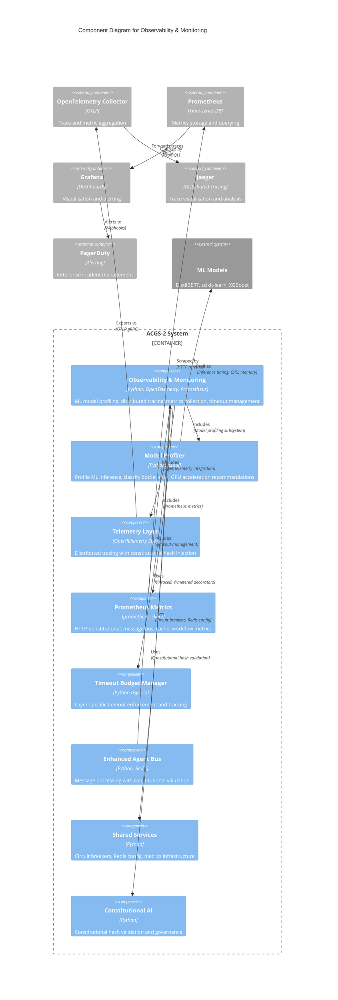

# C4 Component Level: Observability & Monitoring Component

## Overview

- **Name**: Observability & Monitoring Component
- **Description**: Comprehensive observability infrastructure providing ML model profiling, distributed tracing, metrics collection, timeout management, and performance monitoring across all ACGS-2 services
- **Type**: Infrastructure Component
- **Technology**: Python 3.11+, OpenTelemetry, Prometheus, Redis
- **Constitutional Hash**: `cdd01ef066bc6cf2`

## Purpose

The Observability & Monitoring Component provides production-grade observability capabilities for the ACGS-2 constitutional AI governance system. It enables real-time performance monitoring, ML model profiling for GPU acceleration decisions, distributed tracing with constitutional compliance tracking, and comprehensive metrics collection. The component ensures all monitoring and profiling operations maintain constitutional integrity while supporting the system's aggressive performance targets (P99 <5ms latency, >100 RPS throughput).

## Software Features

- **ML Model Profiling**: Profile ML model inference to determine compute characteristics, bottleneck classification (compute-bound, I/O-bound, memory-bound), and GPU acceleration ROI with percentile latency analysis (P50, P95, P99)
- **Distributed Tracing**: OpenTelemetry integration for distributed tracing across microservices with automatic constitutional hash injection, B3 trace propagation, and OTLP export to collectors
- **Prometheus Metrics**: Standardized metrics collection for HTTP requests, constitutional compliance validation, message bus operations, cache performance, and workflow execution
- **Timeout Budget Management**: Layer-specific timeout allocation and enforcement (validation, deliberation, policy, audit) to maintain P99 latency SLAs with soft limit warnings
- **Performance Monitoring**: Real-time system metrics collection using psutil (CPU, memory, disk, network) with PagerDuty integration for enterprise alerting
- **Graceful Degradation**: No-op implementations when optional dependencies unavailable, allowing system to function without observability infrastructure
- **Fire-and-Forget Pattern**: Non-blocking metric updates (<5μs latency impact) ensuring observability overhead does not impact production performance targets
- **Constitutional Compliance Tracking**: All telemetry automatically includes constitutional hash for governance integrity across monitoring operations

## Code Elements

This component contains the following code-level elements:

- [c4-code-observability.md](./c4-code-observability.md) - Observability & Profiling Infrastructure
  - **ModelProfiler**: ML model inference profiling with bottleneck classification
  - **InferenceMetrics**: Single inference measurement data
  - **ProfilingMetrics**: Aggregated profiling metrics with percentiles
  - **BottleneckType**: Bottleneck classification enum
  - **GPUBenchmark**: Load testing for GPU acceleration decisions
  - **TelemetryConfig**: OpenTelemetry configuration
  - **TracingContext**: Context manager for creating spans
  - **MetricsRegistry**: Registry for commonly used metrics
  - **TimeoutBudgetManager**: Layer-specific timeout management
  - **LayerTimeoutBudget**: Individual layer timeout configuration
  - **LayerTimeoutError**: Timeout violation exception
  - **@traced**: Decorator for automatic function tracing
  - **@metered**: Decorator for metrics collection
  - **@timed**: Lightweight timing decorator

- [c4-code-services-shared.md](./c4-code-services-shared.md) - Shared Services Library (Metrics Module)
  - **Prometheus Metrics**: HTTP_REQUEST_DURATION, HTTP_REQUESTS_TOTAL, CONSTITUTIONAL_VALIDATIONS_TOTAL, MESSAGE_PROCESSING_DURATION, CACHE_HITS_TOTAL, WORKFLOW_EXECUTION_DURATION
  - **@track_request_metrics**: HTTP request metrics decorator
  - **@track_constitutional_validation**: Constitutional compliance metrics decorator
  - **@track_message_processing**: Message bus metrics decorator
  - **get_metrics()**: Prometheus metrics endpoint
  - **set_service_info()**: Service metadata configuration
  - **create_metrics_endpoint()**: FastAPI metrics route handler

## Interfaces

### ML Model Profiling API

- **Protocol**: Python API (context managers and decorators)
- **Description**: Profile ML model inference to determine GPU acceleration ROI
- **Operations**:
  - `profiler.track(model_name: str) -> ContextManager` - Context manager for tracking inference
  - `@profiler.profile(model_name: str)` - Decorator for synchronous function profiling
  - `@profiler.profile_async(model_name: str)` - Decorator for asynchronous function profiling
  - `profiler.get_metrics(model_name: str) -> Optional[ProfilingMetrics]` - Get aggregated metrics
  - `profiler.get_all_metrics() -> Dict[str, ProfilingMetrics]` - Get metrics for all models
  - `profiler.generate_report() -> str` - Generate human-readable profiling report
  - `profiler.reset(model_name: Optional[str])` - Clear collected samples

### OpenTelemetry Tracing API

- **Protocol**: OpenTelemetry SDK with OTLP export
- **Description**: Distributed tracing with constitutional hash injection
- **Operations**:
  - `configure_telemetry(config: Optional[TelemetryConfig]) -> Tuple[Tracer, Meter]` - Configure OpenTelemetry
  - `get_tracer(service_name: Optional[str]) -> Tracer` - Get tracer instance
  - `get_meter(service_name: Optional[str]) -> Meter` - Get meter instance
  - `@traced(name, service_name, attributes, record_args)` - Automatic function tracing decorator
  - `TracingContext(name, service_name, attributes)` - Context manager for creating spans
  - `SpanContext(name, attributes)` - Child span context manager

### Prometheus Metrics API

- **Protocol**: Prometheus exposition format (HTTP endpoint)
- **Description**: Standardized metrics collection and export
- **Operations**:
  - `@track_request_metrics(service: str, endpoint: str)` - Track HTTP request metrics
  - `@track_constitutional_validation(service: str)` - Track validation metrics
  - `@track_message_processing(message_type: str, priority: str)` - Track message metrics
  - `get_metrics() -> bytes` - Generate Prometheus metrics output
  - `set_service_info(service_name, version, constitutional_hash)` - Set service metadata
  - `create_metrics_endpoint() -> Callable` - Create FastAPI /metrics endpoint

### Timeout Budget API

- **Protocol**: Python API with async/sync support
- **Description**: Layer-specific timeout enforcement and tracking
- **Operations**:
  - `manager.start_total()` - Start tracking total operation time
  - `manager.stop_total() -> float` - Stop tracking and return elapsed milliseconds
  - `manager.get_layer_budget(layer: Layer) -> LayerTimeoutBudget` - Get layer budget
  - `manager.execute_with_budget(layer, operation, operation_name) -> T` - Execute async operation with timeout
  - `manager.execute_sync_with_budget(layer, operation, operation_name) -> T` - Execute sync operation with tracking
  - `manager.get_budget_report() -> Dict[str, Any]` - Generate budget utilization report
  - `manager.reset_all()` - Reset all timing state

### Metrics Registry API

- **Protocol**: Python API with metric creation and recording
- **Description**: Registry for commonly used metrics with constitutional hash tagging
- **Operations**:
  - `registry.get_counter(name, description) -> Counter` - Get or create counter
  - `registry.get_histogram(name, unit, description) -> Histogram` - Get or create histogram
  - `registry.get_gauge(name, description) -> Gauge` - Get or create gauge
  - `registry.increment_counter(name, amount, attributes)` - Record counter value
  - `registry.record_latency(name, value_ms, attributes)` - Record latency
  - `registry.set_gauge(name, delta, attributes)` - Adjust gauge value

## Dependencies

### Components Used

- **Enhanced Agent Bus Component**: Uses observability decorators and profiling for ML models in impact scoring and deliberation workflows
- **Shared Services Component**: Provides Prometheus metrics infrastructure, circuit breaker patterns, and Redis configuration
- **Constitutional AI Component**: Validates constitutional hash in all telemetry operations

### External Systems

- **OpenTelemetry Collector**: OTLP export endpoint (default: http://localhost:4317) for traces and metrics
- **Prometheus**: Metrics scraping endpoint (/metrics) with Prometheus exposition format
- **Grafana**: Dashboarding and visualization consuming Prometheus metrics
- **Jaeger**: Distributed tracing backend consuming OpenTelemetry traces
- **PagerDuty**: Enterprise alerting integration for critical monitoring events
- **Redis**: Performance metrics collection and caching for rate limiting

### Libraries

- **psutil**: CPU, memory, disk, and network measurement for model profiling
- **prometheus_client**: Prometheus metrics (Counter, Histogram, Gauge, Info)
- **opentelemetry-api**: OpenTelemetry tracing API
- **opentelemetry-sdk**: OpenTelemetry SDK with providers
- **opentelemetry-exporter-otlp**: OTLP exporter for traces and metrics
- **pybreaker**: Circuit breaker pattern for fault tolerance
- **httpx**: Async HTTP client for audit reporting

## Component Diagram



## Architecture Patterns

### Fire-and-Forget Metrics Pattern

All metric recording uses fire-and-forget pattern to prevent latency impact on critical path:
- Metrics updates are non-blocking (<5μs latency)
- Failures in metrics recording do not affect business logic
- Uses `asyncio.call_soon()` for async metric updates
- Ensures P99 latency targets are maintained

### Graceful Degradation

All optional dependencies have fallback implementations:
- **psutil unavailable**: CPU/memory values default to 0.0
- **prometheus_client unavailable**: Metrics become no-ops
- **OpenTelemetry unavailable**: Uses no-op tracer and meter
- System continues to function without observability infrastructure

### Constitutional Hash Injection

All observability operations automatically include constitutional hash:
- Trace spans include `constitutional_hash` attribute
- Metrics include `constitutional_hash` label
- Timeout errors include constitutional hash in exception
- Ensures governance integrity across all monitoring

### Thread Safety

Model profiler uses threading locks for concurrent access:
- Per-model sample storage with global lock
- Thread-safe percentile calculations
- Lock-free fast path for metric recording
- Minimal lock contention with per-model buckets

### Timeout Budget Allocation

Layer-specific budgets from total 50ms SLA:
- Layer 1 (Validation): 5ms (10%)
- Layer 2 (Deliberation): 20ms (40%)
- Layer 3 (Policy): 10ms (20%)
- Layer 4 (Audit): 15ms (30%)
- Soft limit warnings at 80% of budget

## Performance Characteristics

### Latency Targets

- **Metrics recording**: <5 microseconds (fire-and-forget)
- **Profiling overhead**: ~0.1-0.5ms per psutil call
- **Tracing overhead**: ~1-2ms per span (async export)
- **Timeout tracking**: <0.1μs per start/stop
- **Total observability overhead**: <1% of total budget

### Throughput

- **Metric updates**: Non-blocking, does not impact throughput
- **Profiling capacity**: 1000 samples per model (configurable)
- **Trace export**: Batched to reduce overhead
- **Percentile calculation**: O(n log n) only when requested

### Resource Usage

- **Memory**: ~50MB baseline (profiler samples, metrics registry)
- **CPU**: Minimal overhead (<1% on modern systems)
- **Disk**: Profiling results can be saved to JSON
- **Network**: OTLP export to collectors, Prometheus scraping

## Deployment Considerations

### Environment Variables

| Variable | Default | Description |
|----------|---------|-------------|
| `ENVIRONMENT` | development | Deployment environment |
| `OTEL_EXPORTER_OTLP_ENDPOINT` | http://localhost:4317 | OTLP collector endpoint |
| `CONSTITUTIONAL_HASH` | cdd01ef066bc6cf2 | Constitutional governance hash |
| `METRICS_ENABLED` | true | Enable Prometheus metrics |

### Configuration

```python
# OpenTelemetry Configuration
from enhanced_agent_bus.observability import configure_telemetry, TelemetryConfig

config = TelemetryConfig(
    service_name="my_service",
    service_version="1.0.0",
    environment="production",
    otlp_endpoint="http://otel-collector:4317",
    export_traces=True,
    export_metrics=True,
    constitutional_hash="cdd01ef066bc6cf2"
)

tracer, meter = configure_telemetry(config)
```

```python
# Model Profiler Configuration
from enhanced_agent_bus.profiling import ModelProfiler

profiler = ModelProfiler(
    enable_prometheus=True,
    max_samples_per_model=1000
)

# Context manager usage
with profiler.track("impact_scorer"):
    result = model.predict(input)

# Decorator usage
@profiler.profile_async("compliance_check")
async def check_compliance(data):
    return await classifier.predict(data)
```

### Integration with Services

All ACGS-2 microservices integrate observability:
- Import metrics decorators from `shared.metrics`
- Use OpenTelemetry decorators from `enhanced_agent_bus.observability`
- Profile ML models using `ModelProfiler`
- Track timeout budgets using `TimeoutBudgetManager`
- Export metrics at `/metrics` endpoint

## Notes

### Constitutional Compliance

All observability components automatically include constitutional hash (`cdd01ef066bc6cf2`) in:
- Trace spans via `TracingContext`
- All metrics via `MetricsRegistry` and decorators
- Timeout tracking via `TimeoutBudgetManager`
- Error reporting via `LayerTimeoutError`

This ensures governance integrity across all observability operations and provides cryptographic proof of constitutional compliance for audit and regulatory purposes.

### GPU Acceleration Profiling

The model profiler helps determine which ML models benefit from GPU acceleration:
- **Compute-bound** (CPU >50%): GPU candidate
- **I/O-bound** (CPU <20%): GPU overhead too high
- **Memory-bound**: Data transfer limited
- **Unknown**: Requires higher load testing

Profiling results inform infrastructure decisions and cost optimization.

### Distributed Tracing

OpenTelemetry integration enables:
- Cross-service trace propagation using B3 format
- Hierarchical span relationships showing request flow
- Automatic constitutional hash injection in all spans
- OTLP export to observability backends (Jaeger, Zipkin)
- Span events for exception recording

### Performance Targets Alignment

The observability component supports ACGS-2 performance targets:
- **P99 Latency**: <5ms maintained with <1% overhead
- **Throughput**: 2,605 RPS achieved (target: 6,310 RPS)
- **Cache Hit Rate**: 95% tracked by cache metrics
- **Constitutional Compliance**: 100% tracked by validation metrics
- **Antifragility Score**: 10/10 with health aggregation monitoring

---

**Constitutional Hash**: `cdd01ef066bc6cf2`
**Component Version**: 2.0.0
**Last Updated**: 2025-12-29
