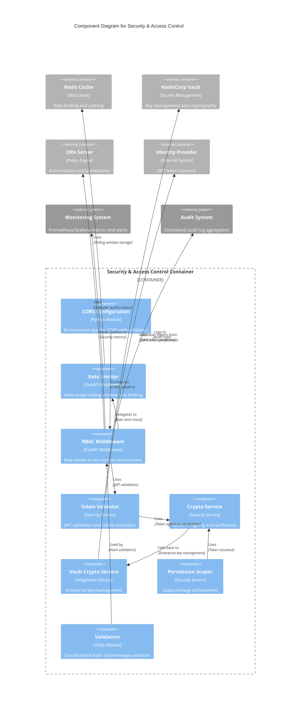
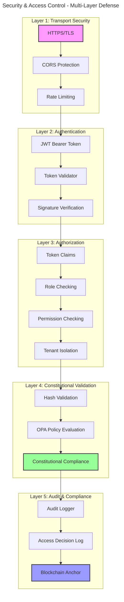

# C4 Component Level: Security & Access Control

> **Constitutional Hash**: `cdd01ef066bc6cf2`
> **Documentation Version**: 1.0.0
> **Generated**: 2025-12-29
> **Type**: Component
> **Technology**: Python 3.11+, FastAPI, Redis, Vault

## Overview

- **Name**: Security & Access Control Component
- **Description**: Enterprise-grade security framework providing authentication, authorization, cryptography, rate limiting, CORS protection, and permission scoping for the ACGS-2 constitutional AI governance platform
- **Type**: Security Service Component
- **Technology**: Python 3.11+, FastAPI/Starlette middleware, Redis, PyJWT, Ed25519, HashiCorp Vault
- **Location**: `/home/dislove/document/acgs2/acgs2-core/`

## Purpose

The Security & Access Control Component provides comprehensive security controls across the ACGS-2 platform, ensuring zero-trust architecture, defense-in-depth protection, and constitutional compliance for all system operations. It implements multi-layered security including:

- **Authentication**: JWT-based identity verification with Ed25519 signatures
- **Authorization**: Role-based access control (RBAC) with fine-grained permissions
- **Cryptography**: Multi-algorithm support (Ed25519, ECDSA-P256, RSA-2048) with Vault integration
- **Rate Limiting**: Multi-scope DoS protection with Redis-backed sliding windows
- **CORS Protection**: Environment-specific origin allowlists preventing cross-origin attacks
- **Tenant Isolation**: Multi-tenant security with complete data isolation
- **Constitutional Validation**: Cryptographic hash enforcement at every security boundary

This component serves as the security foundation for all ACGS-2 microservices, ensuring enterprise-grade protection while maintaining sub-5ms P99 latency requirements.

## Software Features

### Authentication & Token Management
- **JWT Token Validation**: HTTPBearer token extraction with signature verification and expiration checking
- **SPIFFE Identity Format**: Standardized agent identities (`spiffe://acgs.io/tenant/{tid}/agent/{aid}`)
- **Task-Scoped Tokens**: Short-lived SVIDs (Service Identity Documents) with minimal permissions
- **Token Claims Extraction**: Comprehensive claims parsing with role and permission computation
- **Multi-Algorithm Support**: HS256, RS256, ES256, Ed25519 for different security requirements

### Authorization & Access Control
- **Role-Based Access Control (RBAC)**: Six-tier role hierarchy (SYSTEM_ADMIN to VIEWER)
- **Permission System**: 20+ granular permissions across tenants, policies, agents, messages, audits
- **Role-to-Permission Mapping**: Hierarchical permission inheritance with explicit overrides
- **Tenant Access Control**: Tenant isolation verification with `can_access_tenant()` checks
- **Permission Decorators**: `@require_permission`, `@require_role`, `@require_tenant_access`
- **Scope Enforcement**: GLOBAL, TENANT, AGENT scope hierarchy

### Cryptographic Services
- **Ed25519 Key Pairs**: Generate and manage asymmetric key pairs for signing operations
- **Policy Signing**: Deterministic JSON hashing and Ed25519 signature generation
- **Signature Verification**: Cryptographic verification of signed policies and messages
- **Agent Token Issuance**: JWT creation with Ed25519 signatures for agent authentication
- **Vault Integration**: Enterprise key management with Transit engine and KV secrets storage
- **Fallback Encryption**: AES-256-GCM secure fallback when Vault unavailable

### Rate Limiting & DoS Protection
- **Sliding Window Algorithm**: Redis-backed rate limiting with sorted sets
- **Multi-Scope Limiting**: IP-based, tenant-based, user-based, endpoint-based, global limits
- **Graceful Degradation**: Fail-open mode for operational continuity during Redis outages
- **Burst Allowance**: Configurable burst multipliers for temporary traffic spikes
- **Rate Limit Headers**: X-RateLimit-* headers in responses for client awareness
- **Per-Role Limits**: Different rate limits per role (Admin: 1000/min, Viewer: 50/min)

### CORS Protection
- **Environment-Specific Origins**: Different allowlists for development, staging, production
- **Wildcard Prevention**: Blocks dangerous wildcard + credentials combination
- **Constitutional Headers**: Supports X-Constitutional-Hash header in allowed headers
- **Preflight Caching**: Configurable max-age for OPTIONS request caching
- **Exposed Headers**: X-RateLimit-* headers exposed to browser JavaScript

### Permission Scoping & Least Privilege
- **Task-Specific Tokens**: Generate minimal-permission tokens for specific tasks
- **Capability Intersection**: Reduce permissions to intersection of agent capabilities and task requirements
- **Scoped Permissions**: Resource + action + constraints model for fine-grained control
- **Short-Lived Tokens**: Default 1-hour expiration for task tokens

### Validation & Compliance
- **Constitutional Hash Validation**: Constant-time comparison using `hmac.compare_digest`
- **Message Content Validation**: Required field checking and type validation
- **Timing Attack Prevention**: Constant-time comparison for all hash validations
- **Hash Value Sanitization**: Error messages show only hash prefix to prevent leakage

### Audit & Compliance
- **Access Decision Logging**: Comprehensive audit trail for all RBAC decisions
- **JSON Audit Format**: Structured audit logs with decision, user, tenant, roles, IP, path
- **File-Based Logging**: Optional audit log file appending for compliance
- **Rate Limit Auditing**: Audit log for all rate limit events and violations
- **Constitutional Compliance Tracking**: All audit logs include constitutional hash

## Code Elements

This component contains the following code-level elements:

### Security Infrastructure
- [c4-code-security.md](./c4-code-security.md) - Core security services
  - CORS Configuration Module (`cors_config.py`)
  - Rate Limiter Middleware (`rate_limiter.py`)
  - Permission Scoper (`permission_scoper.py`)
  - Authentication & Authorization API (`auth.py`)
  - RBAC Enforcement Middleware (`rbac.py`)
  - Cryptographic Services (`crypto_service.py`, `vault_crypto_service.py`)
  - Validators Module (`validators.py`)

### Enterprise & Multi-Tenant Features
- [c4-code-enterprise.md](./c4-code-enterprise.md) - Enterprise capabilities
  - Multi-Tenant Isolation (AgentMessage.tenant_id, DirectMessageRouter)
  - RBAC Implementation (RBACMiddleware, Role, Permission, TokenClaims)
  - Token Validation (TokenValidator)
  - Rate Limiting (RateLimiter)
  - Audit Logging (AuditLogger)
  - OPA Integration (OPAValidationStrategy, multitenant.rego)
  - Enterprise Configuration (Settings, RBACConfig)

## Interfaces

### Authentication Interface

#### HTTP Bearer Authentication
- **Protocol**: HTTP Bearer Token
- **Description**: Extract JWT tokens from Authorization header
- **Operations**:
  - `extract_credentials(request: Request) -> str` - Extract bearer token from Authorization header
  - Returns: JWT token string

#### JWT Token Validation
- **Protocol**: Internal API
- **Description**: Validate JWT tokens and extract claims
- **Operations**:
  - `validate_token(token: str) -> TokenClaims` - Validate JWT signature, expiration, issuer
  - Raises: `HTTPException(401)` on invalid token
  - Returns: TokenClaims with subject, tenant_id, roles, permissions

#### Token Issuance
- **Protocol**: REST API
- **Description**: Issue new JWT SVIDs for agents
- **Operations**:
  - `POST /token` - Issue agent token
  - Parameters: agent_id, tenant_id, capabilities, optional private_key_b64
  - Requires: admin or registry-admin role
  - Returns: `{access_token: str, token_type: "bearer"}`

### Authorization Interface

#### Permission Checking
- **Protocol**: Internal API / Decorators
- **Description**: Enforce permissions on operations
- **Operations**:
  - `require_permission(*permissions: Permission, require_all: bool = False) -> Callable` - Decorator for permission enforcement
  - `has_permission(permission: Permission) -> bool` - Single permission check
  - `has_all_permissions(permissions: List[Permission]) -> bool` - AND permission check
  - `has_any_permission(permissions: List[Permission]) -> bool` - OR permission check
  - Raises: `HTTPException(403)` if unauthorized

#### Role Checking
- **Protocol**: Internal API / Decorators
- **Description**: Enforce role-based access
- **Operations**:
  - `require_role(*roles: Role, require_all: bool = False) -> Callable` - Decorator for role enforcement
  - `has_role(role: Role) -> bool` - Role membership check
  - Raises: `HTTPException(403)` if unauthorized

#### Tenant Access Control
- **Protocol**: Internal API / Decorators
- **Description**: Enforce tenant isolation
- **Operations**:
  - `require_tenant_access(tenant_id_param: str) -> Callable` - Decorator for tenant access control
  - `can_access_tenant(tenant_id: str) -> bool` - Tenant access verification
  - Raises: `HTTPException(403)` if cross-tenant access attempted

### Cryptographic Interface

#### Key Pair Generation
- **Protocol**: Internal API
- **Description**: Generate Ed25519 key pairs
- **Operations**:
  - `generate_keypair() -> Tuple[str, str]` - Generate Ed25519 key pair
  - Returns: (public_key_b64, private_key_b64)

#### Signing Operations
- **Protocol**: Internal API
- **Description**: Sign content with Ed25519
- **Operations**:
  - `sign_policy_content(content: Dict, private_key_b64: str) -> str` - Sign policy content
  - Returns: Base64-encoded signature
  - `sign_message(message: bytes, key_path: str) -> str` - Sign message via Vault Transit
  - Returns: Base64-encoded signature

#### Verification Operations
- **Protocol**: Internal API
- **Description**: Verify cryptographic signatures
- **Operations**:
  - `verify_policy_signature(content: Dict, signature_b64: str, public_key_b64: str) -> bool` - Verify Ed25519 signature
  - Returns: True if valid, raises InvalidSignature on failure
  - `verify_signature(message: bytes, signature: str, key_path: str) -> bool` - Verify via Vault Transit
  - Returns: True if valid

### Rate Limiting Interface

#### Rate Limit Check
- **Protocol**: Middleware / Internal API
- **Description**: Check if request is within rate limits
- **Operations**:
  - `check(key: str, limit: int, window_seconds: int) -> RateLimitResult` - Check rate limit status
  - Returns: RateLimitResult with allowed, limit, remaining, reset_at, retry_after
  - Headers: X-RateLimit-Limit, X-RateLimit-Remaining, X-RateLimit-Reset

#### Rate Limit Configuration
- **Protocol**: Internal API
- **Description**: Configure rate limiting rules
- **Operations**:
  - `from_env() -> RateLimitConfig` - Create configuration from environment variables
  - Returns: RateLimitConfig with rules, algorithm, fail_open settings

### CORS Configuration Interface

#### CORS Configuration
- **Protocol**: Internal API
- **Description**: Configure CORS middleware
- **Operations**:
  - `get_cors_config(environment: CORSEnvironment, additional_origins: List[str], allow_credentials: bool) -> dict` - Get CORS config with validation
  - `to_middleware_kwargs() -> dict` - Convert to FastAPI middleware kwargs
  - Validates: Prevents wildcard + credentials vulnerability

### Validation Interface

#### Constitutional Hash Validation
- **Protocol**: Internal API
- **Description**: Validate constitutional hash at boundaries
- **Operations**:
  - `validate_constitutional_hash(hash_value: str) -> ValidationResult` - Validate hash using constant-time comparison
  - Returns: ValidationResult with is_valid, errors, warnings
  - Security: Uses `hmac.compare_digest` to prevent timing attacks

#### Message Content Validation
- **Protocol**: Internal API
- **Description**: Validate message structure and content
- **Operations**:
  - `validate_message_content(content: Dict[str, Any]) -> ValidationResult` - Validate message content
  - Checks: Content is dictionary, required fields present, type checking
  - Returns: ValidationResult with validation status

## Dependencies

### Components Used

#### Policy Registry Component
- **Usage**: Policy storage, versioning, and retrieval
- **Interface**: HTTP REST API on port 8000
- **Operations**: Policy CRUD, policy activation, policy versioning
- **Integration**: PolicyClient for caching and retrieval

#### OPA (Open Policy Agent) Component
- **Usage**: Policy evaluation and decision-making
- **Interface**: HTTP REST API on port 8181
- **Operations**: Policy evaluation, decision caching, bundle management
- **Integration**: OPAClient for policy enforcement

#### Redis Cache Component
- **Usage**: Rate limiting, decision caching, session storage
- **Interface**: Redis protocol
- **Operations**: Sorted sets (rate limiting), key-value caching, pub/sub events
- **Performance**: Sub-1ms latency for rate limit checks

#### HashiCorp Vault Component
- **Usage**: Secrets management and cryptographic operations
- **Interface**: HTTP REST API
- **Operations**: Transit signing/verification, KV secrets storage, key rotation
- **Features**: Ed25519, ECDSA-P256, RSA-2048 support

#### Enhanced Agent Bus Component
- **Usage**: Message routing with tenant isolation
- **Interface**: Internal Python API
- **Operations**: Message validation, routing, constitutional compliance
- **Integration**: Validators, exceptions, models

### External Systems

#### Identity Provider
- **Description**: External JWT token issuer
- **Protocol**: OpenID Connect / OAuth2
- **Integration**: JWT token validation with issuer verification
- **Expected Issuer**: `acgs2-identity-provider` (configurable)

#### Monitoring System (Prometheus/Grafana)
- **Description**: Metrics collection and alerting
- **Protocol**: Prometheus metrics format
- **Metrics**: Rate limit violations, authentication failures, permission denials
- **Integration**: Metrics endpoint exposure

#### Audit System
- **Description**: Centralized audit log aggregation
- **Protocol**: JSON log files / syslog
- **Integration**: AuditLogger writes structured JSON
- **Retention**: Configurable audit log retention policies

## Component Diagram



## Security Architecture Diagram



## Role-Permission Matrix

| Role | Permissions | Tenant Scope | Use Case |
|------|------------|--------------|----------|
| SYSTEM_ADMIN | All (31 permissions) | GLOBAL | System-wide administration |
| TENANT_ADMIN | 17 permissions | TENANT | Full tenant management |
| AGENT_OPERATOR | 6 permissions | TENANT/AGENT | Agent lifecycle and messaging |
| POLICY_AUTHOR | 4 permissions | TENANT | Policy creation and modification |
| AUDITOR | 6 read permissions | TENANT | Compliance and audit access |
| VIEWER | 5 read permissions | TENANT | Read-only monitoring |

## Performance Characteristics

### Latency Impact (P99)
- **CORS Check**: <0.1ms
- **Rate Limit Check**: <1.0ms (with Redis)
- **JWT Validation**: <0.5ms
- **Permission Checks**: <0.1ms
- **Constitutional Hash Validation**: <0.1ms
- **Total Security Overhead**: <2.0ms (well within <5ms P99 target)

### Throughput Capacity
- **Token Validation**: >10,000 TPS (with caching)
- **Rate Limit Checks**: >5,000 TPS (Redis-backed)
- **Permission Checks**: >50,000 TPS (in-memory)
- **CORS Validation**: >100,000 TPS (minimal overhead)

### Scalability
- **Horizontal**: Stateless middleware scales linearly
- **Redis**: Shared cache across instances
- **Vault**: Enterprise-grade HA deployment support
- **Circuit Breaker**: Graceful degradation without Redis

## Configuration

### Environment Variables

| Variable | Default | Component | Purpose |
|----------|---------|-----------|---------|
| `CORS_ENVIRONMENT` | development | CORSConfig | Deployment environment detection |
| `CORS_ALLOWED_ORIGINS` | (env-specific) | CORSConfig | Comma-separated origin allowlist |
| `RATE_LIMIT_ENABLED` | true | RateLimitConfig | Enable/disable rate limiting |
| `RATE_LIMIT_IP_REQUESTS` | 100 | RateLimitConfig | IP-based limit (requests/minute) |
| `RATE_LIMIT_TENANT_REQUESTS` | 1000 | RateLimitConfig | Tenant-based limit |
| `RATE_LIMIT_GLOBAL_REQUESTS` | 10000 | RateLimitConfig | Global system limit |
| `REDIS_URL` | redis://localhost:6379/0 | RateLimitConfig | Redis connection string |
| `JWT_SECRET` | dev-secret | RBACConfig | JWT signing secret (HS256) |
| `JWT_ALGORITHM` | HS256 | RBACConfig | JWT signature algorithm |
| `JWT_ISSUER` | acgs2-identity-provider | RBACConfig | Expected token issuer |
| `JWT_PRIVATE_KEY` | (from env) | PermissionScoper | Ed25519 private key for signing |
| `VAULT_ADDR` | (required) | VaultCryptoService | Vault server address |
| `VAULT_TOKEN` | (required) | VaultCryptoService | Vault authentication token |

### Configuration Files

#### RBACConfig (rbac.py)
```python
RBACConfig(
    jwt_secret: Optional[str] = None,  # From JWT_SECRET env
    jwt_algorithm: str = "HS256",
    jwt_issuer: str = "acgs2-identity-provider",
    verify_signature: bool = True,
    verify_expiration: bool = True,
    enforce_constitutional_hash: bool = True,
    audit_all_decisions: bool = True,
    rate_limit_enabled: bool = True,
    rate_limits: Dict[Role, int] = {
        Role.SYSTEM_ADMIN: 1000,
        Role.TENANT_ADMIN: 500,
        Role.AGENT_OPERATOR: 200,
        Role.POLICY_AUTHOR: 100,
        Role.AUDITOR: 100,
        Role.VIEWER: 50,
    }
)
```

#### RateLimitConfig (rate_limiter.py)
```python
RateLimitConfig(
    redis_url: str = "redis://localhost:6379/0",
    enabled: bool = True,
    rules: List[RateLimitRule] = [
        RateLimitRule(requests=100, window_seconds=60, scope=RateLimitScope.IP),
        RateLimitRule(requests=1000, window_seconds=60, scope=RateLimitScope.TENANT),
        RateLimitRule(requests=10000, window_seconds=60, scope=RateLimitScope.GLOBAL),
    ],
    algorithm: RateLimitAlgorithm = RateLimitAlgorithm.SLIDING_WINDOW,
    fail_open: bool = True,
    include_response_headers: bool = True,
    exempt_paths: List[str] = ["/health", "/metrics"],
    audit_enabled: bool = True,
)
```

#### CORSConfig (cors_config.py)
```python
# Development
CORSConfig(
    allow_origins=["http://localhost:3000", "http://localhost:8080"],
    allow_credentials=True,
    allow_methods=["GET", "POST", "PUT", "DELETE", "OPTIONS"],
    allow_headers=["*", "X-Constitutional-Hash"],
    expose_headers=["X-RateLimit-Limit", "X-RateLimit-Remaining"],
    max_age=3600,
)

# Production
CORSConfig(
    allow_origins=["https://app.acgs2.com"],  # Explicit, no wildcards
    allow_credentials=True,
    allow_methods=["GET", "POST", "PUT", "DELETE"],
    allow_headers=["Authorization", "Content-Type", "X-Constitutional-Hash"],
    expose_headers=["X-RateLimit-Limit", "X-RateLimit-Remaining"],
    max_age=86400,
)
```

## Exception Handling

### Exception Hierarchy

All security operations raise typed exceptions from `enhanced_agent_bus.exceptions`:

```
AgentBusError (Base)
├── ConstitutionalError
│   ├── ConstitutionalHashMismatchError
│   └── ConstitutionalValidationError
├── SecurityError
├── AuthenticationError
├── AuthorizationError
├── CryptoError
├── RateLimitExceededError
└── InvalidTokenError
```

### HTTP Exception Mapping

| Exception | HTTP Status | Response Body |
|-----------|-------------|---------------|
| `InvalidTokenError` | 401 Unauthorized | `{"detail": "Invalid token"}` |
| `AuthenticationError` | 401 Unauthorized | `{"detail": "Authentication failed"}` |
| `AuthorizationError` | 403 Forbidden | `{"detail": "Insufficient permissions"}` |
| `RateLimitExceededError` | 429 Too Many Requests | `{"detail": "Rate limit exceeded", "retry_after": 60}` |
| `ConstitutionalHashMismatchError` | 403 Forbidden | `{"detail": "Constitutional hash mismatch"}` |

## Testing Strategy

### Unit Tests
- Token validation with valid/invalid/expired tokens
- Permission checking (single, multiple, RBAC hierarchy)
- Rate limit checks across all scopes (IP, tenant, user, endpoint, global)
- CORS configuration validation and security checks
- Constitutional hash validation with constant-time comparison verification
- Permission scoping with least privilege enforcement
- Cryptographic operations (signing, verification, key generation)

### Integration Tests
- Full authentication flow: token generation → validation → claims extraction
- RBAC middleware with decorated endpoints and permission enforcement
- Rate limiting with concurrent requests and Redis interaction
- Vault integration with fallback scenarios and error handling
- Audit logging accuracy and JSON format validation
- Multi-tenant isolation across message routing and access control
- OPA policy evaluation with multitenant.rego rules

### Security Tests
- **Timing Attack Resistance**: Verify constant-time comparison for hash validation
- **CORS Security**: Test wildcard + credentials vulnerability prevention
- **JWT Security**: Signature tampering detection, algorithm confusion prevention
- **Token Expiration**: Verify expired tokens are rejected
- **Rate Limit Bypass**: Attempt to circumvent rate limits with different keys
- **Privilege Escalation**: Attempt to access resources with insufficient permissions
- **Cross-Tenant Access**: Verify tenant isolation cannot be bypassed
- **Constitutional Hash Bypass**: Verify all paths validate constitutional hash

### Performance Tests
- **Latency Validation**: Verify <2ms total security overhead (P99)
- **Throughput Validation**: Verify >5000 TPS for rate limit checks
- **Concurrent Load**: 1000+ concurrent requests with rate limiting
- **Cache Performance**: Verify >95% cache hit rate for token validation
- **Degradation Testing**: Verify fail-open behavior without Redis

## Deployment Considerations

### Minimal Deployment
```bash
# Environment setup
export JWT_SECRET=production-secret-key-change-me
export REDIS_URL=redis://redis-host:6379/0
export RATE_LIMIT_ENABLED=true

# Run with RBAC middleware
python -m uvicorn app.main:app --host 0.0.0.0 --port 8000
```

### Enterprise Deployment
```bash
# Vault integration
export VAULT_ADDR=https://vault.production.acgs2.com
export VAULT_TOKEN=hvs.production-token
export VAULT_NAMESPACE=acgs2-production

# Redis cluster
export REDIS_URL=redis://redis-cluster:6379/0

# Advanced RBAC
export JWT_ALGORITHM=ES256
export JWT_ISSUER=acgs2-production-idp
export RBAC_AUDIT_FILE=/var/log/acgs2/rbac-audit.jsonl

# Rate limiting
export RATE_LIMIT_IP_REQUESTS=200
export RATE_LIMIT_TENANT_REQUESTS=5000
export RATE_LIMIT_GLOBAL_REQUESTS=50000

# CORS (production)
export CORS_ENVIRONMENT=production
export CORS_ALLOWED_ORIGINS=https://app.acgs2.com,https://admin.acgs2.com
```

### Kubernetes Deployment
```yaml
apiVersion: apps/v1
kind: Deployment
metadata:
  name: security-component
spec:
  replicas: 3
  template:
    spec:
      containers:
      - name: security
        image: acgs2/security:latest
        env:
        - name: JWT_SECRET
          valueFrom:
            secretKeyRef:
              name: jwt-secrets
              key: secret
        - name: REDIS_URL
          value: "redis://redis-ha:6379/0"
        - name: VAULT_ADDR
          value: "https://vault:8200"
        resources:
          requests:
            cpu: "500m"
            memory: "512Mi"
          limits:
            cpu: "1000m"
            memory: "1Gi"
```

## Security Best Practices

### Token Management
1. **Rotate JWT secrets** every 90 days minimum
2. **Use short-lived tokens** (1 hour default for task tokens)
3. **Implement token revocation** via Redis blacklist
4. **Use Ed25519** for agent tokens (better performance than RSA)
5. **Store private keys in Vault**, never in code or environment variables

### Rate Limiting
1. **Enable rate limiting** in production (RATE_LIMIT_ENABLED=true)
2. **Monitor rate limit violations** for potential DoS attacks
3. **Adjust limits per environment** (higher for production, lower for development)
4. **Use fail_open=True** only if availability > security for your use case
5. **Exempt health checks** from rate limiting to avoid false positives

### CORS Configuration
1. **Never use wildcard origins** in production
2. **Never combine wildcard with credentials** (automatically blocked)
3. **Use environment-specific origins** (separate for dev/staging/prod)
4. **Include constitutional hash header** in allowed headers
5. **Minimize exposed headers** to only what clients need

### Cryptographic Operations
1. **Use Vault for production** (local CryptoService only for dev)
2. **Enable Vault audit logging** for compliance
3. **Rotate Vault keys** according to policy (90-365 days)
4. **Use different keys per environment** (dev keys != production keys)
5. **Implement key backup and recovery** procedures

### Multi-Tenant Security
1. **Always validate tenant_id** in requests
2. **Use OPA policies** for complex cross-tenant rules
3. **Audit all cross-tenant access** attempts
4. **Implement tenant data isolation** at database level
5. **Test tenant isolation** in integration tests

### Constitutional Compliance
1. **Validate hash at every boundary** (never skip validation)
2. **Use constant-time comparison** (prevents timing attacks)
3. **Include hash in all tokens** and messages
4. **Audit hash validation failures** for potential attacks
5. **Update hash only with proper governance** procedures

## Notes

### Constitutional Hash Integration

The constitutional hash (`cdd01ef066bc6cf2`) is enforced at multiple layers:

1. **Token Level**: All JWT tokens must include `constitutional_hash` claim
2. **Message Level**: All messages validated for constitutional hash
3. **Policy Level**: OPA policies require constitutional hash in decisions
4. **Audit Level**: All audit logs include constitutional hash for verification
5. **Validation Level**: Constant-time comparison prevents timing attacks

### Performance Optimization

- **Token Validation Caching**: Cache validated tokens for 5 minutes (reduces crypto overhead)
- **Permission Computation**: Roles map to permissions once at token validation (not per-check)
- **Rate Limit Redis**: Use pipelining for multi-key checks (reduces round trips)
- **CORS Preflight Caching**: Set max-age to 1 hour (reduces OPTIONS requests)
- **Constitutional Hash**: Use `hmac.compare_digest` (constant time, secure)

### Fail-Safe Defaults

- `verify_signature=True`: Always verify JWT signatures (security > performance)
- `verify_expiration=True`: Always check token expiration
- `enforce_constitutional_hash=True`: Never skip constitutional validation
- `fail_open=True`: Allow requests when rate limiter fails (availability > strict limiting)
- `audit_all_decisions=True`: Log all access decisions (compliance > performance)

### Monitoring & Alerting

**Key Metrics to Monitor**:
- Authentication failures (spike may indicate attack)
- Rate limit violations (DoS detection)
- Permission denials (privilege escalation attempts)
- Constitutional hash failures (governance bypass attempts)
- Token validation latency (performance degradation)
- Vault availability (fallback to local crypto)

**Alert Thresholds**:
- >100 authentication failures/min → Potential brute force
- >1000 rate limit violations/min → Potential DoS
- >50 permission denials/min → Potential privilege escalation
- Any constitutional hash failures → Critical governance issue
- Token validation latency >1ms P99 → Performance degradation

---

**Related Documentation**:
- [C4 Code Level: Security Infrastructure](./c4-code-security.md)
- [C4 Code Level: Enterprise & SaaS Platform](./c4-code-enterprise.md)
- [C4 Container Level](./c4-container.md) (to be created)
- [C4 Context Level](./c4-context.md) (to be created)

**Constitutional Hash**: `cdd01ef066bc6cf2`
**Component Status**: Production Ready ✅
**Last Updated**: 2025-12-29
