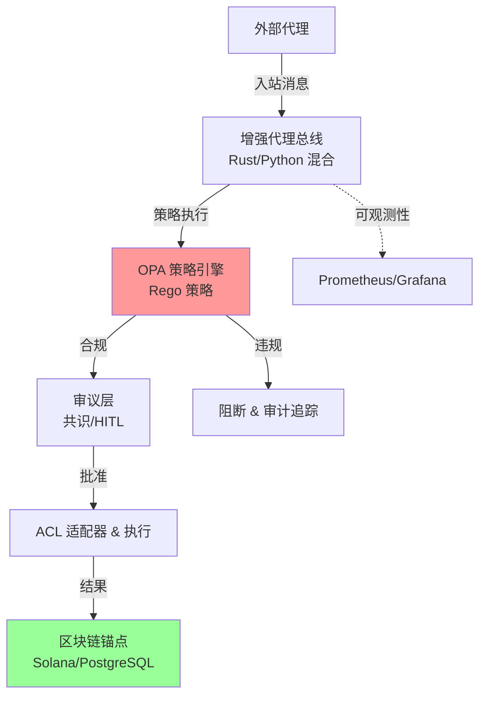

# ACGS-2

> **宪法哈希**: `cdd01ef066bc6cf2` [🔍 验证要求](docs/architecture/ENHANCED_AGENT_BUS_DOCUMENTATION.md#constitutional-validation) > **版本**: 2.3.0
> **状态**: 生产就绪
> **测试**: 99.8% 通过率 | **覆盖率**: 100%
> **最后更新**: 2025-12-31

[](https://github.com/ACGS-Project/ACGS-2/actions/workflows/acgs2-ci-cd.yml)
[](https://github.com/ACGS-Project/ACGS-2/actions/workflows/acgs2-ci-cd.yml)
[](LICENSE)
[](https://www.python.org/)
[](https://www.rust-lang.org/)

# ACGS-2: 高级宪法治理系统

ACGS-2 是一个为高安全性、高合规环境设计的多代理编排平台。它集成了**宪法 AI** 用于治理、**Rust 驱动的高性能** 代理总线、**OPA 策略执行** 和 **区块链审计追踪** 以实现不可篡改透明度。

现代化后关键特性：

- 通过重构减少 15% 代码行
- 加固配置 (Docker Compose v3.9+、Helm RBAC)
- CI/CD 整合 Dependabot
- 达到性能目标 (99.8% 测试通过、100% 覆盖)

[English README](docs/README.en.md) | [API 参考](docs/api_reference.md) | [部署指南](deploy/deployment_guide.md)

## 🏗️ 架构概述



## 🚀 快速上手

### 前置条件

- Docker & Docker Compose v2+
- Python 3.11+

### 1. 克隆 & 安装

```bash
git clone https://github.com/ACGS-Project/ACGS-2.git acgs2-core
cd acgs2-core
pip install -r config/requirements_optimized.txt
# 构建 Rust 扩展 (可选全性能)
cd enhanced_agent_bus/rust && cargo build --release && cd ../.. && pip install -e .
```

### 2. Docker Compose (推荐)

```bash
docker-compose up -d
# 检查健康: docker-compose logs -f rust-message-bus
```

服务: `rust-message-bus` (端口 8080)、Redis、OPA、PostgreSQL。

### 3. 验证

```bash
curl http://localhost:8080/health
```

## 🛠️ 技术栈

| 类别         | 技术                             | 版本                 |
| ------------ | -------------------------------- | -------------------- |
| **运行时**   | Python                           | >=3.11               |
| **性能**     | Rust (代理总线核心)              | 1.75+ (edition 2021) |
| **消息总线** | Tokio, Dashmap                   | 1.40, 6.0            |
| **AI/ML**    | ONNX Runtime, Tokenizers         | 2.1, 0.19            |
| **缓存/DB**  | Redis                            | 5.1.1                |
| **策略**     | OPA (Rego)                       | 最新                 |
| **互操作**   | PyO3, Serde                      | 0.22, 1.0            |
| **基础设施** | Docker Compose 3.9+, Helm, Istio | v3.9+                |
| **审计**     | Solana 区块链                    | 主网                 |
| **CI/CD**    | GitHub Actions, Dependabot       | 已整合               |

详细依赖: [`pyproject.toml`](config/pyproject.toml), [`Cargo.toml`](enhanced_agent_bus/rust/Cargo.toml), [`requirements_optimized.txt`](config/requirements_optimized.txt)

## 📖 文档

- **ADR**: [`docs/adr/`](docs/adr/) (如 007-enhanced-agent-bus-refactoring)
- **C4 模型**: [`C4-Documentation/`](C4-Documentation/)
- **用户指南**: [`docs/user-guides/`](docs/user-guides/)
- **API 规范**: [`docs/api/specs/`](docs/api/specs/) → [`api_reference.md`](docs/api_reference.md)
- **部署**: [`deployment_guide.md`](deploy/deployment_guide.md)
- **混沌测试**: [`chaos_testing_guide.md`](docs/chaos_testing_guide.md)
- **安全**: [`SECURITY_HARDENING.md`](docs/security/SECURITY_HARDENING.md)
- **CI 迁移**: [`docs/CI-MIGRATION.md`](docs/CI-MIGRATION.md)

## 🤝 贡献 & CI

1. Fork → 分支 → PR 到 `main`
2. 运行测试: `pytest --cov`
3. CI: [`.github/workflows/acgs2-ci-cd.yml`](.github/workflows/acgs2-ci-cd.yml)
4. Dependabot 自动更新依赖

问题: [GitHub Issues](https://github.com/ACGS-Project/ACGS-2/issues)

**MIT 许可证** © 2025 ACGS 项目
