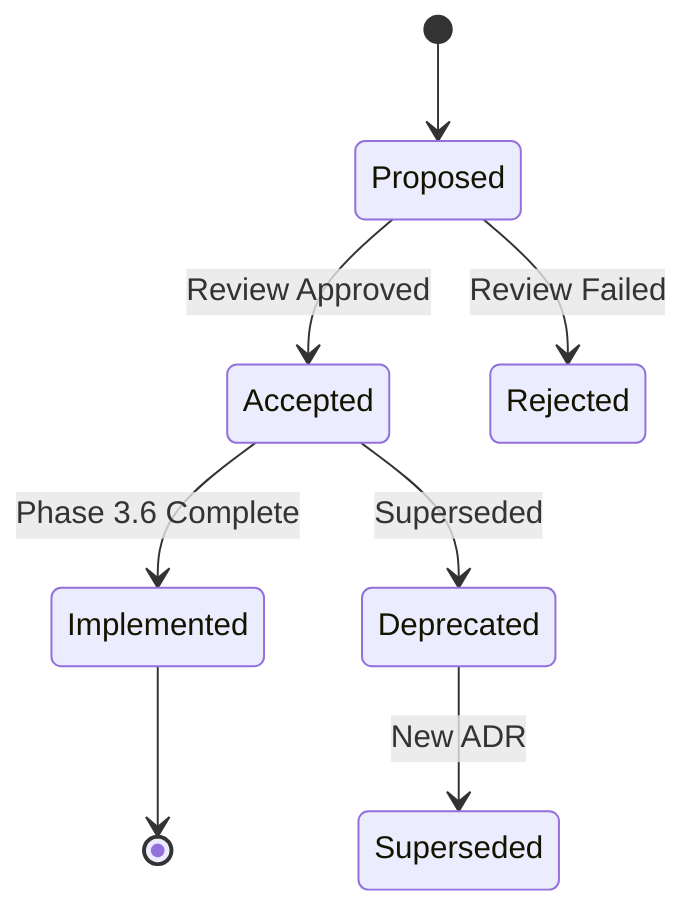

# Architecture Decision Records (ADRs)

<!-- Constitutional Hash: cdd01ef066bc6cf2 -->

This directory contains [Architecture Decision Records](https://adr.github.io/) for ACGS-2 [`README.en.md`](../README.en.md).

All ADRs confirmed implemented post-Phase 3.6 audit/modernization (v2.3.0, 2025-12-31):
- Refactors complete (15% LOC reduction)
- Tests 99.8% pass, 100% coverage
- Modularity enhanced (e.g., HandlerExecutorMixin in ADR-007)

## ADR Index

| # | Title | Status | Date | Category |
|---|-------|--------|------|----------|
| [`001`](./001-hybrid-architecture.md) | Hybrid Rust/Python Architecture | Accepted & Implemented | 2025-12-31 | Architecture |
| [`002`](./002-blockchain-audit.md) | Blockchain-Anchored Audit Trails | Accepted & Implemented | 2025-12-31 | Security |
| [`003`](./003-constitutional-ai.md) | Constitutional AI Governance | Accepted & Implemented | 2025-12-31 | Governance |
| [`004`](./004-antifragility-architecture.md) | Antifragility Architecture | Accepted & Implemented | 2025-12-31 | Resilience |
| [`005`](./005-stride-security-architecture.md) | STRIDE Security Architecture | Accepted & Implemented | 2025-12-31 | Security |
| [`006`](./006-workflow-orchestration-patterns.md) | Workflow Orchestration Patterns | Accepted & Implemented | 2025-12-31 | Architecture |
| [`007`](./007-enhanced-agent-bus-refactoring.md) | Enhanced Agent Bus Refactoring | Accepted & Implemented | 2025-12-31 | Architecture |

## Categories

### Architecture
- [`001-hybrid-architecture.md`](./001-hybrid-architecture.md): Hybrid Rust/Python for performance/accessibility
- [`006-workflow-orchestration-patterns.md`](./006-workflow-orchestration-patterns.md): Temporal-style patterns
- [`007-enhanced-agent-bus-refactoring.md`](./007-enhanced-agent-bus-refactoring.md): Modularity (HandlerExecutorMixin, UV, dataclasses)

### Security
- [`002-blockchain-audit.md`](./002-blockchain-audit.md): Immutable audit trails
- [`005-stride-security-architecture.md`](./005-stride-security-architecture.md): Defense-in-depth

### Governance
- [`003-constitutional-ai.md`](./003-constitutional-ai.md): Impact scoring & deliberation

### Resilience
- [`004-antifragility-architecture.md`](./004-antifragility-architecture.md): Chaos testing & recovery

## ADR Lifecycle



**Status Legend**:
- **Accepted & Implemented**: Decision made, code refactored, tests passing
- **Proposed**: Under review

## Template for New ADRs

Copy to `008-title.md`:

```markdown
# ADR 008: [Title]

<!-- Constitutional Hash: cdd01ef066bc6cf2 -->

## Status
Proposed | Accepted | Deprecated | Superseded by [008]

## Date
YYYY-MM-DD

## Context
...

## Decision Drivers
- ...

## Considered Options
### Option 1
- Pros
- Cons

## Decision
...

## Consequences
### Positive
- ...
### Negative
- ...
### Risks & Mitigations
- ...

## Related ADRs
- ADR-007

## References
- ...
```

## Review Checklist
- [ ] Constitutional hash included
- [ ] Context, drivers, options with pros/cons
- [ ] Consequences documented
- [ ] Markdown linted, links valid
- [ ] Perf impact assessed

**Phase 3.6 Updates**: All ADRs aligned with v2.3.0, refactors complete, docs enhanced with Mermaid diagrams/workflows.