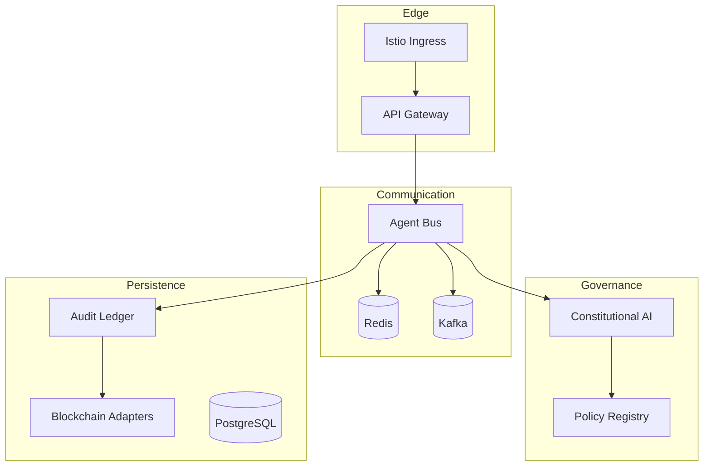

# ACGS-2 Orchestration Manifesto

ACGS-2 is composed of **49+ microservices** working in concert to provide autonomous constitutional governance. This document maps the complexity into functional domains and defines the orchestration patterns.

## Service Domains

We categorize all services into six core functional domains:

### 1. Unified Governance Layer (UGL)

_Orchestrates the rules and constraints._

- **Policy Registry**: OPA bundle distribution.
- **Constitutional AI**: Alignment checking and RAG-based precedent retrieval.
- **Constraint Generation**: Dynamic rule creation.

### 2. High-Performance Communication (HPC)

_The system's nervous system._

- **Enhanced Agent Bus**: Multi-tenant, Rust-powered message routing.
- **Adaptive Router**: Score-based delivery (Fast Path vs. Deliberation).

### 3. Decentralized Audit (DA)

_The immutable memory._

- **Audit Service**: Merkle tree batching and entry management.
- **Blockchain Adapters**: Solana (Primary), Avalanche (Secondary).
- **ZKP Engine**: Privacy-preserving compliance verification.

### 4. Advanced Search & Intelligence (ASI)

_Knowledge and pattern discovery._

- **Search Platform**: Vector-based semantic search across agent logs.
- **Research Feed**: Monitoring external regulatory updates.
- **Consensus Engine**: Multi-agent voting and agreement.

### 5. Infrastructure & Orchestration (I&O)

_Runtime and operations._

- **K8s Controllers**: Blue-green deployment and autoscaling.
- **Service Mesh (Istio)**: mTLS, traffic splitting, and zero-trust.
- **Monitoring**: Prometheus, ELK, and Jaeger.

### 6. Compliance & Ethics (C&E)

_Specialized regulatory enforcement._

- **EU AI Act Monitor**: High-risk system profiling.
- **GDPR Core**: Automated data deletion and privacy-safe logs.

---

## Dependency Hierarchy

## Management Patterns

- **Initialization Order**:

  1. Base infrastructure (Redis, PostgreSQL, Kafka).
  2. Governance registries (Open Policy Agent).
  3. Support services (Audit, Constitutional AI).
  4. Message Bus (Agent Bus).
  5. API Gateway.

- **Isolation Strategy**:
  - **Namespace**: Production vs. Staging vs. Sandbox.
  - **NetworkPolicy**: No cross-tenant communication allowed within the cluster.
  - **mTLS**: Mandatory for all service-to-service communication.

## Orchestration Directory

- [Kubernetes Manifests](file:///home/dislove/document/acgs2/k8s/)
- [Helm Charts](file:///home/dislove/document/acgs2/deploy/helm/acgs2/)
- [Istio Configs](file:///home/dislove/document/acgs2/docs/istio/)
