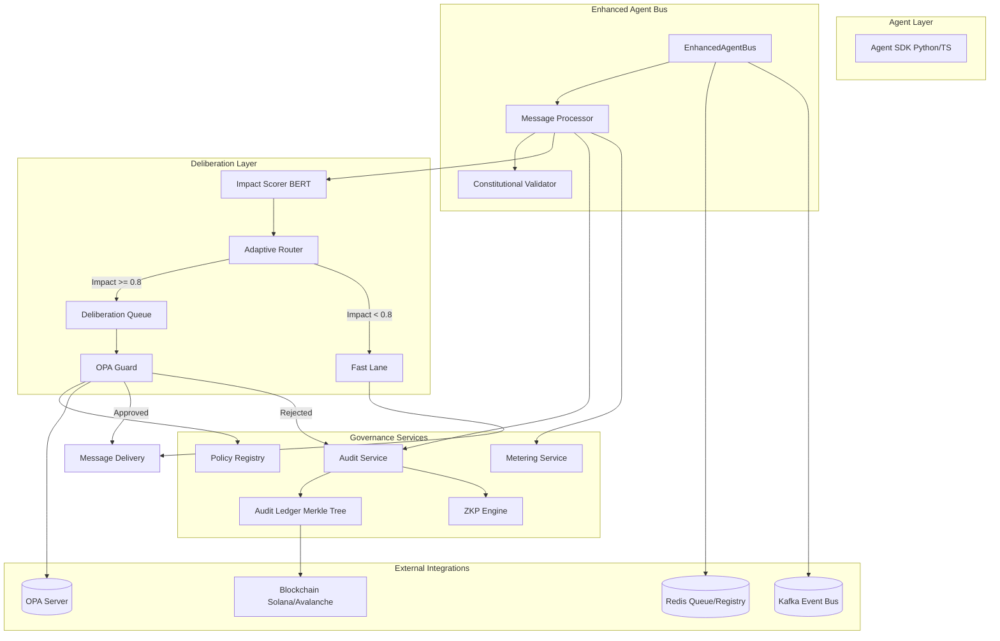

# ACGS-2 System Architecture

**Constitutional Hash**: `cdd01ef066bc6cf2`

> **Version**: 2.2.0
> **Status**: Stable
> **Last Updated**: 2025-12-24
> **Language**: EN

## Architectural Overview

ACGS-2 (Advanced Constitutional Governance System 2) is a modular, high-performance agent bus platform designed for secure and compliant agent communication.

## Component Descriptions

| Component                    | Description                                                                                  |
| ---------------------------- | -------------------------------------------------------------------------------------------- |
| **Agent SDK**                | Provides high-level APIs for agents to interact with the bus.                                |
| **Enhanced Agent Bus**       | The core communication hub, supporting Python and Rust backends.                             |
| **Message Processor**        | Handles message validation, transformation, and routing.                                     |
| **Constitutional Validator** | Ensures all messages comply with the constitutional hash `cdd01ef066bc6cf2`.                 |
| **Deliberation Layer**       | An AI-powered system for reviewing high-risk decisions.                                      |
| **Impact Scorer**            | Uses BERT to calculate the potential impact of a message.                                    |
| **Adaptive Router**          | Routes messages to either the "Fast Lane" or the "Deliberation Queue" based on impact score. |
| **Audit Service**            | Provides immutable logging of all system activities using Merkle Trees and Blockchain.       |
| **Policy Registry**          | Manages dynamic governance policies and signatures.                                          |
| **Metering Service**         | Tracks resource usage and agent activity for billing and quotas.                             |
| **ZKP Engine**               | Provides zero-knowledge proofs for privacy-preserving compliance verification.               |

## Data Flow

1.  **Message Submission**: An agent sends a message via the SDK.
2.  **Validation**: The `EnhancedAgentBus` validates the constitutional hash.
3.  **Scoring**: The `ImpactScorer` evaluates the message's impact.
4.  **Routing**:
    - If impact < 0.8, the message follows the **Fast Lane** for immediate delivery.
    - If impact >= 0.8, the message enters the **Deliberation Queue**.
5.  **Deliberation**: The `OPAGuard` evaluates the message against policies and may require human-in-the-loop (HITL) approval.
6.  **Auditing**: All steps are recorded by the `AuditService`.
7.  **Delivery**: Upon approval, the message is delivered to the target agent.
