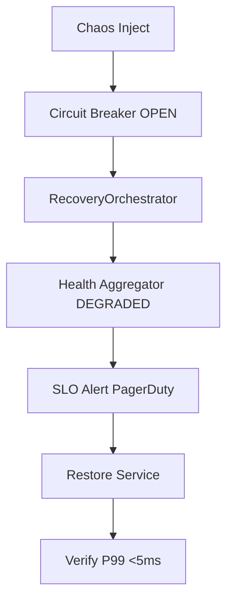

# ACGS-2 Chaos Testing Guide (v2.3.0)

> **Constitutional Hash**: `cdd01ef066bc6cf2`  
> **Perf Targets**: P99 <5ms during chaos, full recovery <30s  
> **Last Updated**: 2025-12-31 (Phase 3.6)

## Overview

Chaos experiments validate 10/10 antifragility: fail-closed, circuit breakers, recovery.

**Metrics**:
- Fail-closed: 100% requests denied during chaos
- Recovery: <30s full restoration
- SLO: 99.99% uptime

Namespace: `acgs2-chaos`

## Prerequisites

```bash
kubectl create ns acgs2-chaos
helm install chaos-mesh chaos-mesh/chaos-mesh --namespace acgs2-chaos --set dashboard.create=true
```

## Experiments

### 1. OPA Failure [`policies/rego/opa-failure.yaml`](policies/rego/opa-failure.yaml)

**Scenario**: Kill OPA pod, verify fail-closed.

```yaml
apiVersion: chaos-mesh.org/v1alpha1
kind: PodChaos
metadata:
  name: opa-failure
spec:
  action: pod-kill
  mode: one
  selector:
    namespaces:
      - acgs2
    labelSelectors:
      app: opa
duration: '60s'
```

**Expected**:
- Requests denied (fail-closed)
- Circuit breaker OPEN
- RecoveryOrchestrator schedules EXPONENTIAL_BACKOFF

### 2. Redis Network Chaos [`chaos/experiments/redis-network-chaos.yaml`](chaos/experiments/redis-network-chaos.yaml)

**Scenario**: Partition Redis, verify queue fallback.

### 3. Kafka Network Chaos [`chaos/experiments/kafka-network-chaos.yaml`](chaos/experiments/kafka-network-chaos.yaml)

**Workflow**:


Run:
```bash
kubectl apply -k chaos/experiments/ -n acgs2-chaos
kubectl chaos-dashboard --address 0.0.0.0:2333
```

**OPA Enhancements Pending Phase 3.7**: Rego bundle auto-sync, TLS mTLS.

See [C4 Resilience](C4-Documentation/c4-component-resilience.md).