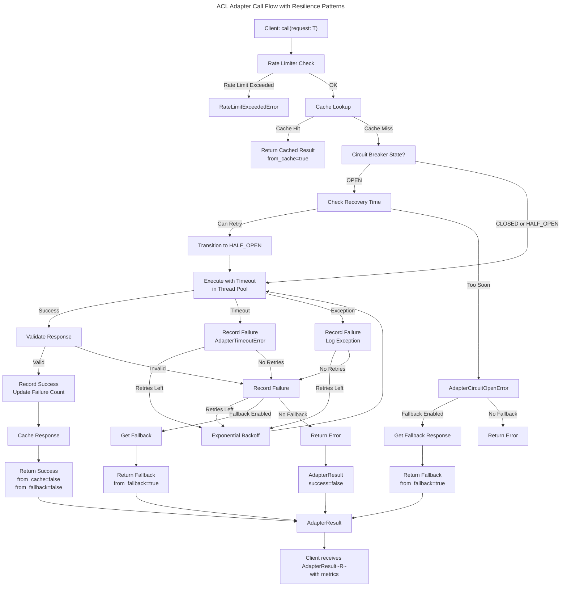
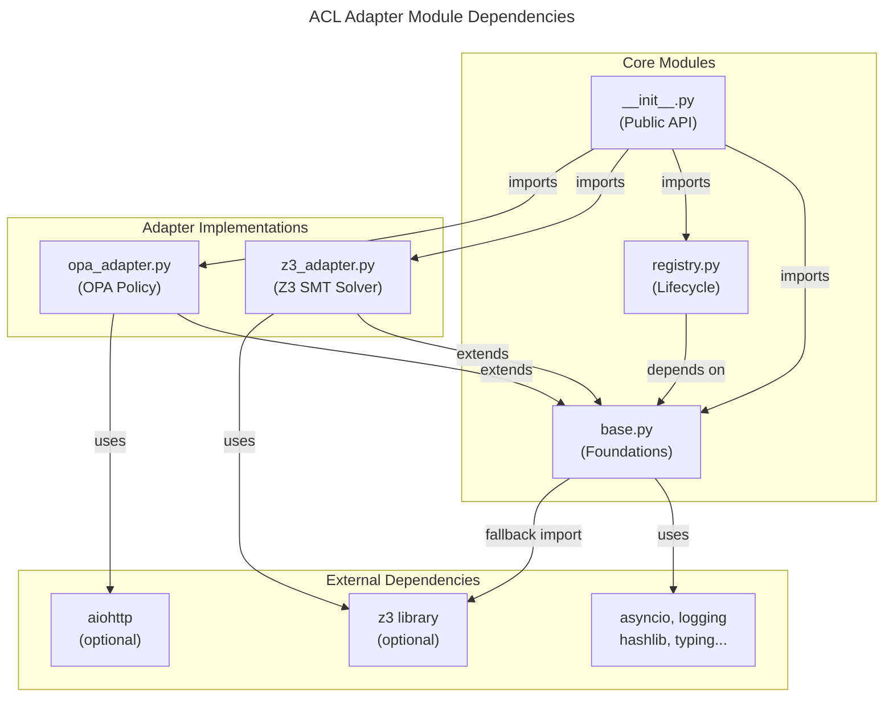

# C4 Code Level: ACL Adapters

## Overview

- **Name**: ACL Adapters (Anti-Corruption Layer)
- **Description**: Comprehensive adapter framework for integrating external policy evaluation systems with built-in circuit breaker protection, rate limiting, timeout management, and graceful degradation
- **Location**: `/home/dislove/document/acgs2/acgs2-core/enhanced_agent_bus/acl_adapters/`
- **Language**: Python 3.11+
- **Purpose**: Provides abstract base class and concrete implementations for Z3 SMT solver integration and OPA (Open Policy Agent) policy evaluation with enterprise-grade resilience patterns
- **Constitutional Hash**: `cdd01ef066bc6cf2`

## Code Elements

### Enums and Constants

#### `AdapterState` (Enum)
- **Location**: `base.py:30-36`
- **Description**: Circuit breaker state enumeration with three states for fault tolerance
- **Values**:
  - `CLOSED = "closed"` - Normal operation
  - `OPEN = "open"` - Rejecting all calls
  - `HALF_OPEN = "half_open"` - Testing recovery with limited calls

#### `CONSTITUTIONAL_HASH` (Constant)
- **Location**: `__init__.py:44`
- **Value**: `"cdd01ef066bc6cf2"`
- **Description**: Constitutional governance hash for validation and compliance tracking

### Exception Classes

#### `AdapterTimeoutError(Exception)`
- **Location**: `base.py:38-56`
- **Description**: Raised when adapter operation exceeds configured timeout
- **Constructor**: `__init__(self, adapter_name: str, timeout_ms: int)`
- **Methods**:
  - `to_dict() -> dict` - Serializes exception to dictionary with constitutional hash

#### `AdapterCircuitOpenError(Exception)`
- **Location**: `base.py:58-77`
- **Description**: Raised when circuit breaker is in OPEN state
- **Constructor**: `__init__(self, adapter_name: str, recovery_time_s: float)`
- **Methods**:
  - `to_dict() -> dict` - Serializes exception to dictionary

#### `RateLimitExceededError(Exception)`
- **Location**: `base.py:79-98`
- **Description**: Raised when rate limit is exceeded
- **Constructor**: `__init__(self, adapter_name: str, limit_per_second: float)`
- **Methods**:
  - `to_dict() -> dict` - Serializes exception to dictionary

### Data Classes

#### `AdapterConfig`
- **Location**: `base.py:100-129`
- **Description**: Configuration dataclass for all ACL adapters with sensible defaults
- **Fields**:
  - `timeout_ms: int = 5000` - Operation timeout in milliseconds
  - `connect_timeout_ms: int = 1000` - Connection timeout in milliseconds
  - `max_retries: int = 3` - Maximum retry attempts on failure
  - `retry_base_delay_ms: int = 100` - Base delay for exponential backoff
  - `retry_max_delay_ms: int = 5000` - Maximum backoff delay
  - `retry_exponential_base: float = 2.0` - Exponential multiplier for backoff
  - `circuit_failure_threshold: int = 5` - Failures before circuit opens
  - `circuit_recovery_timeout_s: float = 30.0` - Time before half-open recovery
  - `circuit_half_open_max_calls: int = 3` - Max calls in half-open state
  - `rate_limit_per_second: float = 100.0` - Rate limit (requests/second)
  - `rate_limit_burst: int = 10` - Burst allowance for token bucket
  - `cache_enabled: bool = True` - Enable response caching
  - `cache_ttl_s: int = 300` - Cache time-to-live (5 minutes)
  - `fallback_enabled: bool = True` - Enable fallback responses

#### `AdapterResult[R]`
- **Location**: `base.py:131-157`
- **Description**: Generic result wrapper for all adapter calls with metrics tracking
- **Type Parameters**:
  - `R` - Response data type
- **Fields**:
  - `success: bool` - Whether operation succeeded
  - `data: Optional[R] = None` - Response data if successful
  - `error: Optional[Exception] = None` - Exception if failed
  - `latency_ms: float = 0.0` - Operation latency in milliseconds
  - `from_cache: bool = False` - Whether result came from cache
  - `from_fallback: bool = False` - Whether result came from fallback
  - `retry_count: int = 0` - Number of retry attempts
  - `constitutional_hash: str = CONSTITUTIONAL_HASH` - Constitutional validation hash
- **Methods**:
  - `to_dict() -> dict` - Serializes result to dictionary format

#### `Z3AdapterConfig(AdapterConfig)`
- **Location**: `z3_adapter.py:25-42`
- **Description**: Z3-specific configuration extending base adapter config
- **Fields**:
  - `z3_timeout_ms: int = 30000` - Z3 solver-specific timeout
  - `memory_limit_mb: int = 1024` - Memory limit for solver
  - `proof_enabled: bool = True` - Enable proof generation
  - `model_enabled: bool = True` - Enable model generation on SAT
  - `timeout_ms: int = 35000` - Override base timeout (longer than Z3 timeout)
  - `max_retries: int = 1` - Z3 is deterministic, no need for retries
  - `cache_ttl_s: int = 3600` - Long cache for deterministic proofs

#### `Z3Request`
- **Location**: `z3_adapter.py:44-68`
- **Description**: Request dataclass for Z3 solver
- **Fields**:
  - `formula: str` - SMT-LIB2 formula string
  - `assertions: list[str] = []` - Additional assertions to check
  - `timeout_ms: Optional[int] = None` - Request-specific timeout override
  - `get_model: bool = True` - Request model generation on SAT
  - `get_proof: bool = False` - Request proof generation on UNSAT
  - `get_unsat_core: bool = False` - Request unsatisfiable core extraction
  - `trace_id: Optional[str] = None` - Tracing identifier (auto-generated if not provided)
- **Methods**:
  - `__post_init__(self) -> None` - Generates trace_id from formula hash if not provided

#### `Z3Response`
- **Location**: `z3_adapter.py:70-117`
- **Description**: Response dataclass from Z3 solver
- **Fields**:
  - `result: str` - SAT/UNSAT/UNKNOWN result
  - `model: Optional[dict[str, Any]] = None` - Model mapping (if requested and SAT)
  - `proof: Optional[str] = None` - Proof string (if requested and UNSAT)
  - `unsat_core: Optional[list[str]] = None` - Unsat core (if requested and UNSAT)
  - `statistics: dict[str, Any] = {}` - Z3 solver statistics
  - `constitutional_hash: str = CONSTITUTIONAL_HASH` - Constitutional hash
  - `trace_id: Optional[str] = None` - Tracing identifier
- **Properties**:
  - `is_sat: bool` - True if result == "sat"
  - `is_unsat: bool` - True if result == "unsat"
  - `is_unknown: bool` - True if result == "unknown"
- **Methods**:
  - `to_dict() -> dict` - Serializes response to dictionary

#### `OPAAdapterConfig(AdapterConfig)`
- **Location**: `opa_adapter.py:25-47`
- **Description**: OPA-specific configuration with fail-closed security model
- **Fields**:
  - `opa_url: str = "http://localhost:8181"` - OPA server URL
  - `opa_bundle_path: str = "/v1/data"` - OPA bundle endpoint path
  - `fail_closed: bool = True` - Fail-closed security: deny on any error
  - `default_policy_path: str = "acgs2/constitutional"` - Default policy path
  - `cache_ttl_s: int = 60` - Cache TTL (policies can change)
  - `timeout_ms: int = 1000` - Fast policy check timeout
  - `max_retries: int = 2` - Limited retries for policy
  - `circuit_failure_threshold: int = 3` - Faster circuit opening

#### `OPARequest`
- **Location**: `opa_adapter.py:49-74`
- **Description**: Request dataclass for OPA policy evaluation
- **Fields**:
  - `input: dict[str, Any]` - Input data for policy evaluation
  - `policy_path: Optional[str] = None` - Policy path override
  - `explain: bool = False` - Request detailed explanation
  - `pretty: bool = False` - Pretty-print response
  - `metrics: bool = True` - Include performance metrics
  - `trace_id: Optional[str] = None` - Tracing identifier
- **Methods**:
  - `__post_init__(self) -> None` - Generates trace_id from input hash

#### `OPAResponse`
- **Location**: `opa_adapter.py:76-111`
- **Description**: Response dataclass from OPA policy evaluation
- **Fields**:
  - `allow: bool` - Policy decision (allow/deny)
  - `result: Optional[dict[str, Any]] = None` - Full result from OPA
  - `decision_id: Optional[str] = None` - Decision identifier for audit
  - `explanation: Optional[list[str]] = None` - Explanation if requested
  - `metrics: Optional[dict[str, Any]] = None` - Performance metrics
  - `constitutional_hash: str = CONSTITUTIONAL_HASH` - Constitutional hash
  - `trace_id: Optional[str] = None` - Tracing identifier
- **Methods**:
  - `to_dict() -> dict` - Serializes response to dictionary

### Core Classes

#### `SimpleCircuitBreaker`
- **Location**: `base.py:160-243`
- **Description**: 3-state finite state machine circuit breaker for fault tolerance
- **State Transitions**:
  - `CLOSED -> OPEN` - On failure_threshold exceeded
  - `OPEN -> HALF_OPEN` - After recovery_timeout_s elapsed
  - `HALF_OPEN -> CLOSED` - After half_open_max_calls successes
  - `HALF_OPEN -> OPEN` - On any failure
- **Constructor**: `__init__(self, failure_threshold: int = 5, recovery_timeout_s: float = 30.0, half_open_max_calls: int = 3)`
- **Properties**:
  - `state: AdapterState` - Current circuit state (checks for recovery)
  - `time_until_recovery: float` - Seconds until recovery attempt
- **Methods**:
  - `record_success() -> None` - Record successful call, decrement failure count in CLOSED state
  - `record_failure() -> None` - Record failed call, transition to OPEN if threshold exceeded
  - `reset() -> None` - Reset circuit breaker to CLOSED state with zero counters

#### `TokenBucketRateLimiter`
- **Location**: `base.py:245-269`
- **Description**: Token bucket algorithm for rate limiting with burst support
- **Constructor**: `__init__(self, rate_per_second: float, burst: int)`
- **Attributes**:
  - `rate_per_second: float` - Token generation rate
  - `burst: int` - Maximum tokens available
- **Methods**:
  - `async acquire() -> bool` - Acquire token, returns True if allowed within rate limit

#### `ACLAdapter[T, R]` (Abstract Base Class)
- **Location**: `base.py:271-545`
- **Description**: Abstract base class for all Anti-Corruption Layer adapters with comprehensive resilience patterns
- **Type Parameters**:
  - `T` - Request type
  - `R` - Response type
- **Constructor**: `__init__(self, name: str, config: AdapterConfig = None)`
- **Instance Attributes**:
  - `name: str` - Adapter name (logging, metrics)
  - `config: AdapterConfig` - Configuration instance
  - `constitutional_hash: str` - Constitutional validation hash
  - `circuit_breaker: SimpleCircuitBreaker` - Circuit breaker instance
  - `rate_limiter: TokenBucketRateLimiter` - Rate limiter instance
  - `_cache: dict[str, tuple[R, float]]` - In-memory response cache
  - `_total_calls: int` - Total calls counter
  - `_successful_calls: int` - Successful calls counter
  - `_failed_calls: int` - Failed calls counter
  - `_cache_hits: int` - Cache hits counter
  - `_fallback_uses: int` - Fallback usage counter
- **Abstract Methods** (must be implemented by subclasses):
  - `async _execute(request: T) -> R` - Execute actual external call
  - `_validate_response(response: R) -> bool` - Validate response is acceptable
  - `_get_cache_key(request: T) -> str` - Generate cache key for request
- **Optional Override Methods**:
  - `_get_fallback_response(request: T) -> Optional[R]` - Provide fallback response (default: None)
- **Public Methods**:
  - `async call(request: T) -> AdapterResult[R]` - Execute adapter call with all protections (rate limit → cache → circuit → execute with timeout/retries → fallback)
  - `async _execute_with_timeout(request: T) -> R` - Execute with timeout wrapper
  - `async _backoff(attempt: int) -> None` - Apply exponential backoff between retries
  - `_get_from_cache(key: str) -> Optional[R]` - Get item from cache if not expired
  - `_put_in_cache(key: str, value: R) -> None` - Put item in cache with timestamp
  - `clear_cache() -> None` - Clear the adapter cache
  - `reset_circuit_breaker() -> None` - Reset circuit breaker to closed state
  - `get_metrics() -> dict` - Get adapter metrics (calls, successes, cache hits, rates)
  - `get_health() -> dict` - Get adapter health status with recovery information
- **Flow Diagram**:
  1. Check rate limit → raise `RateLimitExceededError` if exceeded
  2. Check cache → return cached result if found and not expired
  3. Check circuit breaker state → handle open state with fallback
  4. Execute with timeout → retry with exponential backoff on failure
  5. Validate response → record success or failure
  6. Cache successful response
  7. Return `AdapterResult` with metrics

#### `Z3Adapter(ACLAdapter[Z3Request, Z3Response])`
- **Location**: `z3_adapter.py:119-287`
- **Description**: ACL adapter for Z3 SMT solver integration with caching and timeout handling
- **Constructor**: `__init__(self, name: str = "z3", config: Z3AdapterConfig = None)`
- **Instance Attributes**:
  - `z3_config: Z3AdapterConfig` - Z3-specific configuration
  - `_z3_available: bool` - Whether Z3 package is installed
- **Methods**:
  - `_check_z3_available() -> bool` - Check if Z3 is available (import check)
  - `async _execute(request: Z3Request) -> Z3Response` - Execute Z3 solver call in thread pool
  - `_run_z3_sync(request: Z3Request) -> Z3Response` - Synchronous Z3 execution with SMT-LIB2 parsing
  - `_extract_stats(solver) -> dict` - Extract solver statistics
  - `_validate_response(response: Z3Response) -> bool` - Validate response (check result in valid set)
  - `_get_cache_key(request: Z3Request) -> str` - Generate SHA256 cache key from formula + assertions
  - `_get_fallback_response(request: Z3Request) -> Optional[Z3Response]` - Return "unknown" result with fallback explanation
- **Error Handling**:
  - Z3 not available → return "unknown" with reason
  - Parse error → return "unknown" with reason
  - Timeout → propagates up for retry handling
- **Caching Strategy**:
  - Z3 results are deterministic, so formula is deterministic cache key
  - Default TTL: 3600 seconds (1 hour)

#### `OPAAdapter(ACLAdapter[OPARequest, OPAResponse])`
- **Location**: `opa_adapter.py:113-287`
- **Description**: ACL adapter for Open Policy Agent with fail-closed security model
- **Constructor**: `__init__(self, name: str = "opa", config: OPAAdapterConfig = None)`
- **Instance Attributes**:
  - `opa_config: OPAAdapterConfig` - OPA-specific configuration
  - `_http_client: Optional[aiohttp.ClientSession]` - Async HTTP client for OPA
- **Methods**:
  - `async _get_http_client() -> Optional[aiohttp.ClientSession]` - Get or create HTTP client
  - `async _execute(request: OPARequest) -> OPAResponse` - Execute OPA policy evaluation over HTTP
  - `_parse_opa_response(data: dict, request: OPARequest) -> OPAResponse` - Parse OPA JSON response
  - `_simulate_opa_response(request: OPARequest) -> OPAResponse` - Simulate response when HTTP unavailable
  - `_validate_response(response: OPAResponse) -> bool` - Validate response has boolean decision
  - `_get_cache_key(request: OPARequest) -> str` - Generate SHA256 cache key from policy path + input
  - `_get_fallback_response(request: OPARequest) -> Optional[OPAResponse]` - Fail-closed: return deny
  - `async close() -> None` - Close HTTP client session
- **Fail-Closed Behavior**:
  - HTTP error (non-200) → deny if fail_closed=True
  - Timeout → deny if fail_closed=True
  - Exception → deny if fail_closed=True
  - Circuit open → deny if fail_closed=True
- **Query Parameters**:
  - `explain=full` - Detailed explanation
  - `pretty=true` - Pretty-print response
  - `metrics=true` - Include performance metrics

#### `AdapterRegistry`
- **Location**: `registry.py:26-205`
- **Description**: Centralized singleton registry for ACL adapter instances with lifecycle management
- **Singleton Pattern**: Uses `__new__` to ensure single instance
- **Instance Attributes**:
  - `_instance: Optional[AdapterRegistry]` - Singleton instance
  - `_adapters: Dict[str, ACLAdapter]` - Adapter instances keyed by name
- **Methods**:
  - `get_or_create(name: str, adapter_class: Type[T], config: Optional[C] = None) -> T` - Get existing or create new adapter
  - `get(name: str) -> Optional[ACLAdapter]` - Get adapter by name
  - `remove(name: str) -> bool` - Remove adapter from registry
  - `list_adapters() -> list[str]` - List all registered adapter names
  - `reset_all() -> None` - Reset all circuit breakers and clear caches
  - `get_all_health() -> dict` - Aggregate health status across all adapters
  - `get_all_metrics() -> dict` - Aggregate metrics across all adapters
  - `async close_all() -> None` - Close all adapters supporting close operation
  - `clear() -> None` - Clear all adapters from registry
- **Module Functions**:
  - `get_registry() -> AdapterRegistry` - Get global registry instance
  - `get_adapter(name: str) -> Optional[ACLAdapter]` - Get adapter from global registry

### Convenience Functions

#### Z3 Adapter Functions (z3_adapter.py:290-339)

**`async check_satisfiability(formula: str, adapter: Optional[Z3Adapter] = None) -> AdapterResult[Z3Response]`**
- **Location**: `z3_adapter.py:290-308`
- **Description**: Check if formula is satisfiable
- **Parameters**:
  - `formula: str` - SMT-LIB2 formula string
  - `adapter: Optional[Z3Adapter]` - Optional adapter instance (creates new if not provided)
- **Returns**: `AdapterResult` with Z3Response

**`async prove_property(property_formula: str, context_assertions: list[str] = None, adapter: Optional[Z3Adapter] = None) -> AdapterResult[Z3Response]`**
- **Location**: `z3_adapter.py:310-339`
- **Description**: Prove a property by checking unsatisfiability of negation
- **Parameters**:
  - `property_formula: str` - Formula to prove
  - `context_assertions: list[str]` - Additional context assertions
  - `adapter: Optional[Z3Adapter]` - Optional adapter instance
- **Returns**: `AdapterResult` with Z3Response (unsat = property holds)

#### OPA Adapter Functions (opa_adapter.py:289-399)

**`async check_constitutional_compliance(action: str, resource: str, context: dict[str, Any] = None, adapter: Optional[OPAAdapter] = None) -> AdapterResult[OPAResponse]`**
- **Location**: `opa_adapter.py:290-324`
- **Description**: Check if action on resource is constitutionally compliant
- **Parameters**:
  - `action: str` - Action being performed (e.g., "read", "write", "execute")
  - `resource: str` - Resource being accessed
  - `context: dict[str, Any]` - Additional context for policy evaluation
  - `adapter: Optional[OPAAdapter]` - Optional adapter instance
- **Returns**: `AdapterResult` with OPAResponse
- **Policy Path**: `acgs2/constitutional/compliance`

**`async check_agent_permission(agent_id: str, permission: str, target: Optional[str] = None, adapter: Optional[OPAAdapter] = None) -> AdapterResult[OPAResponse]`**
- **Location**: `opa_adapter.py:326-360`
- **Description**: Check if agent has permission for an action
- **Parameters**:
  - `agent_id: str` - ID of the agent
  - `permission: str` - Permission being requested
  - `target: Optional[str]` - Optional target resource/agent
  - `adapter: Optional[OPAAdapter]` - Optional adapter instance
- **Returns**: `AdapterResult` with OPAResponse
- **Policy Path**: `acgs2/agent/permissions`

**`async evaluate_maci_role(agent_role: str, action: str, target_role: Optional[str] = None, adapter: Optional[OPAAdapter] = None) -> AdapterResult[OPAResponse]`**
- **Location**: `opa_adapter.py:362-399`
- **Description**: Evaluate MACI role separation constraints (Executive/Legislative/Judicial)
- **Parameters**:
  - `agent_role: str` - Role of the agent (executive, legislative, judicial)
  - `action: str` - Action being performed (propose, validate, extract_rules)
  - `target_role: Optional[str]` - Role of target agent for cross-validation
  - `adapter: Optional[OPAAdapter]` - Optional adapter instance
- **Returns**: `AdapterResult` with OPAResponse
- **Policy Path**: `acgs2/maci/role_separation`
- **Note**: Always explains role decisions (explain=True)

## Dependencies

### Internal Dependencies

- **enhanced_agent_bus/shared**: Constants (CONSTITUTIONAL_HASH) and utility modules
- **enhanced_agent_bus/validators**: Constitutional hash validation
- **enhanced_agent_bus/exceptions**: Exception hierarchy for governance

### External Dependencies

- **Standard Library**:
  - `asyncio` - Async/await support and task management
  - `logging` - Structured logging
  - `time` - Timer and monotonic clock
  - `abc` - Abstract base class support
  - `dataclasses` - Data class decorator
  - `datetime` - Timestamp and timezone support
  - `enum` - Enumeration support
  - `typing` - Type hints and generics
  - `hashlib` - SHA256 hashing for cache keys

- **Third-Party** (Optional/Conditional):
  - `z3` - Z3 SMT solver (optional, graceful fallback to "unknown")
  - `aiohttp` - Async HTTP client for OPA (optional, graceful fallback to simulation)

- **Fallback Imports**:
  - All modules have try/except for CONSTITUTIONAL_HASH import with hardcoded fallback

## Relationships

### Class Hierarchy

```mermaid
---
title: ACL Adapter Class Hierarchy
---
classDiagram
    namespace Base {
        class AdapterState {
            <<enumeration>>
            CLOSED
            OPEN
            HALF_OPEN
        }

        class AdapterConfig {
            +timeout_ms: int
            +max_retries: int
            +rate_limit_per_second: float
            +circuit_failure_threshold: int
            +cache_enabled: bool
        }

        class AdapterResult~R~ {
            +success: bool
            +data: Optional~R~
            +error: Optional~Exception~
            +latency_ms: float
            +from_cache: bool
            +from_fallback: bool
            +retry_count: int
            +to_dict(): dict
        }

        class SimpleCircuitBreaker {
            -state: AdapterState
            -failure_count: int
            -success_count: int
            +state: AdapterState
            +time_until_recovery: float
            +record_success(): None
            +record_failure(): None
            +reset(): None
        }

        class TokenBucketRateLimiter {
            +rate_per_second: float
            +burst: int
            +acquire(): Awaitable~bool~
        }

        class ACLAdapter~T_R~ {
            <<abstract>>
            #name: str
            #config: AdapterConfig
            #circuit_breaker: SimpleCircuitBreaker
            #rate_limiter: TokenBucketRateLimiter
            +call(request: T): Awaitable~AdapterResult~R~~
            #_execute(request: T): Awaitable~R~*
            #_validate_response(response: R): bool*
            #_get_cache_key(request: T): str*
            #_get_fallback_response(request: T): Optional~R~
            +get_metrics(): dict
            +get_health(): dict
        }
    }

    namespace Z3 {
        class Z3AdapterConfig {
            +z3_timeout_ms: int
            +memory_limit_mb: int
            +proof_enabled: bool
            +model_enabled: bool
        }

        class Z3Request {
            +formula: str
            +assertions: list~str~
            +get_model: bool
            +get_proof: bool
            +get_unsat_core: bool
            +trace_id: str
        }

        class Z3Response {
            +result: str
            +model: Optional~dict~
            +proof: Optional~str~
            +unsat_core: Optional~list~
            +statistics: dict
            +is_sat: bool
            +is_unsat: bool
            +is_unknown: bool
            +to_dict(): dict
        }

        class Z3Adapter {
            -z3_available: bool
            -z3_config: Z3AdapterConfig
            +_check_z3_available(): bool
            +_run_z3_sync(request: Z3Request): Z3Response
            +_extract_stats(solver): dict
        }
    }

    namespace OPA {
        class OPAAdapterConfig {
            +opa_url: str
            +opa_bundle_path: str
            +fail_closed: bool
            +default_policy_path: str
        }

        class OPARequest {
            +input: dict~str, Any~
            +policy_path: Optional~str~
            +explain: bool
            +pretty: bool
            +metrics: bool
            +trace_id: str
        }

        class OPAResponse {
            +allow: bool
            +result: Optional~dict~
            +decision_id: Optional~str~
            +explanation: Optional~list~
            +metrics: Optional~dict~
            +to_dict(): dict
        }

        class OPAAdapter {
            -http_client: Optional~ClientSession~
            -opa_config: OPAAdapterConfig
            +_get_http_client(): Awaitable~Optional~ClientSession~~
            +_parse_opa_response(data: dict, request): OPAResponse
            +_simulate_opa_response(request): OPAResponse
            +close(): Awaitable~None~
        }
    }

    namespace Registry {
        class AdapterRegistry {
            -_instance: Optional~AdapterRegistry~
            -_adapters: Dict~str, ACLAdapter~
            +get_or_create(name, adapter_class, config): ACLAdapter
            +get(name): Optional~ACLAdapter~
            +remove(name): bool
            +list_adapters(): list~str~
            +reset_all(): None
            +get_all_health(): dict
            +get_all_metrics(): dict
            +close_all(): Awaitable~None~
        }
    }

    ACLAdapter~Z3Request_Z3Response~ <|-- Z3Adapter
    ACLAdapter~OPARequest_OPAResponse~ <|-- OPAAdapter

    ACLAdapter --> SimpleCircuitBreaker: uses
    ACLAdapter --> TokenBucketRateLimiter: uses
    ACLAdapter --> AdapterConfig: depends on
    ACLAdapter --> AdapterResult: returns

    Z3Adapter --> Z3AdapterConfig: uses
    Z3Adapter --> Z3Request: accepts
    Z3Adapter --> Z3Response: returns

    OPAAdapter --> OPAAdapterConfig: uses
    OPAAdapter --> OPARequest: accepts
    OPAAdapter --> OPAResponse: returns

    AdapterRegistry --> ACLAdapter: manages

    SimpleCircuitBreaker --> AdapterState: uses
    TokenBucketRateLimiter --> asyncio: uses
```

### Data Flow Diagram

### Resilience Pattern Integration

```mermaid
---
title: ACL Adapter Resilience Patterns
---
flowchart LR
    subgraph RateLimiting["Rate Limiting"]
        direction TB
        RL1["TokenBucketRateLimiter"]
        RL2["rate: requests/second"]
        RL3["burst: max tokens"]
        RL1 --> RL2
        RL1 --> RL3
    end

    subgraph Caching["Response Caching"]
        direction TB
        C1["In-memory cache"]
        C2["TTL: config.cache_ttl_s"]
        C3["SHA256 key from request"]
        C1 --> C2
        C1 --> C3
    end

    subgraph CircuitBreaker["Circuit Breaker Pattern"]
        direction TB
        CB1["3-state FSM"]
        CB2["CLOSED: normal"]
        CB3["OPEN: rejecting calls"]
        CB4["HALF_OPEN: testing recovery"]
        CB1 --> CB2
        CB1 --> CB3
        CB1 --> CB4
    end

    subgraph Timeout["Timeout Management"]
        direction TB
        T1["asyncio.wait_for()"]
        T2["config.timeout_ms"]
        T3["Run in executor for blocking calls"]
        T1 --> T2
        T1 --> T3
    end

    subgraph Retries["Retry with Exponential Backoff"]
        direction TB
        R1["config.max_retries"]
        R2["base_delay * (exponential_base ^ attempt)"]
        R3["max_delay cap"]
        R1 --> R2
        R2 --> R3
    end

    subgraph Fallback["Graceful Degradation"]
        direction TB
        F1["_get_fallback_response()"]
        F2["Override in subclass"]
        F3["Return sensible default"]
        F1 --> F2
        F1 --> F3
    end

    subgraph Metrics["Observable Metrics"]
        direction TB
        M1["total_calls"]
        M2["success_rate"]
        M3["cache_hit_rate"]
        M4["circuit_state"]
        M1 --> M2
        M1 --> M3
        M1 --> M4
    end

    Input["Request: T"] --> RateLimiting
    RateLimiting --> Caching
    Caching --> CircuitBreaker
    CircuitBreaker --> Timeout
    Timeout --> Retries
    Retries --> Fallback
    Fallback --> Metrics
    Metrics --> Output["AdapterResult~R~"]
```

### Module Dependencies

## Notes

### Design Patterns

1. **Abstract Adapter Pattern**: ACLAdapter is abstract base with hook methods for subclasses
2. **Singleton Pattern**: AdapterRegistry ensures single instance across application
3. **Circuit Breaker Pattern**: 3-state FSM with automatic recovery testing
4. **Token Bucket Rate Limiter**: Fair rate limiting with burst support
5. **Generic Types**: ACLAdapter[T, R] for type-safe request/response handling
6. **Fallback Pattern**: Graceful degradation with optional fallback responses
7. **Fire-and-Forget**: Non-blocking operations (caching, metrics) don't impact latency
8. **Template Method**: _execute/validate/cache_key are implemented by subclasses

### Error Handling Strategy

- **Rate Limit Exceeded**: Immediate rejection with RateLimitExceededError
- **Circuit Open**: AdapterCircuitOpenError with recovery time, tries fallback
- **Timeout**: AdapterTimeoutError with retry logic via exponential backoff
- **Validation Failure**: Treated as adapter failure, triggers circuit breaker
- **Exception**: Caught, logged, recorded as failure, triggers circuit breaker
- **Z3 Unavailable**: Returns "unknown" result instead of failing
- **OPA Unavailable**: Returns deny (fail-closed) instead of failing

### Configuration Best Practices

- **Z3**: Longer timeout (30s) with longer cache (1hr) due to deterministic nature
- **OPA**: Fast timeout (1s) with short cache (60s) as policies can change frequently
- **Circuit Breaker**: 5 failures to open, 30s recovery timeout, 3 half-open calls
- **Rate Limiting**: 100 requests/sec with 10 token burst
- **Retry**: 3 retries with exponential backoff (100ms → 5s max)

### Telemetry and Observability

Each adapter tracks:
- Total calls and success/failure counts
- Cache hits and hit rate percentage
- Fallback usage count
- Circuit breaker state transitions
- Latency in milliseconds
- Constitutional hash for audit trails

Use `get_metrics()` for detailed per-adapter metrics and `AdapterRegistry.get_all_metrics()` for aggregated system view.

### Constitutional Governance

All adapters embed the constitutional hash (`cdd01ef066bc6cf2`) in:
- Exception messages and serializations
- Response objects for audit trails
- Logging for governance validation
- Registry health aggregations

This ensures all external policy evaluations are cryptographically tied to constitutional compliance.

### Thread Safety

- CircuitBreaker and metrics are synchronous (safe for concurrent reads/updates)
- TokenBucketRateLimiter uses asyncio.Lock for thread-safe token acquisition
- Cache uses dict operations (atomic in CPython due to GIL)
- HTTP client (aiohttp) is thread-safe across async contexts

### Performance Characteristics

- **Rate Limit Acquisition**: O(1) with lock
- **Cache Lookup**: O(1) dict lookup + expiry check
- **Circuit Breaker State Check**: O(1) with monotonic clock check
- **Timeout Setup**: O(1) wrapper
- **Retry Backoff**: O(1) exponential calculation
- **Metrics Collection**: O(1) counter increments
- **Overall Per-Request Overhead**: <1ms for local checks before external call
