# C4 Context-Level Documentation: ACGS-2 Constitutional Governance System

> Constitutional Hash: cdd01ef066bc6cf2
> Generated: 2025-12-30
> Version: 1.0.0
> C4 Level: Context (Level 1)

## System Overview

**ACGS-2** (Advanced Constitutional Governance System 2) is an enterprise-grade platform for constitutional AI governance. It provides multi-agent coordination, policy management, and immutable audit trails for AI systems operating under constitutional constraints.

```mermaid
---
title: ACGS-2 System Context Diagram
---
graph TB
    subgraph Users["Users"]
        direction TB
        ENG[("AI Engineer<br/>👤")]
        COMPLIANCE[("Compliance Officer<br/>👤")]
        ADMIN[("System Admin<br/>👤")]
        AUDITOR[("Auditor<br/>👤")]
    end

    subgraph ExternalSystems["External Systems"]
        direction TB
        AGENTS[("AI Agents<br/>🤖")]
        MONITORING[("Monitoring Systems<br/>📊")]
        BLOCKCHAIN[("Blockchain Networks<br/>⛓️")]
        IDP[("Identity Provider<br/>🔐")]
    end

    ACGS2["ACGS-2 Platform<br/>Constitutional AI Governance<br/>──────────────────<br/>• Multi-agent coordination<br/>• Policy management<br/>• Constitutional validation<br/>• Immutable audit trails"]

    %% User interactions
    ENG -->|"Develop & Deploy<br/>AI Agents"| ACGS2
    COMPLIANCE -->|"Define Policies<br/>Review Decisions"| ACGS2
    ADMIN -->|"Configure System<br/>Manage Access"| ACGS2
    AUDITOR -->|"Query Audit Logs<br/>Verify Compliance"| ACGS2

    %% External system interactions
    AGENTS <-->|"Send/Receive<br/>Messages"| ACGS2
    ACGS2 -->|"Export Metrics<br/>& Alerts"| MONITORING
    ACGS2 -->|"Anchor Proofs"| BLOCKCHAIN
    IDP -->|"Authenticate<br/>Users"| ACGS2

    style ACGS2 fill:#4a90d9,color:#fff,stroke:#333,stroke-width:2px
    style Users fill:#e8f4f8,stroke:#333
    style ExternalSystems fill:#f8e8e8,stroke:#333
```



---

## Personas

### 1. AI Engineer

**Role:** Develops and deploys AI agents that operate within the ACGS-2 governance framework

**Demographics:**
- Technical background in AI/ML
- 3-10 years of software engineering experience
- Familiar with distributed systems and microservices

**Goals:**
- Deploy AI agents quickly and reliably
- Ensure agents comply with constitutional requirements
- Debug agent behavior when issues arise
- Monitor agent performance and health

**Pain Points:**
- Complex governance requirements slow down development
- Difficult to understand why messages are rejected
- Limited visibility into constitutional validation decisions

**Key Interactions:**
| Task | System | Frequency |
|------|--------|-----------|
| Register agents | Enhanced Agent Bus | Daily |
| Send messages | Enhanced Agent Bus | Continuous |
| View impact scores | Deliberation Layer | Weekly |
| Debug failures | Audit Ledger | As needed |

---

### 2. Compliance Officer

**Role:** Defines constitutional policies and ensures AI systems operate within governance boundaries

**Demographics:**
- Background in legal, compliance, or ethics
- Understanding of AI governance frameworks
- Risk management experience

**Goals:**
- Define clear, enforceable policies
- Monitor compliance in real-time
- Investigate policy violations
- Generate compliance reports

**Pain Points:**
- Technical complexity of policy definition
- Gap between policy intent and technical implementation
- Slow feedback loop on policy effectiveness

**Key Interactions:**
| Task | System | Frequency |
|------|--------|-----------|
| Create policies | Policy Registry | Weekly |
| Review decisions | Deliberation Layer | Daily |
| Approve high-impact actions | HITL Manager | As needed |
| Generate reports | Audit Ledger | Monthly |

---

### 3. System Administrator

**Role:** Manages ACGS-2 infrastructure, access control, and operational health

**Demographics:**
- DevOps/SRE background
- Experience with containerized deployments
- Security and access management expertise

**Goals:**
- Ensure system availability (99.9%+ uptime)
- Manage user and agent access
- Monitor system performance
- Respond to incidents

**Pain Points:**
- Complex multi-service architecture
- Balancing security with usability
- Capacity planning for variable workloads

**Key Interactions:**
| Task | System | Frequency |
|------|--------|-----------|
| Manage access | Identity Provider | Weekly |
| Monitor health | All Services | Continuous |
| Configure limits | Policy Registry | Monthly |
| Incident response | All Services | As needed |

---

### 4. Auditor

**Role:** Reviews governance decisions and verifies compliance with constitutional requirements

**Demographics:**
- Internal audit or external regulatory background
- Understanding of AI governance and ethics
- Experience with blockchain/immutable records

**Goals:**
- Verify all decisions are properly recorded
- Confirm constitutional compliance
- Detect anomalies or violations
- Produce audit evidence

**Pain Points:**
- Large volume of audit data
- Need for cryptographic verification
- Complex chain of custody requirements

**Key Interactions:**
| Task | System | Frequency |
|------|--------|-----------|
| Query audit logs | Audit Ledger | Daily |
| Verify proofs | Blockchain Anchor | Weekly |
| Review decisions | Deliberation Layer | Monthly |
| Export reports | Audit Ledger | Quarterly |

---

## User Journeys

### Journey 1: Deploying a New AI Agent

**Persona:** AI Engineer
**Goal:** Register and deploy a new AI agent that can communicate with other agents


**Detailed Steps:**

1. **Development Phase**
   - Write agent code implementing business logic
   - Define agent capabilities (what actions it can perform)
   - Assign MACI role (EXECUTIVE, LEGISLATIVE, or JUDICIAL)

2. **Registration Phase**
   ```python
   from enhanced_agent_bus import EnhancedAgentBus
   from enhanced_agent_bus.maci_enforcement import MACIRole

   bus = EnhancedAgentBus(enable_maci=True)
   await bus.start()

   await bus.register_agent(
       agent_id="my-agent-001",
       agent_type="data_processor",
       maci_role=MACIRole.EXECUTIVE,
       capabilities=["process_data", "query_storage"],
       constitutional_hash="cdd01ef066bc6cf2"
   )
   ```

3. **Testing Phase**
   - Send test messages to verify routing
   - Check impact scores and deliberation behavior
   - Review audit logs for proper recording

4. **Production Phase**
   - Deploy containerized agent
   - Configure monitoring and alerting
   - Establish on-call procedures

**Success Criteria:**
- Agent successfully registered
- Messages delivered with <5ms P99 latency
- All decisions recorded in audit ledger
- No constitutional violations

---

### Journey 2: Creating a Constitutional Policy

**Persona:** Compliance Officer
**Goal:** Define a new policy that restricts certain agent actions


**Detailed Steps:**

1. **Requirements Phase**
   - Define what behavior needs to be controlled
   - Consult with AI engineers and legal team
   - Document specific constraints and conditions

2. **Implementation Phase**
   ```json
   POST /api/v1/policies
   {
     "name": "data-access-restriction",
     "content": {
       "rules": [
         {
           "action": "access_pii",
           "subjects": ["data_processor"],
           "effect": "deny",
           "conditions": {
             "unless": ["has_clearance", "audit_logged"]
           }
         }
       ]
     },
     "description": "Restricts PII access to cleared agents"
   }
   ```

3. **Review Phase**
   - Deploy to staging environment
   - Run impact analysis against historical data
   - Obtain approval from governance board

4. **Deployment Phase**
   - Activate policy version
   - Monitor decision patterns
   - Refine based on real-world data

**Success Criteria:**
- Policy accurately expresses intent
- Ed25519 signature verified
- Impact analysis shows expected behavior
- No unintended agent disruption

---

### Journey 3: Investigating a Policy Violation

**Persona:** Auditor
**Goal:** Investigate a reported policy violation and verify the audit trail


**Detailed Steps:**

1. **Detection Phase**
   - Receive alert from monitoring system
   - Review basic violation details
   - Determine investigation priority

2. **Investigation Phase**
   ```bash
   # Query audit entries for the agent
   GET /batch/{batch_id}

   # Retrieve Merkle proof
   GET /entries/{entry_hash}/proof

   # Verify against blockchain
   POST /verify
   {
     "entry_hash": "abc123...",
     "merkle_proof": [...],
     "root_hash": "def456..."
   }
   ```

3. **Analysis Phase**
   - Reconstruct the full decision chain
   - Identify which policy was triggered
   - Determine if violation was intentional

4. **Resolution Phase**
   - Document findings with evidence
   - Recommend corrective actions
   - Archive all investigation materials

**Success Criteria:**
- Complete audit trail retrieved
- Cryptographic proofs verified
- Root cause identified
- Evidence properly preserved

---

### Journey 4: Responding to High-Impact Decision

**Persona:** Compliance Officer (as HITL Approver)
**Goal:** Review and approve a high-impact AI decision requiring human oversight


**Detailed Steps:**

1. **Notification Phase**
   - Receive Slack/Teams notification
   - Review impact score (>0.8 threshold)
   - Understand the requesting agent and context

2. **Review Phase**
   - Examine full message content
   - Review agent's recent activity
   - Check relevant policies

3. **Decision Phase**
   ```bash
   POST /approve/{request_id}
   {
     "decision": "APPROVE",
     "justification": "Action aligns with policy XYZ,
                       agent has appropriate clearance",
     "reviewer_id": "compliance-officer-001"
   }
   ```

4. **Follow-up Phase**
   - Monitor if decision had expected outcome
   - Consider policy adjustments if patterns emerge

**Success Criteria:**
- Decision made within SLA (15 minutes)
- Justification properly documented
- Audit trail complete
- No regret decisions

---

## External System Interactions

### AI Agents

**Type:** External software systems
**Protocol:** Python async API / HTTP REST
**Data Exchange:**
- **Inbound:** Agent messages, registration requests
- **Outbound:** Delivery confirmations, validation results


---

### Monitoring Systems

**Type:** Observability platforms (Prometheus, Grafana, PagerDuty)
**Protocol:** Prometheus metrics, webhooks
**Data Exchange:**
- **Outbound:** Metrics (latency, throughput, health)
- **Inbound:** Alert acknowledgments

**Key Metrics Exported:**
| Metric | Type | Description |
|--------|------|-------------|
| `acgs2_messages_total` | Counter | Total messages processed |
| `acgs2_message_latency_seconds` | Histogram | Message processing latency |
| `acgs2_constitutional_validations_total` | Counter | Validation outcomes |
| `acgs2_deliberation_score` | Gauge | Current impact score |
| `acgs2_health_score` | Gauge | System health (0.0-1.0) |

---

### Blockchain Networks

**Type:** Distributed ledgers (Ethereum, Polygon)
**Protocol:** JSON-RPC, Web3
**Data Exchange:**
- **Outbound:** Merkle roots for anchoring
- **Inbound:** Transaction confirmations

**Anchoring Flow:**


---

### Identity Provider

**Type:** OAuth2/OIDC provider (Okta, Auth0, Keycloak)
**Protocol:** OAuth2, OIDC, SAML
**Data Exchange:**
- **Inbound:** JWT tokens, user claims
- **Outbound:** Token validation requests

**Authentication Flow:**


---

## Key System Features

### Constitutional Compliance

All operations are validated against the constitutional hash `cdd01ef066bc6cf2`:

```
┌─────────────────────────────────────────────────────────────┐
│                   CONSTITUTIONAL VALIDATION                  │
├─────────────────────────────────────────────────────────────┤
│                                                              │
│   Message → Validate Hash → Check Policy → Audit → Deliver  │
│                    ↓                                         │
│              cdd01ef066bc6cf2                                │
│                    ↓                                         │
│   ┌─────────────────────────────────────┐                   │
│   │ HMAC Constant-Time Comparison       │                   │
│   │ (Timing attack prevention)          │                   │
│   └─────────────────────────────────────┘                   │
│                                                              │
└─────────────────────────────────────────────────────────────┘
```

### MACI Role Separation (Trias Politica)

Prevents Gödel bypass attacks through strict role separation:

| Role | Description | Can Do | Cannot Do |
|------|-------------|--------|-----------|
| **EXECUTIVE** | Action proposers | Propose, Synthesize, Query | Validate, Audit, Extract Rules |
| **LEGISLATIVE** | Rule makers | Extract Rules, Synthesize, Query | Propose, Validate, Audit |
| **JUDICIAL** | Validators | Validate, Audit, Query | Propose, Extract Rules, Synthesize |

### Performance Characteristics

| Metric | Target | Achieved | Status |
|--------|--------|----------|--------|
| P99 Latency | <5ms | 0.18ms | ✅ 96% better |
| Throughput | >100 RPS | 195,949 msg/s | ✅ 1,959x target |
| Cache Hit Rate | >85% | 95% | ✅ 12% better |
| Constitutional Compliance | 100% | 100% | ✅ Perfect |
| Antifragility Score | 7/10 | 10/10 | ✅ Maximum |

---

## System Boundaries

### What ACGS-2 Does

- ✅ Multi-agent message coordination
- ✅ Constitutional validation and enforcement
- ✅ Policy management and versioning
- ✅ High-impact decision deliberation
- ✅ Immutable audit trails
- ✅ Blockchain anchoring of proofs
- ✅ MACI role-based access control
- ✅ Antifragile resilience patterns

### What ACGS-2 Does NOT Do

- ❌ AI model training or inference
- ❌ Business logic execution
- ❌ Data storage (beyond policies/audit)
- ❌ User interface hosting
- ❌ External API aggregation
- ❌ Real-time analytics/BI

---

## Deployment Context


---

## Security Context

### Trust Boundaries

```
┌─────────────────────────────────────────────────────────────┐
│                     PUBLIC ZONE                              │
│   [Users] [Admin Console] [External Systems]                 │
└────────────────────────┬────────────────────────────────────┘
                         │ HTTPS + JWT
                         ▼
┌─────────────────────────────────────────────────────────────┐
│                       DMZ                                    │
│   [API Gateway] [Load Balancer] [WAF]                       │
└────────────────────────┬────────────────────────────────────┘
                         │ mTLS
                         ▼
┌─────────────────────────────────────────────────────────────┐
│                   INTERNAL ZONE                              │
│   [Agent Bus] [Policy Registry] [Audit] [Deliberation]      │
└────────────────────────┬────────────────────────────────────┘
                         │ Private Network
                         ▼
┌─────────────────────────────────────────────────────────────┐
│                     DATA ZONE                                │
│   [PostgreSQL] [Redis] [Kafka]                              │
└─────────────────────────────────────────────────────────────┘
```

### Authentication Mechanisms

| Interface | Mechanism | Notes |
|-----------|-----------|-------|
| User → API | JWT (OAuth2) | Via Identity Provider |
| Service → Service | mTLS | Certificate-based |
| Agent → Bus | API Key + Hash | Constitutional hash required |
| Admin → System | MFA | Multi-factor required |

---

## Related Documentation

| Document | Level | Description |
|----------|-------|-------------|
| [c4-container.md](./c4-container.md) | Container | Deployment containers and APIs |
| [c4-component.md](./c4-component.md) | Component | Logical component breakdown |
| [c4-code-core.md](./c4-code-core.md) | Code | Core implementation details |
| [c4-code-deliberation-layer.md](./c4-code-deliberation-layer.md) | Code | Deliberation layer code |
| [c4-code-antifragility.md](./c4-code-antifragility.md) | Code | Antifragility patterns |
| [c4-code-acl-adapters.md](./c4-code-acl-adapters.md) | Code | ACL adapter implementation |

---

*Constitutional Hash: cdd01ef066bc6cf2*
*Generated: 2025-12-30*
