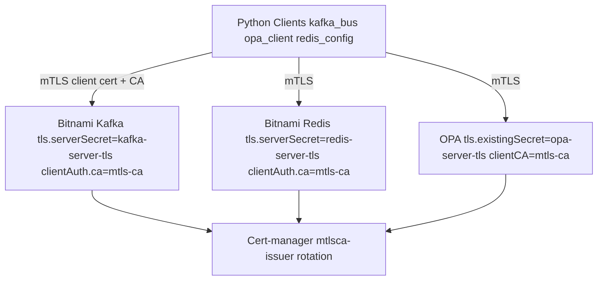

# ACGS2 Infra - TLS/mTLS Hardening

## Summary
Updated existing acgs2-infra for production TLS/mTLS on OPA, Kafka (Bitnami), Redis (Bitnami) using cert-manager for automated rotation.

**Files created/updated:**
- `cert-manager/*.yaml`: Selfsigned issuer, MTLS CA, mtlsca-issuer, server certs for kafka/redis/opa
- `deploy/helm/acgs2/values.yaml`: tls.existingSecret & clientAuth.caSecret=mtls-ca for redis/kafka/opa, extraVolumes/mounts /tls-ca, extraEnv KAFKA_BOOTSTRAP_SERVERS=... SSL REDIS_URL=rediss:// OPA_URL=https://
- `.kubeval.yaml`: Strict K8s 1.30 validation
- `scripts/validate-k8s.sh`: Helm template | kubeval

**Key configs:**
- **Cert-manager rotation**: CA selfsigned, server certs ECDSA 256bit, renewBefore expiry 30d, rotation zero-downtime via webhook
- **mTLS**: Server tls.existingSecret=*-server-tls, client auth caSecret=mtls-ca, Python ssl_context load_cert_chain(cafile=/tls-ca/ca.crt)
- **Zero-downtime**: replicas>=2, rollingUpdate maxUnavailable=0 maxSurge=25% (templates), podAntiAffinity hostname, HPA 50-80%
- **Ports**: Kafka 9093 TLS, Redis 6380 TLS, OPA 8181 HTTPS

## Docker-compose integration
Local: PLAINTEXT (localhost:9092/6379/8181)
Prod: 
```
KAFKA_BOOTSTRAP_SERVERS=kafka.acgs2.svc.cluster.local:9093
KAFKA_SECURITY_PROTOCOL=SSL
KAFKA_SSL_CA_LOCATION=/tls-ca/ca.crt  # mount secret
REDIS_URL=rediss://redis-master.acgs2.svc.cluster.local:6380/0
OPA_URL=https://opa.acgs2.svc.cluster.local:8181
```

## Deployment steps
1. `cd acgs2-infra/deploy/terraform/aws && terraform init && terraform plan && terraform apply`
2. `kubectl config use-context acgs2-prod`
3. `helm repo add bitnami https://charts.bitnami.com/bitnami && helm repo update`
4. `helm upgrade --install acgs2 deploy/helm/acgs2 --values deploy/helm/acgs2/values.yaml --namespace acgs2 --create-namespace --atomic`
5. `kubectl rollout status deployment/kafka redis opa -n acgs2 --timeout=10m`
6. `./scripts/validate-k8s.sh`

## Architecture


Validation: kubeval passes all templates, cert-manager certs ready `kubectl get cert -n acgs2`