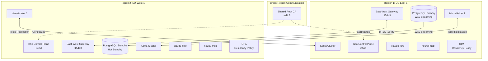

# ACGS2 Multi-Region Global Deployment

## Summary

Multi-region deployment infrastructure for ACGS2 with data residency controls, regional failover capabilities, cross-region replication, and compliance with data sovereignty regulations (GDPR, China PIPL, EU AI Act).

**Key Features:**
- Istio Multi-Primary Multi-Network mesh across regions
- PostgreSQL physical streaming replication for database redundancy
- Kafka MirrorMaker 2 for cross-region event streaming
- Tenant-level data residency enforcement with OPA policies
- Locality-aware load balancing with <60s RTO failover
- GDPR/PIPL/FedRAMP compliance verification

**Files Created:**
- `istio/*.yaml`: IstioOperator manifests, DestinationRules, shared CA setup
- `database/*.yaml`: PostgreSQL primary/standby Helm values, replication monitoring
- `k8s/*.yaml`: Multi-region deployment templates for claude-flow and neural-mcp
- `governance/*.yaml|.rego`: Tenant residency config, OPA policies, AuthorizationPolicies
- `compliance/*.yaml`: GDPR/PIPL compliance verification CronJobs
- `kafka/*.yaml`: MirrorMaker 2 deployment and configuration
- `scripts/*.sh`: Failover testing, CIDR verification scripts

## Architecture



## Directory Structure

```
acgs2-infra/multi-region/
├── README.md                          # This file
├── istio/
│   ├── shared-root-ca-setup.sh        # Generate shared root CA for mesh-wide mTLS
│   ├── verify-pod-cidr.sh             # Validate Pod CIDR non-overlap between clusters
│   ├── istio-operator-region1.yaml    # IstioOperator for US-East-1 (network1)
│   ├── istio-operator-region2.yaml    # IstioOperator for EU-West-1 (network2)
│   ├── claude-flow-destination-rule.yaml    # Locality LB + outlier detection
│   └── neural-mcp-destination-rule.yaml     # Locality LB + outlier detection
├── database/
│   ├── postgresql-primary-values.yaml  # Bitnami Helm values for primary
│   ├── postgresql-standby-values.yaml  # Bitnami Helm values for standby
│   └── replication-monitoring.yaml     # Prometheus alerts + Grafana dashboard
├── k8s/
│   ├── claude-flow-deployment.yaml     # Multi-region deployment manifest
│   ├── neural-mcp-deployment.yaml      # Multi-region deployment manifest
│   └── service-rbac.yaml               # ServiceAccounts and RBAC
├── governance/
│   ├── tenant-residency-config.yaml    # Tenant-to-region mappings
│   ├── opa-residency-policy.rego       # OPA policy for residency enforcement
│   └── cross-region-authz-policy.yaml  # Istio AuthorizationPolicies
├── compliance/
│   └── compliance-cronjob.yaml         # GDPR/PIPL verification CronJobs
├── kafka/
│   ├── mirrormaker2-deployment.yaml    # MM2 deployment + Prometheus monitoring
│   └── mirrormaker2-config.yaml        # Topic replication configuration
└── scripts/
    └── test-failover.sh                # Regional failover RTO testing
```

## Prerequisites

### Required Tools

```bash
# Istio CLI (required for multi-cluster setup)
curl -L https://istio.io/downloadIstio | sh -
export PATH="$PWD/istio-*/bin:$PATH"
istioctl version

# Kubernetes CLI
kubectl version --client

# Helm 3.x
helm version

# OpenSSL (for CA generation)
openssl version
```

### Cluster Requirements

| Requirement | Description |
|-------------|-------------|
| **Kubernetes Version** | 1.25+ |
| **Pod CIDR** | Non-overlapping between clusters (CRITICAL) |
| **Node Labels** | `topology.kubernetes.io/region` and `topology.kubernetes.io/zone` |
| **Load Balancer** | Expose East-West Gateway (port 15443) |
| **Firewall** | Allow cross-region traffic on port 15443 |

### Required Secrets

Create these secrets before deployment:

```bash
# PostgreSQL credentials (each region)
kubectl create secret generic postgresql-primary-credentials \
  --from-literal=postgres-password='<ADMIN_PASSWORD>' \
  --from-literal=password='<APP_PASSWORD>' \
  --from-literal=replication-password='<REPLICATION_PASSWORD>' \
  -n database --context=region1

# Same secret in standby region
kubectl create secret generic postgresql-primary-credentials \
  --from-literal=postgres-password='<ADMIN_PASSWORD>' \
  --from-literal=password='<APP_PASSWORD>' \
  --from-literal=replication-password='<REPLICATION_PASSWORD>' \
  -n database --context=region2
```

## Deployment Steps

### Phase 1: Validate Pod CIDR Non-Overlap (CRITICAL)

```bash
# Verify Pod CIDRs don't overlap - mesh will fail if they do!
./istio/verify-pod-cidr.sh --clusters region1,region2

# Manual verification
echo "Region 1 CIDR:"
kubectl --context=region1 cluster-info dump | grep -m 1 cluster-cidr
echo "Region 2 CIDR:"
kubectl --context=region2 cluster-info dump | grep -m 1 cluster-cidr
# Example valid: 10.244.0.0/16 (region1) vs 10.245.0.0/16 (region2)
```

### Phase 2: Generate Shared Root CA

```bash
# Generate shared root CA for cross-cluster mTLS
./istio/shared-root-ca-setup.sh \
  --output-dir ./certs \
  --validity-days 3650

# Create cacerts secret in both regions
kubectl create secret generic cacerts -n istio-system \
  --from-file=./certs/root-cert.pem \
  --from-file=./certs/ca-cert.pem \
  --from-file=./certs/ca-key.pem \
  --from-file=./certs/cert-chain.pem \
  --context=region1

kubectl create secret generic cacerts -n istio-system \
  --from-file=./certs/root-cert.pem \
  --from-file=./certs/ca-cert.pem \
  --from-file=./certs/ca-key.pem \
  --from-file=./certs/cert-chain.pem \
  --context=region2
```

### Phase 3: Install Istio Multi-Primary Multi-Network

```bash
# Install Istio in Region 1
istioctl install --context=region1 -f istio/istio-operator-region1.yaml -y

# Install Istio in Region 2
istioctl install --context=region2 -f istio/istio-operator-region2.yaml -y

# Verify control planes are healthy
istioctl proxy-status --context=region1
istioctl proxy-status --context=region2
```

### Phase 4: Configure Cross-Cluster Service Discovery

```bash
# Create remote secrets for cross-cluster API access
# (WARNING: These grant full API server access - secure with RBAC!)
istioctl create-remote-secret --context=region1 --name=cluster1 | \
  kubectl apply --context=region2 -f -

istioctl create-remote-secret --context=region2 --name=cluster2 | \
  kubectl apply --context=region1 -f -

# Label namespaces with network topology (BOTH istio-system AND service namespaces)
kubectl label namespace istio-system topology.istio.io/network=network1 --context=region1
kubectl label namespace default topology.istio.io/network=network1 --context=region1

kubectl label namespace istio-system topology.istio.io/network=network2 --context=region2
kubectl label namespace default topology.istio.io/network=network2 --context=region2

# Verify cross-cluster discovery
istioctl ps --context=region1 | head -20
```

### Phase 5: Deploy PostgreSQL with Streaming Replication

```bash
# Add Bitnami Helm repository
helm repo add bitnami https://charts.bitnami.com/bitnami
helm repo update

# Deploy primary in Region 1
helm install postgresql-primary bitnami/postgresql \
  -f database/postgresql-primary-values.yaml \
  --namespace database --create-namespace \
  --context=region1

# Wait for primary to be ready
kubectl rollout status statefulset/postgresql-primary -n database --context=region1 --timeout=5m

# Deploy standby in Region 2
helm install postgresql-standby bitnami/postgresql \
  -f database/postgresql-standby-values.yaml \
  --namespace database --create-namespace \
  --context=region2

# Verify replication status
kubectl exec -it postgresql-primary-0 -n database --context=region1 -- \
  psql -U postgres -c "SELECT application_name, state, sync_state, replay_lag FROM pg_stat_replication;"
# Expected: state='streaming', replay_lag < 60s
```

### Phase 6: Deploy Replication Monitoring

```bash
# Apply Prometheus alerting rules and Grafana dashboard
kubectl apply -f database/replication-monitoring.yaml --context=region1
kubectl apply -f database/replication-monitoring.yaml --context=region2
```

### Phase 7: Deploy Kafka MirrorMaker 2

```bash
# Deploy MirrorMaker 2 in Region 1 (replicates FROM Region 2)
kubectl apply -f kafka/mirrormaker2-config.yaml --context=region1
kubectl apply -f kafka/mirrormaker2-deployment.yaml --context=region1

# Deploy MirrorMaker 2 in Region 2 (replicates FROM Region 1)
# Note: Update source/target cluster configs before applying
kubectl apply -f kafka/mirrormaker2-config.yaml --context=region2
kubectl apply -f kafka/mirrormaker2-deployment.yaml --context=region2

# Verify connector status
kubectl exec -it deploy/mirrormaker2 -n kafka-system --context=region1 -- \
  curl -s http://localhost:8083/connectors | jq
```

### Phase 8: Deploy Tenant Residency Controls

```bash
# Apply tenant residency ConfigMap
kubectl apply -f governance/tenant-residency-config.yaml --context=region1
kubectl apply -f governance/tenant-residency-config.yaml --context=region2

# Apply OPA residency policy (requires OPA Gatekeeper installed)
# opa test governance/opa-residency-policy.rego  # Run unit tests first

# Apply Istio AuthorizationPolicies
kubectl apply -f governance/cross-region-authz-policy.yaml --context=region1
kubectl apply -f governance/cross-region-authz-policy.yaml --context=region2
```

### Phase 9: Deploy Multi-Region Services

```bash
# Apply RBAC
kubectl apply -f k8s/service-rbac.yaml --context=region1
kubectl apply -f k8s/service-rbac.yaml --context=region2

# Deploy claude-flow
kubectl apply -f k8s/claude-flow-deployment.yaml --context=region1
kubectl apply -f k8s/claude-flow-deployment.yaml --context=region2

# Deploy neural-mcp
kubectl apply -f k8s/neural-mcp-deployment.yaml --context=region1
kubectl apply -f k8s/neural-mcp-deployment.yaml --context=region2

# Apply traffic management (DestinationRules + VirtualServices)
kubectl apply -f istio/claude-flow-destination-rule.yaml --context=region1
kubectl apply -f istio/neural-mcp-destination-rule.yaml --context=region1
kubectl apply -f istio/claude-flow-destination-rule.yaml --context=region2
kubectl apply -f istio/neural-mcp-destination-rule.yaml --context=region2
```

### Phase 10: Deploy Compliance Verification

```bash
# Deploy compliance CronJobs
kubectl apply -f compliance/compliance-cronjob.yaml --context=region1
kubectl apply -f compliance/compliance-cronjob.yaml --context=region2

# Run manual compliance check
kubectl create job compliance-manual-$(date +%s) \
  --from=cronjob/compliance-verification \
  -n compliance --context=region1

# Check results
kubectl logs -l job-name=compliance-manual -n compliance --context=region1 | jq
```

## Verification Commands

### Istio Health Check

```bash
# Control plane status
istioctl proxy-status --context=region1 | grep SYNCED
istioctl proxy-status --context=region2 | grep SYNCED

# mTLS verification
istioctl authn tls-check <POD_NAME>.default --context=region1

# Cross-cluster endpoints
istioctl pc endpoints deploy/claude-flow -n claude-flow-system --context=region1 | grep neural-mcp
```

### Database Replication Status

```bash
# Check replication status
kubectl exec -it postgresql-primary-0 -n database --context=region1 -- \
  psql -U postgres -c "SELECT * FROM pg_stat_replication;"

# Check replication slots
kubectl exec -it postgresql-primary-0 -n database --context=region1 -- \
  psql -U postgres -c "SELECT slot_name, active, restart_lsn FROM pg_replication_slots;"

# Check replication lag (should be < 60s)
kubectl exec -it postgresql-primary-0 -n database --context=region1 -- \
  psql -U postgres -c "SELECT application_name, replay_lag FROM pg_stat_replication;"
```

### Regional Failover Test

```bash
# Run automated failover test
./scripts/test-failover.sh \
  --service claude-flow \
  --source-region region1 \
  --target-region region2 \
  --rto-target 60

# Expected output: RTO < 60s
```

### Tenant Residency Validation

```bash
# Query OPA for residency decision
kubectl exec -it deploy/opa -n opa-system -- \
  curl -X POST http://localhost:8181/v1/data/acgs/residency/allow \
  -d '{"input": {"tenant": "eu-enterprise-001", "region": "us-east-1"}}' | jq
# Expected: {"result": false} (EU tenant blocked from US region)
```

## Configuration Reference

### Key Configuration Files

| File | Purpose | Key Settings |
|------|---------|--------------|
| `istio-operator-region1.yaml` | Region 1 Istio | meshID: global-mesh, network: network1 |
| `istio-operator-region2.yaml` | Region 2 Istio | meshID: global-mesh, network: network2 |
| `postgresql-primary-values.yaml` | DB Primary | wal_level=replica, max_wal_senders=10 |
| `postgresql-standby-values.yaml` | DB Standby | POSTGRESQL_REPLICATION_MODE=slave |
| `tenant-residency-config.yaml` | Data Residency | Tenant-to-region mappings |
| `opa-residency-policy.rego` | Policy Enforcement | OPA admission controller rules |

### Environment Variables

| Variable | Description | Example |
|----------|-------------|---------|
| `REGION_NAME` | Current region identifier | `us-east-1` |
| `TENANT_ID` | Tenant identifier for residency | `eu-enterprise-001` |
| `KAFKA_BOOTSTRAP_SERVERS` | Regional Kafka endpoint | `kafka.kafka-system:9093` |
| `REDIS_URL` | Regional Redis endpoint | `rediss://redis-master:6380/0` |
| `OPA_URL` | Regional OPA endpoint | `https://opa.opa-system:8181` |

### Traffic Distribution

Locality-aware load balancing distributes traffic:

| From Region | To Same Region | To Other Region |
|-------------|----------------|-----------------|
| us-east-1 | 80% | 20% |
| eu-west-1 | 80% | 20% |
| ap-southeast-1 | 80% | 20% |

### RTO Configuration

Outlier detection for <60s RTO:

```yaml
outlierDetection:
  consecutiveGatewayErrors: 3
  interval: 10s
  baseEjectionTime: 30s
  maxEjectionPercent: 100
```

Total RTO: `(3 errors * ~5s/request) + 10s interval + 30s ejection ≈ 55s`

## Adding New Regions

### Step 1: Create Region-Specific IstioOperator

```bash
# Copy existing region config
cp istio/istio-operator-region1.yaml istio/istio-operator-region3.yaml

# Update the following values:
# - metadata.name: region3-controlplane
# - topology.acgs2.io/region: ap-southeast-1
# - topology.acgs2.io/network: network3
# - meshConfig.network: network3
# - values.global.multiCluster.clusterName: cluster3
# - meshNetworks section: add network3
```

### Step 2: Verify Pod CIDR Non-Overlap

```bash
./istio/verify-pod-cidr.sh --clusters region1,region2,region3
```

### Step 3: Distribute Shared Root CA

```bash
kubectl create secret generic cacerts -n istio-system \
  --from-file=./certs/root-cert.pem \
  --from-file=./certs/ca-cert.pem \
  --from-file=./certs/ca-key.pem \
  --from-file=./certs/cert-chain.pem \
  --context=region3
```

### Step 4: Install Istio

```bash
istioctl install --context=region3 -f istio/istio-operator-region3.yaml -y
```

### Step 5: Configure Cross-Cluster Discovery

```bash
# Create remote secrets between ALL clusters
istioctl create-remote-secret --context=region3 --name=cluster3 | \
  kubectl apply --context=region1 -f -
istioctl create-remote-secret --context=region3 --name=cluster3 | \
  kubectl apply --context=region2 -f -
istioctl create-remote-secret --context=region1 --name=cluster1 | \
  kubectl apply --context=region3 -f -
istioctl create-remote-secret --context=region2 --name=cluster2 | \
  kubectl apply --context=region3 -f -

# Label namespaces
kubectl label namespace istio-system topology.istio.io/network=network3 --context=region3
kubectl label namespace default topology.istio.io/network=network3 --context=region3
```

### Step 6: Add PostgreSQL Replication Slot

```bash
# On primary, create new replication slot
kubectl exec -it postgresql-primary-0 -n database --context=region1 -- \
  psql -U postgres -c "SELECT pg_create_physical_replication_slot('standby_ap_southeast_1', true);"

# Deploy standby in new region
helm install postgresql-standby bitnami/postgresql \
  -f database/postgresql-standby-values.yaml \
  --set primary.extraEnvVars[0].value="postgresql-primary.us-east-1.svc.cluster.global" \
  --namespace database --create-namespace \
  --context=region3
```

### Step 7: Update Tenant Residency Config

```yaml
# Add new region to governance/tenant-residency-config.yaml
region-definitions:
  ap-southeast-1:
    display_name: "Asia Pacific (Singapore)"
    compliance_frameworks:
      - "PDPA"
      - "SOC2"
    topology_labels:
      region: ap-southeast-1
      network: network3
```

### Step 8: Deploy Services

```bash
kubectl apply -f k8s/ --context=region3
kubectl apply -f istio/*.yaml --context=region3
kubectl apply -f governance/ --context=region3
kubectl apply -f compliance/ --context=region3
```

## Troubleshooting

### Cross-Cluster Service Discovery Not Working

```bash
# Check remote secrets exist
kubectl get secrets -n istio-system --context=region1 | grep istio-remote-secret

# Verify East-West Gateway is exposed
kubectl get svc istio-eastwestgateway -n istio-system --context=region1

# Check gateway logs for connection errors
kubectl logs -l istio=eastwestgateway -n istio-system --context=region1 --tail=100
```

### PostgreSQL Replication Lag High

```bash
# Check network latency between regions
kubectl exec -it postgresql-standby-0 -n database --context=region2 -- \
  ping postgresql-primary.database.svc.cluster.global

# Check WAL disk usage (replication slots prevent WAL cleanup)
kubectl exec -it postgresql-primary-0 -n database --context=region1 -- \
  psql -U postgres -c "SELECT slot_name, pg_size_pretty(pg_wal_lsn_diff(pg_current_wal_lsn(), restart_lsn)) as retained_wal FROM pg_replication_slots;"

# If slot is too far behind, consider dropping and recreating
# WARNING: This will cause standby to need full resync!
```

### Tenant Residency Policy Violations

```bash
# Check OPA decision logs
kubectl logs -l app=opa -n opa-system --context=region1 | grep -i deny

# Test specific tenant residency decision
curl -X POST http://opa.opa-system:8181/v1/data/acgs/residency/allow \
  -H "Content-Type: application/json" \
  -d '{"input": {"tenant": "eu-enterprise-001", "target_region": "us-east-1"}}'

# Check Istio AuthorizationPolicy effectiveness
istioctl authn tls-check <POD_NAME>.default --context=region1
```

### MirrorMaker 2 Connector Failures

```bash
# Check connector status
kubectl exec -it deploy/mirrormaker2 -n kafka-system -- \
  curl -s http://localhost:8083/connectors/MirrorSourceConnector/status | jq

# Restart failed connector
kubectl exec -it deploy/mirrormaker2 -n kafka-system -- \
  curl -X POST http://localhost:8083/connectors/MirrorSourceConnector/restart

# Check for topic replication
kubectl exec -it deploy/kafka-0 -n kafka-system -- \
  kafka-topics.sh --bootstrap-server localhost:9093 --list | grep -E "^us-east-1\."
```

## Compliance and Governance

### Supported Compliance Frameworks

| Framework | Regions | Enforcement |
|-----------|---------|-------------|
| GDPR | eu-west-1 | Cross-region access blocked |
| EU AI Act | eu-west-1 | Cross-region access blocked |
| PIPL | cn-north-1 | Cross-border data blocked |
| FedRAMP | us-east-1, us-west-2 | Non-US access blocked |
| HIPAA | us-east-1, us-west-2 | Encryption required |
| SOC2 | All regions | Audit logging enabled |

### Compliance Verification Schedule

| Check | Schedule | Alerts |
|-------|----------|--------|
| Daily Compliance | 02:00 UTC | ComplianceVerificationFailed |
| Weekly Audit | Sunday 03:00 UTC | WeeklyComplianceAuditMissed |

### Data Residency Enforcement Layers

1. **OPA Admission Controller**: Validates pod placement matches tenant region
2. **Istio AuthorizationPolicy**: Blocks cross-region data access
3. **PostgreSQL Replication**: Physical streaming (no cross-region writes)
4. **Kafka MirrorMaker 2**: Topic prefixing identifies data origin

## Monitoring and Alerting

### Prometheus Metrics

| Metric | Description | Alert Threshold |
|--------|-------------|-----------------|
| `pg_stat_replication_lag_seconds` | Replication lag | > 30s warning, > 60s critical |
| `pg_replication_slots_retained_bytes` | WAL retention | > 1GB warning, > 5GB critical |
| `kafka_mirrormaker2_replication_lag` | Topic sync lag | > 1000 messages warning |
| `istio_requests_total` | Cross-region requests | Rate anomaly detection |

### Grafana Dashboards

Import dashboards from `database/replication-monitoring.yaml`:

- **PostgreSQL Replication**: Lag, slots, WAL generation rate
- **Multi-Region Traffic**: Locality distribution, failover events
- **Compliance Status**: Verification results, policy violations

## Security Considerations

### Secrets Management

- PostgreSQL credentials: Use Kubernetes Secrets or external vault
- Remote secrets: Grant minimal RBAC, rotate regularly
- TLS certificates: Managed by cert-manager with 30-day rotation

### Network Security

- All cross-region traffic encrypted with mTLS (Istio)
- East-West Gateway ports: 15443 (mTLS), 15021 (health)
- NetworkPolicies restrict pod-to-pod communication

### Access Control

- OPA admission controller for tenant placement
- Istio AuthorizationPolicies for runtime access control
- JWT validation with tenant claims forwarding

## References

- [Istio Multi-Cluster Documentation](https://istio.io/latest/docs/setup/install/multicluster/)
- [PostgreSQL Streaming Replication](https://www.postgresql.org/docs/current/warm-standby.html)
- [Bitnami PostgreSQL Helm Chart](https://github.com/bitnami/charts/tree/main/bitnami/postgresql)
- [Kafka MirrorMaker 2](https://kafka.apache.org/documentation/#georeplication)
- [GDPR Compliance](https://gdpr.eu/)
- [China PIPL](https://www.china-briefing.com/news/chinas-personal-information-protection-law/)
