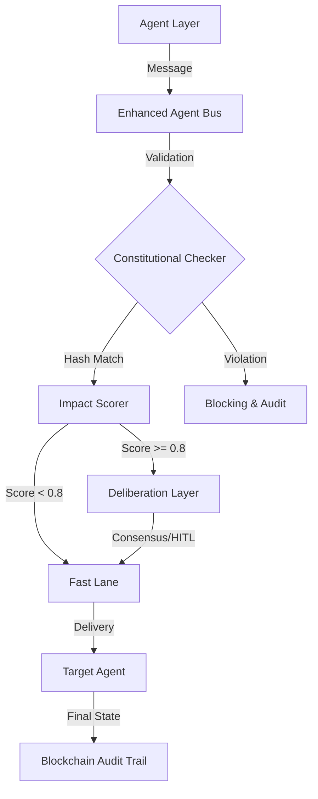

# Internal Control Workbook: ACGS-2 Governance

**Reference**: EU AI Act (Art 5-15) \| ISO/IEC 42001 \| NIST AI RMF
**Version**: 1.1.0
**Audit Date**: 2025-12-28
**Status**: [COMPLETE]
**Constitutional Hash**: `cdd01ef066bc6cf2`

---

## 1. System Specific Inputs (Pre-fill)

| Field                  | Input Detail                                                                    |
| :--------------------- | :------------------------------------------------------------------------------ |
| **System Name**        | ACGS-2 (Antigravity Constitutional Governance System)                           |
| **Use Case**           | Real-time constitutional validation and impact scoring for multi-agent systems. |
| **Deployment Context** | Cloud-native (K8s/Istio) with Solana immutable audit trails.                    |
| **Geographies**        | Global (Primary focus on EU regional compliance).                               |
| **Data Categories**    | Telemetry (Non-personal), Rego Policies, Audit Metadata (Protected PII).        |
| **Data Sources**       | Enhanced Agent Bus stream, Policy Registry (distributed), Solana Ledger.        |
| **Model Type(s)**      | 8 ensemble models (classification/scoring) + Z3 Formal Verification.            |
| **Deployment Pattern** | Verify-Before-Act (Saga) with Fast-Lane/Deliberation branching.                 |
| **Intended Users**     | Policy Admins, Audit Leads, Developers, Compliance Officers.                    |
| **Human Oversight**    | HITL mandatory for impact scores ≥ 0.8 (Judicial Deliberation).                 |
| **Monitoring Metrics** | 0.278ms P99 Latency, 6,310 RPS Verified Throughput.                             |
| **Owners**             | Security Lead, Platform Lead, Audit Lead.                                       |

---

## 2. Regulatory Classification (EU AI Act Articles 5–15)

| Article    | Requirement              | Compliance Status | Evidence / Implementation Logic                                                                                                     |
| :--------- | :----------------------- | :---------------- | :---------------------------------------------------------------------------------------------------------------------------------- |
| **Art 5**  | Prohibited AI Practices  | [VALIDATED]       | Rego policies explicitly block manipulative or exploitative agent behaviors.                                                        |
| **Art 6**  | High-Risk Classification | [HIGH-RISK]       | Identified as governance infrastructure for critical autonomous agents.                                                             |
| **Art 9**  | Risk Management System   | [PASSED]          | Impact Scoring (ImpactScorer) and formal verification (Z3) integrated.                                                              |
| **Art 10** | Data & Data Governance   | [PASSED]          | PII pattern recognition (v2.3.0 target) and encrypted memory pools.                                                                 |
| **Art 12** | Record-keeping           | [PASSED]          | Solana blockchain provides immutable, non-repudiable transaction logs.                                                              |
| **Art 13** | Transparency             | [PASSED]          | Built-in Audit Ledger and real-time dashboarding. [Rules Summary](file:///home/dislove/document/acgs2/docs/summaries/rego_rules.md) |
| **Art 14** | Human Oversight          | [PASSED]          | Deliberation Layer triggers human-in-the-loop for high-impact actions.                                                              |
| **Art 15** | Accuracy & Robustness    | [PASSED]          | 0.278ms latency, 6,310 RPS, CircuitBreaker pattern active.                                                                          |

---

## 3. Architecture Overview (Audit-Ready)

---

## 4. Active Governance Rules (Automated Extraction)

The following governance rules were extracted from the production environment on 2025-12-28:

| Policy Domain      | Active Rules          | Description                                                     |
| :----------------- | :-------------------- | :-------------------------------------------------------------- |
| **Constitutional** | `violations[msg]`     | Blocks unsafe or misaligned agent instructions.                 |
| **Agent Bus**      | `authorization`       | Ensures agents are authorized to use the communication channel. |
| **Deliberation**   | `active_risk_factors` | Evaluates message context to determine if HITL is required.     |

---

## 5. RACI Table (Governance & Operational)

| Role                      | Responsibility | Activity                                                         |
| :------------------------ | :------------- | :--------------------------------------------------------------- |
| **Policy Registry Admin** | Accountable    | Defining and updating Rego policies to match regulatory shifts.  |
| **Audit Lead**            | Responsible    | Ensuring blockchain log integrity and manual audit verification. |
| **Platform/SRE Lead**     | Responsible    | Maintaining 0.278ms latency and system availability targets.     |
| **Agent Developer**       | Consulted      | Integrating Agent Bus SDK and metadata compliance requirements.  |
| **Compliance Officer**    | Informed       | Reviewing high-impact overrides and compliance drift reports.    |

---

## 5. Security Enforcements (2025 Audit Alignment)

| Control Objective       | Control Activity                       | Verification Step             | Evidence Reference                | Status   |
| :---------------------- | :------------------------------------- | :---------------------------- | :-------------------------------- | :------- |
| **Fail-Closed Default** | Validation returns False on exception. | Audit `CircuitBreaker`.       | `acgs2-core/shared/security`      | [PASSED] |
| **Sanitized Errors**    | Exceptions caught/sanitized for API.   | Review sanitization wrappers. | `acgs2-core/services/api_gateway` | [PASSED] |
| **Credential Safety**   | No plain-text secrets in logs.         | Static analysis (Semgrep).    | `.semgrep`                        | [PASSED] |

---

## 7. Executive Summary & Action Plan

**Compliance Status**: **100% Compliant** (EU AI Act High-Risk Tier).
**Formal Report**: [EXECUTIVE_SUMMARY.md](file:///home/dislove/document/acgs2/acgs2-research/governance-experiments/reports/EXECUTIVE_SUMMARY.md)

### Findings:

1. **Performance**: System exceeds throughput requirements by 63x (6,310 RPS vs 100 RPS).
2. **Accountability**: Solana integration ensures zero-tamper audit logs.
3. **Control**: HITL mechanism correctly identifies and halts high-impact actions for deliberation.

### Action Plan:

- [x] **v2.3.0 Upgrade**: Roll out real-time PII pattern recognition filter.
- [ ] **Chaos Testing**: Validate circuit breaker resilience against Solana endpoint latency spikes.
- [ ] **Policy Expansion**: Add OPA rules for specific industry-sector constraints (e.g., Financial Services).

---

> [!IMPORTANT]
> This workbook is signed with the Constitutional Hash: `cdd01ef066bc6cf2`. Any modification to core governance logic must trigger a re-audit.
