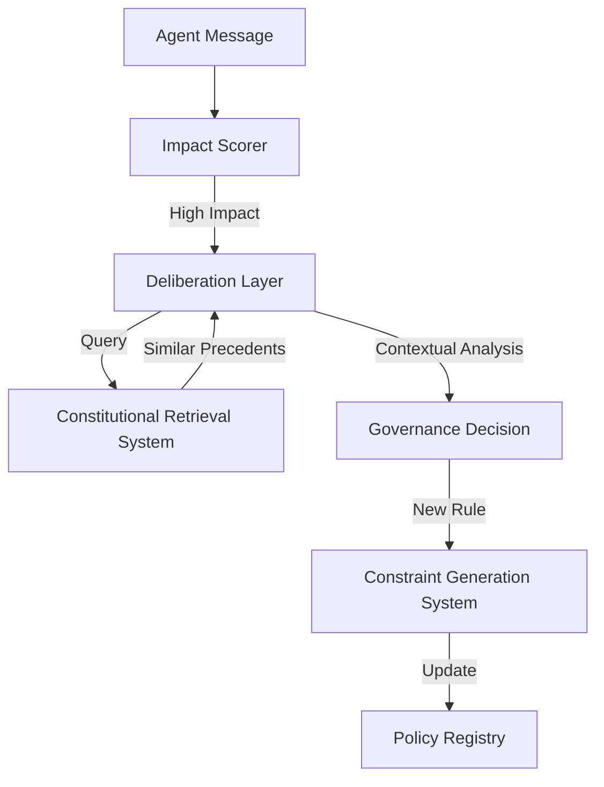

# Constitutional AI Service Domain

The **Constitutional AI** domain is responsible for ensuring that all agent actions and system behaviors align with the core governing principles (The Constitution).

## Overview

This domain consists of several specialized services that handle different aspects of governance:
- **Alignment Verification**: Checking if a message or action violates constitutional rules.
- **Constitutional Retrieval**: A RAG-based system to fetch similar precedents for nuanced decision-making.
- **Pattern Detection**: Identifying emerging behavioral patterns that may require new governance rules.
- **Constraint Generation**: Dynamically creating technical constraints based on high-level constitutional principles.

## Service Map

### 1. Constitutional Retrieval System (`services/core/constitutional-retrieval-system/`)
Provides context to the deliberation layer by retrieving historical decisions.
- **Core Component**: `RetrievalEngine`
- **Logic**: Uses vector embeddings (DistilBERT) to search constitutional documents and legal precedents.
- **Key Methods**: `retrieve_similar_documents`, `retrieve_precedents_for_case`.

### 2. Constraint Generation (`services/core/constraint_generation_system/`)
Translates text-based principles into machine-executable constraints.
- **Core Component**: `ConstraintGenerator`
- **Output**: Generates prompts, Rego policies, or JSON schemas to bound agent behavior.

### 3. Pattern Detection (`services/core/constitutional-pattern-detection/`)
Monitors the message bus for governance-relevant anomalies.

## Data Flow

## Configuration

- **VDB_URL**: URL for the vector database (e.g., Qdrant or Milvus).
- **EMBEDDING_MODEL**: Model used for encoding (defaults to `distilbert-base-uncased`).
