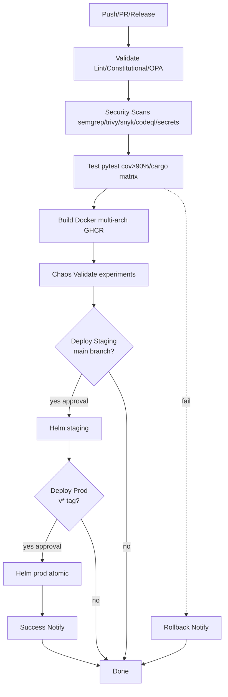

# ACGS2 CI/CD Migration Summary

## Rationale: Old -> New Job Mapping

| Category | GitLab CI (.gitlab-ci.yml) | Jenkinsfile | GitHub Actions (.github/workflows/acgs2-ci-cd.yml) |
|----------|-----------------------------|-------------|----------------------------------------------------|
| Validate/Lint | validate:constitutional, validate:python-syntax, validate:opa-policies, pre-commit implied | None explicit | validate: pre-commit, ruff, black, mypy, constitutional grep, OPA check/test [`acgs2-ci-cd.yml`](.github/workflows/acgs2-ci-cd.yml) |
| Security Scans | security:semgrep, snyk-deps, trivy-container, codeql, secrets-scan, license-check | None | security: semgrep/trivy/snyk/codeql/trufflehog (reusable or inline) [`acgs2-ci-cd.yml`](.github/workflows/acgs2-ci-cd.yml) |
| Test | test:unit, enhanced-agent-bus, opa-integration, integration, performance; cargo test | Unit/integration pytest/cargo | test: pytest matrix (3.11/3.12) cov>90%, cargo test [`acgs2-ci-cd.yml`](.github/workflows/acgs2-ci-cd.yml) |
| Build | build:rust, build:docker multi-service | Build rust/docker multi-service | build: Docker multi-arch (buildx linux/amd64/arm64) to GHCR [`acgs2-ci-cd.yml`](.github/workflows/acgs2-ci-cd.yml) |
| Chaos | None explicit | None | chaos-validate: yamllint/kubeval on chaos/experiments/ [`acgs2-ci-cd.yml`](.github/workflows/acgs2-ci-cd.yml) |
| Deploy | deploy:dev/staging/prod manual k8s apply | Deploy k8s params | deploy-staging/prod: Helm upgrade acgs2-core/deploy/helm/acgs2/ env approvals [`acgs2-ci-cd.yml`](.github/workflows/acgs2-ci-cd.yml) |
| Rollback | rollback:dev/staging/prod manual kubectl undo | Post-failure kubectl undo | rollback: helm rollback on failure/tag prev [`acgs2-ci-cd.yml`](.github/workflows/acgs2-ci-cd.yml) |
| Notify | notify:slack | Slack post | notify: slack action [`acgs2-ci-cd.yml`](.github/workflows/acgs2-ci-cd.yml) |
| Deps | None | None | New .github/dependabot.yml: pip/cargo/docker/gha [`dependabot.yml`](.github/dependabot.yml) |

## Key Improvements
- **Consolidated**: Dual (GitLab + Jenkins) -> Single GHA primary
- **Modern**: Matrix testing (Py 3.11+), Rust stable, Docker multi-arch, coverage gate >90%, caching (pip/cargo/docker)
- **Security**: Inline scans (trivy/snyk/semgrep/OPA/secrets), CodeQL SARIF
- **Deploy**: Helm semantic tags (vX.Y.Z), env approvals, atomic rollback
- **Chaos**: Validate experiments yamls
- **Auto-updates**: Dependabot for deps

## Pipeline Flow

## Migration Plan
1. **Test New Workflow**: Create PR/feature branch with new files, trigger acgs2-ci-cd.yml, validate jobs pass (lint clean, cov>90%, scans no high/crit, images built/pushed)
2. **Parity Check**: Compare artifacts (coverage.xml, scan reports) vs legacy runs; smoke test deploy if secrets configured
3. **Enable on Main**: Merge PR, push to main/develop triggers staging sim
4. **Production Dry-Run**: Tag v0.0.1-test, manual approve prod (dry-run flag)
5. **Cutover**: Confirm parity, delete legacy `acgs2-core/.gitlab-ci.yml` + `acgs2-core/Jenkinsfile`, commit "Migrate to unified GHA CI/CD"
6. **Monitor**: Dependabot PRs auto, watch first prod deploy

## Verification Steps
- [ ] PR workflow: All jobs green, coverage >90% in Codecov, no scan vulns
- [ ] Build: Multi-arch images in GHCR (docker scout or manifest list)
- [ ] Test Deploy: Manual env approval passes Helm dry-run
- [ ] Rollback: failure triggers rollback success
- [ ] Dependabot: PRs generated for deps updates
- [ ] Legacy Removal: Post-merge, no GitLab/Jenkins triggers

Legacy files safe to remove after verification.
