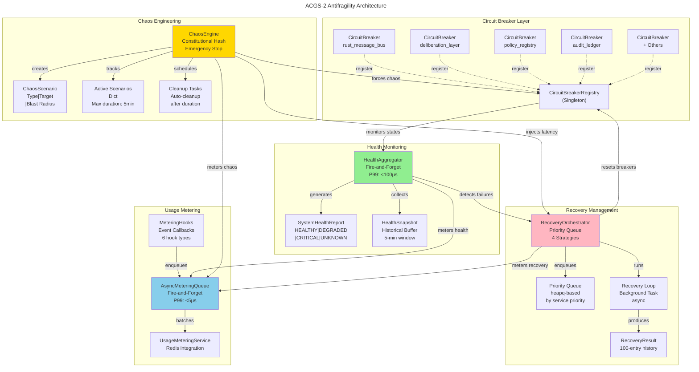
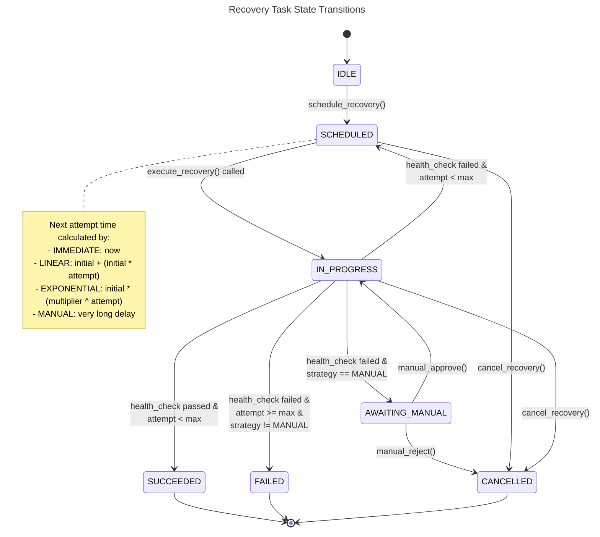
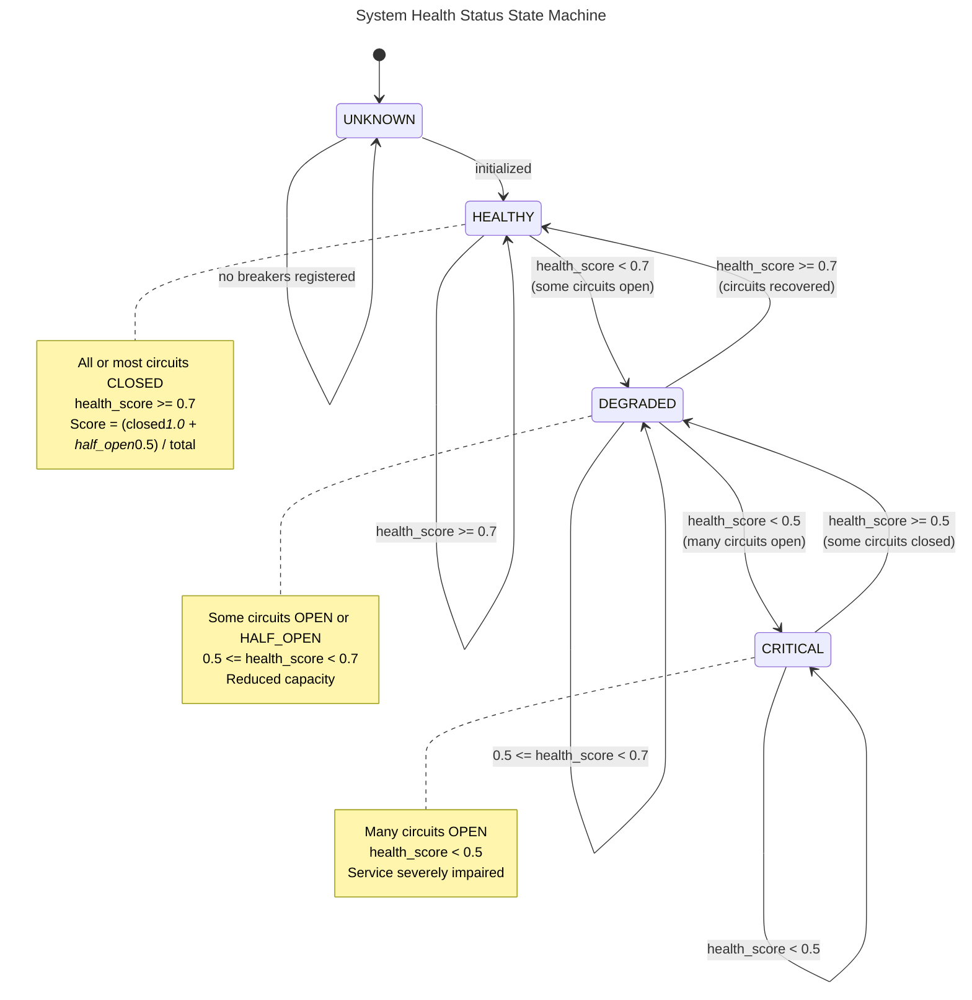

# Antifragility Architecture Diagram

## System-Level Architecture



## Class Hierarchy and Relationships

```mermaid
---
title: Antifragility Component Class Diagram
---
classDiagram
    namespace HealthMonitoring {
        class SystemHealthStatus {
            <<enumeration>>
            HEALTHY
            DEGRADED
            CRITICAL
            UNKNOWN
        }

        class HealthAggregator {
            -config: HealthAggregatorConfig
            -_registry: CircuitBreakerRegistry
            -_health_history: deque
            -_health_change_callbacks: List[Callable]
            +async start()
            +async stop()
            +register_circuit_breaker(name, breaker)
            +get_system_health() SystemHealthReport
            +get_health_history() List[HealthSnapshot]
            +on_health_change(callback)
            -async _health_check_loop()
            -_calculate_health_score() float
        }

        class SystemHealthReport {
            status: SystemHealthStatus
            health_score: float
            total_breakers: int
            closed_breakers: int
            degraded_services: List[str]
            critical_services: List[str]
            +to_dict() Dict
        }

        class HealthSnapshot {
            timestamp: datetime
            status: SystemHealthStatus
            health_score: float
            circuit_states: Dict
        }
    }

    namespace RecoveryManagement {
        class RecoveryStrategy {
            <<enumeration>>
            EXPONENTIAL_BACKOFF
            LINEAR_BACKOFF
            IMMEDIATE
            MANUAL
        }

        class RecoveryState {
            <<enumeration>>
            IDLE
            SCHEDULED
            IN_PROGRESS
            SUCCEEDED
            FAILED
            CANCELLED
            AWAITING_MANUAL
        }

        class RecoveryOrchestrator {
            -default_policy: RecoveryPolicy
            -_recovery_queue: List[RecoveryTask]
            -_active_tasks: Dict[str, RecoveryTask]
            -_history: deque
            +async start()
            +async stop()
            +schedule_recovery(service_name, strategy)
            +async execute_recovery() RecoveryResult
            +get_recovery_status() Dict
            +set_recovery_policy(service, policy)
            -async _recovery_loop()
        }

        class RecoveryPolicy {
            max_retry_attempts: int
            backoff_multiplier: float
            initial_delay_ms: int
            health_check_fn: Optional[Callable]
        }

        class RecoveryTask {
            <<ordered>>
            priority: int
            service_name: str
            strategy: RecoveryStrategy
            policy: RecoveryPolicy
            attempt_count: int
            state: RecoveryState
        }

        class RecoveryResult {
            service_name: str
            success: bool
            attempt_number: int
            elapsed_time_ms: float
            state: RecoveryState
            +to_dict() Dict
        }
    }

    namespace ChaosEngineering {
        class ChaosType {
            <<enumeration>>
            LATENCY
            ERROR
            CIRCUIT_BREAKER
            RESOURCE_EXHAUSTION
            NETWORK_PARTITION
            TIMEOUT
        }

        class ResourceType {
            <<enumeration>>
            CPU
            MEMORY
            CONNECTIONS
            DISK_IO
            NETWORK_BANDWIDTH
        }

        class ChaosEngine {
            -constitutional_hash: str
            -_active_scenarios: Dict
            -_cleanup_tasks: Dict
            -_emergency_stop: bool
            -_lock: threading.Lock
            +async inject_latency() ChaosScenario
            +async inject_errors() ChaosScenario
            +async force_circuit_open() ChaosScenario
            +async simulate_resource_exhaustion() ChaosScenario
            +emergency_stop()
            +get_metrics() Dict
            +should_inject_latency() int
            +should_inject_error() Optional[type]
            -async _activate_scenario()
            -async _schedule_cleanup()
        }

        class ChaosScenario {
            name: str
            chaos_type: ChaosType
            target: str
            delay_ms: int
            error_rate: float
            duration_s: float
            blast_radius: Set[str]
            +is_target_allowed() bool
            +to_dict() Dict
        }
    }

    namespace UsageMetering {
        class AsyncMeteringQueue {
            -config: MeteringConfig
            -_queue: asyncio.Queue
            -_metering_service: UsageMeteringService
            +async start()
            +async stop()
            +enqueue_nowait() bool
            +get_metrics() Dict
            -async _flush_loop()
        }

        class MeteringHooks {
            -_queue: AsyncMeteringQueue
            +on_constitutional_validation()
            +on_agent_message()
            +on_policy_evaluation()
            +on_deliberation_request()
            +on_hitl_approval()
        }
    }

    namespace CircuitBreakerFoundation {
        class CircuitState {
            <<enumeration>>
            CLOSED
            OPEN
            HALF_OPEN
        }

        class CircuitBreakerRegistry {
            -_breakers: Dict
            +get_or_create() CircuitBreaker
            +get_all_states() Dict
            +reset(service_name)
            +reset_all()
        }

        class ACGSCircuitBreakerListener {
            +state_change()
            +before_call()
            +success()
            +failure()
        }
    }

    %% Relationships
    HealthAggregator -->|monitors| CircuitBreakerRegistry
    HealthAggregator -->|generates| SystemHealthReport
    SystemHealthReport -->|has| SystemHealthStatus
    SystemHealthReport -->|contains| HealthSnapshot
    HealthSnapshot -->|has| SystemHealthStatus

    RecoveryOrchestrator -->|manages| RecoveryTask
    RecoveryTask -->|has| RecoveryStrategy
    RecoveryTask -->|has| RecoveryState
    RecoveryOrchestrator -->|generates| RecoveryResult
    RecoveryResult -->|has| RecoveryState
    RecoveryOrchestrator -->|uses| RecoveryPolicy
    RecoveryOrchestrator -->|resets| CircuitBreakerRegistry

    ChaosEngine -->|creates| ChaosScenario
    ChaosScenario -->|has| ChaosType
    ChaosScenario -->|has| ResourceType
    ChaosEngine -->|modifies| CircuitBreakerRegistry

    AsyncMeteringQueue -->|used by| MeteringHooks

    CircuitBreakerRegistry -->|uses| ACGSCircuitBreakerListener
    CircuitBreakerRegistry -->|tracks| CircuitState
```

## Recovery State Machine



## Health Status State Machine



---

**Generated**: Antifragility Architecture Diagrams
**Constitutional Hash**: `cdd01ef066bc6cf2`
**Diagram Types**: System architecture, class hierarchy, data flows, state machines
