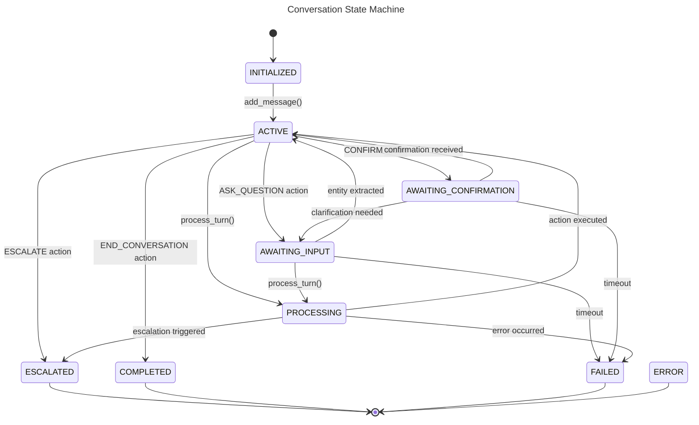

# C4 Code Level: AI Assistant Module

<!-- Constitutional Hash: cdd01ef066bc6cf2 -->

## Overview

- **Name**: ACGS-2 AI Assistant Framework
- **Description**: Production-ready AI assistant with constitutional governance integration, providing natural language understanding (NLU), dialog management, response generation, and agent bus integration with constitutional validation
- **Location**: `/home/dislove/document/acgs2/src/core/enhanced_agent_bus/ai_assistant/`
- **Language**: Python 3.11+
- **Purpose**: Orchestrates all AI assistant components (NLU, Dialog Management, Response Generation) with real-time constitutional governance validation and agent bus integration for enterprise conversational AI

## Validation & Verification Principles for Research Assistance

The AI Assistant module emphasizes reliability-focused research support. When configured for research workflows, response generation and governance checks should enforce the following principles:

1. **Accuracy First**: Prioritize factual correctness over completeness; avoid speculation unless clearly labeled.
2. **Authoritative Sources**: Prefer primary literature, curated datasets, and reputable institutional sources; track provenance for every claim.
3. **Citations for Verification**: Provide citations or traceable references for key assertions; surface source metadata in `ProcessingResult.metadata`.
4. **Bias and Misinformation Controls**: Flag potentially biased or low-quality sources and request clarification when evidence is weak or conflicting.
5. **Regular Knowledge Updates**: Encourage refresh cycles when evidence may be outdated; include last-reviewed timestamps in response metadata where possible.
6. **Fact vs. Hypothesis Separation**: Distinguish established facts from hypotheses or preliminary findings with explicit labeling.
7. **Confidence Levels**: Provide confidence estimates per claim; align with underlying evidence quality and study design.
8. **Study Design Awareness**: Highlight study types (e.g., RCT, observational, meta-analysis) and statistical limitations.
9. **Synthesis and Gap Identification**: Summarize evidence across sources and note missing data or open research questions.
10. **Limitations and Uncertainty**: Clearly state what is unknown, ambiguous, or outside scope.
11. **Cross-Referencing**: Cross-check claims against multiple sources; log discrepancies for follow-up.
12. **User Feedback Loops**: Capture corrections and user-provided sources to improve future responses.
13. **Customizable Retrieval**: Support adjustable search filters (date ranges, domains, evidence tiers) for targeted research.
14. **Contextual Awareness**: Maintain dialogue context to tailor evidence depth, formatting, and follow-up questions.

These principles guide the `ResponseGenerator` and `AgentBusIntegration` behaviors when supporting research tasks, enabling validation-focused outputs that are traceable, verifiable, and aligned with governance requirements.

## Code Elements

### Core Classes

#### AIAssistant
- **File**: `core.py:139-588`
- **Purpose**: Main orchestrator class that coordinates all AI assistant components
- **Responsibilities**:
  - Message processing pipeline (context → NLU → dialog → response)
  - Constitutional governance validation at message and action boundaries
  - Session management with configurable timeout
  - Event listener notification system
  - Metrics and health monitoring
- **Key Methods**:
  - `async initialize() -> bool`: Initialize assistant and all components
  - `async shutdown() -> None`: Cleanup resources
  - `async process_message(user_id, message, session_id, metadata) -> ProcessingResult`: Main entry point for message processing
  - `get_session(session_id) -> Optional[ConversationContext]`: Retrieve active session
  - `get_user_sessions(user_id) -> List[ConversationContext]`: Get all user sessions
  - `end_session(session_id) -> bool`: Terminate specific session
  - `clear_expired_sessions() -> int`: Clean up expired sessions
  - `get_metrics() -> Dict[str, Any]`: Return operational metrics
  - `get_health() -> Dict[str, Any]`: Return health status
  - `add_listener(listener) -> None`: Register event listener
  - `remove_listener(listener) -> None`: Unregister event listener
- **Dependencies**: `NLUEngine`, `DialogManager`, `ResponseGenerator`, `AgentBusIntegration`, `ContextManager`
- **Constitutional Hash**: `cdd01ef066bc6cf2`

#### AssistantConfig
- **File**: `core.py:52-78`
- **Type**: Dataclass configuration container
- **Fields**:
  - `name: str` - Assistant identifier
  - `description: str` - Human-readable description
  - `max_conversation_turns: int` - Maximum message pairs per session
  - `session_timeout_minutes: int` - Session expiration time
  - `enable_learning: bool` - Learning capability toggle
  - `enable_governance: bool` - Constitutional validation toggle
  - `enable_metering: bool` - Usage tracking toggle
  - `constitutional_hash: str` - Constitutional hash validation
  - `response_config: Optional[ResponseConfig]` - Response generation config
  - `integration_config: Optional[IntegrationConfig]` - Agent bus config
- **Key Method**: `to_dict() -> Dict[str, Any]` - Serialization

#### ProcessingResult
- **File**: `core.py:81-107`
- **Type**: Dataclass result object
- **Fields**:
  - `success: bool` - Operation success indicator
  - `response_text: str` - Generated assistant response
  - `intent: Optional[str]` - Detected user intent
  - `confidence: float` - Intent confidence score
  - `entities: Dict[str, Any]` - Extracted entities
  - `action_taken: Optional[str]` - Dialog action executed
  - `governance_decision: Optional[Dict[str, Any]]` - Governance evaluation
  - `processing_time_ms: float` - Elapsed processing time
  - `constitutional_hash: str` - Constitutional validation hash
  - `metadata: Dict[str, Any]` - Additional data
- **Key Method**: `to_dict() -> Dict[str, Any]` - Serialization

#### ConversationListener (Protocol)
- **File**: `core.py:110-136`
- **Type**: Protocol interface for event handling
- **Methods**:
  - `async on_message_received(context, message) -> None` - Fires when user message received
  - `async on_response_generated(context, response, result) -> None` - Fires when response generated
  - `async on_error(context, error) -> None` - Fires on error

### Context Management Classes

#### ConversationContext
- **File**: `context.py:126-307`
- **Purpose**: Central state container for conversation session
- **Responsibilities**:
  - User identity and profile tracking
  - Message history management (with max history enforcement)
  - Entity and slot state management
  - Conversation state machine
  - Context serialization/deserialization
- **Key Fields**:
  - `user_id: str` - User identifier
  - `session_id: str` - Session identifier
  - `messages: List[Message]` - Message history
  - `user_profile: Optional[UserProfile]` - User data
  - `conversation_state: ConversationState` - State enum
  - `state_data: Dict[str, Any]` - Arbitrary state data
  - `entities: Dict[str, Any]` - Extracted entities
  - `slots: Dict[str, Any]` - Slot-filling data
  - `metadata: Dict[str, Any]` - Session metadata
  - `max_history: int` - Message history limit
- **Key Methods**:
  - `add_message(message_or_role, content, **kwargs) -> Message` - Add to history
  - `get_last_user_message() -> Optional[Message]` - Retrieve last user message
  - `get_last_assistant_message() -> Optional[Message]` - Retrieve last assistant message
  - `get_recent_messages(count) -> List[Message]` - Get N recent messages
  - `get_context_hash() -> str` - Generate SHA256 context hash
  - `update_entity(entity_type, entity_value, **metadata) -> None` - Track entity
  - `get_entity(entity_type) -> Optional[Any]` - Retrieve entity
  - `has_entity(entity_type) -> bool` - Check entity existence
  - `set_slot(slot_name, value) -> None` - Set slot value
  - `get_slot(slot_name, default) -> Optional[Any]` - Retrieve slot value
  - `clear_slots() -> None` - Reset all slots
  - `transition_state(new_state) -> None` - State machine transition
  - `to_dict() -> Dict[str, Any]` - Serialization
  - `from_dict(data) -> ConversationContext` - Deserialization
- **Constitutional Hash**: `cdd01ef066bc6cf2`

#### Message
- **File**: `context.py:47-91`
- **Type**: Dataclass for individual message
- **Fields**:
  - `role: MessageRole` - USER | ASSISTANT | SYSTEM
  - `content: str` - Message text
  - `timestamp: datetime` - Creation time (UTC)
  - `metadata: Dict[str, Any]` - Additional data
  - `intent: Optional[str]` - Detected intent
  - `entities: List[Dict[str, Any]]` - Extracted entities
  - `constitutional_hash: str` - Constitutional validation hash
- **Key Methods**: `to_dict()`, `from_dict()`

#### UserProfile
- **File**: `context.py:94-123`
- **Type**: Dataclass for user data
- **Fields**:
  - `user_id: str` - User identifier
  - `name: Optional[str]` - User name
  - `email: Optional[str]` - Email address
  - `preferences: Dict[str, Any]` - User preferences
  - `metadata: Dict[str, Any]` - Custom data
  - `language: str` - Preferred language (default: en)
  - `timezone: str` - Timezone (default: UTC)
  - `created_at: datetime` - Account creation
  - `last_active: datetime` - Last activity time

#### ConversationState (Enum)
- **File**: `context.py:26-37`
- **Values**: INITIALIZED, ACTIVE, AWAITING_INPUT, AWAITING_CONFIRMATION, PROCESSING, COMPLETED, ESCALATED, FAILED, ERROR

#### MessageRole (Enum)
- **File**: `context.py:40-44`
- **Values**: USER, ASSISTANT, SYSTEM

#### ContextManager
- **File**: `context.py:310-597`
- **Purpose**: Manages context lifecycle, reference resolution, and intelligent pruning
- **Responsibilities**:
  - Context creation and retrieval
  - Pronoun and temporal reference resolution
  - Topic shift detection
  - Context pruning for memory management
  - Context summarization
- **Key Methods**:
  - `create_context(user_id, session_id, **kwargs) -> ConversationContext` - Create new session
  - `get_context(session_id) -> Optional[ConversationContext]` - Retrieve session
  - `delete_context(session_id) -> bool` - Remove session
  - `list_user_contexts(user_id) -> List[ConversationContext]` - Get user's sessions
  - `async update_context(context, user_message, nlu_result) -> ConversationContext` - Update with message
  - `async resolve_references(text, context) -> str` - Resolve pronouns/temporal refs
  - `get_context_summary(context) -> str` - Generate summary string
- **Tuning Parameters**:
  - `max_context_length: int` - Max messages before pruning (default: 50)
  - `max_entity_age_turns: int` - Entity retention window (default: 10)

### Natural Language Understanding Classes

#### NLUEngine
- **File**: `nlu.py:462-622`
- **Purpose**: Complete NLU processing pipeline coordinator
- **Responsibilities**:
  - Text preprocessing and normalization
  - Intent classification
  - Entity extraction
  - Sentiment analysis
  - Language detection
  - Confidence scoring
  - Clarification need detection
- **Key Methods**:
  - `async process(text, context) -> NLUResult` - Main NLU processing
  - `add_intent_pattern(intent_name, patterns) -> None` - Dynamic pattern addition
  - `add_entity_pattern(entity_type, pattern) -> None` - Dynamic entity pattern addition
- **Configuration Parameters**:
  - `confidence_threshold: float` - Min confidence for action (default: 0.65)
  - `intent_classifier: IntentClassifier` - Classification engine
  - `entity_extractor: EntityExtractor` - Entity extraction engine
  - `sentiment_analyzer: SentimentAnalyzer` - Sentiment analysis engine
- **Constitutional Hash**: `cdd01ef066bc6cf2`

#### NLUResult
- **File**: `nlu.py:75-129`
- **Type**: Dataclass for NLU processing output
- **Fields**:
  - `original_text: str` - Raw user input
  - `processed_text: str` - Preprocessed text
  - `primary_intent: Optional[Intent]` - Main detected intent
  - `secondary_intents: List[Intent]` - Alternative intents
  - `entities: Union[List[Entity], Dict[str, Any]]` - Extracted entities
  - `sentiment: Sentiment` - Sentiment enum value
  - `sentiment_score: float` - Normalized sentiment [-1.0, 1.0]
  - `language: str` - Detected language code
  - `confidence: float` - Overall confidence [0.0, 1.0]
  - `requires_clarification: bool` - Ambiguity flag
  - `constitutional_hash: str` - Constitutional validation
  - `processing_time_ms: float` - Elapsed time
- **Key Method**: `to_dict() -> Dict[str, Any]` - Serialization

#### Intent
- **File**: `nlu.py:35-49`
- **Type**: Dataclass for detected intent
- **Fields**:
  - `name: str` - Intent identifier
  - `confidence: float` - Classification confidence
  - `parameters: Dict[str, Any]` - Intent parameters
  - `is_primary: bool` - Primary/secondary flag

#### Entity
- **File**: `nlu.py:52-72`
- **Type**: Dataclass for extracted entity
- **Fields**:
  - `text: str` - Entity text from input
  - `type: str` - Entity type (email, phone, order_id, etc)
  - `value: Any` - Normalized entity value
  - `start: int` - Character start position
  - `end: int` - Character end position
  - `confidence: float` - Extraction confidence
  - `metadata: Dict[str, Any]` - Additional data

#### Sentiment (Enum)
- **File**: `nlu.py:26-32`
- **Values**: VERY_NEGATIVE (-2), NEGATIVE (-1), NEUTRAL (0), POSITIVE (1), VERY_POSITIVE (2)

#### RuleBasedIntentClassifier
- **File**: `nlu.py:158-271`
- **Purpose**: Pattern-based intent classification
- **Regex Patterns**: Default patterns for greeting, farewell, help, question, confirmation, denial, order_status, complaint, request_info, feedback
- **Algorithm**: Regex matching with confidence scaling based on match coverage
- **Key Method**: `async classify(text, context) -> List[Intent]`

#### PatternEntityExtractor
- **File**: `nlu.py:274-346`
- **Purpose**: Regex-based entity extraction
- **Default Patterns**: email, phone, order_id, date, time, money, number, url, product_code
- **Key Method**: `async extract(text, context) -> List[Entity]`

#### BasicSentimentAnalyzer
- **File**: `nlu.py:371-459`
- **Purpose**: Keyword-based sentiment analysis
- **Algorithm**:
  - Positive/negative word scoring
  - Negation handling ("not good" → negative)
  - Intensifier detection ("very good" → more positive)
  - Score normalization to [-1.0, 1.0]
  - Category mapping to Sentiment enum
- **Key Method**: `async analyze(text, context) -> str`

### Dialog Management Classes

#### DialogManager
- **File**: `dialog.py:368-669`
- **Purpose**: Conversation flow control and action selection
- **Responsibilities**:
  - Dialog policy application
  - Conversation flow execution
  - Action selection and execution
  - Context state management
  - Custom action handler registration
- **Key Methods**:
  - `async process_turn(context, nlu_result) -> Dict[str, Any]` - Main turn processing
  - `register_action_handler(action_type, handler) -> None` - Register custom handler
  - `add_flow(flow) -> None` - Add conversation flow
  - `get_flow(flow_id) -> Optional[ConversationFlow]` - Retrieve flow
  - `remove_flow(flow_id) -> None` - Remove flow
- **Attributes**:
  - `policy: DialogPolicy` - Policy engine (default: RuleBasedDialogPolicy)
  - `flows: Dict[str, ConversationFlow]` - Conversation flows

#### DialogAction
- **File**: `dialog.py:41-59`
- **Type**: Dataclass for dialog action
- **Fields**:
  - `action_type: ActionType` - Action type enum
  - `parameters: Dict[str, Any]` - Action parameters
  - `response_template: Optional[str]` - Template text
  - `next_state: Optional[str]` - State transition
  - `required_slots: List[str]` - Slot requirements
  - `constitutional_hash: str` - Constitutional validation

#### ActionType (Enum)
- **File**: `dialog.py:28-38`
- **Values**: RESPOND, ASK_QUESTION, CONFIRM, EXECUTE_TASK, CLARIFY, ESCALATE, END_CONVERSATION, WAIT_FOR_INPUT, FILL_SLOT

#### ConversationFlow
- **File**: `dialog.py:91-120`
- **Type**: Dataclass for conversation workflow
- **Fields**:
  - `id: str` - Flow identifier
  - `name: str` - Flow name
  - `description: str` - Flow description
  - `trigger_intents: List[str]` - Intents that trigger flow
  - `nodes: List[FlowNode]` - Flow nodes
  - `entry_node: str` - Starting node ID
  - `exit_nodes: List[str]` - Terminal node IDs
- **Key Method**: `get_node(node_id) -> Optional[FlowNode]`

#### FlowNode
- **File**: `dialog.py:62-88`
- **Type**: Dataclass for flow node
- **Fields**:
  - `id: str` - Node identifier
  - `name: str` - Node name
  - `node_type: str` - Type: response, question, validation, action, condition
  - `content: Optional[Union[str, Callable]]` - Node content or async handler
  - `next_node: Optional[str]` - Default next node
  - `transitions: Dict[str, str]` - Conditional transitions (condition → node_id)
  - `timeout_seconds: int` - Timeout before fallback
  - `timeout_action: Optional[str]` - Timeout action
  - `required_entities: List[str]` - Entity requirements

#### RuleBasedDialogPolicy
- **File**: `dialog.py:137-366`
- **Purpose**: Intent-to-action mapping with slot-filling
- **Algorithm**:
  1. Check slot-filling state, confirmation state
  2. Look up intent in action mappings
  3. Verify required slots are filled
  4. Handle missing slots with slot-filling action
  5. Apply fallback for unknown intents
- **Key Methods**:
  - `async select_action(context, nlu_result, available_actions) -> DialogAction`
  - `_get_missing_slots(required_slots, nlu_result, context) -> List[str]`
  - `_handle_slot_filling(context, nlu_result, pending_slots) -> DialogAction`
  - `_handle_confirmation(context, nlu_result) -> DialogAction`

### Response Generation Classes

#### ResponseGenerator (Abstract)
- **File**: `response.py:102-113`
- **Type**: Abstract base class
- **Interface**: `async generate(intent, context, data) -> str`

#### TemplateResponseGenerator
- **File**: `response.py:116-389`
- **Purpose**: Template-based response generation with personality
- **Features**:
  - Variable substitution (user name, entities, slots)
  - Sentiment-aware variant selection
  - Personality trait application (tone, verbosity, emojis, markdown)
  - Response validation and sanitization
  - Dynamic pattern addition
- **Default Templates**: greeting, farewell, help, clarification, confirmation, error, escalation
- **Key Methods**:
  - `async generate(intent, context, data) -> str` - Generate response
  - `add_template(template) -> None` - Add/update template
  - `remove_template(intent) -> None` - Remove template
  - `_substitute_variables(template, context, data) -> str` - Variable substitution
  - `_apply_personality(response, context) -> str` - Apply personality
  - `_validate_response(response) -> str` - Sanitization

#### ResponseTemplate
- **File**: `response.py:82-99`
- **Type**: Dataclass for response template
- **Fields**:
  - `id: str` - Template identifier
  - `intent: str` - Associated intent
  - `templates: List[str]` - Response variations
  - `conditions: Dict[str, Any]` - Conditional criteria
  - `sentiment_variants: Dict[str, List[str]]` - Sentiment-specific variants
  - `priority: int` - Selection priority

#### PersonalityConfig
- **File**: `response.py:28-48`
- **Type**: Dataclass for assistant personality
- **Fields**:
  - `name: str` - Assistant name
  - `description: str` - Description
  - `tone: str` - professional | friendly | casual | formal
  - `verbosity: str` - brief | normal | detailed
  - `use_emojis: bool` - Emoji flag
  - `use_markdown: bool` - Markdown formatting flag
  - `traits: List[str]` - Personality traits (helpful, polite, etc)

#### ResponseConfig
- **File**: `response.py:51-79`
- **Type**: Dataclass for response generation configuration
- **Fields**:
  - `max_response_length: int` - Maximum response characters (default: 2000)
  - `min_response_length: int` - Minimum response characters (default: 10)
  - `default_personality: PersonalityConfig` - Personality settings
  - `enable_fallback: bool` - Fallback response toggle
  - `fallback_response: str` - Default fallback text
  - `enable_constitutional_validation: bool` - Validation toggle
  - `enable_caching: bool` - Response caching
  - `cache_ttl_seconds: int` - Cache time-to-live (default: 3600)
  - `timeout_seconds: float` - Generation timeout (default: 30.0)
  - `retry_count: int` - Retry attempts (default: 3)

#### LLMResponseGenerator
- **File**: `response.py:392-580`
- **Purpose**: LLM-powered response generation with fallback
- **Features**:
  - Prompt engineering with context
  - LLM API integration (openai, anthropic, local models)
  - Response post-processing (role prefix removal, sentence completion)
  - Safety validation
  - Fallback to templates on failure
- **Configuration Parameters**:
  - `max_tokens: int` - Max output tokens (default: 150)
  - `temperature: float` - Sampling temperature (default: 0.7)
  - `llm_client: Optional[Any]` - LLM API client
- **Key Methods**:
  - `async generate(intent, context, data) -> str`
  - `_build_prompt(intent, context, data) -> str`
  - `async _call_llm(prompt) -> str`
  - `_validate_response(response) -> bool` - Safety checks

#### HybridResponseGenerator
- **File**: `response.py:583-646`
- **Purpose**: Hybrid approach using templates and LLM
- **Algorithm**:
  - Use templates for common intents (greeting, farewell)
  - Use LLM for complex/novel situations (questions, requests)
  - Route based on intent type and conversation complexity
- **Configuration**:
  - `llm_intents: List[str]` - Intents routed to LLM
  - `template_generator: TemplateResponseGenerator`
  - `llm_generator: LLMResponseGenerator`
- **Key Methods**:
  - `async generate(intent, context, data) -> str`
  - `set_llm_client(llm_client) -> None`
  - `add_template(template) -> None`
  - `add_llm_intent(intent) -> None`

### Agent Bus Integration Classes

#### AgentBusIntegration
- **File**: `integration.py:90-554`
- **Purpose**: Bridge between AI Assistant and Enhanced Agent Bus
- **Responsibilities**:
  - Constitutional validation of messages and actions
  - Governance rule evaluation
  - Message routing through agent bus
  - Task execution with governance checks
  - Audit logging for compliance
  - Usage metering for billing
- **Key Methods**:
  - `async initialize() -> bool` - Register with agent bus
  - `async shutdown() -> None` - Cleanup resources
  - `async validate_message(user_message, context) -> ValidationResult` - Message validation
  - `async check_governance(action, context, nlu_result) -> GovernanceDecision` - Governance evaluation
  - `async send_message(to_agent, content, message_type, priority, context) -> Optional[Dict]` - Send agent message
  - `async execute_task(task_type, parameters, context) -> Dict[str, Any]` - Execute task with governance
  - `register_message_handler(message_type, handler) -> None` - Register handler
  - `add_governance_rule(rule_id, condition, requires_review, impact_score) -> None` - Add rule
  - `remove_governance_rule(rule_id) -> None` - Remove rule
- **Governance Rules** (default):
  - high_impact_action: EXECUTE_TASK, ESCALATE → impact_score: 0.8
  - data_access: Parameters contain "data_access" → impact_score: 0.7
  - external_integration: Parameters contain "external_call" → impact_score: 0.9

#### IntegrationConfig
- **File**: `integration.py:44-66`
- **Type**: Dataclass for agent bus integration
- **Fields**:
  - `agent_id: str` - Agent identifier (default: "ai_assistant")
  - `tenant_id: Optional[str]` - Multi-tenant identifier
  - `enable_governance: bool` - Governance toggle
  - `governance_threshold: float` - Impact score threshold (default: 0.8)
  - `enable_audit: bool` - Audit logging toggle
  - `enable_metering: bool` - Usage tracking toggle
  - `constitutional_hash: str` - Constitutional validation hash
  - `message_timeout_seconds: int` - Message timeout (default: 30)

#### GovernanceDecision
- **File**: `integration.py:69-87`
- **Type**: Dataclass for governance evaluation result
- **Fields**:
  - `is_allowed: bool` - Action permission
  - `requires_review: bool` - Review requirement flag
  - `impact_score: float` - Impact severity [0.0, 1.0]
  - `decision_reason: str` - Human-readable reason
  - `constitutional_hash: str` - Constitutional validation
  - `timestamp: datetime` - Decision timestamp

### Module Initialization

#### Module __init__.py
- **File**: `__init__.py`
- **Exports**: All public classes, functions, and enums
- **Constants**: `CONSTITUTIONAL_HASH = "cdd01ef066bc6cf2"`, `__version__ = "1.0.0"`
- **Factory Function**: `async create_assistant(name, enable_governance, agent_bus) -> AIAssistant`

### Functions

#### create_assistant (Factory)
- **Location**: `core.py:591-619`
- **Signature**: `async create_assistant(name: str = "ACGS-2 Assistant", enable_governance: bool = True, agent_bus: Optional[Any] = None) -> AIAssistant`
- **Purpose**: Convenience factory for assistant creation and initialization
- **Returns**: Initialized AIAssistant instance ready for use
- **Example**:
  ```python
  assistant = await create_assistant(
      name="My Assistant",
      enable_governance=True,
      agent_bus=some_agent_bus_instance
  )
  result = await assistant.process_message("user123", "What's my order status?")
  ```

## Dependencies

### Internal Dependencies
- **shared.constants**: CONSTITUTIONAL_HASH constant with fallback
- **enhanced_agent_bus.models**: AgentMessage, MessageType, Priority enums
- **enhanced_agent_bus.validators**: validate_constitutional_hash, ValidationResult
- **enhanced_agent_bus.exceptions**: ConstitutionalValidationError, MessageValidationError

### External Dependencies
- **Standard Library**:
  - `asyncio` - Asynchronous programming
  - `logging` - Structured logging
  - `dataclasses` - Data class definitions
  - `datetime` - Date/time operations (timezone-aware UTC)
  - `typing` - Type hints
  - `enum` - Enumeration types
  - `hashlib` - SHA256 hashing for context
  - `json` - JSON serialization
  - `re` - Regular expression patterns
  - `random` - Template selection
  - `abc` - Abstract base classes
  - `time` - Performance timing

### Design Patterns

| Pattern | Location | Purpose |
|---------|----------|---------|
| Factory Function | `core.py:591` | `create_assistant()` for convenient creation |
| Strategy Pattern | `nlu.py`, `dialog.py`, `response.py` | Pluggable classifiers, policies, generators |
| Observer Pattern | `core.py:110, 484-528` | Event listeners for message/response/error |
| State Machine | `context.py:259-265` | ConversationState transitions with validation |
| Template Method | `response.py:116-389` | TemplateResponseGenerator variable substitution |
| Protocol/Interface | `core.py:110-136` | ConversationListener protocol |
| Composition | `core.py:163-190` | Component coordination in AIAssistant |
| Fire-and-Forget | `core.py:493-528` | Async listener notification without blocking |

## Relationships

### Component Dependency Graph

```mermaid
---
title: AI Assistant Component Architecture
---
classDiagram
    namespace Core {
        class AIAssistant {
            -config AssistantConfig
            -context_manager ContextManager
            -nlu_engine NLUEngine
            -dialog_manager DialogManager
            -response_generator ResponseGenerator
            -integration AgentBusIntegration
            -listeners List~ConversationListener~
            +process_message()
            +initialize()
            +shutdown()
        }
        class AssistantConfig {
            +name string
            +enable_governance boolean
            +enable_metering boolean
        }
        class ProcessingResult {
            +success boolean
            +response_text string
            +intent string
            +governance_decision dict
        }
    }

    namespace Context {
        class ConversationContext {
            +user_id string
            +session_id string
            +messages List~Message~
            +conversation_state ConversationState
            +entities dict
            +slots dict
            +add_message()
            +update_entity()
            +set_slot()
        }
        class Message {
            +role MessageRole
            +content string
            +timestamp datetime
            +intent string
        }
        class ContextManager {
            +create_context()
            +resolve_references()
            +detect_topic_shift()
        }
        class UserProfile {
            +user_id string
            +preferences dict
            +language string
        }
    }

    namespace NLU {
        class NLUEngine {
            -intent_classifier IntentClassifier
            -entity_extractor EntityExtractor
            -sentiment_analyzer SentimentAnalyzer
            +process()
        }
        class NLUResult {
            +original_text string
            +primary_intent Intent
            +entities List~Entity~
            +sentiment Sentiment
            +confidence float
        }
        class Intent {
            +name string
            +confidence float
        }
        class Entity {
            +type string
            +value any
            +confidence float
        }
        class RuleBasedIntentClassifier
        class PatternEntityExtractor
        class BasicSentimentAnalyzer
    }

    namespace Dialog {
        class DialogManager {
            -policy DialogPolicy
            -flows dict
            +process_turn()
            +add_flow()
        }
        class DialogAction {
            +action_type ActionType
            +parameters dict
            +response_template string
        }
        class ConversationFlow {
            +id string
            +nodes List~FlowNode~
            +trigger_intents List~string~
        }
        class RuleBasedDialogPolicy {
            +intent_actions dict
            +select_action()
        }
    }

    namespace Response {
        class ResponseGenerator {
            <<interface>>
            +generate()
        }
        class TemplateResponseGenerator {
            -templates dict
            -personality PersonalityConfig
            +generate()
            +add_template()
        }
        class LLMResponseGenerator {
            -llm_client any
            -fallback_generator TemplateResponseGenerator
            +generate()
        }
        class HybridResponseGenerator {
            -template_generator TemplateResponseGenerator
            -llm_generator LLMResponseGenerator
            +generate()
        }
        class PersonalityConfig {
            +name string
            +tone string
            +verbosity string
        }
    }

    namespace Integration {
        class AgentBusIntegration {
            -config IntegrationConfig
            -agent_bus any
            -governance_rules list
            +validate_message()
            +check_governance()
            +send_message()
            +execute_task()
        }
        class GovernanceDecision {
            +is_allowed boolean
            +impact_score float
            +decision_reason string
        }
    }

    AIAssistant --> AssistantConfig
    AIAssistant --> ContextManager
    AIAssistant --> NLUEngine
    AIAssistant --> DialogManager
    AIAssistant --> ResponseGenerator
    AIAssistant --> AgentBusIntegration
    AIAssistant --> ConversationListener

    ContextManager --> ConversationContext
    ConversationContext --> Message
    ConversationContext --> UserProfile
    ConversationContext --> ConversationState

    NLUEngine --> NLUResult
    NLUEngine --> RuleBasedIntentClassifier
    NLUEngine --> PatternEntityExtractor
    NLUEngine --> BasicSentimentAnalyzer
    NLUResult --> Intent
    NLUResult --> Entity
    NLUResult --> Sentiment

    DialogManager --> DialogAction
    DialogManager --> ConversationFlow
    DialogManager --> RuleBasedDialogPolicy
    RuleBasedDialogPolicy --> ActionType

    ResponseGenerator <|-- TemplateResponseGenerator
    ResponseGenerator <|-- LLMResponseGenerator
    ResponseGenerator <|-- HybridResponseGenerator
    TemplateResponseGenerator --> PersonalityConfig
    HybridResponseGenerator --> TemplateResponseGenerator
    HybridResponseGenerator --> LLMResponseGenerator

    AgentBusIntegration --> IntegrationConfig
    AgentBusIntegration --> GovernanceDecision
```



### Message Processing Pipeline



```mermaid
---
title: Message Processing Data Flow
---
flowchart LR
    subgraph Input
        A["User Message<br/>user_id, text"]
    end

    subgraph ContextManagement
        B["Get/Create<br/>ConversationContext"]
        C["Validate<br/>Constitutional Hash"]
    end

    subgraph NLU
        D["Intent<br/>Classification"]
        E["Entity<br/>Extraction"]
        F["Sentiment<br/>Analysis"]
        G["Create<br/>NLUResult"]
    end

    subgraph DialogAndGovernance
        H["Dialog<br/>Policy"]
        I["Select<br/>Action"]
        J["Check<br/>Governance"]
        K["Governance<br/>Decision"]
    end

    subgraph ResponseGeneration
        L["Select<br/>Generator"]
        M["Generate<br/>Response"]
        N["Apply<br/>Personality"]
    end

    subgraph Output
        O["ProcessingResult<br/>success, response,<br/>intent, confidence"]
    end

    A --> B
    B --> C
    C --> D
    D --> E
    E --> F
    F --> G
    G --> H
    H --> I
    I --> J
    J --> K
    K --> L
    L --> M
    M --> N
    N --> O
```

### State Transitions



## Data Flow Examples

### Example 1: Simple Greeting

```
User: "Hello, how are you?"
├─ Context: Get/create session
├─ Validation: Pass constitutional hash
├─ NLU:
│  ├─ Intent: "greeting" (confidence: 0.95)
│  ├─ Entities: []
│  └─ Sentiment: POSITIVE
├─ Dialog:
│  ├─ Policy: greeting → RESPOND action
│  └─ No slots required
├─ Governance:
│  └─ No rules triggered, allowed
├─ Response:
│  ├─ Template: "Hello! How can I help you today?"
│  └─ Personality: Apply tone, verbosity
└─ Result:
   ├─ success: true
   ├─ response_text: "Hello! How can I help you today?"
   ├─ intent: "greeting"
   └─ confidence: 0.95
```

### Example 2: Order Status Query with Slot-Filling

```
User: "Where is my order?"
├─ Context: Retrieve session
├─ Validation: Pass
├─ NLU:
│  ├─ Intent: "order_status" (confidence: 0.92)
│  ├─ Entities: [] (no order_id found)
│  └─ Sentiment: NEUTRAL
├─ Dialog:
│  ├─ Policy: order_status requires [order_id] slot
│  ├─ Missing slots: [order_id]
│  └─ Action: FILL_SLOT
├─ Governance:
│  └─ No rules triggered
├─ Response:
│  ├─ Template: "I can help with that. What's your order number?"
│  └─ Apply personality
├─ Context Update:
│  └─ State: AWAITING_INPUT, pending_slots: ["order_id"]
└─ Result:
   ├─ success: true
   ├─ action_taken: "fill_slot"
   └─ metadata: {awaiting: "slot_value"}

Next Turn - User: "My order is ORD-12345"
├─ NLU:
│  ├─ Intent: generic/unknown
│  └─ Entities: [Entity(type=order_id, value="ORD-12345")]
├─ Dialog:
│  ├─ State: AWAITING_INPUT with pending_slots
│  ├─ Extract order_id from entities
│  ├─ Set slot: order_id = "ORD-12345"
│  └─ Action: EXECUTE_TASK
├─ Governance:
│  ├─ Action: EXECUTE_TASK → rules triggered
│  ├─ Impact score: 0.8
│  └─ Requires review: true
├─ Task Execution:
│  └─ _handle_order_lookup(order_id="ORD-12345")
└─ Result:
   ├─ success: true
   ├─ response_text: "Your order ORD-12345 is processing..."
   └─ governance_decision: {is_allowed: true, requires_review: true}
```

### Example 3: Governance-Blocked Action

```
User: "Delete my account"
├─ NLU:
│  └─ Intent: "account_deletion" (high impact)
├─ Dialog:
│  └─ Action: EXECUTE_TASK with parameters
├─ Governance:
│  ├─ Rule: "external_integration" triggered
│  ├─ Impact score: 0.9 (>= threshold 0.8)
│  ├─ is_allowed: true
│  └─ requires_review: true
├─ Audit Log:
│  └─ governance_decision event recorded
└─ Response:
   ├─ success: true
   ├─ response_text: "I understand you want to delete your account..."
   └─ governance_decision: {is_allowed: true, requires_review: true}
```

## Interface Contracts

### AIAssistant.process_message() Contract
- **Input**: `user_id: str`, `message: str`, `session_id: Optional[str]`, `metadata: Optional[Dict]`
- **Output**: `ProcessingResult` with guaranteed fields:
  - `success: bool` - Always present
  - `response_text: str` - Always populated (never empty)
  - `intent: Optional[str]` - Populated if intent detected
  - `confidence: float` - Always [0.0, 1.0]
  - `entities: Dict[str, Any]` - Always present, may be empty
  - `constitutional_hash: str` - Always `cdd01ef066bc6cf2`
- **Postconditions**:
  - Message is added to context history
  - Assistant response is added to context history
  - Session last_activity is updated
  - Result includes processing_time_ms

### NLUEngine.process() Contract
- **Input**: `text: str`, `context: Optional[Dict]`
- **Output**: `NLUResult` with guaranteed fields:
  - `original_text: str` - Input preserved
  - `processed_text: str` - Preprocessed version
  - `primary_intent: Optional[Intent]` - Highest confidence or None
  - `entities: List[Entity]` - May be empty list
  - `confidence: float` - Always [0.0, 1.0]
  - `requires_clarification: bool` - True if confidence < threshold or ambiguous
- **Postconditions**:
  - processing_time_ms is measured
  - No exceptions raised (failures are captured in requires_clarification)

### DialogManager.process_turn() Contract
- **Input**: `context: ConversationContext`, `nlu_result: NLUResult`
- **Output**: `Dict` with fields:
  - `action: DialogAction` - Always present
  - `result: Dict[str, Any]` - Handler-specific result
  - `context_state: str` - Current ConversationState value
  - Optional: `flow: Dict` - If in active conversation flow
- **Postconditions**:
  - Context state may transition
  - State data updated (pending_slots, pending_action, etc)
  - Context.updated_at timestamp refreshed

### ResponseGenerator.generate() Contract
- **Input**: `intent: str`, `context: ConversationContext`, `data: Dict[str, Any]`
- **Output**: `str` guaranteed properties:
  - Never empty (fallback ensures minimum response)
  - Length: [min_response_length, max_response_length]
  - No unfilled placeholders (sanitized)
  - Ends with punctuation or is a complete unit
- **Postconditions**:
  - No exceptions raised (failures use fallback)
  - Response respects personality configuration

## Threading & Concurrency

### Async Model
- **Fully Async**: All I/O operations use `async/await`
- **No Blocking**: No `time.sleep()`, `blocking_io()`, or synchronous operations
- **Event Loop**: Assumes running under asyncio event loop
- **Concurrency**:
  - `AIAssistant.process_message()` is safe to call concurrently
  - Session isolation via `session_id` prevents race conditions
  - Context updates are single-threaded within session
  - Listener notifications are concurrent but non-blocking

### Listener Notification Pattern
- **Fire-and-Forget**: Listeners don't block message processing
- **Exception Handling**: Listener exceptions logged, never propagated
- **Independent Tasks**: Each listener gets independent exception handling

## Testing Considerations

### Unit Test Boundaries
1. **NLUEngine**:
   - Input: text strings
   - Output: NLUResult objects
   - Mocks: No external dependencies

2. **DialogManager**:
   - Input: NLUResult + ConversationContext
   - Output: DialogAction
   - Mocks: No external dependencies

3. **ResponseGenerator**:
   - Input: intent, context, data dict
   - Output: response string
   - Mocks: LLMResponseGenerator.llm_client optional

4. **AIAssistant**:
   - Integration of all components
   - Mocks: AgentBusIntegration (optional)
   - Full end-to-end test

### Key Test Cases
- Successful message processing
- Empty/invalid input handling
- Missing NLU results
- Governance blocking actions
- Session timeout and cleanup
- Concurrent message processing
- Constitutional hash validation
- Entity and slot management
- Sentiment analysis edge cases
- State machine transitions

## Performance Characteristics

### Message Processing Pipeline
- **Total P99 Latency Target**: <100ms (sub-component latencies)
  - Context lookup: <1ms
  - NLU processing: <30ms (regex-based classification, entity extraction)
  - Dialog management: <10ms (policy lookup)
  - Governance check: <10ms (rule evaluation)
  - Response generation: <40ms (template selection, variable substitution)
  - Total: ~100ms P99

### Memory Profile
- **Per Session Context**: ~5-10KB
  - Message history: ~1-2KB per message
  - Entities/slots: ~1-2KB
  - Metadata: ~1KB
- **Max Sessions**: Configurable via max_conversation_turns
- **Cache**: Optional response caching via ResponseConfig.enable_caching

### Scalability
- **Horizontal**: Session-ID partitioning enables distribution
- **Vertical**: Async I/O allows high concurrency per instance
- **Context Pruning**: Automatic history pruning prevents unbounded growth

## Security Considerations

### Constitutional Validation
- **Immutable Hash**: `cdd01ef066bc6cf2` embedded in all objects
- **Validation Points**:
  - Message creation (Message, ConversationContext)
  - NLU result creation (NLUResult)
  - Dialog action creation (DialogAction)
  - Response config (ResponseConfig)
  - Integration (IntegrationConfig, GovernanceDecision)
- **Fallback**: If import fails, uses hardcoded hash

### Input Validation
- **Message Length**: Max 10,000 characters
- **Intent Names**: Pattern validation
- **Entity Types**: Predefined types only
- **Slot Names**: Alphanumeric with underscores

### Governance Integration
- **Constitutional Checks**: Validate all messages through governance
- **Impact Scoring**: High-impact actions (EXECUTE_TASK, ESCALATE) require review
- **Audit Logging**: All governance decisions logged
- **Metering**: Usage tracking for billing/abuse detection

### PII Protection
- **Patterns**: email, phone, credit card handling in NLU
- **Entity Extraction**: Confidence-based confidence scores
- **Logging**: Consider PII sensitivity before logging raw messages
- **Response**: Templates should avoid echoing sensitive data

## Notes

### Key Implementation Details
1. **Datetime**: Uses `datetime.now(timezone.utc)` throughout (Python 3.11+)
2. **Serialization**: All classes provide `to_dict()` for JSON serialization
3. **Error Handling**: Graceful degradation, fallback responses on any error
4. **Logging**: Structured logging with context (user_id, session_id)
5. **Extensibility**: Abstract base classes allow custom implementations

### Common Patterns
- **Dependency Injection**: Core components injected in `__init__`
- **Configuration Objects**: Dataclasses for all configuration
- **Factory Pattern**: `create_assistant()` convenience function
- **Observer Pattern**: ConversationListener protocol
- **Strategy Pattern**: Pluggable NLU engines, dialog policies, response generators

### Known Limitations
1. **LLMResponseGenerator**: Requires external LLM client, has fallback
2. **RuleBasedIntentClassifier**: Regex patterns may miss complex intents
3. **BasicSentimentAnalyzer**: Simple keyword-based, no ML backing
4. **SingleThreaded**: Within-session processing is single-threaded
5. **Memory Bound**: Max history enforced to prevent unbounded growth

### Production Readiness
- [x] Constitutional validation throughout
- [x] Comprehensive error handling
- [x] Governance integration
- [x] Audit logging
- [x] Usage metering
- [x] Configuration options
- [x] Session management
- [x] Event listeners
- [x] Health metrics
- [x] Async/await throughout
