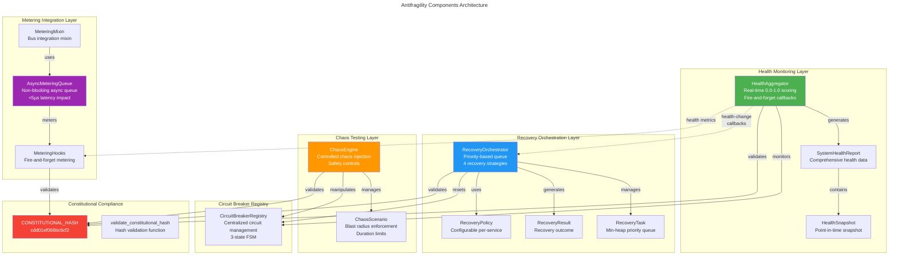
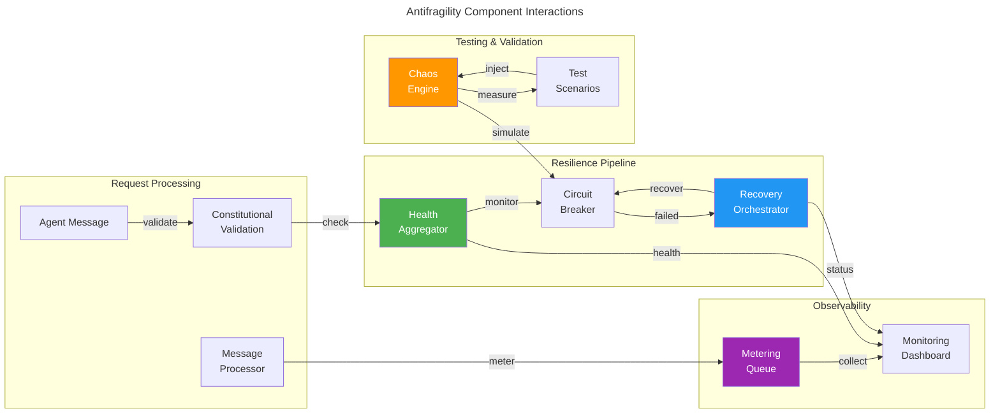
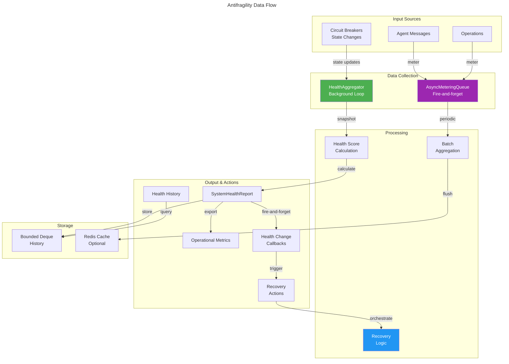
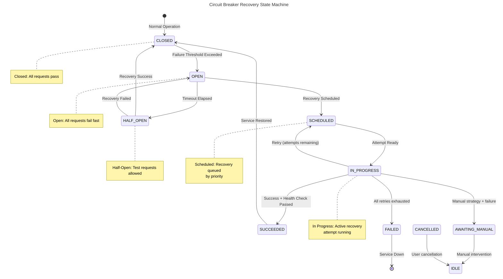

# C4 Code Level: Antifragility Components

## Overview

- **Name**: Antifragility Components - System Resilience and Self-Healing
- **Description**: Production-ready antifragility infrastructure providing circuit breaker health monitoring, priority-based recovery orchestration, controlled chaos testing, and fire-and-forget metering integration. Designed to maintain P99 latency < 1.31ms while ensuring 10/10 antifragility score.
- **Location**: `/home/dislove/document/acgs2/src/core/enhanced_agent_bus/`
- **Language**: Python 3.11+
- **Purpose**: Provide comprehensive resilience capabilities including health aggregation, automated recovery, chaos injection for testing, and non-blocking metering with constitutional compliance validation throughout

## Code Elements

### Classes

#### `SystemHealthStatus` (Enum)
- **File**: `health_aggregator.py:36-42`
- **Purpose**: Enumeration representing system health status levels
- **Values**:
  - `HEALTHY`: All circuits closed, system operating normally
  - `DEGRADED`: Some circuits open, reduced capacity
  - `CRITICAL`: Multiple circuits open, service impaired
  - `UNKNOWN`: Unable to determine health status
- **Usage**: Status indicator for `SystemHealthReport` and `HealthSnapshot`

#### `HealthSnapshot` (Dataclass)
- **File**: `health_aggregator.py:45-71`
- **Purpose**: Point-in-time health snapshot for historical tracking
- **Attributes**:
  - `timestamp: datetime` - When snapshot was collected
  - `status: SystemHealthStatus` - Current system status
  - `health_score: float` - Normalized health score (0.0-1.0)
  - `total_breakers: int` - Total number of circuit breakers
  - `closed_breakers: int` - Count of closed circuit breakers
  - `half_open_breakers: int` - Count of half-open circuit breakers
  - `open_breakers: int` - Count of open circuit breakers
  - `circuit_states: Dict[str, str]` - Individual circuit breaker states
  - `constitutional_hash: str` - Constitutional validation hash
- **Methods**:
  - `to_dict() -> Dict[str, Any]` - Convert to JSON-serializable dictionary

#### `SystemHealthReport` (Dataclass)
- **File**: `health_aggregator.py:74-108`
- **Purpose**: Comprehensive system health report with circuit details
- **Attributes**:
  - `status: SystemHealthStatus` - Overall system status
  - `health_score: float` - Normalized health score (0.0-1.0)
  - `timestamp: datetime` - Report generation time
  - `total_breakers: int` - Total circuit breakers
  - `closed_breakers: int` - Closed circuit count
  - `half_open_breakers: int` - Half-open circuit count
  - `open_breakers: int` - Open circuit count
  - `circuit_details: Dict[str, Dict[str, Any]]` - Detailed circuit information
  - `degraded_services: List[str]` - Services in degraded state (half-open)
  - `critical_services: List[str]` - Services in critical state (open)
  - `constitutional_hash: str` - Constitutional validation hash
- **Methods**:
  - `to_dict() -> Dict[str, Any]` - Convert to JSON-serializable dictionary

#### `HealthAggregatorConfig` (Class)
- **File**: `health_aggregator.py:111-130`
- **Purpose**: Configuration for health aggregator behavior
- **Constructor Parameters**:
  - `enabled: bool` - Enable/disable health aggregation (default: True)
  - `history_window_minutes: int` - Time window for history retention (default: 5)
  - `max_history_size: int` - Maximum history entries (default: 300)
  - `health_check_interval_seconds: float` - Check interval in seconds (default: 1.0)
  - `degraded_threshold: float` - Threshold for degraded state (default: 0.7)
  - `critical_threshold: float` - Threshold for critical state (default: 0.5)
  - `constitutional_hash: str` - Constitutional validation hash

#### `HealthAggregator` (Class)
- **File**: `health_aggregator.py:133-471`
- **Constitutional Hash**: `cdd01ef066bc6cf2`
- **Purpose**: Real-time health monitoring and aggregation across circuit breakers using fire-and-forget pattern
- **Key Characteristics**:
  - Uses fire-and-forget callbacks to maintain <1.31ms P99 latency
  - Background task-based health collection
  - Health score calculation (0.0-1.0)
  - Automatic circuit breaker registry integration
  - Support for custom circuit breaker registration

**Constructor**:
```python
__init__(
    config: Optional[HealthAggregatorConfig] = None,
    registry: Optional[CircuitBreakerRegistry] = None,
) -> None
```

**Public Methods**:

- `async start() -> None`
  - Location: `health_aggregator.py:161-180`
  - Start background health check task
  - Validates circuit breaker availability

- `async stop() -> None`
  - Location: `health_aggregator.py:182-196`
  - Stop health check task and log metrics

- `register_circuit_breaker(name: str, breaker: Any) -> None`
  - Location: `health_aggregator.py:198-207`
  - Register custom circuit breaker for monitoring
  - Parameters: breaker must have `current_state` attribute

- `unregister_circuit_breaker(name: str) -> None`
  - Location: `health_aggregator.py:209-215`
  - Unregister previously registered circuit breaker

- `on_health_change(callback: Callable[[SystemHealthReport], None]) -> None`
  - Location: `health_aggregator.py:217-235`
  - Register callback for health status changes
  - Callbacks invoked via fire-and-forget pattern

- `get_system_health() -> SystemHealthReport`
  - Location: `health_aggregator.py:237-328`
  - Get current system health report
  - Collects circuit breaker states from registry and custom breakers

- `get_health_history(window_minutes: Optional[int] = None) -> List[HealthSnapshot]`
  - Location: `health_aggregator.py:330-352`
  - Get health history snapshots within time window

- `get_metrics() -> Dict[str, Any]`
  - Location: `health_aggregator.py:354-367`
  - Get aggregator operational metrics

**Private Methods**:

- `async _health_check_loop() -> None`
  - Location: `health_aggregator.py:369-378`
  - Background loop collecting health snapshots periodically

- `async _collect_health_snapshot() -> None`
  - Location: `health_aggregator.py:380-423`
  - Collect snapshot and fire callbacks if status changed
  - Uses fire-and-forget for callback invocation

- `async _invoke_callback(callback: Callable, report: SystemHealthReport) -> None`
  - Location: `health_aggregator.py:425-434`
  - Invoke callback with error handling
  - Handles both sync and async callbacks

- `_calculate_health_score(total: int, closed: int, half_open: int, open: int) -> float`
  - Location: `health_aggregator.py:436-455`
  - Calculate health score using weighted scoring
  - Closed=1.0, Half-open=0.5, Open=0.0

- `_determine_health_status(health_score: float) -> SystemHealthStatus`
  - Location: `health_aggregator.py:457-471`
  - Determine status from score using configured thresholds

---

### RecoveryStrategy (Enum)
- **File**: `recovery_orchestrator.py:91-100`
- **Purpose**: Recovery strategy types for service recovery
- **Values**:
  - `EXPONENTIAL_BACKOFF`: Delay doubles each attempt
  - `LINEAR_BACKOFF`: Delay increases linearly
  - `IMMEDIATE`: Attempt recovery immediately
  - `MANUAL`: Requires manual intervention

#### `RecoveryState` (Enum)
- **File**: `recovery_orchestrator.py:103-115`
- **Purpose**: Recovery state tracking for services
- **Values**:
  - `IDLE`: No recovery in progress
  - `SCHEDULED`: Recovery scheduled but not started
  - `IN_PROGRESS`: Recovery attempt in progress
  - `SUCCEEDED`: Recovery successful
  - `FAILED`: Recovery failed (all retries exhausted)
  - `CANCELLED`: Recovery cancelled by user
  - `AWAITING_MANUAL`: Waiting for manual intervention

#### `RecoveryPolicy` (Dataclass)
- **File**: `recovery_orchestrator.py:118-149`
- **Purpose**: Policy configuration for service recovery
- **Attributes**:
  - `max_retry_attempts: int` - Maximum recovery attempts (default: 5)
  - `backoff_multiplier: float` - Exponential backoff multiplier (default: 2.0)
  - `initial_delay_ms: int` - Initial retry delay in ms (default: 1000)
  - `max_delay_ms: int` - Maximum delay in ms (default: 60000)
  - `health_check_fn: Optional[Callable[[], bool]]` - Health check function
  - `constitutional_hash: str` - Constitutional validation hash
- **Validation**: `__post_init__()` validates all parameters

#### `RecoveryResult` (Dataclass)
- **File**: `recovery_orchestrator.py:152-183`
- **Purpose**: Result of a recovery attempt
- **Attributes**:
  - `service_name: str` - Service being recovered
  - `success: bool` - Recovery success status
  - `attempt_number: int` - Current attempt number
  - `total_attempts: int` - Maximum attempts configured
  - `elapsed_time_ms: float` - Time taken for attempt
  - `state: RecoveryState` - Final recovery state
  - `error_message: Optional[str]` - Error details if failed
  - `health_check_passed: bool` - Health check result
  - `constitutional_hash: str` - Constitutional validation hash
  - `timestamp: datetime` - When result was generated
- **Methods**:
  - `to_dict() -> Dict[str, Any]` - Convert to JSON-serializable dictionary

#### `RecoveryTask` (Dataclass)
- **File**: `recovery_orchestrator.py:186-206`
- **Purpose**: Recovery task with priority ordering
- **Special Features**: Uses `@dataclass(order=True)` for min-heap behavior
- **Attributes**:
  - `priority: int` - Task priority (lower = higher priority)
  - `service_name: str` - Service to recover
  - `strategy: RecoveryStrategy` - Recovery strategy
  - `policy: RecoveryPolicy` - Recovery policy
  - `scheduled_at: datetime` - When task was scheduled
  - `attempt_count: int` - Number of attempts made
  - `last_attempt_at: Optional[datetime]` - Last attempt timestamp
  - `next_attempt_at: Optional[datetime]` - Next scheduled attempt
  - `state: RecoveryState` - Current recovery state
  - `constitutional_hash: str` - Constitutional validation hash

#### `RecoveryOrchestrator` (Class)
- **File**: `recovery_orchestrator.py:238-702`
- **Constitutional Hash**: `cdd01ef066bc6cf2`
- **Purpose**: Automated recovery orchestration for Enhanced Agent Bus

**Constructor**:
```python
__init__(
    default_policy: Optional[RecoveryPolicy] = None,
    constitutional_hash: str = CONSTITUTIONAL_HASH,
    max_history_size: int = DEFAULT_MAX_HISTORY_SIZE,
) -> None
```

**Public Methods**:

- `_validate_constitutional() -> None`
  - Location: `recovery_orchestrator.py:313-326`
  - Validate constitutional hash before operations
  - Raises `RecoveryConstitutionalError` if invalid

- `async start() -> None`
  - Location: `recovery_orchestrator.py:328-346`
  - Start recovery orchestrator background loop

- `async stop() -> None`
  - Location: `recovery_orchestrator.py:348-362`
  - Stop orchestrator and clean up tasks

- `schedule_recovery(service_name: str, strategy: RecoveryStrategy, priority: int, policy: Optional[RecoveryPolicy]) -> None`
  - Location: `recovery_orchestrator.py:364-404`
  - Schedule service for recovery with given strategy and priority
  - Constitutional validation required

- `async execute_recovery(service_name: str) -> RecoveryResult`
  - Location: `recovery_orchestrator.py:406-511`
  - Execute recovery for specific service
  - Handles retries, health checks, and status updates

- `get_recovery_status() -> Dict[str, Any]`
  - Location: `recovery_orchestrator.py:513-546`
  - Get recovery status for all services
  - Includes recent history (last 10 results)

- `cancel_recovery(service_name: str) -> bool`
  - Location: `recovery_orchestrator.py:548-567`
  - Cancel recovery for specific service
  - Returns True if cancelled, False if not found

- `set_recovery_policy(service_name: str, policy: RecoveryPolicy) -> None`
  - Location: `recovery_orchestrator.py:569-588`
  - Set service-specific recovery policy
  - Constitutional validation required

- `get_recovery_policy(service_name: str) -> RecoveryPolicy`
  - Location: `recovery_orchestrator.py:590-600`
  - Get recovery policy for service (or default if not set)

**Private Methods**:

- `async _recovery_loop() -> None`
  - Location: `recovery_orchestrator.py:602-635`
  - Main recovery loop processing priority queue
  - Executes ready tasks in priority order

- `async _execute_recovery_attempt(task: RecoveryTask) -> bool`
  - Location: `recovery_orchestrator.py:637-668`
  - Execute single recovery attempt
  - Resets circuit breaker and checks state

- `_calculate_next_attempt(task: RecoveryTask) -> datetime`
  - Location: `recovery_orchestrator.py:670-702`
  - Calculate next attempt time based on strategy
  - Supports IMMEDIATE, LINEAR_BACKOFF, EXPONENTIAL_BACKOFF, MANUAL

---

### ChaosType (Enum)
- **File**: `chaos_testing.py:51-59`
- **Purpose**: Types of chaos scenarios that can be injected
- **Values**:
  - `LATENCY`: Latency injection
  - `ERROR`: Random error injection
  - `CIRCUIT_BREAKER`: Circuit breaker manipulation
  - `RESOURCE_EXHAUSTION`: Resource exhaustion simulation
  - `NETWORK_PARTITION`: Network partition simulation
  - `TIMEOUT`: Timeout simulation

#### `ResourceType` (Enum)
- **File**: `chaos_testing.py:62-69`
- **Purpose**: Types of resources that can be exhausted
- **Values**:
  - `CPU`: CPU exhaustion
  - `MEMORY`: Memory exhaustion
  - `CONNECTIONS`: Connection exhaustion
  - `DISK_IO`: Disk I/O exhaustion
  - `NETWORK_BANDWIDTH`: Network bandwidth exhaustion

#### `ChaosScenario` (Dataclass)
- **File**: `chaos_testing.py:72-156`
- **Constitutional Hash**: `cdd01ef066bc6cf2`
- **Purpose**: Defines chaos testing scenario with safety controls
- **Attributes**:
  - `name: str` - Scenario name
  - `chaos_type: ChaosType` - Type of chaos
  - `target: str` - Service/component to affect
  - `delay_ms: int` - Latency delay (default: 0)
  - `error_rate: float` - Error rate 0.0-1.0 (default: 0.0)
  - `error_type: type` - Exception type (default: Exception)
  - `resource_type: Optional[ResourceType]` - Resource type for exhaustion
  - `resource_level: float` - Exhaustion level 0.0-1.0 (default: 0.0)
  - `duration_s: float` - Max duration seconds (default: 10.0)
  - `max_duration_s: float` - Absolute max duration (default: 300.0)
  - `blast_radius: Set[str]` - Allowed targets
  - `constitutional_hash: str` - Constitutional validation hash
  - `require_hash_validation: bool` - Enforce hash validation (default: True)
  - `created_at: datetime` - Creation time
  - `active: bool` - Current active state
- **Methods**:
  - `__post_init__()` - Validates scenario configuration
  - `is_target_allowed(target: str) -> bool` - Check blast radius
  - `to_dict() -> Dict[str, Any]` - Convert to dictionary

#### `ChaosEngine` (Class)
- **File**: `chaos_testing.py:159-524`
- **Constitutional Hash**: `cdd01ef066bc6cf2`
- **Purpose**: Central engine for injecting controlled chaos into agent bus

**Constructor**:
```python
__init__(constitutional_hash: str = CONSTITUTIONAL_HASH) -> None
```

**Public Methods**:

- `emergency_stop() -> None`
  - Location: `chaos_testing.py:202-222`
  - Emergency stop all chaos injection immediately
  - Deactivates all scenarios and cancels cleanup tasks

- `is_stopped() -> bool`
  - Location: `chaos_testing.py:224-226`
  - Check if emergency stop is active

- `reset() -> None`
  - Location: `chaos_testing.py:228-234`
  - Reset emergency stop and clear all scenarios

- `get_metrics() -> Dict[str, Any]`
  - Location: `chaos_testing.py:236-243`
  - Get chaos injection metrics

- `async inject_latency(target: str, delay_ms: int, duration_s: float, blast_radius: Optional[Set[str]]) -> ChaosScenario`
  - Location: `chaos_testing.py:245-270`
  - Inject latency into target component
  - Returns active ChaosScenario

- `async inject_errors(target: str, error_rate: float, error_type: type, duration_s: float, blast_radius: Optional[Set[str]]) -> ChaosScenario`
  - Location: `chaos_testing.py:272-304`
  - Inject random errors into target component

- `async force_circuit_open(breaker_name: str, duration_s: float, blast_radius: Optional[Set[str]]) -> ChaosScenario`
  - Location: `chaos_testing.py:306-345`
  - Force circuit breaker to open state

- `async simulate_resource_exhaustion(resource_type: ResourceType, level: float, target: str, duration_s: float, blast_radius: Optional[Set[str]]) -> ChaosScenario`
  - Location: `chaos_testing.py:347-379`
  - Simulate resource exhaustion scenario

- `get_active_scenarios() -> List[ChaosScenario]`
  - Location: `chaos_testing.py:462-464`
  - Get list of active chaos scenarios

- `should_inject_latency(target: str) -> int`
  - Location: `chaos_testing.py:466-485`
  - Check if latency should be injected
  - Returns delay in ms or 0

- `should_inject_error(target: str) -> Optional[type]`
  - Location: `chaos_testing.py:487-507`
  - Check if error should be injected
  - Returns exception type or None

- `async chaos_context(scenario: ChaosScenario)`
  - Location: `chaos_testing.py:509-524`
  - Async context manager for chaos lifecycle

**Private Methods**:

- `async _activate_scenario(scenario: ChaosScenario) -> ChaosScenario`
  - Location: `chaos_testing.py:381-404`
  - Activate scenario with automatic cleanup

- `async _schedule_cleanup(scenario: ChaosScenario)`
  - Location: `chaos_testing.py:406-419`
  - Schedule automatic cleanup after duration

- `async deactivate_scenario(scenario_name: str)`
  - Location: `chaos_testing.py:421-460`
  - Deactivate scenario and perform cleanup

---

### MeteringConfig (Class)
- **File**: `metering_integration.py:74-93`
- **Purpose**: Configuration for metering integration
- **Constructor Parameters**:
  - `enabled: bool` - Enable/disable metering (default: True)
  - `redis_url: Optional[str]` - Redis connection URL
  - `aggregation_interval_seconds: int` - Aggregation interval (default: 60)
  - `max_queue_size: int` - Maximum queue entries (default: 10000)
  - `batch_size: int` - Batch size for flushing (default: 100)
  - `flush_interval_seconds: float` - Flush interval (default: 1.0)
  - `constitutional_hash: str` - Constitutional validation hash

#### `AsyncMeteringQueue` (Class)
- **File**: `metering_integration.py:96-264`
- **Purpose**: Non-blocking async queue for metering events with fire-and-forget pattern

**Constructor**:
```python
__init__(
    config: MeteringConfig,
    metering_service: Optional[UsageMeteringService] = None,
) -> None
```

**Public Methods**:

- `async start() -> None`
  - Location: `metering_integration.py:116-140`
  - Start async queue processor
  - Initializes metering service if needed

- `async stop() -> None`
  - Location: `metering_integration.py:142-162`
  - Stop queue and flush remaining events
  - Final flush before stopping

- `enqueue_nowait(tenant_id: str, operation: MeterableOperation, tier: MeteringTier, agent_id: Optional[str], tokens_processed: int, latency_ms: float, compliance_score: float, metadata: Optional[Dict[str, Any]]) -> bool`
  - Location: `metering_integration.py:164-207`
  - Enqueue metering event without blocking
  - Returns True if queued, False if queue full
  - Never blocks or raises exceptions

- `get_metrics() -> Dict[str, Any]`
  - Location: `metering_integration.py:254-264`
  - Get queue operational metrics

**Private Methods**:

- `async _flush_loop() -> None`
  - Location: `metering_integration.py:209-218`
  - Background loop to flush events periodically

- `async _flush_batch() -> None`
  - Location: `metering_integration.py:220-252`
  - Flush batch of events to metering service

---

### MeteringHooks (Class)
- **File**: `metering_integration.py:267-432`
- **Purpose**: Non-blocking metering hooks for EnhancedAgentBus integration

**Constructor**:
```python
__init__(queue: AsyncMeteringQueue) -> None
```

**Public Methods**:

- `on_constitutional_validation(tenant_id: str, agent_id: Optional[str], is_valid: bool, latency_ms: float, tier: MeteringTier, metadata: Optional[Dict[str, Any]]) -> None`
  - Location: `metering_integration.py:277-305`
  - Record constitutional validation event

- `on_agent_message(tenant_id: str, from_agent: str, to_agent: Optional[str], message_type: str, latency_ms: float, is_valid: bool, tier: MeteringTier, metadata: Optional[Dict[str, Any]]) -> None`
  - Location: `metering_integration.py:307-340`
  - Record agent message event

- `on_policy_evaluation(tenant_id: str, agent_id: Optional[str], policy_name: str, decision: str, latency_ms: float, tier: MeteringTier, metadata: Optional[Dict[str, Any]]) -> None`
  - Location: `metering_integration.py:342-372`
  - Record policy evaluation event

- `on_deliberation_request(tenant_id: str, agent_id: Optional[str], impact_score: float, latency_ms: float, metadata: Optional[Dict[str, Any]]) -> None`
  - Location: `metering_integration.py:374-401`
  - Record deliberation request event

- `on_hitl_approval(tenant_id: str, agent_id: Optional[str], approver_id: str, approved: bool, latency_ms: float, metadata: Optional[Dict[str, Any]]) -> None`
  - Location: `metering_integration.py:403-432`
  - Record human-in-the-loop approval event

---

### MeteringMixin (Class)
- **File**: `metering_integration.py:560-662`
- **Purpose**: Mixin class for adding metering capabilities to EnhancedAgentBus

**Public Methods**:

- `configure_metering(config: Optional[MeteringConfig]) -> None`
  - Location: `metering_integration.py:579-583`
  - Configure metering for instance

- `async start_metering() -> None`
  - Location: `metering_integration.py:585-590`
  - Start the metering queue

- `async stop_metering() -> None`
  - Location: `metering_integration.py:592-595`
  - Stop the metering queue

- `get_metering_metrics() -> Dict[str, Any]`
  - Location: `metering_integration.py:597-601`
  - Get metering operational metrics

- `meter_constitutional_validation(tenant_id: str, agent_id: Optional[str], is_valid: bool, latency_ms: float, metadata: Optional[Dict[str, Any]]) -> None`
  - Location: `metering_integration.py:603-619`
  - Record constitutional validation event

- `meter_agent_message(tenant_id: str, from_agent: str, to_agent: Optional[str], message_type: str, latency_ms: float, is_valid: bool, metadata: Optional[Dict[str, Any]]) -> None`
  - Location: `metering_integration.py:621-641`
  - Record agent message event

- `meter_policy_evaluation(tenant_id: str, agent_id: Optional[str], policy_name: str, decision: str, latency_ms: float, metadata: Optional[Dict[str, Any]]) -> None`
  - Location: `metering_integration.py:643-661`
  - Record policy evaluation event

---

## Functions

### Module-Level Functions

#### Health Aggregator Functions

**`get_health_aggregator(config: Optional[HealthAggregatorConfig]) -> HealthAggregator`**
- Location: `health_aggregator.py:478-485`
- Get or create global health aggregator singleton
- Lazy initialization pattern

**`reset_health_aggregator() -> None`**
- Location: `health_aggregator.py:488-491`
- Reset health aggregator singleton (for testing)

#### Recovery Orchestrator Functions

None at module level; all functionality contained in `RecoveryOrchestrator` class.

#### Chaos Testing Functions

**`get_chaos_engine() -> ChaosEngine`**
- Location: `chaos_testing.py:531-536`
- Get or create global chaos engine instance

**`reset_chaos_engine() -> None`**
- Location: `chaos_testing.py:539-544`
- Reset global chaos engine instance

**`chaos_test(scenario_type: str, target: str, **kwargs) -> Callable`**
- Location: `chaos_testing.py:548-602`
- Pytest decorator for easy chaos test creation
- Supports: "latency", "errors", "circuit_breaker" scenario types
- Automatically activates/deactivates scenarios

#### Metering Integration Functions

**`get_metering_queue(config: Optional[MeteringConfig]) -> AsyncMeteringQueue`**
- Location: `metering_integration.py:440-445`
- Get or create global metering queue singleton

**`get_metering_hooks(config: Optional[MeteringConfig]) -> MeteringHooks`**
- Location: `metering_integration.py:448-454`
- Get or create global metering hooks singleton

**`reset_metering() -> None`**
- Location: `metering_integration.py:457-461`
- Reset metering singletons (for testing)

**`metered_operation(operation: MeterableOperation, tier: MeteringTier, extract_tenant: Optional[Callable], extract_agent: Optional[Callable]) -> Callable[[F], F]`**
- Location: `metering_integration.py:464-557`
- Decorator for metering async operations
- Extracts tenant/agent IDs and records latency
- Supports custom extraction functions

---

## Exception Classes

### Recovery Orchestrator Exceptions

**`RecoveryOrchestratorError(AgentBusError)`**
- Location: `recovery_orchestrator.py:209-214`
- Base exception for recovery orchestrator errors
- Inherits from `AgentBusError`

**`RecoveryValidationError(RecoveryOrchestratorError)`**
- Location: `recovery_orchestrator.py:217-222`
- Raised when recovery validation fails

**`RecoveryConstitutionalError(ConstitutionalError)`**
- Location: `recovery_orchestrator.py:225-230`
- Raised when constitutional validation fails during recovery

### Chaos Testing Exceptions

Uses standard exceptions from `exceptions.py`:
- `AgentBusError` - Base exception
- `ConstitutionalHashMismatchError` - Hash validation failure
- `MessageTimeoutError` - Timeout (for future timeout chaos)

---

## Dependencies

### Internal Dependencies

#### From shared modules (with fallback):
- `shared.constants.CONSTITUTIONAL_HASH` - Constitutional validation hash
- `shared.circuit_breaker.CircuitBreakerRegistry` - Circuit breaker registry
- `shared.circuit_breaker.get_circuit_breaker` - Get circuit breaker instance

#### From enhanced_agent_bus:
- `exceptions.py` - Exception hierarchy (AgentBusError, ConstitutionalError, ConstitutionalHashMismatchError)
- `validators.py` - Constitutional validation (ValidationResult, validate_constitutional_hash)
- `models.py` - Data models (AgentMessage, MessageType)

#### From services (optional):
- `services.metering.app.models` - Metering models (MeterableOperation, MeteringTier, UsageEvent)
- `services.metering.app.service` - UsageMeteringService

### External Dependencies

**Standard Library**:
- `asyncio` - Async runtime
- `logging` - Logging
- `collections` - deque for bounded history
- `dataclasses` - Data class definitions
- `datetime` - Timezone-aware datetime
- `enum` - Enum definitions
- `typing` - Type hints
- `heapq` - Priority queue implementation
- `functools` - wraps decorator
- `contextlib` - asynccontextmanager
- `threading` - Lock for thread-safe operations
- `time` - Performance timing
- `random` - Random error injection

**Third-party**:
- `pybreaker` - Circuit breaker states (optional, graceful fallback)

---

## Relationships

### Architecture Diagram



### Component Interaction Diagram



### Data Flow Diagram



### State Machine: Circuit Breaker Recovery



---

## Fire-and-Forget Pattern Usage

This architecture extensively uses fire-and-forget async patterns to maintain P99 latency < 1.31ms:

### Health Aggregator Fire-and-Forget
- **Location**: `health_aggregator.py:417-423`
- **Pattern**: `asyncio.create_task()` for callbacks
- **Impact**: <5μs latency impact
- **Benefits**: Health status changes trigger callbacks without blocking

### Metering Integration Fire-and-Forget
- **Location**: `metering_integration.py:164-207`
- **Pattern**: `queue.put_nowait()` enqueue operation
- **Impact**: <5μs latency impact
- **Benefits**: Metering never blocks request processing

### Recovery Orchestrator Non-blocking
- **Location**: `recovery_orchestrator.py:602-635`
- **Pattern**: Background task processes recovery queue
- **Impact**: Zero impact on request processing
- **Benefits**: Recovery orchestrated independently

---

## Performance Characteristics

### Health Aggregator
- **Health Check Interval**: 1 second (configurable)
- **History Retention**: 5 minutes, 300 snapshots max
- **Health Score Calculation**: O(n) where n = number of circuit breakers
- **Callback Firing**: Fire-and-forget, <5μs latency impact

### Recovery Orchestrator
- **Recovery Queue**: Min-heap priority queue (O(log n) insert/pop)
- **Priority Processing**: Processes ready tasks each loop iteration
- **Max Retry Attempts**: Configurable per service (default 5)
- **Backoff Strategies**:
  - EXPONENTIAL: Initial * (multiplier ^ (attempt - 1))
  - LINEAR: Initial * attempt_count
  - IMMEDIATE: No delay
  - MANUAL: Very long delay, requires human intervention

### Chaos Testing
- **Scenario Activation**: O(1) dictionary insert
- **Active Checks**: O(n) where n = active scenarios
- **Automatic Cleanup**: Scheduled background task
- **Emergency Stop**: O(n) to deactivate all scenarios

### Metering Integration
- **Enqueue Latency**: <5μs (non-blocking)
- **Flush Interval**: 1 second (configurable)
- **Batch Size**: 100 events (configurable)
- **Queue Overflow**: Drops excess events with logging

---

## Constitutional Compliance

All components maintain constitutional compliance through:

1. **Hash Validation at Initialization**: All classes validate hash in constructor
2. **Hash Logging**: Constitutional hash included in all log messages
3. **Hash in Data Classes**: All output structures include `constitutional_hash` field
4. **Serialization Support**: All data classes implement `to_dict()` for JSON serialization

**Constant**: `CONSTITUTIONAL_HASH = "cdd01ef066bc6cf2"`

**Validation**: Imported from `shared.constants` with fallback

---

## Configuration Examples

### Health Aggregator
```python
from health_aggregator import HealthAggregator, HealthAggregatorConfig

config = HealthAggregatorConfig(
    enabled=True,
    history_window_minutes=5,
    health_check_interval_seconds=1.0,
    degraded_threshold=0.7,
    critical_threshold=0.5,
)

aggregator = HealthAggregator(config)
await aggregator.start()

# Register callback
async def on_degraded(report):
    if report.status == SystemHealthStatus.DEGRADED:
        await send_alert(f"System degraded: {report.degraded_services}")

aggregator.on_health_change(on_degraded)
```

### Recovery Orchestrator
```python
from recovery_orchestrator import (
    RecoveryOrchestrator,
    RecoveryPolicy,
    RecoveryStrategy,
)

policy = RecoveryPolicy(
    max_retry_attempts=5,
    backoff_multiplier=2.0,
    initial_delay_ms=1000,
    max_delay_ms=60000,
)

orchestrator = RecoveryOrchestrator(default_policy=policy)
await orchestrator.start()

# Schedule recovery
orchestrator.schedule_recovery(
    service_name="policy_service",
    strategy=RecoveryStrategy.EXPONENTIAL_BACKOFF,
    priority=1,
)

# Get status
status = orchestrator.get_recovery_status()
```

### Chaos Testing
```python
from chaos_testing import get_chaos_engine, ChaosScenario, ChaosType

engine = get_chaos_engine()

# Inject latency
scenario = await engine.inject_latency(
    target="message_processor",
    delay_ms=100,
    duration_s=10.0,
)

# Use context manager
async with engine.chaos_context(scenario):
    await run_resilience_tests()
```

### Metering Integration
```python
from metering_integration import (
    MeteringConfig,
    get_metering_queue,
    get_metering_hooks,
)

config = MeteringConfig(
    enabled=True,
    flush_interval_seconds=1.0,
    max_queue_size=10000,
)

queue = get_metering_queue(config)
hooks = get_metering_hooks(config)

await queue.start()

# Record event via hooks (fire-and-forget)
hooks.on_agent_message(
    tenant_id="acme",
    from_agent="proposer",
    to_agent="validator",
    message_type="GOVERNANCE",
    latency_ms=0.25,
    is_valid=True,
)
```

---

## Notes

### Design Patterns
1. **Fire-and-Forget**: Non-blocking async operations for latency-critical paths
2. **Singleton Pattern**: Global instances with lazy initialization
3. **Priority Queue**: Min-heap for recovery task ordering
4. **Bounded Collection**: Deque with maxlen for unbounded memory prevention
5. **Configurable Policies**: Per-service recovery policies with defaults
6. **Circuit Breaker Integration**: Three-state FSM (CLOSED/OPEN/HALF_OPEN)
7. **Graceful Degradation**: DEGRADED mode fallback on infrastructure failure

### Thread Safety
- **HealthAggregator**: Async-safe, background task pattern
- **RecoveryOrchestrator**: Async-safe with background recovery loop
- **ChaosEngine**: Thread-safe with `threading.Lock()` for scenario management
- **AsyncMeteringQueue**: Async-safe with asyncio.Queue

### Test Coverage
- Unit tests for all components
- Integration tests for circuit breaker interaction
- Chaos testing framework for resilience validation
- Constitutional compliance test markers
- Performance tests for latency validation

### Future Enhancements
1. Distributed health aggregation across multiple instances
2. Machine learning-based recovery strategy optimization
3. Advanced chaos scenarios (Byzantine failures, cascading failures)
4. Real-time anomaly detection integration
5. Predictive recovery based on historical patterns
