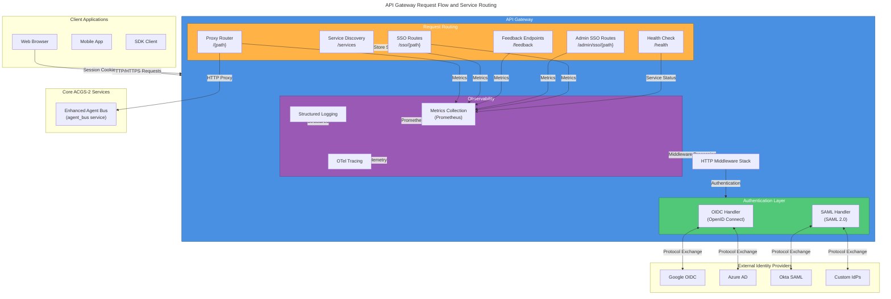
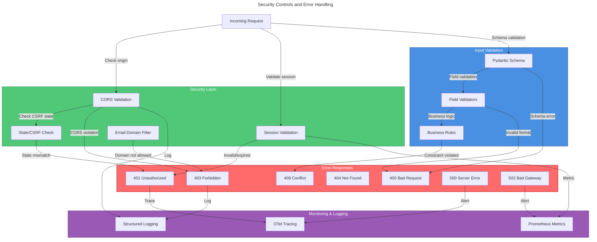

# C4 Code Level: API Gateway

## Overview

- **Name**: API Gateway
- **Description**: Unified ingress layer providing authentication, SSO, rate limiting, and request routing to core ACGS-2 services
- **Location**: `/home/dislove/document/acgs2/src/core/services/api_gateway`
- **Language**: Python 3.11-3.13 with FastAPI and Starlette
- **Purpose**: Single entry point for all ACGS-2 HTTP traffic with enterprise-grade authentication, request routing, metrics collection, and health monitoring
- **Constitutional Hash**: `cdd01ef066bc6cf2`

## Architecture Context

The API Gateway serves as the primary ingress component in the 3-service consolidated ACGS-2 architecture, providing:
- Request routing and proxying to the Enhanced Agent Bus
- Single Sign-On (SSO) authentication via OIDC and SAML 2.0
- Request metrics and monitoring
- Health checks and service discovery
- User feedback collection
- Session management with JWT and SAML session indexing
- CORS and security middleware

## Code Elements

### Core Application Module (`main.py`)

#### FastAPI Application Factory
- **Location**: `/home/dislove/document/acgs2/src/core/services/api_gateway/main.py:36-41`
- **Name**: `app`
- **Type**: FastAPI instance
- **Description**: Primary FastAPI application for the API Gateway service
- **Features**:
  - ORJSONResponse for high-performance JSON serialization
  - CORS middleware configuration
  - SessionMiddleware for OAuth state management
  - OpenTel tracing integration
  - Custom validation error handling

#### Exception Handler Functions

##### Validation Error Handler
- **Signature**: `async def validation_exception_handler(request: Request, exc: RequestValidationError) -> JSONResponse`
- **Location**: `/home/dislove/document/acgs2/src/core/services/api_gateway/main.py:44-67`
- **Purpose**: Handle non-serializable request bodies (FormData, etc.) and return structured error responses
- **Parameters**:
  - `request: Request` - The incoming HTTP request
  - `exc: RequestValidationError` - FastAPI validation error with error details
- **Returns**: JSONResponse with status code 422 and detailed error information
- **Key Behavior**: Converts non-serializable body types to strings/dicts for logging

#### Health Check Endpoint
- **Signature**: `async def health_check() -> JSONDict`
- **Location**: `/home/dislove/document/acgs2/src/core/services/api_gateway/main.py:132-137`
- **HTTP Route**: `GET /health`
- **Metrics**: Tracked via `@track_request_metrics("api-gateway", "/health")`
- **Returns**: Service status, name, and environment
- **Response Model**:
  ```python
  {
    "status": "healthy",
    "service": "api-gateway",
    "environment": str
  }
  ```

#### Feedback Models

##### FeedbackRequest
- **Location**: `/home/dislove/document/acgs2/src/core/services/api_gateway/main.py:110-120`
- **Type**: Pydantic BaseModel
- **Fields**:
  - `user_id: str` - User identifier (required)
  - `category: str` - Feedback category: "bug", "feature", "general"
  - `rating: int` - Numerical rating from 1-5
  - `title: str` - Feedback title (required)
  - `description: str` - Detailed feedback description (required)
  - `user_agent: str` - Browser user agent (default: "")
  - `url: str` - Current page URL (default: "")
  - `metadata: JSONDict` - Additional metadata (default: {})

##### FeedbackResponse
- **Location**: `/home/dislove/document/acgs2/src/core/services/api_gateway/main.py:123-129`
- **Type**: Pydantic BaseModel
- **Fields**:
  - `feedback_id: str` - Generated UUID for the feedback record
  - `status: str` - Submission status
  - `timestamp: str` - ISO 8601 timestamp
  - `message: str` - User-friendly confirmation message

#### Feedback Endpoints

##### Submit Feedback
- **Signature**: `async def submit_feedback(feedback: FeedbackRequest, request: Request, background_tasks: BackgroundTasks) -> FeedbackResponse`
- **Location**: `/home/dislove/document/acgs2/src/core/services/api_gateway/main.py:141-183`
- **HTTP Route**: `POST /feedback`
- **Metrics**: Tracked via `@track_request_metrics("api-gateway", "/feedback")`
- **Purpose**: Asynchronously collect and store user feedback
- **Process**:
  1. Generate unique feedback_id (UUID4)
  2. Create feedback record with metadata
  3. Queue save_feedback_to_file as background task
  4. Log feedback submission with category
  5. Return confirmation response
- **Background Task**: Saves feedback to `/tmp/feedback/{feedback_id}.json`
- **Error Handling**: Catches all exceptions, logs errors, returns 500 status

##### Get Feedback Statistics
- **Signature**: `async def get_feedback_stats(user: UserClaims = Depends(get_current_user_optional)) -> JSONDict`
- **Location**: `/home/dislove/document/acgs2/src/core/services/api_gateway/main.py:186-233`
- **HTTP Route**: `GET /feedback/stats`
- **Metrics**: Tracked via `@track_request_metrics("api-gateway", "/feedback/stats")`
- **Purpose**: Admin endpoint to retrieve aggregated feedback statistics
- **Process**:
  1. Validate user has permission (optional auth)
  2. Count feedback files in `/tmp/feedback`
  3. Parse first 100 feedback files
  4. Aggregate by category and rating
  5. Calculate average rating
- **Returns**:
  ```python
  {
    "total_feedback": int,
    "categories": Dict[str, int],
    "ratings": {1: int, 2: int, 3: int, 4: int, 5: int},
    "average_rating": float
  }
  ```
- **Limits**: Processes only first 100 files to avoid performance issues

#### Service Discovery Endpoint
- **Signature**: `async def list_services() -> Dict[str, JSONDict]`
- **Location**: `/home/dislove/document/acgs2/src/core/services/api_gateway/main.py:236-258`
- **HTTP Route**: `GET /services`
- **Metrics**: Tracked via `@track_request_metrics("api-gateway", "/services")`
- **Purpose**: List available services and their health status
- **Services**:
  - `agent-bus`: Main service URL from configuration
  - `api-gateway`: Self (localhost:8080)
- **Health Check**: Performs async HTTP GET to `/health` endpoint of each service
- **Status Values**: "running", "healthy", "unhealthy", "unreachable"
- **Timeout**: 5 seconds per service health check

#### Proxy Router Function
- **Signature**: `async def proxy_to_agent_bus(request: Request, path: str) -> ORJSONResponse`
- **Location**: `/home/dislove/document/acgs2/src/core/services/api_gateway/main.py:268-309`
- **HTTP Routes**: `GET|POST|PUT|DELETE|PATCH /{path:path}` (catch-all route)
- **Purpose**: Forward all unmatched requests to Enhanced Agent Bus service
- **Process**:
  1. Construct target URL: `{AGENT_BUS_URL}/{path}`
  2. Append query parameters if present
  3. Forward request body as-is
  4. Use httpx AsyncClient with 30-second timeout
  5. Return response with appropriate status code
- **Content Type**: Detects JSON responses and parses accordingly
- **Error Handling**:
  - `httpx.RequestError`: Returns 502 "Service unavailable"
  - Generic exceptions: Returns 500 "Internal server error"
- **Headers**: Forwards all original request headers

#### Background Task: Save Feedback
- **Signature**: `async def save_feedback_to_file(feedback_record: JSONDict) -> None`
- **Location**: `/home/dislove/document/acgs2/src/core/services/api_gateway/main.py:312-329`
- **Purpose**: Asynchronously persist feedback records to filesystem (development only)
- **Process**:
  1. Extract feedback_id from record
  2. Create file path: `/tmp/feedback/{feedback_id}.json`
  3. Write record as JSON with 2-space indentation
  4. Log success with feedback_id
- **Error Handling**: Catches all exceptions, logs comprehensive error details without re-raising

#### Module Initialization
- **Location**: `/home/dislove/document/acgs2/src/core/services/api_gateway/main.py:27-35`
- **Service Name**: `"api_gateway"`
- **Logging**: Configured via `configure_logging()` before any other operations
- **Configuration**: Loaded from `src.core.shared.config.settings`

#### Environment & Configuration
- **Location**: `/home/dislove/document/acgs2/src/core/services/api_gateway/main.py:100-106`
- **Variables**:
  - `AGENT_BUS_URL`: Agent Bus service URL (from settings.services.agent_bus_url)
  - `ENVIRONMENT`: Current environment (from settings.env)
  - `FEEDBACK_DIR`: Feedback storage directory (Path("/tmp/feedback"))
- **Session Configuration**:
  - Secret: JWT_SECRET from settings or generated random token
  - Cookie name: "acgs2_session"
  - Max age: Configured in settings.sso.session_lifetime_seconds
  - Same-site: "lax"
  - HTTPS only: Enabled in production

### Metrics Module (`metrics.py`)

#### Module Constants
- **Location**: `/home/dislove/document/acgs2/src/core/services/api_gateway/metrics.py:1-42`
- **CONSTITUTIONAL_HASH**: `"cdd01ef066bc6cf2"` (line 19)
- **PROMETHEUS_AVAILABLE**: Boolean indicating Prometheus client availability (graceful fallback)

#### No-Op Metric Implementation

##### NoOpMetric Class
- **Location**: `/home/dislove/document/acgs2/src/core/services/api_gateway/metrics.py:48-64`
- **Purpose**: Placeholder metric for when Prometheus client is unavailable
- **Methods**:
  - `labels(**kwargs) -> NoOpMetric`: Returns self for method chaining
  - `inc(amount: float = 1) -> None`: No-op increment
  - `dec(amount: float = 1) -> None`: No-op decrement
  - `observe(value: float) -> None`: No-op observation
  - `set(value: float) -> None`: No-op value setting

#### Metric Registration Helpers

##### Find Existing Metric
- **Signature**: `def _find_existing_metric(name: str) -> Optional[Collector]`
- **Location**: `/home/dislove/document/acgs2/src/core/services/api_gateway/metrics.py:74-86`
- **Purpose**: Search Prometheus registry for existing metrics (avoid duplicate registration)
- **Returns**: Existing metric or None

##### Get or Create Histogram
- **Signature**: `def _get_or_create_histogram(name: str, description: str, labels: list, buckets: Optional[list] = None) -> Union[Histogram, NoOpMetric]`
- **Location**: `/home/dislove/document/acgs2/src/core/services/api_gateway/metrics.py:89-118`
- **Purpose**: Get or create Prometheus histogram metric with caching
- **Bucket Options**: Custom buckets or default (no buckets specified)
- **Error Handling**: Gracefully returns NoOpMetric if registration fails

##### Get or Create Counter
- **Signature**: `def _get_or_create_counter(name: str, description: str, labels: list) -> Union[Counter, NoOpMetric]`
- **Location**: `/home/dislove/document/acgs2/src/core/services/api_gateway/metrics.py:121-144`
- **Purpose**: Get or create Prometheus counter metric with caching
- **Error Handling**: Gracefully returns NoOpMetric if registration fails

##### Get or Create Gauge
- **Signature**: `def _get_or_create_gauge(name: str, description: str, labels: list) -> Union[Gauge, NoOpMetric]`
- **Location**: `/home/dislove/document/acgs2/src/core/services/api_gateway/metrics.py:147-170`
- **Purpose**: Get or create Prometheus gauge metric with caching
- **Error Handling**: Gracefully returns NoOpMetric if registration fails

#### HTTP Request Metrics

##### HTTP Request Duration
- **Name**: `http_request_duration_seconds`
- **Type**: Histogram
- **Location**: `/home/dislove/document/acgs2/src/core/services/api_gateway/metrics.py:178-199`
- **Labels**: `["method", "endpoint", "service", "status_code"]`
- **Buckets**: Sub-millisecond precision optimized for P99 < 1ms target
  - `0.0001` (0.1ms), `0.00025` (0.25ms), `0.0005` (0.5ms), `0.00075` (0.75ms)
  - `0.001` (1ms - target P99), `0.0025` (2.5ms), `0.005` (5ms), `0.01` (10ms)
  - `0.025` (25ms), `0.05` (50ms), `0.1` (100ms), `0.25` (250ms), `0.5` (500ms), `1.0` (1s)

##### HTTP Requests Total
- **Name**: `http_requests_total`
- **Type**: Counter
- **Location**: `/home/dislove/document/acgs2/src/core/services/api_gateway/metrics.py:201-205`
- **Labels**: `["method", "endpoint", "service", "status_code"]`
- **Purpose**: Track total HTTP requests across all endpoints

##### HTTP Requests In Progress
- **Name**: `http_requests_in_progress`
- **Type**: Gauge
- **Location**: `/home/dislove/document/acgs2/src/core/services/api_gateway/metrics.py:207-211`
- **Labels**: `["method", "service"]`
- **Purpose**: Real-time monitoring of concurrent request processing

#### Cache Metrics

##### Cache Hits Total
- **Name**: `cache_hits_total`
- **Type**: Counter
- **Location**: `/home/dislove/document/acgs2/src/core/services/api_gateway/metrics.py:214-218`
- **Labels**: `["cache_type", "service"]`
- **Target Rate**: >98% hit rate tracking

##### Cache Misses Total
- **Name**: `cache_misses_total`
- **Type**: Counter
- **Location**: `/home/dislove/document/acgs2/src/core/services/api_gateway/metrics.py:220-224`
- **Labels**: `["cache_type", "service"]`

##### Cache Operation Duration
- **Name**: `cache_operation_duration_seconds`
- **Type**: Histogram
- **Location**: `/home/dislove/document/acgs2/src/core/services/api_gateway/metrics.py:226-231`
- **Labels**: `["operation", "cache_type", "service"]`
- **Buckets**: `[0.0001, 0.0005, 0.001, 0.005, 0.01, 0.025, 0.05, 0.1]`

#### Connection Pool Metrics

##### Connection Pool Size
- **Name**: `connection_pool_size`
- **Type**: Gauge
- **Location**: `/home/dislove/document/acgs2/src/core/services/api_gateway/metrics.py:234-238`
- **Labels**: `["pool_type", "service"]`

##### Connection Pool Available
- **Name**: `connection_pool_available`
- **Type**: Gauge
- **Location**: `/home/dislove/document/acgs2/src/core/services/api_gateway/metrics.py:240-244`
- **Labels**: `["pool_type", "service"]`

#### Proxy Metrics

##### Proxy Requests Total
- **Name**: `proxy_requests_total`
- **Type**: Counter
- **Location**: `/home/dislove/document/acgs2/src/core/services/api_gateway/metrics.py:247-251`
- **Labels**: `["target_service", "status_code"]`
- **Purpose**: Track all requests proxied to backend services

##### Proxy Duration
- **Name**: `proxy_duration_seconds`
- **Type**: Histogram
- **Location**: `/home/dislove/document/acgs2/src/core/services/api_gateway/metrics.py:253-258`
- **Labels**: `["target_service"]`
- **Buckets**: `[0.001, 0.005, 0.01, 0.025, 0.05, 0.1, 0.25, 0.5, 1.0, 2.5, 5.0]`

#### MetricsMiddleware Class

##### Class Definition
- **Location**: `/home/dislove/document/acgs2/src/core/services/api_gateway/metrics.py:265-340`
- **Type**: BaseHTTPMiddleware
- **Purpose**: Automatic HTTP request metrics collection
- **Parent**: Starlette BaseHTTPMiddleware

##### Constructor
- **Signature**: `def __init__(self, app, service_name: str = "api_gateway") -> None`
- **Parameters**:
  - `app`: FastAPI/Starlette application instance
  - `service_name`: Service identifier for metrics labels (default: "api_gateway")

##### Dispatch Method
- **Signature**: `async def dispatch(self, request: Request, call_next: Callable) -> Response`
- **Location**: `/home/dislove/document/acgs2/src/core/services/api_gateway/metrics.py:277-321`
- **Process**:
  1. Extract HTTP method and normalize endpoint path
  2. Increment in-progress counter
  3. Record start time (perf_counter for high precision)
  4. Execute next middleware/handler
  5. Capture response status code
  6. Record request duration
  7. Increment total requests counter
  8. Decrement in-progress counter
- **Error Handling**: Sets status code to "500" on exception, re-raises
- **Timing**: Uses `time.perf_counter()` for sub-microsecond precision

##### Endpoint Normalization
- **Signature**: `def _normalize_endpoint(self, path: str) -> str`
- **Location**: `/home/dislove/document/acgs2/src/core/services/api_gateway/metrics.py:323-340`
- **Purpose**: Reduce metric cardinality by replacing dynamic segments
- **Replacements**:
  - UUIDs: `[0-9a-f]{8}-[0-9a-f]{4}...` → `{uuid}`
  - Numeric IDs: `/\d+(?=/|$)` → `/{id}`
- **Regex Flags**: Case-insensitive for UUID matching

#### Cache Metrics Helper Functions

##### Record Cache Hit
- **Signature**: `def record_cache_hit(cache_type: str = "redis", service: str = "api_gateway") -> None`
- **Location**: `/home/dislove/document/acgs2/src/core/services/api_gateway/metrics.py:348-350`
- **Purpose**: Increment cache hits counter
- **Default Labels**: Redis cache, api_gateway service

##### Record Cache Miss
- **Signature**: `def record_cache_miss(cache_type: str = "redis", service: str = "api_gateway") -> None`
- **Location**: `/home/dislove/document/acgs2/src/core/services/api_gateway/metrics.py:353-355`
- **Purpose**: Increment cache misses counter
- **Default Labels**: Redis cache, api_gateway service

##### Record Cache Operation
- **Signature**: `def record_cache_operation(operation: str, duration: float, cache_type: str = "redis", service: str = "api_gateway") -> None`
- **Location**: `/home/dislove/document/acgs2/src/core/services/api_gateway/metrics.py:358-369`
- **Parameters**:
  - `operation: str` - Operation type (e.g., "get", "set", "delete")
  - `duration: float` - Operation duration in seconds
  - `cache_type: str` - Cache implementation (default: "redis")
  - `service: str` - Service identifier (default: "api_gateway")

##### Record Proxy Request
- **Signature**: `def record_proxy_request(target_service: str, status_code: int, duration: float) -> None`
- **Location**: `/home/dislove/document/acgs2/src/core/services/api_gateway/metrics.py:372-382`
- **Parameters**:
  - `target_service: str` - Proxied service name
  - `status_code: int` - HTTP response status code
  - `duration: float` - Proxy time in seconds

##### Update Connection Pool Metrics
- **Signature**: `def update_connection_pool_metrics(pool_type: str, size: int, available: int, service: str = "api_gateway") -> None`
- **Location**: `/home/dislove/document/acgs2/src/core/services/api_gateway/metrics.py:385-393`
- **Parameters**:
  - `pool_type: str` - Pool type (e.g., "httpx", "postgres", "redis")
  - `size: int` - Total pool size
  - `available: int` - Available connections
  - `service: str` - Service identifier (default: "api_gateway")

#### Metrics Endpoint Functions

##### Get Metrics
- **Signature**: `def get_metrics() -> bytes`
- **Location**: `/home/dislove/document/acgs2/src/core/services/api_gateway/metrics.py:401-405`
- **Purpose**: Generate Prometheus metrics output in OpenMetrics format
- **Returns**: Bytes containing metric text or placeholder if Prometheus unavailable

##### Get Metrics Content Type
- **Signature**: `def get_metrics_content_type() -> str`
- **Location**: `/home/dislove/document/acgs2/src/core/services/api_gateway/metrics.py:408-412`
- **Purpose**: Return appropriate Content-Type header for metrics endpoint
- **Returns**: `"application/openmetrics-text; version=1.0.0; charset=utf-8"` or `"text/plain; charset=utf-8"`

##### Create Metrics Endpoint
- **Signature**: `def create_metrics_endpoint() -> Callable`
- **Location**: `/home/dislove/document/acgs2/src/core/services/api_gateway/metrics.py:415-431`
- **Purpose**: Factory function to create FastAPI metrics endpoint
- **Returns**: Async function that returns Response with metrics
- **Usage**: `app.add_api_route('/metrics', create_metrics_endpoint())`

### SSO Routes Module (`routes/sso.py`)

#### Router Instance
- **Location**: `/home/dislove/document/acgs2/src/core/services/api_gateway/routes/sso.py:62-63`
- **Name**: `router` (exported as `sso_router`)
- **Type**: APIRouter
- **Prefix**: `/sso` (added in main.py:262)
- **Tag**: "SSO"

#### OIDC Handler Management

##### Get OIDC Handler
- **Signature**: `def get_oidc_handler() -> OIDCHandler`
- **Location**: `/home/dislove/document/acgs2/src/core/services/api_gateway/routes/sso.py:72-89`
- **Purpose**: Dependency injection function to get or create OIDC handler singleton
- **Initialization**:
  1. Check if `_oidc_handler` is None
  2. Create new OIDCHandler instance
  3. Register default providers via `_register_default_providers()`
  4. Return instance
- **Error Handling**: Raises HTTPException if OIDC is disabled

##### Register Default OIDC Providers
- **Signature**: `def _register_default_providers(handler: OIDCHandler) -> None`
- **Location**: `/home/dislove/document/acgs2/src/core/services/api_gateway/routes/sso.py:92-158`
- **Purpose**: Register OIDC providers from configuration settings
- **Process**:
  1. Check if OIDC is enabled in settings
  2. If enabled, register "default" provider with:
     - Client ID from settings
     - Client secret from settings (secure value)
     - Discovery URL (OIDC metadata endpoint)
     - OAuth scopes
     - PKCE setting
  3. Log available provider templates (Google, Azure, Okta)
- **Error Handling**: Logs warnings for failed registrations, continues execution

#### SAML Handler Management

##### Get SAML Handler
- **Signature**: `def get_saml_handler(req: FastAPIRequest) -> SAMLHandler`
- **Location**: `/home/dislove/document/acgs2/src/core/services/api_gateway/routes/sso.py:161-200`
- **Purpose**: Dependency injection function to get or create SAML handler singleton
- **Process**:
  1. Check if `_saml_handler` is None
  2. Construct SP configuration with absolute URLs from request
  3. Create SAMLHandler with SP config
  4. Register default IdP providers
  5. Return instance
- **SP Configuration Fields**:
  - Entity ID (or derived from base URL)
  - ACS URL: `{base_url}/sso/saml/acs`
  - SLS URL: `{base_url}/sso/saml/sls`
  - Sign authn requests (from settings)
  - Want assertions signed/encrypted (from settings)

##### Register Default SAML Providers
- **Signature**: `def _register_default_saml_providers(handler: SAMLHandler) -> None`
- **Location**: `/home/dislove/document/acgs2/src/core/services/api_gateway/routes/sso.py:203-251`
- **Purpose**: Register SAML IdP from configuration settings
- **Process**:
  1. Check if SAML is enabled
  2. If metadata URL or SSO URL configured, register "default" IdP with:
     - Metadata URL (for IdP discovery)
     - Entity ID
     - SSO URL
     - SLO URL
     - IdP certificate
     - Want assertions signed flag
  3. Log registration status
- **Error Handling**: Logs warnings/errors for configuration issues, continues execution

#### SSO Response Models

##### SSOLoginResponse
- **Location**: `/home/dislove/document/acgs2/src/core/services/api_gateway/routes/sso.py:255-260`
- **Fields**:
  - `redirect_url: str` - URL to redirect user for authentication
  - `state: str` - CSRF protection state parameter
  - `provider: str` - SSO provider name

##### SSOUserInfoResponse
- **Location**: `/home/dislove/document/acgs2/src/core/services/api_gateway/routes/sso.py:263-272`
- **Fields**:
  - `sub: str` - Subject identifier from IdP (unique user ID)
  - `email: Optional[str]` - User email
  - `email_verified: bool` - Email verification status
  - `name: Optional[str]` - Full name
  - `given_name: Optional[str]` - First name
  - `family_name: Optional[str]` - Last name
  - `groups: List[str]` - Group memberships from IdP

##### SSOProviderInfo
- **Location**: `/home/dislove/document/acgs2/src/core/services/api_gateway/routes/sso.py:275-280`
- **Fields**:
  - `name: str` - Provider name
  - `type: str` - "oidc" or "saml"
  - `enabled: bool` - Provider status

##### SSOLogoutResponse
- **Location**: `/home/dislove/document/acgs2/src/core/services/api_gateway/routes/sso.py:283-288`
- **Fields**:
  - `success: bool` - Logout success status
  - `message: str` - Status message
  - `redirect_url: Optional[str]` - IdP logout URL (if available)

##### SAMLUserInfoResponse
- **Location**: `/home/dislove/document/acgs2/src/core/services/api_gateway/routes/sso.py:291-300`
- **Fields**:
  - `name_id: str` - SAML NameID (unique identifier)
  - `email: Optional[str]` - User email
  - `name: Optional[str]` - Full name
  - `given_name: Optional[str]` - First name
  - `family_name: Optional[str]` - Last name
  - `groups: List[str]` - Group memberships
  - `session_index: Optional[str]` - For SAML logout support

#### OIDC Endpoints

##### List OIDC Providers
- **Signature**: `async def list_oidc_providers(handler: OIDCHandler) -> List[SSOProviderInfo]`
- **Location**: `/home/dislove/document/acgs2/src/core/services/api_gateway/routes/sso.py:371-381`
- **HTTP Route**: `GET /sso/oidc/providers`
- **Response Model**: `list[SSOProviderInfo]`
- **Purpose**: List all available OIDC providers
- **Returns**: Provider names with type="oidc"

##### OIDC Login Initiation
- **Signature**: `async def oidc_login(req: FastAPIRequest, provider: str, redirect_uri: Optional[str], handler: OIDCHandler) -> RedirectResponse`
- **Location**: `/home/dislove/document/acgs2/src/core/services/api_gateway/routes/sso.py:384-469`
- **HTTP Route**: `GET /sso/oidc/login`
- **Query Parameters**:
  - `provider: str` - OIDC provider name (required)
  - `redirect_uri: str` - Custom callback URL (optional)
- **Purpose**: Initiate OIDC login flow
- **Process**:
  1. Verify SSO/OIDC is enabled
  2. Construct callback URL
  3. Call `handler.initiate_login()` to get authorization URL and state
  4. Store state and provider in session
  5. Redirect to IdP authorization endpoint
- **Error Handling**:
  - OIDCConfigurationError: 404 provider not found
  - OIDCProviderError: 502 service unavailable
- **Logging**: Logs provider, truncated state for security

##### OIDC Callback Handler
- **Signature**: `async def oidc_callback(req: FastAPIRequest, code: str, state: str, error: Optional[str], error_description: Optional[str], handler: OIDCHandler) -> JSONDict`
- **Location**: `/home/dislove/document/acgs2/src/core/services/api_gateway/routes/sso.py:472-700`
- **HTTP Route**: `GET /sso/oidc/callback`
- **Query Parameters**:
  - `code: str` - Authorization code from IdP
  - `state: str` - CSRF protection state
  - `error: Optional[str]` - Error code from IdP
  - `error_description: Optional[str]` - Error details
- **Purpose**: Handle OIDC callback after user authentication
- **Process**:
  1. Check for IdP errors
  2. Validate state parameter matches session (CSRF protection)
  3. Exchange authorization code for tokens via `handler.handle_callback()`
  4. Clear OIDC session data
  5. Perform JIT provisioning (get_or_create_user)
  6. Store user info in session
  7. Return user information
- **JIT Provisioning**:
  - Auto-provision enabled/disabled from settings
  - Default roles configuration
  - Email domain allowlist
  - Map IdP groups to roles
- **Error Handling**:
  - State mismatch: 401 CSRF attack
  - Missing provider: 400
  - Domain not allowed: 403
  - Auto-provisioning disabled: 403
  - Provisioning error: 500
  - Token exchange error: 401
  - Provider communication: 502
- **Session Data**:
  ```python
  {
    "id": str,
    "sub": str,
    "email": str,
    "name": str,
    "groups": List[str],
    "roles": List[str],
    "provider": str,
    "auth_type": "oidc",
    "sso_enabled": bool
  }
  ```

##### OIDC Logout
- **Signature**: `async def oidc_logout(req: FastAPIRequest, handler: OIDCHandler) -> SSOLogoutResponse`
- **Location**: `/home/dislove/document/acgs2/src/core/services/api_gateway/routes/sso.py:703-757`
- **HTTP Route**: `POST /sso/oidc/logout`
- **Purpose**: OIDC logout with RP-initiated logout support
- **Process**:
  1. Extract provider from session
  2. Call `handler.logout()` to get IdP logout URL
  3. Clear local session
  4. Return response with optional IdP logout redirect
- **Error Handling**: Logs warnings for IdP logout URL retrieval failures, continues with local logout

##### Get Session Info
- **Signature**: `async def get_session_info(req: FastAPIRequest) -> JSONDict`
- **Location**: `/home/dislove/document/acgs2/src/core/services/api_gateway/routes/sso.py:760-783`
- **HTTP Route**: `GET /sso/session`
- **Purpose**: Retrieve current session information
- **Returns**:
  ```python
  {
    "authenticated": bool,
    "user": Optional[{
      "email": str,
      "name": str,
      "provider": str,
      "auth_type": str
    }]
  }
  ```

#### SAML Endpoints

##### SAML Metadata
- **Signature**: `async def saml_metadata(req: FastAPIRequest, handler: SAMLHandler) -> Response`
- **Location**: `/home/dislove/document/acgs2/src/core/services/api_gateway/routes/sso.py:789-839`
- **HTTP Route**: `GET /sso/saml/metadata`
- **Content-Type**: `application/xml`
- **Purpose**: Return SAML Service Provider metadata XML
- **Process**:
  1. Call `handler.generate_metadata()` to produce SP metadata
  2. Log metadata generation
  3. Return XML with attachment headers
- **Metadata Contents**:
  - SP Entity ID
  - Assertion Consumer Service (ACS) URL
  - Single Logout Service (SLS) URL
  - SP signing certificate
  - NameID formats
- **Error Handling**: 500 on metadata generation failure

##### List SAML Providers
- **Signature**: `async def list_saml_providers(req: FastAPIRequest, handler: SAMLHandler) -> List[SSOProviderInfo]`
- **Location**: `/home/dislove/document/acgs2/src/core/services/api_gateway/routes/sso.py:842-853`
- **HTTP Route**: `GET /sso/saml/providers`
- **Response Model**: `list[SSOProviderInfo]`
- **Purpose**: List available SAML Identity Providers
- **Returns**: IdP names with type="saml"

##### SAML Login Initiation
- **Signature**: `async def saml_login(req: FastAPIRequest, provider: str, relay_state: Optional[str], force_authn: bool, handler: SAMLHandler) -> RedirectResponse`
- **Location**: `/home/dislove/document/acgs2/src/core/services/api_gateway/routes/sso.py:856-956`
- **HTTP Route**: `GET /sso/saml/login`
- **Query Parameters**:
  - `provider: str` - SAML IdP name (required)
  - `relay_state: str` - Post-auth redirect URL (optional)
  - `force_authn: bool` - Force re-authentication (default: False)
- **Purpose**: Initiate SAML SP-initiated login
- **Process**:
  1. Verify SAML is enabled
  2. Call `handler.initiate_login()` to generate AuthnRequest
  3. Store request ID, provider, relay state in session
  4. Log login initiation
  5. Redirect to IdP SSO endpoint
- **Error Handling**:
  - SAMLConfigurationError: 404 provider not found
  - SAMLProviderError: 502 service unavailable
  - SAMLError: 500 generic error
- **Logging**: Logs provider, truncated request ID for security

##### SAML Assertion Consumer Service (ACS)
- **Signature**: `async def saml_acs(req: FastAPIRequest, SAMLResponse: str, RelayState: Optional[str], handler: SAMLHandler) -> JSONDict`
- **Location**: `/home/dislove/document/acgs2/src/core/services/api_gateway/routes/sso.py:959-1172`
- **HTTP Route**: `POST /sso/saml/acs`
- **Form Parameters**:
  - `SAMLResponse: str` - Base64-encoded SAML response (required)
  - `RelayState: str` - Post-auth redirect URL (optional)
- **Purpose**: Handle SAML authentication assertion (IdP callback)
- **Process**:
  1. Retrieve stored request ID and provider from session
  2. Call `handler.process_acs_response()` to validate and parse SAML assertion
  3. Clear SAML session data
  4. Perform JIT provisioning with:
     - Email from SAML assertion
     - NameID as IdP user identifier
     - Groups mapped to roles
     - Session index stored for SLO
  5. Store user info in session with SAML-specific fields
  6. Return user information
- **JIT Provisioning**: Same as OIDC callback
- **SAML Assertion Validation**:
  - Signature verification
  - Timestamp validation
  - Audience verification
  - Replay attack detection
  - Issuer verification
- **Error Handling**:
  - Domain not allowed: 403
  - Auto-provisioning disabled: 403
  - Provisioning error: 500
  - SAML replay detected: 401
  - SAML validation error: 401
  - SAML authentication error: 401
  - Generic SAML error: 500
- **Session Data**:
  ```python
  {
    "id": str,
    "sub": str (NameID),
    "email": str,
    "name": str,
    "groups": List[str],
    "roles": List[str],
    "provider": str,
    "auth_type": "saml",
    "sso_enabled": bool,
    "session_index": str,
    "name_id": str,
    "name_id_format": str
  }
  ```

##### SAML Single Logout Service (SLS)
- **Signature**: `async def saml_sls(req: FastAPIRequest, SAMLResponse: Optional[str], SAMLRequest: Optional[str], RelayState: Optional[str], handler: SAMLHandler) -> SSOLogoutResponse`
- **Location**: `/home/dislove/document/acgs2/src/core/services/api_gateway/routes/sso.py:1175-1289`
- **HTTP Routes**: `GET /sso/saml/sls`, `POST /sso/saml/sls`
- **Query/Form Parameters**:
  - `SAMLResponse: str` - Logout response from IdP (optional)
  - `SAMLRequest: str` - Logout request from IdP (optional)
  - `RelayState: str` - Post-logout redirect URL (optional)
- **Purpose**: Handle SAML logout (supports both SP and IdP initiated)
- **Process**:
  1. Check for SAMLResponse (SP-initiated completion):
     - Validate logout response
     - Clear local session
     - Return success/failure
  2. Check for SAMLRequest (IdP-initiated):
     - Clear local session
     - Return acknowledgment
  3. Default: Clear session and log local logout
- **Error Handling**: Catches SAMLError, clears session anyway, returns status

##### SAML SP-Initiated Logout
- **Signature**: `async def saml_logout(req: FastAPIRequest, handler: SAMLHandler) -> SSOLogoutResponse`
- **Location**: `/home/dislove/document/acgs2/src/core/services/api_gateway/routes/sso.py:1292-1367`
- **HTTP Route**: `POST /sso/saml/logout`
- **Purpose**: Initiate SAML Single Logout (SLO)
- **Process**:
  1. Extract user from session
  2. Get NameID and session index
  3. Call `handler.initiate_logout()` to generate logout request
  4. Clear local session
  5. Return response with optional IdP logout redirect
- **Error Handling**: Logs warnings for logout failures, proceeds with local logout

### Admin SSO Routes Module (`routes/admin_sso.py`)

#### Router Instance
- **Location**: `/home/dislove/document/acgs2/src/core/services/api_gateway/routes/admin_sso.py:42-43`
- **Name**: `router` (exported as `admin_sso_router`)
- **Type**: APIRouter
- **Prefix**: `/admin/sso` (added in main.py:265)
- **Tag**: "Admin SSO"

#### Security Configuration
- **Location**: `/home/dislove/document/acgs2/src/core/services/api_gateway/routes/admin_sso.py:45-46`
- **Bearer Token Security**: HTTPBearer with auto_error=False
- **In-Memory Storage**: Development-only dictionaries (replace with database in production)

#### Admin Request Models

##### SSOProviderCreateRequest
- **Location**: `/home/dislove/document/acgs2/src/core/services/api_gateway/routes/admin_sso.py:57-100`
- **Fields**:
  - `name: str` - Provider name (1-255 chars, alphanumeric/spaces/hyphens/underscores)
  - `type: str` - "oidc" or "saml"
  - `enabled: bool` - Active status (default: True)
  - **OIDC Fields**:
    - `oidc_client_id: Optional[str]`
    - `oidc_client_secret: Optional[str]`
    - `oidc_metadata_url: Optional[str]`
    - `oidc_scopes: Optional[str]` (default: "openid profile email")
  - **SAML Fields**:
    - `saml_entity_id: Optional[str]`
    - `saml_metadata_url: Optional[str]`
    - `saml_metadata_xml: Optional[str]`
    - `saml_sp_cert: Optional[str]`
    - `saml_sp_key: Optional[str]`
    - `saml_sign_requests: bool` (default: True)
    - `saml_sign_assertions: bool` (default: True)
  - **General Fields**:
    - `allowed_domains: Optional[List[str]]` - Email domain allowlist
    - `default_roles: Optional[List[str]]` - Roles for new users
    - `config: Optional[JSONDict]` - Provider-specific config
- **Validators**: Name format validation (alphanumeric with spaces/hyphens/underscores)

## Dependencies

### Internal Dependencies

#### Core Shared Services
- **Location**: `src.core.shared`
- **Modules**:
  - `config`: Central configuration management (settings)
  - `logging_config`: Structured logging setup
  - `otel_config`: OpenTelemetry tracing initialization
  - `metrics`: Request metrics tracking decorator
  - `security.auth`: User authentication and claims extraction
  - `security.cors_config`: CORS policy configuration
  - `types`: Type definitions (JSONDict, etc.)

#### Authentication Services
- **Location**: `src.core.shared.auth`
- **Modules**:
  - `OIDCHandler`: OpenID Connect protocol implementation
  - `SAMLHandler`: SAML 2.0 protocol implementation
  - `oidc_handler`: OIDC exceptions and user info types
  - `saml_handler`: SAML exceptions and user info types
  - `saml_config`: SAML SP configuration
  - `provisioning`: JIT user provisioning logic

#### User Claims Types
- **Location**: `src.core.shared.security.auth`
- **Types**:
  - `UserClaims`: JWT claim data model
  - `get_current_user_optional`: Dependency for optional user extraction

### External Dependencies

#### FastAPI & Web Framework
- **fastapi**: ^0.115.6 - Web framework
- **starlette**: Built-in with FastAPI
  - `SessionMiddleware`: Session management
  - `CORSMiddleware`: Cross-Origin Resource Sharing
  - `BaseHTTPMiddleware`: Middleware base class

#### Data Serialization
- **pydantic**: ^2.0 - Data validation and serialization
  - `BaseModel`: Base class for request/response models
  - `Field`: Field configuration and validation
  - `field_validator`: Decorator for custom validation
- **orjson**: High-performance JSON serialization (used via ORJSONResponse)

#### HTTP Client
- **httpx**: ^0.24.0 - Async HTTP client for proxy requests and service health checks

#### Authentication & SSO
- **python-jose**: JOSE (JSON Object Signing and Encryption)
- **PyJWT**: JWT token handling
- **oauthlib**: OAuth 2.0 framework
- **python3-saml**: SAML 2.0 protocol implementation

#### Monitoring & Observability
- **prometheus-client**: ^0.19.0 - Prometheus metrics (optional, graceful fallback)
- **opentelemetry-api**: Distributed tracing
- **opentelemetry-sdk**: Tracing SDK

## Architecture & Relationships

### Request Flow Architecture



### Component Interaction Diagram

```mermaid
---
title: API Gateway Code-Level Component Architecture
---
classDiagram
    namespace APIGateway {
        class Main {
            <<module>>
            +app: FastAPI
            +health_check()
            +submit_feedback()
            +get_feedback_stats()
            +list_services()
            +proxy_to_agent_bus()
            +save_feedback_to_file()
        }

        class Metrics {
            <<module>>
            +MetricsMiddleware
            +HTTP_REQUEST_DURATION: Histogram
            +HTTP_REQUESTS_TOTAL: Counter
            +HTTP_REQUESTS_IN_PROGRESS: Gauge
            +record_cache_hit()
            +record_cache_miss()
            +record_proxy_request()
        }

        class SSORouter {
            <<module>>
            +get_oidc_handler()
            +get_saml_handler()
            +oidc_login()
            +oidc_callback()
            +oidc_logout()
            +saml_login()
            +saml_acs()
            +saml_sls()
            +get_session_info()
        }

        class AdminSSORouter {
            <<module>>
            +SSOProviderCreateRequest
            +create_provider()
            +list_providers()
            +update_provider()
            +delete_provider()
        }
    }

    namespace SharedServices {
        class OIDCHandler {
            <<external>>
            +register_provider()
            +initiate_login()
            +handle_callback()
            +logout()
        }

        class SAMLHandler {
            <<external>>
            +register_idp()
            +initiate_login()
            +process_acs_response()
            +process_sls_response()
            +initiate_logout()
        }

        class Provisioning {
            <<external>>
            +get_provisioner()
            +get_or_create_user()
        }

        class ConfigSettings {
            <<external>>
            +sso: SSOConfig
            +services: ServicesConfig
            +env: string
        }
    }

    namespace FastAPIStack {
        class FastAPICore {
            <<external>>
            +APIRouter
            +HTTPException
            +Depends
            +Request
        }

        class StarletteMiddleware {
            <<external>>
            +CORSMiddleware
            +SessionMiddleware
            +BaseHTTPMiddleware
        }
    }

    Main -->|uses| Metrics : decorators
    Main -->|includes| SSORouter : prefix=/sso
    Main -->|includes| AdminSSORouter : prefix=/admin/sso
    Main -->|uses| FastAPICore : framework
    Main -->|uses| StarletteMiddleware : middleware

    SSORouter -->|depends on| OIDCHandler : handler
    SSORouter -->|depends on| SAMLHandler : handler
    SSORouter -->|calls| Provisioning : JIT provision
    SSORouter -->|reads| ConfigSettings : settings

    AdminSSORouter -->|reads| ConfigSettings : settings

    Metrics -->|tracks| Main : middleware

    style Main fill:#4A90E2,stroke:#2E5C8A,color:#fff
    style SSORouter fill:#50C878,stroke:#2E7D56,color:#fff
    style AdminSSORouter fill:#50C878,stroke:#2E7D56,color:#fff
    style Metrics fill:#9B59B6,stroke:#5D3A7C,color:#fff
```

### Data Flow: OIDC Authentication

```mermaid
---
title: OIDC Authentication and Provisioning Flow
---
flowchart LR
    User["User<br/>(Browser)"]
    Gateway["API Gateway<br/>api_gateway"]
    OIDC["OIDC Handler<br/>Shared Service"]
    IdP["Identity Provider<br/>(Google, Azure, etc.)"]
    Provisioner["JIT Provisioner<br/>Shared Service"]
    Session["Session Store<br/>(acgs2_session)"]

    User -->|GET /sso/oidc/login?provider=google| Gateway
    Gateway -->|initiate_login()| OIDC
    OIDC -->|Fetch OIDC Config| IdP
    IdP -->|Return AuthnRequest URL| OIDC
    OIDC -->|Return auth_url, state| Gateway
    Gateway -->|Store state in session| Session
    Gateway -->|Redirect 302| User
    User -->|Redirect to IdP| IdP
    IdP -->|User enters credentials| IdP
    IdP -->|Redirect with code & state| User
    User -->|GET /sso/oidc/callback?code=...&state=...| Gateway
    Gateway -->|Validate state from session| Session
    Gateway -->|handle_callback()| OIDC
    OIDC -->|Exchange code for tokens| IdP
    IdP -->|Return access_token, id_token| OIDC
    OIDC -->|Decode ID token, get user info| OIDC
    OIDC -->|Return OIDCUserInfo| Gateway
    Gateway -->|get_or_create_user()| Provisioner
    Provisioner -->|Create/update user in database| Provisioner
    Provisioner -->|Return ProvisioningResult| Gateway
    Gateway -->|Store user in session| Session
    Gateway -->|Return user info JSON| User
    User -->|Application receives user| User

    style User fill:#E8F4F8,stroke:#2E5C8A
    style Gateway fill:#4A90E2,stroke:#2E5C8A,color:#fff
    style OIDC fill:#50C878,stroke:#2E7D56,color:#fff
    style IdP fill:#FFB347,stroke:#8B6914,color:#000
    style Provisioner fill:#9B59B6,stroke:#5D3A7C,color:#fff
    style Session fill:#FF6B6B,stroke:#8B0000,color:#fff
```

### Error Handling & Security



## Type System

### Request/Response Models Hierarchy

```
BaseModel (Pydantic)
├── FeedbackRequest
├── FeedbackResponse
├── SSOLoginResponse
├── SSOUserInfoResponse
├── SSOProviderInfo
├── SSOLogoutResponse
├── SAMLUserInfoResponse
├── SAMLACSRequest
├── SAMLSLSRequest
├── SSOProviderCreateRequest
└── (Additional admin models in admin_sso.py)
```

### Configuration Types

- **SSOConfig**: SSO provider configuration from settings
- **ServicesConfig**: Service URLs and endpoints
- **SecurityConfig**: JWT and security settings
- **JSONDict**: Type alias for `Dict[str, Any]` (flexible JSON data)

## Performance Characteristics

### Request Processing
- **Health Check Latency**: Sub-millisecond (no external calls)
- **Proxy Latency**: Dominated by target service (30-second timeout)
- **OIDC Login**: 200-500ms (IdP discovery + network)
- **OIDC Callback**: 300-800ms (token exchange + user provisioning)
- **SAML ACS**: 200-600ms (assertion validation + provisioning)

### Metrics Collection
- **Histogram Buckets**: Sub-millisecond precision (0.1ms to 1s)
- **Cardinality Reduction**: Dynamic path segments normalized to reduce metric explosion
- **No-Op Fallback**: Graceful degradation if Prometheus unavailable

### Concurrency
- **Async/Await**: All handlers are async, supports concurrent requests
- **Background Tasks**: Feedback saving doesn't block response
- **Thread Pool**: Used for blocking operations in shared services

## Deployment Considerations

### Environment Variables
- `JWT_SECRET`: Session encryption key (auto-generated if not set)
- `AGENT_BUS_URL`: Target service URL (required)
- `ENVIRONMENT`: "development" or "production"
- `OIDC_CLIENT_ID`, `OIDC_CLIENT_SECRET`: OAuth credentials
- `SAML_ENTITY_ID`, `SAML_IDP_METADATA_URL`: SAML configuration

### Scaling
- **Stateless Design**: No shared state between instances
- **Session Management**: Uses secure cookies (no server-side session store)
- **Load Balancing**: Any load balancer can distribute traffic
- **Metrics Export**: Prometheus scrapes `/metrics` endpoint

### Security Hardening
- **HTTPS Only**: In production, secure cookies enforced
- **CORS Policy**: Configurable per deployment
- **Session Timeout**: Configurable session lifetime
- **CSRF Protection**: State parameter validation for OAuth flows
- **PII Protection**: Optional in shared services

## Notes

- **Development Feedback Storage**: Uses filesystem (`/tmp/feedback`), replace with database in production
- **In-Memory Provider Storage**: Admin API uses in-memory dicts, add database persistence
- **Logging Format**: Structured JSON logs with correlation IDs
- **Metrics Format**: Prometheus OpenMetrics format
- **OTel Integration**: Automatic span creation for all routes and external calls
- **Session Lifetime**: Configurable, default from settings
- **Backwards Compatibility**: Supports both OIDC and SAML simultaneously
- **Error Transparency**: Security-conscious error messages (no internal details leaked)

---

**Generated**: 2026-01-06
**Version**: 3.0.0 (Post-Architecture Consolidation)
**Constitutional Hash**: `cdd01ef066bc6cf2`
