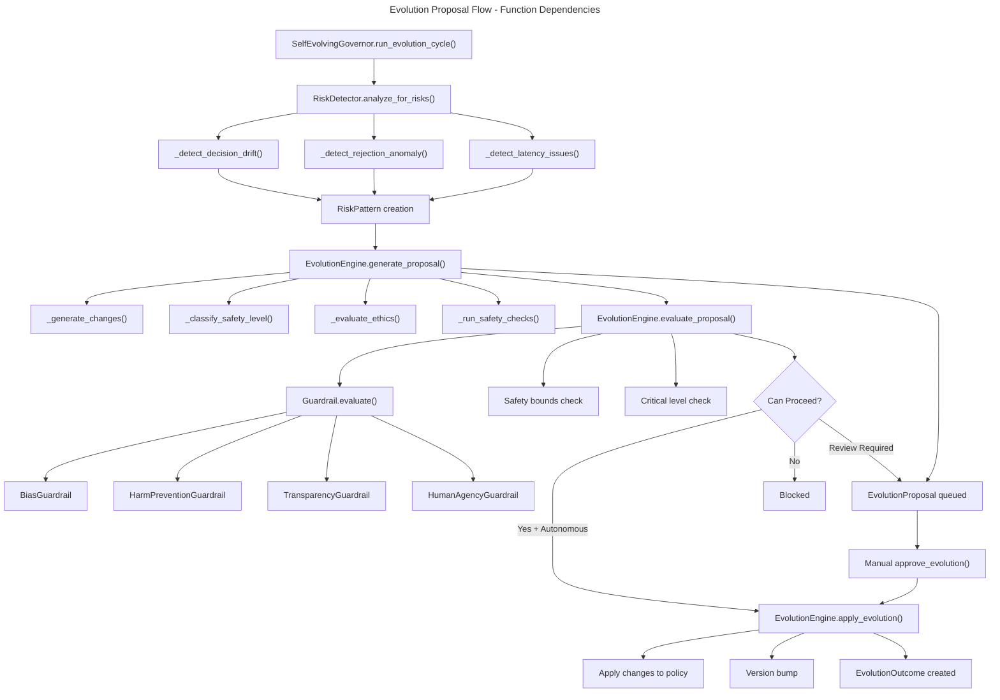

# C4 Code Level: Autonomous Governance Service

<!-- Constitutional Hash: cdd01ef066bc6cf2 -->

## Overview

- **Name**: Autonomous Governance Service
- **Description**: Self-evolving governance systems that autonomously adapt policies based on emerging risks, regulatory changes, and operational feedback without human intervention, with appropriate safety bounds and human override capabilities.
- **Location**: `/src/core/services/autonomous_governance/`
- **Language**: Python 3.11+
- **Purpose**: Implement next-generation AI governance capabilities with autonomous policy evolution, safety guardrails, risk detection, and ethics integration.
- **Phase**: 5 - Next-Generation Governance
- **Status**: Research Prototype (Production deployment requires human oversight and ethics review)

## Module Structure

```
autonomous_governance/
├── __init__.py                    # Module exports and public API
└── self_evolving_governance.py    # Core implementation (38KB)
```

## Core Enumerations

### EvolutionTrigger (Enum)
**Purpose**: Defines the triggers that can initiate policy evolution decisions.

**Location**: `self_evolving_governance.py:43-52`

**Values**:
- `RISK_DETECTION`: New risk pattern detected in governance operations
- `REGULATORY_CHANGE`: External regulatory requirements changed
- `PERFORMANCE_DRIFT`: Policy effectiveness degraded from baseline
- `FEEDBACK_ACCUMULATION`: Sufficient user feedback accumulated for learning
- `SCHEDULED`: Periodic review cycle triggered
- `MANUAL`: Human-initiated policy evolution request

### SafetyLevel (Enum)
**Purpose**: Classifies the safety risk level of proposed evolution actions.

**Location**: `self_evolving_governance.py:54-62`

**Values**:
- `SAFE`: No risk, automatic approval recommended
- `LOW_RISK`: Minor changes, notification only required
- `MEDIUM_RISK`: Requires asynchronous human review
- `HIGH_RISK`: Requires synchronous human approval
- `CRITICAL`: Blocked until ethics review completed

### EvolutionAction (Enum)
**Purpose**: Defines the types of policy evolution actions available.

**Location**: `self_evolving_governance.py:64-74`

**Values**:
- `PARAMETER_TUNE`: Adjust policy thresholds and weights
- `RULE_ADDITION`: Add new governance rules to policy
- `RULE_REMOVAL`: Remove existing rules from policy
- `RULE_MODIFICATION`: Modify logic of existing rules
- `POLICY_MERGE`: Merge multiple policies together
- `POLICY_SPLIT`: Split policy into separate components
- `ROLLBACK`: Revert policy to previous version

### EthicsCategory (Enum)
**Purpose**: Defines ethics evaluation categories for evolution proposals.

**Location**: `self_evolving_governance.py:76-85`

**Values**:
- `FAIRNESS`: Bias and equity considerations
- `TRANSPARENCY`: Explainability and interpretability
- `PRIVACY`: Data protection and consent
- `AUTONOMY`: Human agency and override capability
- `SAFETY`: Harm prevention and safety measures
- `ACCOUNTABILITY`: Attribution and responsibility tracing

## Data Classes

### SafetyBound
**Purpose**: Represents a safety constraint that must be satisfied during policy evolution.

**Location**: `self_evolving_governance.py:87-111`

**Attributes**:
- `bound_id: str` - Unique identifier for this safety bound
- `name: str` - Human-readable name
- `description: str` - Detailed description of the constraint
- `category: EthicsCategory` - Ethics category this bound addresses
- `check_function: str` - Serialized function reference for validation
- `threshold: float` - Numeric threshold for constraint evaluation
- `is_hard_constraint: bool` - If True, violations block evolution
- `violation_action: str` - Action to take on constraint violation

**Methods**:
- `to_dict() -> Dict[str, Any]` - Serialize bound to dictionary with constitutional hash

**Dependencies**: None (pure data class)

---

### EvolutionProposal
**Purpose**: Represents a proposed policy evolution with all evaluation data.

**Location**: `self_evolving_governance.py:114-154`

**Attributes**:
- `proposal_id: str` - Unique proposal identifier
- `trigger: EvolutionTrigger` - What triggered this proposal
- `action: EvolutionAction` - Type of evolution action proposed
- `target_policy_id: str` - Which policy this evolution targets
- `current_version: str` - Current version of target policy
- `proposed_changes: Dict[str, Any]` - Specific changes to apply
- `justification: str` - Reason for the proposed evolution
- `safety_level: SafetyLevel` - Risk classification of proposal
- `confidence_score: float` - ML confidence in proposal (0.0-1.0)
- `created_at: datetime` - Timestamp of proposal creation
- `ethics_evaluation: Dict[EthicsCategory, float]` - Ethics scores per category
- `safety_checks: Dict[str, bool]` - Results of guardrail checks
- `human_review_required: bool` - Whether human approval needed
- `approved_by: Optional[str]` - User ID of approver
- `approved_at: Optional[datetime]` - Timestamp of approval
- `rejected_reason: Optional[str]` - Reason if rejected

**Methods**:
- `to_dict() -> Dict[str, Any]` - Serialize proposal to dictionary with constitutional hash

**Dependencies**: EvolutionTrigger, EvolutionAction, SafetyLevel, EthicsCategory, datetime

---

### EvolutionOutcome
**Purpose**: Records the result of applying an approved evolution to the policy.

**Location**: `self_evolving_governance.py:157-181`

**Attributes**:
- `outcome_id: str` - Unique identifier for outcome
- `proposal_id: str` - Which proposal was applied
- `applied_at: datetime` - When the evolution was applied
- `success: bool` - Whether application succeeded
- `new_version: Optional[str]` - New policy version (if successful)
- `performance_delta: float` - Change in performance metrics
- `side_effects: List[str]` - Any unintended consequences detected
- `rollback_available: bool` - Whether policy can be rolled back

**Methods**:
- `to_dict() -> Dict[str, Any]` - Serialize outcome to dictionary with constitutional hash

**Dependencies**: datetime

---

### RiskPattern
**Purpose**: Represents a detected risk pattern that may trigger policy evolution.

**Location**: `self_evolving_governance.py:184-210`

**Attributes**:
- `pattern_id: str` - Unique identifier for this pattern
- `name: str` - Human-readable pattern name
- `description: str` - Detailed description of the risk
- `severity: float` - Risk severity (0.0 to 1.0)
- `affected_policies: List[str]` - Policy IDs that may need evolution
- `detection_count: int` - Number of times this pattern detected
- `first_detected: datetime` - When pattern first appeared
- `last_detected: datetime` - When pattern last appeared
- `suggested_actions: List[EvolutionAction]` - Recommended evolution actions

**Methods**:
- `to_dict() -> Dict[str, Any]` - Serialize pattern to dictionary with constitutional hash

**Dependencies**: EvolutionAction, datetime

---

## Abstract Base Classes

### SafetyGuardrail (ABC)
**Purpose**: Abstract base class for safety guardrails that validate evolution proposals.

**Location**: `self_evolving_governance.py:213-230`

**Abstract Methods**:
- `evaluate(proposal: EvolutionProposal) -> Tuple[bool, str]`
  - Parameters: proposal to evaluate
  - Returns: (passes_guardrail, reason_explanation)
  - Purpose: Check whether proposal passes this guardrail's safety criteria

**Abstract Properties**:
- `category: EthicsCategory`
  - Returns: Ethics category this guardrail protects
  - Purpose: Identify which ethics dimension is being validated

**Subclasses**: BiasGuardrail, HarmPreventionGuardrail, TransparencyGuardrail, HumanAgencyGuardrail

---

## Concrete Guardrail Classes

### BiasGuardrail(SafetyGuardrail)
**Purpose**: Prevents biased policy evolution by detecting protected attribute usage and fairness violations.

**Location**: `self_evolving_governance.py:233-269`

**Constructor**:
```python
def __init__(self, bias_threshold: float = 0.1)
```
- `bias_threshold`: Fairness score threshold (default: 0.1, meaning 10% fairness penalty)

**Methods**:
- `evaluate(proposal: EvolutionProposal) -> Tuple[bool, str]`
  - Checks for protected attributes in proposed changes
  - Validates fairness score against threshold
  - Protected attributes: race, gender, age, religion, disability, nationality
  - Returns: (passes, reason)

**Properties**:
- `category` -> `EthicsCategory.FAIRNESS`

**Dependencies**: SafetyGuardrail, EvolutionProposal, EthicsCategory

---

### HarmPreventionGuardrail(SafetyGuardrail)
**Purpose**: Prevents harmful policy evolution by detecting dangerous patterns and insufficient safety scores.

**Location**: `self_evolving_governance.py:272-302`

**Harmful Patterns Detected**:
- `deny_all`: Complete access denial
- `unrestricted_access`: Removes access controls
- `bypass_authentication`: Circumvents auth
- `disable_logging`: Removes audit capability
- `ignore_consent`: Violates consent requirements
- `unlimited_retention`: Retains data indefinitely

**Methods**:
- `evaluate(proposal: EvolutionProposal) -> Tuple[bool, str]`
  - Scans proposed changes for harmful patterns
  - Validates safety score >= 0.8
  - Returns: (passes, reason)

**Properties**:
- `category` -> `EthicsCategory.SAFETY`

**Dependencies**: SafetyGuardrail, EvolutionProposal, EthicsCategory

---

### TransparencyGuardrail(SafetyGuardrail)
**Purpose**: Ensures evolution decisions are explainable with adequate justification.

**Location**: `self_evolving_governance.py:305-326`

**Constraints**:
- Minimum justification length: 50 characters
- Required reasoning elements: "because", "therefore", "based on", "due to"

**Methods**:
- `evaluate(proposal: EvolutionProposal) -> Tuple[bool, str]`
  - Validates justification length and required elements
  - Returns: (passes, reason)

**Properties**:
- `category` -> `EthicsCategory.TRANSPARENCY`

**Dependencies**: SafetyGuardrail, EvolutionProposal, EthicsCategory

---

### HumanAgencyGuardrail(SafetyGuardrail)
**Purpose**: Preserves human override capabilities and control in policy evolution.

**Location**: `self_evolving_governance.py:329-353`

**Constraints**:
- Cannot disable human override capability
- Cannot remove approval requirements
- High-risk evolutions require human review

**Methods**:
- `evaluate(proposal: EvolutionProposal) -> Tuple[bool, str]`
  - Checks for human override removal attempts
  - Validates approval requirements
  - Ensures HITL for high-risk actions
  - Returns: (passes, reason)

**Properties**:
- `category` -> `EthicsCategory.AUTONOMY`

**Dependencies**: SafetyGuardrail, EvolutionProposal, EvolutionAction, SafetyLevel, EthicsCategory

---

## Core Service Classes

### RiskDetector
**Purpose**: Detects risk patterns in governance decision history using statistical analysis and anomaly detection.

**Location**: `self_evolving_governance.py:356-514`

**Constructor**:
```python
def __init__(self, sensitivity: float = 0.7)
```
- `sensitivity`: Detection sensitivity threshold (default: 0.7)

**Attributes**:
- `sensitivity: float` - Detection sensitivity
- `detected_patterns: Dict[str, RiskPattern]` - Detected patterns by ID
- `decision_history: List[Dict[str, Any]]` - Last 10,000 recorded decisions
- `baseline_metrics: Dict[str, float]` - Baseline for comparison

**Methods**:

#### `record_decision(decision: Dict[str, Any]) -> None`
- **Purpose**: Record a governance decision for analysis
- **Location**: Line 372-381
- **Parameters**:
  - `decision`: Governance decision data
- **Side Effects**: Adds timestamp, maintains max 10,000 decisions
- **Dependencies**: datetime

#### `analyze_for_risks() -> List[RiskPattern]`
- **Purpose**: Analyze recent decisions for risk patterns
- **Location**: Line 383-411
- **Returns**: List of newly detected RiskPattern objects
- **Logic Flow**:
  1. Requires minimum 100 decisions in history
  2. Detects decision drift via approval rate analysis
  3. Detects rejection anomalies via clustering
  4. Detects latency degradation issues
  5. Stores detected patterns internally
- **Dependencies**: RiskPattern, secrets, datetime

#### `_detect_decision_drift() -> Optional[RiskPattern]`
- **Purpose**: Detect if decision patterns are drifting from baseline
- **Location**: Line 413-438
- **Logic**: Compares approval rate to baseline with 20% threshold
- **Returns**: RiskPattern if drift detected, None otherwise
- **Dependencies**: RiskPattern, secrets, datetime

#### `_detect_rejection_anomaly() -> Optional[RiskPattern]`
- **Purpose**: Detect anomalous rejection patterns
- **Location**: Line 440-470
- **Logic**: Identifies policies with >50% of rejections
- **Returns**: RiskPattern if anomaly detected, None otherwise
- **Dependencies**: RiskPattern, secrets, datetime

#### `_detect_latency_issues() -> Optional[RiskPattern]`
- **Purpose**: Detect governance latency degradation
- **Location**: Line 472-497
- **Logic**: Compares current latency to baseline (2x threshold)
- **Uses**: numpy for mean calculation
- **Returns**: RiskPattern if issues detected, None otherwise
- **Dependencies**: RiskPattern, numpy, secrets, datetime

#### `update_baseline() -> None`
- **Purpose**: Update baseline metrics from current data
- **Location**: Line 499-514
- **Logic**: Uses first 80% of decision history as baseline
- **Side Effects**: Updates baseline_metrics dictionary
- **Dependencies**: numpy

**Dependencies**: RiskPattern, EvolutionAction, datetime, secrets, numpy, logging

---

### EvolutionEngine
**Purpose**: Core engine for generating and evaluating policy evolutions using rule-based and ML approaches.

**Location**: `self_evolving_governance.py:517-816`

**Constructor**:
```python
def __init__(self, safety_bounds: List[SafetyBound] = None)
```
- `safety_bounds`: List of safety constraints (default: empty)

**Attributes**:
- `safety_bounds: List[SafetyBound]` - Hard constraints to enforce
- `guardrails: List[SafetyGuardrail]` - Default guardrails (4):
  - BiasGuardrail
  - HarmPreventionGuardrail
  - TransparencyGuardrail
  - HumanAgencyGuardrail
- `proposal_history: List[EvolutionProposal]` - All generated proposals
- `outcome_history: List[EvolutionOutcome]` - All application outcomes

**Methods**:

#### `generate_proposal(trigger: EvolutionTrigger, risk_pattern: Optional[RiskPattern], target_policy: Dict[str, Any]) -> EvolutionProposal`
- **Purpose**: Generate an evolution proposal based on trigger and context
- **Location**: Line 538-595
- **Parameters**:
  - `trigger`: What triggered the evolution
  - `risk_pattern`: Detected risk (if applicable)
  - `target_policy`: Policy to evolve
- **Logic Flow**:
  1. Generate unique proposal ID
  2. Determine action based on trigger type
  3. Generate specific proposed changes
  4. Classify safety level
  5. Evaluate ethics scores
  6. Run safety checks
  7. Store in history
- **Returns**: EvolutionProposal
- **Dependencies**: EvolutionProposal, EvolutionTrigger, EvolutionAction, secrets, datetime

#### `evaluate_proposal(proposal: EvolutionProposal) -> Tuple[bool, List[str]]`
- **Purpose**: Evaluate proposal against all safety guardrails
- **Location**: Line 597-627
- **Parameters**: proposal to evaluate
- **Returns**: (can_proceed, list_of_issues)
- **Logic**:
  1. Run all guardrails
  2. Check hard safety bounds
  3. Block if safety level is CRITICAL
- **Dependencies**: SafetyLevel

#### `apply_evolution(proposal: EvolutionProposal, policy_store: Dict[str, Any]) -> EvolutionOutcome`
- **Purpose**: Apply an approved evolution to the policy store
- **Location**: Line 629-710
- **Parameters**:
  - `proposal`: Approved proposal
  - `policy_store`: Dictionary of policies
- **Returns**: EvolutionOutcome
- **Logic**:
  1. Verify human approval if required
  2. Get target policy from store
  3. Apply changes based on action type
  4. Bump version number
  5. Create outcome record
- **Error Handling**: Catches exceptions, returns failed outcome
- **Dependencies**: EvolutionOutcome, EvolutionAction, datetime, secrets

#### `_generate_changes(action: EvolutionAction, policy: Dict[str, Any], risk_pattern: Optional[RiskPattern]) -> Dict[str, Any]`
- **Purpose**: Generate specific changes based on action type
- **Location**: Line 712-744
- **Parameters**:
  - `action`: Type of evolution
  - `policy`: Target policy
  - `risk_pattern`: Context for generation
- **Returns**: Dictionary of proposed changes
- **Logic**:
  - PARAMETER_TUNE: Adjusts thresholds/batch sizes
  - RULE_ADDITION: Creates new rule
  - RULE_MODIFICATION: Updates existing rule
- **Dependencies**: EvolutionAction, secrets

#### `_classify_safety_level(action: EvolutionAction, changes: Dict[str, Any]) -> SafetyLevel`
- **Purpose**: Classify the safety level of proposed changes
- **Location**: Line 746-766
- **Returns**: SafetyLevel
- **Classification Logic**:
  - ROLLBACK → LOW_RISK
  - PARAMETER_TUNE with large changes → MEDIUM_RISK
  - RULE_REMOVAL, POLICY_MERGE → HIGH_RISK
  - RULE_ADDITION → MEDIUM_RISK
- **Dependencies**: EvolutionAction, SafetyLevel

#### `_evaluate_ethics(proposal: EvolutionProposal) -> Dict[EthicsCategory, float]`
- **Purpose**: Evaluate ethics scores for a proposal
- **Location**: Line 768-802
- **Returns**: Dictionary of ethics scores (0.0-1.0)
- **Categories Evaluated**:
  - FAIRNESS: Based on protected attributes
  - TRANSPARENCY: Based on justification length
  - PRIVACY: Based on data access changes
  - AUTONOMY: Based on human review requirement
  - SAFETY: Based on action risk
  - ACCOUNTABILITY: Always 0.95
- **Dependencies**: EthicsCategory, json

#### `_run_safety_checks(proposal: EvolutionProposal) -> Dict[str, bool]`
- **Purpose**: Run all safety checks and return results
- **Location**: Line 804-816
- **Returns**: Dictionary of check results
- **Checks**:
  - All guardrails
  - All safety bounds
- **Dependencies**: None

**Dependencies**: SafetyGuardrail, EvolutionProposal, EvolutionOutcome, EvolutionTrigger, EvolutionAction, RiskPattern, SafetyBound, SafetyLevel, EthicsCategory, BiasGuardrail, HarmPreventionGuardrail, TransparencyGuardrail, HumanAgencyGuardrail, json, datetime, secrets, logging

---

### SelfEvolvingGovernor
**Purpose**: Main orchestrator for self-evolving governance, coordinating risk detection, proposal generation, safety evaluation, and policy updates.

**Location**: `self_evolving_governance.py:819-982`

**Constructor**:
```python
def __init__(self,
             enable_autonomous_evolution: bool = False,
             max_daily_evolutions: int = 10,
             require_human_review_above: SafetyLevel = SafetyLevel.MEDIUM_RISK)
```
- `enable_autonomous_evolution`: Whether autonomous changes are applied (default: False - safe)
- `max_daily_evolutions`: Maximum evolutions per day (default: 10)
- `require_human_review_above`: Minimum safety level requiring human review

**Attributes**:
- `enable_autonomous_evolution: bool` - Autonomous mode flag
- `max_daily_evolutions: int` - Daily evolution limit
- `require_human_review_above: SafetyLevel` - Review requirement threshold
- `risk_detector: RiskDetector` - Risk detection engine
- `evolution_engine: EvolutionEngine` - Evolution proposal engine
- `policy_store: Dict[str, Dict[str, Any]]` - Managed policies
- `daily_evolution_count: int` - Evolutions applied today
- `last_reset_date: date` - Last counter reset date
- `pending_reviews: List[EvolutionProposal]` - Proposals awaiting approval
- `human_overrides: Dict[str, str]` - Override decisions

**Methods**:

#### `record_governance_decision(decision: Dict[str, Any]) -> None`
- **Purpose**: Record a governance decision for risk analysis
- **Location**: Line 848-850
- **Parameters**: decision dictionary
- **Side Effects**: Forwards to risk_detector
- **Dependencies**: RiskDetector

#### `async run_evolution_cycle() -> List[EvolutionOutcome]`
- **Purpose**: Run a complete evolution cycle (detect → generate → evaluate → apply)
- **Location**: Line 852-919
- **Returns**: List of applied outcomes
- **Logic Flow**:
  1. Reset daily counter if needed
  2. Detect risk patterns
  3. For each pattern and affected policy:
     - Generate evolution proposal
     - Evaluate against guardrails
     - Queue for review or apply if autonomous
  4. Respect daily evolution limit
- **Dependencies**: RiskDetector, EvolutionEngine, EvolutionTrigger, datetime

#### `approve_evolution(proposal_id: str, approver_id: str) -> Optional[EvolutionOutcome]`
- **Purpose**: Human approval of a pending evolution
- **Location**: Line 921-948
- **Parameters**:
  - `proposal_id`: ID of proposal to approve
  - `approver_id`: ID of human approver
- **Returns**: EvolutionOutcome or None if not found
- **Side Effects**:
  - Marks proposal as approved
  - Removes from pending queue
  - Applies evolution
  - Increments daily counter
- **Dependencies**: EvolutionOutcome, datetime, logging

#### `reject_evolution(proposal_id: str, rejector_id: str, reason: str) -> None`
- **Purpose**: Human rejection of a pending evolution
- **Location**: Line 950-961
- **Parameters**:
  - `proposal_id`: ID of proposal to reject
  - `rejector_id`: ID of human rejector
  - `reason`: Explanation for rejection
- **Side Effects**: Marks rejected, removes from pending
- **Dependencies**: logging

#### `emergency_halt() -> None`
- **Purpose**: Emergency halt of all autonomous evolution (safety mechanism)
- **Location**: Line 963-968
- **Side Effects**: Disables autonomous evolution, logs critical alert
- **Dependencies**: logging

#### `get_status() -> Dict[str, Any]`
- **Purpose**: Get current status of the self-evolving system
- **Location**: Line 970-982
- **Returns**: Status dictionary with:
  - autonomous_evolution_enabled
  - daily_evolution_count
  - max_daily_evolutions
  - pending_reviews count
  - detected_patterns count
  - total_proposals count
  - total_outcomes count
  - policy_count
  - constitutional_hash
- **Dependencies**: None

**Dependencies**: RiskDetector, EvolutionEngine, SafetyLevel, EvolutionProposal, EvolutionOutcome, datetime, logging

---

## Public API (Module Exports)

**Location**: `__init__.py:15-51`

The module exports all public classes and enumerations:

```python
# Enumerations
EvolutionTrigger       # Triggers for policy evolution
SafetyLevel            # Safety risk classification
EvolutionAction        # Types of evolution actions
EthicsCategory         # Ethics evaluation dimensions

# Data Classes
SafetyBound            # Safety constraint definition
EvolutionProposal      # Proposed evolution with evaluation
EvolutionOutcome       # Result of evolution application
RiskPattern            # Detected risk pattern

# Guardrails
SafetyGuardrail        # Abstract guardrail base class
BiasGuardrail          # Prevents biased evolution
HarmPreventionGuardrail # Prevents harmful evolution
TransparencyGuardrail  # Ensures explainability
HumanAgencyGuardrail   # Preserves human control

# Service Classes
RiskDetector           # Risk pattern detection engine
EvolutionEngine        # Policy evolution engine
SelfEvolvingGovernor   # Main orchestrator
```

---

## Data Flow and Integration Points

### Risk Detection Flow
```
Governance Decision
    ↓
RiskDetector.record_decision()
    ↓
RiskDetector.analyze_for_risks()
    ↓
RiskPattern Detection
    ↓
SelfEvolvingGovernor Integration
```

### Evolution Proposal Flow
```
RiskPattern + Trigger
    ↓
EvolutionEngine.generate_proposal()
    ↓
EvolutionProposal with Ethics Scores
    ↓
EvolutionEngine.evaluate_proposal()
    ↓
All Guardrails Check
    ↓
Safety Bounds Check
    ↓
Decision: Apply / Queue for Review / Block
```

### Human Review Flow
```
Pending EvolutionProposal (Safety Level >= MEDIUM_RISK)
    ↓
SelfEvolvingGovernor.pending_reviews queue
    ↓
Human approver reviews proposal
    ↓
approve_evolution() or reject_evolution()
    ↓
EvolutionEngine.apply_evolution()
    ↓
EvolutionOutcome recorded
```

---

## Integration with ACGS-2 Services

### Policy Registry Integration
- **Purpose**: SelfEvolvingGovernor maintains policy_store that evolved policies are stored in
- **Data Exchange**: Policy dictionaries with version tracking
- **Dependency Direction**: autonomous_governance → policy_registry

### Audit Service Integration
- **Purpose**: Record all evolution decisions and outcomes for compliance
- **Data Exchange**: EvolutionProposal and EvolutionOutcome records
- **Dependency Direction**: autonomous_governance → audit_service

### HITL Approvals Integration
- **Purpose**: Human approval workflow for medium/high-risk evolutions
- **Data Exchange**: Pending proposals queued for human review
- **Dependency Direction**: autonomous_governance ↔ hitl_approvals

### Compliance Docs Integration
- **Purpose**: Generate compliance reports on autonomous governance activity
- **Data Exchange**: Evolution history and ethics evaluation records
- **Dependency Direction**: autonomous_governance → compliance_docs

### Constitutional AI Service Integration
- **Purpose**: Constitutional validation of evolved policies
- **Constitutional Hash**: cdd01ef066bc6cf2 embedded in all records
- **Dependency Direction**: autonomous_governance ↔ constitutional_ai

---

## Safety and Governance Architecture

### Multi-Layer Safety Strategy

#### Layer 1: Proposal Generation Safety
- Ethics score evaluation across 6 categories
- Safety level classification
- Confidence scoring

#### Layer 2: Guardrail Validation
- BiasGuardrail: Prevents discriminatory evolution
- HarmPreventionGuardrail: Blocks harmful patterns
- TransparencyGuardrail: Ensures explainability
- HumanAgencyGuardrail: Preserves human control

#### Layer 3: Safety Bounds Enforcement
- Hard constraints that block violations
- Soft constraints that influence safety level
- Custom validation functions

#### Layer 4: Human Oversight
- Automatic human review queue for medium/high-risk
- Approval/rejection workflow
- Emergency halt capability

### Risk Detection Mechanism

**Statistical Analysis**:
- Decision drift detection (20% threshold)
- Rejection anomaly clustering
- Latency degradation (2x threshold)
- Baseline comparison methodology

**Data Requirements**:
- Minimum 100 decisions for analysis
- Last 10,000 decisions maintained
- Rolling window baseline calculation

---

## Type Definitions and Signatures

### Key Type Hints Used
```python
# Collections
Dict[str, Any]           # Generic key-value mappings
List[EvolutionProposal]  # Collections of proposals
List[RiskPattern]        # Collections of detected risks
Dict[EthicsCategory, float]  # Ethics score mappings

# Tuples
Tuple[bool, str]         # (pass_status, reason) pairs
Tuple[bool, List[str]]   # (can_proceed, issues) pairs

# Optional Types
Optional[RiskPattern]    # Risk pattern or None
Optional[str]            # String or None
Optional[datetime]       # Datetime or None
Optional[EvolutionOutcome] # Outcome or None

# Enums
SafetyLevel              # Safety classification
EvolutionTrigger         # Trigger type
EvolutionAction          # Action type
EthicsCategory           # Ethics dimension
```

---

## Constants and Configuration

**Constitutional Hash**: `cdd01ef066bc6cf2`
- Embedded in all serialized objects
- Validates system compliance
- Required for all data exports

**Default Configuration**:
- RiskDetector sensitivity: 0.7
- BiasGuardrail threshold: 0.1
- Daily evolution limit: 10 (conservative)
- Autonomous evolution: False (safe default)
- Human review threshold: MEDIUM_RISK (cautious)

---

## Mermaid Class Diagram

```mermaid
---
title: Autonomous Governance Service Architecture
---
classDiagram
    namespace Enumerations {
        class EvolutionTrigger {
            <<enumeration>>
            RISK_DETECTION
            REGULATORY_CHANGE
            PERFORMANCE_DRIFT
            FEEDBACK_ACCUMULATION
            SCHEDULED
            MANUAL
        }

        class SafetyLevel {
            <<enumeration>>
            SAFE
            LOW_RISK
            MEDIUM_RISK
            HIGH_RISK
            CRITICAL
        }

        class EvolutionAction {
            <<enumeration>>
            PARAMETER_TUNE
            RULE_ADDITION
            RULE_REMOVAL
            RULE_MODIFICATION
            POLICY_MERGE
            POLICY_SPLIT
            ROLLBACK
        }

        class EthicsCategory {
            <<enumeration>>
            FAIRNESS
            TRANSPARENCY
            PRIVACY
            AUTONOMY
            SAFETY
            ACCOUNTABILITY
        }
    }

    namespace DataClasses {
        class SafetyBound {
            +bound_id: str
            +name: str
            +description: str
            +category: EthicsCategory
            +check_function: str
            +threshold: float
            +is_hard_constraint: bool
            +violation_action: str
            +to_dict() Dict
        }

        class RiskPattern {
            +pattern_id: str
            +name: str
            +description: str
            +severity: float
            +affected_policies: List~str~
            +detection_count: int
            +first_detected: datetime
            +last_detected: datetime
            +suggested_actions: List~EvolutionAction~
            +to_dict() Dict
        }

        class EvolutionProposal {
            +proposal_id: str
            +trigger: EvolutionTrigger
            +action: EvolutionAction
            +target_policy_id: str
            +current_version: str
            +proposed_changes: Dict
            +justification: str
            +safety_level: SafetyLevel
            +confidence_score: float
            +created_at: datetime
            +ethics_evaluation: Dict~EthicsCategory, float~
            +safety_checks: Dict~str, bool~
            +human_review_required: bool
            +approved_by: Optional~str~
            +approved_at: Optional~datetime~
            +rejected_reason: Optional~str~
            +to_dict() Dict
        }

        class EvolutionOutcome {
            +outcome_id: str
            +proposal_id: str
            +applied_at: datetime
            +success: bool
            +new_version: Optional~str~
            +performance_delta: float
            +side_effects: List~str~
            +rollback_available: bool
            +to_dict() Dict
        }
    }

    namespace Guardrails {
        class SafetyGuardrail {
            <<abstract>>
            +evaluate(proposal) Tuple~bool, str~*
            +category EthicsCategory*
        }

        class BiasGuardrail {
            -bias_threshold: float
            +evaluate(proposal) Tuple~bool, str~
            +category EthicsCategory
        }

        class HarmPreventionGuardrail {
            +HARMFUL_PATTERNS: List~str~
            +evaluate(proposal) Tuple~bool, str~
            +category EthicsCategory
        }

        class TransparencyGuardrail {
            +MIN_JUSTIFICATION_LENGTH: int
            +evaluate(proposal) Tuple~bool, str~
            +category EthicsCategory
        }

        class HumanAgencyGuardrail {
            +evaluate(proposal) Tuple~bool, str~
            +category EthicsCategory
        }
    }

    namespace Engines {
        class RiskDetector {
            -sensitivity: float
            -detected_patterns: Dict~str, RiskPattern~
            -decision_history: List~Dict~
            -baseline_metrics: Dict~str, float~
            +record_decision(decision) None
            +analyze_for_risks() List~RiskPattern~
            -_detect_decision_drift() Optional~RiskPattern~
            -_detect_rejection_anomaly() Optional~RiskPattern~
            -_detect_latency_issues() Optional~RiskPattern~
            +update_baseline() None
        }

        class EvolutionEngine {
            -safety_bounds: List~SafetyBound~
            -guardrails: List~SafetyGuardrail~
            -proposal_history: List~EvolutionProposal~
            -outcome_history: List~EvolutionOutcome~
            +generate_proposal(trigger, risk_pattern, policy) EvolutionProposal
            +evaluate_proposal(proposal) Tuple~bool, List~str~~
            +apply_evolution(proposal, store) EvolutionOutcome
            -_generate_changes(action, policy, pattern) Dict
            -_classify_safety_level(action, changes) SafetyLevel
            -_evaluate_ethics(proposal) Dict~EthicsCategory, float~
            -_run_safety_checks(proposal) Dict~str, bool~
        }

        class SelfEvolvingGovernor {
            -enable_autonomous_evolution: bool
            -max_daily_evolutions: int
            -require_human_review_above: SafetyLevel
            -risk_detector: RiskDetector
            -evolution_engine: EvolutionEngine
            -policy_store: Dict~str, Dict~
            -daily_evolution_count: int
            -last_reset_date: date
            -pending_reviews: List~EvolutionProposal~
            -human_overrides: Dict~str, str~
            +record_governance_decision(decision) None
            +async run_evolution_cycle() List~EvolutionOutcome~
            +approve_evolution(proposal_id, approver_id) Optional~EvolutionOutcome~
            +reject_evolution(proposal_id, rejector_id, reason) None
            +emergency_halt() None
            +get_status() Dict~str, Any~
        }
    }

    %% Relationships
    SafetyGuardrail <|-- BiasGuardrail
    SafetyGuardrail <|-- HarmPreventionGuardrail
    SafetyGuardrail <|-- TransparencyGuardrail
    SafetyGuardrail <|-- HumanAgencyGuardrail

    EvolutionEngine --> BiasGuardrail
    EvolutionEngine --> HarmPreventionGuardrail
    EvolutionEngine --> TransparencyGuardrail
    EvolutionEngine --> HumanAgencyGuardrail
    EvolutionEngine --> SafetyBound
    EvolutionEngine --> EvolutionProposal
    EvolutionEngine --> EvolutionOutcome
    EvolutionEngine --> RiskPattern

    SelfEvolvingGovernor --> RiskDetector
    SelfEvolvingGovernor --> EvolutionEngine
    SelfEvolvingGovernor --> EvolutionProposal
    SelfEvolvingGovernor --> EvolutionOutcome

    RiskDetector --> RiskPattern
    EvolutionProposal --> EvolutionTrigger
    EvolutionProposal --> EvolutionAction
    EvolutionProposal --> SafetyLevel
    EvolutionProposal --> EthicsCategory
    RiskPattern --> EvolutionAction
    SafetyBound --> EthicsCategory
```



---

## Function Call Graph and Dependencies



---

## Testing and Validation Points

**Key Areas for Testing**:
1. Risk detection accuracy with various decision patterns
2. Guardrail effectiveness for each ethics category
3. Safety level classification correctness
4. Ethics score evaluation consistency
5. Evolution application correctness
6. Human approval workflow functionality
7. Emergency halt responsiveness
8. Daily evolution limit enforcement
9. Baseline metric calculation
10. Anomaly detection sensitivity

**Constitutional Validation**:
- All serialized objects include constitutional hash
- Evolution decisions logged for audit trail
- Human override capabilities preserved
- Safety bounds honored in all scenarios

---

## Performance Characteristics

**Memory Usage**:
- Decision history: O(n) where n ≤ 10,000
- Pattern storage: O(m) where m = detected patterns
- Proposal history: O(p) where p = total proposals

**Time Complexity**:
- Risk analysis: O(n) linear scan of decision history
- Proposal generation: O(k) where k = number of guardrails
- Evolution application: O(1) for parameter tune, O(r) for rule modifications
- Safety evaluation: O(k) where k = number of guardrails

**Scaling Characteristics**:
- Designed for per-policy autonomous governance
- Linear scaling with decision history size
- Logarithmic scaling with policy count
- Constant time for individual governance decisions

---

## Notes and Warnings

**Research Prototype Status**:
- This is a research prototype implementation
- Not recommended for production deployment without:
  - Comprehensive ethics review
  - Human oversight mechanisms
  - Extensive testing and validation
  - Regulatory compliance assessment
  - Safety assessment by domain experts

**Safety Mechanisms**:
- Always defaults to conservative settings (autonomous=False, daily_limit=10)
- All high-risk evolutions require human review
- Emergency halt capability available
- Constitutional validation embedded throughout
- Complete audit trail maintained

**Dependencies**:
- Core: Python 3.11+, dataclasses, enum, abc
- Scientific: numpy
- Standard library: hashlib, json, logging, secrets, time, datetime, typing

---

## Summary

The **Autonomous Governance Service** provides a sophisticated, safety-conscious framework for self-evolving policy governance. It combines statistical risk detection, multi-layer safety guardrails, ethics evaluation, and human oversight mechanisms to enable autonomous policy evolution while maintaining constitutional compliance and preserving human agency. The service integrates with ACGS-2's broader governance architecture to provide enterprise-grade AI governance with appropriate safeguards for next-generation autonomous systems.
