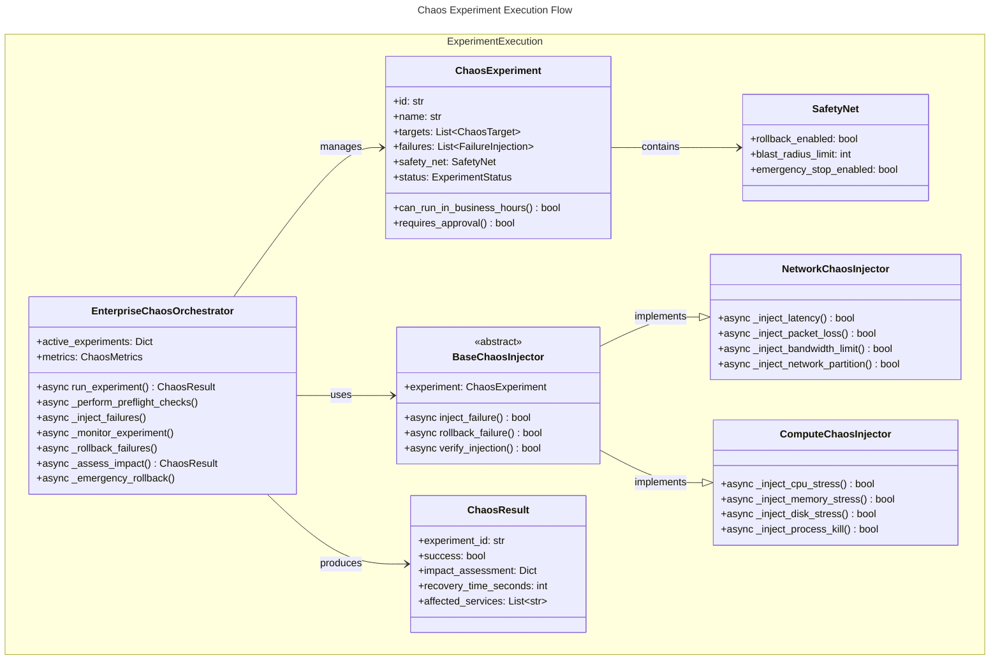
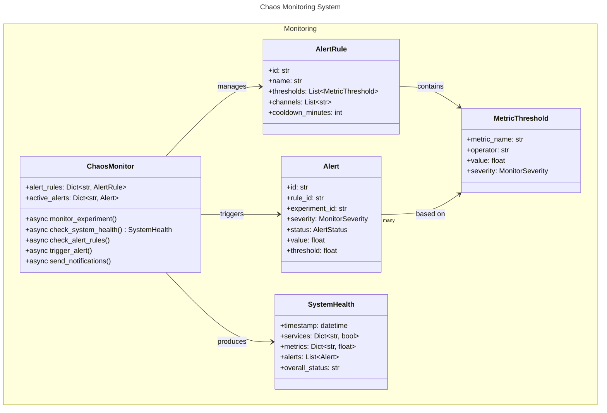
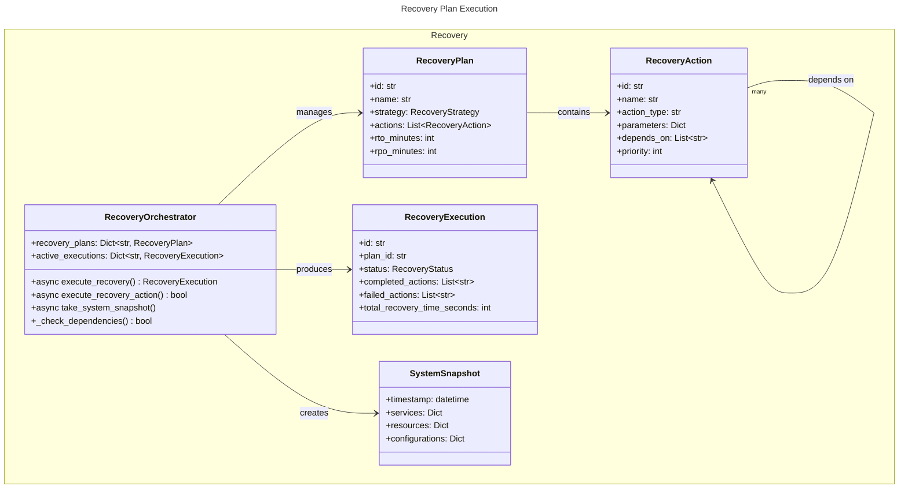
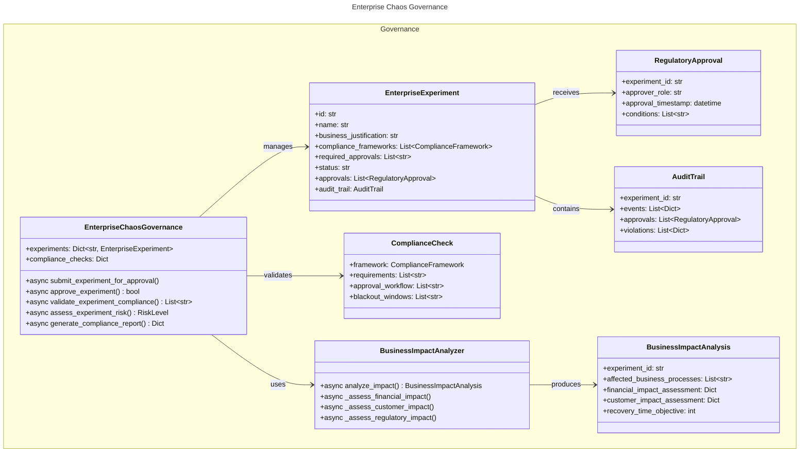
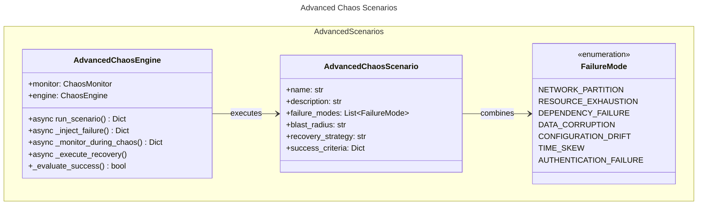

# C4 Code Level: Chaos Engineering Module

## Overview

- **Name**: ACGS-2 Chaos Engineering Framework
- **Description**: Enterprise-grade chaos engineering platform for testing system resilience with constitutional compliance, regulatory governance, and automated recovery orchestration
- **Location**: `/src/core/chaos/`
- **Language**: Python 3.11+
- **Purpose**: Implement controlled failure injection, monitoring, recovery, and enterprise governance for chaos experiments
- **Constitutional Hash**: `cdd01ef066bc6cf2`

## Module Structure

```
chaos/
├── experiments/          # Chaos experiment definitions and execution
│   ├── chaos_engine.py   # Core orchestration and injectors
│   └── advanced-chaos-scenarios.py  # Advanced failure mode scenarios
├── monitors/            # Chaos monitoring and observability
│   └── chaos_monitor.py  # Real-time monitoring and alerting
├── recovery/            # Recovery orchestration
│   └── chaos_recovery.py # Recovery plans and execution
└── enterprise/          # Enterprise governance and compliance
    └── enterprise_chaos.py # Regulatory compliance and business impact
```

## Code Elements

### Enumerations and Type Definitions

#### ChaosSeverity
- **Location**: `experiments/chaos_engine.py:19-25`
- **Purpose**: Classify experiment severity levels
- **Values**:
  - `LOW` = "low"
  - `MEDIUM` = "medium"
  - `HIGH` = "high"
  - `CRITICAL` = "critical"

#### ChaosCategory
- **Location**: `experiments/chaos_engine.py:28-36`
- **Purpose**: Categorize types of chaos experiments
- **Values**:
  - `NETWORK` = "network"
  - `COMPUTE` = "compute"
  - `STORAGE` = "storage"
  - `APPLICATION` = "application"
  - `INFRASTRUCTURE` = "infrastructure"
  - `DEPENDENCY` = "dependency"

#### ExperimentStatus
- **Location**: `experiments/chaos_engine.py:39-47`
- **Purpose**: Track experiment lifecycle states
- **Values**:
  - `PENDING` = "pending"
  - `RUNNING` = "running"
  - `COMPLETED` = "completed"
  - `FAILED` = "failed"
  - `CANCELLED` = "cancelled"
  - `ROLLED_BACK` = "rolled_back"

#### RecoveryStrategy
- **Location**: `recovery/chaos_recovery.py:14-22`
- **Purpose**: Define recovery execution strategies
- **Values**:
  - `IMMEDIATE_ROLLBACK` = "immediate_rollback"
  - `GRADUAL_RECOVERY` = "gradual_recovery"
  - `BLUE_GREEN_FAILOVER` = "blue_green_failover"
  - `CIRCUIT_BREAKER` = "circuit_breaker"
  - `LOAD_SHEDDING` = "load_shedding"

#### RecoveryStatus
- **Location**: `recovery/chaos_recovery.py:24-31`
- **Purpose**: Track recovery execution status
- **Values**:
  - `PENDING` = "pending"
  - `IN_PROGRESS` = "in_progress"
  - `COMPLETED` = "completed"
  - `FAILED` = "failed"
  - `PARTIAL` = "partial"

#### FailureMode (Advanced Scenarios)
- **Location**: `experiments/advanced-chaos-scenarios.py:21-30`
- **Purpose**: Define advanced failure injection modes
- **Values**:
  - `NETWORK_PARTITION` = "network_partition"
  - `RESOURCE_EXHAUSTION` = "resource_exhaustion"
  - `DEPENDENCY_FAILURE` = "dependency_failure"
  - `DATA_CORRUPTION` = "data_corruption"
  - `CONFIGURATION_DRIFT` = "configuration_drift"
  - `TIME_SKEW` = "time_skew"
  - `AUTHENTICATION_FAILURE` = "authentication_failure"

#### MonitorSeverity
- **Location**: `monitors/chaos_monitor.py:18-24`
- **Purpose**: Alert severity levels for monitoring
- **Values**:
  - `INFO` = "info"
  - `WARNING` = "warning"
  - `ERROR` = "error"
  - `CRITICAL` = "critical"

#### AlertStatus
- **Location**: `monitors/chaos_monitor.py:27-32`
- **Purpose**: Track alert lifecycle
- **Values**:
  - `ACTIVE` = "active"
  - `RESOLVED` = "resolved"
  - `ACKNOWLEDGED` = "acknowledged"

#### ComplianceFramework
- **Location**: `enterprise/enterprise_chaos.py:16-24`
- **Purpose**: Support multiple regulatory compliance frameworks
- **Values**:
  - `SOX` = "sox"
  - `PCI_DSS` = "pci_dss"
  - `HIPAA` = "hipaa"
  - `GDPR` = "gdpr"
  - `NIST` = "nist"
  - `ISO27001` = "iso27001"

#### RiskLevel
- **Location**: `enterprise/enterprise_chaos.py:27-33`
- **Purpose**: Classify experiment risk assessment
- **Values**:
  - `LOW` = "low"
  - `MEDIUM` = "medium"
  - `HIGH` = "high"
  - `CRITICAL` = "critical"

### Data Classes and Models

#### ChaosTarget
- **Location**: `experiments/chaos_engine.py:50-58`
- **Fields**:
  - `resource_type: str` - Type of resource to target
  - `resource_id: str` - Unique identifier for resource
  - `namespace: str = "default"` - Kubernetes/system namespace
  - `labels: Dict[str, str]` - Resource labels for selection
  - `annotations: Dict[str, str]` - Resource metadata annotations
- **Purpose**: Define specific targets for chaos injection

#### FailureInjection
- **Location**: `experiments/chaos_engine.py:61-70`
- **Fields**:
  - `failure_type: str` - Type of failure to inject
  - `parameters: Dict[str, Any]` - Failure-specific parameters
  - `duration_seconds: int` - Injection duration
  - `probability: float = 1.0` - Probability of failure (0.0-1.0)
  - `gradual_injection: bool = False` - Gradual vs immediate injection
  - `injection_rate: float = 1.0` - Injections per second for gradual mode
- **Purpose**: Specify failure injection characteristics

#### SafetyNet
- **Location**: `experiments/chaos_engine.py:73-83`
- **Fields**:
  - `rollback_enabled: bool = True` - Auto-rollback on failure
  - `rollback_timeout_seconds: int = 300` - Rollback timeout
  - `monitoring_enabled: bool = True` - Real-time monitoring
  - `alerting_enabled: bool = True` - Alert triggering
  - `blast_radius_limit: int = 10` - Max affected resources
  - `business_hours_only: bool = True` - Business hours restriction
  - `emergency_stop_enabled: bool = True` - Emergency stop capability
- **Purpose**: Safety guardrails for experiments

#### ComplianceCheck
- **Location**: `experiments/chaos_engine.py:86-94`
- **Fields**:
  - `frameworks: List[str]` - Applicable compliance frameworks
  - `data_sovereignty_check: bool = True` - Verify data sovereignty
  - `audit_trail_required: bool = True` - Require audit trail
  - `approval_required: bool = True` - Require approvals
  - `approvers: List[str]` - Authorized approvers
- **Purpose**: Compliance requirements for experiments

#### ChaosExperiment
- **Location**: `experiments/chaos_engine.py:97-158`
- **Fields**:
  - `id: str` - Unique experiment identifier
  - `name: str` - Descriptive name
  - `description: str` - Detailed description
  - `category: ChaosCategory` - Experiment category
  - `severity: ChaosSeverity` - Severity level
  - `targets: List[ChaosTarget]` - Affected targets
  - `failures: List[FailureInjection]` - Failures to inject
  - `safety_net: SafetyNet` - Safety mechanisms
  - `compliance: ComplianceCheck` - Compliance requirements
  - `duration_minutes: int` - Experiment duration (max 480)
  - `blast_radius: List[str]` - Affected service list
  - `tags: List[str]` - Classification tags
  - `metadata: Dict[str, Any]` - Additional metadata
  - `created_at: datetime` - Creation timestamp
  - `created_by: str` - Creator identifier
  - `status: ExperimentStatus` - Current status
  - `started_at: Optional[datetime]` - Start timestamp
  - `completed_at: Optional[datetime]` - Completion timestamp
  - `rollback_at: Optional[datetime]` - Rollback timestamp
  - `results: Dict[str, Any]` - Experiment results
  - `metrics: Dict[str, Any]` - Collected metrics
  - `observations: List[str]` - Observations during experiment
- **Methods**:
  - `validate_blast_radius(cls, v, values) -> List[str]` - Validate blast radius against safety limits
  - `can_run_in_business_hours() -> bool` - Check business hours eligibility
  - `requires_approval() -> bool` - Determine if approval needed
- **Purpose**: Enterprise-grade chaos experiment specification

#### ChaosResult
- **Location**: `experiments/chaos_engine.py:160-169`
- **Fields**:
  - `experiment_id: str` - Reference to experiment
  - `success: bool` - Experiment success flag
  - `impact_assessment: Dict[str, Any]` - Impact data
  - `recovery_time_seconds: Optional[int]` - Recovery duration
  - `affected_services: List[str]` - Impacted services
  - `error_messages: List[str]` - Error details
  - `recommendations: List[str]` - Post-experiment recommendations
- **Purpose**: Experiment results and impact assessment

#### MetricThreshold
- **Location**: `monitors/chaos_monitor.py:35-43`
- **Fields**:
  - `metric_name: str` - Name of monitored metric
  - `operator: str` - Comparison operator (gt, lt, eq, ne)
  - `value: float` - Threshold value
  - `duration_seconds: int` - Duration before alerting
  - `severity: MonitorSeverity` - Alert severity
- **Purpose**: Define metric-based alerting thresholds

#### AlertRule
- **Location**: `monitors/chaos_monitor.py:46-56`
- **Fields**:
  - `id: str` - Unique rule identifier
  - `name: str` - Rule name
  - `description: str` - Rule description
  - `thresholds: List[MetricThreshold]` - Alert thresholds
  - `channels: List[str]` - Notification channels
  - `cooldown_minutes: int = 5` - Alert cooldown period
  - `enabled: bool = True` - Rule activation flag
- **Purpose**: Define alerting rules for chaos experiments

#### Alert
- **Location**: `monitors/chaos_monitor.py:59-74`
- **Fields**:
  - `id: str` - Alert identifier
  - `rule_id: str` - Associated rule
  - `experiment_id: str` - Associated experiment
  - `severity: MonitorSeverity` - Alert severity
  - `message: str` - Alert message
  - `value: float` - Actual metric value
  - `threshold: float` - Threshold value
  - `timestamp: datetime` - Alert timestamp
  - `status: AlertStatus` - Current status
  - `acknowledged_by: Optional[str]` - Acknowledger
  - `acknowledged_at: Optional[datetime]` - Acknowledgment time
  - `resolved_at: Optional[datetime]` - Resolution time
- **Purpose**: Active alert instance

#### SystemHealth
- **Location**: `monitors/chaos_monitor.py:77-85`
- **Fields**:
  - `timestamp: datetime` - Snapshot timestamp
  - `services: Dict[str, bool]` - Service health status
  - `metrics: Dict[str, float]` - System metrics
  - `alerts: List[Alert]` - Active alerts
  - `overall_status: str` - Overall health (healthy, degraded, unhealthy)
- **Purpose**: System health snapshot during experiments

#### RecoveryAction
- **Location**: `recovery/chaos_recovery.py:34-46`
- **Fields**:
  - `id: str` - Action identifier
  - `name: str` - Action name
  - `description: str` - Action description
  - `target_service: str` - Target service
  - `action_type: str` - Type (restart, scale, redeploy, etc.)
  - `parameters: Dict[str, Any]` - Action parameters
  - `timeout_seconds: int = 300` - Execution timeout
  - `depends_on: List[str]` - Dependencies
  - `priority: int = 1` - Priority (higher = higher)
- **Purpose**: Individual recovery action specification

#### RecoveryPlan
- **Location**: `recovery/chaos_recovery.py:49-62`
- **Fields**:
  - `id: str` - Plan identifier
  - `name: str` - Plan name
  - `description: str` - Plan description
  - `strategy: RecoveryStrategy` - Recovery strategy
  - `actions: List[RecoveryAction]` - Recovery actions
  - `estimated_duration_minutes: int` - Estimated duration
  - `rto_minutes: int` - Recovery Time Objective
  - `rpo_minutes: int` - Recovery Point Objective
  - `created_at: datetime` - Creation timestamp
  - `updated_at: datetime` - Last update timestamp
- **Purpose**: Complete recovery plan definition

#### RecoveryExecution
- **Location**: `recovery/chaos_recovery.py:65-78`
- **Fields**:
  - `id: str` - Execution identifier
  - `plan_id: str` - Associated plan
  - `experiment_id: str` - Associated experiment
  - `started_at: datetime` - Start timestamp
  - `status: RecoveryStatus` - Current status
  - `completed_actions: List[str]` - Completed action IDs
  - `failed_actions: List[str]` - Failed action IDs
  - `metrics: Dict[str, Any]` - Execution metrics
  - `completed_at: Optional[datetime]` - Completion timestamp
  - `total_recovery_time_seconds: Optional[int]` - Total recovery time
- **Purpose**: Track recovery plan execution

#### SystemSnapshot
- **Location**: `recovery/chaos_recovery.py:81-89`
- **Fields**:
  - `timestamp: datetime` - Snapshot timestamp
  - `services: Dict[str, Dict[str, Any]]` - Service states
  - `resources: Dict[str, Dict[str, Any]]` - Resource states
  - `configurations: Dict[str, Any]` - Configuration data
  - `metadata: Dict[str, Any]` - Additional metadata
- **Purpose**: System state snapshot for recovery

#### EnterpriseExperiment
- **Location**: `enterprise/enterprise_chaos.py:73-95`
- **Fields**:
  - `id: str` - Experiment identifier
  - `name: str` - Experiment name
  - `business_justification: str` - Business case
  - `risk_assessment: Dict[str, Any]` - Risk analysis
  - `compliance_frameworks: List[ComplianceFramework]` - Applicable frameworks
  - `required_approvals: List[str]` - Required approval roles
  - `blast_radius_analysis: Dict[str, Any]` - Blast radius impact
  - `rollback_plan: Dict[str, Any]` - Rollback procedures
  - `emergency_contacts: List[Dict[str, str]]` - Emergency contacts
  - `created_by: str` - Creator
  - `business_owner: str` - Business owner
  - `technical_owner: str` - Technical owner
  - `status: str = "draft"` - Status
  - `approvals: List[RegulatoryApproval]` - Approvals received
  - `audit_trail: AuditTrail` - Compliance audit trail
  - `created_at: datetime` - Creation time
  - `scheduled_start: Optional[datetime]` - Scheduled start
  - `actual_start: Optional[datetime]` - Actual start
  - `completed_at: Optional[datetime]` - Completion time
- **Purpose**: Enterprise-grade experiment with compliance tracking

#### BusinessImpactAnalysis
- **Location**: `enterprise/enterprise_chaos.py:98-110`
- **Fields**:
  - `experiment_id: str` - Experiment reference
  - `affected_business_processes: List[str]` - Affected processes
  - `financial_impact_assessment: Dict[str, Any]` - Financial impact
  - `customer_impact_assessment: Dict[str, Any]` - Customer impact
  - `regulatory_impact_assessment: Dict[str, Any]` - Regulatory impact
  - `risk_mitigation_measures: List[str]` - Mitigation strategies
  - `maximum_tolerable_downtime: int` - MTTD in minutes
  - `recovery_time_objective: int` - RTO in minutes
  - `recovery_point_objective: int` - RPO in minutes
- **Purpose**: Business impact analysis for experiments

### Classes and Services

#### ChaosMetrics
- **Location**: `experiments/chaos_engine.py:172-202`
- **Purpose**: Prometheus metrics collection for chaos experiments
- **Metrics**:
  - `experiments_total` - Counter: Total experiments by status, category, severity
  - `experiment_duration` - Histogram: Experiment duration by category and severity
  - `recovery_time` - Histogram: Recovery time by category and severity
  - `blast_radius_size` - Gauge: Current blast radius size
  - `failure_injection_rate` - Counter: Failure injections by type and target
- **Dependencies**: Prometheus client library

#### BaseChaosInjector (Abstract)
- **Location**: `experiments/chaos_engine.py:205-225`
- **Purpose**: Base class for all failure injectors
- **Methods**:
  - `async inject_failure(failure: FailureInjection, target: ChaosTarget) -> bool` - Inject a failure
  - `async rollback_failure(failure: FailureInjection, target: ChaosTarget) -> bool` - Rollback a failure
  - `async verify_injection(failure: FailureInjection, target: ChaosTarget) -> bool` - Verify injection success
- **Subclasses**:
  - `NetworkChaosInjector` - Network failure injection
  - `ComputeChaosInjector` - Compute resource failure injection

#### NetworkChaosInjector
- **Location**: `experiments/chaos_engine.py:228-308`
- **Purpose**: Inject network-related failures
- **Failure Types**:
  - `latency` - Network latency injection
  - `packet_loss` - Packet loss injection
  - `bandwidth_limit` - Bandwidth limitation
  - `network_partition` - Network partition (isolation)
- **Methods**:
  - `async inject_failure(failure: FailureInjection, target: ChaosTarget) -> bool` - Route to specific injector
  - `async _inject_latency(failure: FailureInjection, target: ChaosTarget) -> bool` - Add network latency via tc
  - `async _inject_packet_loss(failure: FailureInjection, target: ChaosTarget) -> bool` - Inject packet loss via tc
  - `async _inject_bandwidth_limit(failure: FailureInjection, target: ChaosTarget) -> bool` - Limit bandwidth via tc
  - `async _inject_network_partition(failure: FailureInjection, target: ChaosTarget) -> bool` - Create partition via iptables
  - `async rollback_failure(failure: FailureInjection, target: ChaosTarget) -> bool` - Cleanup tc/iptables rules
  - `async verify_injection(failure: FailureInjection, target: ChaosTarget) -> bool` - Verify network impact

#### ComputeChaosInjector
- **Location**: `experiments/chaos_engine.py:311-389`
- **Purpose**: Inject compute resource failures
- **Failure Types**:
  - `cpu_stress` - CPU stress injection
  - `memory_stress` - Memory stress injection
  - `disk_stress` - Disk I/O stress
  - `process_kill` - Process termination
- **Methods**:
  - `async inject_failure(failure: FailureInjection, target: ChaosTarget) -> bool` - Route to specific injector
  - `async _inject_cpu_stress(failure: FailureInjection, target: ChaosTarget) -> bool` - CPU stress via stress-ng
  - `async _inject_memory_stress(failure: FailureInjection, target: ChaosTarget) -> bool` - Memory stress
  - `async _inject_disk_stress(failure: FailureInjection, target: ChaosTarget) -> bool` - Disk I/O stress
  - `async _inject_process_kill(failure: FailureInjection, target: ChaosTarget) -> bool` - Kill process
  - `async rollback_failure(failure: FailureInjection, target: ChaosTarget) -> bool` - Restart processes
  - `async verify_injection(failure: FailureInjection, target: ChaosTarget) -> bool` - Verify resource impact

#### EnterpriseChaosOrchestrator
- **Location**: `experiments/chaos_engine.py:392-654`
- **Purpose**: Main orchestrator for chaos experiments with enterprise controls
- **Fields**:
  - `logger: Logger` - Logging instance
  - `metrics: ChaosMetrics` - Metrics collector
  - `active_experiments: Dict[str, ChaosExperiment]` - Running experiments
  - `injectors: Dict[str, BaseChaosInjector]` - Failure injectors
  - `compliance_checker: ComplianceChecker` - Compliance validation
- **Key Methods**:
  - `async run_experiment(experiment: ChaosExperiment) -> ChaosResult` - Execute experiment with controls
  - `async cancel_experiment(experiment_id: str) -> bool` - Cancel running experiment
  - `async _perform_preflight_checks(experiment: ChaosExperiment) -> None` - Pre-flight validation
  - `async _inject_failures(experiment: ChaosExperiment) -> None` - Inject all failures
  - `async _gradual_injection(injector: BaseChaosInjector, failure: FailureInjection, target: ChaosTarget) -> None` - Gradual injection
  - `async _monitor_experiment(experiment: ChaosExperiment) -> None` - Monitor during execution
  - `async _rollback_failures(experiment: ChaosExperiment) -> None` - Rollback all failures
  - `async _assess_impact(experiment: ChaosExperiment) -> ChaosResult` - Assess impact
  - `async _emergency_rollback(experiment: ChaosExperiment) -> None` - Emergency recovery
  - `_get_injector(failure_type: str, experiment: ChaosExperiment) -> BaseChaosInjector` - Get appropriate injector
  - `async _check_approvals(experiment: ChaosExperiment) -> bool` - Verify approvals
  - `async _check_resource_availability(experiment: ChaosExperiment) -> None` - Check resource availability
  - `async _check_system_health(experiment: ChaosExperiment) -> Any` - Check system health
  - `async _collect_impact_data(experiment: ChaosExperiment) -> Dict[str, Any]` - Collect metrics
  - `async _generate_recommendations(experiment: ChaosExperiment, impact_data: Dict[str, Any]) -> List[str]` - Generate recommendations

#### ComplianceChecker
- **Location**: `experiments/chaos_engine.py:656-681`
- **Purpose**: Validate compliance requirements
- **Methods**:
  - `async check_compliance(experiment: ChaosExperiment) -> Any` - Check all compliance requirements
  - `async _check_data_sovereignty(target: ChaosTarget, frameworks: List[str]) -> bool` - Verify data sovereignty

#### AdvancedChaosScenario (Dataclass)
- **Location**: `experiments/advanced-chaos-scenarios.py:33-43`
- **Fields**:
  - `name: str` - Scenario name
  - `description: str` - Detailed description
  - `failure_modes: List[FailureMode]` - Failure modes to inject
  - `duration_seconds: int` - Scenario duration
  - `blast_radius: str` - Scope (single_service, multi_service, full_system)
  - `recovery_strategy: str` - Recovery approach
  - `success_criteria: Dict[str, float]` - Success metrics
- **Purpose**: Define advanced chaos scenarios

#### AdvancedChaosEngine
- **Location**: `experiments/advanced-chaos-scenarios.py:46-267`
- **Purpose**: Execute advanced chaos scenarios
- **Key Methods**:
  - `async run_scenario(scenario: AdvancedChaosScenario) -> Dict` - Execute scenario
  - `async _inject_failure(failure_mode: FailureMode, blast_radius: str) -> Dict` - Inject failure
  - `async _inject_network_partition(blast_radius: str) -> Dict` - Network partition
  - `async _inject_resource_exhaustion(blast_radius: str) -> Dict` - Resource exhaustion
  - `async _inject_dependency_failure(blast_radius: str) -> Dict` - Dependency failure
  - `async _inject_data_corruption(blast_radius: str) -> Dict` - Data corruption
  - `async _inject_configuration_drift(blast_radius: str) -> Dict` - Configuration drift
  - `async _inject_time_skew(blast_radius: str) -> Dict` - Time synchronization skew
  - `async _inject_authentication_failure(blast_radius: str) -> Dict` - Authentication failure
  - `async _measure_baseline() -> Dict` - Baseline measurement
  - `async _monitor_during_chaos(duration: int) -> Dict` - Real-time monitoring
  - `async _execute_recovery(strategy: str, failures: List[Dict])` - Execute recovery
  - `async _measure_final_state() -> Dict` - Post-recovery measurement
  - `_evaluate_success(criteria: Dict[str, float], chaos_metrics: Dict, recovery_time: float) -> bool` - Evaluate success
  - `_aggregate_metrics(metrics_list: List[Dict]) -> Dict` - Aggregate metrics

#### ChaosMonitor
- **Location**: `monitors/chaos_monitor.py:88-396`
- **Purpose**: Enterprise monitoring for chaos experiments
- **Fields**:
  - `logger: Logger` - Logging instance
  - `alert_rules: Dict[str, AlertRule]` - Alert rules
  - `active_alerts: Dict[str, Alert]` - Active alerts
  - `health_callbacks: List[Callable]` - Health callbacks
  - `alert_callbacks: List[Callable]` - Alert callbacks
  - `alerts_total: Counter` - Prometheus counter
  - `health_status: Gauge` - Prometheus gauge
  - `active_experiments: Gauge` - Prometheus gauge
- **Key Methods**:
  - `add_alert_rule(rule: AlertRule) -> None` - Register alert rule
  - `remove_alert_rule(rule_id: str) -> None` - Deregister alert rule
  - `add_health_callback(callback: Callable[[SystemHealth], None]) -> None` - Register health callback
  - `add_alert_callback(callback: Callable[[Alert], None]) -> None` - Register alert callback
  - `async monitor_experiment(experiment_id: str, duration_minutes: int) -> None` - Monitor experiment
  - `async check_system_health(experiment_id: str) -> SystemHealth` - Get system health
  - `async check_alert_rules(experiment_id: str) -> None` - Check alert rules
  - `async check_threshold(experiment_id: str, threshold: MetricThreshold) -> bool` - Check metric threshold
  - `async get_metric_value(metric_name: str, experiment_id: str) -> float` - Get current metric
  - `async trigger_alert(experiment_id: str, rule: AlertRule, threshold: MetricThreshold) -> None` - Trigger alert
  - `async send_notifications(alert: Alert, channels: List[str]) -> None` - Send notifications
  - `async send_email_alert(alert: Alert) -> None` - Send email
  - `async send_slack_alert(alert: Alert) -> None` - Send Slack message
  - `async send_pagerduty_alert(alert: Alert) -> None` - Send PagerDuty incident
  - `acknowledge_alert(alert_id: str, user: str) -> bool` - Acknowledge alert
  - `resolve_alert(alert_id: str) -> bool` - Resolve alert
  - `get_active_alerts(experiment_id: Optional[str] = None) -> List[Alert]` - Get active alerts
  - `get_alert_history(experiment_id: Optional[str] = None, hours: int = 24) -> List[Alert]` - Get alert history
  - `async export_metrics(filepath: str) -> None` - Export metrics

#### RecoveryOrchestrator
- **Location**: `recovery/chaos_recovery.py:92-346`
- **Purpose**: Orchestrate recovery operations
- **Fields**:
  - `logger: Logger` - Logging instance
  - `recovery_plans: Dict[str, RecoveryPlan]` - Registered plans
  - `active_executions: Dict[str, RecoveryExecution]` - Running executions
  - `snapshots: Dict[str, SystemSnapshot]` - System snapshots
  - `recovery_callbacks: List[Callable]` - Execution callbacks
- **Key Methods**:
  - `register_recovery_plan(plan: RecoveryPlan) -> None` - Register recovery plan
  - `add_recovery_callback(callback: Callable[[RecoveryExecution], None]) -> None` - Register callback
  - `async execute_recovery(plan_id: str, experiment_id: str) -> RecoveryExecution` - Execute plan
  - `async execute_recovery_action(action: RecoveryAction, execution: RecoveryExecution) -> bool` - Execute action
  - `async _perform_action(action: RecoveryAction) -> bool` - Perform action
  - `async _restart_service(action: RecoveryAction) -> bool` - Restart service (Kubernetes)
  - `async _scale_deployment(action: RecoveryAction) -> bool` - Scale deployment
  - `async _redeploy_service(action: RecoveryAction) -> bool` - Redeploy service
  - `async _restore_database(action: RecoveryAction) -> bool` - Restore from backup
  - `async _switch_traffic(action: RecoveryAction) -> bool` - Traffic switching
  - `async _run_command(action: RecoveryAction) -> bool` - Custom command
  - `async take_system_snapshot(snapshot_id: str) -> None` - Snapshot state
  - `_check_dependencies(action: RecoveryAction, completed_actions: List[str]) -> bool` - Validate dependencies
  - `get_recovery_plans() -> List[RecoveryPlan]` - List all plans
  - `get_active_executions() -> List[RecoveryExecution]` - List active executions
  - `get_execution_history(experiment_id: Optional[str] = None, hours: int = 24) -> List[RecoveryExecution]` - Get history

#### EnterpriseChaosGovernance
- **Location**: `enterprise/enterprise_chaos.py:113-466`
- **Purpose**: Enterprise governance and compliance framework
- **Fields**:
  - `logger: Logger` - Logging instance
  - `experiments: Dict[str, EnterpriseExperiment]` - Registered experiments
  - `audit_trails: Dict[str, AuditTrail]` - Audit trails
  - `approval_workflows: Dict[str, List[str]]` - Approval workflows
  - `compliance_checks: Dict[ComplianceFramework, ComplianceCheck]` - Compliance rules
- **Key Methods**:
  - `_initialize_compliance_frameworks() -> None` - Initialize frameworks
  - `async submit_experiment_for_approval(experiment: EnterpriseExperiment) -> str` - Submit for approval
  - `async approve_experiment(experiment_id: str, approver_role: str, approver_id: str, conditions: List[str] = None) -> bool` - Approve experiment
  - `async validate_experiment_compliance(experiment: EnterpriseExperiment) -> List[str]` - Validate compliance
  - `async assess_experiment_risk(experiment: EnterpriseExperiment) -> RiskLevel` - Risk assessment
  - `async record_experiment_event(experiment_id: str, event: str, details: Dict[str, Any]) -> None` - Record event
  - `async record_compliance_violation(experiment_id: str, violation: Dict[str, Any]) -> None` - Record violation
  - `async record_remediation_action(experiment_id: str, action: Dict[str, Any]) -> None` - Record remediation
  - `async generate_compliance_report(experiment_id: str, framework: ComplianceFramework) -> Dict[str, Any]` - Generate report
  - `async export_audit_trail(experiment_id: str, filepath: str) -> None` - Export audit trail
  - `get_experiments_by_status(status: str) -> List[EnterpriseExperiment]` - Query by status
  - `get_experiments_by_compliance_framework(framework: ComplianceFramework) -> List[EnterpriseExperiment]` - Query by framework
  - `async _is_in_blackout_window(experiment: EnterpriseExperiment, blackout_windows: List[str]) -> bool` - Check blackout windows

#### BusinessImpactAnalyzer
- **Location**: `enterprise/enterprise_chaos.py:468-595`
- **Purpose**: Business impact analysis
- **Methods**:
  - `async analyze_impact(experiment: EnterpriseExperiment) -> BusinessImpactAnalysis` - Perform impact analysis
  - `async _identify_affected_processes(experiment: EnterpriseExperiment) -> List[str]` - Identify processes
  - `async _assess_financial_impact(experiment: EnterpriseExperiment, affected_processes: List[str]) -> Dict[str, Any]` - Financial assessment
  - `async _assess_customer_impact(experiment: EnterpriseExperiment, affected_processes: List[str]) -> Dict[str, Any]` - Customer impact
  - `async _assess_regulatory_impact(experiment: EnterpriseExperiment) -> Dict[str, Any]` - Regulatory impact
  - `async _identify_mitigation_measures(experiment: EnterpriseExperiment) -> List[str]` - Mitigation strategies
  - `async _calculate_maximum_tolerable_downtime(experiment: EnterpriseExperiment) -> int` - MTTD calculation
  - `async _calculate_recovery_time_objective(experiment: EnterpriseExperiment) -> int` - RTO calculation
  - `async _calculate_recovery_point_objective(experiment: EnterpriseExperiment) -> int` - RPO calculation

### Module-Level Functions

#### Experiment Execution
- **Location**: `experiments/chaos_engine.py:688-696`
- `async run_chaos_experiment(experiment: ChaosExperiment) -> ChaosResult` - Execute experiment
- `async cancel_chaos_experiment(experiment_id: str) -> bool` - Cancel experiment

#### Recovery Execution
- **Location**: `recovery/chaos_recovery.py:547-559`
- `async execute_recovery_plan(plan_id: str, experiment_id: str) -> RecoveryExecution` - Execute recovery
- `get_recovery_plans() -> List[RecoveryPlan]` - List plans
- `get_active_recoveries() -> List[RecoveryExecution]` - List active executions

#### Enterprise Functions
- **Location**: `enterprise/enterprise_chaos.py:604-627`
- `async submit_enterprise_experiment(experiment: EnterpriseExperiment) -> str` - Submit for approval
- `async approve_enterprise_experiment(experiment_id: str, approver_role: str, approver_id: str, conditions: List[str] = None) -> bool` - Approve
- `async analyze_business_impact(experiment: EnterpriseExperiment) -> BusinessImpactAnalysis` - Analyze impact
- `async generate_compliance_report(experiment_id: str, framework: ComplianceFramework) -> Dict[str, Any]` - Generate report

#### Advanced Scenarios
- **Location**: `experiments/advanced-chaos-scenarios.py:328-362`
- `async run_production_chaos_suites() -> List[Dict]` - Run all predefined scenarios

## Dependencies

### Internal Dependencies
- `datetime` - Timestamp management
- `asyncio` - Asynchronous execution
- `logging` - Logging framework
- `json` - JSON serialization
- `dataclasses` - Data structure definitions
- `enum` - Enumeration types
- `typing` - Type hints
- `uuid` - Unique identifier generation
- `abc` - Abstract base classes

### External Dependencies
- `prometheus_client` (as prom) - Prometheus metrics
- `pydantic` - Data validation
- `aiofiles` - Async file operations

### Constitutional Framework Integration
- Constitutional Hash: `cdd01ef066bc6cf2` - Embedded in all modules
- Compliance validation integrated into orchestrator
- Audit trail tracking for regulatory compliance
- Emergency stop mechanisms for safety

## Blast Radius Enforcement

### Mechanisms
1. **Pre-flight Validation** (experiments/chaos_engine.py:503-508)
   - Validates blast radius against safety limits
   - Enforces maximum resources affected (default: 10)
   - Raises error if limit exceeded

2. **Safety Net Configuration** (experiments/chaos_engine.py:73-83)
   - Configurable `blast_radius_limit` per experiment
   - Real-time monitoring of affected resources
   - Metrics tracking current blast radius size

3. **Recovery Safeguards** (recovery/chaos_recovery.py:92-189)
   - Dependency-aware action execution
   - Priority-based recovery ordering
   - Rollback capability for all injected failures

4. **Enterprise Controls** (enterprise/enterprise_chaos.py:113-466)
   - Risk-based approval workflows
   - Business impact analysis
   - Compliance validation before execution

## Integration Points

### With Monitoring Systems
- Prometheus metrics collection
- Alert rule triggering
- Health status monitoring
- Real-time notification channels (email, Slack, PagerDuty)

### With Recovery Systems
- Recovery plan registration and execution
- System snapshot management
- Automated remediation
- Health verification

### With Governance Systems
- Compliance framework validation (SOX, PCI-DSS, HIPAA, GDPR, NIST, ISO27001)
- Approval workflow integration
- Audit trail recording
- Regulatory compliance reporting

### With Infrastructure
- Kubernetes API integration (service restart, scaling)
- Network tools (tc, iptables)
- Compute tools (stress-ng, pkill)
- Database restoration

## Relationships

```
EnterpriseChaosOrchestrator
├── ChaosMetrics (Prometheus)
├── BaseChaosInjector (abstract)
│   ├── NetworkChaosInjector
│   └── ComputeChaosInjector
├── ComplianceChecker
└── ChaosExperiment (input)

AdvancedChaosEngine
├── ChaosMonitor
├── ChaosEngine (from advanced-chaos-scenarios)
└── AdvancedChaosScenario (input)

ChaosMonitor
├── AlertRule
├── Alert
├── SystemHealth
└── Prometheus Metrics

RecoveryOrchestrator
├── RecoveryPlan
├── RecoveryAction
├── SystemSnapshot
└── RecoveryExecution

EnterpriseChaosGovernance
├── EnterpriseExperiment
├── RegulatoryApproval
├── AuditTrail
├── ComplianceFramework
└── BusinessImpactAnalyzer
    ├── BusinessImpactAnalysis
    └── Risk Assessment
```

## Relationships

## Code Diagrams

### Experiment Execution Flow



### Monitoring and Alerting Architecture



### Recovery Orchestration



### Enterprise Governance and Compliance



### Advanced Scenarios Engine



## Key Features

### Experiment Management
- Complete lifecycle tracking (pending → running → completed/failed/cancelled)
- Pre-flight safety checks and compliance validation
- Configurable safety nets (rollback, monitoring, alerting, blast radius limits)
- Business hours and blackout window enforcement
- Emergency stop capabilities

### Failure Injection
- Network failures (latency, packet loss, bandwidth limits, partitions)
- Compute resource failures (CPU, memory, disk stress, process kill)
- Advanced scenarios (data corruption, config drift, time skew, auth failures)
- Gradual vs immediate injection modes
- Probability-based failure injection

### Monitoring and Alerting
- Real-time system health monitoring
- Metric-based alerting with configurable thresholds
- Multiple notification channels (email, Slack, PagerDuty)
- Alert cooldown and deduplication
- Alert acknowledgment and resolution tracking

### Recovery Operations
- Multiple recovery strategies (immediate rollback, gradual recovery, blue-green, circuit breaker)
- Dependency-aware action execution
- Priority-based action ordering
- RTO/RPO tracking
- Pre and post-recovery system snapshots
- Custom recovery commands support

### Enterprise Governance
- Support for 6+ compliance frameworks (SOX, PCI-DSS, HIPAA, GDPR, NIST, ISO27001)
- Role-based approval workflows
- Comprehensive audit trail tracking
- Regulatory compliance reporting
- Business impact analysis
- Risk assessment and scoring

## Constitutional Compliance

All chaos engineering operations embed constitutional hash `cdd01ef066bc6cf2` and include:
- Constitutional validation in experiment execution
- Compliance-aware approval workflows
- Audit trail recording for regulatory requirements
- Emergency stop capabilities aligned with safety principles
- Real-time monitoring for constitutional boundary enforcement

## Notes

- All async operations follow asyncio patterns
- Prometheus metrics integration for observability
- Dataclass-based configuration for immutability
- Abstract base classes for extensible injector architecture
- Global orchestrator instances for module-level access
- Default configurations for common scenarios and recovery plans
- JSON serialization support for audit trail and report export
