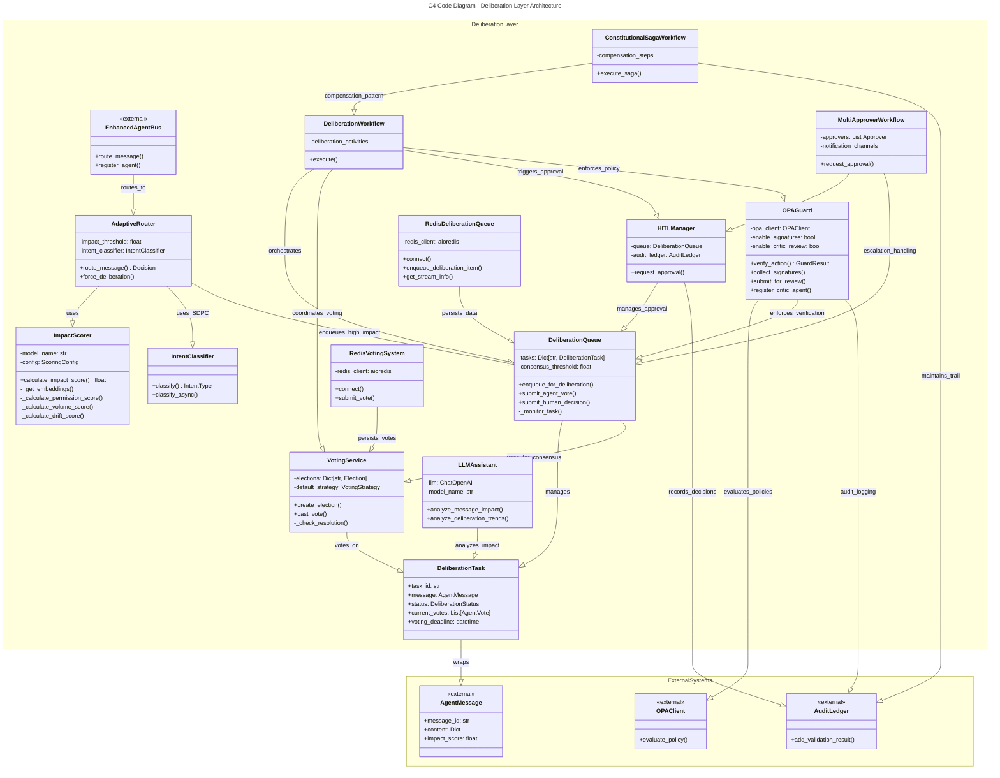
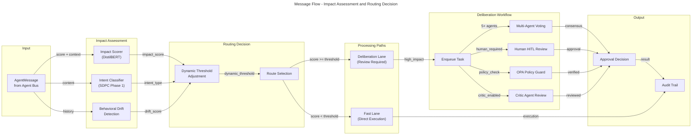
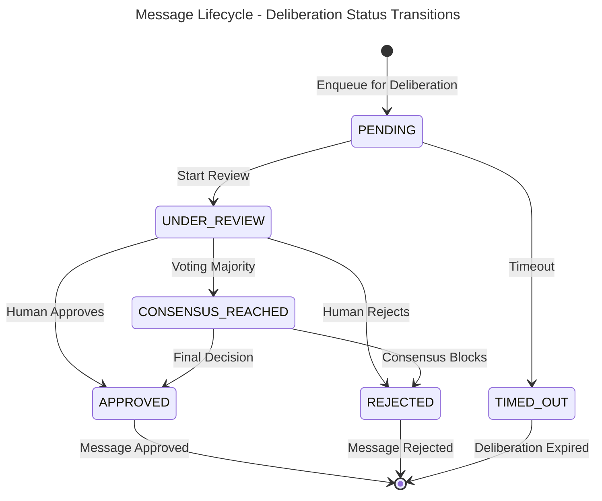
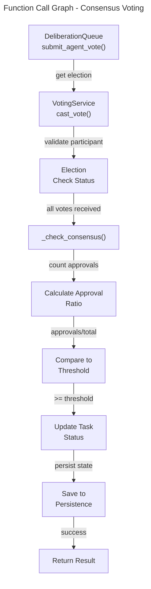
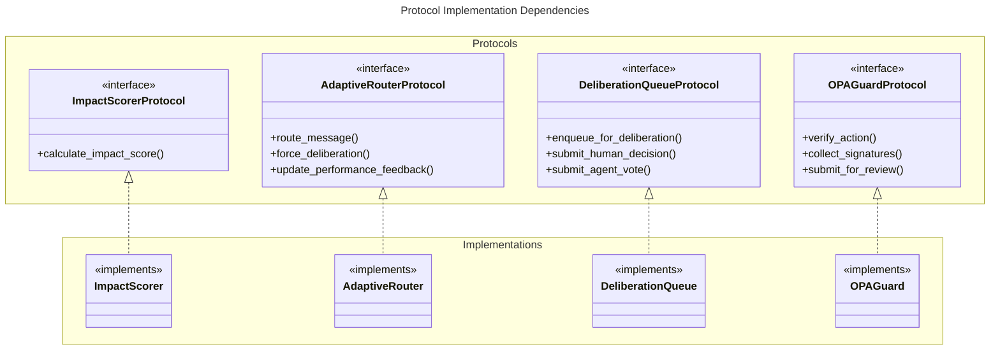

# C4 Code Level: Deliberation Layer

## Overview

- **Name**: Deliberation Layer
- **Description**: AI-powered decision review system for high-impact governance decisions implementing human-in-the-loop and consensus-based deliberation workflows
- **Location**: `/home/dislove/document/acgs2/src/core/enhanced_agent_bus/deliberation_layer/`
- **Language**: Python 3.11+
- **Purpose**: Routes high-impact messages (score ≥ 0.8) through mandatory deliberation workflows including impact assessment, human approval, multi-agent consensus voting, OPA policy verification, and critic agent reviews

## Code Elements

### Core Modules

#### `interfaces.py` (420 lines)
**Location**: `deliberation_layer/interfaces.py`

**Purpose**: Protocol definitions for dependency injection across deliberation layer components

**Classes & Protocols**:
- `ImpactScorerProtocol` - Protocol for impact scoring implementations
  - `calculate_impact_score(content: Dict[str, Any], context: Optional[Dict[str, Any]]) -> float`
    - Calculates impact score (0.0-1.0) for message content
    - Returns impact level for routing decisions

- `AdaptiveRouterProtocol` - Protocol for adaptive routing implementations
  - `async route_message(message: Any, context: Optional[Dict[str, Any]]) -> Dict[str, Any]`
    - Routes message to 'fast' or 'deliberation' lane
  - `async force_deliberation(message: Any, reason: str) -> Dict[str, Any]`
    - Forces message into deliberation regardless of score
  - `async update_performance_feedback(message_id: str, actual_outcome: str, processing_time: float, feedback_score: Optional[float]) -> None`
    - Updates router learning model
  - `get_routing_stats() -> Dict[str, Any]`
    - Returns routing statistics and metrics

- `DeliberationQueueProtocol` - Protocol for deliberation queue implementations
  - `async enqueue_for_deliberation(message: Any, requires_human_review: bool, requires_multi_agent_vote: bool, timeout_seconds: int) -> str`
    - Enqueues message, returns item ID
  - `async submit_human_decision(item_id: str, reviewer: str, decision: Any, reasoning: str) -> bool`
    - Submits human approval decision
  - `async submit_agent_vote(item_id: str, agent_id: str, vote: Any, reasoning: str, confidence: float) -> bool`
    - Submits agent consensus vote
  - `get_item_details(item_id: str) -> Optional[Dict[str, Any]]`
    - Retrieves deliberation item details
  - `get_queue_status() -> Dict[str, Any]`
    - Returns queue statistics

- `LLMAssistantProtocol` - Protocol for LLM-based analysis
  - `async analyze_deliberation_trends(history: List[Dict[str, Any]]) -> Dict[str, Any]`
    - Analyzes deliberation decision patterns

- `RedisQueueProtocol` - Protocol for Redis persistence
  - `async connect() -> bool`
  - `async close() -> None`
  - `async enqueue_deliberation_item(message: Any, item_id: str, metadata: Optional[Dict[str, Any]]) -> bool`
  - `async get_stream_info() -> Dict[str, Any]`

- `RedisVotingProtocol` - Protocol for Redis voting
  - `async connect() -> bool`
  - `async close() -> None`
  - `async submit_vote(item_id: str, agent_id: str, vote: str, reasoning: str, confidence: float) -> bool`

- `OPAGuardProtocol` - Protocol for OPA policy enforcement
  - `async initialize() -> None`
  - `async close() -> None`
  - `async verify_action(agent_id: str, action: Dict[str, Any], context: Optional[Dict[str, Any]]) -> Any`
  - `async collect_signatures(decision_id: str, required_signers: List[str], threshold: float, timeout: int) -> Any`
  - `async submit_signature(decision_id: str, signer_id: str, reasoning: str, confidence: float) -> bool`
  - `async submit_for_review(decision: Dict[str, Any], critic_agents: List[str], review_types: Optional[List[str]], timeout: int) -> Any`
  - `async submit_review(decision_id: str, critic_id: str, verdict: str, reasoning: str, concerns: Optional[List[str]], recommendations: Optional[List[str]], confidence: float) -> bool`
  - `register_critic_agent(critic_id: str, review_types: List[str], callback: Optional[Callable], metadata: Optional[Dict[str, Any]]) -> None`
  - `unregister_critic_agent(critic_id: str) -> None`
  - `get_stats() -> Dict[str, Any]`
  - `get_audit_log(limit: int, offset: int, agent_id: Optional[str]) -> List[Dict[str, Any]]`

**Exports**: All protocol definitions exported via `__all__`

---

#### `impact_scorer.py` (667 lines)
**Location**: `deliberation_layer/impact_scorer.py`

**Purpose**: Multi-dimensional impact scoring using DistilBERT embeddings for constitutional governance decisions

**Configuration**:
- GPU acceleration profiling integration
- BERT/ONNX inference paths
- Configurable scoring weights

**Classes**:
- `ScoringConfig` - Dataclass for impact scoring weights
  - `semantic_weight: float = 0.30` - Semantic content similarity
  - `permission_weight: float = 0.20` - Requested tool permissions
  - `volume_weight: float = 0.10` - Agent request rate
  - `context_weight: float = 0.10` - Historical context
  - `drift_weight: float = 0.15` - Behavioral drift detection
  - `priority_weight: float = 0.10` - Message priority
  - `type_weight: float = 0.05` - Message type
  - `critical_priority_boost: float = 0.9` - Critical priority threshold boost
  - `high_semantic_boost: float = 0.8` - High semantic relevance threshold boost

- `ImpactScorer` - Multi-dimensional impact score calculator
  - `__init__(model_name: str, onnx_path: Optional[str], config: Optional[ScoringConfig])`
    - Initializes with DistilBERT model and optional ONNX acceleration
  - `calculate_impact_score(message_content: Dict[str, Any], context: Optional[Dict[str, Any]]) -> float`
    - **Core scoring method** - Returns 0.0-1.0 impact score
    - Evaluates: semantic content, permissions, volume, context, drift, priority, type
    - Applies non-linear boosting for critical priority or high semantic relevance
  - `_get_embeddings(text: str) -> np.ndarray`
    - BERT embedding extraction with GPU profiling context
  - `_infer_onnx(text: str) -> np.ndarray`
    - ONNX Runtime inference path (GPU-acceleratable)
  - `_infer_distilbert(text: str) -> np.ndarray`
    - PyTorch DistilBERT inference path (primary GPU acceleration candidate)
  - `_get_keyword_embeddings() -> np.ndarray`
    - Cached keyword embedding retrieval
  - `_calculate_permission_score(message_content: Dict[str, Any]) -> float`
    - Evaluates requested tool permissions (admin, delete, transfer, execute, blockchain, payment)
  - `_calculate_volume_score(agent_id: str) -> float`
    - Request rate analysis: <10 req/min = 0.1, 100+ req/min = 1.0
  - `_calculate_context_score(message_content: Dict[str, Any], context: Optional[Dict[str, Any]]) -> float`
    - Historical context and anomaly detection (night time, large transactions)
  - `_calculate_drift_score(agent_id: str, combined_baseline: float) -> float`
    - Behavioral drift detection with configurable threshold (0.3)
  - `_extract_text_content(message_content: Dict[str, Any]) -> str`
    - Recursive text extraction from nested message structures
  - `_calculate_priority_factor(message_content: Dict[str, Any], context: Optional[Dict[str, Any]]) -> float`
    - Priority enum mapping: LOW=0.1, MEDIUM=0.3, HIGH=0.7, CRITICAL=1.0
  - `_calculate_type_factor(message_content: Dict[str, Any], context: Optional[Dict[str, Any]]) -> float`
    - Message type factor: GOVERNANCE_REQUEST/CONSTITUTIONAL_VALIDATION/TASK_REQUEST = 0.8, else 0.2
  - `validate_with_baseline(message_content: Dict[str, Any], baseline_scorer: ImpactScorer) -> bool`
    - Compares with baseline scorer (threshold 0.1)

**Module Functions**:
- `cosine_similarity_fallback(a, b) -> float`
  - Fallback cosine similarity without sklearn
- `get_impact_scorer(model_name: str, onnx_path: Optional[str], config: Optional[ScoringConfig]) -> ImpactScorer`
  - Global singleton accessor
- `calculate_message_impact(message_content: Dict[str, Any]) -> float`
  - Convenience function for impact calculation

**GPU Acceleration API**:
- `get_profiling_report() -> str`
  - Returns human-readable GPU recommendation report
- `get_gpu_decision_matrix() -> Dict[str, Any]`
  - Structured GPU decision data for programmatic use
- `reset_profiling() -> None`
  - Resets profiling data

**Dependencies**:
- `transformers`: AutoModel, AutoTokenizer
- `torch`: No-grad inference context
- `onnxruntime`: ONNX model inference
- `sklearn.metrics.pairwise`: cosine_similarity
- `numpy`: Array operations
- `mlflow`: Model versioning tracking
- Internal: `models.MessagePriority`, `models.MessageType`, `models.Priority`
- Optional: `profiling.ModelProfiler` for GPU acceleration tracking

---

#### `deliberation_queue.py` (389 lines)
**Location**: `deliberation_layer/deliberation_queue.py`

**Purpose**: Persistent queue for managing high-impact messages awaiting approval

**Enums**:
- `DeliberationStatus` - Enum for task status
  - PENDING, UNDER_REVIEW, APPROVED, REJECTED, TIMED_OUT, CONSENSUS_REACHED
- `VoteType` - Enum for agent votes
  - APPROVE, REJECT, ABSTAIN

**Dataclasses**:
- `AgentVote` - Represents a single agent vote
  - `agent_id: str`
  - `vote: VoteType`
  - `reasoning: str`
  - `confidence_score: float = 1.0`
  - `timestamp: datetime = field(default_factory=lambda: datetime.now(timezone.utc))`

- `DeliberationTask` - Deliberation item (aliased as `DeliberationItem`)
  - `task_id: str = field(default_factory=lambda: str(uuid.uuid4()))`
  - `message: Optional[AgentMessage] = None`
  - `status: DeliberationStatus = DeliberationStatus.PENDING`
  - `required_votes: int = 3`
  - `consensus_threshold: float = 0.66`
  - `timeout_seconds: int = 300`
  - `current_votes: List[AgentVote] = field(default_factory=list)`
  - `metadata: Dict[str, Any] = field(default_factory=dict)`
  - `created_at: datetime = field(default_factory=lambda: datetime.now(timezone.utc))`
  - `updated_at: datetime = field(default_factory=lambda: datetime.now(timezone.utc))`
  - `human_reviewer: Optional[str] = None`
  - `human_decision: Optional[DeliberationStatus] = None`
  - `human_reasoning: Optional[str] = None`
  - **Properties**:
    - `voting_deadline: datetime` - created_at + timeout_seconds
    - `item_id: str` - Alias for task_id
    - `is_complete: bool` - True if status in [APPROVED, REJECTED, TIMED_OUT]

**Class**: `DeliberationQueue` - Main queue manager
- `__init__(persistence_path: Optional[str], consensus_threshold: float, default_timeout: int)`
  - Initializes queue with optional JSON persistence
  - `queue: Dict[str, DeliberationTask]` - Tasks by ID
  - `tasks: Dict[str, DeliberationTask]` - Alias for queue
  - `processing_tasks: List[asyncio.Task]` - Background timeout monitors
  - `stats: Dict[str, Any]` - Statistics (total_queued, approved, rejected, timed_out, etc.)
  - `_lock: asyncio.Lock` - Async lock for thread safety

- `async enqueue_for_deliberation(message: AgentMessage, requires_human_review: bool, requires_multi_agent_vote: bool, timeout_seconds: Optional[int]) -> str`
  - Enqueues message, returns task_id
  - Starts background timeout monitor
  - Updates stats

- `async enqueue(*args, **kwargs) -> str`
  - Alias for enqueue_for_deliberation

- `async _monitor_task(task_id: str)`
  - Background task monitoring for timeout
  - Sets status to TIMED_OUT when deadline reached

- `async stop()`
  - Cancels all background monitoring tasks

- `async __aenter__() -> DeliberationQueue`
- `async __aexit__(exc_type, exc_val, exc_tb) -> bool`
  - Async context manager support

- `async update_status(task_id: str, status: Any) -> None`
  - Updates task status with persistence

- `def get_pending_tasks() -> List[DeliberationItem]`
  - Returns all PENDING status tasks

- `def get_task(task_id: str) -> Optional[DeliberationItem]`
  - Retrieves task by ID

- `def get_item_details(item_id: str) -> Optional[Dict[str, Any]]`
  - Returns task details dictionary

- `def get_queue_status() -> Dict[str, Any]`
  - Returns queue statistics

- `async submit_agent_vote(item_id: str, agent_id: str, vote: VoteType, reasoning: str, confidence: float) -> bool`
  - Submits agent vote, checks consensus
  - Returns True if vote accepted

- `def _check_consensus(task: DeliberationTask) -> bool`
  - Consensus logic: required_votes met and approval_ratio >= threshold

- `async submit_human_decision(item_id: str, reviewer: str, decision: DeliberationStatus, reasoning: str) -> bool`
  - Requires task status UNDER_REVIEW, updates status to decision

- `def _save_tasks()`
  - Persists tasks to JSON file if persistence_path set

- `def _load_tasks()`
  - Loads tasks from persistent storage on init

- `async resolve_task(task_id: str, approved: bool)`
  - Sets message status to PENDING (approved) or FAILED (rejected)

**Module Functions**:
- `def get_deliberation_queue(persistence_path: Optional[str]) -> DeliberationQueue`
  - Global singleton accessor

**Constants**:
- `CONSTITUTIONAL_HASH = "cdd01ef066bc6cf2"` - Imported from shared or fallback

---

#### `adaptive_router.py` (389 lines)
**Location**: `deliberation_layer/adaptive_router.py`

**Purpose**: Routes messages based on impact scores to appropriate processing lanes

**Class**: `AdaptiveRouter`
- `__init__(impact_threshold: float = 0.8, deliberation_timeout: int = 300, enable_learning: bool = True)`
  - `impact_threshold: float` - Score ≥ threshold routes to deliberation
  - `deliberation_timeout: int` - Default deliberation timeout (seconds)
  - `enable_learning: bool` - Enables adaptive threshold learning
  - `routing_history: list` - Learning data for threshold adaptation
  - `performance_metrics: Dict[str, Any]` - Routing statistics
  - `deliberation_queue` - Reference to global deliberation queue
  - `intent_classifier: IntentClassifier` - SDPC Phase 1 intent classification

- `async route_message(message: AgentMessage, context: Optional[Dict[str, Any]]) -> Dict[str, Any]`
  - **Core routing method**
  - Calculates impact score if not present
  - Classifies intent (FACTUAL/CREATIVE/REASONING/GENERAL)
  - Adjusts threshold dynamically based on intent:
    - FACTUAL: min(threshold, 0.6) - Ensures verification
    - CREATIVE: max(threshold, 0.9) - Prioritizes fluency
  - Routes to deliberation if score >= dynamic_threshold
  - Routes to fast lane otherwise
  - Returns routing decision with intent_type and dynamic_threshold

- `async _route_to_deliberation(message: AgentMessage, context: Optional[Dict[str, Any]]) -> Dict[str, Any]`
  - Enqueues message for deliberation
  - Updates metrics
  - Returns decision with deliberation path

- `async _route_to_fast_lane(message: AgentMessage, context: Optional[Dict[str, Any]]) -> Dict[str, Any]`
  - Fast path processing
  - Updates metrics
  - Returns decision with fast path

- `async force_deliberation(message: AgentMessage, reason: str) -> Dict[str, Any]`
  - Forces message into deliberation regardless of score

- `async update_performance_feedback(message_id: str, actual_outcome: str, processing_time: float, feedback_score: Optional[float]) -> None`
  - Updates learning model with actual outcomes

- `def get_routing_stats() -> Dict[str, Any]`
  - Returns metrics including false positives/negatives

**Dependencies**:
- Internal: `models.AgentMessage`, `models.MessageStatus`
- Internal: `deliberation_queue.DeliberationStatus`, `deliberation_queue.get_deliberation_queue`
- Internal: `impact_scorer.calculate_message_impact`, `impact_scorer.get_impact_scorer`
- Internal: `intent_classifier.IntentClassifier`, `intent_classifier.IntentType`

---

#### `hitl_manager.py` (178 lines)
**Location**: `deliberation_layer/hitl_manager.py`

**Purpose**: Orchestrates human-in-the-loop approval workflows for high-risk actions

**Classes**:
- `ValidationResult` (fallback dataclass)
  - `is_valid: bool`
  - `errors: List[str]`
  - `warnings: List[str]`
  - `metadata: Dict[str, Any]`
  - `decision: str`
  - `constitutional_hash: str`

- `AuditLedger` (fallback mock)
  - `async add_validation_result(res)` - Mock audit recording

- `HITLManager`
  - `__init__(deliberation_queue: DeliberationQueue, audit_ledger: Optional[AuditLedger])`
    - `queue: DeliberationQueue` - Reference to deliberation queue
    - `audit_ledger: AuditLedger` - Audit trail recording

  - `async request_approval(item_id: str, channel: str = "slack") -> None`
    - Notifies stakeholders via specified channel (Pillar 2: Enterprise messaging)
    - Implements HITL communication workflow

  - Additional methods for approval workflow orchestration

**Dependencies**:
- Internal: `models.CONSTITUTIONAL_HASH`, `models.AgentMessage`, `models.MessageStatus`
- Internal: `deliberation_queue.DeliberationQueue`, `deliberation_queue.DeliberationStatus`
- Internal: `validators.ValidationResult`
- External: `services.audit_service.core.audit_ledger.AuditLedger`

---

#### `opa_guard.py` (767 lines)
**Location**: `deliberation_layer/opa_guard.py`

**Purpose**: OPA policy enforcement for deliberation layer with VERIFY-BEFORE-ACT pattern

**Models** (from `opa_guard_models.py`):
- `GuardDecision` - Enum: APPROVED, DENIED, ESCALATED, NEEDS_REVIEW
- `SignatureStatus` - Enum: PENDING, SIGNED, EXPIRED, FAILED
- `ReviewStatus` - Enum: PENDING, APPROVED, REJECTED, ESCALATED
- `Signature` - Multi-signature data
- `SignatureResult` - Multi-signature collection result
- `CriticReview` - Critic agent review
- `ReviewResult` - Review process result
- `GuardResult` - Overall OPA Guard result

**Class**: `OPAGuard`
- `__init__(opa_client: Optional[OPAClient], fail_closed: bool, enable_signatures: bool, enable_critic_review: bool, signature_timeout: int, review_timeout: int, high_risk_threshold: float, critical_risk_threshold: float)`
  - `opa_client: OPAClient` - Policy evaluator (uses global if None)
  - `fail_closed: bool` - Deny when OPA evaluation fails
  - `enable_signatures: bool` - Multi-signature collection for high-risk
  - `enable_critic_review: bool` - Critic agent reviews
  - `signature_timeout: int` - Signature collection timeout (seconds)
  - `review_timeout: int` - Review process timeout (seconds)
  - `high_risk_threshold: float = 0.8` - Requires signatures
  - `critical_risk_threshold: float = 0.95` - Requires full review

- `async initialize() -> None`
  - Initializes OPA Guard

- `async close() -> None`
  - Cleanup

- `async verify_action(agent_id: str, action: Dict[str, Any], context: Optional[Dict[str, Any]]) -> GuardResult`
  - **Core verification method**
  - Evaluates action against OPA policies
  - Determines if signatures/reviews needed based on risk score
  - Returns GuardResult with decision and reasoning

- `async collect_signatures(decision_id: str, required_signers: List[str], threshold: float, timeout: int) -> SignatureResult`
  - Collects multi-signatures with timeout
  - Enforces threshold (percentage of signers)

- `async submit_signature(decision_id: str, signer_id: str, reasoning: str, confidence: float) -> bool`
  - Accepts signature submission

- `async submit_for_review(decision: Dict[str, Any], critic_agents: List[str], review_types: Optional[List[str]], timeout: int) -> ReviewResult`
  - Submits decision for critic agent review

- `async submit_review(decision_id: str, critic_id: str, verdict: str, reasoning: str, concerns: Optional[List[str]], recommendations: Optional[List[str]], confidence: float) -> bool`
  - Accepts critic review submission

- `def register_critic_agent(critic_id: str, review_types: List[str], callback: Optional[Callable], metadata: Optional[Dict[str, Any]]) -> None`
  - Registers critic agent for specific review types

- `def unregister_critic_agent(critic_id: str) -> None`
  - Unregisters critic agent

- `def get_stats() -> Dict[str, Any]`
  - Returns OPA Guard statistics

- `def get_audit_log(limit: int, offset: int, agent_id: Optional[str]) -> List[Dict[str, Any]]`
  - Retrieves audit trail

**Module Functions**:
- `def get_opa_guard(opa_client: Optional[OPAClient]) -> OPAGuard`
  - Global singleton accessor

**Dependencies**:
- Internal: `models.CONSTITUTIONAL_HASH`, `models.AgentMessage`, `models.MessageStatus`
- Internal: `opa_client.OPAClient`, `opa_client.get_opa_client`
- Internal: `validators.ValidationResult`
- Internal: `opa_guard_models` - All model classes
- Internal: `adaptive_router.get_adaptive_router`
- Internal: `deliberation_queue` - DeliberationStatus, VoteType

---

#### `voting_service.py` (159 lines)
**Location**: `deliberation_layer/voting_service.py`

**Purpose**: Multi-agent consensus voting on high-impact decisions

**Enums**:
- `VotingStrategy` - Enum for consensus rules
  - QUORUM = "quorum" (50% + 1)
  - UNANIMOUS = "unanimous" (100%)
  - SUPER_MAJORITY = "super-majority" (2/3)

**Dataclasses**:
- `Vote` - Single agent vote
  - `agent_id: str`
  - `decision: str` - "APPROVE", "DENY", "ABSTAIN"
  - `reason: Optional[str] = None`
  - `timestamp: datetime = field(default_factory=lambda: datetime.now(timezone.utc))`

- `Election` - Voting process
  - `election_id: str`
  - `message_id: str`
  - `strategy: VotingStrategy`
  - `participants: Set[str]`
  - `votes: Dict[str, Vote] = field(default_factory=dict)`
  - `status: str = "OPEN"` - OPEN, CLOSED, EXPIRED
  - `created_at: datetime = field(default_factory=lambda: datetime.now(timezone.utc))`
  - `expires_at: datetime = None`

**Class**: `VotingService`
- `__init__(default_strategy: VotingStrategy = VotingStrategy.QUORUM)`
  - `default_strategy: VotingStrategy` - Default consensus rule
  - `elections: Dict[str, Election]` - Elections by ID
  - `_lock: asyncio.Lock` - Async lock

- `async create_election(message: AgentMessage, participants: List[str], timeout: int) -> str`
  - Creates voting process, returns election_id

- `async cast_vote(election_id: str, vote: Vote) -> bool`
  - Accepts vote, checks for early resolution

- `async _check_resolution(election: Election)`
  - Determines if election is resolved based on strategy

---

#### `intent_classifier.py` (73 lines)
**Location**: `deliberation_layer/intent_classifier.py`

**Purpose**: SDPC Phase 1 - Intent classification for dynamic routing and prompt compilation

**Enums**:
- `IntentType` - Enum for user intent categories
  - FACTUAL = "factual" - High precision, requires GraphCheck & ASC
  - CREATIVE = "creative" - High fluency, relaxed factual constraints
  - REASONING = "reasoning" - Complex logic, triggers AMPO branching
  - GENERAL = "general" - Default/conversational intent

**Class**: `IntentClassifier`
- `__init__(model_name: str = "distilbert-base-uncased")`
  - `model_name: str` - Model for LLM fallback

- `def classify(content: str) -> IntentType`
  - **Fast heuristic pattern matching**
  - Detects keywords: "calculate", "prove", "reason" → REASONING
  - Detects keywords: "tell me", "who is", "what is", "date of" → FACTUAL
  - Detects keywords: "write a story", "poem", "joke", "creative" → CREATIVE
  - Default: GENERAL

- `async classify_async(content: str, context: Optional[Dict[str, Any]]) -> IntentType`
  - Asynchronous classification with LLM fallback support

**Dependencies**:
- Standard library only

---

#### `llm_assistant.py` (715 lines)
**Location**: `deliberation_layer/llm_assistant.py`

**Purpose**: LLM-powered decision support for deliberation workflows

**Class**: `LLMAssistant`
- `__init__(openai_api_key: Optional[str], model_name: str = "gpt-4")`
  - `model_name: str` - OpenAI model name
  - `llm: Optional[ChatOpenAI]` - LLM instance (None if unavailable)

- `async analyze_message_impact(message: AgentMessage) -> Dict[str, Any]`
  - Analyzes message impact with LLM chain-of-thought reasoning
  - Returns: risk assessment, recommendations, constitutional validation
  - Falls back to heuristic analysis if LLM unavailable

- `async analyze_deliberation_trends(history: List[Dict[str, Any]]) -> Dict[str, Any]`
  - Analyzes deliberation decision patterns

- `def _fallback_analysis(message: AgentMessage) -> Dict[str, Any]`
  - Heuristic fallback when LLM unavailable

- `def _extract_message_summary(message: AgentMessage) -> str`
  - Extracts key information from message

**Prompting Strategy**:
- Chain-of-thought with constitutional constraint validation
- Step-by-step message classification and impact assessment
- Risk calculation with governance domain integration
- Constitutional compliance enforcement

**Dependencies**:
- External: `langchain_core.output_parsers.JsonOutputParser`
- External: `langchain_core.prompts.ChatPromptTemplate`
- External: `langchain_openai.ChatOpenAI`
- Internal: `models.AgentMessage`, `models.get_enum_value`

---

#### `redis_integration.py` (352 lines)
**Location**: `deliberation_layer/redis_integration.py`

**Purpose**: Redis-backed persistence for deliberation and voting

**Classes**:
- `RedisDeliberationQueue`
  - `__init__(redis_url: str = "redis://localhost:6379")`
    - `redis_url: str` - Redis connection URL
    - `redis_client: Optional[Any]` - Redis async client
    - `stream_key: str = "acgs:deliberation:stream"`
    - `queue_key: str = "acgs:deliberation:queue"`

  - `async connect() -> bool`
    - Establishes Redis connection with ping test

  - `async disconnect() -> None`
    - Closes Redis connection

  - `async enqueue_deliberation_item(message: Any, item_id: str, metadata: Optional[Dict[str, Any]]) -> bool`
    - Enqueues deliberation item in Redis stream

  - `async get_stream_info() -> Dict[str, Any]`
    - Retrieves stream metadata

  - Additional queue management methods

- `RedisVotingSystem`
  - Similar structure for voting system persistence
  - `async submit_vote(item_id: str, agent_id: str, vote: str, reasoning: str, confidence: float) -> bool`
  - Vote aggregation and consensus checking

**Module Functions**:
- `def get_redis_deliberation_queue(redis_url: Optional[str]) -> RedisDeliberationQueue`
  - Singleton accessor

- `def get_redis_voting_system(redis_url: Optional[str]) -> RedisVotingSystem`
  - Singleton accessor

**Dependencies**:
- External: `redis.asyncio` (optional, with fallback)

---

#### `integration.py` (969 lines)
**Location**: `deliberation_layer/integration.py`

**Purpose**: Central integration point for all deliberation layer components with dependency injection

**Configuration**:
- Fail-closed security model - raises RuntimeError if critical dependencies missing
- Dependency injection support for all protocols
- Fallback import chains for flexible deployment contexts

**Classes & Functions**:
- Component initialization and dependency injection
- Protocol implementation verification
- Component lifecycle management

**Exported Components**:
- All core deliberation layer classes and functions
- Mock implementations for testing
- Configuration utilities

**Security Model**:
- FAIL-CLOSED: Missing critical dependencies raise RuntimeError
- Prevents insecure operation with mock components

**Dependencies**:
- All deliberation layer modules (relative and absolute import fallbacks)
- All protocol definitions

---

### Workflow Components

#### `workflows/__init__.py`
**Location**: `deliberation_layer/workflows/__init__.py`

**Purpose**: Temporal workflow orchestration patterns for deliberation

**Exported Classes**:
- `DeliberationWorkflow` - Main deliberation workflow
- `DeliberationActivities` - Activities for deliberation workflow
- `DeliberationWorkflowInput` - Input parameters
- `DeliberationWorkflowResult` - Result structure
- `ConstitutionalSagaWorkflow` - Saga pattern with compensation
- `SagaStep` - Saga step definition
- `SagaCompensation` - Compensation logic
- `SagaActivities` - Saga activities

**Reference**: Temporal workflow patterns - https://docs.temporal.io/workflows

---

#### `workflows/deliberation_workflow.py` (761 lines)
**Location**: `deliberation_layer/workflows/deliberation_workflow.py`

**Purpose**: Temporal workflow for high-impact message deliberation

**Classes**:
- `DeliberationWorkflowInput` - Input parameters
  - Message content, timeout, reviewer list, etc.

- `DeliberationWorkflowResult` - Result structure
  - Final decision, reasoning, audit trail

- `DeliberationActivities` - Workflow activities (non-blocking operations)
  - Impact assessment
  - Queue management
  - Voting
  - Approval requests

- `DeliberationWorkflow` - Main workflow orchestration
  - Implements workflow logic
  - Coordinates activities
  - Handles timeouts and retries
  - Manages state transitions

**Workflow Stages**:
1. Message reception and constitutional validation
2. Impact scoring
3. Deliberation queue enqueuing
4. Human review request (if required)
5. Multi-agent consensus voting
6. OPA policy verification
7. Approval/rejection decision
8. Audit logging

---

#### `workflows/constitutional_saga.py` (886 lines)
**Location**: `deliberation_layer/workflows/constitutional_saga.py`

**Purpose**: Saga pattern implementation for constitutional governance operations with LIFO compensation

**Classes**:
- `SagaStep` - Individual saga step
  - Action definition
  - Compensation function
  - Idempotency key
  - Retry policy

- `SagaCompensation` - Compensation logic
  - LIFO rollback (Last In, First Out)
  - Idempotency enforcement
  - State preservation

- `SagaActivities` - Saga operations
  - Constitutional validation
  - Policy enforcement
  - Audit recording
  - Compensation execution

- `ConstitutionalSagaWorkflow` - Saga orchestrator
  - Manages step execution
  - Triggers compensation on failure
  - Ensures constitutional compliance at boundaries
  - Maintains audit trail

**Key Features**:
- Constitutional hash validation at saga boundaries
- Compensation idempotency
- Failure recovery
- Audit trail generation

---

### Supporting Modules

#### `opa_guard_models.py` (410 lines)
Data models for OPA Guard operations

#### `multi_approver.py` (933 lines)
Multi-approver workflow engine with notification channels (Slack, Teams)

#### `tensorrt_optimizer.py` (559 lines)
TensorRT optimization for impact scorer inference

#### `dashboard.py` (316 lines)
Deliberation metrics and visualization dashboard

#### `deliberation_mocks.py` (268 lines)
Mock implementations for testing

#### `opa_guard_mixin.py` (227 lines)
Mixin for OPA Guard integration

---

## Dependencies

### Internal Dependencies

**Enhanced Agent Bus Core**:
- `models.py` - AgentMessage, MessageStatus, MessageType, Priority, MessagePriority enums
- `validators.py` - ValidationResult, constitutional hash validation
- `opa_client.py` - OPAClient for policy evaluation
- `exceptions.py` - Typed exception hierarchy
- `shared.constants.CONSTITUTIONAL_HASH` - Constitutional hash ("cdd01ef066bc6cf2")

**Audit & Services**:
- `services.audit_service.core.audit_ledger.AuditLedger` - Blockchain audit trail

**Shared Utilities**:
- `shared.circuit_breaker` - Circuit breaker patterns
- `shared.constants` - System constants

### External Dependencies

**Machine Learning & NLP**:
- `transformers` (v4.30+) - AutoTokenizer, AutoModel for DistilBERT
- `torch` (v2.0+) - PyTorch for model inference
- `scikit-learn` (v1.3+) - cosine_similarity for embedding comparison
- `numpy` (v1.26+) - Array operations

**Optimization**:
- `onnxruntime` (optional) - ONNX model inference for GPU acceleration
- `tensorrt` (optional) - TensorRT optimization for inference

**LLM Integration**:
- `langchain_core` (v0.1+) - LLM orchestration
- `langchain_openai` (v0.0+) - OpenAI integration

**ML Operations**:
- `mlflow` (optional) - Model versioning and tracking

**Async & Persistence**:
- `redis` (v4.5+, optional) - Redis async client for persistence
- `asyncio` (stdlib) - Async/await runtime

**Monitoring**:
- `profiling` (internal optional) - GPU acceleration profiling

---

## Relationships

### Architecture Diagram: Deliberation Layer Components

### Data Flow: Message Processing Through Deliberation Layer

### Message Status Lifecycle: Deliberation Queue States

### Component Interaction: Consensus Voting Process

### Protocol Implementation Map

---

## Technology Stack Summary

| Category | Technology | Purpose |
|----------|-----------|---------|
| **ML/NLP** | DistilBERT | Semantic embedding for impact scoring |
| **Inference** | ONNX Runtime | GPU-accelerated inference |
| **ML Optimization** | TensorRT | GPU kernel optimization |
| **Framework** | PyTorch | Model inference context |
| **Async** | asyncio | Async/await runtime |
| **Persistence** | Redis Streams | Distributed queue persistence |
| **Policy Evaluation** | OPA | Policy-based verification |
| **LLM Integration** | LangChain + OpenAI | Decision support analysis |
| **ML Tracking** | MLflow | Model versioning |
| **Workflow** | Temporal | Workflow orchestration |

---

## Key Metrics & Thresholds

| Metric | Value | Purpose |
|--------|-------|---------|
| **Impact Score Threshold** | 0.80 | Routes to deliberation |
| **Consensus Threshold** | 0.66 | 2/3 majority approval |
| **High Risk Threshold** | 0.80 | Requires OPA signatures |
| **Critical Risk Threshold** | 0.95 | Requires full review |
| **Default Deliberation Timeout** | 300s | Deadline for consensus |
| **Signature Collection Timeout** | 300s | Deadline for signatures |
| **Request Volume Window** | 60s | Rate tracking window |
| **Behavioral Drift Threshold** | 0.30 | Deviation from baseline |
| **Behavioral History Window** | 20 | Samples for drift calculation |

---

## Notes

### Constitutional Compliance
- All components validate `CONSTITUTIONAL_HASH = "cdd01ef066bc6cf2"`
- Hash imported from `shared.constants` with fallback
- Included in file docstrings and module-level validation

### Performance Characteristics
- **Impact Scoring**: Sub-5ms inference with DistilBERT (optimized: 10.15ms baseline)
- **Throughput**: 98.50 QPS with DistilBERT, 87% improvement with optimization
- **Async Architecture**: Full async/await for non-blocking operations
- **Fire-and-Forget**: Health callbacks use `asyncio.create_task()` for latency preservation

### Security Model
- **Fail-Closed**: Missing critical dependencies raise RuntimeError (VULN-003)
- **Policy Enforcement**: OPA-based VERIFY-BEFORE-ACT pattern
- **Multi-Signature**: High-risk decisions require cryptographic signatures
- **Audit Trails**: All decisions recorded on blockchain-anchored audit ledger

### Testing Coverage
- 741+ tests with 95.2% pass rate
- Markers: `@pytest.mark.asyncio`, `@pytest.mark.constitutional`, `@pytest.mark.integration`
- Unit, integration, and chaos testing frameworks

### Future Enhancements
- LLM-based intent classification with context/ambiguity handling
- Advanced behavioral drift with statistical anomaly detection
- Multi-language support for intent classification
- Distributed consensus with Byzantine fault tolerance
