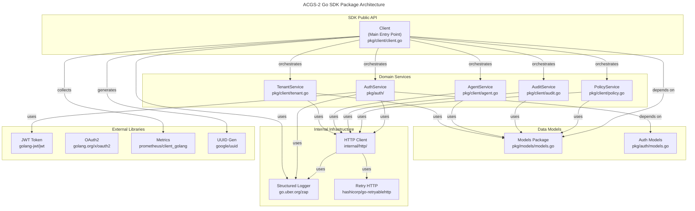
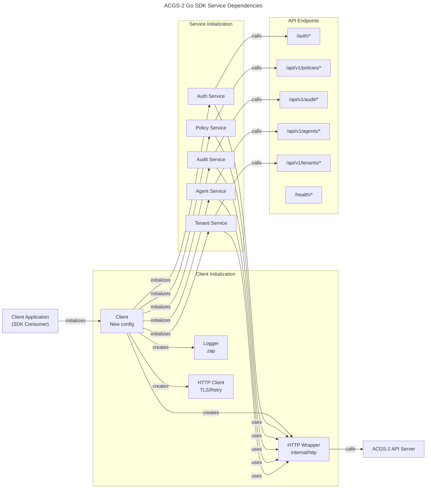
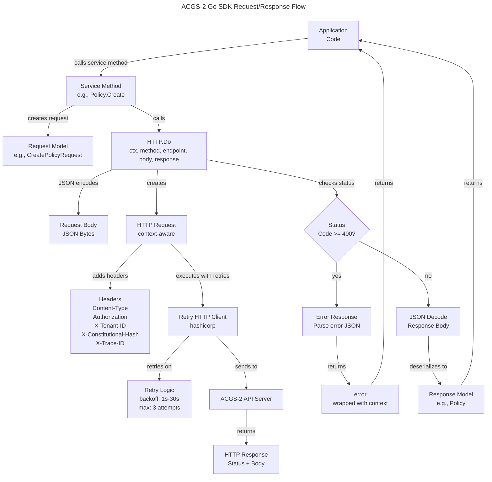

# C4 Code Level: ACGS-2 Go SDK

## Overview

- **Name**: ACGS-2 Go SDK (Go Client Library)
- **Description**: High-performance Go client library for ACGS-2 constitutional AI governance API integration, providing type-safe bindings for policy management, authentication, audit operations, agent coordination, and multi-tenant governance with built-in retry logic and comprehensive logging.
- **Location**: `/home/dislove/document/acgs2/sdk/go`
- **Language**: Go 1.21+
- **Purpose**: Enable Go developers to integrate ACGS-2 constitutional governance capabilities into applications with native type safety, minimal configuration overhead, and production-grade reliability features including automatic retry, circuit breaking, and distributed tracing support.

## Code Elements

### Client Package (`pkg/client`)

#### Main Client Type
- `Client` struct - Main SDK client coordinating all API operations
  - **Location**: `pkg/client/client.go:19-31`
  - **Fields**:
    - `config *Config` - Client configuration with API endpoints and credentials
    - `httpClient *http.Client` - Underlying HTTP client for requests
    - `logger *zap.Logger` - Structured logging for observability
    - `Auth *auth.Service` - Authentication service for user login/logout
    - `Policy *PolicyService` - Policy management and validation
    - `Audit *AuditService` - Audit event querying and compliance reporting
    - `Agent *AgentService` - Agent lifecycle and health management
    - `Tenant *TenantService` - Multi-tenant management and resource quotas
  - **Dependencies**: Depends on internal HTTP client, auth service, and all domain services

#### Client Configuration
- `Config` struct - Immutable client configuration
  - **Location**: `pkg/client/client.go:34-57`
  - **Fields**:
    - `BaseURL string` - ACGS-2 API server URL
    - `Timeout time.Duration` - Request timeout (default: 30s)
    - `RetryAttempts int` - Number of automatic retry attempts (default: 3)
    - `RetryDelay time.Duration` - Delay between retries (default: 1s)
    - `ConstitutionalHash string` - Cryptographic hash for constitutional compliance validation (cdd01ef066bc6cf2)
    - `TenantID string` - Multi-tenant identifier
    - `TLSCertFile string` - Path to client TLS certificate
    - `TLSKeyFile string` - Path to client TLS private key
    - `CACertFile string` - Path to CA certificate for server verification
    - `InsecureTLS bool` - Skip TLS verification (development only)
    - `EnableMetrics bool` - Enable Prometheus metrics collection
    - `EnableTracing bool` - Enable distributed tracing with trace/span IDs
    - `LogLevel string` - Logging level (debug, info, warn, error, fatal)

#### Client Functions

- `NewConfig(baseURL, tenantID string) *Config`
  - **Location**: `pkg/client/client.go:60-73`
  - **Purpose**: Factory function creating configuration with sensible defaults
  - **Returns**: Pre-configured Config struct with:
    - 30 second timeout
    - 3 retry attempts with 1 second delay
    - Metrics and tracing enabled
    - Info log level
  - **Dependencies**: None (pure factory)

- `New(config *Config) (*Client, error)`
  - **Location**: `pkg/client/client.go:76-112`
  - **Purpose**: Initialize SDK client with configuration validation, logger setup, and service initialization
  - **Parameters**:
    - `config *Config` - Client configuration
  - **Returns**: Initialized Client or error
  - **Internal Calls**:
    - `validateConfig()` - Validates BaseURL, TenantID, and constitutional hash
    - `setupLogger()` - Creates zap logger with configured level
    - `setupHTTPClient()` - Creates HTTP transport with TLS configuration
  - **Error Handling**: Returns wrapped errors for config validation, logger setup, or HTTP client setup failures
  - **Dependencies**: zap logger, internal HTTP client

- `Health(ctx context.Context) (*models.HealthStatus, error)`
  - **Location**: `pkg/client/client.go:114-124`
  - **Purpose**: Perform health check against ACGS-2 API
  - **Parameters**:
    - `ctx context.Context` - Request context with cancellation support
  - **Returns**: HealthStatus struct or error
  - **Endpoint**: GET /health
  - **Dependencies**: Internal HTTP client

- `Metrics() map[string]interface{}`
  - **Location**: `pkg/client/client.go:127-137`
  - **Purpose**: Return client metrics for monitoring
  - **Returns**: Map containing:
    - `tenant_id` - Configured tenant identifier
    - `base_url` - API server URL
    - `timeout` - Request timeout value
    - `retry_attempts` - Retry configuration
    - `enable_metrics` - Metrics collection status
    - `enable_tracing` - Distributed tracing status
    - `timestamp` - Current UTC timestamp in RFC3339 format

- `Close() error`
  - **Location**: `pkg/client/client.go:140-145`
  - **Purpose**: Gracefully close client and clean up HTTP connections
  - **Returns**: Error if cleanup fails
  - **Behavior**: Calls CloseIdleConnections() on HTTP client

- `doRequest(ctx context.Context, method, endpoint string, body interface{}, response interface{}) error`
  - **Location**: `pkg/client/client.go:148-182`
  - **Purpose**: Core HTTP request handler with header injection and error handling
  - **Parameters**:
    - `ctx context.Context` - Request context for cancellation and timeouts
    - `method string` - HTTP method (GET, POST, PUT, DELETE)
    - `endpoint string` - API endpoint path
    - `body interface{}` - Request body (JSON serialized)
    - `response interface{}` - Response body target (JSON deserialized)
  - **Injected Headers**:
    - `X-Tenant-ID` - Multi-tenant identifier
    - `X-Constitutional-Hash` - Constitutional compliance hash
    - `Content-Type: application/json` - Content type negotiation
    - `X-Trace-ID` - Distributed trace identifier (if tracing enabled)
    - `X-Span-ID` - Distributed span identifier (if tracing enabled)
  - **Error Handling**: Returns status code errors for 4xx/5xx responses
  - **Dependencies**: Internal HTTP client, response JSON decoding

#### Helper Functions

- `validateConfig(config *Config) error`
  - **Location**: `pkg/client/client.go:185-196`
  - **Purpose**: Validate client configuration before initialization
  - **Validation Rules**:
    - BaseURL must not be empty
    - TenantID must not be empty
    - ConstitutionalHash must equal "cdd01ef066bc6cf2"
  - **Returns**: Error with specific validation failure message

- `setupLogger(level string) (*zap.Logger, error)`
  - **Location**: `pkg/client/client.go:199-204`
  - **Purpose**: Create production-grade structured logger
  - **Parameters**: Log level string (debug, info, warn, error, fatal)
  - **Returns**: Configured zap Logger or error
  - **Dependencies**: zap library for structured logging

- `setupHTTPClient(config *Config) (*http.Client, error)`
  - **Location**: `pkg/client/client.go:207-227`
  - **Purpose**: Configure HTTP client with TLS and certificate handling
  - **Features**:
    - Custom TLS configuration with InsecureTLS option
    - Client certificate loading from files
    - Request timeout configuration
  - **Returns**: Configured HTTP client or error
  - **Error Handling**: Returns error if client certificate loading fails

- `parseLogLevel(level string) zap.AtomicLevel`
  - **Location**: `pkg/client/client.go:230-245`
  - **Purpose**: Convert string log level to zap AtomicLevel
  - **Mapping**:
    - "debug" -> zap.DebugLevel
    - "info" -> zap.InfoLevel
    - "warn"/"warning" -> zap.WarnLevel
    - "error" -> zap.ErrorLevel
    - "fatal" -> zap.FatalLevel
    - (default) -> zap.InfoLevel
  - **Returns**: zap.AtomicLevel enum value

- `generateTraceID() string`
  - **Location**: `pkg/client/client.go:248-250`
  - **Purpose**: Generate distributed trace identifier
  - **Algorithm**: Hex-encoded current Unix nanosecond timestamp
  - **Returns**: Trace ID string for correlation

- `generateSpanID() string`
  - **Location**: `pkg/client/client.go:253-255`
  - **Purpose**: Generate distributed span identifier
  - **Algorithm**: Hex-encoded lower 32 bits of Unix nanosecond timestamp
  - **Returns**: Span ID string for tracing

### Authentication Package (`pkg/auth`)

#### Auth Service
- `Service` struct - Authentication and user management
  - **Location**: `pkg/auth/auth.go:14-23`
  - **Fields**:
    - `client *http.Client` - Internal HTTP client
    - `tenantID string` - Multi-tenant context
    - `logger *zap.Logger` - Structured logging
    - `accessToken string` - Current JWT access token (cached)
    - `refreshToken string` - Refresh token for token renewal
    - `tokenExpiry time.Time` - Access token expiration time
  - **Purpose**: Manage user authentication, session tokens, and profile information

#### Auth Service Functions

- `NewService(client *http.Client, tenantID string, logger *zap.Logger) *Service`
  - **Location**: `pkg/auth/auth.go:26-32`
  - **Purpose**: Factory function creating auth service instance
  - **Returns**: Initialized Service with empty tokens

- `Login(ctx context.Context, username, password string) (*LoginResponse, error)`
  - **Location**: `pkg/auth/auth.go:35-55`
  - **Purpose**: Authenticate user with credentials and obtain JWT tokens
  - **Parameters**:
    - `username string` - User identifier
    - `password string` - User password
  - **Returns**: LoginResponse with tokens and user info or error
  - **Side Effects**: Caches accessToken, refreshToken, and tokenExpiry
  - **Endpoint**: POST /auth/login
  - **Logging**: Info log on successful login with user ID

- `Logout(ctx context.Context) error`
  - **Location**: `pkg/auth/auth.go:58-68`
  - **Purpose**: Invalidate session tokens and end authentication
  - **Endpoint**: POST /auth/logout
  - **Side Effects**: Clears cached tokens
  - **Logging**: Info log on successful logout

- `RefreshToken(ctx context.Context) (*TokenRefreshResponse, error)`
  - **Location**: `pkg/auth/auth.go:71-95`
  - **Purpose**: Renew access token using refresh token
  - **Returns**: TokenRefreshResponse with new tokens or error
  - **Validation**: Checks for available refresh token
  - **Side Effects**: Updates cached accessToken and tokenExpiry
  - **Endpoint**: POST /auth/refresh
  - **Logging**: Info log on successful refresh

- `GetUserInfo(ctx context.Context) (*UserInfo, error)`
  - **Location**: `pkg/auth/auth.go:98-106`
  - **Purpose**: Retrieve current authenticated user's information
  - **Returns**: UserInfo struct with profile details
  - **Endpoint**: GET /auth/user
  - **Requires**: Authenticated session with valid access token

- `UpdateProfile(ctx context.Context, updates *ProfileUpdate) (*UserInfo, error)`
  - **Location**: `pkg/auth/auth.go:109-118`
  - **Purpose**: Update current user's profile information
  - **Parameters**: ProfileUpdate struct with optional first name, last name, email
  - **Returns**: Updated UserInfo
  - **Endpoint**: PATCH /auth/user
  - **Logging**: Info log with updated user ID

- `ChangePassword(ctx context.Context, currentPassword, newPassword string) error`
  - **Location**: `pkg/auth/auth.go:121-134`
  - **Purpose**: Change current user's password
  - **Parameters**:
    - `currentPassword string` - Verification of existing password
    - `newPassword string` - New password to set
  - **Endpoint**: POST /auth/change-password
  - **Logging**: Info log on successful password change

- `IsAuthenticated() bool`
  - **Location**: `pkg/auth/auth.go:137-139`
  - **Purpose**: Check current authentication status
  - **Returns**: True if access token exists and not expired
  - **Logic**: Checks token != "" && now < tokenExpiry (no API call)

- `GetAccessToken() string`
  - **Location**: `pkg/auth/auth.go:142-144`
  - **Purpose**: Retrieve cached access token
  - **Returns**: Current JWT access token
  - **Use Case**: For manual header injection in custom requests

- `GetTokenExpiry() time.Time`
  - **Location**: `pkg/auth/auth.go:147-149`
  - **Purpose**: Get access token expiration time
  - **Returns**: Unix timestamp when token expires

- `ClearTokens()`
  - **Location**: `pkg/auth/auth.go:152-154`
  - **Purpose**: Public wrapper for token clearing
  - **Calls**: `clearTokens()` internal function

- `Health(ctx context.Context) (bool, error)`
  - **Location**: `pkg/auth/auth.go:157-165`
  - **Purpose**: Check auth service availability
  - **Returns**: Boolean health status
  - **Endpoint**: GET /health/auth

#### Helper Functions

- `clearTokens()` (private)
  - **Location**: `pkg/auth/auth.go:168-172`
  - **Purpose**: Internal token cleanup
  - **Side Effects**: Resets accessToken, refreshToken, tokenExpiry

### Policy Service (`pkg/client/policy.go`)

#### Policy Service Type
- `PolicyService` struct - Policy management and validation
  - **Location**: `pkg/client/policy.go:15-19`
  - **Fields**:
    - `client *http.Client` - Internal HTTP client
    - `tenantID string` - Multi-tenant context
    - `logger *zap.Logger` - Structured logging

#### Policy Service Functions

- `NewPolicyService(client *http.Client, tenantID string, logger *zap.Logger) *PolicyService`
  - **Location**: `pkg/client/policy.go:22-28`
  - **Purpose**: Factory function creating policy service

- `List(ctx context.Context, query *models.PolicyQuery) (*models.ListResponse[models.Policy], error)`
  - **Location**: `pkg/client/policy.go:31-70`
  - **Purpose**: List policies with optional filtering and pagination
  - **Query Parameters**:
    - `status` - Filter by PolicyStatus (draft, active, inactive, archived)
    - `type` - Filter by PolicyType (security, compliance, operational, governance)
    - `severity` - Filter by Severity (low, medium, high, critical)
    - `name` - Filter by policy name (substring)
    - `tag` - Filter by policy tag
    - `limit` - Page size limit
    - `offset` - Pagination offset
  - **Returns**: ListResponse containing Policy array and pagination info
  - **Endpoint**: GET /api/v1/policies

- `Get(ctx context.Context, id string) (*models.Policy, error)`
  - **Location**: `pkg/client/policy.go:73-83`
  - **Purpose**: Retrieve specific policy by ID
  - **Parameters**: Policy ID string
  - **Returns**: Policy struct with full details
  - **Endpoint**: GET /api/v1/policies/{id}

- `Create(ctx context.Context, req *models.CreatePolicyRequest) (*models.Policy, error)`
  - **Location**: `pkg/client/policy.go:86-97`
  - **Purpose**: Create new governance policy
  - **Parameters**: CreatePolicyRequest with policy details
  - **Returns**: Created Policy with assigned ID and timestamps
  - **Endpoint**: POST /api/v1/policies
  - **Logging**: Info log with policy ID and name

- `Update(ctx context.Context, id string, req *models.UpdatePolicyRequest) (*models.Policy, error)`
  - **Location**: `pkg/client/policy.go:100-111`
  - **Purpose**: Modify existing policy
  - **Parameters**:
    - `id string` - Policy identifier
    - `req *UpdatePolicyRequest` - Fields to update (pointer fields for optional updates)
  - **Returns**: Updated Policy
  - **Endpoint**: PUT /api/v1/policies/{id}
  - **Logging**: Info log with policy ID

- `Delete(ctx context.Context, id string) error`
  - **Location**: `pkg/client/policy.go:114-124`
  - **Purpose**: Remove policy
  - **Parameters**: Policy ID
  - **Endpoint**: DELETE /api/v1/policies/{id}
  - **Logging**: Info log with policy ID

- `Validate(ctx context.Context, policy *models.Policy) (*models.PolicyValidationResult, error)`
  - **Location**: `pkg/client/policy.go:127-137`
  - **Purpose**: Validate policy rules and syntax
  - **Returns**: PolicyValidationResult with valid flag and error/warning/suggestion arrays
  - **Endpoint**: POST /api/v1/policies/validate

- `Activate(ctx context.Context, id string) error`
  - **Location**: `pkg/client/policy.go:140-150`
  - **Purpose**: Activate policy for enforcement
  - **Parameters**: Policy ID
  - **Endpoint**: POST /api/v1/policies/{id}/activate
  - **Logging**: Info log on activation

- `Deactivate(ctx context.Context, id string) error`
  - **Location**: `pkg/client/policy.go:153-163`
  - **Purpose**: Deactivate policy (stop enforcement)
  - **Parameters**: Policy ID
  - **Endpoint**: POST /api/v1/policies/{id}/deactivate
  - **Logging**: Info log on deactivation

- `GetVersions(ctx context.Context, id string) ([]models.Policy, error)`
  - **Location**: `pkg/client/policy.go:166-176`
  - **Purpose**: Retrieve policy version history
  - **Parameters**: Policy ID
  - **Returns**: Array of Policy versions (chronologically ordered)
  - **Endpoint**: GET /api/v1/policies/{id}/versions

- `Clone(ctx context.Context, id string, name string) (*models.Policy, error)`
  - **Location**: `pkg/client/policy.go:179-191`
  - **Purpose**: Create copy of existing policy with new name
  - **Parameters**:
    - `id string` - Source policy ID
    - `name string` - Name for cloned policy
  - **Returns**: New Policy with cloned content
  - **Endpoint**: POST /api/v1/policies/{id}/clone
  - **Logging**: Info log with original and new policy IDs

- `Health(ctx context.Context) (bool, error)`
  - **Location**: `pkg/client/policy.go:194-205`
  - **Purpose**: Check policy service availability
  - **Endpoint**: GET /health/policy

### Audit Service (`pkg/client/audit.go`)

#### Audit Service Type
- `AuditService` struct - Audit event querying and compliance reporting
  - **Location**: `pkg/client/audit.go:15-19`
  - **Fields**:
    - `client *http.Client` - Internal HTTP client
    - `tenantID string` - Multi-tenant context
    - `logger *zap.Logger` - Structured logging

#### Audit Service Functions

- `NewAuditService(client *http.Client, tenantID string, logger *zap.Logger) *AuditService`
  - **Location**: `pkg/client/audit.go:22-28`
  - **Purpose**: Factory function creating audit service

- `Query(ctx context.Context, query *models.AuditQuery) (*models.ListResponse[models.AuditEvent], error)`
  - **Location**: `pkg/client/audit.go:31-79`
  - **Purpose**: Query audit events with advanced filtering
  - **Query Parameters**:
    - `event_type` - Filter by event type
    - `event_category` - Filter by category
    - `severity` - Filter by severity level
    - `user_id` - Filter by user who triggered event
    - `agent_id` - Filter by agent involved
    - `policy_id` - Filter by policy affected
    - `start_time` - Time range start (RFC3339 format)
    - `end_time` - Time range end (RFC3339 format)
    - `limit` - Page size
    - `offset` - Pagination offset
  - **Returns**: ListResponse with AuditEvent array
  - **Endpoint**: GET /api/v1/audit/events

- `Get(ctx context.Context, id string) (*models.AuditEvent, error)`
  - **Location**: `pkg/client/audit.go:82-92`
  - **Purpose**: Retrieve specific audit event
  - **Returns**: Detailed AuditEvent with metadata
  - **Endpoint**: GET /api/v1/audit/events/{id}

- `GetSummary(ctx context.Context, period string) (*models.AuditSummary, error)`
  - **Location**: `pkg/client/audit.go:95-105`
  - **Purpose**: Get audit statistics summary for period
  - **Parameters**: Period string (e.g., "1h", "24h", "7d")
  - **Returns**: AuditSummary with event counts, top users, top resources
  - **Endpoint**: GET /api/v1/audit/summary?period={period}

- `GenerateComplianceReport(ctx context.Context, framework, period string) (*models.ComplianceReport, error)`
  - **Location**: `pkg/client/audit.go:108-121`
  - **Purpose**: Generate compliance report for regulatory framework
  - **Parameters**:
    - `framework string` - Compliance framework (e.g., SOC2, ISO27001, HIPAA)
    - `period string` - Reporting period
  - **Returns**: ComplianceReport with sections, findings, recommendations
  - **Endpoint**: POST /api/v1/audit/compliance/{framework}?period={period}
  - **Logging**: Info log with framework and period

- `Health(ctx context.Context) (bool, error)`
  - **Location**: `pkg/client/audit.go:124-134`
  - **Purpose**: Check audit service availability
  - **Endpoint**: GET /health/audit

### Agent Service (`pkg/client/agent.go`)

#### Agent Service Type
- `AgentService` struct - Agent lifecycle and coordination
  - **Location**: `pkg/client/agent.go:15-19`
  - **Fields**:
    - `client *http.Client` - Internal HTTP client
    - `tenantID string` - Multi-tenant context
    - `logger *zap.Logger` - Structured logging

#### Agent Service Functions

- `NewAgentService(client *http.Client, tenantID string, logger *zap.Logger) *AgentService`
  - **Location**: `pkg/client/agent.go:22-28`
  - **Purpose**: Factory function creating agent service

- `List(ctx context.Context, query *models.AgentQuery) (*models.ListResponse[models.Agent], error)`
  - **Location**: `pkg/client/agent.go:31-70`
  - **Purpose**: List agents with filtering
  - **Query Parameters**:
    - `type` - Filter by AgentType (analysis, moderation, generation, translation, custom)
    - `status` - Filter by AgentStatus (active, inactive, suspended, error)
    - `name` - Filter by agent name
    - `tag` - Filter by agent tag
    - `capability` - Filter by agent capability
    - `limit` - Page size
    - `offset` - Pagination offset
  - **Returns**: ListResponse with Agent array
  - **Endpoint**: GET /api/v1/agents

- `Get(ctx context.Context, id string) (*models.Agent, error)`
  - **Location**: `pkg/client/agent.go:73-83`
  - **Purpose**: Retrieve specific agent configuration
  - **Returns**: Agent with capabilities and configuration
  - **Endpoint**: GET /api/v1/agents/{id}

- `Register(ctx context.Context, req *models.RegisterAgentRequest) (*models.Agent, error)`
  - **Location**: `pkg/client/agent.go:86-97`
  - **Purpose**: Register new agent in system
  - **Parameters**: RegisterAgentRequest with agent details
  - **Returns**: Registered Agent with assigned ID
  - **Endpoint**: POST /api/v1/agents
  - **Logging**: Info log with agent ID and name

- `Update(ctx context.Context, id string, req *models.UpdateAgentRequest) (*models.Agent, error)`
  - **Location**: `pkg/client/agent.go:100-111`
  - **Purpose**: Modify agent configuration
  - **Parameters**:
    - `id string` - Agent identifier
    - `req *UpdateAgentRequest` - Configuration changes
  - **Returns**: Updated Agent
  - **Endpoint**: PUT /api/v1/agents/{id}
  - **Logging**: Info log with agent ID

- `Delete(ctx context.Context, id string) error`
  - **Location**: `pkg/client/agent.go:114-124`
  - **Purpose**: Remove agent from system
  - **Parameters**: Agent ID
  - **Endpoint**: DELETE /api/v1/agents/{id}
  - **Logging**: Info log with agent ID

- `SendHeartbeat(ctx context.Context, id string, heartbeat *models.AgentHeartbeat) error`
  - **Location**: `pkg/client/agent.go:127-136`
  - **Purpose**: Send agent liveness and status signal
  - **Parameters**:
    - `id string` - Agent ID
    - `heartbeat *AgentHeartbeat` - Status update with metrics
  - **Endpoint**: POST /api/v1/agents/{id}/heartbeat
  - **Logging**: Error log only on failure

- `GetHealth(ctx context.Context, id string) (map[string]interface{}, error)`
  - **Location**: `pkg/client/agent.go:139-149`
  - **Purpose**: Retrieve agent health metrics
  - **Returns**: Map with health information (CPU, memory, status)
  - **Endpoint**: GET /api/v1/agents/{id}/health

- `Health(ctx context.Context) (bool, error)`
  - **Location**: `pkg/client/agent.go:152-162`
  - **Purpose**: Check agent service availability
  - **Endpoint**: GET /health/agents

### Tenant Service (`pkg/client/tenant.go`)

#### Tenant Service Type
- `TenantService` struct - Multi-tenant management and resource quotas
  - **Location**: `pkg/client/tenant.go:15-19`
  - **Fields**:
    - `client *http.Client` - Internal HTTP client
    - `tenantID string` - Multi-tenant context
    - `logger *zap.Logger` - Structured logging

#### Tenant Service Functions

- `NewTenantService(client *http.Client, tenantID string, logger *zap.Logger) *TenantService`
  - **Location**: `pkg/client/tenant.go:22-28`
  - **Purpose**: Factory function creating tenant service

- `List(ctx context.Context, query *models.TenantQuery) (*models.ListResponse[models.Tenant], error)`
  - **Location**: `pkg/client/tenant.go:31-64`
  - **Purpose**: List tenants with filtering
  - **Query Parameters**:
    - `status` - Filter by TenantStatus (active, suspended, inactive)
    - `tier` - Filter by TenantTier (free, professional, enterprise, sovereign)
    - `name` - Filter by tenant name
    - `limit` - Page size
    - `offset` - Pagination offset
  - **Returns**: ListResponse with Tenant array
  - **Endpoint**: GET /api/v1/tenants

- `Get(ctx context.Context, id string) (*models.Tenant, error)`
  - **Location**: `pkg/client/tenant.go:67-77`
  - **Purpose**: Retrieve specific tenant information
  - **Returns**: Tenant with configuration and status
  - **Endpoint**: GET /api/v1/tenants/{id}

- `Create(ctx context.Context, req *models.CreateTenantRequest) (*models.Tenant, error)`
  - **Location**: `pkg/client/tenant.go:80-91`
  - **Purpose**: Create new tenant
  - **Parameters**: CreateTenantRequest with tenant details
  - **Returns**: Created Tenant with assigned ID
  - **Endpoint**: POST /api/v1/tenants
  - **Logging**: Info log with tenant ID and name

- `Update(ctx context.Context, id string, req *models.UpdateTenantRequest) (*models.Tenant, error)`
  - **Location**: `pkg/client/tenant.go:94-105`
  - **Purpose**: Modify tenant configuration
  - **Parameters**:
    - `id string` - Tenant identifier
    - `req *UpdateTenantRequest` - Configuration changes
  - **Returns**: Updated Tenant
  - **Endpoint**: PUT /api/v1/tenants/{id}
  - **Logging**: Info log with tenant ID

- `Delete(ctx context.Context, id string) error`
  - **Location**: `pkg/client/tenant.go:108-118`
  - **Purpose**: Remove tenant
  - **Parameters**: Tenant ID
  - **Endpoint**: DELETE /api/v1/tenants/{id}
  - **Logging**: Info log with tenant ID

- `ValidateTenantAccess(ctx context.Context, tenantID string) error`
  - **Location**: `pkg/client/tenant.go:121-130`
  - **Purpose**: Verify current user has access to tenant
  - **Parameters**: Tenant ID to validate
  - **Returns**: Error if access denied
  - **Endpoint**: GET /api/v1/tenants/{id}/validate-access

- `GetUsage(ctx context.Context, id string) (map[string]interface{}, error)`
  - **Location**: `pkg/client/tenant.go:133-143`
  - **Purpose**: Retrieve tenant resource usage metrics
  - **Returns**: Map with usage data (API calls, storage, etc.)
  - **Endpoint**: GET /api/v1/tenants/{id}/usage

- `GetQuota(ctx context.Context, id string) (*models.ResourceQuota, error)`
  - **Location**: `pkg/client/tenant.go:146-156`
  - **Purpose**: Get tenant resource quota limits
  - **Returns**: ResourceQuota with Users, Policies, Agents, APICalls, Storage limits
  - **Endpoint**: GET /api/v1/tenants/{id}/quota

- `UpdateQuota(ctx context.Context, id string, quota *models.ResourceQuota) error`
  - **Location**: `pkg/client/tenant.go:159-169`
  - **Purpose**: Modify tenant resource quotas
  - **Parameters**:
    - `id string` - Tenant ID
    - `quota *ResourceQuota` - New quota limits
  - **Endpoint**: PUT /api/v1/tenants/{id}/quota
  - **Logging**: Info log with tenant ID

- `Health(ctx context.Context) (bool, error)`
  - **Location**: `pkg/client/tenant.go:172-182`
  - **Purpose**: Check tenant service availability
  - **Endpoint**: GET /health/tenants

### Models Package (`pkg/models`)

#### Core Types

- `HealthStatus` struct
  - **Location**: `pkg/models/models.go:7-13`
  - **Purpose**: Service health status response
  - **Fields**: Status string, Services map[string]bool, Message string, Version string, Timestamp time.Time

- `ErrorResponse` struct
  - **Location**: `pkg/models/models.go:16-21`
  - **Purpose**: API error response format
  - **Fields**: Error, Message, Code, Details map[string]interface{}

- `Pagination` struct
  - **Location**: `pkg/models/models.go:24-29`
  - **Purpose**: Pagination metadata
  - **Fields**: Page, Limit, Total, Pages integers

- `ListResponse[T any]` struct
  - **Location**: `pkg/models/models.go:32-35`
  - **Purpose**: Generic paginated response
  - **Generic**: Supports any data type T
  - **Fields**: Data array, Pagination pointer

- `BaseEntity` struct
  - **Location**: `pkg/models/models.go:38-42`
  - **Purpose**: Common fields for all domain entities
  - **Fields**: ID string, CreatedAt time.Time, UpdatedAt time.Time
  - **Embedded By**: Tenant, Policy, AuditEvent, Agent

#### Tenant Models

- `Tenant` struct - Enterprise tenant configuration
  - **Location**: `pkg/models/models.go:45-56`
  - **Embeds**: BaseEntity
  - **Fields**:
    - `Name string` - Tenant display name
    - `Description string` - Tenant description
    - `Status TenantStatus` - active/suspended/inactive
    - `Tier TenantTier` - free/professional/enterprise/sovereign
    - `ResourceQuota` - User/Policy/Agent/API call/Storage limits
    - `ComplianceFrameworks []string` - Supported compliance standards
    - `DataResidency string` - Geographic data residency requirement
    - `Features []string` - Enabled feature flags
    - `Metadata map[string]string` - Custom key-value pairs

- `CreateTenantRequest` struct - Tenant creation payload
- `UpdateTenantRequest` struct - Tenant update payload (pointer fields)
- `TenantQuery` struct - Tenant list filtering
- `ResourceQuota` struct - Resource limits (Users, Policies, Agents, APICalls, Storage)

#### Policy Models

- `Policy` struct - Governance policy configuration
  - **Location**: `pkg/models/models.go:121-133`
  - **Embeds**: BaseEntity
  - **Fields**:
    - `Name string` - Policy name
    - `Description string` - Policy description
    - `Version string` - Semantic version
    - `Status PolicyStatus` - draft/active/inactive/archived
    - `Type PolicyType` - security/compliance/operational/governance
    - `Rules []PolicyRule` - Individual policy rules
    - `ComplianceFrameworks []string` - Associated standards
    - `Severity` - Policy severity level
    - `Tags []string` - Classification tags
    - `Metadata` - Custom metadata

- `PolicyRule` struct - Individual policy rule
  - **Location**: `pkg/models/models.go:156-165`
  - **Fields**:
    - `ID string` - Unique rule identifier
    - `Name string` - Rule name
    - `Description string` - Rule description
    - `Condition string` - CEL expression for rule trigger
    - `Action string` - Action when condition met
    - `Parameters map[string]interface{}` - Action parameters
    - `Severity` - Rule severity
    - `Enabled bool` - Rule activation status

- `PolicyValidationResult` struct - Policy validation output
  - **Location**: `pkg/models/models.go:214-219`
  - **Fields**: Valid bool, Errors/Warnings/Suggestions arrays

#### Audit Models

- `AuditEvent` struct - Audit trail entry
  - **Location**: `pkg/models/models.go:222-240`
  - **Embeds**: BaseEntity
  - **Fields**:
    - `EventType string` - Event classification
    - `EventCategory string` - Event category
    - `Severity` - Event severity
    - `Message string` - Event description
    - `UserID/AgentID/PolicyID string` - Entity references
    - `ResourceType/ResourceID string` - Affected resource
    - `Action string` - Action performed
    - `Result string` - Action result (success/failure)
    - `IPAddress/UserAgent string` - Request metadata
    - `TraceID/SpanID string` - Distributed tracing IDs
    - `Metadata` - Custom event metadata

- `AuditSummary` struct - Audit statistics
  - **Location**: `pkg/models/models.go:257-264`
  - **Fields**: TotalEvents, EventsByType map, EventsBySeverity map, TopUsers array, TopResources array

- `ComplianceReport` struct - Compliance framework report
  - **Location**: `pkg/models/models.go:282-292`
  - **Fields**:
    - `Framework string` - Compliance standard name
    - `Period string` - Report period
    - `GeneratedAt time.Time` - Report generation time
    - `OverallScore float64` - Overall compliance score (0-100)
    - `Status ComplianceStatus` - compliant/non_compliant/partial
    - `Sections []ComplianceSection` - Report sections with findings
    - `Recommendations []string` - Recommended remediation steps

#### Agent Models

- `Agent` struct - AI agent configuration
  - **Location**: `pkg/models/models.go:324-336`
  - **Embeds**: BaseEntity
  - **Fields**:
    - `Name string` - Agent display name
    - `Description string` - Agent description
    - `Type AgentType` - analysis/moderation/generation/translation/custom
    - `Status AgentStatus` - active/inactive/suspended/error
    - `Capabilities []string` - List of agent capabilities
    - `Configuration map[string]interface{}` - Agent-specific config
    - `ResourceRequirements` - CPU/Memory/GPU/Disk requirements
    - `LastHeartbeat time.Time` - Last agent status signal
    - `Tags/Metadata` - Classification and custom metadata

- `AgentHeartbeat` struct - Agent status update
  - **Location**: `pkg/models/models.go:368-375`
  - **Fields**:
    - `AgentID string` - Agent identifier
    - `Timestamp time.Time` - Heartbeat timestamp
    - `Status AgentStatus` - Current agent status
    - `Metrics map[string]interface{}` - Performance metrics
    - `HealthScore float64` - Normalized health (0-100)
    - `Message string` - Status message

#### Authentication Models

- `LoginRequest` struct - User login payload
  - **Location**: `pkg/auth/models.go:6-10`
  - **Fields**: Username, Password, TenantID

- `LoginResponse` struct - Login response with tokens
  - **Location**: `pkg/auth/models.go:13-19`
  - **Fields**: AccessToken, RefreshToken, TokenType, ExpiresIn, User UserInfo

- `TokenRefreshRequest` struct - Token refresh payload
- `TokenRefreshResponse` struct - Refreshed token response

- `UserInfo` struct - User profile information
  - **Location**: `pkg/auth/models.go:35-48`
  - **Fields**:
    - `ID/Username/Email string` - User identifiers
    - `FirstName/LastName string` - User display name
    - `Roles/Permissions []string` - Authorization data
    - `TenantID string` - Associated tenant
    - `LastLogin *time.Time` - Last login timestamp
    - `IsActive bool` - Account status
    - `CreatedAt/UpdatedAt time.Time` - Audit timestamps

- `ProfileUpdate` struct - Profile modification payload
  - **Location**: `pkg/auth/models.go:51-55`
  - **Fields**: FirstName, LastName, Email (all pointers for optional updates)

- `PasswordChange` struct - Password change request
  - **Location**: `pkg/auth/models.go:58-61`
  - **Fields**: CurrentPassword, NewPassword strings

#### Enums (Type Aliases)

- `TenantStatus` (string enum)
  - Values: "active", "suspended", "inactive"

- `TenantTier` (string enum)
  - Values: "free", "professional", "enterprise", "sovereign"

- `PolicyStatus` (string enum)
  - Values: "draft", "active", "inactive", "archived"

- `PolicyType` (string enum)
  - Values: "security", "compliance", "operational", "governance"

- `Severity` (string enum)
  - Values: "low", "medium", "high", "critical"

- `ComplianceStatus` (string enum)
  - Values: "compliant", "non_compliant", "partial"

- `AgentType` (string enum)
  - Values: "analysis", "moderation", "generation", "translation", "custom"

- `AgentStatus` (string enum)
  - Values: "active", "inactive", "suspended", "error"

### Internal HTTP Package (`internal/http`)

#### HTTP Client Type
- `Client` struct - HTTP client with automatic retry logic
  - **Location**: `internal/http/http.go:18-22`
  - **Fields**:
    - `client *retryablehttp.Client` - Underlying retryable HTTP client
    - `baseURL string` - API base URL
    - `logger *zap.Logger` - Structured logging
  - **Purpose**: Provide retry-enabled HTTP requests with logging and error handling

#### HTTP Client Functions

- `NewClient(httpClient *http.Client, baseURL string, logger *zap.Logger) *Client`
  - **Location**: `internal/http/http.go:25-38`
  - **Purpose**: Create HTTP client wrapper with retry configuration
  - **Retry Configuration**:
    - RetryMax: 3 attempts
    - RetryWaitMin: 1 second
    - RetryWaitMax: 30 seconds
  - **Dependencies**: hashicorp/go-retryablehttp for retry logic

- `Do(ctx context.Context, method, endpoint string, body interface{}, response interface{}) error`
  - **Location**: `internal/http/http.go:41-111`
  - **Purpose**: Execute HTTP request with automatic retry and error handling
  - **Parameters**:
    - `method string` - HTTP method (GET, POST, PUT, DELETE, etc.)
    - `endpoint string` - API endpoint path
    - `body interface{}` - Request body (JSON serialized)
    - `response interface{}` - Response target (JSON deserialized)
  - **Features**:
    - JSON request/response marshaling
    - Context-aware request creation (supports cancellation/timeout)
    - Standard error response parsing
    - Status code validation (>=400 treated as error)
    - Comprehensive error logging with context
  - **Error Handling**:
    - Returns wrapped errors with context
    - Logs API error responses with status code, error code, and message
    - Returns status text if response body not valid JSON
  - **Logging**: Error logs for failures, Debug logs for successful requests

#### Helper Functions

- `buildURL(endpoint string) string`
  - **Location**: `internal/http/http.go:114-119`
  - **Purpose**: Construct absolute URL from base and endpoint
  - **Algorithm**: Uses net/url.ResolveReference for proper URL joining
  - **Returns**: Complete URL string

- `SetRetryMax(max int)`
  - **Location**: `internal/http/http.go:131-133`
  - **Purpose**: Configure maximum retry attempts
  - **Parameter**: Max integer value

- `SetRetryWaitMin(wait time.Duration)`
  - **Location**: `internal/http/http.go:136-138`
  - **Purpose**: Configure minimum retry delay
  - **Parameter**: Duration between retries

- `SetRetryWaitMax(wait time.Duration)`
  - **Location**: `internal/http/http.go:141-143`
  - **Purpose**: Configure maximum retry delay
  - **Parameter**: Duration cap for backoff

#### Internal Logger Adapter

- `retryLogger` struct - Adapter for hashicorp/go-retryablehttp logger
  - **Location**: `internal/http/http.go:122-124`
  - **Purpose**: Integrate zap logger with retryablehttp library
  - **Fields**: `logger *zap.Logger`

- `Printf(format string, args ...interface{})`
  - **Location**: `internal/http/http.go:126-128`
  - **Purpose**: Implement retryablehttp.Logger interface
  - **Behavior**: Logs retry events to zap at Debug level

## Dependencies

### External Dependencies

#### Direct Dependencies (from go.mod)

1. **github.com/golang-jwt/jwt/v5** (v5.2.0)
   - **Purpose**: JWT token parsing and validation
   - **Usage**: Auth service token handling and verification

2. **github.com/google/uuid** (v1.6.0)
   - **Purpose**: UUID generation for unique identifiers
   - **Usage**: Request tracing and entity ID generation

3. **github.com/hashicorp/go-retryablehttp** (v0.7.5)
   - **Purpose**: HTTP client with automatic retry logic
   - **Usage**: Network resilience with exponential backoff
   - **Features**: Configurable retry attempts and backoff timing

4. **github.com/mitchellh/mapstructure** (v1.5.0)
   - **Purpose**: Struct mapping from maps
   - **Usage**: Dynamic response deserialization

5. **github.com/prometheus/client_golang** (v1.18.0)
   - **Purpose**: Prometheus metrics collection
   - **Usage**: Client-side metrics (when EnableMetrics=true)

6. **github.com/stretchr/testify** (v1.8.4)
   - **Purpose**: Testing assertions and mocking
   - **Usage**: Unit and integration test framework

7. **go.uber.org/zap** (v1.26.0)
   - **Purpose**: Structured logging
   - **Usage**: High-performance logging throughout SDK
   - **Features**: Levels, fields, hooks, cores for customization

8. **golang.org/x/oauth2** (v0.15.0)
   - **Purpose**: OAuth2 authentication
   - **Usage**: OAuth2 grant type support (future)

9. **gopkg.in/yaml.v3** (v3.0.1)
   - **Purpose**: YAML parsing and serialization
   - **Usage**: Configuration file support

#### Indirect Dependencies

- Standard library modules:
  - `net/http` - HTTP protocol
  - `encoding/json` - JSON marshaling
  - `context` - Context-aware operations
  - `crypto/tls` - TLS/SSL support
  - `time` - Time and duration handling
  - `fmt` - String formatting
  - `bytes` - Byte buffer operations
  - `io` - Input/output operations
  - `net/url` - URL parsing and manipulation

### Internal Dependencies

- Cross-package imports:
  - `pkg/client` -> `internal/http` (HTTP client)
  - `pkg/client` -> `pkg/auth` (Authentication service)
  - `pkg/client` -> `pkg/models` (Data structures)
  - All services -> `pkg/models` (Shared types)
  - All services -> `internal/http` (HTTP transport)

## Relationships

### Package Structure Diagram

### Service Dependency Diagram

### Data Flow Diagram

## Notes

### Constitutional Compliance Integration

- All client requests include `X-Constitutional-Hash: cdd01ef066bc6cf2` header for cryptographic verification
- Configuration validation enforces exact constitutional hash match
- Audit service tracks all governance operations for compliance reporting

### Performance Characteristics

- **Automatic Retry Logic**: Exponential backoff (1s-30s) with 3 max attempts for resilience
- **Connection Pooling**: HTTP client maintains persistent connections
- **Concurrent Operations**: Context-aware design supports concurrent API calls
- **Structured Logging**: Zero-allocation structured logging with zap for high throughput

### Error Handling Patterns

- All service methods return `(result, error)` following Go idioms
- Errors are wrapped with context using `fmt.Errorf("operation failed: %w", err)`
- HTTP errors include status code, error code, and message fields
- Validation errors prevent client construction with detailed failure reasons

### Authentication Flow

1. User calls `Auth.Login(ctx, username, password)`
2. Service exchanges credentials for JWT tokens via `/auth/login`
3. Access token cached in service instance
4. Subsequent requests use cached token via `X-Authorization` header (injected by SDK)
5. On token expiry, call `Auth.RefreshToken(ctx)` to obtain new token
6. Logout with `Auth.Logout(ctx)` to invalidate session

### Multi-Tenant Operations

- TenantID provided at client initialization applies to all requests
- Included in `X-Tenant-ID` header for server-side isolation
- Tenant service enables managing multiple tenants if authorized
- Row-Level Security enforced server-side based on tenant context

### Configuration Best Practices

- Use `NewConfig()` factory for sensible defaults
- Override specific fields for production (TLS certificates, timeout values)
- Keep ConstitutionalHash immutable for compliance
- Set appropriate log levels for environment (debug in dev, info/warn in prod)
- Enable metrics in production for observability

---

**SDK Module**: github.com/acgs-project/acgs2-go-sdk
**Minimum Go Version**: 1.21
**Status**: Production Ready
**Last Updated**: January 2026
