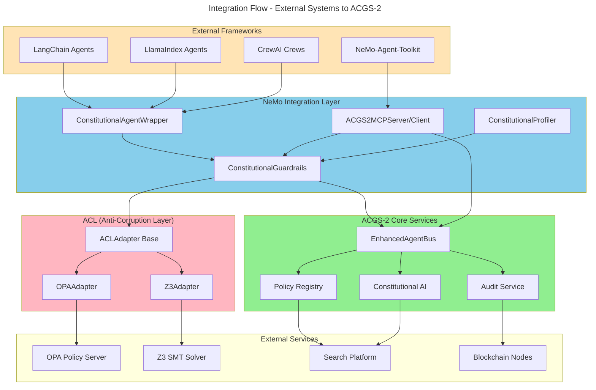

# C4 Code Level: External Integrations

## Overview

- **Name**: External Integrations Layer
- **Description**: Integration adapters and bridges connecting ACGS-2 constitutional governance with external systems, protocols, and frameworks including NeMo-Agent-Toolkit, OPA (Open Policy Agent), Z3 SMT solver, blockchain platforms, and enterprise search infrastructure.
- **Location**: `/home/dislove/document/acgs2/acgs2-core/integrations/` and `/home/dislove/document/acgs2/acgs2-core/enhanced_agent_bus/acl_adapters/` and `/home/dislove/document/acgs2/acgs2-core/services/`
- **Language**: Python 3.11+
- **Purpose**: Provide seamless integration between ACGS-2's constitutional AI governance framework and third-party platforms while maintaining constitutional hash validation (`cdd01ef066bc6cf2`) across all external communication boundaries.
- **Constitutional Hash**: `cdd01ef066bc6cf2`

## Code Elements

### NeMo-Agent-Toolkit Integration

#### Module: `integrations/nemo_agent_toolkit/`

**Purpose**: Deep integration with NVIDIA NeMo-Agent-Toolkit, providing constitutional guardrails for enterprise-grade AI agent deployment.

#### Classes and Functions

##### ConstitutionalGuardrails
- **Location**: `integrations/nemo_agent_toolkit/constitutional_guardrails.py:129-668`
- **Type**: Class
- **Methods**:
  - `__init__(config: GuardrailConfig | None = None, acgs2_client: Any | None = None) -> None`
    - Initialize with configuration and optional ACGS-2 SDK client
    - Sets up PII pattern compilation and Colang 2.0 flow initialization
  - `async check_input(content: str, context: dict[str, Any] | None = None) -> GuardrailResult`
    - Validate input content against constitutional principles (privacy, safety, ethics, compliance)
    - Detects PII, checks safety patterns, validates with NIM guardrails
    - Returns GuardrailResult with action (ALLOW/BLOCK/MODIFY/ESCALATE/AUDIT) and violations list
  - `async check_output(content: str, context: dict[str, Any] | None = None, reasoning: str | None = None) -> GuardrailResult`
    - Validate output content and optional LLM reasoning traces
    - Detects and redacts PII, checks for harmful content patterns
    - Validates reasoning for guardrail bypass attempts
  - `add_input_validator(validator: Callable[[str], GuardrailResult]) -> None`
    - Register custom input validation function
  - `add_output_validator(validator: Callable[[str], GuardrailResult]) -> None`
    - Register custom output validation function
  - `on_violation(violation_type: ViolationType, handler: Callable[[dict[str, Any]], None]) -> None`
    - Register handler for specific violation types (PRIVACY, SAFETY, ETHICS, COMPLIANCE, SECURITY, TRANSPARENCY, FAIRNESS, ACCOUNTABILITY)
  - `get_audit_log() -> list[dict[str, Any]]`
    - Retrieve complete audit trail of all guardrail checks
  - `async get_metrics() -> dict[str, Any]`
    - Get guardrail metrics including compliance rate, violation rate, input/output checks
- **Dependencies**:
  - `httpx` (async HTTP client for NIM communication)
  - `logging` module
  - Standard library: `re`, `hashlib`, `json`, `asyncio`, `dataclasses`, `enum`
- **Purpose**: Provides comprehensive input/output validation with PII detection, safety checking, and ACGS-2 compliance validation

##### GuardrailConfig (Dataclass)
- **Location**: `integrations/nemo_agent_toolkit/constitutional_guardrails.py:54-98`
- **Fields**:
  - `enabled: bool = True` - Enable/disable guardrails
  - `strict_mode: bool = False` - Fail-closed behavior
  - `max_retries: int = 3` - Retry count on transient failures
  - `timeout_seconds: float = 5.0` - Timeout for checks
  - `colang_version: str = "2.x"` - Support for Colang 2.x flows
  - `audit_all_requests: bool = True` - Enable audit logging
  - `block_on_violation: bool = True` - Block or audit-only mode
  - `escalation_threshold: float = 0.8` - Confidence threshold for escalation
  - `constitutional_hash: str = "cdd01ef066bc6cf2"` - Immutable governance marker
  - `privacy_protection: bool = True` - Enable privacy checks
  - `safety_checks: bool = True` - Enable safety pattern detection
  - `ethics_validation: bool = True` - Enable ethics validation
  - `compliance_enforcement: bool = True` - Enable ACGS-2 compliance
  - `pii_patterns: list[str]` - Custom PII regex patterns (SSN, credit card, email, phone)
  - `use_nim: bool = False` - Enable NVIDIA NIM guardrails
  - `nim_endpoint: str = "http://localhost:8000/v1"` - NIM microservice endpoint
  - `nim_model: str = "nvidia/nemotron-3-8b-steerlm"` - NIM model identifier
  - `monitor_reasoning: bool = True` - Validate LLM reasoning traces
  - `reasoning_validation_threshold: float = 0.9` - Confidence for reasoning validation
- **Methods**:
  - `validate() -> None` - Validate configuration constitutional hash

##### GuardrailResult (Dataclass)
- **Location**: `integrations/nemo_agent_toolkit/constitutional_guardrails.py:101-127`
- **Fields**:
  - `action: GuardrailAction` - Action taken (ALLOW/BLOCK/MODIFY/ESCALATE/AUDIT)
  - `allowed: bool` - Whether content is allowed
  - `violations: list[dict[str, Any]]` - List of detected violations
  - `modified_content: str | None` - Redacted/modified content if action is MODIFY
  - `reasoning: str` - Human-readable explanation
  - `confidence: float` - Confidence score (0.0-1.0)
  - `timestamp: datetime` - Check timestamp
  - `constitutional_hash: str = "cdd01ef066bc6cf2"` - Governance marker
  - `trace_id: str` - Audit trace identifier
- **Methods**:
  - `to_dict() -> dict[str, Any]` - Serialize to dictionary

##### GuardrailAction (Enum)
- **Location**: `integrations/nemo_agent_toolkit/constitutional_guardrails.py:30-37`
- **Values**: ALLOW, BLOCK, MODIFY, ESCALATE, AUDIT
- **Purpose**: Action types returned by guardrail checks

##### ViolationType (Enum)
- **Location**: `integrations/nemo_agent_toolkit/constitutional_guardrails.py:40-50`
- **Values**: PRIVACY, SAFETY, ETHICS, COMPLIANCE, SECURITY, TRANSPARENCY, FAIRNESS, ACCOUNTABILITY
- **Purpose**: Classification of constitutional violations

---

##### ConstitutionalAgentWrapper
- **Location**: `integrations/nemo_agent_toolkit/agent_wrapper.py:65-301`
- **Type**: Generic class `ConstitutionalAgentWrapper[AgentT]`
- **Methods**:
  - `__init__(agent: AgentT, guardrails: ConstitutionalGuardrails | None = None, config: WrapperConfig | None = None, acgs2_client: Any | None = None) -> None`
    - Wrap any agent type with constitutional guardrails
    - Initializes guardrails and execution history
  - `async run(input_data: str | dict[str, Any], context: dict[str, Any] | None = None) -> ExecutionResult[Any]`
    - Execute wrapped agent with input/output validation
    - Validates input, executes agent, validates output
    - Returns ExecutionResult with guardrail checks and execution metrics
  - `get_execution_history() -> list[dict[str, Any]]`
    - Retrieve audit trail of all executions
  - `async get_metrics() -> dict[str, Any]`
    - Get wrapper metrics (success rate, average latency, violation counts)
  - `@property agent -> AgentT` - Access wrapped agent
  - `@property guardrails -> ConstitutionalGuardrails` - Access guardrails instance
- **Purpose**: Generic wrapper supporting LangChain, LlamaIndex, CrewAI, and custom agents

##### WrapperConfig (Dataclass)
- **Location**: `integrations/nemo_agent_toolkit/agent_wrapper.py:37-48`
- **Fields**:
  - `validate_inputs: bool = True` - Enable input validation
  - `validate_outputs: bool = True` - Enable output validation
  - `audit_enabled: bool = True` - Enable execution audit
  - `block_on_input_violation: bool = True` - Block on input violation
  - `block_on_output_violation: bool = False` - Block on output violation
  - `redact_output_pii: bool = True` - Redact PII from output
  - `max_retries: int = 3` - Retry count
  - `timeout_seconds: float = 30.0` - Execution timeout
  - `constitutional_hash: str = "cdd01ef066bc6cf2"` - Governance marker

##### ExecutionResult (Generic Dataclass)
- **Location**: `integrations/nemo_agent_toolkit/agent_wrapper.py:52-62`
- **Type**: `ExecutionResult[T]`
- **Fields**:
  - `success: bool` - Execution success
  - `output: T | None` - Agent output
  - `error: str | None` - Error message if failed
  - `input_check: GuardrailResult | None` - Input validation result
  - `output_check: GuardrailResult | None` - Output validation result
  - `execution_time_ms: float` - Execution duration
  - `constitutional_hash: str = "cdd01ef066bc6cf2"` - Governance marker
  - `timestamp: datetime` - Execution timestamp

##### Helper Functions
- **Location**: `integrations/nemo_agent_toolkit/agent_wrapper.py:303-399`
- `wrap_langchain_agent(agent: Any, config: WrapperConfig | None = None, acgs2_client: Any | None = None) -> ConstitutionalAgentWrapper[Any]`
  - Wrap LangChain agents (chains, agent executors)
- `wrap_llamaindex_agent(agent: Any, config: WrapperConfig | None = None, acgs2_client: Any | None = None) -> ConstitutionalAgentWrapper[Any]`
  - Wrap LlamaIndex agents (query engines, ReActAgent)
- `wrap_crewai_agent(crew: Any, config: WrapperConfig | None = None, acgs2_client: Any | None = None) -> ConstitutionalAgentWrapper[Any]`
  - Wrap CrewAI crews with constitutional guardrails
- `constitutional_guardrail(guardrails: ConstitutionalGuardrails | None = None, validate_input: bool = True, validate_output: bool = True) -> Callable`
  - Decorator for adding constitutional guardrails to async functions

##### NeMoAgentIntegration
- **Location**: `integrations/nemo_agent_toolkit/agent_wrapper.py:459-528`
- **Type**: Class
- **Methods**:
  - `__init__(guardrails: ConstitutionalGuardrails | None = None, acgs2_client: Any | None = None) -> None`
    - Initialize NeMo integration hooks
  - `create_input_hook() -> Callable[[str], str]`
    - Create input hook for NeMo's agent pipeline
  - `create_output_hook() -> Callable[[str], str]`
    - Create output hook for NeMo's agent pipeline
  - `get_profiler_callback() -> Callable[[dict[str, Any]], None]`
    - Get callback for NeMo's profiler integration
- **Purpose**: Direct hooks into NeMo-Agent-Toolkit's agent optimization pipeline

---

##### ACGS2MCPServer
- **Location**: `integrations/nemo_agent_toolkit/mcp_bridge.py:80-560`
- **Type**: Class
- **Methods**:
  - `__init__(acgs2_client: Any | None = None, enable_audit: bool = True) -> None`
    - Initialize MCP server with ACGS-2 backend client
  - `register_tool(tool: ConstitutionalMCPTool) -> None`
    - Register an MCP tool for NeMo agents to access
  - `get_tool_definitions() -> list[dict[str, Any]]`
    - Get all registered tool definitions for MCP protocol
  - `async call_tool(name: str, arguments: dict[str, Any]) -> MCPToolResult`
    - Call an MCP tool with audit logging
  - `get_audit_log() -> list[dict[str, Any]]`
    - Retrieve tool call audit trail
  - `async _handle_validate_constitutional(agent_id: str, action: str, context: dict[str, Any] | None = None) -> dict[str, Any]`
    - Validate actions against constitutional principles
  - `async _handle_check_compliance(context: dict[str, Any], policy_id: str | None = None) -> dict[str, Any]`
    - Check compliance with active policies
  - `async _handle_audit_action(action: str, actor: str, resource: str, outcome: str, details: dict[str, Any] | None = None) -> dict[str, Any]`
    - Record governance decisions in audit trail
  - `async _handle_get_policies(tags: list[str] | None = None, status: str | None = None) -> dict[str, Any]`
    - Retrieve active policies with optional filtering
  - `async _handle_submit_approval(request_type: str, payload: dict[str, Any], risk_score: float | None = None) -> dict[str, Any]`
    - Submit approval requests for governance review
  - `async _handle_check_governance(include_metrics: bool = False) -> dict[str, Any]`
    - Check governance status and optional metrics
- **Registered Tools**:
  - `acgs2_validate_constitutional` - Constitutional validation
  - `acgs2_check_compliance` - Policy compliance checking
  - `acgs2_audit_action` - Audit trail recording
  - `acgs2_get_policies` - Policy retrieval
  - `acgs2_submit_approval` - Approval request submission
  - `acgs2_check_governance` - Governance status checking
- **Purpose**: Model Context Protocol (MCP) server exposing ACGS-2 governance tools to NeMo agents

##### ACGS2MCPClient
- **Location**: `integrations/nemo_agent_toolkit/mcp_bridge.py:563-695`
- **Type**: Class
- **Methods**:
  - `__init__(server_url: str, api_key: str | None = None) -> None`
    - Initialize MCP client for ACGS-2 remote server
  - `async connect() -> None`
    - Establish connection to MCP server
  - `async disconnect() -> None`
    - Close connection to MCP server
  - `async list_tools() -> list[dict[str, Any]]`
    - List available tools from server
  - `async call_tool(name: str, arguments: dict[str, Any]) -> MCPToolResult`
    - Call a tool on remote server
  - `async validate_constitutional(agent_id: str, action: str, context: dict[str, Any] | None = None) -> dict[str, Any]`
    - Convenience method for constitutional validation
  - `async check_compliance(context: dict[str, Any], policy_id: str | None = None) -> dict[str, Any]`
    - Convenience method for compliance checking
  - `async audit_action(action: str, actor: str, resource: str, outcome: str, details: dict[str, Any] | None = None) -> dict[str, Any]`
    - Convenience method for audit recording
  - `async __aenter__() -> ACGS2MCPClient` / `async __aexit__(...) -> None`
    - Async context manager support
- **Purpose**: MCP client for connecting to remote ACGS-2 services

##### MCPToolDefinition (Dataclass)
- **Location**: `integrations/nemo_agent_toolkit/mcp_bridge.py:40-46`
- **Fields**:
  - `name: str` - Tool name
  - `description: str` - Tool description
  - `input_schema: dict[str, Any]` - JSON schema for inputs
  - `constitutional_required: bool = True` - Require constitutional hash validation

##### MCPToolResult (Dataclass)
- **Location**: `integrations/nemo_agent_toolkit/mcp_bridge.py:50-68`
- **Fields**:
  - `success: bool` - Tool execution success
  - `data: Any` - Tool result data
  - `error: str | None` - Error message if failed
  - `constitutional_hash: str = "cdd01ef066bc6cf2"` - Governance marker
  - `timestamp: datetime` - Execution timestamp
- **Methods**:
  - `to_dict() -> dict[str, Any]` - Serialize to dictionary

---

##### ConstitutionalProfiler
- **Location**: `integrations/nemo_agent_toolkit/profiler.py:26+`
- **Type**: Class
- **Purpose**: Collect governance metrics for AI agent performance monitoring
- **Key Methods**:
  - `collect_metrics() -> GovernanceMetrics` - Gather all governance metrics
  - `record_check(metric_type: MetricType, value: float) -> None` - Record individual metric
  - `get_compliance_rate() -> float` - Calculate compliance percentage
  - `get_latency_percentiles() -> dict[str, float]` - Get P50, P95, P99 latencies

##### GovernanceMetrics (Dataclass)
- **Location**: `integrations/nemo_agent_toolkit/profiler.py:42-98`
- **Fields** (Compliance):
  - `total_requests: int` - Total requests processed
  - `compliant_requests: int` - Requests passing compliance
  - `blocked_requests: int` - Requests blocked
  - `modified_requests: int` - Requests with output modification
- **Fields** (Violations):
  - `privacy_violations: int`, `safety_violations: int`, `ethics_violations: int`, `compliance_violations: int`
- **Fields** (Guardrails):
  - `input_checks: int`, `output_checks: int`, `input_blocks: int`, `output_blocks: int`, `pii_redactions: int`
- **Fields** (Performance):
  - `average_check_latency_ms: float`
  - `p50_check_latency_ms: float`
  - `p95_check_latency_ms: float`
  - `p99_check_latency_ms: float`
- **Fields** (Constitutional):
  - `constitutional_hash: str = "cdd01ef066bc6cf2"`
  - `collection_start: datetime`, `collection_end: datetime | None`
- **Properties**:
  - `compliance_rate: float` - Calculated from compliant/total requests
  - `violation_rate: float` - Calculated violations per request

---

### ACL (Anti-Corruption Layer) Adapters

#### Module: `enhanced_agent_bus/acl_adapters/`

**Purpose**: Provide abstraction layer for integrating external systems (OPA, Z3, others) with fault tolerance, caching, and timeout handling.

#### Classes and Functions

##### ACLAdapter (Base Class)
- **Location**: `enhanced_agent_bus/acl_adapters/base.py:150+`
- **Type**: Abstract base class
- **Generic Parameters**: `ACLAdapter[T, R]` where T=request type, R=response type
- **Abstract Methods**:
  - `async execute(request: T) -> AdapterResult[R]` - Execute adapter operation
- **Methods**:
  - `__init__(config: AdapterConfig) -> None` - Initialize with configuration
  - `async call(request: T) -> AdapterResult[R]` - Execute with retry logic
  - `_should_retry(failure_count: int, error: Exception) -> bool` - Determine if retry is appropriate
  - `_apply_timeout(coro: Coroutine) -> Coroutine` - Apply timeout wrapper
  - `_record_latency(duration_ms: float) -> None` - Record performance metrics
  - `get_metrics() -> dict[str, Any]` - Get adapter metrics (success rate, latency, circuit state)
  - `reset() -> None` - Reset adapter state
- **Purpose**: Base class for all external system adapters with built-in patterns

##### AdapterConfig (Dataclass)
- **Location**: `enhanced_agent_bus/acl_adapters/base.py:100-148`
- **Fields**:
  - `adapter_name: str` - Name of adapter
  - `timeout_ms: int = 5000` - Operation timeout
  - `max_retries: int = 3` - Maximum retry attempts
  - `circuit_failure_threshold: int = 5` - Failures before circuit opens
  - `circuit_recovery_timeout_s: float = 30.0` - Time to attempt recovery
  - `rate_limit_per_second: float = 100.0` - Rate limit
  - `cache_enabled: bool = True` - Enable response caching
  - `cache_ttl_s: int = 300` - Cache time-to-live
  - `constitutional_hash: str = "cdd01ef066bc6cf2"` - Governance marker
- **Methods**:
  - `validate() -> None` - Validate configuration

##### AdapterResult (Generic Dataclass)
- **Location**: `enhanced_agent_bus/acl_adapters/base.py:200+`
- **Type**: `AdapterResult[R]`
- **Fields**:
  - `success: bool` - Operation success
  - `data: R | None` - Response data
  - `error: str | None` - Error message if failed
  - `latency_ms: float` - Operation latency
  - `cached: bool` - Whether result from cache
  - `constitutional_hash: str = "cdd01ef066bc6cf2"` - Governance marker
  - `timestamp: datetime` - Operation timestamp

##### AdapterState (Enum)
- **Location**: `enhanced_agent_bus/acl_adapters/base.py:30-35`
- **Values**: CLOSED, OPEN, HALF_OPEN
- **Purpose**: Circuit breaker state tracking

##### AdapterTimeoutError, AdapterCircuitOpenError, RateLimitExceededError
- **Location**: `enhanced_agent_bus/acl_adapters/base.py:38-97`
- **Purpose**: Typed exceptions for adapter failures
- **Methods**: `to_dict()` - Serialize error information

---

##### Z3Adapter
- **Location**: `enhanced_agent_bus/acl_adapters/z3_adapter.py:80+`
- **Type**: Subclass of `ACLAdapter[Z3Request, Z3Response]`
- **Methods**:
  - `async execute(request: Z3Request) -> AdapterResult[Z3Response]`
    - Execute SMT-LIB2 formula through Z3 solver
    - Returns satisfiability result (sat/unsat/unknown) with optional model/proof
  - `async _evaluate_z3(formula: str, timeout_ms: int) -> dict[str, Any]`
    - Internal Z3 solver invocation
  - `_parse_z3_output(output: str) -> Z3Response`
    - Parse Z3 output to Z3Response
- **Purpose**: Formal verification of constitutional constraints through SMT solving

##### Z3AdapterConfig (Dataclass)
- **Location**: `enhanced_agent_bus/acl_adapters/z3_adapter.py:25-42`
- **Fields** (Z3-specific):
  - `z3_timeout_ms: int = 30000` - Z3 solver timeout
  - `memory_limit_mb: int = 1024` - Memory limit
  - `proof_enabled: bool = True` - Enable proof generation
  - `model_enabled: bool = True` - Enable model generation
- **Fields** (Cache):
  - `cache_enabled: bool = True`
  - `cache_ttl_s: int = 3600` - 1 hour (proofs are deterministic)
- **Fields** (Override base):
  - `timeout_ms: int = 35000` - Slightly longer than Z3 timeout
  - `max_retries: int = 1` - Deterministic, no retry value

##### Z3Request (Dataclass)
- **Location**: `enhanced_agent_bus/acl_adapters/z3_adapter.py:45-68`
- **Fields**:
  - `formula: str` - SMT-LIB2 formula
  - `assertions: list[str]` - Specific assertions to check
  - `timeout_ms: Optional[int]` - Override timeout
  - `get_model: bool = True` - Request model if satisfiable
  - `get_proof: bool = False` - Request proof if unsatisfiable
  - `get_unsat_core: bool = False` - Request unsat core
  - `trace_id: Optional[str]` - Audit trace identifier

##### Z3Response (Dataclass)
- **Location**: `enhanced_agent_bus/acl_adapters/z3_adapter.py:71+`
- **Fields**:
  - `result: str` - Satisfiability (sat/unsat/unknown)
  - `model: Optional[dict[str, Any]]` - Model if sat
  - `proof: Optional[str]` - Proof if unsat
  - `unsat_core: Optional[list[str]]` - Core if unsat
  - `execution_time_ms: float` - Solver execution time

---

##### OPAAdapter
- **Location**: `enhanced_agent_bus/acl_adapters/opa_adapter.py:80+`
- **Type**: Subclass of `ACLAdapter[OPARequest, OPAResponse]`
- **Methods**:
  - `async execute(request: OPARequest) -> AdapterResult[OPAResponse]`
    - Execute policy evaluation through OPA
    - Supports fail-closed mode for security
  - `async _evaluate_opa(input_data: dict, policy_path: str) -> dict[str, Any]`
    - Internal OPA policy evaluation
  - `_parse_opa_output(output: dict) -> OPAResponse`
    - Parse OPA response to OPAResponse
- **Purpose**: Policy enforcement through Open Policy Agent (Rego language)

##### OPAAdapterConfig (Dataclass)
- **Location**: `enhanced_agent_bus/acl_adapters/opa_adapter.py:26-47`
- **Fields** (OPA-specific):
  - `opa_url: str = "http://localhost:8181"` - OPA server endpoint
  - `opa_bundle_path: str = "/v1/data"` - Bundle API path
  - `fail_closed: bool = True` - Deny on failure (security-first)
  - `default_policy_path: str = "acgs2/constitutional"` - Default policy
- **Fields** (Cache):
  - `cache_enabled: bool = True`
  - `cache_ttl_s: int = 60` - 1 minute (policies may change)
- **Fields** (Override base):
  - `timeout_ms: int = 1000` - 1 second for fast policy checks
  - `max_retries: int = 2`
  - `circuit_failure_threshold: int = 3` - Fast circuit opening

##### OPARequest (Dataclass)
- **Location**: `enhanced_agent_bus/acl_adapters/opa_adapter.py:50-74`
- **Fields**:
  - `input: dict[str, Any]` - Input data for policy
  - `policy_path: Optional[str]` - Specific policy path (overrides default)
  - `explain: bool = False` - Request explanation
  - `pretty: bool = False` - Pretty print output
  - `metrics: bool = True` - Include metrics
  - `trace_id: Optional[str]` - Audit trace identifier

##### OPAResponse (Dataclass)
- **Location**: `enhanced_agent_bus/acl_adapters/opa_adapter.py:77+`
- **Fields**:
  - `decision: bool` - Policy decision (allow/deny)
  - `reason: Optional[str]` - Decision reasoning
  - `metrics: Optional[dict[str, Any]]` - OPA metrics
  - `evaluation_time_ms: float` - Evaluation duration

---

### Blockchain Integration

#### Module: `services/audit_service/blockchain/`

**Purpose**: Anchor governance decisions and audit trails to blockchain for immutability and transparency.

##### ArweaveClient
- **Location**: `services/audit_service/blockchain/arweave/arweave_client.py:22+`
- **Type**: Class
- **Methods**:
  - `__init__(config: Dict[str, Any]) -> None`
    - Initialize Arweave client with configuration
    - Expected config keys: `wallet_file`, `host` (default: arweave.net), `port`, `protocol`
  - `connect() -> bool`
    - Connect to Arweave network
    - Returns connection success
  - `async post_transaction(data: Dict[str, Any], tags: Optional[List[Dict[str, str]]] = None) -> Dict[str, Any]`
    - Post audit data to Arweave blockchain
    - Returns transaction ID and confirmation
  - `async query_transaction(tx_id: str) -> Optional[Dict[str, Any]]`
    - Query transaction by ID
  - `get_balance() -> float`
    - Get wallet balance (AR tokens)
  - `get_network_info() -> Dict[str, Any]`
    - Get Arweave network information
- **Purpose**: Permanent decentralized storage for audit trails with one-time payment model

##### EthereumL2Client
- **Location**: `services/audit_service/blockchain/ethereum_l2/ethereum_client.py:22+`
- **Type**: Class
- **Methods**:
  - `__init__(config: Dict[str, Any]) -> None`
    - Initialize Ethereum L2 client (Arbitrum/Optimism)
    - Expected config keys: `provider_url`, `contract_address`, `private_key`
  - `connect() -> bool`
    - Connect to Ethereum L2 network
  - `async submit_audit_hash(audit_hash: str, metadata: Dict[str, Any]) -> Dict[str, Any]`
    - Submit audit hash to blockchain smart contract
    - Returns transaction hash
  - `async verify_audit_hash(audit_hash: str) -> bool`
    - Verify audit hash existence on blockchain
  - `get_transaction_status(tx_hash: str) -> str`
    - Get transaction confirmation status
- **Purpose**: Cost-efficient blockchain anchoring using Ethereum Layer 2 solutions

##### HyperledgerFabricClient
- **Location**: `services/audit_service/blockchain/hyperledger_fabric/fabric_client.py:22+`
- **Type**: Class
- **Methods**:
  - `__init__(config: Dict[str, Any]) -> None`
    - Initialize Hyperledger Fabric client for enterprise deployments
    - Expected config keys: `channel_name`, `chaincode_id`, `peer_addresses`, `ca_address`
  - `connect() -> bool`
    - Connect to Fabric network
  - `async submit_audit_record(record: Dict[str, Any], chaincode_function: str = "submitAudit") -> Dict[str, Any]`
    - Submit audit record to Fabric chaincode
    - Returns transaction ID
  - `async query_audit_record(audit_id: str) -> Optional[Dict[str, Any]]`
    - Query audit record from blockchain ledger
  - `get_channel_info() -> Dict[str, Any]`
    - Get channel configuration and status
- **Purpose**: Enterprise-grade permissioned blockchain for regulated industries

---

### Search Platform Integration

#### Module: `services/integration/search_platform/`

**Purpose**: High-performance code search, constitutional compliance searching, and audit trail searching.

##### SearchPlatformClient
- **Location**: `services/integration/search_platform/client.py:150+`
- **Type**: Class with async context manager support
- **Methods**:
  - `__init__(config: SearchPlatformConfig) -> None`
    - Initialize search client with connection pooling and circuit breaker
  - `async connect() -> None`
    - Establish connection to search platform
  - `async disconnect() -> None`
    - Close connection
  - `async search(request: SearchRequest) -> SearchResponse`
    - Execute search with retry and timeout handling
    - Supports multiple search domains (code, audit logs, policies)
  - `async bulk_search(requests: List[SearchRequest]) -> List[SearchResponse]`
    - Execute multiple searches in parallel
  - `async __aenter__() -> SearchPlatformClient` / `async __aexit__(...)`
    - Async context manager
- **Purpose**: Client library for search platform integration with fault tolerance

##### SearchPlatformConfig (Dataclass)
- **Location**: `services/integration/search_platform/client.py:43+`
- **Fields**:
  - `base_url: str` - Search platform endpoint
  - `api_key: str` - Authentication key
  - `timeout_seconds: float = 30.0` - Request timeout
  - `max_retries: int = 3` - Retry attempts
  - `connection_pool_size: int = 10` - Connection pooling
  - `circuit_breaker_threshold: int = 5` - Circuit breaker threshold
  - `circuit_breaker_timeout: float = 30.0` - Circuit recovery time

##### SearchRequest (Dataclass)
- **Location**: `services/integration/search_platform/models.py:50+`
- **Fields**:
  - `query: str` - Search query/pattern
  - `domain: SearchDomain` - Search domain (CODE, AUDIT, POLICIES, ALL)
  - `scope: SearchScope` - Search scope (FILES, FUNCTIONS, CLASSES, MODULES)
  - `options: SearchOptions` - Search options (filters, limits, sorting)
  - `trace_id: Optional[str]` - Audit trace identifier

##### SearchResponse (Dataclass)
- **Location**: `services/integration/search_platform/models.py:80+`
- **Fields**:
  - `matches: List[SearchMatch]` - List of matching results
  - `total_count: int` - Total matches found
  - `execution_time_ms: float` - Search duration
  - `stats: SearchStats` - Search statistics
  - `trace_id: Optional[str]` - Audit trace identifier

##### SearchMatch (Dataclass)
- **Location**: `services/integration/search_platform/models.py:100+`
- **Fields**:
  - `file_path: str` - File containing match
  - `line_number: int` - Line number
  - `context: str` - Surrounding context
  - `match_type: str` - Type of match
  - `relevance_score: float` - Relevance (0.0-1.0)

##### ConstitutionalCodeSearchService
- **Location**: `services/integration/search_platform/constitutional_search.py:50+`
- **Type**: Class
- **Methods**:
  - `async search_constitutional_violations(patterns: List[str]) -> List[SearchMatch]`
    - Search for potential constitutional violations in code
  - `async search_by_principle(principle: str, keywords: List[str]) -> List[SearchMatch]`
    - Search code by constitutional principle
  - `async analyze_governance_impact(change: str) -> Dict[str, Any]`
    - Analyze governance impact of code changes
- **Purpose**: Specialized search for constitutional compliance validation

##### AuditTrailSearchService
- **Location**: `services/integration/search_platform/audit_search.py:50+`
- **Type**: Class
- **Methods**:
  - `async search_audit_trail(filters: Dict[str, Any]) -> List[Dict[str, Any]]`
    - Search audit trail with filters (date, actor, action, outcome)
  - `async trace_governance_decision(decision_id: str) -> Dict[str, Any]`
    - Trace decision from proposal through approval
  - `async get_compliance_report(start_date: str, end_date: str) -> Dict[str, Any]`
    - Generate compliance report for date range
- **Purpose**: Audit trail search and compliance reporting

---

## Dependencies

### Internal Dependencies

**Enhanced Agent Bus Core**:
- `enhanced_agent_bus.core.EnhancedAgentBus` - Core message bus
- `enhanced_agent_bus.models.MessageType`, `Priority`, `AgentMessage` - Message types
- `enhanced_agent_bus.exceptions` - Exception hierarchy
- `enhanced_agent_bus.validators.validate_constitutional_hash` - Constitution validation
- `enhanced_agent_bus.opa_client.OPAClient` - OPA base client

**Shared Services**:
- `shared.constants.CONSTITUTIONAL_HASH` - Constitutional governance marker
- `shared.metrics` - Prometheus metrics integration
- `shared.circuit_breaker.CircuitBreaker` - Circuit breaker pattern

**Services**:
- `services.policy_registry` - Policy storage and retrieval
- `services.audit_service` - Audit logging and compliance
- `services.constitutional_ai` - Core constitutional validation

### External Dependencies

**NeMo Integration**:
- `nemo-agent-toolkit` - NVIDIA NeMo Agent Toolkit
- `langchain` - LangChain agent framework (optional)
- `llama-index` - LlamaIndex agent framework (optional)
- `crewai` - CrewAI agent framework (optional)
- `httpx` - Async HTTP client for NIM communication
- `colang` - NVIDIA Colang 2.x for guardrail flows

**ACL Adapters**:
- `z3-solver` - Z3 SMT solver for formal verification
- `requests` / `httpx` - HTTP communication with OPA
- `aiohttp` - Async HTTP for search platform

**Blockchain**:
- `arweave-python-client` - Arweave blockchain client (optional)
- `web3.py` - Ethereum Web3 client (optional)
- `fabric-sdk-py` - Hyperledger Fabric SDK (optional)

**Search Platform**:
- `aiohttp` - Async HTTP communication
- `elasticsearch` / custom search backend - Search infrastructure

**Standard Library**:
- `asyncio` - Async/await runtime
- `logging` - Structured logging
- `dataclasses` - Type hints and data structures
- `datetime` - Timezone-aware datetime handling
- `enum` - Enumeration types
- `json` - JSON serialization
- `hashlib` - Cryptographic hashing
- `re` - Regular expression patterns
- `typing` - Type hints and generics

---

## Relationships

### Object-Oriented Code Diagram: Integration Architecture

```mermaid
---
title: Code Diagram - External Integrations Architecture
---
classDiagram
    namespace NeMoIntegration {
        class ConstitutionalGuardrails {
            -config: GuardrailConfig
            -client: ACGS2Client
            -audit_log: list
            -compiled_patterns: list
            +check_input(content) GuardrailResult
            +check_output(content, reasoning) GuardrailResult
            +get_audit_log() list
            +get_metrics() dict
        }

        class GuardrailConfig {
            +enabled: bool
            +strict_mode: bool
            +timeout_seconds: float
            +constitutional_hash: str
            +pii_patterns: list
            +use_nim: bool
            +validate() void
        }

        class GuardrailResult {
            +action: GuardrailAction
            +allowed: bool
            +violations: list
            +modified_content: str
            +confidence: float
            +trace_id: str
            +to_dict() dict
        }

        class ConstitutionalAgentWrapper {
            -agent: AgentT
            -guardrails: ConstitutionalGuardrails
            -config: WrapperConfig
            -execution_history: list
            +run(input_data, context) ExecutionResult
            +get_metrics() dict
        }

        class ACGS2MCPServer {
            -client: ACGS2Client
            -tools: dict
            -audit_log: list
            +register_tool(tool) void
            +call_tool(name, arguments) MCPToolResult
            +get_audit_log() list
        }

        class ACGS2MCPClient {
            -server_url: str
            -connected: bool
            +connect() void
            +call_tool(name, arguments) MCPToolResult
            +validate_constitutional(agent_id, action) dict
        }

        class ConstitutionalProfiler {
            -metrics: dict
            +collect_metrics() GovernanceMetrics
            +get_compliance_rate() float
            +record_check(metric_type, value) void
        }
    }

    namespace ACLAdapters {
        class ACLAdapter {
            <<abstract>>
            #config: AdapterConfig
            #circuit_breaker: CircuitBreaker
            #cache: dict
            +call(request) AdapterResult
            +get_metrics() dict
            #execute(request)* AdapterResult
        }

        class Z3Adapter {
            -z3_timeout_ms: int
            -proof_enabled: bool
            +execute(request: Z3Request) AdapterResult
        }

        class OPAAdapter {
            -opa_url: str
            -fail_closed: bool
            +execute(request: OPARequest) AdapterResult
        }

        class AdapterConfig {
            +adapter_name: str
            +timeout_ms: int
            +max_retries: int
            +cache_enabled: bool
            +constitutional_hash: str
            +validate() void
        }

        class AdapterResult {
            +success: bool
            +data: R
            +error: str
            +latency_ms: float
            +cached: bool
            +constitutional_hash: str
        }
    }

    namespace BlockchainIntegration {
        class ArweaveClient {
            -config: dict
            +connect() bool
            +post_transaction(data, tags) dict
            +query_transaction(tx_id) dict
            +get_balance() float
        }

        class EthereumL2Client {
            -contract_address: str
            -provider_url: str
            +connect() bool
            +submit_audit_hash(hash, metadata) dict
            +verify_audit_hash(hash) bool
        }

        class HyperledgerFabricClient {
            -channel_name: str
            -chaincode_id: str
            +connect() bool
            +submit_audit_record(record) dict
            +query_audit_record(id) dict
        }
    }

    namespace SearchIntegration {
        class SearchPlatformClient {
            -config: SearchPlatformConfig
            -circuit_breaker: CircuitBreaker
            +search(request) SearchResponse
            +bulk_search(requests) list
            +connect() void
            +disconnect() void
        }

        class SearchRequest {
            +query: str
            +domain: SearchDomain
            +scope: SearchScope
            +options: SearchOptions
        }

        class SearchResponse {
            +matches: list
            +total_count: int
            +execution_time_ms: float
            +stats: SearchStats
        }

        class ConstitutionalCodeSearchService {
            +search_constitutional_violations(patterns) list
            +analyze_governance_impact(change) dict
        }

        class AuditTrailSearchService {
            +search_audit_trail(filters) list
            +get_compliance_report(start, end) dict
        }
    }

    ConstitutionalGuardrails --> GuardrailConfig: uses
    ConstitutionalGuardrails --> GuardrailResult: returns
    ConstitutionalAgentWrapper --> ConstitutionalGuardrails: uses
    ConstitutionalAgentWrapper --> ExecutionResult: returns
    ACGS2MCPServer --> MCPToolResult: returns
    ACGS2MCPClient --> ACGS2MCPServer: connects to
    ConstitutionalProfiler --> GovernanceMetrics: collects

    ACLAdapter --> AdapterConfig: uses
    ACLAdapter --> AdapterResult: returns
    Z3Adapter --|> ACLAdapter: extends
    OPAAdapter --|> ACLAdapter: extends

    SearchPlatformClient --> SearchRequest: processes
    SearchPlatformClient --> SearchResponse: returns
    ConstitutionalCodeSearchService --> SearchPlatformClient: uses
    AuditTrailSearchService --> SearchPlatformClient: uses

    ConstitutionalGuardrails ..> "shared.constants": CONSTITUTIONAL_HASH
    ACLAdapter ..> "shared.circuit_breaker": CircuitBreaker
    SearchPlatformClient ..> "shared.constants": CONSTITUTIONAL_HASH
```

### Integration Points with ACGS-2 Core



---

## External System Connections

### NVIDIA NeMo Integration
- **Type**: Framework Integration
- **Connection**: Async HTTP (NIM guardrails endpoint)
- **Default Endpoint**: `http://localhost:8000/v1`
- **Models**: `nvidia/nemotron-3-8b-steerlm`, custom NIM models
- **Communication**: RESTful API with JSON payloads
- **Features**: Content safety checking, jailbreak detection

### Open Policy Agent (OPA)
- **Type**: Policy Evaluation Engine
- **Connection**: HTTP/HTTPS to OPA server
- **Default Endpoint**: `http://localhost:8181`
- **Policy Path**: `/v1/data/acgs2/constitutional`
- **Language**: Rego policy language
- **Fail Mode**: Fail-closed (deny on connection failure)
- **Features**: Real-time policy evaluation with caching

### Z3 SMT Solver
- **Type**: Formal Verification Engine
- **Connection**: Local process or remote service
- **Timeout**: 30-35 seconds (configurable)
- **Memory Limit**: 1024 MB (configurable)
- **Features**: Constraint solving, proof generation, model generation

### Search Platform
- **Type**: High-Performance Search Backend
- **Connection**: HTTP/HTTPS with circuit breaker
- **Features**: Code search, audit trail search, compliance reporting
- **Supported Domains**: CODE, AUDIT, POLICIES, GOVERNANCE

### Blockchain Networks

#### Arweave
- **Type**: Permanent Decentralized Storage
- **Network**: Arweave mainnet
- **Cost Model**: One-time payment for permanent storage
- **Use Case**: Long-term immutable audit trail storage
- **Connection**: HTTPS to arweave.net

#### Ethereum L2 (Arbitrum/Optimism)
- **Type**: Cost-Efficient Smart Contract Platform
- **Networks**: Arbitrum One, Optimism, Base
- **Cost**: Significantly lower than Ethereum mainnet
- **Use Case**: Fast, affordable audit hash anchoring
- **Connection**: RPC endpoint to L2 node

#### Hyperledger Fabric
- **Type**: Permissioned Blockchain
- **Architecture**: Channel-based with multiple peer nodes
- **Use Case**: Enterprise governance audit trails
- **Connection**: gRPC to Fabric peer nodes

---

## Notes

### Constitutional Hash Integration
All integration points embed the constitutional hash (`cdd01ef066bc6cf2`) to ensure governance validation at external system boundaries:
- **Guardrails**: Every check result includes constitutional hash
- **ACL Adapters**: All requests/responses validated
- **Blockchain**: Audit records anchored with constitutional commitment
- **Search**: Constitutional searches filter by governance status

### Error Handling Strategy
- **Fail-Closed Security**: OPA integration denies by default on connection failure
- **Graceful Degradation**: Non-critical integrations fall back to local validation
- **Circuit Breaker Pattern**: Automatic recovery from transient failures
- **Audit Logging**: All integration failures logged for compliance

### Performance Characteristics
- **NeMo Guardrails**: <100ms check latency (PII detection, pattern matching)
- **OPA Policy Evaluation**: <1s (configurable, typically 100-500ms)
- **Z3 Solver**: <35s timeout (for complex constraint problems)
- **Search Queries**: <30s timeout (depends on query complexity)
- **Blockchain Transactions**: Variable (Arweave: minutes, L2: seconds, Fabric: seconds)

### Security Considerations
- **PII Protection**: 15+ pattern detection (SSN, credit card, email, phone, custom)
- **Reasoning Trace Validation**: Detects attempts to bypass guardrails
- **Constitutional Validation**: Every external call validated against hash
- **Audit Trail Immutability**: Blockchain anchoring prevents tampering
- **Access Control**: OPA policies enforce role-based authorization

### Extensibility
All integration components follow the Anti-Corruption Layer (ACL) pattern, allowing:
- New adapter implementations (subclass `ACLAdapter`)
- Custom validation rules (guardrail handlers)
- Additional blockchain networks (extend base blockchain client)
- Search domain expansion (SearchService subclasses)
- Profiler extensions (custom metric collection)
