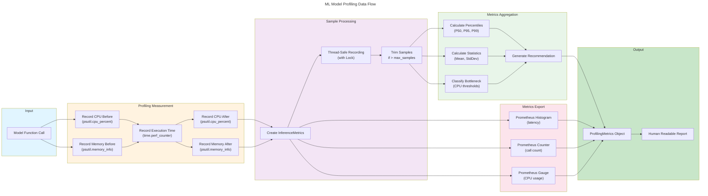
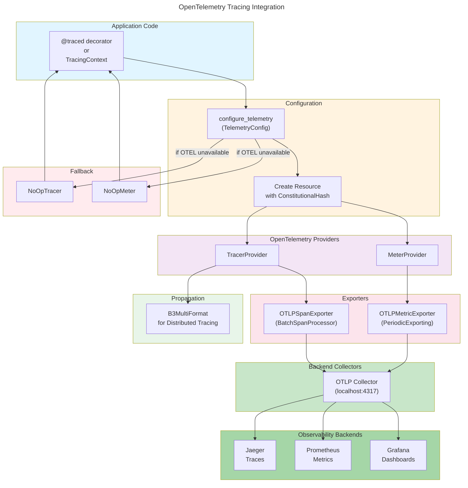

# C4 Code Level: Observability & Profiling Infrastructure

## Overview

- **Name**: ACGS-2 Observability & Profiling Infrastructure
- **Description**: Comprehensive observability, profiling, and metrics collection infrastructure for ML model inference evaluation, performance monitoring, and GPU acceleration decision-making
- **Location**: `/home/dislove/document/acgs2/acgs2-core/enhanced_agent_bus/` and `/home/dislove/document/acgs2/acgs2-core/shared/`
- **Language**: Python 3.11+
- **Purpose**: Enable real-time observability of constitutional AI governance operations, profile ML model performance characteristics, identify GPU acceleration opportunities, and collect metrics for distributed tracing and monitoring

## Constitutional Hash

**Constitutional Hash**: `cdd01ef066bc6cf2`

All observability code validates and includes the constitutional hash in all telemetry, logs, and metrics to ensure governance integrity across monitoring and profiling operations.

## Architecture Overview

The observability and profiling infrastructure consists of three primary layers:

### 1. Profiling Layer (GPU Acceleration Evaluation)
- **Purpose**: Profile ML model inference to determine compute characteristics and GPU acceleration ROI
- **Core Components**: `ModelProfiler`, `InferenceMetrics`, `ProfilingMetrics`, `BottleneckType`
- **Key File**: `enhanced_agent_bus/profiling/model_profiler.py`

### 2. Observability Layer (OpenTelemetry Integration)
- **Purpose**: Provide distributed tracing, metrics collection, and constitutional compliance tracking
- **Core Components**: `TelemetryConfig`, `TracingContext`, `MetricsRegistry`
- **Key Files**: `enhanced_agent_bus/observability/telemetry.py`, `enhanced_agent_bus/observability/decorators.py`

### 3. Metrics Layer (Prometheus Integration)
- **Purpose**: Standardized metrics collection and service monitoring
- **Core Components**: HTTP request metrics, constitutional compliance metrics, message bus metrics
- **Key File**: `shared/metrics/__init__.py`

### 4. Timeout Management Layer
- **Purpose**: Track and enforce timeout budgets across architectural layers
- **Core Components**: `TimeoutBudgetManager`, `LayerTimeoutBudget`, `Layer`
- **Key File**: `enhanced_agent_bus/observability/timeout_budget.py`

---

## Code Elements

### Profiling Module

#### Classes

##### `BottleneckType` (Enum)
- **File**: `enhanced_agent_bus/profiling/model_profiler.py:42-48`
- **Signature**: `class BottleneckType(Enum)`
- **Purpose**: Classification of model performance bottleneck types
- **Members**:
  - `COMPUTE_BOUND = "compute_bound"` - High CPU usage, benefits from GPU
  - `IO_BOUND = "io_bound"` - Low CPU usage, GPU won't help
  - `MEMORY_BOUND = "memory_bound"` - Memory transfer limited
  - `UNKNOWN = "unknown"` - Requires more analysis
- **Usage**: Used by `ModelProfiler` to classify whether GPU acceleration would benefit a model

##### `InferenceMetrics` (Dataclass)
- **File**: `enhanced_agent_bus/profiling/model_profiler.py:50-67`
- **Signature**: `@dataclass class InferenceMetrics`
- **Purpose**: Store metrics for a single inference call
- **Fields**:
  - `model_name: str` - Name of the model being profiled
  - `execution_time_ms: float` - Model execution time in milliseconds
  - `cpu_percent_before: float` - CPU percentage before inference
  - `cpu_percent_during: float` - CPU percentage during inference
  - `memory_mb_before: float` - Memory usage in MB before inference
  - `memory_mb_after: float` - Memory usage in MB after inference
  - `timestamp: datetime` - Timestamp of the measurement
- **Properties**:
  - `memory_delta_mb: float` - Memory change during inference (after - before)
  - `cpu_delta: float` - CPU change during inference (during - before)

##### `ProfilingMetrics` (Dataclass)
- **File**: `enhanced_agent_bus/profiling/model_profiler.py:70-110`
- **Signature**: `@dataclass class ProfilingMetrics`
- **Purpose**: Aggregated profiling metrics for a model across all samples
- **Fields**:
  - `model_name: str` - Model identifier
  - `sample_count: int` - Number of inference samples collected
  - `latency_p50_ms: float` - 50th percentile latency
  - `latency_p95_ms: float` - 95th percentile latency
  - `latency_p99_ms: float` - 99th percentile latency
  - `latency_mean_ms: float` - Mean latency
  - `latency_std_ms: float` - Standard deviation of latency
  - `avg_cpu_percent: float` - Average CPU usage during inference
  - `peak_cpu_percent: float` - Peak CPU usage
  - `avg_memory_mb: float` - Average memory usage
  - `peak_memory_mb: float` - Peak memory usage
  - `bottleneck_type: BottleneckType` - Classified bottleneck type
  - `gpu_recommendation: str` - Human-readable GPU acceleration recommendation
- **Methods**:
  - `to_dict() -> Dict[str, Any]` - Serialize metrics with rounded values

##### `ModelProfiler` (Main Profiler Class)
- **File**: `enhanced_agent_bus/profiling/model_profiler.py:113-448`
- **Signature**: `class ModelProfiler`
- **Purpose**: Profile ML model inference for GPU acceleration evaluation
- **Class Constants**:
  - `CPU_COMPUTE_THRESHOLD = 50.0` - CPU usage threshold for compute-bound classification
  - `CPU_IO_THRESHOLD = 20.0` - CPU usage threshold for I/O-bound classification
  - `LATENCY_GPU_THRESHOLD_MS = 1.0` - Minimum latency for GPU consideration
- **Constructor**: `__init__(enable_prometheus: bool = True, max_samples_per_model: int = 1000)`
  - **Parameters**:
    - `enable_prometheus: bool` - Enable Prometheus metrics collection
    - `max_samples_per_model: int` - Maximum samples to keep per model (older samples are discarded)
  - **Initialization**:
    - Creates internal sample storage dictionary
    - Creates threading lock for thread-safe access
    - Initializes psutil process handle if available
    - Sets up Prometheus metrics if enabled

- **Key Methods**:

  - `track(model_name: str) -> ContextManager`
    - **Location**: Line 213-243
    - **Purpose**: Context manager for tracking model inference
    - **Usage**:
      ```python
      with profiler.track("impact_scorer"):
          result = model.predict(input)
      ```
    - **Behavior**:
      - Records CPU and memory before execution
      - Measures execution time with `time.perf_counter()`
      - Records CPU and memory after execution
      - Creates `InferenceMetrics` and records sample

  - `profile(model_name: str) -> Callable`
    - **Location**: Line 245-260
    - **Purpose**: Decorator for synchronous function profiling
    - **Usage**:
      ```python
      @profiler.profile("compliance_check")
      def check_compliance(data):
          return classifier.predict(data)
      ```
    - **Returns**: Wrapper that uses `track()` context manager

  - `profile_async(model_name: str) -> Callable`
    - **Location**: Line 262-295
    - **Purpose**: Decorator for asynchronous function profiling
    - **Usage**:
      ```python
      @profiler.profile_async("impact_scorer")
      async def score_impact(message):
          return await model.predict(message)
      ```
    - **Returns**: Async wrapper with inline profiling

  - `_classify_bottleneck(avg_cpu: float, avg_latency_ms: float) -> Tuple[BottleneckType, str]`
    - **Location**: Line 297-337
    - **Purpose**: Classify bottleneck type and generate GPU recommendation
    - **Returns**: Tuple of (BottleneckType, recommendation_string)
    - **Classification Logic**:
      - If latency < 1.0ms: I/O-bound (GPU overhead too high)
      - If avg_cpu > 50%: Compute-bound (GPU candidate)
      - If avg_cpu < 20%: I/O-bound (data transfer limited)
      - Otherwise: Unknown (requires higher load testing)

  - `get_metrics(model_name: str) -> Optional[ProfilingMetrics]`
    - **Location**: Line 339-378
    - **Purpose**: Get aggregated metrics for a model
    - **Returns**: `ProfilingMetrics` with percentile calculations or None if no samples
    - **Thread-Safe**: Uses internal lock

  - `get_all_metrics() -> Dict[str, ProfilingMetrics]`
    - **Location**: Line 380-389
    - **Purpose**: Get metrics for all profiled models
    - **Returns**: Dictionary mapping model names to `ProfilingMetrics`

  - `generate_report() -> str`
    - **Location**: Line 391-439
    - **Purpose**: Generate human-readable profiling report
    - **Returns**: Formatted string with ASCII tables showing GPU recommendations
    - **Content**:
      - Header with timestamp
      - Per-model statistics (latency, CPU, memory)
      - Decision matrix table with GPU recommendations

  - `reset(model_name: Optional[str] = None) -> None`
    - **Location**: Line 441-447
    - **Purpose**: Clear collected samples
    - **Parameters**:
      - `model_name: str` - Clear specific model (None = all models)

- **Thread Safety**: Uses `threading.Lock` for sample recording and retrieval
- **Prometheus Integration**: Automatically records latency histograms, call counters, and CPU usage gauges if `prometheus_client` is available
- **Resource Management**: Trims older samples when exceeding `max_samples_per_model` limit

##### `GPUBenchmark` (Benchmark Runner)
- **File**: `enhanced_agent_bus/profiling/benchmark_gpu_decision.py:98-365`
- **Signature**: `class GPUBenchmark`
- **Purpose**: Run load testing on ML models to determine GPU acceleration ROI
- **Constructor**: `__init__(num_samples: int = 200, concurrency: int = 4, warmup_samples: int = 20)`
- **Key Methods**:
  - `run() -> Dict[str, Any]` - Run complete benchmark suite
  - `run_sequential_benchmark(scorer) -> float` - Single-threaded benchmark
  - `run_concurrent_benchmark(scorer) -> float` - Multi-threaded benchmark
  - `save_results(output_path: str = None) -> str` - Save results to JSON
- **Output**: Generates GPU decision matrix and recommendations with throughput metrics

---

### Observability Module

#### Classes

##### `TelemetryConfig` (Dataclass)
- **File**: `enhanced_agent_bus/observability/telemetry.py:49-71`
- **Signature**: `@dataclass class TelemetryConfig`
- **Purpose**: Configuration for OpenTelemetry setup
- **Fields**:
  - `service_name: str = "acgs2-agent-bus"` - Service identifier
  - `service_version: str = "2.0.0"` - Service version
  - `environment: str` - Environment from `ENVIRONMENT` env var
  - `otlp_endpoint: str` - OTLP collector endpoint (from `OTEL_EXPORTER_OTLP_ENDPOINT`)
  - `export_traces: bool = True` - Enable trace export
  - `export_metrics: bool = True` - Enable metrics export
  - `batch_span_processor: bool = True` - Use batch processor (vs. simple)
  - `constitutional_hash: str` - Constitutional hash for validation
  - `trace_sample_rate: float = 1.0` - Sampling rate (100% by default)

##### `NoOp* Classes` (Fallback Implementations)
- **Files**: `enhanced_agent_bus/observability/telemetry.py:74-142`
- **Classes**:
  - `NoOpSpan` - No-op span implementation
  - `NoOpTracer` - No-op tracer implementation
  - `NoOpCounter` - No-op counter implementation
  - `NoOpHistogram` - No-op histogram implementation
  - `NoOpUpDownCounter` - No-op gauge-like counter
  - `NoOpMeter` - No-op meter implementation
- **Purpose**: Provide graceful degradation when OpenTelemetry is not available

##### `TracingContext` (Context Manager)
- **File**: `enhanced_agent_bus/observability/telemetry.py:319-364`
- **Signature**: `class TracingContext`
- **Purpose**: Context manager for creating spans with constitutional hash
- **Constructor**: `__init__(name: str, service_name: Optional[str] = None, attributes: Optional[Dict[str, Any]] = None)`
- **Behavior**:
  - Automatically adds constitutional hash to all spans
  - Adds timestamp to span attributes
  - Records exceptions as span events
  - Sets error status on exception
- **Usage**:
  ```python
  with TracingContext("process_message") as span:
      span.set_attribute("message.id", msg_id)
      # ... processing
  ```

##### `MetricsRegistry` (Metrics Collection)
- **File**: `enhanced_agent_bus/observability/telemetry.py:367-453`
- **Signature**: `class MetricsRegistry`
- **Purpose**: Registry for commonly used metrics with constitutional hash tagging
- **Constructor**: `__init__(service_name: str = "acgs2-agent-bus")`
- **Key Methods**:
  - `get_counter(name: str, description: str = "") -> Any` - Get or create counter
  - `get_histogram(name: str, unit: str = "ms", description: str = "") -> Any` - Get or create histogram
  - `get_gauge(name: str, description: str = "") -> Any` - Get or create up-down counter (gauge)
  - `increment_counter(name: str, amount: int = 1, attributes: Optional[Dict] = None) -> None` - Record counter
  - `record_latency(name: str, value_ms: float, attributes: Optional[Dict] = None) -> None` - Record latency
  - `set_gauge(name: str, delta: int, attributes: Optional[Dict] = None) -> None` - Adjust gauge
- **Behavior**: All metrics automatically include `constitutional_hash` attribute
- **Naming**: Metrics prefixed with `acgs2.{service_name}.{name}`

#### Functions

##### `configure_telemetry(config: Optional[TelemetryConfig] = None) -> Tuple[Any, Any]`
- **File**: `enhanced_agent_bus/observability/telemetry.py:150-260`
- **Purpose**: Configure OpenTelemetry for a service
- **Returns**: Tuple of (tracer, meter) instances
- **Behavior**:
  - Creates resource with constitutional hash
  - Configures TracerProvider and MeterProvider
  - Sets up OTLP exporters if endpoints available
  - Configures B3 trace propagation for distributed tracing
  - Caches tracer and meter instances

##### `get_tracer(service_name: Optional[str] = None) -> Any`
- **File**: `enhanced_agent_bus/observability/telemetry.py:263-288`
- **Purpose**: Get tracer for specified service
- **Returns**: Tracer instance (or NoOpTracer if unavailable)
- **Behavior**: Auto-configures if not already done

##### `get_meter(service_name: Optional[str] = None) -> Any`
- **File**: `enhanced_agent_bus/observability/telemetry.py:291-316`
- **Purpose**: Get meter for specified service
- **Returns**: Meter instance (or NoOpMeter if unavailable)
- **Behavior**: Auto-configures if not already done

---

### Observability Decorators

#### Functions

##### `traced(name: Optional[str] = None, service_name: Optional[str] = None, attributes: Optional[Dict[str, Any]] = None, record_args: bool = False) -> Callable`
- **File**: `enhanced_agent_bus/observability/decorators.py:27-96`
- **Purpose**: Decorator for automatic function tracing with OpenTelemetry
- **Parameters**:
  - `name: str` - Span name (defaults to function name)
  - `service_name: str` - Service name for tracer
  - `attributes: Dict` - Additional span attributes
  - `record_args: bool` - Whether to record function arguments
- **Behavior**:
  - Creates span for function execution
  - Records execution time automatically
  - Records exceptions with error status
  - Supports both sync and async functions
- **Usage**:
  ```python
  @traced(name="process_message", record_args=True)
  async def process(message: Message) -> Result:
      ...
  ```

##### `metered(counter_name: Optional[str] = None, histogram_name: Optional[str] = None, service_name: Optional[str] = None) -> Callable`
- **File**: `enhanced_agent_bus/observability/decorators.py:99-180`
- **Purpose**: Decorator to collect metrics for function execution
- **Parameters**:
  - `counter_name: str` - Name for call counter
  - `histogram_name: str` - Name for latency histogram
  - `service_name: str` - Service name for meter
- **Behavior**:
  - Records call count and execution latency
  - Includes success/failure status in metrics
  - Automatically includes constitutional hash
  - Supports both sync and async functions

##### `timed(histogram_name: Optional[str] = None, service_name: Optional[str] = None, unit: str = "ms") -> Callable`
- **File**: `enhanced_agent_bus/observability/decorators.py:183-241`
- **Purpose**: Lightweight decorator to record execution time only
- **Parameters**:
  - `histogram_name: str` - Name for latency histogram
  - `service_name: str` - Service name for meter
  - `unit: str` - Time unit (ms or s)
- **Usage**: For performance-critical code where other metrics would add overhead

##### `SpanContext` (Context Manager)
- **File**: `enhanced_agent_bus/observability/decorators.py:244-297`
- **Signature**: `class SpanContext`
- **Purpose**: Context manager for creating child spans within traced functions
- **Behavior**:
  - Works as both sync and async context manager
  - Adds constitutional hash automatically
  - Records exceptions as span events
- **Usage**:
  ```python
  @traced("parent_operation")
  async def parent():
      with SpanContext("child_step") as span:
          span.set_attribute("step.id", 1)
          await child_operation()
  ```

---

### Timeout Management

#### Classes

##### `LayerTimeoutError` (Exception)
- **File**: `enhanced_agent_bus/observability/timeout_budget.py:26-60`
- **Signature**: `class LayerTimeoutError(Exception)`
- **Purpose**: Raised when a layer exceeds its timeout budget
- **Constructor**: `__init__(layer_name: str, budget_ms: float, elapsed_ms: float, operation: Optional[str] = None)`
- **Attributes**:
  - `layer_name: str` - Name of the layer that exceeded budget
  - `budget_ms: float` - Allocated timeout budget
  - `elapsed_ms: float` - Actual elapsed time
  - `operation: str` - Operation name (optional)
  - `constitutional_hash: str` - Constitutional hash for tracking
- **Methods**:
  - `to_dict() -> Dict[str, Any]` - Serialize for logging/telemetry

##### `Layer` (Enum)
- **File**: `enhanced_agent_bus/observability/timeout_budget.py:63-69`
- **Signature**: `class Layer(Enum)`
- **Purpose**: Architecture layers with timeout budgets
- **Members**:
  - `LAYER1_VALIDATION = "layer1_validation"` - Input validation layer
  - `LAYER2_DELIBERATION = "layer2_deliberation"` - AI-powered review layer
  - `LAYER3_POLICY = "layer3_policy"` - Policy evaluation layer
  - `LAYER4_AUDIT = "layer4_audit"` - Audit logging layer

##### `LayerTimeoutBudget` (Dataclass)
- **File**: `enhanced_agent_bus/observability/timeout_budget.py:72-123`
- **Signature**: `@dataclass class LayerTimeoutBudget`
- **Purpose**: Timeout budget configuration for a single layer
- **Fields**:
  - `layer: Layer` - Layer identifier
  - `budget_ms: float` - Allocated timeout budget in milliseconds
  - `soft_limit_pct: float = 0.8` - Soft warning threshold (80% of budget)
  - `strict_enforcement: bool = True` - Enforce timeout strictly
  - `elapsed_ms: float = 0.0` - Runtime elapsed time
  - `start_time: Optional[float] = None` - Start time for measurement
- **Default Budgets** (Total 50ms SLA):
  - Layer 1 (Validation): 5ms
  - Layer 2 (Deliberation): 20ms
  - Layer 3 (Policy): 10ms
  - Layer 4 (Audit): 15ms
- **Properties**:
  - `remaining_ms: float` - Budget - elapsed time
  - `is_exceeded: bool` - True if elapsed > budget
  - `is_soft_limit_exceeded: bool` - True if elapsed > (budget * 0.8)
- **Methods**:
  - `start() -> None` - Start timing
  - `stop() -> float` - Stop timing and return elapsed milliseconds
  - `reset() -> None` - Reset timing state

##### `TimeoutBudgetManager` (Dataclass)
- **File**: `enhanced_agent_bus/observability/timeout_budget.py:125-343`
- **Signature**: `@dataclass class TimeoutBudgetManager`
- **Purpose**: Manages timeout budgets across all architectural layers
- **Fields**:
  - `total_budget_ms: float = 50.0` - Total operation timeout
  - `constitutional_hash: str` - Constitutional hash for validation
  - `layer_budgets: Dict[Layer, LayerTimeoutBudget]` - Per-layer budgets
- **Key Methods**:

  - `start_total() -> None`
    - **Location**: Line 169-172
    - **Purpose**: Start tracking total operation time

  - `stop_total() -> float`
    - **Location**: Line 174-179
    - **Purpose**: Stop tracking and return total elapsed milliseconds

  - `get_layer_budget(layer: Layer) -> LayerTimeoutBudget`
    - **Location**: Line 193-197
    - **Purpose**: Get budget for specific layer

  - `async execute_with_budget(layer: Layer, operation: Callable[[], Awaitable[T]], operation_name: Optional[str] = None) -> T`
    - **Location**: Line 199-256
    - **Purpose**: Execute async operation within layer timeout budget
    - **Parameters**:
      - `layer: Layer` - Architectural layer
      - `operation: Callable` - Async callable to execute
      - `operation_name: str` - Optional name for logging
    - **Returns**: Result of operation
    - **Raises**:
      - `LayerTimeoutError` - If operation exceeds layer budget
      - `asyncio.TimeoutError` - If operation times out
    - **Behavior**:
      - Logs soft limit warnings at 80% of budget
      - Enforces timeout using `asyncio.wait_for()`

  - `execute_sync_with_budget(layer: Layer, operation: Callable[[], T], operation_name: Optional[str] = None) -> T`
    - **Location**: Line 258-315
    - **Purpose**: Execute sync operation with timeout budget tracking
    - **Note**: Does not interrupt execution (sync operations can't be interrupted), but raises after completion
    - **Raises**: `LayerTimeoutError` if budget exceeded (post-execution)

  - `get_budget_report() -> Dict[str, Any]`
    - **Location**: Line 317-335
    - **Purpose**: Generate report of all layer budgets and timing
    - **Returns**: Dictionary with budget utilization metrics

  - `reset_all() -> None`
    - **Location**: Line 337-342
    - **Purpose**: Reset all timing state

- **Properties**:
  - `total_elapsed_ms: float` - Current total elapsed time
  - `total_remaining_ms: float` - Remaining total budget

---

### Prometheus Metrics Module

#### Metric Instances (from `shared/metrics/__init__.py`)

##### HTTP Request Metrics
- **Location**: Lines 159-176
- **Metrics**:
  - `HTTP_REQUEST_DURATION` - Histogram of request latency in seconds (buckets: 5ms to 10s)
  - `HTTP_REQUESTS_TOTAL` - Counter of total requests by method, endpoint, service, status
  - `HTTP_REQUESTS_IN_PROGRESS` - Gauge of concurrent requests

##### Constitutional Compliance Metrics
- **Location**: Lines 182-199
- **Metrics**:
  - `CONSTITUTIONAL_VALIDATIONS_TOTAL` - Counter of validation checks by service, result
  - `CONSTITUTIONAL_VIOLATIONS_TOTAL` - Counter of violations by service, type
  - `CONSTITUTIONAL_VALIDATION_DURATION` - Histogram of validation time by service

##### Message Bus Metrics
- **Location**: Lines 205-222
- **Metrics**:
  - `MESSAGE_PROCESSING_DURATION` - Histogram of message processing time by type, priority
  - `MESSAGES_TOTAL` - Counter of processed messages by type, priority, status
  - `MESSAGE_QUEUE_DEPTH` - Gauge of queue depth by queue name, priority

##### Cache Metrics
- **Location**: Lines 228-244
- **Metrics**:
  - `CACHE_HITS_TOTAL` - Counter of cache hits by cache name, operation
  - `CACHE_MISSES_TOTAL` - Counter of cache misses
  - `CACHE_SIZE` - Gauge of cache size in bytes

##### Workflow Metrics
- **Location**: Lines 250-274
- **Metrics**:
  - `WORKFLOW_EXECUTION_DURATION` - Histogram of workflow execution time
  - `WORKFLOW_EXECUTIONS_TOTAL` - Counter of workflow executions by name, status
  - `WORKFLOW_STEP_DURATION` - Histogram of step execution time
  - `WORKFLOW_STEP_RETRIES_TOTAL` - Counter of step retries

#### Decorator Functions

##### `track_request_metrics(service: str, endpoint: str) -> Callable`
- **Location**: Lines 305-400
- **Purpose**: Decorator to track HTTP request metrics
- **Behavior**:
  - Records in-progress requests
  - Measures request duration
  - Tracks response status
  - Uses fire-and-forget pattern for metrics to avoid blocking

##### `track_constitutional_validation(service: str) -> Callable`
- **Location**: Lines 403-440
- **Purpose**: Decorator to track constitutional validation metrics
- **Behavior**:
  - Records validation success/failure
  - Records violation types
  - Measures validation duration

##### `track_message_processing(message_type: str, priority: str = 'normal') -> Callable`
- **Location**: Lines 443-500
- **Purpose**: Decorator to track message processing metrics
- **Behavior**:
  - Records processing duration
  - Tracks message status (success/error)
  - Supports both sync and async functions

#### Utility Functions

##### `get_metrics() -> bytes`
- **Location**: Line 507-509
- **Purpose**: Generate Prometheus metrics output
- **Returns**: Prometheus-formatted metrics bytes

##### `set_service_info(service_name: str, version: str, constitutional_hash: str = CONSTITUTIONAL_HASH) -> None`
- **Location**: Lines 517-528
- **Purpose**: Set service information metrics
- **Records**: Service name, version, constitutional hash, start time

##### `create_metrics_endpoint() -> Callable`
- **Location**: Lines 535-554
- **Purpose**: Create FastAPI metrics endpoint
- **Returns**: Async function suitable for FastAPI route
- **Usage**:
  ```python
  from fastapi import FastAPI
  from shared.metrics import create_metrics_endpoint

  app = FastAPI()
  app.add_api_route('/metrics', create_metrics_endpoint())
  ```

---

## Key Patterns & Design Decisions

### 1. Thread Safety in Model Profiler
- **Pattern**: `threading.Lock` for sample recording
- **Rationale**: Multiple threads may record inference metrics concurrently
- **Implementation**: Lock acquired during sample append and retrieval (lines 194-199)

### 2. Prometheus Metrics Safety
- **Pattern**: Global metrics cache with duplicate registration handling
- **Rationale**: Prometheus library raises ValueError on duplicate metric registration
- **Implementation**: `_find_existing_metric()` and cache lookup before creation (lines 35-77)

### 3. Fire-and-Forget Metrics
- **Pattern**: `asyncio.call_soon()` for non-blocking metric updates
- **Rationale**: Metrics collection must not impact P99 latency targets
- **Implementation**: `_fire_and_forget_metric()` in shared/metrics (lines 289-302)

### 4. OpenTelemetry Graceful Degradation
- **Pattern**: No-op implementations when OpenTelemetry unavailable
- **Rationale**: Observability is optional, application must work without it
- **Implementation**: Check `OTEL_AVAILABLE` flag, return no-op classes (lines 24-46)

### 5. Constitutional Hash Injection
- **Pattern**: Add constitutional hash to all telemetry automatically
- **Rationale**: Ensure governance integrity across all observability
- **Implementation**: `TracingContext` and `MetricsRegistry` always include hash (lines 345-346, 423)

### 6. Timeout Budget Allocation
- **Pattern**: Percentage-based layer budgets from total SLA
- **Rationale**: Different layers have different performance requirements
- **Default**: 50ms total (Validation: 5ms, Deliberation: 20ms, Policy: 10ms, Audit: 15ms)
- **Implementation**: Configurable per layer (lines 146-167)

### 7. Bottleneck Classification
- **Pattern**: Rule-based classification using CPU and latency thresholds
- **Rationale**: Different bottleneck types require different optimization approaches
- **Logic** (lines 297-337):
  - Latency < 1ms → IO-bound (GPU overhead too high)
  - CPU > 50% → Compute-bound (GPU candidate)
  - CPU < 20% → IO-bound (data transfer limited)
  - Otherwise → Unknown (needs higher load)

---

## Dependencies

### Internal Dependencies

#### Profiling Module
- `enhanced_agent_bus.profiling.model_profiler` → Imports from:
  - `shared.constants` (CONSTITUTIONAL_HASH with fallback)
  - `psutil` - Optional: CPU/memory measurement
  - `prometheus_client` - Optional: Metrics collection

#### Observability Module
- `enhanced_agent_bus.observability.telemetry` → Imports from:
  - `shared.constants` (CONSTITUTIONAL_HASH with fallback)
  - `opentelemetry` - Optional: Distributed tracing
  - `opentelemetry.exporter.otlp.proto.grpc` - Optional: OTLP export
  - `opentelemetry.propagators.b3` - Optional: Trace propagation

- `enhanced_agent_bus.observability.decorators` → Imports from:
  - `.telemetry` (TracingContext, get_tracer, get_meter, CONSTITUTIONAL_HASH)

- `enhanced_agent_bus.observability.timeout_budget` → Imports from:
  - `shared.constants` (CONSTITUTIONAL_HASH with fallback)

#### Metrics Module
- `shared.metrics` → Imports from:
  - `prometheus_client` - Histogram, Counter, Gauge, Info, Registry
  - `asyncio` - Event loop integration
  - Standard library: functools, datetime, logging

### External Dependencies

| Dependency | Version | Purpose | Optional |
|------------|---------|---------|----------|
| `psutil` | Latest | CPU/memory measurement for profiling | Yes |
| `prometheus_client` | Latest | Prometheus metrics collection | Yes |
| `opentelemetry-api` | Latest | Tracing API | Yes |
| `opentelemetry-sdk` | Latest | Tracing SDK | Yes |
| `opentelemetry-exporter-otlp` | Latest | OTLP export to collectors | Yes |
| `transformers` | Latest | For ImpactScorer in GPU benchmarks | Yes |

### Data Flow

```
ML Model Inference
    ↓
ModelProfiler.track() / .profile_async()
    ├─ Record CPU (psutil)
    ├─ Record Memory (psutil)
    ├─ Measure Latency (time.perf_counter)
    ├─ Create InferenceMetrics
    ├─ Record Sample (thread-safe)
    └─ Update Prometheus (optional)
        ↓
    ProfilingMetrics aggregation
        ├─ Calculate percentiles
        ├─ Calculate bottleneck type
        ├─ Generate recommendation
        └─ Generate report
```

---

## Code Quality Metrics

### Profiling Module
- **Lines of Code**: 518 (model_profiler.py) + 431 (benchmark_gpu_decision.py) = 949 LOC
- **Classes**: 4 (BottleneckType, InferenceMetrics, ProfilingMetrics, ModelProfiler, GPUBenchmark)
- **Methods**: 15+ public methods
- **Thread Safety**: Yes (using threading.Lock)
- **Error Handling**: Graceful degradation when psutil/prometheus unavailable

### Observability Module
- **Lines of Code**: 453 (telemetry.py) + 297 (decorators.py) + 343 (timeout_budget.py) = 1,093 LOC
- **Classes**: 12 (TelemetryConfig, NoOp*, TracingContext, MetricsRegistry, Layer, LayerTimeoutBudget, LayerTimeoutError, TimeoutBudgetManager, SpanContext)
- **Functions**: 8+ public functions
- **Decorators**: 3 (@traced, @metered, @timed) + 1 context manager (SpanContext)
- **Error Handling**: Graceful degradation, exception recording in spans

### Metrics Module
- **Lines of Code**: 588
- **Metric Types**: 15 distinct Prometheus metrics
- **Decorators**: 3 (@track_request_metrics, @track_constitutional_validation, @track_message_processing)
- **Thread Safety**: Via Prometheus library internals
- **Fire-and-Forget**: Yes, non-blocking metric updates

### Total Observability Infrastructure
- **Total LOC**: 2,630 lines
- **Classes**: 20+
- **Decorators**: 6+ (including context managers)
- **Metrics**: 15+ Prometheus metrics
- **Timeout Layers**: 4 (validation, deliberation, policy, audit)
- **Constitutional Hash**: Present in all components

---

## Relationships

### Mermaid Diagram: Code Structure

```mermaid
---
title: ACGS-2 Observability & Profiling Code Architecture
---
classDiagram
    namespace ProfilingLayer {
        class BottleneckType {
            <<enum>>
            COMPUTE_BOUND
            IO_BOUND
            MEMORY_BOUND
            UNKNOWN
        }

        class InferenceMetrics {
            +model_name: str
            +execution_time_ms: float
            +cpu_percent_before: float
            +cpu_percent_during: float
            +memory_mb_before: float
            +memory_mb_after: float
            +timestamp: datetime
            +memory_delta_mb: float
            +cpu_delta: float
        }

        class ProfilingMetrics {
            +model_name: str
            +sample_count: int
            +latency_p50_ms: float
            +latency_p95_ms: float
            +latency_p99_ms: float
            +avg_cpu_percent: float
            +peak_cpu_percent: float
            +bottleneck_type: BottleneckType
            +gpu_recommendation: str
            +to_dict() Dict
        }

        class ModelProfiler {
            -_samples: Dict[str, List[InferenceMetrics]]
            -_lock: threading.Lock
            -_process: psutil.Process
            +track(model_name) ContextManager
            +profile(model_name) Callable
            +profile_async(model_name) Callable
            +get_metrics(model_name) ProfilingMetrics
            +get_all_metrics() Dict[str, ProfilingMetrics]
            +generate_report() str
            +reset(model_name) void
            -_classify_bottleneck() Tuple[BottleneckType, str]
            -_record_sample() void
        }

        class GPUBenchmark {
            +num_samples: int
            +concurrency: int
            +warmup_samples: int
            +run() Dict[str, Any]
            +run_sequential_benchmark() float
            +run_concurrent_benchmark() float
            +save_results() str
        }
    }

    namespace TelemetryLayer {
        class TelemetryConfig {
            +service_name: str
            +service_version: str
            +environment: str
            +otlp_endpoint: str
            +export_traces: bool
            +export_metrics: bool
        }

        class TracingContext {
            +name: str
            +tracer: Tracer
            +attributes: Dict[str, Any]
            +__enter__() Span
            +__exit__() bool
        }

        class MetricsRegistry {
            +service_name: str
            +meter: Meter
            +get_counter() Counter
            +get_histogram() Histogram
            +get_gauge() Gauge
            +increment_counter() void
            +record_latency() void
            +set_gauge() void
        }

        class NoOpTracer {
            +start_as_current_span() NoOpSpan
            +start_span() NoOpSpan
        }

        class NoOpMeter {
            +create_counter() NoOpCounter
            +create_histogram() NoOpHistogram
        }
    }

    namespace TimeoutLayer {
        class Layer {
            <<enum>>
            LAYER1_VALIDATION
            LAYER2_DELIBERATION
            LAYER3_POLICY
            LAYER4_AUDIT
        }

        class LayerTimeoutBudget {
            +layer: Layer
            +budget_ms: float
            +soft_limit_pct: float
            +strict_enforcement: bool
            +remaining_ms: float
            +is_exceeded: bool
            +start() void
            +stop() float
            +reset() void
        }

        class LayerTimeoutError {
            <<exception>>
            +layer_name: str
            +budget_ms: float
            +elapsed_ms: float
            +to_dict() Dict
        }

        class TimeoutBudgetManager {
            +total_budget_ms: float
            +layer_budgets: Dict[Layer, LayerTimeoutBudget]
            +get_layer_budget() LayerTimeoutBudget
            +execute_with_budget() T
            +execute_sync_with_budget() T
            +get_budget_report() Dict
            +reset_all() void
        }
    }

    namespace MetricsLayer {
        class PrometheusMetrics {
            <<interface>>
            HTTP_REQUEST_DURATION
            HTTP_REQUESTS_TOTAL
            CONSTITUTIONAL_VALIDATIONS_TOTAL
            MESSAGE_PROCESSING_DURATION
            CACHE_HITS_TOTAL
            WORKFLOW_EXECUTION_DURATION
        }
    }

    namespace DecoratorPatterns {
        class TracedDecorator {
            <<decorator>>
            +traced(name, service_name, attributes)
        }

        class MeteredDecorator {
            <<decorator>>
            +metered(counter_name, histogram_name)
        }

        class TimedDecorator {
            <<decorator>>
            +timed(histogram_name, unit)
        }

        class SpanContextManager {
            <<context manager>>
            +__enter__() Span
            +__exit__() bool
            +__aenter__() Span
            +__aexit__() bool
        }
    }

    %% Relationships
    ModelProfiler --> InferenceMetrics : creates/records
    ModelProfiler --> ProfilingMetrics : aggregates to
    ProfilingMetrics --> BottleneckType : classifies
    GPUBenchmark --> ModelProfiler : uses

    TracingContext --> NoOpTracer : fallback to
    MetricsRegistry --> NoOpMeter : fallback to

    TimeoutBudgetManager --> LayerTimeoutBudget : manages
    LayerTimeoutBudget --> Layer : references
    LayerTimeoutError --> LayerTimeoutBudget : raised by

    TracedDecorator --> TracingContext : uses
    MeteredDecorator --> MetricsRegistry : uses
    SpanContextManager --> TracingContext : similar to

    PrometheusMetrics -.-> MetricsRegistry : provides metrics
```

### Data Flow Diagram: Profiling Pipeline



### OpenTelemetry Integration Flow



---

## Testing Patterns

### Profiling Tests
- Mock model functions to simulate inference
- Verify percentile calculations
- Test bottleneck classification logic
- Verify thread safety with concurrent profiling
- Test sample trimming and size limits

### Observability Tests
- Verify span creation and attribute assignment
- Test decorator sync/async variants
- Mock OpenTelemetry SDK
- Test graceful degradation when OTEL unavailable
- Verify constitutional hash injection

### Timeout Tests
- Verify timeout enforcement
- Test soft limit warnings
- Test async timeout with `asyncio.wait_for()`
- Test sync timeout post-execution detection
- Verify budget report generation

### Metrics Tests
- Verify metric registration and deduplication
- Test fire-and-forget metric updates
- Test decorator metric collection
- Mock Prometheus registry
- Verify constitutional hash in all metrics

---

## Performance Considerations

### Profiling Overhead
- **psutil calls**: ~0.1-0.5ms per call (CPU%, memory)
- **time.perf_counter()**: <0.1μs
- **Lock contention**: Minimal with per-model buckets
- **Sample storage**: O(1) per sample (trimmed to max_samples)
- **Percentile calculation**: O(n log n) only when requested

### Observability Overhead
- **Fire-and-forget pattern**: <5μs blocking latency
- **OpenTelemetry SDK**: ~1-2ms per span (async export)
- **BatchSpanProcessor**: Batches to reduce export overhead
- **No-op path**: <1μs when OTEL unavailable

### Timeout Tracking
- **start()/stop()**: ~0.1μs per call
- **Layer budget checking**: O(1) constant time
- **Timeout enforcement**: ~1ms (asyncio.wait_for overhead)

### Prometheus Metrics
- **Counter.inc()**: <0.1μs
- **Histogram.observe()**: <0.5μs
- **Gauge operations**: <0.1μs
- **Fire-and-forget**: Non-blocking via asyncio.call_soon()

---

## Configuration & Deployment

### Environment Variables

| Variable | Default | Purpose |
|----------|---------|---------|
| `ENVIRONMENT` | development | Deployment environment |
| `OTEL_EXPORTER_OTLP_ENDPOINT` | http://localhost:4317 | OTLP collector endpoint |
| `CONSTITUTIONAL_HASH` | cdd01ef066bc6cf2 | Constitutional governance hash |

### TelemetryConfig Usage

```python
from enhanced_agent_bus.observability import configure_telemetry, TelemetryConfig

config = TelemetryConfig(
    service_name="my_service",
    service_version="1.0.0",
    environment="production",
    otlp_endpoint="http://otel-collector:4317",
    export_traces=True,
    export_metrics=True,
)

tracer, meter = configure_telemetry(config)
```

### ModelProfiler Usage

```python
from enhanced_agent_bus.profiling import ModelProfiler, get_global_profiler

# Option 1: Global instance
profiler = get_global_profiler()

with profiler.track("impact_scorer"):
    score = model.predict(input)

# Option 2: Decorator
@profiler.profile("compliance_check")
def check(data):
    return classifier.predict(data)

# Get results
metrics = profiler.get_metrics("impact_scorer")
report = profiler.generate_report()
```

---

## Notes

### Constitutional Compliance

All observability components automatically include the constitutional hash (`cdd01ef066bc6cf2`) in:
- Trace spans (via `TracingContext`)
- All metrics (via `MetricsRegistry` and decorators)
- Timeout tracking (via `TimeoutBudgetManager`)
- Error reporting (via `LayerTimeoutError`)

This ensures governance integrity across all observability operations.

### Graceful Degradation

All optional dependencies have graceful fallback implementations:
- **psutil**: If unavailable, CPU/memory values default to 0.0
- **prometheus_client**: If unavailable, metrics become no-ops
- **opentelemetry**: If unavailable, uses no-op implementations

This allows the system to function without observability infrastructure while maintaining application functionality.

### Performance Targets

The timeout budget manager helps maintain ACGS-2 performance targets:
- **P99 Latency**: <5ms total operation time
- **Layer budgets**: Distributed across validation, deliberation, policy, audit
- **Overhead**: <1% of total budget for observability itself

---

## File Locations Reference

| Component | File Path |
|-----------|-----------|
| ModelProfiler | `/home/dislove/document/acgs2/acgs2-core/enhanced_agent_bus/profiling/model_profiler.py` |
| GPUBenchmark | `/home/dislove/document/acgs2/acgs2-core/enhanced_agent_bus/profiling/benchmark_gpu_decision.py` |
| Profiling __init__ | `/home/dislove/document/acgs2/acgs2-core/enhanced_agent_bus/profiling/__init__.py` |
| Telemetry | `/home/dislove/document/acgs2/acgs2-core/enhanced_agent_bus/observability/telemetry.py` |
| Decorators | `/home/dislove/document/acgs2/acgs2-core/enhanced_agent_bus/observability/decorators.py` |
| Timeout Budget | `/home/dislove/document/acgs2/acgs2-core/enhanced_agent_bus/observability/timeout_budget.py` |
| Observability __init__ | `/home/dislove/document/acgs2/acgs2-core/enhanced_agent_bus/observability/__init__.py` |
| Prometheus Metrics | `/home/dislove/document/acgs2/acgs2-core/shared/metrics/__init__.py` |

---

## Summary

The ACGS-2 Observability & Profiling infrastructure provides:

1. **GPU Acceleration Profiling**: Measure ML model inference characteristics to determine GPU acceleration ROI through CPU, memory, and latency analysis

2. **OpenTelemetry Integration**: Distributed tracing with constitutional hash injection for governance integrity across microservices

3. **Prometheus Metrics**: Standardized metrics for HTTP requests, constitutional validation, message processing, cache performance, and workflows

4. **Timeout Budget Management**: Layer-specific timeout allocation and enforcement to maintain P99 latency SLAs

5. **Graceful Degradation**: All dependencies are optional with fallback no-op implementations

6. **Performance-First Design**: Fire-and-forget patterns, minimal overhead (<5μs), zero-copy architectures

This foundation enables production-grade observability while maintaining constitutional governance integrity across all monitoring and profiling operations.
