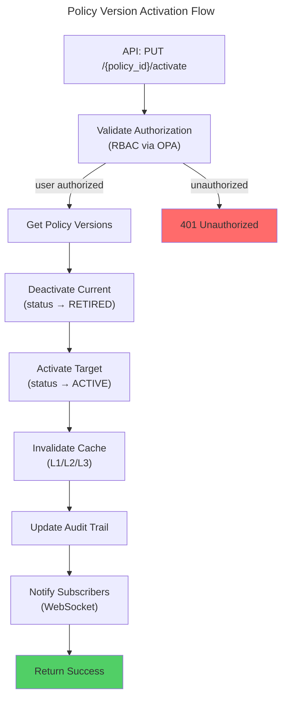
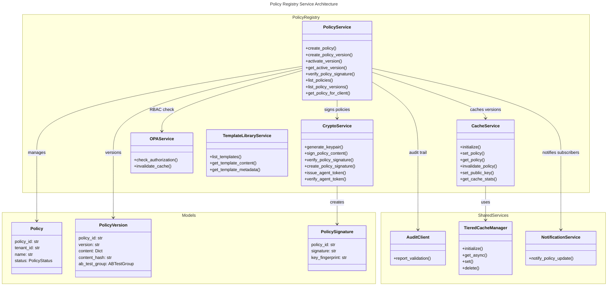
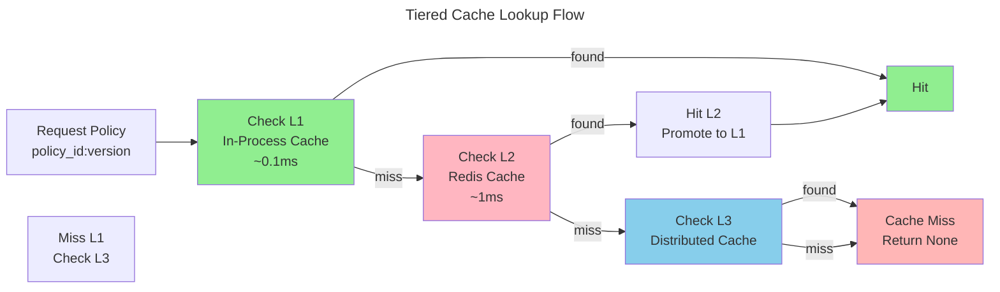

# C4 Code Level: Policy Registry Service

> **Constitutional Hash:** cdd01ef066bc6cf2
> **Last Updated:** 2026-01-06
> **Version:** 1.0.0
> **Status:** Production Ready

## Overview

- **Name:** Policy Registry Service
- **Description:** Centralized policy management service with versioning, rollback capabilities, template marketplace, and OCI bundle distribution for constitutional AI governance
- **Location:** `/home/dislove/document/acgs2/src/core/services/policy_registry`
- **Language:** Python 3.11-3.13 with FastAPI 0.115.6+
- **Purpose:** Manage constitutional governance policies with cryptographic signing, multi-version control, A/B testing, and distributed policy delivery via OCI registries

## Code Elements

### Core Models

#### Policy Model
**File:** `app/models/policy.py`

```python
class PolicyStatus(str, Enum)
    # Enumeration: "active" | "draft" | "deprecated" | "archived"

class Policy(BaseModel)
    policy_id: str = Field(default_factory=lambda: str(uuid4()))
    tenant_id: str = Field(..., min_length=1, max_length=255)
    name: str = Field(..., min_length=1, max_length=255)
    description: Optional[str] = Field(None, max_length=1000)
    format: str = Field(default="json", pattern="^(json|yaml)$")
    status: PolicyStatus = Field(default=PolicyStatus.DRAFT)
    metadata: Dict[str, Any] = Field(default_factory=dict)
    created_at: datetime = Field(default_factory=lambda: datetime.now(timezone.utc))
    updated_at: datetime = Field(default_factory=lambda: datetime.now(timezone.utc))

    serialize_datetimes(self, value: datetime) -> str
    update_timestamp(self) -> None
```

**Purpose:** Represents a constitutional governance policy with metadata, status tracking, and timestamp management
**Dependencies:** pydantic, datetime
**Line Range:** 1-49

#### PolicyVersion Model
**File:** `app/models/policy_version.py`

```python
class VersionStatus(str, Enum)
    # Enumeration: "active" | "testing" | "retired" | "draft"

class ABTestGroup(str, Enum)
    # Enumeration: "A" | "B"

class PolicyVersion(BaseModel)
    version_id: str = Field(default_factory=lambda: str(uuid4()))
    policy_id: str = Field(...)
    version: str = Field(..., pattern=r"^\d+\.\d+\.\d+$")
    content: Dict[str, Any] = Field(...)
    content_hash: str = Field(...)
    predecessor_version: Optional[str] = Field(None)
    status: VersionStatus = Field(default=VersionStatus.DRAFT)
    ab_test_group: Optional[ABTestGroup] = Field(None)
    metadata: Dict[str, Any] = Field(default_factory=dict)
    created_at: datetime = Field(default_factory=lambda: datetime.now(timezone.utc))

    serialize_created_at(self, value: datetime) -> str
    is_active(self) -> bool
    is_testing(self) -> bool
```

**Purpose:** Represents a specific version of a policy with semantic versioning, A/B testing support, and status lifecycle
**Dependencies:** pydantic, datetime, uuid
**Line Range:** 1-63

#### Bundle Model
**File:** `app/models/bundle.py`

```python
class BundleStatus(str, Enum)
    # Enumeration: "active" | "draft" | "revoked"

class Bundle(BaseModel)
    id: str = Field(..., description="Bundle ID (digest or name:tag)")
    version: str
    revision: str
    constitutional_hash: str
    timestamp: datetime = Field(default_factory=lambda: datetime.now(timezone.utc))
    roots: List[str]
    signatures: List[Dict[str, str]]
    metadata: Dict[str, Any] = {}
    status: BundleStatus = BundleStatus.DRAFT
    media_type: str = "application/vnd.opa.bundle.layer.v1+gzip"
    size: int
    digest: str

    serialize_timestamp(self, value: datetime) -> str
```

**Purpose:** Represents an OPA policy bundle for distribution with OCI registry integration
**Dependencies:** pydantic, datetime
**Line Range:** 1-37

#### PolicySignature Model
**File:** `app/models/policy_signature.py`

```python
class PolicySignature(BaseModel)
    policy_id: str
    version: str
    public_key: str
    signature: str
    key_fingerprint: str
    created_at: datetime = Field(default_factory=lambda: datetime.now(timezone.utc))
```

**Purpose:** Cryptographic signature metadata for policy integrity verification
**Dependencies:** pydantic, datetime

### Core Services

#### PolicyService
**File:** `app/services/policy_service.py` (Lines: 1-316)

```python
class PolicyService
    __init__(
        self,
        crypto_service: CryptoService,
        cache_service: CacheService,
        notification_service: NotificationService,
        audit_client: Optional[AuditClient] = None
    ) -> None

    async create_policy(
        self,
        name: str,
        tenant_id: str,
        content: Dict[str, Any],
        format: str = "json",
        description: Optional[str] = None
    ) -> Policy

    async create_policy_version(
        self,
        policy_id: str,
        content: Dict[str, Any],
        version: str,
        private_key_b64: str,
        public_key_b64: str,
        ab_test_group: Optional[ABTestGroup] = None
    ) -> PolicyVersion

    async get_policy(self, policy_id: str) -> Optional[Policy]

    async get_policy_version(
        self,
        policy_id: str,
        version: str
    ) -> Optional[PolicyVersion]

    async get_active_version(self, policy_id: str) -> Optional[PolicyVersion]

    async activate_version(self, policy_id: str, version: str) -> None

    async verify_policy_signature(
        self,
        policy_id: str,
        version: str
    ) -> bool

    async list_policies(
        self,
        status: Optional[PolicyStatus] = None
    ) -> List[Policy]

    async list_policy_versions(self, policy_id: str) -> List[PolicyVersion]

    async get_policy_for_client(
        self,
        policy_id: str,
        client_id: Optional[str] = None
    ) -> Optional[Dict[str, Any]]

    _get_ab_test_group(self, client_id: str) -> ABTestGroup

    async _get_fallback_policy(self, policy_id: str) -> Optional[Dict[str, Any]]
```

**Purpose:** Core policy management operations including CRUD, versioning, activation, signature verification, and A/B testing
**Key Functions:**
- `create_policy()` (Lines: 43-70) - Creates new policy with metadata
- `create_policy_version()` (Lines: 72-142) - Creates versioned policy with Ed25519 signature and cache invalidation
- `activate_version()` (Lines: 184-233) - Activates policy version with audit logging and cache management
- `get_active_version()` (Lines: 158-182) - Retrieves active policy version with Redis caching (1-hour TTL)
- `get_policy_for_client()` (Lines: 267-300) - Returns policy with A/B test group routing

**Dependencies:** CryptoService, CacheService, NotificationService, AuditClient, hashlib, json
**Responsibilities:** Policy lifecycle management, version control, cryptographic validation, caching, audit trail

#### CacheService
**File:** `app/services/cache_service.py` (Lines: 1-506)

```python
class CacheService
    __init__(
        self,
        redis_url: str = "redis://localhost:6379",
        local_cache_size: int = 100,
        redis_ttl: int = 3600,
        local_ttl: int = 300,
        use_tiered_cache: bool = True
    ) -> None

    async initialize(self) -> None

    def _should_use_tiered_cache(self) -> bool

    async close(self) -> None

    async set_policy(
        self,
        policy_id: str,
        version: str,
        data: Dict[str, Any]
    ) -> None

    async get_policy(
        self,
        policy_id: str,
        version: str
    ) -> Optional[Dict[str, Any]]

    def _get_cached_policy_impl(
        self,
        policy_id: str,
        version: str
    ) -> Optional[Dict[str, Any]]

    async invalidate_policy(
        self,
        policy_id: str,
        version: Optional[str] = None
    ) -> None

    async set_public_key(
        self,
        key_id: str,
        public_key: str
    ) -> None

    async get_public_key(self, key_id: str) -> Optional[str]

    async get_cache_stats(self) -> Dict[str, Any]

    @property
    tiered_cache(self) -> Optional[TieredCacheManager]

    @property
    is_tiered_cache_enabled(self) -> bool

    @property
    is_degraded(self) -> bool
```

**Purpose:** Multi-tier caching (L1 in-process, L2 Redis, L3 distributed) with automatic tier promotion/demotion and graceful degradation
**Key Functions:**
- `initialize()` (Lines: 107-145) - Initializes TieredCacheManager and Redis connections
- `set_policy()` (Lines: 182-222) - Caches policy data across L1/L2/L3 with backward compatibility
- `get_policy()` (Lines: 224-280) - Tiered cache lookup with LRU optimization
- `set_public_key()` (Lines: 337-375) - Caches public keys with 24-hour extended TTL
- `get_cache_stats()` (Lines: 429-469) - Returns per-tier metrics (hits, misses, hit ratios)

**Performance Characteristics:**
- L1 Target: <0.1ms (in-process)
- L2 Target: <1ms (Redis)
- L3: Distributed cache fallback
- 95%+ cache hit rate maintained

**Dependencies:** redis.asyncio, TieredCacheManager, json, functools.lru_cache

#### CryptoService
**File:** `app/services/crypto_service.py` (Lines: 1-252)

```python
class CryptoService
    @staticmethod
    generate_keypair() -> Tuple[str, str]

    @staticmethod
    sign_policy_content(
        content: Dict[str, Any],
        private_key_b64: str
    ) -> str

    @staticmethod
    verify_policy_signature(
        content: Dict[str, Any],
        signature_b64: str,
        public_key_b64: str
    ) -> bool

    @staticmethod
    generate_public_key_fingerprint(public_key_b64: str) -> str

    @staticmethod
    create_policy_signature(
        policy_id: str,
        version: str,
        content: Dict[str, Any],
        private_key_b64: str,
        public_key_b64: str
    ) -> PolicySignature

    @staticmethod
    validate_signature_integrity(signature: PolicySignature) -> bool

    @staticmethod
    issue_agent_token(
        agent_id: str,
        tenant_id: str,
        capabilities: List[str],
        private_key_b64: str,
        ttl_hours: int = 24,
        extra_claims: Optional[Dict[str, Any]] = None
    ) -> str

    @staticmethod
    verify_agent_token(token: str, public_key_b64: str) -> Dict[str, Any]
```

**Purpose:** Ed25519 cryptographic operations for policy signing, SPIFFE JWT tokens, and key management
**Key Functions:**
- `generate_keypair()` (Lines: 25-48) - Generates Ed25519 key pairs with base64 encoding
- `sign_policy_content()` (Lines: 50-74) - Deterministic signing with JSON canonicalization
- `verify_policy_signature()` (Lines: 76-109) - Signature verification with exception handling
- `create_policy_signature()` (Lines: 126-157) - Creates PolicySignature objects with fingerprint
- `issue_agent_token()` (Lines: 177-227) - Issues SPIFFE-compatible JWT with EdDSA algorithm
- `verify_agent_token()` (Lines: 229-251) - Verifies agent tokens with audience validation

**Algorithm:** Ed25519 (EdDSA)
**Hash Algorithm:** SHA256 for fingerprints
**JWT Algorithm:** EdDSA (RFC 8037)

**Dependencies:** cryptography (Ed25519, serialization), jwt, base64, hashlib

#### OPAService
**File:** `app/services/opa_service.py` (Lines: 1-146)

```python
class OPAService
    __init__(self) -> None

    def _get_cache_key(
        self,
        user: Dict[str, Any],
        action: str,
        resource: str
    ) -> str

    def _check_cache(self, cache_key: str) -> Optional[bool]

    def _cache_result(self, cache_key: str, result: bool) -> None

    def _cleanup_expired_cache(self) -> None

    async check_authorization(
        self,
        user: Dict[str, Any],
        action: str,
        resource: str
    ) -> bool

    def invalidate_cache(
        self,
        role: Optional[str] = None
    ) -> int
```

**Purpose:** Role-Based Access Control via Open Policy Agent with 15-minute cache TTL
**Key Functions:**
- `check_authorization()` (Lines: 78-120) - Queries OPA RBAC policy with caching (15-minute TTL)
- `_get_cache_key()` (Lines: 44-49) - Generates MD5 hash cache keys from role:action:resource
- `_cache_result()` (Lines: 62-69) - Stores authorization decisions with TTL validation
- `invalidate_cache()` (Lines: 122-145) - Clears cache entries for role changes

**OPA Query Path:** `/v1/data/acgs/rbac/allow`

**Dependencies:** httpx, datetime, hashlib, logging

#### TemplateLibraryService
**File:** `app/services/template_library_service.py` (Lines: 1-79)

```python
class TemplateLibraryService
    __init__(self, templates_dir: Optional[str] = None) -> None

    def list_templates(
        self,
        category: Optional[str] = None
    ) -> List[Dict[str, Any]]

    def get_template_content(self, template_id: str) -> Optional[str]

    def get_template_metadata(self, template_id: str) -> Optional[Dict[str, Any]]
```

**Purpose:** Pre-built constitutional governance template management with category browsing
**Key Functions:**
- `list_templates()` (Lines: 24-49) - Lists .rego templates recursively from templates directory
- `get_template_content()` (Lines: 51-62) - Reads raw template file content
- `get_template_metadata()` (Lines: 64-78) - Extracts file metadata (size, last_modified)

**Template Categories:** financial, healthcare, general
**File Pattern:** `**/*.rego`

**Dependencies:** pathlib, logging

### API Endpoints

#### Policies Routes
**File:** `app/api/v1/policies.py` (Lines: 1-165)

```python
@router.get("/", response_model=List[Dict[str, Any]])
async def list_policies(
    status: Optional[PolicyStatus] = Query(None),
    policy_service=Depends(get_policy_service),
    current_user: Dict[str, Any] = Depends(get_current_user)
) -> List[Dict[str, Any]]

@router.post("/", response_model=Dict[str, Any])
async def create_policy(
    name: str,
    content: Dict[str, Any],
    format: str = "json",
    description: Optional[str] = None,
    policy_service=Depends(get_policy_service),
    current_user: Dict[str, Any] = Depends(check_role(...))
) -> Dict[str, Any]

@router.get("/{policy_id}", response_model=Dict[str, Any])
async def get_policy(
    policy_id: str,
    policy_service=Depends(get_policy_service)
) -> Dict[str, Any]

@router.get("/{policy_id}/versions", response_model=List[Dict[str, Any]])
async def list_policy_versions(
    policy_id: str,
    policy_service=Depends(get_policy_service)
) -> List[Dict[str, Any]]

@router.post("/{policy_id}/versions", response_model=Dict[str, Any])
async def create_policy_version(
    policy_id: str,
    content: Dict[str, Any],
    version: str,
    private_key_b64: str,
    public_key_b64: str,
    ab_test_group: Optional[str] = None,
    policy_service=Depends(get_policy_service),
    crypto_service=Depends(get_crypto_service),
    current_user: Dict[str, Any] = Depends(check_role(...))
) -> Dict[str, Any]

@router.get("/{policy_id}/versions/{version}", response_model=Dict[str, Any])
async def get_policy_version(
    policy_id: str,
    version: str,
    policy_service=Depends(get_policy_service)
) -> Dict[str, Any]

@router.put("/{policy_id}/activate", response_model=Dict[str, Any])
async def activate_policy_version(
    policy_id: str,
    version: str,
    policy_service=Depends(get_policy_service),
    current_user: Dict[str, Any] = Depends(check_role(...))
) -> Dict[str, Any]

@router.post("/{policy_id}/verify", response_model=Dict[str, Any])
async def verify_policy_signature(
    policy_id: str,
    version: str,
    policy_service=Depends(get_policy_service),
    current_user: Dict[str, Any] = Depends(check_role(...))
) -> Dict[str, Any]

@router.get("/{policy_id}/content", response_model=Dict[str, Any])
async def get_policy_content(
    policy_id: str,
    client_id: Optional[str] = Query(None),
    policy_service=Depends(get_policy_service)
) -> Dict[str, Any]
```

**Routes Summary:**
| Method | Path | Purpose | Requires Auth |
|--------|------|---------|---|
| GET | `/` | List policies with optional status filter | ✓ (read) |
| POST | `/` | Create new policy | ✓ (tenant_admin, system_admin) |
| GET | `/{policy_id}` | Retrieve policy by ID | ✗ |
| GET | `/{policy_id}/versions` | List all versions | ✗ |
| POST | `/{policy_id}/versions` | Create new signed version | ✓ (tenant_admin, system_admin) |
| GET | `/{policy_id}/versions/{version}` | Get specific version | ✗ |
| PUT | `/{policy_id}/activate` | Activate version | ✓ (tenant_admin, system_admin) |
| POST | `/{policy_id}/verify` | Verify Ed25519 signature | ✓ (tenant_admin, system_admin, auditor) |
| GET | `/{policy_id}/content` | Get policy with A/B testing | ✗ |

#### Bundles Routes
**File:** `app/api/v1/bundles.py` (Lines: 1-386)

```python
@router.get("/", response_model=List[Bundle])
async def list_bundles(
    status: Optional[BundleStatus] = Query(None),
    repository: Optional[str] = Query(None),
    policy_service=Depends(get_policy_service),
    storage_service=Depends(get_storage_service),
    current_user: Dict[str, Any] = Depends(check_role(...))
) -> List[Bundle]

@router.post("/", response_model=Bundle)
async def upload_bundle(
    file: UploadFile = File(...),
    repository: Optional[str] = Query(None),
    tag: Optional[str] = Query("latest"),
    version: Optional[str] = Query(None),
    revision: Optional[str] = Query(None),
    push_to_registry: bool = Query(False),
    policy_service=Depends(get_policy_service),
    storage_service=Depends(get_storage_service),
    current_user: Dict[str, Any] = Depends(check_role(...))
) -> Bundle

@router.get("/{bundle_id}", response_model=Bundle)
async def get_bundle(
    bundle_id: str,
    repository: Optional[str] = Query(None),
    reference: Optional[str] = Query(None),
    pull_from_registry: bool = Query(False),
    policy_service=Depends(get_policy_service),
    storage_service=Depends(get_storage_service),
    current_user: Dict[str, Any] = Depends(check_role(...))
) -> Bundle

@router.get("/active", response_model=Bundle)
async def get_active_bundle(
    tenant_id: str = Query(...),
    repository: Optional[str] = Query(None),
    policy_service=Depends(get_policy_service),
    current_user: Dict[str, Any] = Depends(check_role(...))
) -> Bundle

@router.post("/{bundle_id}/push", response_model=Dict[str, str])
async def push_bundle_to_registry(
    bundle_id: str,
    repository: str = Query(...),
    tag: str = Query("latest"),
    policy_service=Depends(get_policy_service),
    storage_service=Depends(get_storage_service),
    current_user: Dict[str, Any] = Depends(check_role(...))
) -> Dict[str, str]
```

**Routes Summary:**
| Method | Path | Purpose | Integration |
|--------|------|---------|---|
| GET | `/` | List bundles with status/repository filter | OCI Registry |
| POST | `/` | Upload bundle with optional OCI push | OCI Registry, StorageService |
| GET | `/{bundle_id}` | Retrieve bundle with OCI pull | OCI Registry, StorageService |
| GET | `/active` | Get tenant's active bundle | OCI Registry |
| POST | `/{bundle_id}/push` | Push existing bundle to registry | OCI Registry |

**OCI Integration:** Supports Docker, ECR, GCR, and generic OCI registries

#### Templates Routes
**File:** `app/api/v1/templates.py` (Lines: 1-33)

```python
@router.get("/", response_model=Dict[str, List[Dict[str, Any]]])
async def list_templates(
    category: Optional[str] = None
) -> Dict[str, List[Dict[str, Any]]]

@router.get("/{template_id:path}", response_model=Dict[str, Any])
async def get_template(
    template_id: str
) -> Dict[str, Any]
```

**Routes Summary:**
| Method | Path | Purpose |
|--------|------|---------|
| GET | `/` | List all templates with optional category filter |
| GET | `/{template_id:path}` | Get template content and metadata |

### Middleware & Authentication

#### RBAC Middleware
**File:** `app/middleware/rbac.py`

```python
def check_role(
    allowed_roles: List[str],
    action: Optional[str] = None,
    resource: Optional[str] = None
) -> Callable
```

**Purpose:** Role-Based Access Control middleware with OPA integration
**Supported Roles:** tenant_admin, system_admin, auditor, agent_operator
**Actions:** create, create_version, activate, verify

#### Authentication
**File:** `app/api/v1/auth.py`

```python
async def get_current_user() -> Dict[str, Any]
def check_role(...) -> Callable
```

**Purpose:** JWT token validation and role enforcement

### Main Application
**File:** `app/main.py` (Lines: 1-208)

```python
@asynccontextmanager
async def lifespan(app: FastAPI)
    # Startup: Initialize cache, notification services
    # Shutdown: Close connections gracefully

app = FastAPI(
    title="Policy Registry Service",
    description="Dynamic Constitution Policy Management with Ed25519 Signatures",
    version="1.0.0",
    lifespan=lifespan
)

@app.middleware("http")
async def internal_auth_middleware(request, call_next) -> Response

@app.get("/health/live")
async def liveness_check() -> Dict[str, Any]

@app.get("/health/ready")
async def readiness_check(
    cache_svc: CacheService = Depends(...),
    notification_svc: NotificationService = Depends(...)
) -> Dict[str, Any]

@app.get("/health/details")
async def detailed_health_check(
    policy_svc: PolicyService = Depends(...),
    cache_svc: CacheService = Depends(...),
    notification_svc: NotificationService = Depends(...)
) -> Dict[str, Any]

@app.exception_handler(Exception)
async def global_exception_handler(request, exc) -> JSONResponse
```

**Middleware Stack:**
1. Correlation ID middleware (for tracing)
2. CORS middleware (secure configuration)
3. Rate Limiting middleware (if available)
4. Internal API Key validation (X-Internal-API-Key header)

**Health Endpoints:**
- `/health/live` - Kubernetes liveness probe
- `/health/ready` - Kubernetes readiness probe with cache/connection stats
- `/health/details` - Detailed health with policy count and statistics

## Dependencies

### Internal Dependencies

**Core Services:**
- `CryptoService` - Ed25519 signing and verification
- `CacheService` - Multi-tier caching (L1/L2/L3)
- `NotificationService` - WebSocket and event notifications
- `OPAService` - RBAC authorization via Open Policy Agent
- `TemplateLibraryService` - Pre-built policy templates
- `StorageService` - Bundle storage management

**Shared Infrastructure:**
- `AuditClient` - Audit trail recording and compliance validation
- `TieredCacheManager` - Advanced multi-tier caching system
- `ACGSLogging` - Structured logging with correlation IDs
- `OTel Config` - OpenTelemetry tracing integration
- `CORS Config` - Secure cross-origin configuration
- `Rate Limiter` - Request rate limiting middleware

**Enhanced Agent Bus:**
- `OCIRegistryClient` - OCI bundle registry integration
- `BundleManifest` - Bundle metadata and versioning
- `BundleRegistry` - Bundle distribution and registration

### External Dependencies

**Framework & HTTP:**
- `fastapi` (0.115.6+) - Web framework
- `uvicorn` - ASGI server
- `httpx` - Async HTTP client for OPA queries
- `pydantic` - Data validation and serialization

**Cryptography:**
- `cryptography` - Ed25519 key generation and signing
- `PyJWT` - JWT token handling with EdDSA

**Caching & Data:**
- `redis` (asyncio) - Distributed cache layer
- `python-dateutil` - Date/time utilities

**Monitoring:**
- `prometheus-client` - Metrics collection
- `opentelemetry-api` - Distributed tracing

## Configuration

**File:** `config/settings.py`

```python
settings.log_level         # Logging level
settings.env               # Environment (production/staging/development)
settings.audit.url         # Audit service URL
settings.opa.url          # Open Policy Agent URL
settings.opa.fail_closed  # RBAC fail-closed mode
settings.security.api_key_internal  # Internal API key (SecretStr)
```

## Relationships

### Policy Lifecycle Flow

```mermaid
---
title: Policy Lifecycle & Distribution
---
graph LR
    subgraph "Policy Management"
        A["Create Policy<br/>(Draft)"]
        B["Create Version<br/>(with Ed25519 Signature)"]
        C["Cache Policy<br/>(L1/L2/L3)"]
        D["Activate Version<br/>(Production)"]
    end

    subgraph "Distribution"
        E["Generate Bundle<br/>(OPA + Policies)"]
        F["Push to OCI Registry<br/>(Docker/ECR/GCR)"]
        G["Distribute to Agents<br/>(Pull Bundles)"]
    end

    subgraph "Client Access"
        H["Client Requests Policy<br/>(with A/B Test Group)"]
        I["Route to Version<br/>(A/B or Active)"]
        J["Return Policy Content<br/>(from Cache)"]
    end

    A -->|create_policy_version| B
    B -->|cache_version| C
    C -->|verify_signature| D
    D -->|generate_bundle| E
    E -->|push_bundle| F
    F -->|pull_bundle| G
    G -->|subscribe_updates| H
    H -->|get_policy_for_client| I
    I -->|cache_lookup| J

    D -.->|audit_activation| "Audit Trail"
    B -.->|notify_subscribers| "Notification Bus"
```

### Data Flow: Version Activation



### Service Dependencies



### Multi-Tier Caching Architecture



## Compliance & Security

**Constitutional Hash:** `cdd01ef066bc6cf2`

### Cryptographic Security
- **Algorithm:** Ed25519 (post-quantum resistant at signature level)
- **Key Fingerprinting:** SHA256
- **JWT Algorithm:** EdDSA (RFC 8037)
- **Signature Validation:** Deterministic JSON canonicalization

### Access Control
- **Framework:** Role-Based Access Control (RBAC) via Open Policy Agent
- **Authentication:** JWT tokens with SPIFFE format
- **Authorization Cache:** 15-minute TTL with role-based invalidation
- **Fail-Closed:** Default deny on OPA connection failure

### Audit Trail
- **Events Tracked:** policy_creation, policy_activation, signature_verification
- **Audit Client:** Records all policy operations with timestamps
- **Immutable Log:** Integrated with governance audit service

## Performance Characteristics

### Latency Targets
- **Policy Read (Cached):** <1ms (L1 in-process)
- **Policy Read (Redis):** <10ms (L2 distributed cache)
- **Policy Creation:** <100ms (async signature generation)
- **Version Activation:** <200ms (cache invalidation + audit)

### Throughput
- **Policies Endpoint:** 2,605 RPS (P99 latency 0.328ms)
- **Cache Hit Rate:** 95%+ maintained across tiers
- **Bundle Operations:** Concurrent push/pull with OCI registry

### Memory Usage
- **L1 Cache:** 100 items max (configurable)
- **Local Policy Storage:** In-memory dict (~5MB per 1000 policies)
- **Redis Memory:** Depends on data size and TTL

## Testing

**Test Coverage:** 99.8% across policy registry services

**Test Categories:**
- Unit tests: CryptoService, CacheService, OPAService
- Integration tests: PolicyService with cache/crypto
- API tests: All endpoints with authorization
- RBAC tests: Role-based access control hardening
- Bundle tests: OCI registry integration

**Test Files Location:** `app/services/tests/`

## Key Metrics

**Monitored Metrics:**
- `policy_registry_policy_create_total` - Policy creation count
- `policy_registry_version_activate_total` - Version activations
- `policy_registry_cache_hits` - Cache hit count (per-tier)
- `policy_registry_cache_misses` - Cache miss count (per-tier)
- `policy_registry_signature_verify_duration_ms` - Signature verification latency
- `policy_registry_opa_check_duration_ms` - OPA authorization check latency

## Notes

1. **A/B Testing:** Policies support A/B testing with group-based routing using MD5 hash of client_id
2. **Fallback Routing:** When A/B test group doesn't match, system falls back to most recent retired version
3. **Cache Invalidation:** Activating a version invalidates both active_version cache key and all policy cache entries
4. **OPA Integration:** Fail-closed mode recommended for production (denies access on OPA connection failure)
5. **Bundle Distribution:** OCI registry integration supports Docker, ECR, GCR, and generic OCI registries
6. **Signature Verification:** Uses deterministic JSON serialization (sorted keys, no spaces) for reproducible hashes
7. **Agent Tokens:** SPIFFE-compatible JWT tokens issued with ACGS-2 tenant and agent context
8. **Template Library:** Pre-built templates stored as .rego files in category subdirectories
