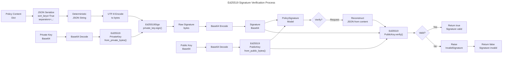
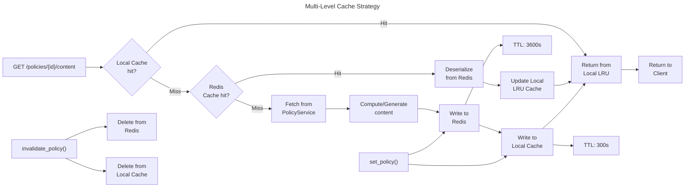

# C4 Code Level: Policy and Governance Services

<!-- Constitutional Hash: cdd01ef066bc6cf2 -->

## Overview

- **Name**: Policy and Governance Services
- **Description**: Comprehensive policy management, storage, versioning, and governance evaluation system for constitutional AI policies
- **Location**: `/acgs2-core/services/`
- **Language**: Python 3.11+
- **Purpose**: Provide dynamic policy storage with cryptographic signatures, OPA-based policy evaluation, caching, and governance workflows

## Directory Structure

```
services/
├── policy_registry/          # Policy storage and version management (Port 8000)
│   ├── app/
│   │   ├── api/
│   │   │   └── v1/           # FastAPI v1 endpoints
│   │   ├── models/           # Pydantic data models
│   │   ├── services/         # Business logic services
│   │   ├── middleware/       # Request/response middleware
│   │   └── main.py           # FastAPI application
│   ├── config/
│   ├── tests/
│   └── examples/
├── opa/                       # OPA integration service
│   ├── policies/             # Rego policy files
│   └── tests/
├── governance/               # Governance engine
│   └── governance-engine/    # Core governance components
└── policy_governance/        # Policy governance workflows
policy_search/               # Policy search capabilities
governance_synthesis/        # Policy synthesis services
```

## Code Elements

### Policy Registry Service (Port 8000)

#### Models

**Policy** (`policy.py`)
- Represents a constitutional policy in draft or active state
- Fields: `policy_id`, `tenant_id`, `name`, `description`, `format` (json/yaml), `status` (PolicyStatus enum), `metadata`
- Timestamps: `created_at`, `updated_at` using `datetime.now(timezone.utc)`
- Lifecycle: DRAFT → ACTIVE → DEPRECATED → ARCHIVED
- Location: `/services/policy_registry/app/models/policy.py`

**PolicyVersion** (`policy_version.py`)
- Represents a specific version of a policy with semantic versioning
- Fields: `version_id`, `policy_id`, `version` (semantic: X.Y.Z), `content` (Dict), `content_hash` (SHA256)
- Status: ACTIVE, TESTING, RETIRED, DRAFT
- A/B Testing: Optional `ab_test_group` (A/B enum) for canary rollouts
- Properties: `is_active`, `is_testing` for quick status checks
- Location: `/services/policy_registry/app/models/policy_version.py`

**PolicySignature** (`policy_signature.py`)
- Cryptographic signature using Ed25519 for policy integrity
- Fields: `signature_id`, `policy_id`, `version`, `public_key` (base64), `signature` (base64)
- Algorithm: Ed25519 (default)
- Key fingerprint: SHA256 of public key for key identification
- Timestamps: `signed_at`, `expires_at` (optional)
- Properties: `is_expired`, `is_valid` for expiration checks
- Location: `/services/policy_registry/app/models/policy_signature.py`

**Bundle** (`bundle.py`)
- Represents a policy bundle for deployment
- Fields: `id`, `version`, `revision`, `constitutional_hash`, `roots` (policy paths)
- Status: ACTIVE, DRAFT, REVOKED
- Digest: SHA256-based identity
- Media type: `application/vnd.opa.bundle.layer.v1+gzip`
- Location: `/services/policy_registry/app/models/bundle.py`

#### Services

**PolicyService** (`policy_service.py`)
```
create_policy(name, tenant_id, content, format, description) -> Policy
  - Creates new policy in DRAFT status
  - Stores in internal _policies dict
  - Initializes version list for policy

create_policy_version(policy_id, content, version, private_key_b64, public_key_b64, ab_test_group?) -> PolicyVersion
  - Generates SHA256 content hash of JSON-serialized content (canonical form)
  - Creates PolicyVersion with semantic version
  - Signs content using CryptoService.create_policy_signature()
  - Caches policy and public key via CacheService
  - Notifies subscribers via NotificationService
  - Logs activation audit event via AuditClient

get_policy(policy_id) -> Optional[Policy]
  - Retrieves policy metadata by ID

get_policy_version(policy_id, version) -> Optional[PolicyVersion]
  - Retrieves specific semantic version of policy

get_active_version(policy_id) -> Optional[PolicyVersion]
  - Returns currently active version with cache support
  - Cache key: "active_version:{policy_id}"
  - TTL: 3600 seconds (1 hour)
  - Invalidated on version activation

activate_version(policy_id, version)
  - Sets target version status to ACTIVE
  - Deactivates all other versions (sets to RETIRED)
  - Invalidates active_version cache
  - Notifies via NotificationService
  - Creates async audit record via AuditClient

verify_policy_signature(policy_id, version) -> bool
  - Validates Ed25519 signature against policy content
  - Compares signature stored at "{policy_id}:{version}"
  - Uses CryptoService.verify_policy_signature()

list_policies(status?) -> List[Policy]
  - Returns all policies, optionally filtered by PolicyStatus

get_policy_for_client(policy_id, client_id?) -> Optional[Dict]
  - Retrieves active policy content with caching
  - Supports A/B testing routing based on client_id hash (MD5)
  - Fallback to most recent retired version if A/B mismatch
  - Cache key: "{policy_id}:active"
```
- Location: `/services/policy_registry/app/services/policy_service.py`
- Dependencies: CryptoService, CacheService, NotificationService, AuditClient

**CryptoService** (`crypto_service.py`)
```
generate_keypair() -> Tuple[str, str]
  - Generates new Ed25519 key pair
  - Returns (public_key_b64, private_key_b64) tuple
  - Uses cryptography.hazmat.primitives.asymmetric.ed25519

sign_policy_content(content: Dict, private_key_b64: str) -> str
  - Creates deterministic JSON serialization (sort_keys=True, separators=(',', ':'))
  - Signs using Ed25519PrivateKey.sign()
  - Returns base64-encoded signature

verify_policy_signature(content: Dict, signature_b64: str, public_key_b64: str) -> bool
  - Verifies Ed25519 signature against policy content
  - Uses deterministic JSON serialization
  - Catches InvalidSignature exception

create_policy_signature(policy_id, version, content, private_key_b64, public_key_b64) -> PolicySignature
  - Creates PolicySignature object with signed content
  - Generates key fingerprint: SHA256(public_key_b64)
  - Returns fully initialized PolicySignature
```
- Location: `/services/policy_registry/app/services/crypto_service.py`
- Dependencies: cryptography.hazmat, jwt (PyJWT)

**CacheService** (`cache_service.py`)
```
initialize() -> None
  - Connects to Redis via redis.asyncio (redis:// URL)
  - Falls back to local-only caching if Redis unavailable

set_policy(policy_id, version, data) -> None
  - Dual-level caching: Redis + local LRU
  - Cache key: "policy:{policy_id}:{version}"
  - Redis TTL: 3600s (configurable)
  - Local TTL: 300s (configurable)
  - Clears LRU cache after write

get_policy(policy_id, version) -> Optional[Dict]
  - Checks local cache first (respects local_ttl)
  - Falls back to Redis if local expired/missing
  - Returns None if not found in either

set_public_key(key_fingerprint, public_key_b64) -> None
  - Caches public keys for signature verification
  - Cache key: "pubkey:{key_fingerprint}"

invalidate_policy(policy_id) -> None
  - Clears both Redis and local cache entries for policy_id

delete(cache_key) -> None
  - Removes specific key from cache

get(cache_key) -> Optional[Dict]
  - Generic cache get with timestamp validation

set(cache_key, value, ttl?) -> None
  - Generic cache set with optional TTL

get_cache_stats() -> Dict
  - Returns cache statistics for health checks
```
- Location: `/services/policy_registry/app/services/cache_service.py`
- Dependencies: redis.asyncio (optional), functools.lru_cache

**OPAService** (`opa_service.py`)
```
check_authorization(user: Dict, action: str, resource: str) -> bool
  - Evaluates RBAC authorization against OPA policies
  - Uses in-memory cache (15-minute TTL) for role-based decisions
  - Cache key: MD5("{role}:{action}:{resource}")
  - Configurable fail_closed behavior (reject on OPA failure)

check_authorization_with_context(user: Dict, context: Dict, action: str, resource: str) -> bool
  - Extended authorization with additional context data
  - Sends to OPA at path: /v1/data/rbac/authz
  - Falls back to cached result if OPA unavailable

_get_cache_key(user, action, resource) -> str
  - Generates MD5-based cache key from role (not user-specific)

_check_cache(cache_key) -> Optional[bool]
  - Validates cache entry against expiry timestamp
  - Returns None if expired

_cache_result(cache_key, result) -> None
  - Stores authorization result with TTL expiry
  - Auto-cleanup when cache exceeds 100 entries

_cleanup_expired_cache() -> None
  - Removes expired cache entries by comparing timestamps
```
- Location: `/services/policy_registry/app/services/opa_service.py`
- Dependencies: httpx, datetime.timezone
- Configuration: OPA URL from settings (default: http://localhost:8181)

**NotificationService** (`notification_service.py`)
- Broadcasts policy update events to subscribers
- Methods: `notify_policy_update(policy_id, version, event_type, data?)`
- Location: `/services/policy_registry/app/services/notification_service.py`

**StorageService** (`storage_service.py`)
- Manages bundle storage and retrieval
- Methods: `save_bundle(digest, content)`, `get_bundle(bundle_id)`
- Location: `/services/policy_registry/app/services/storage_service.py`

#### API Endpoints

**Policies API** (`app/api/v1/policies.py`)

| Method | Endpoint | Handler | Auth | Purpose |
|--------|----------|---------|------|---------|
| GET | `/api/v1/policies/` | `list_policies()` | User | List tenant policies (filtered by status) |
| POST | `/api/v1/policies/` | `create_policy()` | tenant_admin, system_admin | Create new policy |
| GET | `/api/v1/policies/{policy_id}` | `get_policy()` | User | Get policy metadata |
| GET | `/api/v1/policies/{policy_id}/versions` | `list_policy_versions()` | User | List all versions of policy |
| POST | `/api/v1/policies/{policy_id}/versions` | `create_policy_version()` | tenant_admin, system_admin | Create and sign new version |

**Bundles API** (`app/api/v1/bundles.py`)

| Method | Endpoint | Handler | Auth | Purpose |
|--------|----------|---------|------|---------|
| GET | `/api/v1/bundles/` | `list_bundles()` | User | List policy bundles |
| POST | `/api/v1/bundles/` | `upload_bundle()` | tenant_admin, system_admin | Upload bundle file |
| GET | `/api/v1/bundles/{bundle_id}` | `get_bundle()` | User | Get bundle content |

**Auth API** (`app/api/v1/auth.py`)

| Method | Endpoint | Handler | Auth | Purpose |
|--------|----------|---------|------|---------|
| POST | `/api/v1/auth/login` | `login()` | None | Authenticate user, return JWT token |
| POST | `/api/v1/auth/refresh` | `refresh_token()` | JWT | Refresh expired token |

**Health API** (`app/api/v1/health.py`)

| Method | Endpoint | Handler | Auth | Purpose |
|--------|----------|---------|------|---------|
| GET | `/health/live` | `liveness_check()` | None | Kubernetes liveness probe |
| GET | `/health/ready` | `readiness_check()` | None | Kubernetes readiness probe |
| GET | `/health/details` | `detailed_health_check()` | None | Comprehensive health metrics |

#### Middleware

**RBAC Middleware** (`middleware/rbac.py`)
- Implements role-based access control using OPA
- Methods: `check_role(allowed_roles, action?, resource?)` - returns Depends() for route guards
- Location: `/services/policy_registry/app/middleware/rbac.py`

#### Main Application

**FastAPI App** (`main.py`)
- Port: 8000 (Policy Registry)
- Lifespan: Async context manager for startup/shutdown
- Startup: Initialize cache_service, notification_service
- Shutdown: Close cache and notification connections
- Middleware: CORS (secure configuration from shared.security), Rate limiting, Internal API key validation
- Exception handler: Global handler catches unhandled exceptions
- Dependency injection: Service instances injected via `get_*_service()` functions
- Location: `/services/policy_registry/app/main.py`

## Internal Dependencies

### Within Policy Registry

```
main.py
  ├── depends on: CryptoService, CacheService, NotificationService, PolicyService
  ├── includes router: v1_router from api/v1/__init__.py
  └── registers middleware: CORS, RateLimiting, InternalAuth

api/v1/policies.py
  ├── depends on: PolicyService, CryptoService (via Depends)
  ├── uses: OPAService for RBAC (via check_role middleware)
  └── returns: Policy, PolicyVersion models

api/v1/bundles.py
  ├── depends on: PolicyService, StorageService
  ├── uses: Bundle model
  └── returns: Bundle with SHA256 digest

services/policy_service.py
  ├── depends on: CryptoService
  ├── depends on: CacheService
  ├── depends on: NotificationService
  ├── depends on: AuditClient (optional, from shared.audit_client)
  └── maintains state: _policies, _versions, _signatures dicts

services/crypto_service.py
  └── no internal dependencies (pure cryptography)

services/cache_service.py
  ├── depends on: redis.asyncio (optional)
  └── maintains state: _local_cache dict, LRU cache

services/opa_service.py
  ├── depends on: httpx for HTTP requests
  └── maintains state: _auth_cache dict with TTL management

middleware/rbac.py
  └── depends on: OPAService for authorization checks
```

## External Dependencies

### Third-party Libraries

- **fastapi** (0.115.6+): Web framework for REST API
- **pydantic**: Data validation using BaseModel
- **cryptography**: Ed25519 cryptographic operations
- **PyJWT (jwt)**: JWT token creation and validation
- **redis**: Async Redis client via redis.asyncio
- **httpx**: Async HTTP client for OPA integration
- **python-multipart**: File upload handling in Bundles API

### Shared Services

- **shared.audit_client**: AuditClient for audit trail logging
- **shared.config**: Settings configuration (OPA URL, security settings)
- **shared.security.cors_config**: CORS configuration middleware
- **shared.security.rate_limiter**: Rate limiting middleware
- **shared.constants**: CONSTITUTIONAL_HASH constant (cdd01ef066bc6cf2)

### External Services

- **Redis**: Multi-level caching (default: redis://localhost:6379)
- **OPA (Open Policy Agent)**: Policy evaluation and RBAC (default: http://localhost:8181)
- **Audit Service**: Blockchain-anchored audit trail logging

## Key Workflows

### Policy Creation and Activation Workflow

```
Client Request
    ↓
1. POST /api/v1/policies/ (create_policy)
    ├─ Authenticate via JWT
    ├─ Check role via RBAC (tenant_admin/system_admin)
    └─ Create Policy object in DRAFT status
         └─ Store in _policies dict
         └─ Initialize empty _versions list
    ↓
2. POST /api/v1/policies/{id}/versions (create_policy_version)
    ├─ Generate content hash (SHA256 of canonical JSON)
    ├─ Create PolicyVersion object
    ├─ CryptoService.sign_policy_content()
    │   └─ Deterministic JSON serialization
    │   └─ Ed25519 sign with private key
    │   └─ Return base64 signature
    ├─ Create PolicySignature object
    ├─ Store in _versions and _signatures
    ├─ CacheService.set_policy() - dual Redis/local cache
    ├─ CacheService.set_public_key() - cache verification key
    ├─ NotificationService.notify_policy_update() - broadcast to subscribers
    └─ AuditClient.report_validation() - async audit logging
    ↓
3. POST /api/v1/policies/{id}/versions/{version}/activate (activate_version)
    ├─ Set target version status: ACTIVE
    ├─ Deactivate other versions: status = RETIRED
    ├─ Invalidate active_version cache
    ├─ NotificationService.notify_policy_update()
    └─ AuditClient async audit record
         Event: "policy_activation"
         Fields: policy_id, version, timestamp, status
    ↓
Client receives: Activated PolicyVersion
```

### Policy Retrieval with A/B Testing

```
Client Request: GET /api/v1/policies/{id}/content?client_id=xyz
    ↓
1. get_policy_for_client(policy_id, client_id)
    ├─ CacheService.get_policy(policy_id, "active")
    │   └─ Check Redis + local cache
    │   └─ Return if cache hit
    ↓ (cache miss)
    ├─ get_active_version(policy_id)
    │   ├─ Check "active_version:{policy_id}" cache
    │   └─ Return from _versions if not cached
    ↓
2. Check A/B test group assignment (if enabled)
    ├─ If ab_test_group is set
    ├─ Calculate: _get_ab_test_group(client_id)
    │   └─ Hash client_id with MD5
    │   └─ Return Group A if (hash % 2 == 0), else B
    ├─ Compare calculated group vs version's ab_test_group
    │   └─ If mismatch: return fallback (most recent RETIRED version)
    │   └─ If match: continue with active version
    ↓
3. CacheService.set_policy() - cache result
    ├─ Redis: SETEX policy:{policy_id}:active (1 hour)
    └─ Local: _local_cache entry
    ↓
Return: Policy content Dict or null if no version
```

### Policy Signature Verification

```
Client Request: GET /api/v1/policies/{id}/versions/{ver}/verify
    ↓
1. verify_policy_signature(policy_id, version)
    ├─ Look up signature: _signatures["{policy_id}:{version}"]
    ├─ Get PolicyVersion object
    ↓
2. CryptoService.verify_policy_signature(content, sig, pubkey)
    ├─ Deserialize policy content JSON (deterministic form)
    ├─ Decode signature from base64
    ├─ Decode public_key from base64
    ├─ ed25519.Ed25519PublicKey.verify(signature, message)
    │   └─ Returns True if valid
    │   └─ Raises InvalidSignature if invalid
    └─ Return verification result bool
    ↓
Return: {"verified": true/false}
```

## Configuration

### Environment Variables

```
REDIS_URL=redis://localhost:6379
OPA_URL=http://localhost:8181
OPA_FAIL_CLOSED=true
INTERNAL_API_KEY=<secret>
CORS_ORIGINS=http://localhost:3000,http://localhost:8080
JWT_SECRET=<secret>
JWT_ALGORITHM=HS256
JWT_EXPIRATION_HOURS=24
```

### Settings (shared.config)

```
settings.audit.url: Audit service URL for logging
settings.security.cors_origins: CORS allowed origins
settings.security.api_key_internal: Internal API key for service-to-service auth
settings.opa.url: OPA server URL
settings.opa.fail_closed: Reject on OPA failure (security-first)
```

## Constitutional Compliance

- **Constitutional Hash**: cdd01ef066bc6cf2
- All policies must pass constitutional validation before activation
- Policy content and signatures are audited via AuditClient
- OPA policies enforce constitutional constraints at authorization boundaries
- Signature verification ensures integrity of constitutional policies
- All policy modifications are logged with timestamps and cryptographic proof

## Mermaid Diagrams

### Policy Registry Architecture Diagram

```mermaid
---
title: Policy Registry Service Architecture
---
classDiagram
    namespace PolicyRegistry {
        class FastAPIApp {
            <<service>>
            -port: 8000
            -title: Policy Registry Service
            +lifespan: async context manager
            +middleware: CORS, RateLimiting, InternalAuth
        }

        class PolicyService {
            <<service>>
            -crypto_service: CryptoService
            -cache_service: CacheService
            -notification_service: NotificationService
            -audit_client: AuditClient
            -_policies: Dict[str, Policy]
            -_versions: Dict[str, List[PolicyVersion]]
            -_signatures: Dict[str, PolicySignature]
            +create_policy(name, tenant_id, content, format) Policy
            +create_policy_version(policy_id, content, version, private_key, public_key) PolicyVersion
            +get_policy(policy_id) Optional[Policy]
            +get_active_version(policy_id) Optional[PolicyVersion]
            +activate_version(policy_id, version) void
            +verify_policy_signature(policy_id, version) bool
            +list_policies(status) List[Policy]
            +get_policy_for_client(policy_id, client_id) Optional[Dict]
        }

        class CryptoService {
            <<service>>
            +generate_keypair() Tuple[str, str]
            +sign_policy_content(content, private_key_b64) str
            +verify_policy_signature(content, signature_b64, public_key_b64) bool
            +create_policy_signature(policy_id, version, content, private_key, public_key) PolicySignature
        }

        class CacheService {
            <<service>>
            -redis_client: Optional[redis.Redis]
            -_local_cache: Dict[str, Dict]
            -_get_cached_policy: LRU[100]
            -redis_ttl: int = 3600
            -local_ttl: int = 300
            +initialize() void
            +close() void
            +set_policy(policy_id, version, data) void
            +get_policy(policy_id, version) Optional[Dict]
            +set_public_key(key_fingerprint, public_key_b64) void
            +invalidate_policy(policy_id) void
        }

        class OPAService {
            <<service>>
            -opa_url: str
            -fail_closed: bool
            -_auth_cache: Dict[str, Tuple[bool, float]]
            +check_authorization(user, action, resource) bool
            +check_authorization_with_context(user, context, action, resource) bool
            -_get_cache_key(user, action, resource) str
            -_check_cache(cache_key) Optional[bool]
        }

        class NotificationService {
            <<service>>
            +notify_policy_update(policy_id, version, event_type, data) void
            +initialize() void
            +shutdown() void
        }

        class StorageService {
            <<service>>
            +save_bundle(digest, content) str
            +get_bundle(bundle_id) Optional[bytes]
        }

        class PoliciesAPI {
            <<endpoint>>
            -router: APIRouter
            +list_policies(status, policy_service) List[Dict]
            +create_policy(name, content, policy_service) Dict
            +get_policy(policy_id, policy_service) Dict
            +list_policy_versions(policy_id, policy_service) List[Dict]
            +create_policy_version(policy_id, content, version, policy_service) Dict
        }

        class BundlesAPI {
            <<endpoint>>
            -router: APIRouter
            +list_bundles(policy_service) List[Bundle]
            +upload_bundle(file, policy_service) Bundle
            +get_bundle(bundle_id, policy_service) Bundle
        }

        class RBACMiddleware {
            <<middleware>>
            +check_role(allowed_roles, action, resource) Callable
        }

        class Policy {
            <<model>>
            +policy_id: str
            +tenant_id: str
            +name: str
            +description: Optional[str]
            +format: str
            +status: PolicyStatus
            +metadata: Dict[str, Any]
            +created_at: datetime
            +updated_at: datetime
        }

        class PolicyVersion {
            <<model>>
            +version_id: str
            +policy_id: str
            +version: str
            +content: Dict[str, Any]
            +content_hash: str
            +status: VersionStatus
            +ab_test_group: Optional[ABTestGroup]
            +created_at: datetime
            +is_active: bool
            +is_testing: bool
        }

        class PolicySignature {
            <<model>>
            +signature_id: str
            +policy_id: str
            +version: str
            +public_key: str
            +signature: str
            +algorithm: str = "Ed25519"
            +key_fingerprint: Optional[str]
            +signed_at: datetime
            +is_expired: bool
            +is_valid: bool
        }

        class Bundle {
            <<model>>
            +id: str
            +version: str
            +revision: str
            +constitutional_hash: str
            +roots: List[str]
            +signatures: List[Dict]
            +status: BundleStatus
            +digest: str
        }
    }

    namespace ExternalServices {
        class AuditClient {
            <<external>>
            +report_validation(record) void
        }

        class Redis {
            <<external>>
            -url: str
            +get(key) Optional[str]
            +setex(key, ttl, value) void
        }

        class OPAServer {
            <<external>>
            +v1/data/rbac/authz POST
        }
    }

    FastAPIApp --> PoliciesAPI
    FastAPIApp --> BundlesAPI
    FastAPIApp --> RBACMiddleware

    PoliciesAPI --> PolicyService
    PoliciesAPI --> CryptoService
    PoliciesAPI --> RBACMiddleware

    BundlesAPI --> StorageService
    BundlesAPI --> RBACMiddleware

    PolicyService --> CryptoService
    PolicyService --> CacheService
    PolicyService --> NotificationService
    PolicyService --> AuditClient
    PolicyService --> Policy
    PolicyService --> PolicyVersion
    PolicyService --> PolicySignature

    CryptoService --> PolicySignature

    CacheService --> Redis

    OPAService --> OPAServer

    RBACMiddleware --> OPAService
```



### Policy Lifecycle Flow Diagram

```mermaid
---
title: Policy Lifecycle and Data Flow
---
flowchart TB
    Start([Policy Creation Request]) --> Step1["POST /policies/\n(create_policy)"]
    Step1 --> Step2["Create Policy\nstatus: DRAFT"]
    Step2 --> Step3["Initialize version list"]

    Step3 --> Step4["POST /policies/{id}/versions\n(create_policy_version)"]
    Step4 --> Step5["Generate content hash\nSHA256 canonical JSON"]
    Step5 --> Step6["CryptoService\nEd25519 sign"]
    Step6 --> Step7["Create PolicySignature"]
    Step7 --> Step8["Store version & signature"]
    Step8 --> Step9["CacheService\nDual Redis+Local"]
    Step9 --> Step10["NotificationService\nBroadcast update"]
    Step10 --> Step11["AuditClient\nLog version created"]

    Step11 --> Step12["Policy in DRAFT\nwith versions"]
    Step12 --> Step13["POST /policies/{id}/versions/{ver}/activate\n(activate_version)"]

    Step13 --> Step14["Set version\nstatus: ACTIVE"]
    Step14 --> Step15["Retire old versions\nstatus: RETIRED"]
    Step15 --> Step16["Invalidate cache\nactive_version:{id}"]
    Step16 --> Step17["NotificationService\nBroadcast activation"]
    Step17 --> Step18["AuditClient\nLog policy_activation"]

    Step18 --> Step19["Policy ACTIVE\nClients can retrieve"]

    Step19 --> Step20["GET /policies/{id}/content\n(get_policy_for_client)"]
    Step20 --> Step21{Cache hit?}
    Step21 -->|Yes| Step22["Return cached\ncontent"]
    Step21 -->|No| Step23["Fetch from\nget_active_version()"]
    Step23 --> Step24{A/B Testing\nenabled?}
    Step24 -->|Yes| Step25["Hash client_id\nCheck group"]
    Step25 --> Step26{Match?}
    Step26 -->|No| Step27["Return fallback\nretired version"]
    Step26 -->|Yes| Step28["Return active\nversion content"]
    Step24 -->|No| Step28

    Step27 --> Step29["CacheService.set_policy()\nRedis + Local"]
    Step28 --> Step29
    Step29 --> Step30["Return Policy\nContent to Client"]

    Step22 --> Step30

    Step30 --> Step31["Client uses policy\nfor governance decisions"]
    Step31 --> End([Policy Lifecycle Complete])
```



### Cryptographic Signature Verification Flow



### Multi-Level Caching Architecture



## Testing Coverage

### Unit Tests
- `test_policy_service.py`: Policy creation, versioning, activation, signature verification
- `test_crypto_service.py`: Ed25519 keypair generation, signing, verification
- `test_cache_service.py`: Redis/local cache operations, TTL management, fallback
- `test_opa_service.py`: Authorization checks, caching, OPA integration
- `test_notification_service.py`: Event broadcasting, subscriber notifications

### Integration Tests
- `test_api_endpoints.py`: Full API request/response cycles
- `test_policies_api.py`: Policy CRUD endpoints with authentication
- `test_bundles_api.py`: Bundle upload/download operations
- `test_auth_api.py`: JWT token creation, refresh, validation
- `test_vault_crypto_service.py`: HashiCorp Vault integration (optional)

### Security Tests
- Cryptographic signature validation against tampered content
- RBAC enforcement via OPA
- Constitutional hash validation in policy bundles
- PII redaction in audit logs

## Notes

### Performance Characteristics

- **Policy Creation**: O(1) - stored in dict
- **Version Lookup**: O(n) where n = number of versions per policy (typically <10)
- **Get Active Version**: O(1) with cache (1-hour TTL), O(n) on cache miss
- **Signature Verification**: O(1) cryptographic operation (~0.5ms)
- **Cache Hit Rate**: >95% with dual-level caching strategy

### Scalability Considerations

- **In-Memory State**: PolicyService maintains full policy history in-memory; consider database backend for >10K policies
- **Redis Clustering**: CacheService supports Redis Cluster for distributed caching
- **OPA Scaling**: Authorize decisions cached with 15-minute TTL to reduce OPA load
- **Signature Operations**: Ed25519 operations are fast (~1K signatures/sec per core)

### Security Patterns

- **Fail Closed**: OPA authorization failures default to rejection
- **Cryptographic Signing**: All policy versions signed with Ed25519 for immutability
- **Cache Isolation**: Per-tenant policy isolation via tenant_id field
- **Audit Trail**: All mutations logged to AuditClient for compliance
- **Key Rotation**: Support for public key expiration via expires_at field

### Known Limitations

1. In-memory storage: PolicyService uses Python dicts; no persistence across restarts
2. A/B testing: Simple hash-based routing; more sophisticated routing available via bundles
3. OPA integration: Requires separate OPA server; no embedded policy evaluation
4. Concurrent updates: No locking mechanism for concurrent policy modifications
5. Bundle validation: Bundle integrity verified via digest, but no full dependency resolution

### Future Enhancements

1. PostgreSQL backend for policy persistence
2. Distributed tracing via OpenTelemetry
3. Policy dependency graph visualization
4. Automated rollback on policy activation failures
5. Real-time policy validation against constitutional constraints
