# C4 Code Level: Security Infrastructure

> **Constitutional Hash**: `cdd01ef066bc6cf2`
> **Documentation Version**: 1.0.0
> **Generated**: 2025-12-29
> **Scope**: ACGS-2 Security Services, Authentication, Authorization, and Crypto

## Overview

- **Name**: ACGS-2 Security Infrastructure
- **Description**: Comprehensive security framework implementing authentication, authorization, cryptography, rate limiting, CORS protection, and permission scoping for the ACGS-2 constitutional AI governance platform
- **Location**: `/home/dislove/document/acgs2/src/core/`
- **Language**: Python 3.11+
- **Purpose**: Provide enterprise-grade security controls with constitutional compliance, zero-trust architecture, and defense-in-depth protection across all ACGS-2 microservices

## Core Security Components

### 1. CORS Configuration Module
**Location**: `/shared/security/cors_config.py`

#### Classes
- `CORSEnvironment(str, Enum)` - Deployment environment enum (DEVELOPMENT, STAGING, PRODUCTION, TEST)
- `CORSConfig` - Secure CORS configuration with validation
  - `allow_origins: List[str]` - Allowed origins (explicit, no wildcards in production)
  - `allow_credentials: bool` - Enable credential-based requests
  - `allow_methods: List[str]` - Allowed HTTP methods
  - `allow_headers: List[str]` - Allowed request headers including X-Constitutional-Hash
  - `expose_headers: List[str]` - Headers exposed to browser including rate limit headers
  - `max_age: int` - Preflight cache duration in seconds
  - `_validate()` - Security validation (prevents wildcard + credentials vulnerability)
  - `to_middleware_kwargs() -> dict` - FastAPI middleware configuration

#### Functions
- `detect_environment() -> CORSEnvironment` - Auto-detect environment from env vars
- `get_origins_from_env() -> Optional[List[str]]` - Load origins from CORS_ALLOWED_ORIGINS
- `get_cors_config(environment, additional_origins, allow_credentials) -> dict` - Get secure CORS config with validation
- `get_strict_cors_config() -> dict` - Most restrictive CORS configuration
- `validate_origin(origin, allowed_origins) -> bool` - Validate individual origin

#### Security Features
- Prevents CORS wildcard + credentials vulnerability (critical)
- Environment-specific origin allowlists
- Constitutional hash validation in headers
- Audit logging of configuration changes

---

### 2. Rate Limiter Middleware
**Location**: `/shared/security/rate_limiter.py`

#### Enums
- `RateLimitScope` - Limiting scope (IP, TENANT, ENDPOINT, USER, GLOBAL)
- `RateLimitAlgorithm` - Algorithm choice (SLIDING_WINDOW, TOKEN_BUCKET, FIXED_WINDOW)

#### Data Classes
- `RateLimitRule` - Individual rate limit rule
  - `requests: int` - Maximum requests allowed
  - `window_seconds: int` - Time window in seconds
  - `scope: RateLimitScope` - Scope of the limit
  - `endpoints: Optional[List[str]]` - Optional endpoint patterns
  - `burst_multiplier: float` - Temporary burst allowance
  - `key_prefix: str` (property) - Redis key prefix

- `RateLimitConfig` - Rate limiter configuration
  - `redis_url: str` - Redis connection URL
  - `enabled: bool` - Enable/disable rate limiting
  - `rules: List[RateLimitRule]` - List of limit rules
  - `algorithm: RateLimitAlgorithm` - Selected algorithm
  - `fail_open: bool` - Allow when Redis unavailable
  - `include_response_headers: bool` - Add rate limit headers to responses
  - `exempt_paths: List[str]` - Paths exempt from rate limiting
  - `key_prefix: str` - Redis key prefix for all rules
  - `audit_enabled: bool` - Enable audit logging
  - `from_env() -> RateLimitConfig` - Create from environment variables

- `RateLimitResult` - Result of rate limit check
  - `allowed: bool` - Whether request is allowed
  - `limit: int` - Rate limit count
  - `remaining: int` - Remaining requests in window
  - `reset_at: int` - Unix timestamp for window reset
  - `retry_after: Optional[int]` - Seconds to retry after
  - `scope: RateLimitScope` - Limit scope
  - `key: str` - Rate limit key used
  - `to_headers() -> Dict[str, str]` - Convert to HTTP response headers

#### Core Classes
- `SlidingWindowRateLimiter` - Redis-backed sliding window implementation
  - `__init__(redis_client, key_prefix)` - Initialize with Redis client
  - `async check(key, limit, window_seconds) -> RateLimitResult` - Check rate limit status

- `RateLimitMiddleware(BaseHTTPMiddleware)` - FastAPI/Starlette middleware
  - `config: RateLimitConfig` - Configuration
  - `redis: Optional[Any]` - Redis client
  - `limiter: Optional[SlidingWindowRateLimiter]` - Limiter instance
  - `_audit_log: List[Dict[str, Any]]` - Audit log entries
  - `async _ensure_initialized() -> None` - Lazy Redis initialization
  - `_get_client_ip(request) -> str` - Extract client IP with proxy handling
  - `_get_tenant_id(request) -> Optional[str]` - Extract tenant ID from headers/params
  - `_get_user_id(request) -> Optional[str]` - Extract user ID from request state
  - `_is_exempt(path) -> bool` - Check path exemption
  - `_build_key(request, rule) -> str` - Build rate limit key based on scope
  - `_log_audit(request, result, rule) -> None` - Log rate limit event
  - `async dispatch(request, call_next) -> Response` - Process request with rate limiting
  - `get_audit_log(limit) -> List[Dict[str, Any]]` - Get audit log

#### Functions
- `create_rate_limit_middleware(requests_per_minute, burst_multiplier) -> Callable` - Factory for configured middleware

#### Security Features
- Sliding window algorithm with Redis sorted sets
- Multi-scope limiting (IP, tenant, endpoint, user, global)
- Graceful degradation without Redis (fail open)
- Brute force attack prevention
- DoS attack mitigation
- Audit logging for all rate limit events
- Rate limit headers in responses (X-RateLimit-*)
- Tenant isolation via X-Tenant-ID header

---

### 3. Permission Scoper (Agent Bus Security)
**Location**: `/enhanced_agent_bus/security/permission_scoper.py`

#### Data Classes
- `ScopedPermission` - Individual scoped permission
  - `resource: str` - Resource being accessed
  - `action: str` - Action being performed
  - `constraints: Optional[Dict[str, Any]]` - Additional constraints

#### Core Classes
- `PermissionScoper` - Dynamic agent permission scoping
  - `_private_key: Optional[str]` - JWT private key (from env or parameter)
  - `generate_task_token(agent_id, tenant_id, task_id, permissions, expires_in_seconds) -> str` - Generate task-scoped JWT
    - Uses SPIFFE ID format: `spiffe://acgs.io/tenant/{tenant_id}/agent/{agent_id}`
    - Payload includes: sub, tid, task_id, permissions array, iat, exp, iss, aud
    - Signs with CryptoService.issue_agent_token using Ed25519
  - `scope_permissions_for_task(agent_capabilities, task_requirements) -> List[ScopedPermission]` - Apply least privilege

#### Security Features
- Least privilege enforcement
- Task-specific token generation (SVIDs)
- SPIFFE identity format
- Short-lived tokens (default 1 hour)
- Capability intersection for permission reduction

---

### 4. Authentication & Authorization API
**Location**: `/services/policy_registry/app/api/v1/auth.py`

#### Functions
- `async get_current_user(credentials: HTTPAuthorizationCredentials, crypto_service) -> Dict[str, Any]` - Validate JWT and extract payload
  - Uses HTTPBearer for token extraction
  - Validates against system JWT public key
  - Raises HTTPException(401) on invalid token
  - Returns parsed token payload

- `def check_role(allowed_roles: List[str], action: str, resource: str) -> Callable` - RBAC role check dependency
  - Fast path: checks if user_role in allowed_roles
  - Granular path: OPA authorization check
  - Raises HTTPException(403) if unauthorized
  - Returns user dictionary

#### Endpoints
- `POST /token` - Issue new SVID (JWT) for agent
  - Parameters: agent_id, tenant_id, capabilities, optional private_key_b64
  - Requires: admin or registry-admin role
  - Uses CryptoService.issue_agent_token for signing
  - Returns: {access_token, token_type: "bearer"}

#### Security Features
- HTTPBearer token extraction
- JWT validation with public key verification
- Role-based access control (RBAC)
- OPA integration for granular authorization
- Capability-based token issuance
- Ed25519 token signing

---

### 5. RBAC Enforcement Middleware
**Location**: `/services/policy_registry/app/middleware/rbac.py`

#### Enums
- `Role` - System roles (SYSTEM_ADMIN, TENANT_ADMIN, AGENT_OPERATOR, POLICY_AUTHOR, AUDITOR, VIEWER)
- `Permission` - Fine-grained permissions
  - Tenant permissions: CREATE, READ, UPDATE, DELETE, LIST
  - Policy permissions: CREATE, READ, UPDATE, DELETE, ACTIVATE, LIST
  - Agent permissions: REGISTER, UNREGISTER, START, STOP, STATUS, LIST
  - Message permissions: SEND, RECEIVE, BROADCAST
  - Audit permissions: READ, EXPORT
  - Approval permissions: CREATE, APPROVE, REJECT, ESCALATE
- `Scope` - Permission scope (GLOBAL, TENANT, AGENT)

#### Role-Permission Mapping
```
SYSTEM_ADMIN: All permissions
TENANT_ADMIN: Tenant/Policy/Agent/Message/Audit/Approval perms
AGENT_OPERATOR: Agent/Message/Policy READ perms
POLICY_AUTHOR: Policy READ/UPDATE, Approval CREATE
AUDITOR: Tenant/Policy/Agent READ, Audit READ/EXPORT
VIEWER: Tenant/Policy/Agent READ
```

#### Data Classes
- `TokenClaims` - Parsed JWT token claims
  - `subject: str` - Token subject
  - `issuer: str` - Token issuer
  - `tenant_id: str` - Tenant ID
  - `roles: List[Role]` - Assigned roles
  - `permissions: Set[Permission]` - Computed permissions
  - `scope: Scope` - Permission scope
  - `constitutional_hash: str` - Constitutional hash validation
  - `agent_id: Optional[str]` - Agent ID if agent token
  - `spiffe_id: Optional[str]` - SPIFFE identity
  - `issued_at: Optional[datetime]` - Token issue time
  - `expires_at: Optional[datetime]` - Token expiration time
  - `metadata: Dict[str, Any]` - Additional claims
  - Methods:
    - `has_permission(permission) -> bool` - Single permission check
    - `has_any_permission(permissions) -> bool` - OR permission check
    - `has_all_permissions(permissions) -> bool` - AND permission check
    - `has_role(role) -> bool` - Role membership check
    - `can_access_tenant(tenant_id) -> bool` - Tenant access check
    - `to_dict() -> Dict[str, Any]` - Serialization

- `AccessDecision` - Result of access decision
  - `allowed: bool` - Whether access is allowed
  - `reason: str` - Decision reason
  - `claims: Optional[TokenClaims]` - Associated claims
  - `decision_time: datetime` - Decision timestamp
  - `request_id: Optional[str]` - Request ID for tracing
  - `to_audit_dict() -> Dict[str, Any]` - Audit log format

- `RBACConfig` - RBAC configuration
  - `jwt_secret: str` - JWT signing secret
  - `jwt_algorithm: str` - Algorithm (default HS256)
  - `jwt_issuer: str` - Expected issuer
  - `verify_signature: bool` - Verify JWT signature
  - `verify_expiration: bool` - Verify token expiration
  - `enforce_constitutional_hash: bool` - Enforce constitutional hash
  - `audit_all_decisions: bool` - Log all decisions
  - `rate_limit_enabled: bool` - Enable per-role rate limiting
  - `rate_limits: Dict[Role, int]` - Requests per minute by role

#### Core Classes
- `TokenValidator` - JWT token validation
  - `config: RBACConfig` - Configuration
  - `validate_token(token) -> TokenClaims` - Full validation with claims parsing
    - Verifies signature, expiration, issuer
    - Parses roles and computes permissions
    - Raises HTTPException(401) on invalid token
  - `_parse_claims(payload) -> TokenClaims` - Parse JWT payload into TokenClaims
  - `_simulate_validation(token) -> TokenClaims` - Dev-mode fallback validation

- `RateLimiter` - Per-role rate limiting
  - `config: RBACConfig` - Configuration
  - `async check_rate_limit(claims) -> bool` - Check if within rate limit
    - Uses 60-second window
    - Per-tenant and per-user tracking
    - Returns False if rate limited

- `AuditLogger` - Access decision logging
  - `log_file: Optional[str]` - Optional file path
  - `async log_decision(decision, request)` - Log access decision
    - Includes path, method, client IP, user agent
    - Writes JSON to log file and logger

- `RBACMiddleware` - RBAC enforcement middleware
  - `config: RBACConfig` - Configuration
  - `token_validator: TokenValidator` - Token validator instance
  - `rate_limiter: RateLimiter` - Rate limiter instance
  - `audit_logger: AuditLogger` - Audit logger instance
  - `security: HTTPBearer` - Token extraction
  - `_stats: Dict[str, int]` - Statistics counters
  - `async get_claims(request, credentials) -> TokenClaims` - Extract and validate claims dependency
  - `require_permission(*permissions, require_all) -> Callable` - Decorator for permission checks
  - `require_role(*roles, require_all) -> Callable` - Decorator for role checks
  - `require_tenant_access(tenant_id_param) -> Callable` - Decorator for tenant isolation
  - `get_stats() -> Dict[str, Any]` - Get middleware statistics

#### Module-Level Functions
- `get_rbac_middleware() -> RBACMiddleware` - Get/create global RBAC instance
- `configure_rbac(config) -> RBACMiddleware` - Configure global RBAC instance

#### Security Features
- JWT token validation with signature verification
- Constitutional hash enforcement in tokens
- Role-based access control with permission mapping
- Per-role rate limiting
- Tenant isolation and access verification
- Comprehensive audit logging
- Decorator-based permission/role checks
- Graceful degradation without PyJWT (dev simulation)
- Statistics tracking for monitoring

---

### 6. Cryptographic Services

#### CryptoService (Local Ed25519)
**Location**: `/services/policy_registry/app/services/crypto_service.py`

##### Static Methods
- `generate_keypair() -> Tuple[str, str]` - Generate Ed25519 key pair
  - Returns: (public_key_b64, private_key_b64)
  - Uses cryptography.hazmat.primitives.asymmetric.ed25519

- `sign_policy_content(content: Dict, private_key_b64: str) -> str` - Sign policy with Ed25519
  - Creates deterministic JSON hash
  - Returns base64-encoded signature

- `verify_policy_signature(content, signature_b64, public_key_b64) -> bool` - Verify Ed25519 signature
  - Verifies content against signature and public key
  - Raises InvalidSignature exception on failure

- `issue_agent_token(agent_id, tenant_id, capabilities, private_key_b64) -> str` - Issue JWT for agent
  - Generates task-specific SVID tokens
  - Payload includes: sub, agent_id, tenant_id, capabilities, iat, exp

##### Security Features
- Ed25519 asymmetric cryptography
- Base64 encoding/decoding
- Deterministic JSON for signature stability
- Exception handling for invalid operations

#### VaultCryptoService (Enterprise Vault Integration)
**Location**: `/services/policy_registry/app/services/vault_crypto_service.py`

##### Core Features
- HashiCorp Vault / OpenBao integration
- Transit secrets engine for signing/verification
- KV secrets engine for key storage
- Support for Ed25519, ECDSA-P256, RSA-2048 key types
- Graceful fallback to local CryptoService if Vault unavailable
- Public key caching for performance
- Comprehensive audit logging

##### Dependent Modules
- `vault_models.py` - Data models and enums (VaultConfig, VaultKeyType, VaultOperation, VaultAuditEntry)
- `vault_http_client.py` - HTTP communication layer (VaultHttpClient)
- `vault_transit.py` - Transit engine operations (VaultTransitOperations)
- `vault_kv.py` - KV secrets engine operations (VaultKVOperations)
- `vault_audit.py` - Audit logging (VaultAuditLogger)
- `vault_cache.py` - Caching layer (VaultCacheManager)

##### Fallback Encryption
- `secure_fallback_crypto.py` - AES-256-GCM encryption (replaces legacy insecure XOR)
- `SecureFallbackCrypto` class for fallback encryption when Vault unavailable

---

### 7. Validators Module
**Location**: `/enhanced_agent_bus/validators.py`

#### Data Classes
- `ValidationResult` - Validation operation result
  - `is_valid: bool` - Validation status (default True)
  - `errors: List[str]` - Error messages
  - `warnings: List[str]` - Warning messages
  - `metadata: Dict[str, Any]` - Additional metadata
  - `decision: str` - Decision (ALLOW/REJECT/default "ALLOW")
  - `constitutional_hash: str` - Constitutional hash for verification
  - Methods:
    - `add_error(error) -> None` - Add error and mark invalid
    - `add_warning(warning) -> None` - Add warning
    - `merge(other) -> None` - Merge another result
    - `to_dict() -> Dict[str, Any]` - Serialize to dictionary

#### Validation Functions
- `validate_constitutional_hash(hash_value: str) -> ValidationResult` - Validate constitutional hash
  - Uses `hmac.compare_digest` for constant-time comparison (prevents timing attacks)
  - Sanitizes error messages (shows only prefix)
  - Returns ValidationResult with error if mismatch

- `validate_message_content(content: Dict[str, Any]) -> ValidationResult` - Validate message content
  - Checks content is dictionary
  - Validates required fields
  - Type checking for payloads

#### Security Features
- Constant-time comparison (prevents timing attacks)
- Hash value sanitization
- Comprehensive error reporting
- Constitutional hash validation at every boundary

---

## Dependencies

### Internal Dependencies
- `shared.constants` - Constitutional hash constant
- `shared.config` - Settings and configuration management
- `services.policy_registry.app.services.crypto_service` - Ed25519 signing
- `services.policy_registry.app.services.vault_crypto_service` - Vault integration
- `enhanced_agent_bus.exceptions` - Type-specific exceptions
- `enhanced_agent_bus.models` - Message models and enums

### External Dependencies

#### Cryptography
- `cryptography>=41.0.0` - Ed25519, ECDSA, RSA cryptographic operations
- `PyJWT>=2.8.0` - JWT token creation and validation
- `hvac>=1.2.0` (optional) - HashiCorp Vault Python client
- `httpx>=0.25.0` (optional) - Async HTTP client for Vault
- `aiohttp>=3.9.0` (alternative) - Async HTTP client

#### Web Framework
- `fastapi>=0.104.0` - Web framework for auth endpoints
- `starlette>=0.27.0` - ASGI web framework (middleware base)

#### Caching & Data Storage
- `redis>=5.0.0` - Rate limiting with Redis sorted sets
- `redis.asyncio` or `aioredis>=2.0` - Async Redis client

#### Validation & Data
- `pydantic>=2.0` - Data validation and settings management
- `dataclasses` (stdlib) - Data class definitions

### Security Libraries
- `hmac` (stdlib) - Constant-time comparison for timing attack prevention
- `hashlib` (stdlib) - Cryptographic hashing
- `base64` (stdlib) - Base64 encoding/decoding
- `json` (stdlib) - Deterministic JSON serialization

---

## Key Security Patterns

### 1. Constitutional Hash Validation
Every security boundary validates the constitutional hash (`cdd01ef066bc6cf2`):
```python
from enhanced_agent_bus.validators import validate_constitutional_hash

result = validate_constitutional_hash(provided_hash)
if not result.is_valid:
    raise ConstitutionalHashMismatchError()
```

### 2. Constant-Time Comparison
Prevents timing attacks when comparing sensitive values:
```python
import hmac
if not hmac.compare_digest(provided, expected):
    # Hashes do not match
    pass
```

### 3. SPIFFE Identity Format
Agent identities use SPIFFE format for standardized identity:
```
spiffe://acgs.io/tenant/{tenant_id}/agent/{agent_id}
```

### 4. JWT Token Structure
All tokens include constitutional hash and expire times:
```json
{
  "sub": "spiffe://acgs.io/tenant/tenant-123/agent/agent-456",
  "iat": 1234567890,
  "exp": 1234571490,
  "constitutional_hash": "cdd01ef066bc6cf2",
  "tenant_id": "tenant-123",
  "roles": ["agent_operator"],
  "permissions": ["agent:start", "message:send"]
}
```

### 5. Least Privilege Enforcement
Permission scoper generates minimal tokens:
```python
scoped = scoper.scope_permissions_for_task(
    agent_capabilities=["read", "write", "delete"],
    task_requirements=["read", "write"]
)
# Results in ["read", "write"] - intersection of capabilities and requirements
```

### 6. Role-Based Access Control (RBAC)
Hierarchical permissions with role-to-permission mapping:
- Roles define broad access categories
- Permissions define granular actions
- ROLE_PERMISSIONS map roles to permission sets
- Can be overridden with explicit permissions in token

### 7. Rate Limiting with Multiple Scopes
- IP-based: Prevent brute force from single IP
- Tenant-based: Fair usage per tenant
- User-based: Prevent single-user abuse
- Endpoint-based: Protect expensive operations

### 8. Fail-Safe Defaults
- `fail_open=True`: Allow when rate limiter fails (operational continuity)
- `verify_expiration=True`: Always verify token expiration
- `enforce_constitutional_hash=True`: Never skip constitutional validation

---

## Mermaid Diagram: Security Architecture

```mermaid
---
title: ACGS-2 Security Architecture (Code Level)
---
classDiagram
    namespace Authentication {
        class HTTPBearer {
            +extract_credentials(request): token
        }
        class TokenValidator {
            -config: RBACConfig
            +validate_token(token): TokenClaims
            -parse_claims(payload): TokenClaims
        }
        class CryptoService {
            +generate_keypair(): Tuple[pub, priv]
            +sign_policy_content(content, key): signature
            +verify_policy_signature(content, sig, key): bool
            +issue_agent_token(agent_id, tenant_id, ...): jwt
        }
    }

    namespace Authorization {
        class RBACMiddleware {
            -config: RBACConfig
            -token_validator: TokenValidator
            -rate_limiter: RateLimiter
            +async get_claims(request): TokenClaims
            +require_permission(*perms): Callable
            +require_role(*roles): Callable
            +require_tenant_access(tenant_id): Callable
        }
        class TokenClaims {
            +subject: str
            +tenant_id: str
            +roles: List~Role~
            +permissions: Set~Permission~
            +has_permission(perm): bool
            +can_access_tenant(tid): bool
        }
        class Role {
            SYSTEM_ADMIN
            TENANT_ADMIN
            AGENT_OPERATOR
            POLICY_AUTHOR
            AUDITOR
            VIEWER
        }
        class Permission {
            TENANT_CREATE
            POLICY_READ
            AGENT_START
            MESSAGE_SEND
        }
    }

    namespace Cryptography {
        class VaultCryptoService {
            -redis_client: Redis
            -vault_client: VaultHttpClient
            +sign_message(msg, key_path): signature
            +verify_signature(msg, sig, key_path): bool
            +encrypt_secret(secret, path): encrypted
            +decrypt_secret(encrypted, path): secret
        }
        class SecureFallbackCrypto {
            -cipher: AES-256-GCM
            +encrypt_data(plaintext): ciphertext
            +decrypt_data(ciphertext): plaintext
        }
    }

    namespace RateLimiting {
        class RateLimitMiddleware {
            -config: RateLimitConfig
            -limiter: SlidingWindowRateLimiter
            +async dispatch(request, next): response
            -get_client_ip(request): ip
            -get_tenant_id(request): tid
        }
        class SlidingWindowRateLimiter {
            -redis: Redis
            +async check(key, limit, window): Result
        }
        class RateLimitResult {
            +allowed: bool
            +limit: int
            +remaining: int
            +to_headers(): Dict
        }
    }

    namespace CORS {
        class CORSConfig {
            +allow_origins: List~str~
            +allow_credentials: bool
            +allow_methods: List~str~
            -_validate(): None
            +to_middleware_kwargs(): dict
        }
        class CORSEnvironment {
            DEVELOPMENT
            STAGING
            PRODUCTION
            TEST
        }
    }

    namespace AgentSecurity {
        class PermissionScoper {
            -private_key: str
            +generate_task_token(agent_id, tid, ...): jwt
            +scope_permissions_for_task(caps, reqs): List~Permission~
        }
        class ScopedPermission {
            +resource: str
            +action: str
            +constraints: Dict
        }
    }

    namespace Validation {
        class ValidationResult {
            +is_valid: bool
            +errors: List~str~
            +warnings: List~str~
            +constitutional_hash: str
            +to_dict(): Dict
        }
        class Validators {
            +validate_constitutional_hash(hash): Result
            +validate_message_content(content): Result
        }
    }

    %% Relationships
    RBACMiddleware --> TokenValidator : uses
    RBACMiddleware --> RateLimitMiddleware : delegates_to
    TokenValidator --> CryptoService : verifies_tokens
    PermissionScoper --> CryptoService : issues_tokens
    RateLimitMiddleware --> SlidingWindowRateLimiter : uses
    RateLimitMiddleware --> CORSConfig : validates
    VaultCryptoService --> SecureFallbackCrypto : fallback
    TokenClaims --> Role : contains
    TokenClaims --> Permission : contains
    RBACMiddleware --> TokenClaims : produces
    Validators --> ValidationResult : produces
```



---

## Security Features Matrix

| Security Feature | Component | Implementation | Purpose |
|-----------------|-----------|-----------------|---------|
| **Authentication** | CryptoService, TokenValidator | JWT with Ed25519 signatures | Identity verification |
| **Authorization** | RBACMiddleware, TokenClaims | Role-based access control | Permission enforcement |
| **Cryptography** | VaultCryptoService, SecureFallbackCrypto | Ed25519, ECDSA-P256, RSA-2048, AES-256-GCM | Data protection |
| **Rate Limiting** | RateLimitMiddleware, SlidingWindowRateLimiter | Redis-backed sliding window | DoS/brute force prevention |
| **CORS Protection** | CORSConfig, CORSEnvironment | Explicit origin allowlists | Cross-origin attack prevention |
| **Permission Scoping** | PermissionScoper, ScopedPermission | Least privilege principle | Minimal agent capabilities |
| **Audit Logging** | AuditLogger, RBACMiddleware | JSON audit trails | Compliance and investigation |
| **Timing Attack Prevention** | validators.py | hmac.compare_digest | Constant-time comparison |
| **Constitutional Hash** | Validators, all modules | cdd01ef066bc6cf2 validation | Immutable governance |
| **Tenant Isolation** | RBACMiddleware, TokenClaims | Tenant_id verification | Multi-tenant security |
| **Vault Integration** | VaultCryptoService | HashiCorp Vault/OpenBao | Enterprise key management |

---

## Exception Hierarchy

All security operations raise type-specific exceptions from `enhanced_agent_bus.exceptions`:

- `AgentBusError` - Base class
  - `ConstitutionalError` - Constitutional governance failures
    - `ConstitutionalHashMismatchError` - Hash validation failure
    - `ConstitutionalValidationError` - General constitutional failures
  - `SecurityError` - Security operation failures
  - `AuthenticationError` - Authentication failures
  - `AuthorizationError` - Authorization failures
  - `CryptoError` - Cryptographic operation failures
  - `RateLimitExceededError` - Rate limit exceeded
  - `InvalidTokenError` - Token validation failures

---

## Configuration Management

### Environment Variables

| Variable | Default | Component | Purpose |
|----------|---------|-----------|---------|
| `CORS_ENVIRONMENT` | development | CORSConfig | Deployment environment |
| `CORS_ALLOWED_ORIGINS` | (defaults) | CORSConfig | Comma-separated origin list |
| `RATE_LIMIT_ENABLED` | true | RateLimitConfig | Enable rate limiting |
| `RATE_LIMIT_IP_REQUESTS` | 100 | RateLimitConfig | IP-based limit |
| `RATE_LIMIT_IP_WINDOW` | 60 | RateLimitConfig | IP limit window (seconds) |
| `RATE_LIMIT_TENANT_REQUESTS` | 1000 | RateLimitConfig | Tenant-based limit |
| `RATE_LIMIT_TENANT_WINDOW` | 60 | RateLimitConfig | Tenant limit window |
| `RATE_LIMIT_GLOBAL_REQUESTS` | 10000 | RateLimitConfig | Global limit |
| `RATE_LIMIT_GLOBAL_WINDOW` | 60 | RateLimitConfig | Global limit window |
| `REDIS_URL` | redis://localhost:6379/0 | RateLimitConfig | Redis connection |
| `JWT_SECRET` | dev-secret | RBACConfig | JWT signing secret |
| `JWT_ALGORITHM` | HS256 | RBACConfig | JWT algorithm |
| `JWT_ISSUER` | acgs2-identity-provider | RBACConfig | Token issuer |
| `JWT_PRIVATE_KEY` | (from env) | PermissionScoper, CryptoService | Private key for signing |
| `VAULT_ADDR` | (from env) | VaultCryptoService | Vault server address |
| `VAULT_TOKEN` | (from env) | VaultCryptoService | Vault authentication token |

---

## Performance Characteristics

- **CORS Validation**: O(n) where n = allowed origins (typically < 10)
- **Rate Limit Check**: O(log n) Redis sorted set operations
- **JWT Validation**: O(1) with PyJWT library
- **Permission Check**: O(1) set membership test
- **Constant-Time Comparison**: O(n) where n = hash length (fixed 16 bytes)

P99 Latency Impact (per request):
- CORS check: < 0.1ms
- Rate limit check: < 1.0ms (with Redis)
- JWT validation: < 0.5ms
- Permission checks: < 0.1ms
- Total security overhead: < 2.0ms

---

## Testing Strategy

### Unit Tests
- Token validation with valid/invalid/expired tokens
- Permission checking (single, multiple, RBAC)
- Rate limit checks across scopes
- CORS configuration validation
- Constitutional hash validation with constant-time comparison
- Permission scoping with least privilege enforcement

### Integration Tests
- Full authentication flow with token generation
- RBAC middleware with decorated endpoints
- Rate limiting across concurrent requests
- Vault integration with fallback scenarios
- Audit logging accuracy
- Multi-tenant isolation

### Security Tests
- Timing attack resistance (constant-time comparison)
- CORS wildcard + credentials vulnerability
- JWT signature verification
- Token expiration enforcement
- Rate limit bypass attempts
- Privilege escalation attempts

---

## Notes

- All security code follows PEP 8 style with type hints
- Logging uses Python `logging` module, never `print()`
- Async/await patterns used throughout for performance
- Constitutional hash `cdd01ef066bc6cf2` is immutable validation requirement
- Fallback mechanisms ensure operational continuity
- Audit logging provides compliance evidence
- Security-in-depth approach with multiple overlapping controls
- Performance targets maintained: < 5ms P99 latency across all security checks
