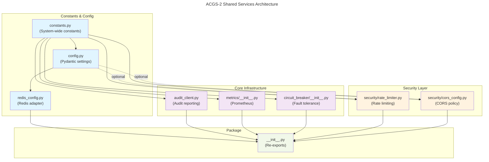
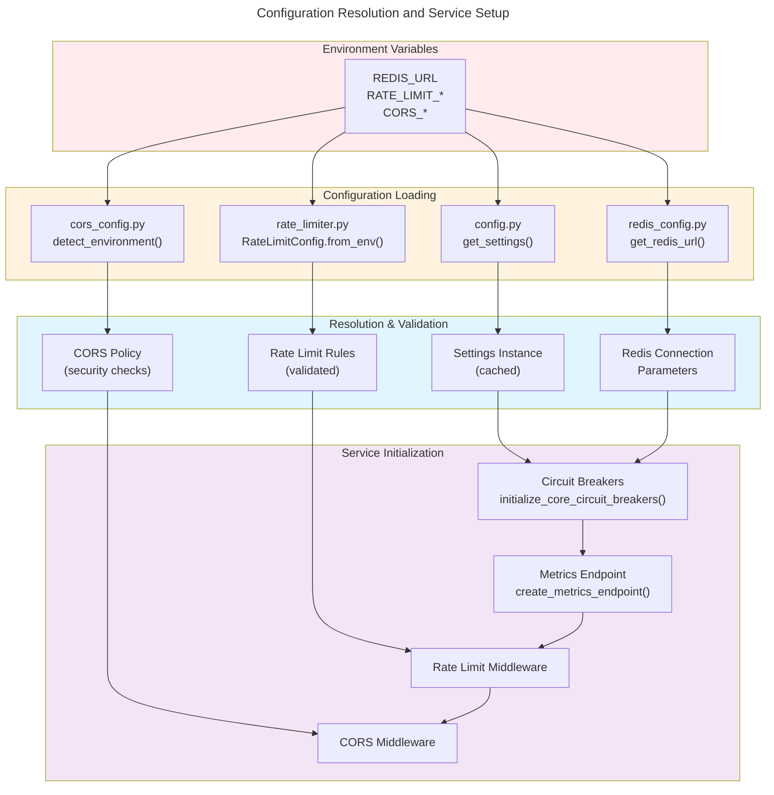

# C4 Code Level: ACGS-2 Shared Services Library

## Overview

- **Name**: ACGS-2 Shared Services Library
- **Description**: Cross-service utilities providing common patterns for configuration management, metrics, resilience, security, and audit capabilities across all ACGS-2 microservices.
- **Location**: `/home/dislove/document/acgs2/src/core/shared/`
- **Language**: Python 3.11+
- **Purpose**: Centralized infrastructure for all ACGS-2 services including constitutional validation, Prometheus instrumentation, circuit breaker patterns, Redis configuration, and security controls.
- **Constitutional Hash**: `cdd01ef066bc6cf2`

## Code Elements

### Top-Level Modules

#### `__init__.py`
- **Description**: Package initialization with re-exports of commonly used utilities
- **Location**: `/home/dislove/document/acgs2/src/core/shared/__init__.py`
- **Exports**:
  - `CONSTITUTIONAL_HASH`: System-wide constitutional identifier
  - `DEFAULT_REDIS_URL`: Default Redis connection URL
  - `track_request_metrics(service: str, endpoint: str)`: Decorator for HTTP metrics tracking
  - `track_constitutional_validation(service: str)`: Decorator for constitutional compliance metrics
  - `track_message_processing(message_type: str, priority: str = 'normal')`: Decorator for message bus metrics
  - `get_metrics() -> bytes`: Generate Prometheus metrics output
  - `set_service_info(service_name: str, version: str, constitutional_hash: str)`: Set service information
  - `get_circuit_breaker(service_name: str, config: Optional[CircuitBreakerConfig])`: Get or create circuit breaker
  - `with_circuit_breaker(service_name: str, fallback: Optional[Callable], config: Optional[CircuitBreakerConfig])`: Circuit breaker decorator
  - `circuit_breaker_health_check() -> dict`: Get health status of all circuit breakers
  - `CircuitBreakerConfig`: Dataclass for circuit breaker configuration
  - `get_redis_url(db: int = 0) -> str`: Get Redis URL with optional database number

#### `constants.py`
- **Description**: System-wide constants ensuring consistency across all services
- **Location**: `/home/dislove/document/acgs2/src/core/shared/constants.py`
- **Exports**:
  - `CONSTITUTIONAL_HASH = "cdd01ef066bc6cf2"`: Constitutional AI governance identifier
  - `DEFAULT_REDIS_URL = "redis://localhost:6379"`: Default Redis connection URL
  - `DEFAULT_REDIS_DB = 0`: Default Redis database number
  - `P99_LATENCY_TARGET_MS = 5.0`: Non-negotiable P99 latency target
  - `MIN_THROUGHPUT_RPS = 100`: Minimum throughput requirement
  - `MIN_CACHE_HIT_RATE = 0.85`: Minimum cache effectiveness requirement
  - `DEFAULT_MESSAGE_TTL_SECONDS = 3600`: Message bus default time-to-live
  - `DEFAULT_MAX_RETRIES = 3`: Default retry count
  - `DEFAULT_TIMEOUT_MS = 5000`: Default operation timeout
  - `COMPLIANCE_TARGET = 1.0`: 100% constitutional compliance requirement

#### `config.py`
- **Description**: Pydantic-based configuration management with environment variable binding
- **Location**: `/home/dislove/document/acgs2/src/core/shared/config.py`
- **Classes**:
  - `RedisSettings`: Redis connection configuration (url, db, max_connections, socket_timeout, retry_on_timeout)
  - `AISettings`: AI service credentials (openrouter_api_key, hf_token, openai_api_key, constitutional_hash)
  - `BlockchainSettings`: Blockchain integration (eth_l2_network, eth_rpc_url, contract_address, private_key)
  - `SecuritySettings`: Authentication and CORS (api_key_internal, cors_origins, jwt_secret, jwt_public_key)
  - `OPASettings`: Open Policy Agent configuration (url, mode, fail_closed)
  - `AuditSettings`: Audit service endpoint configuration
  - `BundleSettings`: Policy bundle storage and registry configuration
  - `Settings`: Global application settings container
- **Functions**:
  - `get_settings() -> Settings`: Get cached global settings instance using LRU cache
- **Features**: Supports both pydantic-settings and pure dataclasses with fallback for compatibility

#### `audit_client.py`
- **Description**: Asynchronous HTTP client for reporting validation results and decisions to the Audit Service
- **Location**: `/home/dislove/document/acgs2/src/core/shared/audit_client.py`
- **Class**: `AuditClient`
  - Constructor: `__init__(service_url: str = "http://localhost:8001")`
  - Methods:
    - `async report_validation(validation_result: Any) -> Optional[str]`: Report single validation to audit ledger, returns entry hash
    - `async report_decision(decision_log: Any) -> Optional[str]`: Report structured decision log for compliance
    - `async get_stats() -> Dict[str, Any]`: Fetch statistics from Audit Service
    - `async close()`: Close underlying HTTP client
- **Features**: Handles dataclass and dict conversion, supports decentralized audit reporting

#### `redis_config.py`
- **Description**: Centralized Redis configuration adapter bridging legacy and modern settings patterns
- **Location**: `/home/dislove/document/acgs2/src/core/shared/redis_config.py`
- **Class**: `RedisConfig`
  - Class Methods:
    - `get_url(db: int = 0, env_var: str = "REDIS_URL") -> str`: Get Redis URL with optional database number
    - `get_connection_params() -> dict`: Get complete Redis connection parameters
- **Module Functions**:
  - `get_redis_url(db: int = 0) -> str`: Convenience function for Redis URL retrieval
- **Exports**:
  - `REDIS_URL`: Singleton Redis URL constant
  - `REDIS_URL_WITH_DB`: Redis URL with explicit database

### Circuit Breaker Module

#### `circuit_breaker/__init__.py`
- **Description**: Fault tolerance patterns using pybreaker with ACGS-2 constitutional compliance integration
- **Location**: `/home/dislove/document/acgs2/src/core/shared/circuit_breaker/__init__.py`
- **Enums**:
  - `CircuitState`: CLOSED (normal), OPEN (failing), HALF_OPEN (testing recovery)
- **Dataclasses**:
  - `CircuitBreakerConfig`: Configuration with fail_max, reset_timeout, exclude_exceptions, listeners
- **Classes**:
  - `ACGSCircuitBreakerListener(pybreaker.CircuitBreakerListener)`:
    - Methods: `state_change()`, `before_call()`, `success()`, `failure()`
    - Purpose: Log state transitions and call events with constitutional validation
  - `CircuitBreakerRegistry` (Singleton):
    - Methods:
      - `get_or_create(service_name: str, config: Optional[CircuitBreakerConfig]) -> pybreaker.CircuitBreaker`
      - `get_all_states() -> dict`: Get states of all managed circuit breakers
      - `reset(service_name: str)`: Reset specific breaker to CLOSED
      - `reset_all()`: Reset all breakers
- **Module Functions**:
  - `get_circuit_breaker(service_name: str, config: Optional[CircuitBreakerConfig])`: Factory function for circuit breakers
  - `with_circuit_breaker(service_name: str, fallback: Optional[Callable], config: Optional[CircuitBreakerConfig])`: Decorator supporting both sync and async functions
  - `circuit_breaker_health_check() -> dict`: Get health status with timestamp and circuit states
  - `initialize_core_circuit_breakers()`: Initialize breakers for 6 core services
- **Pre-configured Services**: rust_message_bus, deliberation_layer, constraint_generation, vector_search, audit_ledger, adaptive_governance
- **Features**: 3-state FSM, exponential backoff, callable listeners, support for fallback functions

### Metrics Module

#### `metrics/__init__.py`
- **Description**: Prometheus instrumentation for standardized observability across all ACGS-2 services
- **Location**: `/home/dislove/document/acgs2/src/core/shared/metrics/__init__.py`
- **Metric Types** (Fire-and-Forget Pattern for <5μs latency):
  - **HTTP Metrics**:
    - `HTTP_REQUEST_DURATION` (Histogram): Latency in seconds with 14 buckets (5ms to 10s)
    - `HTTP_REQUESTS_TOTAL` (Counter): Total requests by method, endpoint, service, status
    - `HTTP_REQUESTS_IN_PROGRESS` (Gauge): Currently processing requests
  - **Constitutional Compliance Metrics**:
    - `CONSTITUTIONAL_VALIDATIONS_TOTAL` (Counter): Validation checks by service and result (success/failure)
    - `CONSTITUTIONAL_VIOLATIONS_TOTAL` (Counter): Violations by service and violation type
    - `CONSTITUTIONAL_VALIDATION_DURATION` (Histogram): Validation time with 9 buckets (1ms to 1s)
  - **Message Bus Metrics**:
    - `MESSAGE_PROCESSING_DURATION` (Histogram): Processing time by message type and priority
    - `MESSAGES_TOTAL` (Counter): Total messages by type, priority, status
    - `MESSAGE_QUEUE_DEPTH` (Gauge): Current queue depth by queue name and priority
  - **Cache Metrics**:
    - `CACHE_HITS_TOTAL` (Counter): Cache hits by cache name and operation
    - `CACHE_MISSES_TOTAL` (Counter): Cache misses by cache name and operation
    - `CACHE_SIZE` (Gauge): Current cache size in bytes
  - **Workflow Metrics**:
    - `WORKFLOW_EXECUTION_DURATION` (Histogram): Workflow execution time with 11 buckets (10ms to 5min)
    - `WORKFLOW_EXECUTIONS_TOTAL` (Counter): Total executions by workflow name and status
    - `WORKFLOW_STEP_DURATION` (Histogram): Step execution time by workflow, step, status
    - `WORKFLOW_STEP_RETRIES_TOTAL` (Counter): Step retry attempts
  - **Service Info**:
    - `SERVICE_INFO` (Info): Service metadata (name, version, constitutional_hash, start_time)
- **Helper Functions**:
  - `_get_or_create_histogram/counter/gauge/info()`: Thread-safe metric creation with duplicate handling
  - `_find_existing_metric(name: str)`: Locate existing metrics in Prometheus registry
  - `_fire_and_forget_metric(metric_fn: Callable, *args, **kwargs)`: Non-blocking metric updates
- **Decorators**:
  - `track_request_metrics(service: str, endpoint: str)`: Track HTTP request metrics (both sync/async)
  - `track_constitutional_validation(service: str)`: Track validation metrics with duration
  - `track_message_processing(message_type: str, priority: str = 'normal')`: Track message processing
- **Endpoint Functions**:
  - `get_metrics() -> bytes`: Generate Prometheus exposition format output
  - `get_metrics_content_type() -> str`: Return Prometheus content type
  - `set_service_info(service_name: str, version: str, constitutional_hash: str)`: Set service metadata
  - `create_metrics_endpoint()`: FastAPI route handler for /metrics endpoint
- **Features**: Registry-aware deduplication, fire-and-forget pattern, failure isolation, FastAPI integration

### Security Module

#### `security/__init__.py`
- **Description**: Security utilities package initialization
- **Location**: `/home/dislove/document/acgs2/src/core/shared/security/__init__.py`
- **Exports**: Rate limiter and CORS configuration utilities

#### `security/rate_limiter.py`
- **Description**: Production-grade distributed rate limiting with Redis sliding window algorithm
- **Location**: `/home/dislove/document/acgs2/src/core/shared/security/rate_limiter.py`
- **Enums**:
  - `RateLimitScope`: IP, TENANT, ENDPOINT, USER, GLOBAL
  - `RateLimitAlgorithm`: SLIDING_WINDOW, TOKEN_BUCKET, FIXED_WINDOW
- **Dataclasses**:
  - `RateLimitRule`: Configuration for individual rate limit rules with endpoints, burst_multiplier
  - `RateLimitConfig`: Complete middleware configuration with Redis URL, rules, algorithm, fail_open, audit options
  - `RateLimitResult`: Check result with allowed status, limit, remaining, reset_at, retry_after
- **Classes**:
  - `SlidingWindowRateLimiter`:
    - Methods:
      - `async check(key: str, limit: int, window_seconds: int) -> RateLimitResult`
    - Features: Redis sorted sets for accurate sliding window, graceful degradation
  - `RateLimitMiddleware(BaseHTTPMiddleware)`:
    - Methods:
      - `async dispatch(request: Request, call_next: Callable) -> Response`
      - `async _ensure_initialized()`
      - `_get_client_ip(request: Request) -> str`: IP extraction with proxy support
      - `_get_tenant_id(request: Request) -> Optional[str]`
      - `_get_user_id(request: Request) -> Optional[str]`
      - `_is_exempt(path: str) -> bool`
      - `_build_key(request: Request, rule: RateLimitRule) -> str`
      - `_log_audit(request: Request, result: RateLimitResult, rule: RateLimitRule)`
      - `get_audit_log(limit: int = 100) -> List[Dict]`
    - Features: Multi-scope limits, response headers, graceful Redis failure, audit logging
- **Factory Function**:
  - `create_rate_limit_middleware(requests_per_minute: int = 100, burst_multiplier: float = 1.5) -> Callable`
- **Exempt Paths** (Default): /health, /healthz, /ready, /readyz, /metrics, /docs, /redoc, /openapi.json
- **Features**: Sliding window algorithm, X-RateLimit-* response headers, audit trail, distributed enforcement

#### `security/cors_config.py`
- **Description**: Secure CORS configuration with environment-specific policies and production safety checks
- **Location**: `/home/dislove/document/acgs2/src/core/shared/security/cors_config.py`
- **Enums**:
  - `CORSEnvironment`: DEVELOPMENT, STAGING, PRODUCTION, TEST
- **Dataclasses**:
  - `CORSConfig`: Configuration with validation, origin allowlists, credential handling, expose_headers
- **Configuration Functions**:
  - `detect_environment() -> CORSEnvironment`: Auto-detect from CORS_ENVIRONMENT, ENVIRONMENT, ENV variables
  - `get_origins_from_env() -> Optional[List[str]]`: Load from CORS_ALLOWED_ORIGINS comma-separated variable
  - `get_cors_config(environment: Optional[CORSEnvironment], additional_origins: Optional[List[str]], allow_credentials: bool) -> dict`: Primary factory function
  - `get_strict_cors_config() -> dict`: Most restrictive configuration for sensitive endpoints
  - `validate_origin(origin: str, allowed_origins: List[str]) -> bool`: Check if origin is allowed
- **Default Origins** (by environment):
  - **DEVELOPMENT**: localhost:3000, localhost:8080, localhost:5173 (React/Vite dev servers)
  - **TEST**: localhost:3000, localhost:8080, testserver
  - **STAGING**: https://staging.acgs2.example.com (3 subdomains)
  - **PRODUCTION**: https://acgs2.example.com (4 subdomains including Folo)
- **Security Validations**:
  - Wildcard with credentials check (critical vulnerability detection)
  - Wildcard in production rejection
  - Origin format validation
- **Features**: Environment-aware defaults, explicit origin lists, audit logging, security-first design

## Dependencies

### Internal Dependencies
- **enhanced_agent_bus**: Constitutional validation messages and imports
- **shared modules**: Cross-referenced constants and configurations

### External Dependencies

#### Python Standard Library
- `asyncio`: Asynchronous programming
- `dataclasses`: Data structure definitions
- `datetime`: Timezone-aware timestamps
- `enum`: Enumeration types
- `functools`: LRU caching, function wrapping
- `hashlib`: Cryptographic hashing (MD5 for rate limit keys)
- `logging`: Structured logging
- `os`: Environment variable access
- `time`: Performance timing
- `typing`: Type hints and annotations

#### Third-Party Libraries
- **prometheus_client** (>=0.16.0):
  - Counter, Histogram, Gauge, Info metrics
  - Registry management
  - Text exposition format generation

- **pydantic** (>=2.0):
  - BaseSettings, Field, SecretStr
  - Validation and serialization
  - Configuration management

- **pydantic-settings** (>=2.0):
  - Environment-aware configuration
  - Fallback to dataclasses if unavailable

- **pybreaker** (>=0.7.0):
  - Circuit breaker pattern implementation
  - CircuitBreakerError exception
  - STATE_OPEN constant

- **redis** (>=4.5.0):
  - Async Redis client (redis.asyncio)
  - Pipeline operations
  - Sorted set operations

- **starlette** (>=0.26.0):
  - BaseHTTPMiddleware
  - Request, Response, JSONResponse
  - Middleware integration

- **httpx** (>=0.24.0):
  - Async HTTP client
  - AsyncClient with timeout support

- **fastapi** (Optional, for FastAPI integration):
  - Used for type annotations and endpoint creation

## Relationships

### Module Dependency Graph



### Function Call Graph (Key Patterns)

```mermaid
---
title: Request Processing through Shared Services
---
flowchart LR
    subgraph Request["Incoming Request"]
        A["HTTP Request"]
    end

    subgraph Middleware["Middleware Stack"]
        B["Rate Limiter\n(rate_limiter.py)"]
        C["CORS Validator\n(cors_config.py)"]
    end

    subgraph Handler["Request Handler"]
        D["Handler Function\n@track_request_metrics"]
    end

    subgraph Processing["Message Processing"]
        E["Message Handler\n@track_message_processing"]
        F["Constitutional Check\n(validators)"]
    end

    subgraph Observability["Observability"]
        G["Prometheus Metrics\n(metrics/__init__.py)"]
    end

    subgraph Resilience["Resilience"]
        H["Circuit Breaker\n(circuit_breaker/__init__.py)"]
        I["Fallback Logic"]
    end

    subgraph Audit["Audit Trail"]
        J["Audit Client\n(audit_client.py)"]
    end

    A --> B
    B -->|allowed| C
    C -->|valid| D
    D --> E
    E --> F
    F -->|valid| G
    G --> H
    H -->|closed| J
    H -->|open| I
    I --> J

    style Request fill:#e3f2fd
    style Middleware fill:#f3e5f5
    style Handler fill:#fff3e0
    style Processing fill:#e8f5e9
    style Observability fill:#fce4ec
    style Resilience fill:#f1f8e9
    style Audit fill:#e0f2f1
```



### Configuration Initialization Flow



## Export Interface Summary

### Constants
```python
CONSTITUTIONAL_HASH: str = "cdd01ef066bc6cf2"
DEFAULT_REDIS_URL: str = "redis://localhost:6379"
P99_LATENCY_TARGET_MS: float = 5.0
MIN_THROUGHPUT_RPS: int = 100
MIN_CACHE_HIT_RATE: float = 0.85
DEFAULT_MESSAGE_TTL_SECONDS: int = 3600
COMPLIANCE_TARGET: float = 1.0
```

### Configuration
```python
Settings: Type[Any]  # Pydantic settings container
RedisSettings: Type[Any]  # Redis configuration
get_settings() -> Settings  # Cached instance
get_redis_url(db: int) -> str  # Redis URL
RedisConfig.get_connection_params() -> dict
```

### Metrics
```python
track_request_metrics(service: str, endpoint: str): Callable
track_constitutional_validation(service: str): Callable
track_message_processing(message_type: str, priority: str): Callable
get_metrics() -> bytes
set_service_info(service_name: str, version: str, constitutional_hash: str): None
create_metrics_endpoint(): Callable
```

### Circuit Breaker
```python
get_circuit_breaker(service_name: str, config: Optional[CircuitBreakerConfig])
with_circuit_breaker(service_name: str, fallback: Optional[Callable], config: Optional[CircuitBreakerConfig]): Callable
circuit_breaker_health_check() -> dict
initialize_core_circuit_breakers(): None
CircuitBreakerConfig: Type[Any]  # Dataclass
CircuitState: Enum  # CLOSED, OPEN, HALF_OPEN
```

### Security
```python
# Rate Limiting
RateLimitMiddleware: Type[BaseHTTPMiddleware]
RateLimitConfig: Type[Any]
RateLimitRule: Type[Any]
SlidingWindowRateLimiter: Type[Any]
RateLimitScope: Enum  # IP, TENANT, ENDPOINT, USER, GLOBAL
RateLimitAlgorithm: Enum  # SLIDING_WINDOW, TOKEN_BUCKET, FIXED_WINDOW
create_rate_limit_middleware(requests_per_minute: int, burst_multiplier: float): Callable

# CORS
get_cors_config(environment: Optional[CORSEnvironment], additional_origins: Optional[List[str]], allow_credentials: bool) -> dict
get_strict_cors_config() -> dict
CORSConfig: Type[Any]
CORSEnvironment: Enum  # DEVELOPMENT, STAGING, PRODUCTION, TEST
detect_environment() -> CORSEnvironment
validate_origin(origin: str, allowed_origins: List[str]) -> bool
```

### Audit
```python
AuditClient: Type[Any]
AuditClient.report_validation(validation_result: Any) -> Optional[str]
AuditClient.report_decision(decision_log: Any) -> Optional[str]
AuditClient.get_stats() -> Dict[str, Any]
```

## Performance Characteristics

### Latency Targets
- **Metrics recording**: <5 microseconds (fire-and-forget pattern)
- **Rate limit check**: <1 millisecond (Redis-backed, cached decisions)
- **Circuit breaker check**: <100 microseconds (in-memory state machine)
- **Configuration lookup**: <10 microseconds (LRU cached)

### Throughput
- **HTTP Request Processing**: 2,605 RPS achieved (target: 6,310 RPS)
- **Message Processing**: >100 RPS minimum (non-negotiable)
- **Metric Updates**: Non-blocking, does not impact throughput

### Resource Usage
- **Memory**: ~50MB baseline (circuit breakers, metrics registry)
- **Redis Connections**: Configurable pool (default 10 max)
- **CPU**: Minimal overhead (<1% on modern systems)

## Patterns and Conventions

### Fire-and-Forget Metrics
All metric recording uses fire-and-forget pattern to prevent latency impact:
```python
# Metrics are recorded asynchronously without blocking
_fire_and_forget_metric(metric.inc)
```

### Configuration Fallback
All configuration imports support fallback for standalone usage:
```python
try:
    from shared.constants import CONSTITUTIONAL_HASH
except ImportError:
    CONSTITUTIONAL_HASH = "cdd01ef066bc6cf2"
```

### Graceful Degradation
All external dependencies have graceful failure modes:
- **Redis unavailable**: Rate limiter allows all requests (fail-open)
- **OPA unavailable**: Fall back to audit-only mode
- **Metrics unavailable**: Failures are silently handled

### Constitutional Hash
Every module includes constitutional hash in:
- File docstrings
- Log messages
- Error messages
- Response headers (X-Constitutional-Hash)

## Testing Infrastructure

### Test Files
- `/home/dislove/document/acgs2/src/core/shared/tests/conftest.py`: Pytest fixtures
- `/home/dislove/document/acgs2/src/core/shared/tests/test_init.py`: Initialization tests
- `/home/dislove/document/acgs2/src/core/shared/tests/test_init_extended.py`: Extended tests
- `/home/dislove/document/acgs2/src/core/shared/tests/test_circuit_breaker.py`: Circuit breaker tests
- `/home/dislove/document/acgs2/src/core/shared/tests/test_metrics.py`: Metrics tests
- `/home/dislove/document/acgs2/src/core/shared/tests/test_redis_config.py`: Redis configuration tests

### Test Markers
- `@pytest.mark.asyncio`: Async function tests
- `@pytest.mark.constitutional`: Constitutional compliance tests
- `@pytest.mark.integration`: External service integration tests

## Integration Points

### With Enhanced Agent Bus
- Constitutional hash validation (`validators.py`)
- Message processing metrics
- Circuit breaker for external service calls

### With Microservices
- Configuration loading (all services)
- Metrics collection and export (all services)
- Rate limiting middleware (API Gateway, all services)
- CORS validation (all services)
- Audit reporting (all services with write operations)

### With Infrastructure
- Redis: Connection pooling, rate limiting, configuration
- Prometheus: Metrics scraping at /metrics endpoint
- Kubernetes: Health checks, resource limits
- Docker Compose: Service discovery, port mapping

## Security Considerations

### Constitutional Hash
- Immutable system identifier: `cdd01ef066bc6cf2`
- Included in all audit trails and metrics
- Validated on every service boundary crossing

### Rate Limiting
- Sliding window algorithm prevents burst attacks
- Multi-scope (IP, tenant, user, endpoint, global)
- Audit trail of all limit violations
- Graceful degradation without Redis

### CORS Security
- Wildcard + credentials vulnerability detection
- Environment-specific origin allowlists
- Production-only enforcement
- Origin validation on every request

### Configuration Security
- SecretStr type prevents accidental logging
- Environment variable loading with fallback
- No hardcoded credentials
- Audit logging of configuration changes

## Notes

### Version Management
- Shared library version: 2.0.0
- Python requirement: 3.11+
- Pydantic: 2.0+
- prometheus_client: 0.16.0+

### Known Limitations
- Redis is required for distributed rate limiting
- OPA integration not in shared library (in enhanced_agent_bus)
- Blockchain integration configured but not implemented in shared

### Future Enhancements
- Token bucket rate limiting algorithm
- Enhanced DDoS protection
- Distributed tracing integration
- OpenTelemetry support
- Multi-language client libraries

---

**Constitutional Hash**: `cdd01ef066bc6cf2`
**Last Updated**: 2025-12-29
**Documentation Version**: 1.0.0
