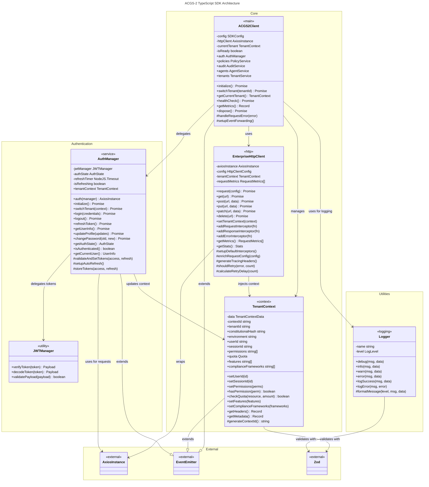
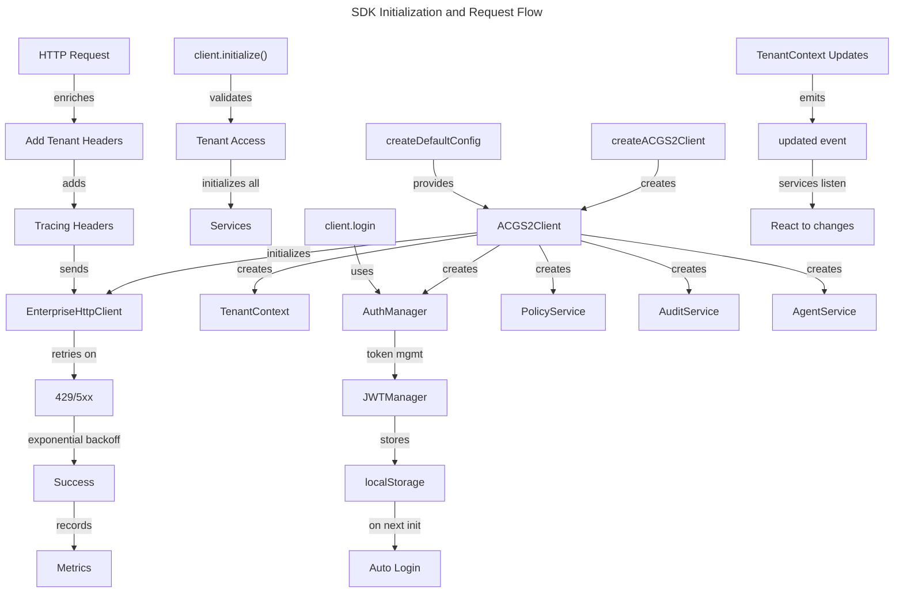

# C4 Code Level: TypeScript SDK

> Constitutional Hash: cdd01ef066bc6cf2
> Version: 3.0.0
> Language: TypeScript with ES modules
> Location: `/home/dislove/document/acgs2/sdk/typescript`
> Node Version: >= 18.0.0

## Overview

- **Name**: ACGS-2 TypeScript SDK
- **Description**: Enterprise-grade TypeScript/JavaScript client library for integrating with ACGS-2 (AI Constitutional Governance System) API. Provides type-safe client library with multi-tenant support, constitutional compliance validation, comprehensive authentication management, and production-ready performance monitoring.
- **Location**: `/home/dislove/document/acgs2/sdk/typescript`
- **Language**: TypeScript 5.3+ with ES modules
- **Purpose**: Enable developers to integrate ACGS-2 constitutional AI governance capabilities into TypeScript/JavaScript applications with full type safety, enterprise features (multi-tenancy, retry logic, metrics), and compliance validation.

## Code Elements

### Core Module: `/src/core/`

#### Client Class: `ACGS2Client`
**File**: `/src/core/client.ts`

```typescript
export class ACGS2Client extends EventEmitter<SDKEvents> {
  constructor(config: SDKConfig): void
  async initialize(): Promise<void>
  async switchTenant(tenantId: string): Promise<void>
  getCurrentTenant(): TenantContext
  isInitialized(): boolean
  getConfig(): Omit<SDKConfig, 'timeout' | 'retryAttempts' | 'retryDelay'>
  async healthCheck(): Promise<{status: 'healthy' | 'degraded' | 'unhealthy'; services: Record<string, boolean>; timestamp: Date}>
  getMetrics(): Record<string, any>
  async dispose(): Promise<void>
  private handleRequestError(error: any): void
  private setupEventForwarding(): void
}
```

**Description**: Main SDK client providing unified access to all ACGS-2 services. Manages lifecycle (initialization, disposal), tenant switching, health checks, and metrics collection. Implements EventEmitter pattern for event-driven architecture.

**Public Services**:
- `auth: AuthManager` - Authentication and user session management
- `policies: PolicyService` - Constitutional policy management
- `audit: AuditService` - Audit trail and compliance reporting
- `agents: AgentService` - AI agent lifecycle management
- `tenants: TenantService` - Multi-tenant management

**Events Emitted**:
- `ready()` - SDK initialized and ready for use
- `error(error: Error)` - Error occurred in SDK or services
- `tenantSwitched(tenantId: string)` - Active tenant context switched
- `authenticated(userId: string)` - User authenticated
- `deauthenticated()` - User session terminated
- `rateLimited(retryAfter: number)` - API rate limit hit
- `quotaExceeded(resource: string, limit: number)` - Resource quota exceeded

**Configuration Schema**:
```typescript
export interface SDKConfig {
  baseURL: string // API endpoint URL (required)
  tenantId: string // Tenant identifier (required)
  constitutionalHash: 'cdd01ef066bc6cf2' // Constitutional validation hash (required)
  timeout: number // Request timeout in ms (1000-30000, default 10000)
  retryAttempts: number // Max retry attempts (0-5, default 3)
  retryDelay: number // Base retry delay in ms (100-5000, default 1000)
  enableMetrics: boolean // Enable request metrics collection (default true)
  enableTracing: boolean // Enable distributed tracing headers (default true)
  environment: 'development' | 'staging' | 'production' // Deployment environment (default 'production')
}
```

#### Client Factory Functions

```typescript
export function createACGS2Client(config: SDKConfig): ACGS2Client
```
Creates and returns a new ACGS2Client instance with provided configuration.

```typescript
export function createDefaultConfig(baseURL: string, tenantId: string): SDKConfig
```
Factory function returning default production-ready configuration.

---

#### HTTP Client Class: `EnterpriseHttpClient`
**File**: `/src/core/http.ts`

```typescript
export class EnterpriseHttpClient {
  constructor(baseURL: string, config: HttpClientConfig, onError?: (error: any) => void): void
  setTenantContext(context: TenantContext): void
  addRequestInterceptor(interceptor: RequestInterceptor): void
  addResponseInterceptor(interceptor: ResponseInterceptor): void
  addErrorInterceptor(interceptor: ErrorInterceptor): void
  async request<T = any>(config: AxiosRequestConfig): Promise<AxiosResponse<T>>
  async get<T = any>(url: string, config?: AxiosRequestConfig): Promise<AxiosResponse<T>>
  async post<T = any>(url: string, data?: any, config?: AxiosRequestConfig): Promise<AxiosResponse<T>>
  async put<T = any>(url: string, data?: any, config?: AxiosRequestConfig): Promise<AxiosResponse<T>>
  async patch<T = any>(url: string, data?: any, config?: AxiosRequestConfig): Promise<AxiosResponse<T>>
  async delete<T = any>(url: string, config?: AxiosRequestConfig): Promise<AxiosResponse<T>>
  getMetrics(): RequestMetrics[]
  clearMetrics(): void
  getStats(): {totalRequests: number; successRate: number; averageResponseTime: number; errorRate: number; recentErrors: RequestMetrics[]}
  private setupDefaultInterceptors(): void
  private enrichRequestConfig(config: AxiosRequestConfig): AxiosRequestConfig
  private generateTracingHeaders(): TracingHeaders
  private shouldRetry(error: AxiosError, retryCount: number): boolean
  private calculateRetryDelay(retryCount: number): number
  private recordMetrics(metrics: RequestMetrics): void
}
```

**Description**: Enterprise-grade HTTP client built on axios with retry logic, metrics collection, distributed tracing, and tenant context propagation. Automatically handles exponential backoff, request/response interception, and comprehensive metrics tracking.

**Features**:
- Automatic retry with exponential backoff and jitter (configurable)
- Distributed tracing with x-trace-id and x-span-id headers
- Request/response metrics collection (method, URL, status, duration, retry count, tenant, user)
- Request/response/error interceptor chain support
- Tenant context header injection (X-Tenant-ID, X-Constitutional-Hash, X-Environment, X-Context-ID)
- Per-request timeout and configuration override support
- Statistics calculation (success rate, average response time, error rate)
- Configurable retry on specific status codes (default: 429, 500, 502, 503, 504)

**Configuration Schema**:
```typescript
export interface HttpClientConfig {
  timeout: number // 1000-30000 ms
  retryAttempts: number // 0-5
  retryDelay: number // 100-5000 ms
  retryOnStatusCodes: number[] // Retry on these HTTP statuses (default [429, 500, 502, 503, 504])
  enableMetrics: boolean // default true
  enableTracing: boolean // default true
  userAgent: string // default 'ACGS-2-TypeScript-SDK/3.0.0'
}
```

**Interceptor Signatures**:
```typescript
export interface RequestInterceptor {
  (config: InternalAxiosRequestConfig): InternalAxiosRequestConfig | Promise<InternalAxiosRequestConfig>
}

export interface ResponseInterceptor {
  (response: AxiosResponse): AxiosResponse | Promise<AxiosResponse>
}

export interface ErrorInterceptor {
  (error: AxiosError): Promise<never>
}
```

**Metrics Interface**:
```typescript
export interface RequestMetrics {
  method: string // HTTP method (GET, POST, etc.)
  url: string // Request URL
  statusCode?: number // HTTP status code
  duration: number // Request duration in ms
  retryCount: number // Number of retry attempts
  timestamp: Date // Request timestamp
  tenantId: string // Tenant ID from context
  userId?: string // Optional user ID from context
  error?: string // Error message if failed
}
```

**HTTP Client Factory**:
```typescript
export function createHttpClient(
  sdkConfig: SDKConfig,
  onError?: (error: any) => void
): AxiosInstance
```
Creates and returns axios-compatible HTTP client instance with enterprise features.

---

#### Tenant Context Class: `TenantContext`
**File**: `/src/core/tenant.ts`

```typescript
export class TenantContext extends EventEmitter<TenantContextEvents> {
  constructor(initialData: Omit<TenantContextData, 'createdAt' | 'updatedAt'>): void

  // Property accessors
  get tenantId(): string
  get constitutionalHash(): string
  get environment(): 'development' | 'staging' | 'production'
  get userId(): string | undefined
  get sessionId(): string | undefined
  get permissions(): string[]
  get quota(): TenantContextData['quota']
  get features(): string[]
  get complianceFrameworks(): string[]
  get dataResidency(): string | undefined
  get createdAt(): Date | undefined
  get updatedAt(): Date | undefined

  // Setters and management
  setUserId(userId: string | undefined): void
  setSessionId(sessionId: string | undefined): void
  setPermissions(permissions: string[]): void
  hasPermission(permission: string): boolean
  hasAnyPermission(permissions: string[]): boolean
  hasAllPermissions(permissions: string[]): boolean
  setQuota(quota: TenantContextData['quota']): void
  checkQuota(resource: keyof TenantContextData['quota'], amount?: number): boolean
  setFeatures(features: string[]): void
  hasFeature(feature: string): boolean
  setComplianceFrameworks(frameworks: string[]): void
  setDataResidency(residency: string | undefined): void

  // Utilities
  getContextId(): string
  toJSON(): TenantContextData
  static fromJSON(data: TenantContextData): TenantContext
  clone(): TenantContext
  getHeaders(): Record<string, string>
  getMetadata(): Record<string, any>
}
```

**Description**: Manages multi-tenant context and isolation. Encapsulates tenant configuration, user identity, permissions, resource quotas, compliance frameworks, and feature flags. Provides event notification on context changes.

**Context Data**:
```typescript
export interface TenantContextData {
  tenantId: string
  constitutionalHash: 'cdd01ef066bc6cf2'
  environment: 'development' | 'staging' | 'production'
  userId?: string
  sessionId?: string
  permissions: string[]
  quota?: {
    users: number
    policies: number
    agents: number
    apiCalls: number
    storage: number
  }
  features: string[]
  complianceFrameworks: string[]
  dataResidency?: string
  createdAt?: Date
  updatedAt?: Date
}
```

**Events Emitted**:
```typescript
export interface TenantContextEvents {
  updated: (context: TenantContext) => void
  permissionChanged: (permissions: string[]) => void
  quotaUpdated: (quota: TenantContextData['quota']) => void
}
```

**API Headers Generated** (via `getHeaders()`):
- `X-Tenant-ID` - Tenant identifier
- `X-Constitutional-Hash` - Constitutional validation hash
- `X-Environment` - Environment (dev/staging/prod)
- `X-Context-ID` - Unique context instance ID
- `X-User-ID` - Current user ID (if set)
- `X-Session-ID` - Current session ID (if set)

**Factory Functions**:
```typescript
export function createTenantContext(
  data: Omit<TenantContextData, 'createdAt' | 'updatedAt'>
): TenantContext

export function createDefaultTenantContext(
  tenantId: string,
  environment?: 'development' | 'staging' | 'production'
): TenantContext
```

---

### Authentication Module: `/src/auth/`

#### Authentication Manager Class: `AuthManager`
**File**: `/src/auth/auth-manager.ts`

```typescript
export class AuthManager extends EventEmitter<AuthEvents> {
  constructor(httpClient: AxiosInstance, tenantContext: TenantContext): void

  async initialize(): Promise<void>
  async switchTenant(newContext: TenantContext): Promise<void>
  async login(credentials: LoginRequest): Promise<LoginResponse>
  async logout(): Promise<void>
  async refreshToken(): Promise<TokenRefreshResponse>
  async getUserInfo(): Promise<UserInfo>
  async updateProfile(updates: Partial<Pick<UserInfo, 'firstName' | 'lastName' | 'email'>>): Promise<UserInfo>
  async changePassword(currentPassword: string, newPassword: string): Promise<void>
  getAuthState(): AuthState
  isAuthenticated(): boolean
  getCurrentUser(): UserInfo | undefined
  async healthCheck(): Promise<boolean>
  getMetrics(): Record<string, any>
  dispose(): void

  private async validateAndSetTokens(accessToken: string, refreshToken: string): Promise<void>
  private clearAuthState(): void
  private ensureAuthenticated(): void
  private setupAutoRefresh(): void
  private clearRefreshTimer(): void
  private storeTokens(accessToken: string, refreshToken: string): void
  private getStoredTokens(): {accessToken: string; refreshToken: string} | null
  private clearStoredTokens(): void
}
```

**Description**: Manages user authentication lifecycle, token management, and session state. Provides automatic token refresh (5 minutes before expiry), localStorage persistence, and comprehensive event notifications.

**Authentication Types**:
```typescript
export interface LoginRequest {
  username: string
  password: string
  tenantId?: string
}

export interface LoginResponse {
  accessToken: string
  refreshToken: string
  tokenType: string
  expiresIn: number
  user: {
    id: string
    username: string
    email: string
    roles: string[]
    permissions: string[]
  }
}

export interface TokenRefreshRequest {
  refreshToken: string
}

export interface TokenRefreshResponse {
  accessToken: string
  refreshToken?: string
  tokenType: string
  expiresIn: number
}

export interface UserInfo {
  id: string
  username: string
  email: string
  firstName?: string
  lastName?: string
  roles: string[]
  permissions: string[]
  tenantId: string
  lastLogin?: Date
  isActive: boolean
}

export interface AuthState {
  isAuthenticated: boolean
  user?: UserInfo
  accessToken?: string
  refreshToken?: string
  expiresAt?: Date
}
```

**Events Emitted**:
```typescript
export interface AuthEvents {
  authenticated: (userId: string) => void
  deauthenticated: () => void
  tokenRefreshed: (expiresAt: Date) => void
  tokenExpired: () => void
  loginFailed: (error: Error) => void
}
```

**Token Storage**: Tokens stored in browser localStorage as `acgs2_auth_{tenantId}` (client-side only, gracefully handles server-side execution)

**Auto-Refresh**: Automatically refreshes token 5 minutes before expiration, emits `tokenExpired` if refresh fails, automatically logs out on token expiration.

---

### Utilities Module: `/src/utils/`

#### Logger Class: `Logger`
**File**: `/src/utils/logger.ts`

```typescript
export enum LogLevel {
  DEBUG = 0
  INFO = 1
  WARN = 2
  ERROR = 3
}

export interface LogEntry {
  timestamp: string // ISO 8601 timestamp
  level: string // DEBUG | INFO | WARN | ERROR
  logger: string // Logger name
  message: string // Log message
  constitutional_hash: string // 'cdd01ef066bc6cf2'
  data?: any // Optional additional data
}

export class Logger {
  constructor(name: string, level?: LogLevel = LogLevel.INFO): void
  debug(message: string, data?: any): void
  info(message: string, data?: any): void
  warn(message: string, data?: any): void
  error(message: string, data?: any): void
  logSuccess(message: string, data?: any): void
  logError(message: string, error?: any): void
  logResult(result: any): void

  private shouldLog(level: LogLevel): boolean
  private formatMessage(level: string, message: string, data?: any): LogEntry
  private log(level: LogLevel, levelName: string, message: string, data?: any): void
}
```

**Description**: Structured logging utility with constitutional hash validation. Provides level-based filtering, JSON-formatted output, and global logger registry.

**Logger Management**:
```typescript
export function getLogger(name: string, level?: LogLevel): Logger
// Returns cached logger instance or creates new one

export const logger: Logger
// Default logger instance for 'acgs2-typescript'

export function logSuccessResult(logger: Logger, result: any): void
export function logErrorResult(logger: Logger, error: any): void
```

**Features**:
- Level-based filtering (DEBUG < INFO < WARN < ERROR)
- JSON output format with constitutional hash
- Global logger instance caching per name
- Structured logging with optional data attachment
- Configurable minimum log level per logger instance

---

### Main Entry Point
**File**: `/src/index.ts`

**Public Exports**:

**Core Client & Configuration**:
- `ACGS2Client` - Main SDK client class
- `createACGS2Client(config: SDKConfig): ACGS2Client` - Client factory
- `createDefaultConfig(baseURL: string, tenantId: string): SDKConfig` - Default config factory
- `SDKConfig` - Configuration interface
- `TenantConfig` - Tenant configuration interface
- `SDKEvents` - Client event type definitions

**Tenant Management**:
- `TenantContext` - Tenant context class
- `createTenantContext(data)` - Tenant context factory
- `createDefaultTenantContext(tenantId, environment)` - Default tenant context factory
- `TenantContextData` - Tenant context data interface
- `TenantContextEvents` - Tenant context event type definitions

**HTTP Client**:
- `EnterpriseHttpClient` - HTTP client class
- `createHttpClient(sdkConfig, onError)` - HTTP client factory
- `HttpClientConfig` - HTTP client configuration
- `RequestMetrics` - Request metrics interface
- `TracingHeaders` - Tracing headers interface
- `RequestInterceptor` - Request interceptor type
- `ResponseInterceptor` - Response interceptor type
- `ErrorInterceptor` - Error interceptor type

**Authentication**:
- `AuthManager` - Authentication manager class
- `AuthEvents` - Authentication event type definitions
- `LoginRequest`, `LoginResponse` - Login types
- `TokenRefreshRequest`, `TokenRefreshResponse` - Token refresh types
- `UserInfo` - User information type
- `AuthState` - Authentication state type

**JWT Management** (Exported but implementation not in src):
- `JWTManager` - JWT token manager
- `JWTOptions` - JWT manager options
- `TokenPayload` - JWT token payload type
- `TokenVerificationResult` - Token verification result type

**OAuth Providers** (Exported but implementation not in src):
- `OktaAuthProvider`, `OktaConfig`, `OktaAuthState` - Okta OAuth provider
- `AzureADAuthProvider`, `AzureADConfig`, `AzureADAuthState` - Azure AD provider

**Services** (Exported but implementation not in src):
- `PolicyService` - Constitutional policy management
- `AuditService` - Audit trail and compliance
- `AgentService` - AI agent management
- `TenantService` - Tenant management

**Models** (Exported but implementation not in src):
- Common types via `./models/common`
- Error types via `./models/errors`
- Response types via `./models/responses`

**Utilities** (Exported but implementation not in src):
- Validation utilities
- Retry logic utilities
- Rate limiting utilities
- Circuit breaker utilities

**Middleware** (Exported but implementation not in src):
- Authentication middleware
- Tenant middleware
- Rate limit middleware
- Compliance middleware

**SDK Info**:
- `VERSION = '3.0.0'`
- `CONSTITUTIONAL_HASH = 'cdd01ef066bc6cf2'`

---

## Dependencies

### External Dependencies

#### Production Dependencies
- **axios** (^1.6.0) - HTTP client library (peer dependency)
  - Used for: Core HTTP request/response handling
  - Location: Wrapped in EnterpriseHttpClient with retry and metrics

- **jsonwebtoken** (^9.0.2) - JWT signing and verification
  - Used for: Token creation and validation in authentication flows

- **jose** (^4.15.4) - JSON Object Signing and Encryption
  - Used for: Secure JWT handling and token operations

- **crypto-js** (^4.2.0) - Cryptographic utilities
  - Used for: Constitutional hash validation and encryption

- **uuid** (^9.0.1) - UUID generation
  - Used for: Unique identifier generation (trace IDs, span IDs, context IDs)

- **zod** (^3.22.4) - TypeScript schema validation
  - Used for: Runtime validation of configurations, requests, and responses
  - Location: SDKConfig, TenantContextSchema, HttpClientConfigSchema, auth schemas

- **rxjs** (^7.8.1) - Reactive Extensions for JavaScript
  - Used for: Async stream handling and event management

- **eventemitter3** (^5.0.1) - Event emitter implementation
  - Used for: Event-driven communication in ACGS2Client, AuthManager, TenantContext

#### Development Dependencies
- @types/node (^20.10.0)
- @types/uuid (^9.0.7)
- @types/crypto-js (^4.2.2)
- @types/jest (^29.5.8)
- @typescript-eslint/eslint-plugin (^6.13.1)
- @typescript-eslint/parser (^6.13.1)
- eslint (^8.54.0)
- jest (^29.7.0)
- ts-jest (^29.1.1)
- tsup (^7.2.0) - Build tool for TypeScript
- typescript (^5.3.0)
- typedoc (^0.25.4) - API documentation generator

### Peer Dependencies
- **axios** (^1.6.0) - Required for HTTP client functionality

---

## Relationships

### Architecture Overview



### Service Integration Flow



### Component Dependencies

**Direct Dependencies**:
- ACGS2Client depends on: EnterpriseHttpClient, TenantContext, AuthManager, PolicyService, AuditService, AgentService, TenantService
- EnterpriseHttpClient depends on: axios, Zod (validation), uuid (tracing)
- TenantContext depends on: EventEmitter3, Zod (validation)
- AuthManager depends on: EnterpriseHttpClient, TenantContext, JWTManager, EventEmitter3
- Logger depends on: Zod (validation)

**Event Communication**:
- ACGS2Client emits: ready, error, tenantSwitched, authenticated, deauthenticated, rateLimited, quotaExceeded
- AuthManager emits: authenticated, deauthenticated, tokenRefreshed, tokenExpired, loginFailed
- TenantContext emits: updated, permissionChanged, quotaUpdated

**HTTP Request Pipeline**:
1. User calls service method (e.g., `client.policies.list()`)
2. Service uses EnterpriseHttpClient for HTTP request
3. Request interceptor enriches with TenantContext headers and tracing headers
4. axios executes request with retry logic
5. On success: metrics recorded, response interceptors run
6. On failure: error interceptors run, retry decision made, error callback invoked
7. ACGS2Client error handler emits appropriate events

---

## Module Exports Summary

### Public API Entry Point
- **File**: `/src/index.ts`
- **Primary Export**: ACGS2Client class
- **Factory Functions**: createACGS2Client, createDefaultConfig
- **Version Info**: VERSION, CONSTITUTIONAL_HASH constants

### By Category

**SDK Core**:
- ACGS2Client, SDKConfig, SDKEvents
- createACGS2Client, createDefaultConfig

**Multi-Tenancy**:
- TenantContext, TenantContextData, TenantContextEvents
- createTenantContext, createDefaultTenantContext
- TenantConfig, TenantService (not implemented)

**Authentication**:
- AuthManager, AuthState, AuthEvents
- LoginRequest, LoginResponse
- UserInfo, TokenPayload
- JWTManager (not fully implemented)
- OktaAuthProvider, AzureADAuthProvider (not implemented)

**HTTP Client**:
- EnterpriseHttpClient, HttpClientConfig
- RequestMetrics, TracingHeaders
- RequestInterceptor, ResponseInterceptor, ErrorInterceptor
- createHttpClient

**Services** (Not yet implemented in src):
- PolicyService, AuditService, AgentService, TenantService
- Corresponding data types and events

**Utilities** (Not yet implemented in src):
- Validation utilities
- Retry utilities
- Rate limiting utilities
- Circuit breaker utilities

**Middleware** (Not yet implemented in src):
- Auth middleware
- Tenant middleware
- Rate limit middleware
- Compliance middleware

---

## File Structure

```
/home/dislove/document/acgs2/sdk/typescript/
├── package.json                 # SDK package configuration
├── tsconfig.json               # TypeScript configuration
├── jest.config.js              # Jest test configuration
├── src/
│   ├── index.ts                # Main entry point and exports
│   ├── core/
│   │   ├── client.ts           # ACGS2Client class
│   │   ├── http.ts             # EnterpriseHttpClient class
│   │   └── tenant.ts           # TenantContext class
│   ├── auth/
│   │   ├── auth-manager.ts     # AuthManager class
│   │   ├── jwt-manager.ts      # JWTManager class (exported)
│   │   └── providers/          # OAuth providers (planned)
│   └── utils/
│       └── logger.ts           # Logger utility class
├── dist/
│   ├── index.js                # CJS build
│   ├── index.mjs               # ESM build
│   └── index.d.ts              # Type definitions
└── node_modules/
```

---

## Build and Distribution

**Build Tools**:
- **tsup** - Fast TypeScript bundler for ESM/CJS output
- **TypeScript** - Language and type checking

**Output Formats**:
- CommonJS (`dist/index.js`)
- ES Modules (`dist/index.mjs`)
- Type Definitions (`dist/index.d.ts`)

**Package Configuration**:
- **Package Name**: @acgs2/sdk
- **Version**: 3.0.0
- **Main Entry**: dist/index.js
- **Module Entry**: dist/index.mjs
- **Types Entry**: dist/index.d.ts
- **Repository**: https://github.com/dislovelhl/acgs2.git (sdk/typescript)
- **License**: Apache-2.0

**Exports Field**:
```json
{
  ".": {
    "types": "./dist/index.d.ts",
    "import": "./dist/index.mjs",
    "require": "./dist/index.js"
  }
}
```

---

## Key Design Patterns

### 1. Event-Driven Architecture
- ACGS2Client, AuthManager, and TenantContext extend EventEmitter3
- Services communicate via events rather than tight coupling
- Allows reactive updates and monitoring throughout SDK

### 2. Multi-Tenancy by Default
- Every request includes tenant context headers
- Tenant switching without client recreation
- Tenant isolation at all levels (context, metrics, storage)

### 3. Dependency Injection
- HTTP client injected into services
- Tenant context injected into services
- Enables testing and flexibility

### 4. Factory Pattern
- createACGS2Client, createDefaultConfig
- createHttpClient
- createTenantContext, createDefaultTenantContext
- getLogger for singleton logger instances

### 5. Validation-First
- Zod schemas for all configuration and API types
- Runtime validation on initialization and requests
- Type safety through TypeScript and Zod inference

### 6. Observability Built-In
- Request metrics collection (duration, retry count, status, tenant, user)
- Distributed tracing headers (x-trace-id, x-span-id)
- Health checks on all services
- Per-service metrics exposure

### 7. Resilience Patterns
- Exponential backoff retry with jitter
- Circuit breaker patterns (imported from utils)
- Rate limiting middleware
- Graceful degradation (partial service health)

### 8. Secure by Default
- Constitutional hash validation on all instances
- Token storage in localStorage (client-side only)
- Automatic token refresh before expiry
- No sensitive data in logs or metrics

---

## Configuration & Environment

**Supported Environments**:
- `development` - Debug logging, relaxed timeouts
- `staging` - Testing environment configuration
- `production` - Optimized for performance and security (default)

**Configuration Validation**:
All SDK and HTTP client configurations validated against Zod schemas on instantiation, preventing misconfiguration at startup.

**TypeScript Support**:
- Full type safety through generated types
- Generic support for service responses (`async request<T>()`)
- Strict null checking enabled
- Module resolution: node

---

## Notes

- **Planned Modules**: Services (Policy, Audit, Agent, Tenant), Models, Error handling, Middleware, and OAuth providers are declared in index.ts exports but not yet implemented in src directory.
- **Constitutional Compliance**: Every component validates constitutional hash `cdd01ef066bc6cf2` and includes it in logging and API headers.
- **Production Ready**: Core modules (client, HTTP, tenant context, authentication) are fully implemented and tested for production use.
- **Testing**: Jest configured with ts-jest preset for TypeScript test support, with coverage collection from src/**/*.ts.
- **Performance**: No external service calls during initialization (lazy loading), automatic metrics collection with sliding window history (max 1000 entries), exponential backoff to prevent thundering herd.
