# C4 Component Level: API Gateway & Frontend Applications

## Overview

- **Name**: API Gateway & Frontend Applications
- **Description**: Unified ingress layer with enterprise SSO authentication and real-time governance dashboards providing single entry point for all ACGS-2 services with TypeScript/React visualization
- **Type**: API Gateway + Web Application Components
- **Technology**: Python FastAPI 0.115.6+ (gateway), TypeScript/React 18+ (frontend)
- **Constitutional Hash**: `cdd01ef066bc6cf2`

## Purpose

The API Gateway & Frontend Applications component provides comprehensive ingress, authentication, and user interface capabilities for the ACGS-2 ecosystem:

**API Gateway Purpose:**
- Single entry point for all ACGS-2 HTTP traffic with unified routing
- Enterprise-grade authentication supporting JWT, OIDC (OpenID Connect), and SAML 2.0
- Request proxying and intelligent routing to Enhanced Agent Bus
- Rate limiting, throttling, and request validation
- Health checks, service discovery, and metrics collection
- User feedback collection and session management

**Frontend Applications Purpose:**
- Real-time governance monitoring and constitutional compliance visualization
- Interactive analytics dashboards with customizable layouts and drag-and-drop widgets
- Natural language querying interface for governance data
- AI-powered insights and predictive analytics visualization
- Multi-metric performance dashboards with responsive design
- User-friendly governance interfaces accessible across desktop and mobile devices

## Software Features

### API Gateway Features

#### Authentication & SSO
- **OIDC Authentication**: OpenID Connect protocol support with provider registration, state management, PKCE support, and automatic token refresh
- **SAML 2.0 Integration**: Full SAML SP implementation with metadata generation, assertion validation, Single Logout (SLO), and IdP-initiated flows
- **Multi-Provider Support**: Simultaneous support for Google, Azure AD, Okta, and custom identity providers
- **Just-In-Time Provisioning**: Automatic user creation with configurable email domain allowlists, default role assignment, and group-to-role mapping
- **Session Management**: Secure cookie-based sessions with JWT signing, CSRF protection, and configurable session lifetime

#### Request Routing & Proxying
- **Intelligent Routing**: Path-based routing with catch-all proxy to Enhanced Agent Bus
- **Request Forwarding**: Header preservation, query parameter forwarding, and body pass-through
- **Service Discovery**: Dynamic service registry with health status tracking
- **Timeout Management**: Configurable request timeouts (30-second default for proxy requests)

#### Security & Compliance
- **CORS Configuration**: Flexible Cross-Origin Resource Sharing policies
- **CSRF Protection**: State parameter validation for OAuth and SAML flows
- **Secure Cookie Handling**: HTTPS-only cookies in production, SameSite protection
- **Constitutional Validation**: Cryptographic hash enforcement (`cdd01ef066bc6cf2`) at module level

#### Monitoring & Observability
- **Prometheus Metrics**: Sub-millisecond precision histograms with 14 buckets (0.1ms to 1s)
- **Request Tracking**: HTTP duration, total requests, in-progress requests with method/endpoint/status labels
- **Cache Metrics**: Hit/miss tracking, operation duration monitoring
- **Proxy Metrics**: Target service tracking, duration histograms, status code distribution
- **Connection Pool Monitoring**: Size and availability metrics for httpx, PostgreSQL, Redis pools
- **OpenTelemetry Integration**: Distributed tracing with automatic span creation

#### User Feedback Collection
- **Feedback Submission**: Async background processing with category classification (bug/feature/general)
- **Rating System**: 1-5 star ratings with aggregated statistics
- **Metadata Capture**: User agent, URL context, custom metadata support
- **Admin Analytics**: Feedback statistics endpoint with category and rating breakdowns

### Analytics Dashboard Features

#### Real-Time Monitoring Widgets

**Compliance Widget:**
- Overall constitutional compliance score with progress indicators
- Trend analysis (improving/stable/declining) with directional icons
- Violations grouped by severity (critical, high, medium, low)
- Recent violations list with framework tags and timestamps
- Severity-based filtering with dynamic API refetch
- 100% compliance state with success messaging

**Anomaly Detection Widget:**
- Real-time anomaly detection with ML-powered severity scoring
- Affected metrics visualization for each anomaly
- Severity levels (critical, high, medium, low) with color coding
- Severity score progress bars (0-100%)
- Model training status indicators
- Filterable anomaly list with detailed descriptions

**Prediction Widget:**
- 30-day violation forecast with confidence intervals
- Interactive composed chart with area fill for confidence bands
- Trend direction indicators (increasing/decreasing/stable)
- Summary statistics (mean, max, min, total predicted violations)
- Prophet-style time-series predictions with upper/lower bounds
- Custom tooltip on hover with formatted values
- Sub-5ms data transformation with React.memo optimization

**Insight Widget:**
- AI-generated executive summaries of governance state
- Business impact analysis with actionable insights
- Recommended actions for compliance improvement
- Confidence scoring with color-coded indicators (green ≥80%, yellow ≥60%, red <60%)
- Model attribution (displays which AI model generated insights)
- Cache indicator to show cached vs. fresh results
- Cache bypass on manual refresh for latest insights

#### Interactive Features

**Customizable Dashboard Layout:**
- Drag-and-drop widget repositioning with react-grid-layout
- Responsive layouts across 5 breakpoints (lg: 1200px, md: 996px, sm: 768px, xs: 480px, xxs: <480px)
- localStorage persistence with key: "acgs-analytics-dashboard-layout"
- Layout lock/unlock toggle for editing mode
- Reset to default layout functionality
- 12-column grid for desktop, reduced columns for mobile

**Natural Language Query Interface:**
- Ask questions about governance data in plain English
- Sample queries for user guidance (5 predefined examples)
- Query history with timestamps (max 5 recent queries)
- Query understanding indicator with confidence warnings
- Result display with answer text and supporting data
- Array values displayed as badge chips
- JSON/object formatting with syntax highlighting

**Data Visualization:**
- Recharts-based interactive charts (Line, Area, Composed)
- Time-series visualization with customizable axes
- Responsive charts that scale across screen sizes
- Custom tooltips with formatted metric values
- Configurable chart margins and styling

#### Performance Optimizations

**React Performance Patterns:**
- React.memo on PredictionWidget and InsightWidget to prevent unnecessary re-renders
- useCallback for stable function references in API calls
- useMemo for cached data transformations (~30 chart data points)
- Memoized CustomTooltip to prevent Recharts re-renders on mouse movement

**Loading States & Error Handling:**
- Four-state pattern (idle, loading, success, error) across all widgets
- Loading skeletons with pulse animations
- Error states with retry functionality and user-friendly messages
- Graceful degradation when API endpoints unavailable

#### Accessibility Features
- Skip links for keyboard navigation to main content and navigation
- ARIA labels on interactive elements and widgets
- Semantic HTML structure for screen reader compatibility
- Keyboard-accessible forms, buttons, and query interface
- Focus states and visual indicators for interactive elements
- Screen reader friendly tooltips with position awareness

## Code Elements

This component contains the following code-level elements:

### API Gateway (Python/FastAPI)
- [c4-code-api-gateway.md](./docs/architecture/c4/c4-code-api-gateway.md) - Unified ingress with SSO authentication, request routing, metrics collection, and health monitoring

### Analytics Dashboard (TypeScript/React)
- [c4-code-analytics-dashboard.md](./c4-code-analytics-dashboard.md) - Real-time governance metrics visualization with drag-and-drop dashboard, natural language querying, and AI-powered insights

## Interfaces

### API Gateway Interfaces

#### REST API Endpoints (FastAPI)

**Health & Service Discovery:**
```
GET /health
  → Returns: { status: "healthy", service: "api-gateway", environment: string }
  → Metrics: Tracked via @track_request_metrics
  → Purpose: Service health checks for load balancers and monitoring

GET /services
  → Returns: Dict[str, { url: string, status: string, health: string }]
  → Status Values: "running", "healthy", "unhealthy", "unreachable"
  → Timeout: 5 seconds per service health check
  → Purpose: Dynamic service discovery and health aggregation
```

**User Feedback:**
```
POST /feedback
  → Request Body: FeedbackRequest (Pydantic)
    - user_id: str
    - category: "bug" | "feature" | "general"
    - rating: int (1-5)
    - title: str
    - description: str
    - user_agent: str (optional)
    - url: str (optional)
    - metadata: JSONDict (optional)
  → Response: FeedbackResponse
    - feedback_id: str (UUID4)
    - status: str
    - timestamp: str (ISO 8601)
    - message: str
  → Background Task: Saves to /tmp/feedback/{feedback_id}.json
  → Purpose: Async user feedback collection

GET /feedback/stats
  → Response: { total_feedback: int, categories: Dict[str, int], ratings: Dict[int, int], average_rating: float }
  → Limits: Processes first 100 feedback files
  → Purpose: Admin analytics on user feedback
```

**SSO Authentication (OIDC):**
```
GET /sso/oidc/providers
  → Response: List[SSOProviderInfo]
  → Returns: Available OIDC providers with enabled status

GET /sso/oidc/login?provider={provider}&redirect_uri={optional}
  → Process: Initiate OIDC login flow with PKCE
  → Session Storage: Stores state and provider for CSRF validation
  → Response: RedirectResponse to IdP authorization endpoint

GET /sso/oidc/callback?code={code}&state={state}
  → Process: Handle IdP callback, exchange code for tokens
  → Validation: CSRF state check, email domain allowlist
  → JIT Provisioning: Auto-create user if enabled
  → Response: User info JSON with session data
  → Session: Stores user_id, email, name, roles, provider

POST /sso/oidc/logout
  → Process: RP-initiated logout with optional IdP logout
  → Response: SSOLogoutResponse with optional redirect_url
  → Session: Clears local session and OIDC state
```

**SSO Authentication (SAML 2.0):**
```
GET /sso/saml/metadata
  → Content-Type: application/xml
  → Returns: SAML SP metadata XML with ACS URL, SLS URL, signing certificate

GET /sso/saml/providers
  → Response: List[SSOProviderInfo]
  → Returns: Available SAML IdPs with enabled status

GET /sso/saml/login?provider={provider}&relay_state={optional}&force_authn={bool}
  → Process: SP-initiated SAML login with AuthnRequest generation
  → Session Storage: Request ID, provider, relay state
  → Response: RedirectResponse to IdP SSO endpoint

POST /sso/saml/acs
  → Form Parameters: SAMLResponse (base64), RelayState (optional)
  → Validation: Signature, timestamp, audience, replay detection, issuer
  → JIT Provisioning: Auto-create user with SAML attributes
  → Response: User info JSON with session_index for SLO
  → Session: Stores NameID, session_index, name_id_format for logout

POST /sso/saml/sls (Single Logout Service)
  → Supports: SP-initiated and IdP-initiated logout
  → Process: Validates logout request/response, clears session
  → Response: SSOLogoutResponse or LogoutRequest acknowledgment

POST /sso/saml/logout
  → Process: SP-initiated SLO with LogoutRequest to IdP
  → Response: SSOLogoutResponse with IdP logout redirect
```

**Request Proxying:**
```
GET|POST|PUT|DELETE|PATCH /{path:path}
  → Catch-All Route: Forwards all unmatched requests to Enhanced Agent Bus
  → Target: {AGENT_BUS_URL}/{path}?{query_params}
  → Headers: Forwards all original request headers
  → Body: Pass-through without modification
  → Content-Type Detection: Parses JSON responses automatically
  → Timeout: 30 seconds (configurable via httpx AsyncClient)
  → Error Codes:
    - 502: httpx.RequestError (Service unavailable)
    - 500: Generic exceptions (Internal server error)
```

**Metrics Export (Prometheus):**
```
GET /metrics
  → Content-Type: application/openmetrics-text; version=1.0.0; charset=utf-8
  → Returns: Prometheus metrics in OpenMetrics format
  → Metrics Exported:
    - http_request_duration_seconds (Histogram, 14 buckets)
    - http_requests_total (Counter)
    - http_requests_in_progress (Gauge)
    - cache_hits_total, cache_misses_total (Counters)
    - cache_operation_duration_seconds (Histogram)
    - connection_pool_size, connection_pool_available (Gauges)
    - proxy_requests_total (Counter)
    - proxy_duration_seconds (Histogram)
```

#### Authentication Protocols

**OpenID Connect (OIDC):**
- Protocol: OAuth 2.0 with OpenID Connect
- Grant Type: Authorization Code with PKCE
- Scopes: openid, profile, email (configurable)
- Token Exchange: Authorization code → Access token + ID token
- User Info: JWT ID token claims + /userinfo endpoint
- Logout: RP-initiated logout with end_session_endpoint

**SAML 2.0:**
- Protocol: SAML 2.0 Web Browser SSO Profile
- Binding: HTTP-Redirect (login), HTTP-POST (ACS)
- Assertion Validation: Signature, timestamp, audience, issuer, replay detection
- NameID Formats: emailAddress, persistent, transient
- Single Logout: SLO via HTTP-Redirect or HTTP-POST
- Metadata: Dynamic SP metadata generation

#### Session Management
- Cookie Name: acgs2_session
- Storage: Starlette SessionMiddleware with JWT signing
- Security: Secure flag (HTTPS-only in production), SameSite=lax
- Lifetime: Configurable via settings.sso.session_lifetime_seconds
- Data Stored: user_id, email, name, roles, provider, auth_type, session_index (SAML)

### Frontend Dashboard Interfaces

#### Analytics API Consumption (HTTP)

**Compliance Data:**
```
GET {ANALYTICS_API_URL}/compliance?severity={optional}
  → Response: ComplianceData
    - analysis_timestamp: string
    - overall_score: number (0-100)
    - trend: "improving" | "stable" | "declining"
    - violations_by_severity: { critical: int, high: int, medium: int, low: int }
    - total_violations: number
    - recent_violations: ComplianceViolation[]
    - frameworks_analyzed: string[]
  → Consumed By: ComplianceWidget
```

**Anomaly Detection:**
```
GET {ANALYTICS_API_URL}/anomalies?severity={optional}
  → Response: AnomaliesResponse
    - analysis_timestamp: string
    - anomalies_detected: number
    - total_records_analyzed: number
    - model_trained: boolean
    - anomalies: AnomalyItem[]
      - anomaly_id: string
      - description: string
      - severity_label: "critical" | "high" | "medium" | "low"
      - severity_score: number (0-100)
      - timestamp: string
      - affected_metrics: Record<string, number | string>
  → Consumed By: AnomalyWidget (via useAnomalies hook)
```

**Predictive Analytics:**
```
GET {ANALYTICS_API_URL}/predictions
  → Response: PredictionsResponse
    - forecast_timestamp: string
    - historical_days: number
    - forecast_days: number (30)
    - model_trained: boolean
    - predictions: PredictionPoint[]
      - date: string
      - predicted_value: number
      - lower_bound: number
      - upper_bound: number
      - trend: number
    - summary: PredictionSummary
      - status: string
      - mean_predicted_violations: number
      - max_predicted_violations: number
      - min_predicted_violations: number
      - total_predicted_violations: number
      - trend_direction: "increasing" | "decreasing" | "stable"
  → Consumed By: PredictionWidget
```

**AI Insights:**
```
GET {ANALYTICS_API_URL}/insights?refresh={optional}
  → Response: InsightData
    - summary: string (executive summary)
    - business_impact: string (impact analysis)
    - recommended_action: string (actionable recommendations)
    - confidence: number (0-100)
    - generated_at: string (ISO 8601)
    - model_used: string | null (AI model name)
    - cached: boolean
  → Cache: Supports cache bypass with refresh=true
  → Consumed By: InsightWidget
```

**Natural Language Querying:**
```
POST {ANALYTICS_API_URL}/query
  → Request Body: { question: string }
  → Character Limit: 500 characters
  → Response: QueryResponse
    - query: string (original question)
    - answer: string (natural language answer)
    - data: Record<string, unknown> (supporting data)
    - query_understood: boolean (confidence indicator)
    - generated_at: string (ISO 8601)
  → Consumed By: QueryInterface
```

#### WebSocket for Real-Time Updates
- **Planned Feature**: Real-time dashboard updates via WebSocket connection
- **Protocol**: WebSocket with JSON message format
- **Use Case**: Live compliance score updates, real-time anomaly alerts

#### Component Communication (React)

**Dashboard Grid → Widgets:**
- Props: None (widgets are self-contained)
- State Management: Local component state with localStorage persistence
- Layout Configuration: Passed via react-grid-layout config
- Widget Lifecycle: Mounted/unmounted based on visibility

**Custom Hooks:**
- useAnomalies(severityFilter?: string | null) → { data, loading, error, refetch }
- Returns: AnomaliesResponse with automatic refetch on filter change

**Chart Components:**
- ResponsiveChart(props: { data: DataPoint[], children: ReactNode })
- LineChart(props: { data: DataPoint[], series: LineSeries[], xAxis?: AxisConfig, yAxis?: AxisConfig })
- AreaChart(props: { data: DataPoint[], series: AreaSeries[], xAxis?: AxisConfig, yAxis?: AxisConfig })
- ComposedChart(props: Combined chart configuration)

## Dependencies

### Components Used

**Core Governance Service:**
- **Usage**: User provisioning database (JIT provisioning)
- **Connection**: Via shared provisioning service
- **Data Flow**: OIDC/SAML callbacks → JIT provisioner → User database
- **Purpose**: Auto-create and update users based on IdP attributes

**Enhanced Agent Bus:**
- **Usage**: Primary proxy target for all non-gateway routes
- **Connection**: HTTP proxy via httpx AsyncClient
- **Endpoint**: Configured via AGENT_BUS_URL environment variable
- **Timeout**: 30 seconds for proxied requests
- **Health Checks**: Periodic health check to /health endpoint

### External Systems

**Identity Providers (OIDC):**
- Google OAuth 2.0
- Azure AD / Microsoft Entra ID
- Okta
- Custom OIDC providers via discovery URL
- **Protocol**: OpenID Connect with Authorization Code + PKCE flow
- **Communication**: HTTPS with TLS 1.2+
- **Discovery**: /.well-known/openid-configuration endpoint

**Identity Providers (SAML 2.0):**
- Azure AD SAML
- Okta SAML
- Custom SAML IdPs via metadata URL or XML
- **Protocol**: SAML 2.0 Web Browser SSO Profile
- **Binding**: HTTP-Redirect (AuthnRequest), HTTP-POST (Assertion)
- **Metadata**: Dynamic IdP discovery via metadata URL

**Redis Cache:**
- **Usage**: Multi-tier caching (L2/L3) for governance data
- **Metrics**: Cache hit/miss tracking, operation duration
- **Connection Pool**: Monitored via connection_pool metrics
- **Purpose**: Performance optimization for frequently accessed data

**PostgreSQL Database:**
- **Usage**: User provisioning storage (via shared services)
- **Connection Pool**: Monitored via connection_pool metrics
- **Row-Level Security**: Enforced for multi-tenant isolation

**Content Delivery Network (CDN):**
- **Usage**: Frontend asset delivery (analytics-dashboard)
- **Protocol**: HTTPS with cache-control headers
- **Purpose**: Global distribution of React application bundles

**Prometheus:**
- **Usage**: Metrics collection and alerting
- **Protocol**: HTTP pull model (scrapes /metrics endpoint)
- **Format**: OpenMetrics text format
- **Frequency**: Configurable scrape interval (typically 15s)

**OpenTelemetry Collector:**
- **Usage**: Distributed tracing aggregation
- **Protocol**: OTLP (OpenTelemetry Protocol)
- **Data**: Trace spans for all HTTP requests and external calls

## Component Diagram

```mermaid
C4Component
    title Component Diagram for API Gateway & Frontend Applications

    Container_Boundary(gateway_container, "API Gateway Container") {
        Component(main_app, "FastAPI Application", "Python FastAPI", "Primary HTTP server with CORS, session middleware, and request routing")
        Component(sso_router, "SSO Router", "FastAPI APIRouter", "OIDC and SAML 2.0 authentication endpoints with provider management")
        Component(admin_sso, "Admin SSO Router", "FastAPI APIRouter", "Administrative SSO provider configuration and management")
        Component(metrics_middleware, "Metrics Middleware", "Starlette BaseHTTPMiddleware", "Automatic request metrics collection with sub-millisecond precision")
        Component(proxy_router, "Proxy Router", "FastAPI Endpoint", "Catch-all request forwarding to Enhanced Agent Bus")
        Component(oidc_handler, "OIDC Handler", "Python Class", "OpenID Connect protocol implementation with provider registry")
        Component(saml_handler, "SAML Handler", "Python Class", "SAML 2.0 protocol implementation with assertion validation")
        Component(jit_provisioner, "JIT Provisioner", "Shared Service", "Just-In-Time user provisioning with role mapping")
    }

    Container_Boundary(frontend_container, "Analytics Dashboard Container") {
        Component(dashboard_app, "Dashboard App", "React 18+", "Root application with routing and page management")
        Component(dashboard_grid, "Dashboard Grid", "React Component", "Customizable drag-and-drop widget layout with localStorage persistence")
        Component(compliance_widget, "Compliance Widget", "React Component", "Real-time constitutional compliance monitoring with severity filtering")
        Component(anomaly_widget, "Anomaly Widget", "React Component", "ML-powered anomaly detection visualization with affected metrics")
        Component(prediction_widget, "Prediction Widget", "React Component", "30-day violation forecast with confidence intervals and trend analysis")
        Component(insight_widget, "Insight Widget", "React Component", "AI-generated governance insights with business impact and recommendations")
        Component(query_interface, "Query Interface", "React Component", "Natural language query interface with history and sample questions")
        Component(chart_components, "Chart Components", "Recharts Wrappers", "Reusable chart components for time-series visualization")
    }

    Container_Boundary(external_idp, "External Identity Providers") {
        ComponentDb(google_oidc, "Google OAuth", "OIDC Provider", "Google Identity Platform with OAuth 2.0")
        ComponentDb(azure_saml, "Azure AD SAML", "SAML IdP", "Microsoft Entra ID with SAML 2.0")
        ComponentDb(okta_oidc, "Okta OIDC", "OIDC/SAML Provider", "Okta Identity Cloud")
    }

    Container_Ext(agent_bus, "Enhanced Agent Bus", "Python FastAPI", "High-performance message routing with deliberation layer")
    Container_Ext(core_governance, "Core Governance Service", "Python FastAPI", "Constitutional validation, Policy Registry, and Audit")
    System_Ext(redis, "Redis Cache", "Multi-tier caching for governance data and session storage")
    System_Ext(prometheus, "Prometheus", "Metrics collection and alerting system")
    SystemDb_Ext(postgres, "PostgreSQL", "User database with Row-Level Security for multi-tenant isolation")

    Rel(main_app, sso_router, "Includes at /sso", "HTTP")
    Rel(main_app, admin_sso, "Includes at /admin/sso", "HTTP")
    Rel(main_app, metrics_middleware, "Applies middleware", "Decorator")
    Rel(main_app, proxy_router, "Routes to", "Catch-all")

    Rel(sso_router, oidc_handler, "Uses", "Dependency Injection")
    Rel(sso_router, saml_handler, "Uses", "Dependency Injection")
    Rel(sso_router, jit_provisioner, "Provisions users", "get_or_create_user()")

    Rel(oidc_handler, google_oidc, "Authenticates with", "OAuth 2.0 + OIDC")
    Rel(oidc_handler, okta_oidc, "Authenticates with", "OAuth 2.0 + OIDC")
    Rel(saml_handler, azure_saml, "Authenticates with", "SAML 2.0")
    Rel(saml_handler, okta_oidc, "Authenticates with", "SAML 2.0")

    Rel(proxy_router, agent_bus, "Forwards requests", "HTTP Proxy")
    Rel(jit_provisioner, core_governance, "Queries/creates users", "API")
    Rel(jit_provisioner, postgres, "Stores users", "SQL")

    Rel(metrics_middleware, prometheus, "Exports metrics", "OpenMetrics")
    Rel(main_app, redis, "Caches data", "Redis Protocol")

    Rel(dashboard_grid, compliance_widget, "Renders", "React Props")
    Rel(dashboard_grid, anomaly_widget, "Renders", "React Props")
    Rel(dashboard_grid, prediction_widget, "Renders", "React Props")
    Rel(dashboard_grid, insight_widget, "Renders", "React Props")

    Rel(compliance_widget, agent_bus, "Fetches compliance data", "GET /compliance")
    Rel(anomaly_widget, agent_bus, "Fetches anomalies", "GET /anomalies")
    Rel(prediction_widget, agent_bus, "Fetches predictions", "GET /predictions")
    Rel(insight_widget, agent_bus, "Fetches insights", "GET /insights")
    Rel(query_interface, agent_bus, "Submits queries", "POST /query")

    Rel(prediction_widget, chart_components, "Uses", "Chart Rendering")
    Rel(compliance_widget, chart_components, "Uses", "Chart Rendering")

    UpdateLayoutConfig($c4ShapeInRow="3", $c4BoundaryInRow="2")
```



## Performance Characteristics

### API Gateway Performance

**Request Processing:**
- Health Check P99 Latency: <0.1ms (no external calls)
- OIDC Login Initiation: 200-500ms (IdP discovery + HTTPS roundtrip)
- OIDC Callback Processing: 300-800ms (token exchange + user provisioning + database)
- SAML ACS Processing: 200-600ms (assertion validation + cryptographic verification + provisioning)
- Proxy Request Latency: Variable based on Enhanced Agent Bus (30s timeout)

**Histogram Precision:**
- 14 buckets optimized for sub-millisecond to 1-second range
- Buckets: 0.1ms, 0.25ms, 0.5ms, 0.75ms, 1ms, 2.5ms, 5ms, 10ms, 25ms, 50ms, 100ms, 250ms, 500ms, 1s
- P99 Target: <5ms for gateway operations (excluding proxied requests)

**Concurrency:**
- Async/Await: All endpoints fully asynchronous
- Background Tasks: Feedback storage doesn't block response
- Concurrent Sessions: Unlimited (stateless cookie-based sessions)

**Metrics Cardinality:**
- Endpoint Normalization: UUIDs → {uuid}, numeric IDs → {id}
- Prevents metric explosion from dynamic path segments
- Typical cardinality: <50 unique endpoints per service

### Frontend Dashboard Performance

**Rendering Performance:**
- Initial Load: <2 seconds on broadband (bundle size optimized with Vite)
- Widget Render: <50ms per widget (with React.memo optimization)
- Chart Rendering: <100ms for 30-point time-series (Recharts)
- Layout Save: <10ms to localStorage (async operation)

**Data Fetching:**
- Compliance Widget: ~200-500ms (includes API roundtrip + parsing)
- Anomaly Widget: ~300-700ms (ML inference + data serialization)
- Prediction Widget: ~500-1000ms (30-day forecast generation)
- Insight Widget: ~1-3 seconds (LLM-based generation, cached for 5 minutes)
- Query Interface: ~500-2000ms (natural language processing + data retrieval)

**Optimization Techniques:**
- React.memo: PredictionWidget, InsightWidget, CustomTooltip
- useCallback: All API fetch functions stabilized
- useMemo: Chart data transformation (~30 points) cached
- Code Splitting: Lazy loading for non-critical routes
- Asset Optimization: CSS minification, tree-shaking, image compression

**Responsive Breakpoints:**
- lg (1200px+): 12-column grid, 2-column widget layout
- md (996px+): 10-column grid, condensed layout
- sm (768px+): 6-column grid, single-column stacked
- xs (480px+): 4-column grid, compact mobile
- xxs (<480px): 2-column grid, minimal mobile

## Deployment Considerations

### API Gateway Deployment

**Environment Variables:**
```bash
# Core Configuration
AGENT_BUS_URL=http://agent-bus:8090  # Required
ENVIRONMENT=production               # development | production
JWT_SECRET=<secure-random-key>       # Auto-generated if not set

# OIDC Configuration
OIDC_ENABLED=true
OIDC_CLIENT_ID=<google-client-id>
OIDC_CLIENT_SECRET=<google-client-secret>
OIDC_DISCOVERY_URL=https://accounts.google.com/.well-known/openid-configuration
OIDC_SCOPES=openid profile email

# SAML Configuration
SAML_ENABLED=true
SAML_ENTITY_ID=https://acgs2.example.com/saml/sp
SAML_IDP_METADATA_URL=https://idp.example.com/metadata
SAML_SP_CERT_PATH=/etc/acgs2/saml/sp.crt
SAML_SP_KEY_PATH=/etc/acgs2/saml/sp.key

# Session Configuration
SESSION_LIFETIME_SECONDS=3600        # 1 hour default
SESSION_COOKIE_SECURE=true           # HTTPS-only in production
```

**Container Configuration (Docker):**
```yaml
api-gateway:
  image: acgs2/api-gateway:3.0.0
  ports:
    - "8080:8080"
  environment:
    - AGENT_BUS_URL=http://agent-bus:8090
    - ENVIRONMENT=production
  volumes:
    - ./certs:/etc/acgs2/saml:ro  # SAML certificates
  depends_on:
    - agent-bus
    - redis
  healthcheck:
    test: ["CMD", "curl", "-f", "http://localhost:8080/health"]
    interval: 30s
    timeout: 10s
    retries: 3
```

**Scaling:**
- Stateless Design: No shared state between instances (cookie-based sessions)
- Horizontal Scaling: Deploy multiple instances behind load balancer
- Load Balancing: Round-robin or least-connections algorithm
- Session Affinity: Not required (sessions stored in encrypted cookies)
- Prometheus Scraping: Each instance exposes /metrics endpoint

**Security Hardening:**
- HTTPS Enforcement: Redirect HTTP → HTTPS in production
- Secure Cookies: HTTPS-only, SameSite=lax
- CORS Policy: Restrictive origin allowlist
- Rate Limiting: Implement at load balancer or API Gateway level
- PII Protection: Available via shared services (15+ patterns)

### Frontend Dashboard Deployment

**Build Configuration (Vite):**
```typescript
// vite.config.ts
export default defineConfig({
  plugins: [react()],
  build: {
    outDir: 'dist',
    sourcemap: false,           // Disable in production
    minify: 'terser',
    rollupOptions: {
      output: {
        manualChunks: {
          'react-vendor': ['react', 'react-dom', 'react-router-dom'],
          'chart-vendor': ['recharts'],
          'grid-vendor': ['react-grid-layout', 'react-resizable']
        }
      }
    }
  },
  server: {
    proxy: {
      '/api': {
        target: 'http://localhost:8080',
        changeOrigin: true
      }
    }
  }
})
```

**Environment Variables:**
```bash
# API Endpoints
VITE_ANALYTICS_API_URL=https://api.acgs2.example.com  # Default: http://localhost:8080
VITE_INTEGRATION_API_URL=https://api.acgs2.example.com # Default: http://localhost:8100

# Feature Flags
VITE_ENABLE_WEBSOCKET=true       # Enable real-time updates
VITE_ENABLE_OFFLINE_MODE=false   # Service Worker caching
```

**CDN Deployment (Static Assets):**
```nginx
# nginx.conf for serving React SPA
server {
  listen 80;
  server_name dashboard.acgs2.example.com;
  root /usr/share/nginx/html;

  location / {
    try_files $uri $uri/ /index.html;  # SPA fallback
  }

  location /assets/ {
    expires 1y;
    add_header Cache-Control "public, immutable";
  }

  location /api/ {
    proxy_pass http://api-gateway:8080;
    proxy_set_header Host $host;
    proxy_set_header X-Real-IP $remote_addr;
  }
}
```

**Docker Deployment:**
```dockerfile
# Multi-stage build for analytics-dashboard
FROM node:22-alpine AS builder
WORKDIR /app
COPY package*.json ./
RUN npm ci
COPY . .
RUN npm run build

FROM nginx:alpine
COPY --from=builder /app/dist /usr/share/nginx/html
COPY nginx.conf /etc/nginx/conf.d/default.conf
EXPOSE 80
CMD ["nginx", "-g", "daemon off;"]
```

## Integration Points

### API Gateway → Enhanced Agent Bus
- **Connection Type**: HTTP/1.1 with keep-alive
- **Protocol**: Async HTTP proxy via httpx AsyncClient
- **Timeout**: 30 seconds (configurable)
- **Retry Logic**: None (fail-fast, client should retry)
- **Load Balancing**: Single target URL (load balancing at infrastructure level)

### API Gateway → Identity Providers
- **OIDC Flow**: Authorization Code + PKCE
- **SAML Flow**: HTTP-Redirect (AuthnRequest) + HTTP-POST (Assertion)
- **TLS**: Minimum TLS 1.2, prefer TLS 1.3
- **Certificate Validation**: Strict hostname verification
- **Timeout**: 10 seconds for metadata/discovery, 30 seconds for token exchange

### Frontend Dashboard → API Gateway
- **Protocol**: HTTPS with CORS headers
- **Authentication**: Session cookie (acgs2_session)
- **API Format**: JSON REST endpoints
- **Error Handling**: Structured JSON errors with status codes
- **Retry Strategy**: Exponential backoff for 5xx errors (client-side)

### Metrics Export → Prometheus
- **Pull Model**: Prometheus scrapes /metrics endpoint every 15s
- **Format**: OpenMetrics text format (version 1.0.0)
- **Endpoint**: GET /metrics (unauthenticated)
- **Content-Type**: application/openmetrics-text; version=1.0.0; charset=utf-8

## Notes

### API Gateway Notes

- **Development Feedback Storage**: Uses `/tmp/feedback` filesystem storage; replace with PostgreSQL or S3 in production
- **In-Memory Provider Storage**: Admin SSO API uses in-memory dicts; implement database persistence for production
- **Session Security**: JWT-signed session cookies with CSRF protection via OAuth state parameter
- **Logging Format**: Structured JSON logs with correlation IDs for distributed tracing
- **OTel Integration**: Automatic span creation for all routes, external calls, and database queries
- **Backwards Compatibility**: Supports both OIDC and SAML simultaneously for gradual migration
- **Error Transparency**: Security-conscious error messages avoid leaking internal implementation details

### Frontend Dashboard Notes

- **State Management**: Local component state with localStorage for layout persistence (no Redux/Zustand needed)
- **API Mocking**: MSW (Mock Service Worker) for development and testing
- **Testing Strategy**: Unit tests (Vitest), component tests (@testing-library/react), E2E tests (Playwright planned)
- **Accessibility**: WCAG 2.1 Level AA compliant with skip links, ARIA labels, keyboard navigation
- **Browser Support**: Modern browsers with ES2020 support (Chrome 90+, Firefox 88+, Safari 14+, Edge 90+)
- **Performance Monitoring**: Web Vitals (LCP, FID, CLS) tracked via Prometheus custom metrics
- **PWA Support**: Planned Service Worker for offline mode and background sync

---

**Generated**: 2026-01-06
**Version**: 3.0.0 (Post-Architecture Consolidation)
**Constitutional Hash**: `cdd01ef066bc6cf2`
