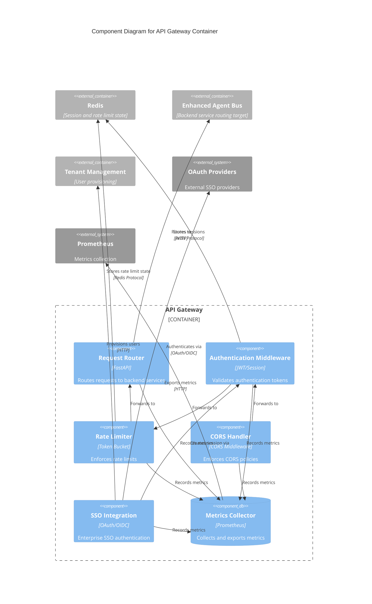

# C4 Component Level: API Gateway

<!-- Constitutional Hash: cdd01ef066bc6cf2 -->
<!-- C4 Model Level: Component (Level 3) -->
<!-- Container: API Gateway -->
<!-- Last Updated: 2026-01-04 -->

## Overview

- **Name**: API Gateway Components
- **Description**: Modular components providing unified API gateway functionality with authentication, rate limiting, and intelligent request routing
- **Container**: API Gateway
- **Type**: Web Application Components
- **Technology**: Python 3.11+, FastAPI, ASGI (Uvicorn)

## Purpose

The API Gateway container is decomposed into specialized components that work together to provide enterprise-grade API gateway capabilities. Each component handles a specific aspect of request processing, security, and routing while maintaining constitutional compliance at the edge of the system.

## Components

### 1. Request Router Component

#### Overview
- **Name**: Request Router
- **Description**: Intelligent HTTP request routing and service discovery component
- **Type**: Application Service
- **Technology**: FastAPI routing, Service registry integration

#### Purpose
Routes incoming HTTP requests to appropriate backend microservices based on URL patterns, service health, and load balancing algorithms. Provides dynamic service discovery and failover capabilities.

#### Software Features
- **Dynamic Service Discovery**: Automatically discovers available backend services
- **Load Balancing**: Distributes requests across multiple service instances
- **Health-Based Routing**: Routes only to healthy service instances
- **URL Pattern Matching**: Maps request paths to backend services
- **Request Forwarding**: Proxies requests with header preservation
- **Failover Handling**: Automatically retries failed requests to alternative instances

#### Interfaces

##### HTTP Routing Interface
- **Protocol**: HTTP/HTTPS
- **Description**: Main routing interface for client requests
- **Operations**:
  - `route_request(request: Request) -> Response` - Route request to appropriate backend service
  - `discover_services() -> List[Service]` - Discover available backend services
  - `check_service_health(service: str) -> bool` - Check if service is healthy
  - `select_instance(service: str) -> ServiceInstance` - Select healthy instance using load balancing

#### Dependencies

##### Components Used
- **Authentication Middleware**: For request authentication before routing
- **Rate Limiter**: For rate limit enforcement before routing
- **Metrics Collector**: For routing performance metrics

##### External Systems
- **Enhanced Agent Bus**: Backend service (Port 8000)
- **Audit Service**: Backend service (Port 8084)
- **Tenant Management**: Backend service (Port 8500)
- **Redis**: Service registry and health status (Port 6379)

---

### 2. Authentication Middleware Component

#### Overview
- **Name**: Authentication Middleware
- **Description**: JWT authentication and session management component
- **Type**: Security Middleware
- **Technology**: FastAPI middleware, JWT, Redis sessions

#### Purpose
Validates user authentication tokens, manages user sessions, and enforces authentication requirements for protected endpoints. Provides integration with multiple authentication providers including SSO.

#### Software Features
- **JWT Validation**: Validates JWT tokens with signature verification
- **Session Management**: Manages user sessions in Redis with TTL
- **Token Refresh**: Handles automatic token refresh for long-lived sessions
- **Multi-Provider Support**: Integrates with OAuth, OIDC, SAML providers
- **User Context**: Extracts and propagates user identity context
- **Complexity Validation**: Enforces password complexity requirements

#### Interfaces

##### Authentication Interface
- **Protocol**: HTTP Middleware
- **Description**: Request authentication and validation
- **Operations**:
  - `authenticate(request: Request) -> User` - Authenticate request and return user
  - `validate_jwt(token: str) -> TokenClaims` - Validate JWT token
  - `create_session(user: User) -> Session` - Create new user session
  - `refresh_token(refresh_token: str) -> AccessToken` - Refresh access token
  - `revoke_session(session_id: str) -> bool` - Revoke user session

#### Dependencies

##### Components Used
- **CORS Handler**: Works with CORS component for pre-flight requests
- **Metrics Collector**: For authentication metrics

##### External Systems
- **Redis**: Session storage (Port 6379)
- **OAuth Providers**: External authentication (GitHub, Google, Microsoft, Okta)
- **OPA**: Authorization policy decisions (Port 8181)

---

### 3. Rate Limiter Component

#### Overview
- **Name**: Rate Limiter
- **Description**: Token bucket-based request rate limiting component
- **Type**: Security Component
- **Technology**: Redis-backed rate limiting, Token bucket algorithm

#### Purpose
Enforces rate limits to protect backend services from overload and abuse. Implements multiple rate limiting strategies including per-user, per-IP, and per-endpoint limits.

#### Software Features
- **Token Bucket Algorithm**: Smooth rate limiting with burst support
- **Multi-Level Limits**: Per-user, per-IP, per-endpoint rate limits
- **Redis-Backed State**: Distributed rate limit state across instances
- **Dynamic Limit Adjustment**: Adjust limits based on system load
- **Rate Limit Headers**: Returns standard X-RateLimit-* headers
- **Custom Error Responses**: Informative 429 responses with retry-after

#### Interfaces

##### Rate Limiting Interface
- **Protocol**: HTTP Middleware
- **Description**: Request rate limiting and throttling
- **Operations**:
  - `check_rate_limit(key: str, limit: int, window: int) -> bool` - Check if request is within rate limit
  - `consume_token(key: str) -> RateLimitStatus` - Consume rate limit token
  - `get_remaining(key: str) -> int` - Get remaining requests in window
  - `reset_limit(key: str) -> bool` - Reset rate limit for key

#### Dependencies

##### Components Used
- **Authentication Middleware**: For user identification in rate limiting
- **Metrics Collector**: For rate limit metrics

##### External Systems
- **Redis**: Rate limit state storage (Port 6379)

---

### 4. CORS Handler Component

#### Overview
- **Name**: CORS Handler
- **Description**: Cross-Origin Resource Sharing policy enforcement component
- **Type**: Security Middleware
- **Technology**: FastAPI CORS middleware

#### Purpose
Enforces CORS policies to control which origins can access the API. Handles preflight requests and adds appropriate CORS headers to responses.

#### Software Features
- **Origin Validation**: Validates request origin against whitelist
- **Preflight Handling**: Handles OPTIONS requests for CORS preflight
- **Credential Support**: Allows credentials for authenticated requests
- **Header Whitelisting**: Controls allowed headers in requests
- **Method Whitelisting**: Controls allowed HTTP methods
- **Dynamic Configuration**: Load CORS config from environment

#### Interfaces

##### CORS Interface
- **Protocol**: HTTP Middleware
- **Description**: CORS policy enforcement
- **Operations**:
  - `validate_origin(origin: str) -> bool` - Validate if origin is allowed
  - `add_cors_headers(response: Response, origin: str) -> Response` - Add CORS headers
  - `handle_preflight(request: Request) -> Response` - Handle preflight request

#### Dependencies

##### Components Used
- **Request Router**: Receives CORS-validated requests
- **Metrics Collector**: For CORS policy metrics

---

### 5. SSO Integration Component

#### Overview
- **Name**: SSO Integration
- **Description**: Single Sign-On integration with OAuth 2.0 and OIDC providers
- **Type**: Authentication Service
- **Technology**: OAuth 2.0, OIDC, SAML

#### Purpose
Provides enterprise SSO integration allowing users to authenticate using corporate identity providers. Supports multiple SSO protocols and providers.

#### Software Features
- **OAuth 2.0 Support**: Full OAuth 2.0 authorization code flow
- **OIDC Integration**: OpenID Connect authentication
- **SAML Support**: SAML 2.0 authentication for enterprise
- **Multi-Provider**: GitHub, Google, Microsoft, Okta, custom providers
- **Automatic Provisioning**: Creates users on first SSO login
- **Role Mapping**: Maps SSO groups to application roles

#### Interfaces

##### SSO Interface
- **Protocol**: HTTP/HTTPS
- **Description**: SSO authentication flows
- **Operations**:
  - `initiate_sso(provider: str, redirect_uri: str) -> RedirectResponse` - Start SSO flow
  - `handle_callback(provider: str, code: str) -> AuthResult` - Handle OAuth callback
  - `exchange_token(provider: str, code: str) -> TokenSet` - Exchange authorization code
  - `get_user_info(provider: str, token: str) -> UserInfo` - Get user information from provider

#### Dependencies

##### Components Used
- **Authentication Middleware**: For session creation after SSO
- **Metrics Collector**: For SSO authentication metrics

##### External Systems
- **OAuth Providers**: External SSO providers (GitHub, Google, Microsoft, Okta)
- **Tenant Management**: For user provisioning (Port 8500)

---

### 6. Metrics Collector Component

#### Overview
- **Name**: Metrics Collector
- **Description**: Prometheus metrics collection and export component
- **Type**: Observability Component
- **Technology**: Prometheus client library, FastAPI metrics

#### Purpose
Collects and exports metrics about API gateway performance, request volumes, error rates, and latency. Provides observability into gateway operations.

#### Software Features
- **Request Metrics**: Tracks request count, duration, status codes
- **Error Tracking**: Monitors error rates and types
- **Latency Monitoring**: P50, P95, P99 latency tracking
- **Rate Limit Metrics**: Tracks rate limit hits and rejections
- **Authentication Metrics**: Monitors authentication success/failure rates
- **Custom Metrics**: Allows components to register custom metrics

#### Interfaces

##### Metrics Interface
- **Protocol**: HTTP (Prometheus format)
- **Description**: Metrics export for Prometheus scraping
- **Operations**:
  - `record_request(method: str, path: str, status: int, duration: float)` - Record request metrics
  - `increment_counter(name: str, labels: dict)` - Increment counter metric
  - `record_histogram(name: str, value: float, labels: dict)` - Record histogram value
  - `export_metrics() -> str` - Export metrics in Prometheus format

#### Dependencies

##### External Systems
- **Prometheus**: Metrics scraping (HTTP pull)
- **Pushgateway**: Metrics pushing for batch jobs

---

## Component Diagram

The following diagram shows the components within the API Gateway container and their relationships:

## Component Relationships

### Request Flow
1. **CORS Handler** validates origin and adds CORS headers
2. **Authentication Middleware** validates JWT and creates user context
3. **Rate Limiter** checks and enforces rate limits
4. **Request Router** routes to appropriate backend service
5. **Metrics Collector** records metrics from all components

### Authentication Flow
1. **SSO Integration** handles OAuth/OIDC authentication
2. **Authentication Middleware** creates session after SSO success
3. **Redis** stores session state
4. **Tenant Management** provisions new users

### Shared Dependencies
- All components use **Redis** for state management
- All components report to **Metrics Collector** for observability
- Authentication components integrate with **OPA** for authorization

---

## Technology Stack

- **Framework**: FastAPI 0.115.6+
- **ASGI Server**: Uvicorn with async workers
- **Authentication**: PyJWT for JWT validation
- **Session Storage**: Redis with TTL-based expiration
- **Rate Limiting**: Redis-backed token bucket algorithm
- **Metrics**: Prometheus client library
- **OAuth/OIDC**: authlib for SSO integration

## Performance Characteristics

- **Request Latency**: P99 <2ms for routing decisions
- **Authentication**: <1ms for JWT validation (cached)
- **Rate Limiting**: <0.5ms for rate limit checks
- **Throughput**: >1000 RPS per instance
- **Horizontal Scaling**: Stateless (except Redis dependency)

## Security Features

- **JWT Validation**: RSA/ECDSA signature verification
- **Session Security**: Encrypted session tokens with rotation
- **Rate Limiting**: DDoS protection and abuse prevention
- **CORS Enforcement**: Strict origin validation
- **Input Validation**: Comprehensive request validation
- **Audit Logging**: All authentication events logged

## Deployment Notes

- **Replicas**: 3 in production for high availability
- **Resources**: 256M-512M memory, 0.25-0.5 CPU
- **Health Checks**: HTTP GET /health every 30s
- **Security**: Non-root user, read-only filesystem
- **Network**: acgs-prod bridge network

---

*This component-level documentation provides detailed insight into the modular architecture of the API Gateway container, showing how individual components collaborate to provide enterprise API gateway functionality.*
