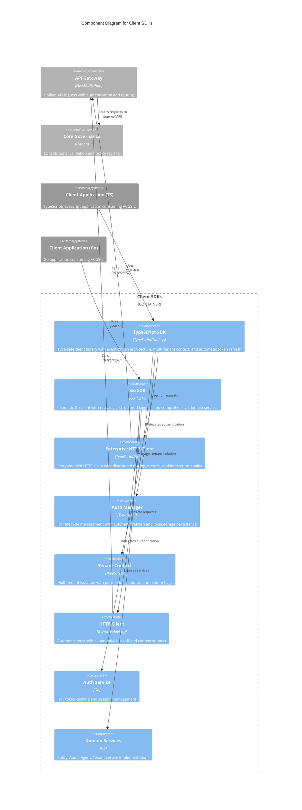

# C4 Component Level: Client SDKs

## Overview
- **Name**: Client SDKs
- **Description**: Multi-language client libraries providing type-safe, high-performance integration with ACGS-2 constitutional AI governance platform
- **Type**: Client Libraries
- **Technology**: TypeScript (ES modules, Node.js >= 18), Go 1.21+

## Purpose

The Client SDKs component provides developers with enterprise-grade client libraries for integrating ACGS-2 constitutional AI governance capabilities into their applications. These SDKs abstract the complexity of API communication, authentication, retry logic, and error handling while maintaining type safety and constitutional compliance validation.

**Key Purposes:**
- **Simplify Integration**: Provide intuitive, idiomatic APIs for TypeScript/JavaScript and Go applications to consume ACGS-2 services
- **Type Safety**: Ensure compile-time and runtime type checking through TypeScript type definitions and Go's strong typing
- **Production Reliability**: Handle network resilience with automatic retry logic, exponential backoff, and circuit breaker patterns
- **Constitutional Compliance**: Enforce cryptographic constitutional hash validation (`cdd01ef066bc6cf2`) on all API requests
- **Multi-Tenancy**: Support tenant context propagation and isolation across all operations
- **Observability**: Enable distributed tracing, metrics collection, and structured logging for production monitoring
- **Developer Experience**: Minimize configuration overhead with sensible defaults while supporting enterprise customization
- **Authentication Management**: Abstract JWT token lifecycle (authentication, automatic refresh, session management)

## Software Features

### TypeScript SDK Features

**Core SDK Capabilities**
- Type-safe API bindings with comprehensive TypeScript type definitions and generics
- Event-driven architecture using EventEmitter3 for reactive application integration
- Multi-tenant context management with automatic header injection (X-Tenant-ID, X-Constitutional-Hash)
- Factory functions for simplified client instantiation with production-ready defaults
- Comprehensive health checks across all services and SDK initialization status

**Authentication & Authorization**
- JWT-based authentication with automatic token refresh (5 minutes before expiry)
- Browser localStorage token persistence for session restoration
- User profile management (login, logout, getUserInfo, updateProfile, changePassword)
- OAuth provider integration support (Okta, Azure AD) for enterprise SSO
- Permission and role-based access control helpers

**Enterprise HTTP Client**
- Axios-based HTTP client with automatic retry and exponential backoff with jitter
- Configurable retry on specific status codes (default: 429, 500, 502, 503, 504)
- Request/response/error interceptor chains for middleware integration
- Distributed tracing with auto-generated trace IDs and span IDs
- Request metrics collection (duration, retry count, status, tenant, user)
- Per-request timeout and configuration override support

**Multi-Tenancy Support**
- TenantContext class with permission and quota management
- Runtime tenant switching without client re-initialization
- Tenant-specific feature flags and compliance frameworks
- Data residency tracking and validation
- Resource quota checking (users, policies, agents, API calls, storage)

**Observability & Monitoring**
- Structured logging with JSON output and constitutional hash validation
- Prometheus-compatible metrics exposure
- Distributed tracing header propagation
- Real-time event notifications (ready, error, tenantSwitched, authenticated, rateLimited)
- Client statistics (success rate, average response time, error rate)

**Configuration & Validation**
- Zod schema validation for runtime configuration checking
- Environment-specific defaults (development, staging, production)
- Type-safe configuration with comprehensive validation rules
- Default timeouts, retry attempts, and delay settings

### Go SDK Features

**Core SDK Capabilities**
- Idiomatic Go API with comprehensive error handling and context support
- Strong typing with domain-specific models and type aliases
- Production-ready configuration with sensible defaults via factory functions
- Health check support across all services and main client
- Graceful shutdown with connection cleanup

**Authentication & Authorization**
- JWT token management with automatic caching and expiry tracking
- Session lifecycle management (login, logout, refresh, token validation)
- User profile operations (getUserInfo, updateProfile, changePassword)
- IsAuthenticated() helper for authorization checks
- OAuth2 integration support for enterprise authentication flows

**Enterprise HTTP Client**
- Automatic retry with exponential backoff using hashicorp/go-retryablehttp
- Configurable retry attempts (default: 3) and delay (1s-30s)
- Context-aware request execution supporting cancellation and timeouts
- Connection pooling for performance optimization
- TLS configuration with client certificate support

**Multi-Tenancy Support**
- Tenant ID propagation via X-Tenant-ID header injection
- Constitutional hash validation (X-Constitutional-Hash) on all requests
- Tenant management operations (list, get, create, update, delete)
- Resource quota management and usage tracking
- Tenant access validation

**Observability & Monitoring**
- Structured logging with uber-go/zap for high-performance logging
- Configurable log levels (debug, info, warn, error, fatal)
- Distributed tracing with trace ID and span ID generation
- Prometheus metrics collection (when enabled)
- Client metrics exposure (tenant, base URL, timeout, retry config, timestamp)

**Domain Services**
- **Policy Service**: Policy CRUD, validation, activation/deactivation, versioning, cloning
- **Audit Service**: Event querying, audit summaries, compliance report generation
- **Agent Service**: Agent registration, health monitoring, heartbeat tracking
- **Tenant Service**: Tenant management, quota configuration, usage tracking

**Configuration & Validation**
- Pre-initialization configuration validation (BaseURL, TenantID, constitutional hash)
- TLS certificate loading and verification
- Configurable timeouts, retry attempts, and delays
- Metrics and tracing enablement flags

## Code Elements

This component contains the following code-level elements:

- [c4-code-typescript-sdk.md](./c4-code-typescript-sdk.md) - TypeScript/JavaScript client library implementation with EventEmitter-based architecture, enterprise HTTP client, authentication manager, tenant context management, and comprehensive logging utilities
- [c4-code-go-sdk.md](./c4-code-go-sdk.md) - Go client library implementation with domain services (policy, audit, agent, tenant), authentication service, retry-enabled HTTP client, and production-ready structured logging

## Interfaces

### TypeScript SDK Public API

#### Client Initialization
```typescript
createACGS2Client(config: SDKConfig): ACGS2Client
createDefaultConfig(baseURL: string, tenantId: string): SDKConfig
```
Creates and configures ACGS2Client instance with sensible defaults for production use.

#### Main Client Interface
```typescript
class ACGS2Client extends EventEmitter<SDKEvents> {
  // Lifecycle Management
  initialize(): Promise<void>
  switchTenant(tenantId: string): Promise<void>
  dispose(): Promise<void>

  // Health & Metrics
  healthCheck(): Promise<HealthStatus>
  getMetrics(): Record<string, any>
  isInitialized(): boolean
  getCurrentTenant(): TenantContext

  // Service Accessors
  auth: AuthManager
  policies: PolicyService
  audit: AuditService
  agents: AgentService
  tenants: TenantService
}
```

#### Authentication Operations
```typescript
interface AuthManager {
  // Authentication Lifecycle
  login(credentials: LoginRequest): Promise<LoginResponse>
  logout(): Promise<void>
  refreshToken(): Promise<TokenRefreshResponse>

  // User Management
  getUserInfo(): Promise<UserInfo>
  updateProfile(updates: Partial<UserInfo>): Promise<UserInfo>
  changePassword(currentPassword: string, newPassword: string): Promise<void>

  // State Queries
  isAuthenticated(): boolean
  getCurrentUser(): UserInfo | undefined
  getAuthState(): AuthState
}
```

#### HTTP Client Operations
```typescript
class EnterpriseHttpClient {
  // HTTP Methods
  request<T>(config: AxiosRequestConfig): Promise<AxiosResponse<T>>
  get<T>(url: string, config?: AxiosRequestConfig): Promise<AxiosResponse<T>>
  post<T>(url: string, data?: any, config?: AxiosRequestConfig): Promise<AxiosResponse<T>>
  put<T>(url: string, data?: any, config?: AxiosRequestConfig): Promise<AxiosResponse<T>>
  patch<T>(url: string, data?: any, config?: AxiosRequestConfig): Promise<AxiosResponse<T>>
  delete<T>(url: string, config?: AxiosRequestConfig): Promise<AxiosResponse<T>>

  // Interceptors
  addRequestInterceptor(interceptor: RequestInterceptor): void
  addResponseInterceptor(interceptor: ResponseInterceptor): void
  addErrorInterceptor(interceptor: ErrorInterceptor): void

  // Metrics & Stats
  getMetrics(): RequestMetrics[]
  getStats(): {totalRequests, successRate, averageResponseTime, errorRate, recentErrors}
}
```

#### Tenant Context Management
```typescript
class TenantContext extends EventEmitter<TenantContextEvents> {
  // Property Accessors
  get tenantId(): string
  get constitutionalHash(): string
  get environment(): 'development' | 'staging' | 'production'
  get permissions(): string[]
  get quota(): TenantQuota
  get features(): string[]

  // Permission Management
  setPermissions(permissions: string[]): void
  hasPermission(permission: string): boolean
  hasAllPermissions(permissions: string[]): boolean

  // Quota Management
  setQuota(quota: TenantQuota): void
  checkQuota(resource: string, amount?: number): boolean

  // Utilities
  getHeaders(): Record<string, string>
  getMetadata(): Record<string, any>
  clone(): TenantContext
}
```

### Go SDK Public API

#### Client Initialization
```go
func NewConfig(baseURL, tenantID string) *Config
func New(config *Config) (*Client, error)
```
Creates client configuration and initializes SDK with validation and service setup.

#### Main Client Interface
```go
type Client struct {
    // Service Accessors
    Auth   *auth.Service
    Policy *PolicyService
    Audit  *AuditService
    Agent  *AgentService
    Tenant *TenantService
}

// Client Methods
func (c *Client) Health(ctx context.Context) (*models.HealthStatus, error)
func (c *Client) Metrics() map[string]interface{}
func (c *Client) Close() error
```

#### Authentication Operations
```go
type Service interface {
    // Authentication Lifecycle
    Login(ctx context.Context, username, password string) (*LoginResponse, error)
    Logout(ctx context.Context) error
    RefreshToken(ctx context.Context) (*TokenRefreshResponse, error)

    // User Management
    GetUserInfo(ctx context.Context) (*UserInfo, error)
    UpdateProfile(ctx context.Context, updates *ProfileUpdate) (*UserInfo, error)
    ChangePassword(ctx context.Context, currentPassword, newPassword string) error

    // State Queries
    IsAuthenticated() bool
    GetAccessToken() string
    GetTokenExpiry() time.Time
    ClearTokens()

    // Health
    Health(ctx context.Context) (bool, error)
}
```

#### Policy Service Operations
```go
type PolicyService interface {
    // CRUD Operations
    List(ctx context.Context, query *models.PolicyQuery) (*models.ListResponse[models.Policy], error)
    Get(ctx context.Context, id string) (*models.Policy, error)
    Create(ctx context.Context, req *models.CreatePolicyRequest) (*models.Policy, error)
    Update(ctx context.Context, id string, req *models.UpdatePolicyRequest) (*models.Policy, error)
    Delete(ctx context.Context, id string) error

    // Policy Management
    Validate(ctx context.Context, policy *models.Policy) (*models.PolicyValidationResult, error)
    Activate(ctx context.Context, id string) error
    Deactivate(ctx context.Context, id string) error
    GetVersions(ctx context.Context, id string) ([]models.Policy, error)
    Clone(ctx context.Context, id string, name string) (*models.Policy, error)

    // Health
    Health(ctx context.Context) (bool, error)
}
```

#### Audit Service Operations
```go
type AuditService interface {
    // Event Querying
    Query(ctx context.Context, query *models.AuditQuery) (*models.ListResponse[models.AuditEvent], error)
    Get(ctx context.Context, id string) (*models.AuditEvent, error)
    GetSummary(ctx context.Context, period string) (*models.AuditSummary, error)

    // Compliance Reporting
    GenerateComplianceReport(ctx context.Context, framework, period string) (*models.ComplianceReport, error)

    // Health
    Health(ctx context.Context) (bool, error)
}
```

#### Agent Service Operations
```go
type AgentService interface {
    // Agent Lifecycle
    List(ctx context.Context, query *models.AgentQuery) (*models.ListResponse[models.Agent], error)
    Get(ctx context.Context, id string) (*models.Agent, error)
    Register(ctx context.Context, req *models.RegisterAgentRequest) (*models.Agent, error)
    Update(ctx context.Context, id string, req *models.UpdateAgentRequest) (*models.Agent, error)
    Delete(ctx context.Context, id string) error

    // Agent Health
    SendHeartbeat(ctx context.Context, id string, heartbeat *models.AgentHeartbeat) error
    GetHealth(ctx context.Context, id string) (map[string]interface{}, error)

    // Health
    Health(ctx context.Context) (bool, error)
}
```

#### Tenant Service Operations
```go
type TenantService interface {
    // Tenant Management
    List(ctx context.Context, query *models.TenantQuery) (*models.ListResponse[models.Tenant], error)
    Get(ctx context.Context, id string) (*models.Tenant, error)
    Create(ctx context.Context, req *models.CreateTenantRequest) (*models.Tenant, error)
    Update(ctx context.Context, id string, req *models.UpdateTenantRequest) (*models.Tenant, error)
    Delete(ctx context.Context, id string) error

    // Tenant Operations
    ValidateTenantAccess(ctx context.Context, tenantID string) error
    GetUsage(ctx context.Context, id string) (map[string]interface{}, error)
    GetQuota(ctx context.Context, id string) (*models.ResourceQuota, error)
    UpdateQuota(ctx context.Context, id string, quota *models.ResourceQuota) error

    // Health
    Health(ctx context.Context) (bool, error)
}
```

### Event Interfaces (TypeScript SDK)

```typescript
// SDK Events
interface SDKEvents {
  ready(): void
  error(error: Error): void
  tenantSwitched(tenantId: string): void
  authenticated(userId: string): void
  deauthenticated(): void
  rateLimited(retryAfter: number): void
  quotaExceeded(resource: string, limit: number): void
}

// Authentication Events
interface AuthEvents {
  authenticated(userId: string): void
  deauthenticated(): void
  tokenRefreshed(expiresAt: Date): void
  tokenExpired(): void
  loginFailed(error: Error): void
}

// Tenant Context Events
interface TenantContextEvents {
  updated(context: TenantContext): void
  permissionChanged(permissions: string[]): void
  quotaUpdated(quota: TenantQuota): void
}
```

## Dependencies

### Components Used

**API Gateway (External Container)**
- **Relationship**: Consumes
- **Protocol**: REST API over HTTPS
- **Endpoints**:
  - `/auth/*` - Authentication and user management
  - `/api/v1/policies/*` - Policy management and validation
  - `/api/v1/audit/*` - Audit event querying and compliance
  - `/api/v1/agents/*` - Agent lifecycle and health
  - `/api/v1/tenants/*` - Tenant management and quotas
  - `/health/*` - Service health checks
- **Authentication**: JWT Bearer tokens in Authorization header
- **Headers Injected**:
  - `X-Tenant-ID` - Multi-tenant identifier
  - `X-Constitutional-Hash` - Constitutional compliance hash (cdd01ef066bc6cf2)
  - `X-Trace-ID`, `X-Span-ID` - Distributed tracing
  - `Content-Type: application/json`

### External Libraries

#### TypeScript SDK Dependencies

**Production Dependencies:**
- **axios** (^1.6.0) - HTTP client library for API requests
- **eventemitter3** (^5.0.1) - Event-driven architecture implementation
- **zod** (^3.22.4) - Runtime schema validation for type safety
- **jsonwebtoken** (^9.0.2) - JWT token signing and verification
- **jose** (^4.15.4) - Secure JWT handling and operations
- **crypto-js** (^4.2.0) - Cryptographic utilities for hash validation
- **uuid** (^9.0.1) - UUID generation for tracing and IDs
- **rxjs** (^7.8.1) - Reactive extensions for async stream handling

**Build/Development:**
- TypeScript (^5.3.0) - Type system and compiler
- tsup (^7.2.0) - Fast TypeScript bundler for ESM/CJS output
- jest (^29.7.0) - Testing framework with ts-jest

#### Go SDK Dependencies

**Production Dependencies:**
- **go.uber.org/zap** (v1.26.0) - High-performance structured logging
- **github.com/hashicorp/go-retryablehttp** (v0.7.5) - HTTP client with automatic retry logic and exponential backoff
- **github.com/golang-jwt/jwt/v5** (v5.2.0) - JWT token parsing and validation
- **github.com/google/uuid** (v1.6.0) - UUID generation for tracing
- **github.com/prometheus/client_golang** (v1.18.0) - Prometheus metrics collection
- **golang.org/x/oauth2** (v0.15.0) - OAuth2 authentication support

**Testing:**
- github.com/stretchr/testify (v1.8.4) - Testing assertions and mocking

## Component Diagram



**Key Architectural Principles:**

**Multi-Language Support:**
- TypeScript SDK targets browser and Node.js environments with ES modules
- Go SDK targets backend services and CLI applications with native compilation
- Both SDKs provide identical functional capabilities with language-idiomatic APIs
- Consistent API surface across languages for polyglot environments

**Separation of Concerns:**
- HTTP client layer handles network resilience (retry, backoff, timeout)
- Authentication layer manages token lifecycle and session state
- Tenant context layer enforces multi-tenant isolation
- Domain services provide business-focused APIs (Policy, Audit, Agent, Tenant)

**Enterprise Patterns:**
- Event-driven architecture (TypeScript) for reactive applications
- Context-aware operations (Go) for cancellation and timeout control
- Automatic retry with exponential backoff for network resilience
- Distributed tracing for observability in microservice architectures
- Structured logging for production debugging and monitoring

**Constitutional Compliance:**
- All requests include constitutional hash header for cryptographic validation
- Configuration validation enforces correct hash at initialization
- Audit trail integration for governance operations
- Compliance report generation through Audit service

**Developer Experience:**
- Factory functions with sensible defaults reduce configuration overhead
- Comprehensive type safety prevents runtime errors
- Health checks enable circuit breaker patterns in client applications
- Metrics exposure supports application-level monitoring

## Related Documentation

- **C4 Code Level**: [TypeScript SDK Implementation](./c4-code-typescript-sdk.md) | [Go SDK Implementation](./c4-code-go-sdk.md)
- **C4 Container Level**: API Gateway (client SDK consumer), Core Governance Service
- **Authentication Flow**: JWT-based authentication with automatic token refresh
- **Multi-Tenancy**: Tenant context propagation and isolation patterns
- **Constitutional Compliance**: Cryptographic hash validation (`cdd01ef066bc6cf2`)

---

**Component Status:** Production Ready
**Supported Languages:** TypeScript/JavaScript (Node.js >= 18), Go 1.21+
**Last Updated:** January 2026
**Constitutional Hash:** cdd01ef066bc6cf2
