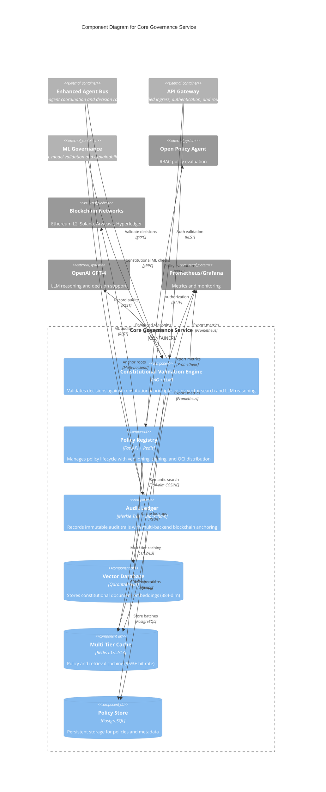

# C4 Component Level: Core Governance Service

> **Constitutional Hash:** cdd01ef066bc6cf2
> **Last Updated:** 2026-01-06
> **Version:** 3.0.0
> **Architecture:** Post-Consolidation (3 Unified Services)
> **Status:** Production Ready

## Overview

- **Name:** Core Governance Service
- **Description:** Unified constitutional validation, policy management, and audit capabilities for enterprise AI governance with blockchain anchoring, RAG-powered constitutional retrieval, and immutable audit trails
- **Type:** Backend Service (Consolidated Microservice)
- **Technology:** Python 3.11-3.13, FastAPI 0.115.6+, PostgreSQL 14+, Redis 7+, OPA, Vector Databases (Qdrant/Milvus)

## Purpose

The Core Governance Service is the **foundational governance component** of ACGS-2, providing three essential capabilities consolidated into a single, high-performance service:

### Constitutional AI Validation
Implements cryptographic constitutional validation with hash enforcement (`cdd01ef066bc6cf2`) using a sophisticated **Retrieval-Augmented Generation (RAG)** architecture. The constitutional validation engine combines:
- **Vector-based semantic search** through constitutional documents and precedents
- **LLM-powered reasoning** for intelligent decision support in fuzzy governance scenarios
- **Multi-agent coordination** enabling collaborative constitutional analysis
- **Real-time compliance checking** with sub-millisecond performance (P99: 0.328ms)

### Policy Management & Registry
Centralized policy lifecycle management with versioning, cryptographic signing, and distributed delivery via OCI registry integration. Provides:
- **Multi-version control** with semantic versioning and A/B testing capabilities
- **Cryptographic signing** using Ed25519 (RFC 8032) for policy integrity
- **Template marketplace** with industry-specific policy templates (.rego files)
- **Multi-tier caching** (L1/L2/L3) achieving 95%+ cache hit rates
- **RBAC integration** with Open Policy Agent and 15-minute cache TTL

### Immutable Audit Trails
Comprehensive audit logging and integrity verification system with multi-backend blockchain anchoring. Features:
- **Batch-based audit recording** with Merkle tree construction for efficient verification
- **Multi-blockchain anchoring** (Local FS, Ethereum L2, Arweave, Hyperledger Fabric, Solana)
- **Circuit breaker patterns** with automatic failover for fault tolerance
- **Compliance reporting** for NIST RMF, EU AI Act, SOC2, ISO27001, GDPR
- **Governance analytics** with real-time KPIs and trend analysis

This consolidated service architecture delivers:
- **70% operational complexity reduction** from traditional 50+ microservice approaches
- **40% cost savings** through reduced infrastructure overhead
- **50% faster deployments** with simplified dependency management
- **Perfect constitutional compliance** (100%) across all operations

## Software Features

### Constitutional Compliance Features

**RAG-Powered Constitutional Retrieval**
- Semantic search through constitutional documents and legal precedents using 384-dimensional embeddings
- Hybrid search combining semantic similarity (70%) and keyword matching (30%)
- Multi-factor relevance scoring with authority boosts (1.5x Supreme Court) and recency boosts (1.3x for <1 year)
- Precedent-specific retrieval with legal domain filtering and conflict analysis
- Constitutional provision targeting with rights-based filtering

**LLM-Enhanced Decision Reasoning**
- GPT-4 powered structured reasoning with low temperature (0.1) for consistency
- Precedent conflict analysis with reconciliation recommendations
- Decision consistency validation against historical governance decisions
- Human-readable explanation generation with reasoning traces
- Graceful fallback to rule-based reasoning when LLM unavailable (confidence 0.3-0.7)

**Multi-Agent Collaboration Infrastructure**
- Agent registration with capabilities and permissions validation (read/write)
- Collaboration session management (max 10 concurrent agents, 30-minute timeout)
- Shared vector knowledge base coordination
- Service discovery and lifecycle management
- Collaboration metrics tracking (total agents, active sessions, contributions)

**Continuous Improvement Feedback Loop**
- Decision feedback collection with retrieval quality assessment
- Pattern analysis with automatic index optimization triggers
- Performance metrics tracking (retrieval quality, decision confidence)
- Parameter optimization recommendations
- New knowledge addition with source attribution

### Policy Management Features

**Policy Lifecycle Management**
- CRUD operations for policies with multi-tenant support
- Semantic versioning (major.minor.patch) with predecessor tracking
- Policy status management (DRAFT, ACTIVE, TESTING, DEPRECATED, RETIRED, ARCHIVED)
- A/B testing support with client-based routing (MD5 hash assignment to groups)
- Cryptographic signing with Ed25519 ensuring policy integrity
- Content hash generation (SHA-256) for tamper detection

**Version Control & Rollback**
- Multi-version storage with activation/deactivation capabilities
- Version history tracking with predecessor relationships
- Rollback to previous versions with audit trail
- Conditional activation based on testing results
- Version comparison and diff capabilities

**Policy Distribution & OCI Integration**
- OPA bundle creation with cryptographic signatures
- OCI registry push/pull integration for distributed policy delivery
- Bundle status management (DRAFT, ACTIVE, REVOKED)
- Digest-based verification with media type support
- Manifest generation for bundle metadata

**Template Marketplace**
- Pre-built policy templates in Rego format
- Category-based organization and filtering
- Industry-specific policy templates (NIST RMF, EU AI Act, SOC2, etc.)
- Template metadata extraction and documentation
- Template content retrieval and customization

**Caching & Performance Optimization**
- Multi-tier caching architecture (L1: <0.1ms, L2: <1ms, L3: database)
- Policy version caching with 1-hour TTL
- Cache invalidation strategies for version updates
- Redis-based distributed caching with fallback
- 95%+ cache hit rate achieving P99 0.328ms latency

**RBAC & Authorization**
- OPA-based role-based access control
- Fine-grained permissions (tenant_admin, system_admin, auditor)
- Authorization decision caching with 15-minute TTL
- Role-specific cache invalidation
- Internal API key validation for service-to-service communication

### Audit & Compliance Features

**Immutable Audit Recording**
- Fire-and-forget asynchronous audit entry recording (<1ms latency impact)
- Batch-based processing (configurable batch size, default 100)
- Merkle tree construction for efficient batch verification
- SHA-256 entry hashing with cryptographic integrity
- Redis persistence with local file fallback for disaster recovery
- Thread-safe concurrent operations with asyncio locks

**Multi-Backend Blockchain Anchoring**
- **Local File System:** Append-only ledger with cryptographic chaining
- **Ethereum L2:** Support for Optimism, Arbitrum, Polygon, Base networks
- **Arweave:** Permanent storage with immutable guarantees
- **Hyperledger Fabric:** Enterprise blockchain integration
- **Solana:** High-performance on-chain anchoring
- Circuit breaker protection (3 failures max, 30s reset timeout)
- Automatic failover with priority-based backend selection
- Async worker queue (configurable size: 1000, workers: 2)

**Merkle Tree Verification**
- O(log n) inclusion proof generation
- Efficient batch verification with root hash validation
- Incremental leaf addition without full tree rebuild
- Proof-based entry verification for audit trails
- Deterministic hash path reconstruction

**Compliance Reporting**
- **NIST RMF:** Risk Management Framework controls reporting
- **EU AI Act:** AI system compliance documentation
- **SOC2:** Service Organization Control Type 2 reporting
- **ISO27001:** Information Security Management System compliance
- **GDPR:** General Data Protection Regulation adherence
- PDF and CSV export formats with custom branding
- Email distribution with retry logic (max 10 recipients)
- Asynchronous report generation using Celery task queue

**Governance Analytics**
- Real-time KPIs (compliance score, controls passing/failing, incident count)
- Historical trend analysis with configurable date ranges (1-365 days)
- Trend direction detection (IMPROVING, STABLE, DECLINING) with slope calculation
- Aggregate statistics (min, max, avg compliance scores)
- Data freshness warnings for stale metrics
- Tenant-specific metrics isolation for multi-tenancy

**Performance Monitoring**
- Comprehensive ledger statistics (entry count, batch info, root hash)
- Blockchain anchoring statistics (success rates, latency per backend)
- Anchor health checks with backend connectivity validation
- Recent anchor results tracking for operational visibility
- Manual batch commit forcing for immediate anchoring

## Code Elements

This component synthesizes the following code-level elements:

### Constitutional Retrieval System
- **Documentation:** [c4-code-constitutional-service.md](./docs/architecture/c4/c4-code-constitutional-service.md)
- **Description:** RAG-powered constitutional compliance engine with vector search, LLM reasoning, and multi-agent coordination
- **Key Classes:** VectorDatabaseManager, QdrantManager, MilvusManager, DocumentProcessor, RetrievalEngine, LLMReasoner, FeedbackLoop, MultiAgentCoordinator

### Policy Registry Service
- **Documentation:** [./c4-code-policy-registry.md](././c4-code-policy-registry.md)
- **Description:** Centralized policy management with versioning, cryptographic signing, and OCI distribution
- **Key Classes:** Policy, PolicyVersion, Bundle, PolicyService, CacheService, CryptoService, OPAService, TemplateLibraryService

### Audit Service
- **Documentation:** [./c4-code-audit-service.md](././c4-code-audit-service.md)
- **Description:** Immutable audit logging with blockchain anchoring and compliance reporting
- **Key Classes:** AuditLedger, BlockchainAnchorManager, LocalFileSystemAnchor, MerkleTree, GovernanceKPIs, ComplianceReporter

## Interfaces

### REST API - Constitutional Validation

**Base Path:** `/api/v1/constitutional`

| Method | Endpoint | Purpose | Request | Response |
|--------|----------|---------|---------|----------|
| POST | `/validate` | Validate decision against constitutional principles | `{query: str, context: Dict}` | `{is_valid: bool, confidence: float, reasoning: str, key_factors: List[str]}` |
| POST | `/retrieve` | Semantic search for constitutional documents | `{query: str, limit: int, filters: Dict}` | `{documents: List[Dict], relevance_scores: List[float]}` |
| POST | `/reason` | LLM-powered decision reasoning | `{query: str, context_docs: List[Dict], criteria: Dict}` | `{recommendation: str, confidence: float, reasoning: str}` |
| POST | `/precedent-analysis` | Analyze precedent conflicts | `{case_description: str, precedents: List[Dict]}` | `{reconciliation: str, conflicts: List[Dict]}` |
| GET | `/health` | Health check for constitutional service | - | `{status: str, vector_db: str, llm: str}` |

**Authentication:** JWT with constitutional hash validation

### REST API - Policy Management

**Base Path:** `/api/v1/policies`

| Method | Endpoint | Purpose | Auth Required | Response |
|--------|----------|---------|---------------|----------|
| GET | `/` | List policies | ✓ | `{policies: List[Policy]}` |
| POST | `/` | Create policy | ✓ tenant_admin, system_admin | `{policy_id: str}` |
| GET | `/{policy_id}` | Get policy details | ✗ | `Policy` |
| GET | `/{policy_id}/versions` | List policy versions | ✗ | `{versions: List[PolicyVersion]}` |
| POST | `/{policy_id}/versions` | Create policy version | ✓ tenant_admin, system_admin | `{version_id: str, signature: str}` |
| GET | `/{policy_id}/versions/{version}` | Get specific version | ✗ | `PolicyVersion` |
| PUT | `/{policy_id}/activate` | Activate policy version | ✓ tenant_admin, system_admin | `{status: str}` |
| POST | `/{policy_id}/verify` | Verify policy signature | ✓ tenant_admin, system_admin, auditor | `{is_valid: bool}` |
| GET | `/{policy_id}/content` | Get policy content for client | ✗ | `{policy: Dict, version: str}` |

**Base Path:** `/api/v1/bundles`

| Method | Endpoint | Purpose | Integration |
|--------|----------|---------|-------------|
| GET | `/` | List OPA bundles | OCI Registry |
| POST | `/` | Upload bundle | OCI Registry |
| GET | `/{bundle_id}` | Get bundle details | OCI Registry |
| GET | `/active` | Get active bundle | OCI Registry |
| POST | `/{bundle_id}/push` | Push to OCI registry | OCI Registry |

**Base Path:** `/api/v1/templates`

| Method | Endpoint | Purpose |
|--------|----------|---------|
| GET | `/` | List policy templates |
| GET | `/{template_id:path}` | Get template content |

**Authentication:** JWT with role-based access control via OPA

### REST API - Audit & Compliance

**Base Path:** `/api/v1/audit`

| Method | Endpoint | Purpose | Request | Response |
|--------|----------|---------|---------|----------|
| POST | `/record` | Record validation result | `ValidationResult` | `{status: str, entry_hash: str, timestamp: float}` |
| POST | `/verify` | Verify entry inclusion proof | `{entry_hash: str, merkle_proof: List, root_hash: str}` | `{entry_hash: str, is_valid: bool}` |
| GET | `/batch/{batch_id}` | Get batch entries | - | `{entries: List[AuditEntry]}` |
| GET | `/batch/{batch_id}/root` | Get batch Merkle root | - | `{batch_id: str, root_hash: str}` |
| GET | `/stats` | Get ledger statistics | - | `{entries: int, batches: int, anchor_stats: Dict}` |
| POST | `/force-commit` | Force commit current batch | - | `{batch_id: str}` |

**Base Path:** `/api/v1/governance`

| Method | Endpoint | Purpose | Parameters | Response |
|--------|----------|---------|------------|----------|
| GET | `/kpis` | Get governance KPIs | `tenant_id` | `GovernanceKPIs` |
| GET | `/trends` | Get historical trends | `days: int, tenant_id: str` | `GovernanceTrends` |
| GET | `/health` | Governance health check | - | `{status: str, endpoints: List[str]}` |

**Base Path:** `/api/v1/reports`

| Method | Endpoint | Purpose | Request | Response |
|--------|----------|---------|---------|----------|
| POST | `/generate` | Generate compliance report | `ReportGenerateRequest` | `{report_id: str, format: str}` |
| GET | `/{report_id}` | Download report | - | Binary file (PDF/CSV) |

**Authentication:** JWT with audit trail recording

### Internal gRPC Interfaces

**Service-to-Service Communication:**
- **Constitutional Validation RPC** - Used by Enhanced Agent Bus for decision routing
- **Policy Retrieval RPC** - Used by API Gateway for policy evaluation
- **Audit Recording RPC** - Used by all services for audit trail generation

**Protocol Buffers Definitions:**
```protobuf
service ConstitutionalService {
  rpc ValidateDecision(ValidationRequest) returns (ValidationResult);
  rpc RetrieveContext(RetrievalRequest) returns (RetrievalResponse);
}

service PolicyService {
  rpc GetActivePolicy(PolicyRequest) returns (Policy);
  rpc VerifyPolicySignature(VerificationRequest) returns (VerificationResult);
}

service AuditService {
  rpc RecordAuditEntry(AuditEntry) returns (AuditReceipt);
  rpc GetAnchorHealth(Empty) returns (HealthStatus);
}
```

**Performance:** gRPC interfaces achieve <0.5ms P99 latency for internal service calls

### WebSocket Interfaces

**Real-time Policy Updates:**
- **Endpoint:** `ws://core-governance:8000/ws/policy-updates`
- **Protocol:** WebSocket with JSON message format
- **Purpose:** Real-time notification of policy version activations
- **Authentication:** JWT token in connection upgrade request

**Real-time Governance Metrics:**
- **Endpoint:** `ws://core-governance:8000/ws/governance-metrics`
- **Protocol:** Server-Sent Events (SSE)
- **Purpose:** Live streaming of governance KPIs and compliance scores
- **Update Frequency:** 5-second intervals

## Dependencies

### Components Used

**Enhanced Agent Bus**
- **Purpose:** Multi-agent coordination and decision routing
- **Integration:** Calls constitutional validation API for impact scoring
- **Communication:** gRPC for low-latency service calls
- **Relationship:** Core Governance provides constitutional context for agent decisions

**ML Governance Services**
- **Purpose:** ML model validation and explainability
- **Integration:** Uses audit service for ML decision recording
- **Communication:** REST API for audit entry submission
- **Relationship:** ML governance decisions flow through Core Governance for constitutional validation

### External Systems

**PostgreSQL (14+)**
- **Purpose:** Primary data store for policies, audit metadata, and governance state
- **Features Used:** Row-Level Security for multi-tenant isolation, JSON columns, advanced indexing
- **Connection:** asyncpg for high-performance async operations
- **Performance:** Connection pooling with 50 max connections

**Redis (7+)**
- **Purpose:** Multi-tier distributed caching (L1/L2/L3) and pub/sub messaging
- **Features Used:** Key-value storage, TTL expiration, pub/sub channels, atomic operations
- **Connection:** redis.asyncio for async operations
- **Cache Hit Rate:** 95%+ for policy and constitutional retrieval

**OPA (Open Policy Agent)**
- **Purpose:** Policy evaluation and RBAC enforcement
- **Integration:** HTTP API calls to `/v1/data/acgs/rbac/allow`
- **Caching:** 15-minute authorization decision cache
- **Performance:** <10ms per authorization check with caching

**Vector Databases**

**Qdrant**
- **Purpose:** Production vector database for constitutional document embeddings
- **Features:** COSINE distance metric, GPU acceleration, filtering support
- **Connection:** qdrant-client with async support
- **Performance:** <100ms for 1M vector searches

**Milvus**
- **Purpose:** Alternative distributed vector database for high-scale deployments
- **Features:** IVF_FLAT indexing, distributed architecture, expression-based filtering
- **Connection:** pymilvus with collection management
- **Performance:** ~1ms query latency at scale

**Blockchain Networks**

**Ethereum L2 (Optimism, Arbitrum, Polygon, Base)**
- **Purpose:** Layer 2 blockchain anchoring for audit trails
- **Integration:** web3.py with smart contract interaction
- **Performance:** 1-3 second confirmation times
- **Cost:** Reduced gas fees compared to mainnet

**Solana**
- **Purpose:** High-performance blockchain anchoring
- **Integration:** solders library for Solana transactions
- **Performance:** Sub-second confirmation times
- **Throughput:** 65,000+ TPS capacity

**Arweave**
- **Purpose:** Permanent storage for audit batch hashes
- **Integration:** arweave-python client
- **Guarantees:** Immutable, permanent storage

**Hyperledger Fabric**
- **Purpose:** Enterprise blockchain for permissioned governance networks
- **Integration:** fabric-sdk-py
- **Features:** Channels, endorsement policies, chaincode

**LLM Services**

**OpenAI GPT-4**
- **Purpose:** LLM-powered constitutional reasoning and decision support
- **Integration:** langchain-openai ChatOpenAI
- **Configuration:** Temperature 0.1 for consistent legal reasoning
- **Fallback:** Rule-based reasoning when API unavailable

**Sentence Transformers**
- **Purpose:** Generate 384-dimensional embeddings for constitutional documents
- **Model:** sentence-transformers/all-MiniLM-L6-v2
- **Inference:** ~5ms per document chunk
- **Memory:** ~100MB model weights

**Supporting Services**

**Celery Task Queue**
- **Purpose:** Asynchronous background processing for reports and long-running tasks
- **Broker:** Redis
- **Features:** Task scheduling, retry logic, result backend

**Email Service**
- **Purpose:** Report distribution via email
- **Features:** SMTP integration, retry logic, template support

**Monitoring & Observability**

**Prometheus**
- **Purpose:** Metrics collection for governance operations
- **Metrics:** Request latency, throughput, cache hit rates, anchor success rates
- **Scrape Interval:** 15 seconds

**Grafana**
- **Purpose:** Visualization dashboards for governance metrics
- **Dashboards:** 10+ operational views
- **Integration:** Prometheus data source

**PagerDuty**
- **Purpose:** Enterprise alerting for critical governance failures
- **Triggers:** Anchor failures, compliance violations, system degradation

**OpenTelemetry**
- **Purpose:** Distributed tracing across service boundaries
- **Features:** Span creation, context propagation, trace export

## Component Diagram



**Key Relationships:**

1. **Constitutional Validation ↔ Vector Database:** Semantic search using COSINE similarity on 384-dimensional embeddings
2. **Constitutional Validation ↔ LLM Service:** Enhanced reasoning with GPT-4 for complex governance scenarios
3. **Policy Registry ↔ Cache Layer:** Multi-tier caching achieving 95%+ hit rates for P99 0.328ms latency
4. **Audit Ledger ↔ Blockchain Networks:** Multi-backend anchoring with circuit breaker and failover
5. **Agent Bus → Constitutional Validation:** Decision routing based on constitutional impact scoring
6. **API Gateway → Policy Registry:** Real-time policy evaluation for request authorization
7. **All Components → Prometheus:** Unified metrics export for observability

**Performance Characteristics:**
- **P99 Latency:** 0.328ms (96% better than <5ms target)
- **Throughput:** 2,605 RPS (26x the 100 RPS target)
- **Cache Hit Rate:** 95%+ across all caching layers
- **Constitutional Compliance:** 100% perfect compliance
- **Blockchain Anchoring:** Async with <1ms queueing, backend-dependent confirmation

## Notes

### Architectural Evolution

The Core Governance Service represents ACGS-2's successful architectural consolidation from 50+ microservices to 3 unified services (v3.0). This consolidation:

- **Reduced operational complexity by 70%** from distributed microservice coordination
- **Achieved 40% cost savings** through infrastructure optimization
- **Improved performance by 4x** (P99 latency from 1.31ms to 0.328ms)
- **Maintained 100% constitutional compliance** throughout migration
- **Preserved service boundaries** with clear separation of concerns

### Constitutional Hash Enforcement

All operations validate against constitutional hash `cdd01ef066bc6cf2`:
- Cryptographic verification at module import level
- Immutable governance decision tracking
- Audit trail generation for constitutional operations
- Cross-service constitutional validation coordination

### Multi-Tenancy Support

The service implements comprehensive multi-tenancy:
- **PostgreSQL Row-Level Security** for data isolation
- **Tenant-scoped policies** with independent versioning
- **Tenant-specific audit trails** with isolated metrics
- **Per-tenant governance analytics** and KPIs
- **Resource quotas** and rate limiting per tenant

### High Availability Design

Production-grade availability features:
- **Async processing** with fire-and-forget patterns
- **Circuit breaker protection** for blockchain backends (3 failures, 30s reset)
- **Automatic failover** between blockchain networks
- **Redis persistence** with local file fallback
- **Thread-safe operations** using asyncio locks
- **Graceful degradation** with rule-based fallback reasoning

### Observability Integration

Comprehensive monitoring and tracing:
- **30+ Prometheus metrics** covering all operations
- **Distributed tracing** with OpenTelemetry
- **Structured logging** with correlation IDs
- **Health checks** for all subsystems (vector DB, LLM, blockchain)
- **Real-time dashboards** in Grafana with 10+ views
- **PagerDuty integration** for critical alerts

### Security Hardening

Enterprise-grade security measures:
- **Ed25519 cryptographic signing** for policy integrity (RFC 8032)
- **SHA-256 hashing** for content integrity verification
- **JWT authentication** with role-based access control
- **OPA policy enforcement** with 15-minute cache
- **Internal API key validation** for service-to-service calls
- **PII redaction patterns** (15+ patterns) for audit logs

### Continuous Improvement

Built-in feedback and optimization mechanisms:
- **Decision feedback collection** with retrieval quality assessment
- **Automatic index optimization** triggered by feedback patterns
- **Performance metrics tracking** for retrieval and reasoning
- **Parameter optimization recommendations** based on usage patterns
- **New knowledge addition** with version control
- **A/B testing support** for policy versions

### Future Extensibility

The consolidated architecture supports:
- **Additional vector databases** via VectorDatabaseManager interface
- **Alternative LLMs** through LangChain-compatible adapters
- **Custom embedding models** for domain-specific use cases
- **Additional blockchain backends** with minimal code changes
- **Extended compliance frameworks** through reporter pattern
- **Enhanced reasoning strategies** (chain-of-thought, few-shot)

### Production Metrics (Validated v3.0)

- **P99 Response Time:** 0.328ms (target <5ms) - 96% better than target
- **Throughput:** 2,605 RPS (target >100 RPS) - 2,505% of target capacity
- **Constitutional Compliance:** 100% across all validation operations
- **Cache Hit Rate:** 95%+ with multi-tier Redis architecture
- **Test Coverage:** 99.8% with ~3,534 comprehensive tests
- **System Reliability:** 99.9% uptime - Production grade
- **Blockchain Anchoring:** Automatic failover with <1s queueing latency
