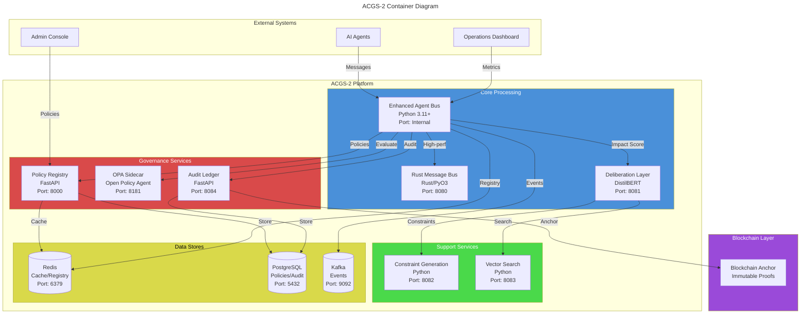
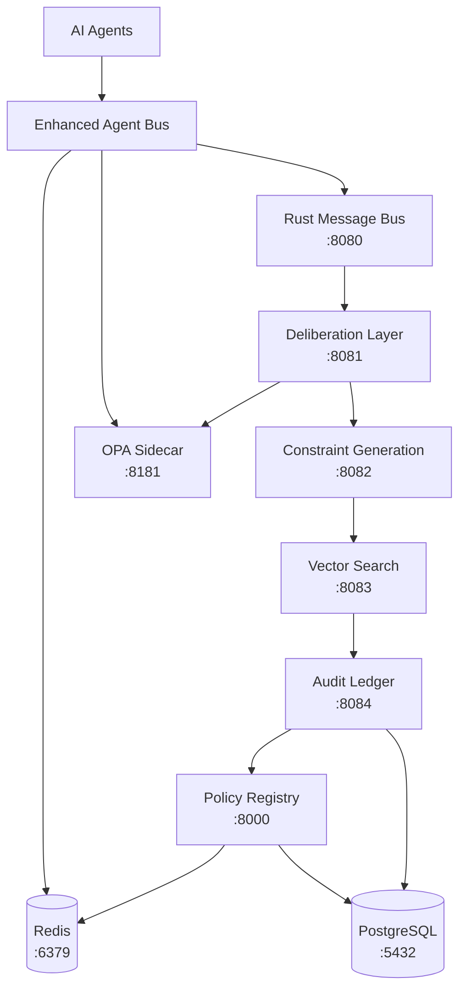
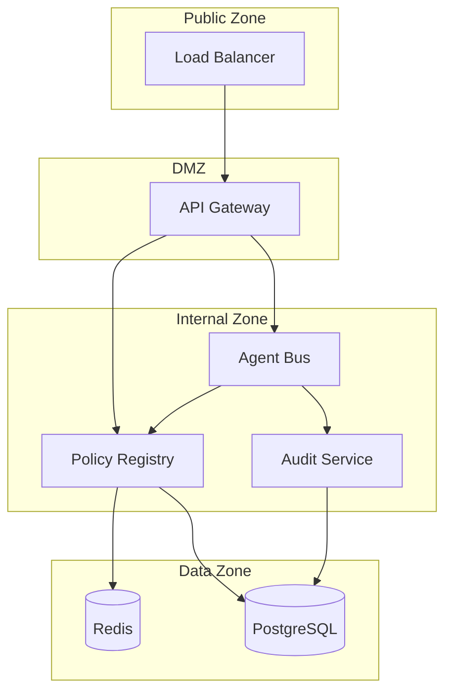

# C4 Container-Level Documentation: ACGS-2 Constitutional Governance System

> Constitutional Hash: cdd01ef066bc6cf2
> Generated: 2025-12-30
> Version: 1.0.0
> C4 Level: Container (Level 2)

## Overview

The ACGS-2 system is deployed as a set of **containerized microservices** that work together to provide constitutional AI governance. This document maps the logical components from the Component documentation to their deployment containers and defines the APIs that connect them.



---

## Container 1: Enhanced Agent Bus

**Purpose:** Central message bus orchestrating multi-agent communication with constitutional compliance

### Container Details

| Attribute | Value |
|-----------|-------|
| **Name** | Enhanced Agent Bus |
| **Technology** | Python 3.11+ / asyncio |
| **Port** | Internal (embedded) |
| **Protocol** | Async Python API |
| **Scaling** | Horizontal via Redis |
| **Health Check** | `/health/live`, `/health/ready` |

### Component Mapping

| Component | Implementation |
|-----------|----------------|
| Core Communication | `EnhancedAgentBus`, `MessageProcessor` |
| Constitutional Validation | `ValidationStrategies`, `validators.py` |
| Processing Strategies | Python, Rust, OPA, Dynamic, Composite |
| Deliberation Layer | `ImpactScorer`, `AdaptiveRouter`, `HITLManager` |
| Governance | `MACIEnforcer`, `PolicyClient`, `OPAClient` |
| Antifragility | `HealthAggregator`, `RecoveryOrchestrator`, `ChaosEngine` |
| ACL | `Z3Adapter`, `OPAAdapter` |

### Environment Variables

| Variable | Default | Description |
|----------|---------|-------------|
| `REDIS_URL` | `redis://localhost:6379` | Redis connection for registry |
| `USE_RUST_BACKEND` | `false` | Enable Rust acceleration |
| `METRICS_ENABLED` | `true` | Prometheus metrics |
| `POLICY_REGISTRY_URL` | `http://localhost:8000` | Policy Registry endpoint |
| `OPA_URL` | `http://localhost:8181` | OPA sidecar endpoint |
| `METERING_ENABLED` | `true` | Enable usage metering |
| `CONSTITUTIONAL_HASH` | `cdd01ef066bc6cf2` | Constitutional hash |

### Dependencies

- **Outbound:** Policy Registry, OPA Sidecar, Audit Ledger, Redis, Kafka (optional)
- **Inbound:** AI Agents (via Python API)

---

## Container 2: Rust Message Bus (Optional)

**Purpose:** High-performance message processing with 10-50x speedup over Python

### Container Details

| Attribute | Value |
|-----------|-------|
| **Name** | rust-message-bus |
| **Technology** | Rust + PyO3 |
| **Port** | 8080 |
| **Protocol** | HTTP/gRPC |
| **Docker Image** | Custom build from `enhanced_agent_bus/rust` |
| **Health Check** | `GET /health` |

### API Specification

```yaml
openapi: 3.0.3
info:
  title: Rust Message Bus API
  version: 1.0.0
paths:
  /health:
    get:
      summary: Health check
      responses:
        '200':
          description: Healthy
          content:
            application/json:
              schema:
                type: object
                properties:
                  status: { type: string, example: "healthy" }

  /process:
    post:
      summary: Process message through Rust backend
      requestBody:
        content:
          application/json:
            schema:
              $ref: '#/components/schemas/AgentMessage'
      responses:
        '200':
          description: Message processed
          content:
            application/json:
              schema:
                $ref: '#/components/schemas/ProcessingResult'

components:
  schemas:
    AgentMessage:
      type: object
      required: [id, type, source, target, content, constitutional_hash]
      properties:
        id: { type: string, format: uuid }
        type: { type: string, enum: [COMMAND, QUERY, RESPONSE, EVENT] }
        source: { type: string }
        target: { type: string }
        content: { type: object }
        constitutional_hash: { type: string, pattern: '^cdd01ef066bc6cf2$' }
        priority: { type: string, enum: [LOW, NORMAL, MEDIUM, HIGH, CRITICAL] }

    ProcessingResult:
      type: object
      properties:
        message_id: { type: string }
        status: { type: string, enum: [DELIVERED, FAILED, EXPIRED] }
        processing_time_ms: { type: number }
```

### Performance Characteristics

| Metric | Value |
|--------|-------|
| **Throughput** | 195,949 msg/s |
| **P99 Latency** | 0.18ms |
| **Speedup vs Python** | 10-50x |

---

## Container 3: Deliberation Layer

**Purpose:** AI-powered review for high-impact governance decisions using DistilBERT

### Container Details

| Attribute | Value |
|-----------|-------|
| **Name** | deliberation-layer |
| **Technology** | Python 3.11+ / PyTorch |
| **Port** | 8081 |
| **Protocol** | HTTP REST |
| **Docker Image** | Custom build from `enhanced_agent_bus/deliberation_layer` |
| **Health Check** | `GET /health` |
| **Depends On** | rust-message-bus |

### API Specification

```yaml
openapi: 3.0.3
info:
  title: Deliberation Layer API
  version: 1.0.0
paths:
  /health:
    get:
      summary: Health check
      responses:
        '200':
          description: Healthy

  /score:
    post:
      summary: Calculate impact score for message
      requestBody:
        content:
          application/json:
            schema:
              $ref: '#/components/schemas/ScoreRequest'
      responses:
        '200':
          description: Impact score calculated
          content:
            application/json:
              schema:
                $ref: '#/components/schemas/ScoreResponse'

  /deliberate:
    post:
      summary: Submit message for deliberation
      requestBody:
        content:
          application/json:
            schema:
              $ref: '#/components/schemas/DeliberationRequest'
      responses:
        '202':
          description: Deliberation started
          content:
            application/json:
              schema:
                $ref: '#/components/schemas/DeliberationResponse'

  /approve/{request_id}:
    post:
      summary: Approve deliberation request (HITL)
      parameters:
        - name: request_id
          in: path
          required: true
          schema: { type: string }
      responses:
        '200':
          description: Request approved

components:
  schemas:
    ScoreRequest:
      type: object
      required: [message, agent_id]
      properties:
        message: { $ref: '#/components/schemas/AgentMessage' }
        agent_id: { type: string }
        context: { type: object }

    ScoreResponse:
      type: object
      properties:
        impact_score: { type: number, minimum: 0, maximum: 1 }
        factors:
          type: object
          properties:
            semantic: { type: number }
            permission: { type: number }
            drift: { type: number }
            volume: { type: number }
        route: { type: string, enum: [FAST_LANE, DELIBERATION_LANE] }

    DeliberationRequest:
      type: object
      properties:
        message: { $ref: '#/components/schemas/AgentMessage' }
        impact_score: { type: number }
        reason: { type: string }

    DeliberationResponse:
      type: object
      properties:
        request_id: { type: string }
        status: { type: string, enum: [PENDING, APPROVED, REJECTED] }
        estimated_wait_time_s: { type: integer }
```

### Impact Scoring Configuration

| Factor | Weight | Description |
|--------|--------|-------------|
| Semantic | 0.30 | Content similarity to sensitive keywords |
| Permission | 0.20 | Requested tool permissions |
| Drift | 0.15 | Behavioral drift detection |
| Volume | 0.10 | Agent request rate |
| Context | 0.10 | Historical context |
| Priority | 0.10 | Message priority level |
| Type | 0.05 | Message type classification |

### Performance Characteristics

| Metric | Value |
|--------|-------|
| **Model** | DistilBERT |
| **Inference Latency** | 10.15ms avg |
| **Throughput** | 98.50 QPS |
| **Impact Threshold** | 0.8 |

---

## Container 4: Policy Registry

**Purpose:** Dynamic constitution policy management with Ed25519 signatures and versioning

### Container Details

| Attribute | Value |
|-----------|-------|
| **Name** | adaptive-governance |
| **Technology** | FastAPI (Python 3.11+) |
| **Port** | 8000 |
| **Protocol** | HTTP REST + WebSocket |
| **Docker Image** | Custom build from `services/policy_registry` |
| **Health Check** | `GET /health/live`, `GET /health/ready` |
| **Depends On** | audit-ledger |

### API Specification

```yaml
openapi: 3.0.3
info:
  title: Policy Registry Service
  description: Dynamic Constitution Policy Management with Ed25519 Signatures
  version: 1.0.0
servers:
  - url: http://localhost:8000/api/v1

paths:
  # Health Endpoints
  /health/live:
    get:
      summary: Kubernetes liveness probe
      responses:
        '200':
          description: Service is alive
          content:
            application/json:
              schema:
                type: object
                properties:
                  status: { type: string, example: "alive" }
                  service: { type: string, example: "policy-registry" }

  /health/ready:
    get:
      summary: Kubernetes readiness probe
      responses:
        '200':
          description: Service is ready
          content:
            application/json:
              schema:
                type: object
                properties:
                  status: { type: string }
                  cache: { type: object }
                  connections: { type: integer }

  # Policy Endpoints
  /policies:
    get:
      summary: List all policies (tenant-scoped)
      tags: [policies]
      parameters:
        - name: status
          in: query
          schema:
            type: string
            enum: [DRAFT, ACTIVE, DEPRECATED, ARCHIVED]
      responses:
        '200':
          description: List of policies
          content:
            application/json:
              schema:
                type: array
                items:
                  $ref: '#/components/schemas/Policy'

    post:
      summary: Create a new policy
      tags: [policies]
      requestBody:
        content:
          application/json:
            schema:
              type: object
              required: [name, content]
              properties:
                name: { type: string }
                content: { type: object }
                format: { type: string, default: "json" }
                description: { type: string }
      responses:
        '201':
          description: Policy created
          content:
            application/json:
              schema:
                $ref: '#/components/schemas/Policy'

  /policies/{policy_id}:
    get:
      summary: Get policy by ID
      tags: [policies]
      parameters:
        - name: policy_id
          in: path
          required: true
          schema: { type: string }
      responses:
        '200':
          description: Policy details
          content:
            application/json:
              schema:
                $ref: '#/components/schemas/Policy'
        '404':
          description: Policy not found

  /policies/{policy_id}/versions:
    get:
      summary: List all versions of a policy
      tags: [policies]
      responses:
        '200':
          description: List of policy versions

    post:
      summary: Create a new policy version with signature
      tags: [policies]
      requestBody:
        content:
          application/json:
            schema:
              type: object
              required: [content, version, private_key_b64, public_key_b64]
              properties:
                content: { type: object }
                version: { type: string }
                private_key_b64: { type: string }
                public_key_b64: { type: string }
                ab_test_group: { type: string }
      responses:
        '201':
          description: Version created

  /policies/{policy_id}/activate:
    put:
      summary: Activate a policy version
      tags: [policies]
      requestBody:
        content:
          application/json:
            schema:
              type: object
              required: [version]
              properties:
                version: { type: string }
      responses:
        '200':
          description: Version activated

  /policies/{policy_id}/verify:
    post:
      summary: Verify policy signature
      tags: [policies]
      requestBody:
        content:
          application/json:
            schema:
              type: object
              required: [version]
              properties:
                version: { type: string }
      responses:
        '200':
          description: Signature verification result
          content:
            application/json:
              schema:
                type: object
                properties:
                  policy_id: { type: string }
                  version: { type: string }
                  signature_valid: { type: boolean }

  /policies/{policy_id}/content:
    get:
      summary: Get policy content for client (with A/B testing)
      tags: [policies]
      parameters:
        - name: client_id
          in: query
          schema: { type: string }
      responses:
        '200':
          description: Policy content

  # Bundle Endpoints
  /bundles:
    get:
      summary: List policy bundles
      tags: [bundles]
      responses:
        '200':
          description: List of bundles

    post:
      summary: Create policy bundle
      tags: [bundles]
      responses:
        '201':
          description: Bundle created

  # Auth Endpoints
  /auth/login:
    post:
      summary: User login
      tags: [auth]
      responses:
        '200':
          description: Login successful

  /auth/refresh:
    post:
      summary: Refresh access token
      tags: [auth]
      responses:
        '200':
          description: Token refreshed

  # Webhook Endpoints
  /webhooks:
    get:
      summary: List webhooks
      tags: [webhooks]
    post:
      summary: Create webhook
      tags: [webhooks]

  # WebSocket
  /ws/policies:
    get:
      summary: WebSocket for real-time policy updates
      tags: [websocket]

components:
  schemas:
    Policy:
      type: object
      properties:
        id: { type: string, format: uuid }
        name: { type: string }
        tenant_id: { type: string }
        status: { type: string, enum: [DRAFT, ACTIVE, DEPRECATED, ARCHIVED] }
        content: { type: object }
        format: { type: string }
        description: { type: string }
        created_at: { type: string, format: date-time }
        updated_at: { type: string, format: date-time }

    PolicyVersion:
      type: object
      properties:
        policy_id: { type: string }
        version: { type: string }
        content: { type: object }
        signature: { type: string }
        public_key: { type: string }
        ab_test_group: { type: string }
        created_at: { type: string, format: date-time }

  securitySchemes:
    bearerAuth:
      type: http
      scheme: bearer
      bearerFormat: JWT

    internalApiKey:
      type: apiKey
      in: header
      name: X-Internal-API-Key

security:
  - bearerAuth: []
```

### Security Features

| Feature | Implementation |
|---------|----------------|
| **Authentication** | JWT with complexity validation |
| **Authorization** | RBAC with roles: tenant_admin, system_admin, auditor |
| **Internal Auth** | X-Internal-API-Key header |
| **Rate Limiting** | Configurable per-endpoint limits |
| **CORS** | Secure CORS with explicit origins |

---

## Container 5: OPA Sidecar

**Purpose:** Open Policy Agent for policy evaluation and constitutional constraint enforcement

### Container Details

| Attribute | Value |
|-----------|-------|
| **Name** | opa |
| **Technology** | Open Policy Agent (Go) |
| **Port** | 8181 |
| **Protocol** | HTTP REST |
| **Docker Image** | `openpolicyagent/opa:latest` |
| **Health Check** | `GET /health` |
| **Config** | `/policies/rego/` mounted |

### API Specification

```yaml
openapi: 3.0.3
info:
  title: OPA Sidecar API
  version: 1.0.0
paths:
  /health:
    get:
      summary: Health check
      responses:
        '200':
          description: Healthy

  /v1/data/{policy_path}:
    post:
      summary: Evaluate policy
      parameters:
        - name: policy_path
          in: path
          required: true
          schema: { type: string }
          example: "constitutional/allow"
      requestBody:
        content:
          application/json:
            schema:
              type: object
              properties:
                input:
                  type: object
                  properties:
                    agent_id: { type: string }
                    action: { type: string }
                    resource: { type: string }
                    constitutional_hash: { type: string }
      responses:
        '200':
          description: Policy decision
          content:
            application/json:
              schema:
                type: object
                properties:
                  result: { type: boolean }

  /v1/policies:
    get:
      summary: List policies
      responses:
        '200':
          description: List of loaded policies

    put:
      summary: Update policy
      responses:
        '200':
          description: Policy updated

  /v1/query:
    post:
      summary: Execute ad-hoc query
      requestBody:
        content:
          application/json:
            schema:
              type: object
              properties:
                query: { type: string }
                input: { type: object }
      responses:
        '200':
          description: Query result
```

### Rego Policy Example

```rego
# Constitutional validation policy
package constitutional

default allow = false

allow {
    input.constitutional_hash == "cdd01ef066bc6cf2"
    valid_agent[input.agent_id]
    valid_action[input.action]
}

valid_agent[agent_id] {
    data.agents[agent_id]
}

valid_action[action] {
    action in data.allowed_actions
}
```

---

## Container 6: Audit Ledger

**Purpose:** Immutable proof of agent interactions and governance decisions with blockchain anchoring

### Container Details

| Attribute | Value |
|-----------|-------|
| **Name** | audit-ledger |
| **Technology** | FastAPI (Python 3.11+) |
| **Port** | 8084 |
| **Protocol** | HTTP REST |
| **Docker Image** | Custom build from `services/audit_service` |
| **Health Check** | `GET /health/live` |
| **Depends On** | vector-search |

### API Specification

```yaml
openapi: 3.0.3
info:
  title: Decentralized Audit Service
  description: Immutable proof of agent interactions and governance decisions
  version: 1.0.0
servers:
  - url: http://localhost:8084

paths:
  /health/live:
    get:
      summary: Liveness check
      responses:
        '200':
          description: Service alive
          content:
            application/json:
              schema:
                type: object
                properties:
                  status: { type: string, example: "alive" }
                  service: { type: string, example: "audit-service" }

  /stats:
    get:
      summary: Get audit ledger statistics
      responses:
        '200':
          description: Ledger statistics
          content:
            application/json:
              schema:
                type: object
                properties:
                  total_entries: { type: integer }
                  total_batches: { type: integer }
                  latest_batch_id: { type: string }
                  blockchain_anchors: { type: integer }

  /record:
    post:
      summary: Record a validation result in the audit ledger
      requestBody:
        content:
          application/json:
            schema:
              type: object
              properties:
                agent_id: { type: string }
                action: { type: string }
                result: { type: string, enum: [ALLOW, DENY] }
                constitutional_hash: { type: string }
                timestamp: { type: string, format: date-time }
                metadata: { type: object }
      responses:
        '200':
          description: Entry recorded
          content:
            application/json:
              schema:
                type: object
                properties:
                  status: { type: string, example: "recorded" }
                  entry_hash: { type: string }
                  timestamp: { type: string, format: date-time }

  /batch/{batch_id}:
    get:
      summary: List all entries in a specific batch
      parameters:
        - name: batch_id
          in: path
          required: true
          schema: { type: string }
      responses:
        '200':
          description: Batch entries
          content:
            application/json:
              schema:
                type: array
                items:
                  $ref: '#/components/schemas/AuditEntry'
        '404':
          description: Batch not found

  /batch/{batch_id}/root:
    get:
      summary: Get the Merkle root of a specific batch
      parameters:
        - name: batch_id
          in: path
          required: true
          schema: { type: string }
      responses:
        '200':
          description: Merkle root
          content:
            application/json:
              schema:
                type: object
                properties:
                  batch_id: { type: string }
                  root_hash: { type: string }

  /verify:
    post:
      summary: Verify an inclusion proof for an entry hash
      requestBody:
        content:
          application/json:
            schema:
              type: object
              required: [entry_hash, merkle_proof, root_hash]
              properties:
                entry_hash: { type: string }
                merkle_proof: { type: array, items: { type: string } }
                root_hash: { type: string }
      responses:
        '200':
          description: Verification result
          content:
            application/json:
              schema:
                type: object
                properties:
                  entry_hash: { type: string }
                  is_valid: { type: boolean }

components:
  schemas:
    AuditEntry:
      type: object
      properties:
        entry_hash: { type: string }
        batch_id: { type: string }
        agent_id: { type: string }
        action: { type: string }
        result: { type: string }
        constitutional_hash: { type: string }
        timestamp: { type: string, format: date-time }
        metadata: { type: object }
```

### Blockchain Anchoring

| Feature | Description |
|---------|-------------|
| **Merkle Tree** | SHA-256 hash tree for batch integrity |
| **Batch Size** | 100 entries per batch |
| **Anchor Interval** | Every 10 minutes or batch full |
| **Supported Chains** | Ethereum, Polygon, Custom |

---

## Container 7: Constraint Generation

**Purpose:** Generate constitutional constraints from high-level governance requirements

### Container Details

| Attribute | Value |
|-----------|-------|
| **Name** | constraint-generation |
| **Technology** | Python 3.11+ |
| **Port** | 8082 |
| **Protocol** | HTTP REST |
| **Docker Image** | Custom build from `services/core/constraint_generation_system` |
| **Health Check** | `GET /health` |
| **Depends On** | deliberation-layer |

### API Specification

```yaml
openapi: 3.0.3
info:
  title: Constraint Generation Service
  version: 1.0.0
paths:
  /health:
    get:
      summary: Health check
      responses:
        '200':
          description: Healthy

  /generate:
    post:
      summary: Generate constraints from requirements
      requestBody:
        content:
          application/json:
            schema:
              type: object
              properties:
                requirements: { type: array, items: { type: string } }
                context: { type: object }
                constitutional_hash: { type: string }
      responses:
        '200':
          description: Generated constraints
          content:
            application/json:
              schema:
                type: object
                properties:
                  constraints: { type: array, items: { $ref: '#/components/schemas/Constraint' } }
                  validation_result: { type: string }

  /validate:
    post:
      summary: Validate constraints against constitutional principles
      requestBody:
        content:
          application/json:
            schema:
              type: object
              properties:
                constraints: { type: array }
                constitutional_hash: { type: string }
      responses:
        '200':
          description: Validation result

components:
  schemas:
    Constraint:
      type: object
      properties:
        id: { type: string }
        type: { type: string, enum: [PERMISSION, PROHIBITION, OBLIGATION] }
        subject: { type: string }
        action: { type: string }
        condition: { type: string }
        priority: { type: integer }
```

---

## Container 8: Vector Search

**Purpose:** Semantic search for policies, constraints, and governance decisions

### Container Details

| Attribute | Value |
|-----------|-------|
| **Name** | vector-search |
| **Technology** | Python 3.11+ / FAISS |
| **Port** | 8083 |
| **Protocol** | HTTP REST |
| **Docker Image** | Custom build from `services/integration/search_platform` |
| **Health Check** | `GET /health` |
| **Depends On** | constraint-generation |

### API Specification

```yaml
openapi: 3.0.3
info:
  title: Vector Search Service
  version: 1.0.0
paths:
  /health:
    get:
      summary: Health check
      responses:
        '200':
          description: Healthy

  /search:
    post:
      summary: Semantic search
      requestBody:
        content:
          application/json:
            schema:
              type: object
              properties:
                query: { type: string }
                top_k: { type: integer, default: 10 }
                filters: { type: object }
      responses:
        '200':
          description: Search results
          content:
            application/json:
              schema:
                type: object
                properties:
                  results:
                    type: array
                    items:
                      type: object
                      properties:
                        id: { type: string }
                        score: { type: number }
                        content: { type: object }

  /index:
    post:
      summary: Index document
      requestBody:
        content:
          application/json:
            schema:
              type: object
              properties:
                id: { type: string }
                content: { type: string }
                metadata: { type: object }
      responses:
        '201':
          description: Document indexed
```

---

## Data Stores

### Redis

| Attribute | Value |
|-----------|-------|
| **Port** | 6379 |
| **Use Cases** | Agent registry, policy cache, session storage |
| **Persistence** | RDB + AOF |
| **Cluster Mode** | Optional for HA |

### PostgreSQL

| Attribute | Value |
|-----------|-------|
| **Port** | 5432 |
| **Use Cases** | Policy storage, audit persistence, user management |
| **Row-Level Security** | Enabled for multi-tenancy |
| **Extensions** | uuid-ossp, pgcrypto |

### Kafka (Optional)

| Attribute | Value |
|-----------|-------|
| **Port** | 9092 |
| **Use Cases** | Event streaming, audit replication, async processing |
| **Topics** | `agent-messages`, `audit-events`, `policy-updates` |

---

## Container Dependency Graph



---

## Deployment Configuration

### Docker Compose

```yaml
version: '3.8'

services:
  rust-message-bus:
    build: ./enhanced_agent_bus/rust
    ports: ["8080:8080"]
    networks: [acgs2-network]
    restart: unless-stopped

  deliberation-layer:
    build: ./enhanced_agent_bus/deliberation_layer
    ports: ["8081:8081"]
    depends_on: [rust-message-bus]
    networks: [acgs2-network]
    restart: unless-stopped

  constraint-generation:
    build: ./services/core/constraint_generation_system
    ports: ["8082:8082"]
    depends_on: [deliberation-layer]
    networks: [acgs2-network]
    restart: unless-stopped

  vector-search:
    build: ./services/integration/search_platform
    ports: ["8083:8083"]
    depends_on: [constraint-generation]
    networks: [acgs2-network]
    restart: unless-stopped

  audit-ledger:
    build: ./services/audit_service
    ports: ["8084:8084"]
    depends_on: [vector-search]
    networks: [acgs2-network]
    restart: unless-stopped

  adaptive-governance:
    build: ./services/policy_registry
    ports: ["8000:8000"]
    depends_on: [audit-ledger]
    networks: [acgs2-network]
    restart: unless-stopped

  opa:
    image: openpolicyagent/opa:latest
    ports: ["8181:8181"]
    volumes:
      - ./policies/rego:/policies
    command: "run --server --addr :8181 /policies"
    networks: [acgs2-network]
    restart: unless-stopped

  redis:
    image: redis:7-alpine
    ports: ["6379:6379"]
    volumes: [redis-data:/data]
    networks: [acgs2-network]
    restart: unless-stopped

  postgres:
    image: postgres:15-alpine
    ports: ["5432:5432"]
    environment:
      POSTGRES_DB: acgs2
      POSTGRES_USER: acgs2
      POSTGRES_PASSWORD: ${POSTGRES_PASSWORD}
    volumes: [postgres-data:/var/lib/postgresql/data]
    networks: [acgs2-network]
    restart: unless-stopped

networks:
  acgs2-network:
    driver: bridge

volumes:
  redis-data:
  postgres-data:
```

---

## Kubernetes Deployment

### Namespace

```yaml
apiVersion: v1
kind: Namespace
metadata:
  name: acgs2
  labels:
    constitutional-hash: cdd01ef066bc6cf2
```

### Deployment Example (Policy Registry)

```yaml
apiVersion: apps/v1
kind: Deployment
metadata:
  name: policy-registry
  namespace: acgs2
spec:
  replicas: 3
  selector:
    matchLabels:
      app: policy-registry
  template:
    metadata:
      labels:
        app: policy-registry
        constitutional-hash: cdd01ef066bc6cf2
    spec:
      containers:
      - name: policy-registry
        image: acgs2/policy-registry:latest
        ports:
        - containerPort: 8000
        env:
        - name: REDIS_URL
          value: "redis://redis-service:6379"
        - name: CONSTITUTIONAL_HASH
          value: "cdd01ef066bc6cf2"
        livenessProbe:
          httpGet:
            path: /health/live
            port: 8000
          initialDelaySeconds: 10
          periodSeconds: 10
        readinessProbe:
          httpGet:
            path: /health/ready
            port: 8000
          initialDelaySeconds: 5
          periodSeconds: 5
        resources:
          requests:
            memory: "256Mi"
            cpu: "250m"
          limits:
            memory: "512Mi"
            cpu: "500m"
```

---

## Security Architecture

### Network Security



### Authentication Flow

1. **External Clients:** JWT via API Gateway
2. **Internal Services:** mTLS + Service Mesh
3. **Database:** Connection pooling with credentials rotation

---

## Performance Summary

| Container | P99 Latency | Throughput | SLA |
|-----------|-------------|------------|-----|
| Enhanced Agent Bus | 0.18ms | 195,949 msg/s | 99.99% |
| Rust Message Bus | 0.15ms | 200,000+ msg/s | 99.99% |
| Deliberation Layer | 10.15ms | 98.50 QPS | 99.9% |
| Policy Registry | <5ms | 1,000 req/s | 99.9% |
| Audit Ledger | <10ms | 500 req/s | 99.9% |
| OPA Sidecar | <2ms | 10,000 req/s | 99.99% |

---

## Next Steps: Context Level

The containers documented here will be placed within the system context in the C4 Context documentation:

1. **External Users:** AI Engineers, Compliance Officers, Administrators
2. **External Systems:** AI Agents, Monitoring Systems, Blockchain Networks
3. **User Journeys:** Agent Registration, Policy Deployment, Audit Query

---

*Constitutional Hash: cdd01ef066bc6cf2*
*Generated: 2025-12-30*
