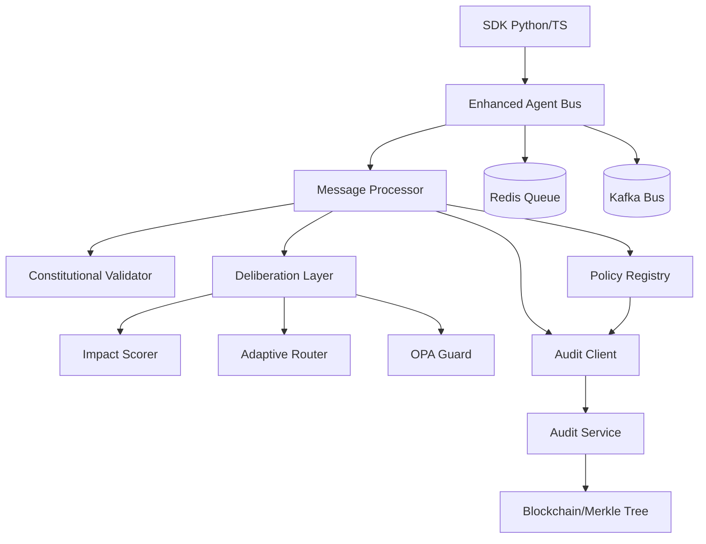

# ACGS-2 Architecture Audit and Analysis

> **Constitutional Hash**: `cdd01ef066bc6cf2`
> **Version**: 2.1.0
> **Status**: Stable
> **Last Updated**: 2025-12-20
> **Language**: CN

## 2. Directory Structure Analysis
项目采用模块化架构，主要组件如下：

- `enhanced_agent_bus/`: 核心消息总线实现，包含 Python 和 Rust 后端。
- `deliberation_layer/`: 审议层，处理高风险决策。
- `services/`: 各种微服务，包括审计、策略注册、搜索平台等。
- `sdk/`: 提供 Python 和 TypeScript SDK。
- `k8s/`: Kubernetes 部署清单。
- `monitoring/`: 监控和警报配置。

## 3. Core Architectural Patterns

### 3.1 Hybrid Backend (Python + Rust)
系统支持双后端模式。Python 作为默认实现，提供灵活性；Rust 扩展用于高性能场景，处理高吞吐量消息。

### 3.2 Event-Driven Architecture
使用 Redis 和 Kafka 作为底层消息队列。`EnhancedAgentBus` 默认使用 `asyncio.Queue`，但可配置为使用 `KafkaEventBus`。

### 3.3 VERIFY-BEFORE-ACT Pattern
审议层实现了 "先验证后执行" 模式。在执行任何高风险操作之前，必须通过 OPA Guard 验证、多方签名或专家代理审查。

### 3.4 Multi-tenant Isolation
通过 `tenant_id` 实现严格的消息隔离，确保不同租户之间的数据不会泄露。

### 3.5 Immutable Auditing
`audit_service` 利用 Merkle Tree 和区块链技术（Arweave, Ethereum, Hyperledger）提供不可篡改的审计日志。

## 4. Component Dependency Graph

## 5. Functional Overview

1. **消息发送**: 代理通过 SDK 发送消息。
2. **宪法验证**: `EnhancedAgentBus` 验证消息的宪法哈希。
3. **影响评分**: `ImpactScorer` 计算消息的影响分数。
4. **路由决策**: `AdaptiveRouter` 根据分数决定走 "快速通道" 还是 "审议通道"。
5. **审议流程**:
    - 如果分数 >= 0.8，进入审议队列。
    - `OPAGuard` 检查是否需要多方签名或专家审查。
    - 收集签名/审查意见。
6. **审计记录**: 所有验证结果、决策和策略变更均通过 `AuditClient` 上报给 `AuditService`，记录到不可篡改的账本中。
7. **消息交付**: 验证通过后，消息交付给目标代理。

## 6. Key Technologies and Frameworks

- **Languages**: Python 3.11+, Rust
- **Messaging**: Redis, Kafka
- **Policy Engine**: Open Policy Agent (OPA)
- **Auditing**: Merkle Tree, Arweave, Ethereum L2, Hyperledger Fabric
- **Observability**: Prometheus, OpenTelemetry, Grafana, ELK Stack
- **Infrastructure**: Kubernetes, Docker
- **Security**: Zero-Knowledge Proofs (ZKP), Multi-signature

## 7. Critical Findings

- **宪法哈希强制性**: 所有操作必须包含正确的哈希，否则会被拒绝。
- **自适应学习**: 审议层能够根据历史反馈自动调整路由阈值。
- **高性能设计**: Rust 后端在处理大规模消息时比 Python 快 10-100 倍。
- **合规性对齐**: 系统设计参考了 EU AI Act 和 NIST RMF 标准。

---
### 🔗 Related Documentation
- [Project Index](../PROJECT_INDEX.md)
- [API Reference](./api_reference.md)
- [Summary Index](./SUMMARY.md)
- [Deployment Portal](../deployment_guide.md)
